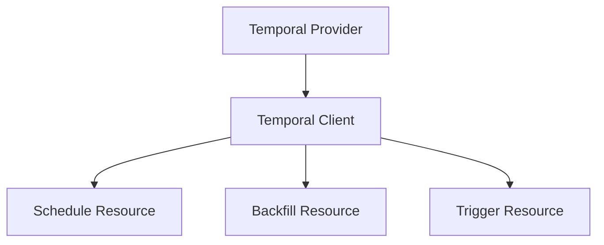
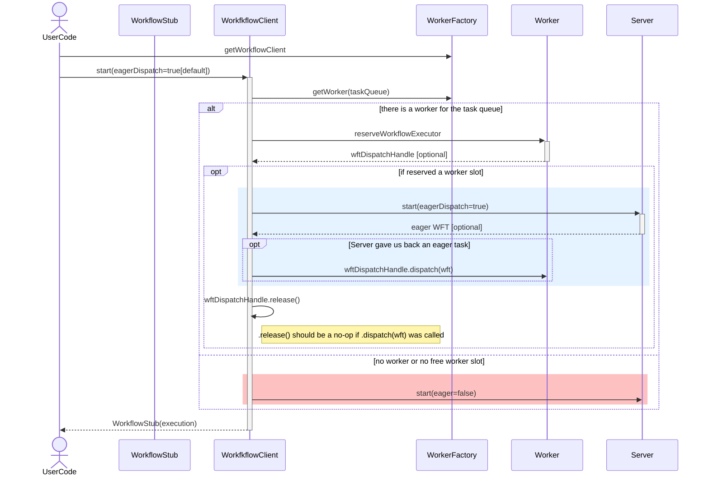

# temporalio/features - Complete Issue Dump

**Generated:** 2026-01-09
**Total Issues:** 382
**Total Upvotes:** 132
**Total Comments:** 676

## Table of Contents

- [Summary](#summary)
- [Top Labels](#top-labels)
- [Issue Index](#issue-index)
- [All Issues](#all-issues)

## Summary

| Metric | Value |
|--------|-------|
| Open Issues | 382 |
| Issues with Upvotes | 41 (11%) |
| Total Upvotes | 132 |
| Total Comments | 676 |

## Top Labels

| Label | Count |
|-------|-------|
| enhancement | 302 |
| Mend: dependency security vulnerability | 30 |
| bug | 13 |
| feature-test | 11 |
| features-platform | 2 |
| cdutrkgkteivjjuckjjvehvtledkdhdigcbk | 1 |
| duplicate | 1 |
| documentation | 1 |

## Issue Index

| # | 👍 | 💬 | Title |
|---|-----|-----|-------|
| [#399](#399) | 15 | 12 | Custom Markers for Workflow History/Timeline |
| [#118](#118) | 8 | 22 | [Feature Request] Declarative schedules: upsert, sync, terraform, etc. |
| [#649](#649) | 14 | 4 | Add support for unit testing workflow versioning |
| [#558](#558) | 3 | 21 | Add WorkflowIdConflictPolicy in child workflow options |
| [#562](#562) | 7 | 6 | [Feature Request] Session support |
| [#231](#231) | 9 | 1 | [Feature Request] Tag workflow_task_execution_failed with error type |
| [#443](#443) | 0 | 17 | [Feature Request] Implement activity task poll limit |
| [#141](#141) | 4 | 9 | User metadata |
| [#434](#434) | 6 | 1 | [Feature Request] Serialization context for codecs and converters |
| [#117](#117) | 4 | 5 | [Feature Request] Upsert TemporalChangeVersion on patch |
| [#51](#51) | 0 | 13 | [Feature Request] Standardize method for listing workflow queries/signals (and maybe other things like registered activities/workflows and other metadata) |
| [#563](#563) | 0 | 12 | Tag workflow_failed counter metric with exception type |
| [#456](#456) | 5 | 2 | [Feature Request] Provide worker status |
| [#257](#257) | 0 | 12 | Update API: support not writing history when calling external failure |
| [#229](#229) | 6 | 0 | [Feature Request] Auto heartbeating |
| [#467](#467) | 1 | 9 | Updates getting dropped after continue as new |
| [#432](#432) | 0 | 11 | [Feature Request] SDK should not return an update handle if the update has not reached the desired state |
| [#426](#426) | 4 | 2 | [Feature Request] API key client option |
| [#69](#69) | 0 | 10 | [Feature Request] Specify reset point in workflow code |
| [#463](#463) | 2 | 5 | Customize activity failure logging (and more?) |
| [#377](#377) | 0 | 9 | Support an option to disable "Close" timeouts for indefinitely running Activities |
| [#119](#119) | 1 | 7 | Add upsertMemo command |
| [#25](#25) | 2 | 5 | [Feature Request] SDK should expose workflow_started metric |
| [#681](#681) | 0 | 8 | [Feature Request] Expose client identity information to the Workflow |
| [#624](#624) | 2 | 4 | Gracefully fail gRPC-message-too-large issues in worker |
| [#363](#363) | 4 | 0 | [Feature Request] Work around gRPC message size limit for task completion |
| [#261](#261) | 0 | 8 | [Feature Request] Write spec for graceful worker shutdown |
| [#223](#223) | 2 | 4 | [Feature Request] SDK metric for activity failure exhausting retries |
| [#31](#31) | 0 | 8 | [Feature Request] Update workflow time when processing queries |
| [#9](#9) | 0 | 8 | [Feature Request] Enhance error message & add error code for expired client cert |
| [#515](#515) | 3 | 1 | Expose start delay in child workflow options |
| [#503](#503) | 3 | 1 | Cancel and Signal should still propagate to child workflows after child CAN'ed |
| [#466](#466) | 0 | 7 | Show update handler and ID in logging context |
| [#422](#422) | 0 | 7 | [Bug] Incomplete Span Reporting: Only RunActivity Spans Sent When Workflow Triggered via scheduler |
| [#322](#322) | 2 | 3 | [Feature Request] Configurable workflow failure exception types |
| [#268](#268) | 0 | 7 | [Feature Request] Add SDK side metrics for Update |
| [#146](#146) | 0 | 7 | [Feature Request] Eagerly initialize workflow/activity counters |
| [#142](#142) | 0 | 7 | [Feature Request] SDKs should send client capabilities in gRPC metadata |
| [#74](#74) | 0 | 7 | Data conversion and encryption for Failures and Stacktrace Query results |
| [#55](#55) | 0 | 7 | [Feature Request] Eager activity dispatch |
| [#16](#16) | 0 | 7 | SDKs should expose history length and size via Workflow info |
| [#475](#475) | 0 | 6 | Set Temporal-Namespace header on every gRPC request |
| [#380](#380) | 2 | 2 | [Feature Request] Every SDK needs a DataDog sample for sending metrics and traces to DataDog agent |
| [#203](#203) | 2 | 2 | [Feature Request] Provide client from an activity |
| [#175](#175) | 3 | 0 | [Feature Request] Endtoend latency metric for cron executions |
| [#98](#98) | 3 | 0 | [Feature Request] New metric: worker_task_slots_total |
| [#28](#28) | 0 | 6 | [Feature Request] Compile and package gRPC client for operator service for all SDKs |
| [#685](#685) | 0 | 5 | [Feature Request] Omit HostedMCPTool headers from serialized activity input? |
| [#590](#590) | 0 | 5 | [Feature Request] Add describe() method to ExternalWorkflowHanlde |
| [#565](#565) | 0 | 5 | Create FIFO mutex mechanism for locking access to some part of a workflow |
| [#561](#561) | 0 | 5 | [Feature Request] Add Mutable Side Effect in Core based SDKs |
| [#392](#392) | 1 | 3 | [Feature Request] Add temporal_worker_task_slots_total metric |
| [#341](#341) | 0 | 5 | [Feature Request] Allow SDKs to create Schedule specs from tctl json structure |
| [#144](#144) | 0 | 5 | [Feature Request] Add gRPC error status code tag to request metrics |
| [#138](#138) | 1 | 3 | [Feature Request] SDKs should have built-in contextual logging |
| [#68](#68) | 0 | 5 | [Feature Request] Create compatible encryption libraries |
| [#568](#568) | 0 | 4 | SDK should provide a native query builder |
| [#564](#564) | 0 | 4 | Provide flag to tell the update handler that the handling is from a re-apply |
| [#539](#539) | 0 | 4 | Add all java metrics to core/python. |
| [#489](#489) | 0 | 4 | Provide sample to show  per workflow interceptor instead of global |
| [#441](#441) | 0 | 4 | [Feature Request] Environment configuration |
| [#348](#348) | 0 | 4 | [Feature Request] Expose AdminService api in sdks |
| [#323](#323) | 0 | 4 | [Feature Request] Support for HTTP CONNECT proxies in SDKs |
| [#253](#253) | 0 | 4 | [Feature Request] Expose build ID via WorkflowInfo. |
| [#243](#243) | 0 | 4 | [Feature Request] Expose schedule specific info in Workflows through a API |
| [#150](#150) | 0 | 4 | Nightly CI against server and SDK `master` |
| [#140](#140) | 0 | 4 | [Feature Request] Expose history size bytes to workflow execution info |
| [#114](#114) | 1 | 2 | [Feature Request] Setting namespace and task queue during replay |
| [#50](#50) | 0 | 4 | [Feature Request] SAGAs |
| [#46](#46) | 0 | 4 | SDKs should default set gRPC max receive message size to 128MB |
| [#702](#702) | 1 | 1 | Add activity_fail_endtoend_latency metric |
| [#655](#655) | 0 | 3 | Support for user groups mapped to Entry ID security groups |
| [#633](#633) | 0 | 3 | Treat Activity start as the first heartbeat time |
| [#557](#557) | 1 | 1 | Add "summary" metadata to scheduled Nexus operations |
| [#525](#525) | 1 | 1 | High-level task queue describe call with default-build-ID stats |
| [#498](#498) | 0 | 3 | Allow listing and filtering workflows based on current failures. |
| [#461](#461) | 0 | 3 | TypeScript - TODO after core |
| [#437](#437) | 0 | 3 | [Feature Request] Support for WorkflowIdConflictPolicy |
| [#417](#417) | 0 | 3 | RestartWorkflow on workflow task failure |
| [#402](#402) | 0 | 3 | [Feature Request] WorkflowService API to update activity rate limit on a task queue |
| [#400](#400) | 0 | 3 | [Feature Request] Workflow-init support |
| [#387](#387) | 0 | 3 | [Feature Request] Whitelist Retryable Error Types |
| [#296](#296) | 1 | 1 | [Feature Request] Workflow Update SDK integration - Public Preview |
| [#234](#234) | 0 | 3 | [Feature Request] Add API to count workflows |
| [#232](#232) | 0 | 3 | [Feature Request] Send SDK name and version on workflow task completion |
| [#221](#221) | 0 | 3 | Unregistered Local Activity should fail Workflow Task |
| [#208](#208) | 0 | 3 | go.temporal.io/features/features-v1.0.0: 2 vulnerabilities (highest severity is: 7.5) - autoclosed |
| [#195](#195) | 0 | 3 | Standardize unregistered Activity Type behavior |
| [#172](#172) | 0 | 3 | [Bug] Flaky tests |
| [#168](#168) | 0 | 3 | [Feature Request] Always flush completed local work when nearing the workflow task timeout |
| [#134](#134) | 0 | 3 | go.temporal.io/sdk-v1.15.0: 2 vulnerabilities (highest severity is: 7.5) - autoclosed |
| [#125](#125) | 0 | 3 | [Feature Request] Provide a way to augment SDK workflow and activity resolution |
| [#96](#96) | 0 | 3 | [Feature Request] Backoff more on resource exhausted error |
| [#89](#89) | 0 | 3 | [Feature Request] mTLS sample with explanations how to connect to Temporal Cloud |
| [#73](#73) | 0 | 3 | [Feature Request] High level API for schedules |
| [#71](#71) | 0 | 3 | Create test containers from sdk-features for each SDK |
| [#59](#59) | 0 | 3 | Wrap gRPC errors |
| [#54](#54) | 0 | 3 | WorkflowInfo.lastCompletionResult |
| [#45](#45) | 0 | 3 | Lazy connectivity for Temporal client and healthCheck |
| [#37](#37) | 0 | 3 | go.temporal.io/sdk-features/features-v1.0.0: 2 vulnerabilities (highest severity is: 7.5) - autoclosed |
| [#3](#3) | 0 | 3 | [Feature Request] Add feature tests for SDK side validation of different server commands |
| [#696](#696) | 1 | 0 | Worker Heartbeating |
| [#675](#675) | 0 | 2 | [Feature Request] Optionally hide server startup banner |
| [#606](#606) | 0 | 2 | Custom metric bucket sizes |
| [#602](#602) | 0 | 2 | Heartbeating activities should be interrupted when the activities are paused. |
| [#594](#594) | 1 | 0 | Natively support musl-based environments |
| [#592](#592) | 1 | 0 | Add `temporalNamespace` tag to all tracing spans |
| [#573](#573) | 0 | 2 | Add fine control for workflow cache eviction |
| [#553](#553) | 0 | 2 | allow reset API to bring new signals as atomic operation |
| [#518](#518) | 0 | 2 | Support upgrading handlers/loops easier |
| [#505](#505) | 1 | 0 | Support "query" when listing schedules |
| [#486](#486) | 0 | 2 | User metadata and workflow metadata query |
| [#483](#483) | 0 | 2 | Wrap GRPC::CANCELED and DEADLINE_EXCEEDED in an SDK Timeout exception for Update |
| [#469](#469) | 0 | 2 | Make start_update users aware that it's synchronous w/ worker. |
| [#464](#464) | 0 | 2 | [Sample] Add samples showing certificate replacement |
| [#455](#455) | 1 | 0 | [Feature Request] Consider TLS handshake failures as worker-fatal errors |
| [#454](#454) | 0 | 2 | Enable users to easily run samples in Cloud |
| [#451](#451) | 0 | 2 | [Feature Request] Feature test confirming unhandled-command update behavior |
| [#439](#439) | 0 | 2 | Stack traces with source mappings in the UI |
| [#394](#394) | 0 | 2 | [Feature Request] Worker tracing should upsert header with outer span |
| [#383](#383) | 0 | 2 | [Feature Request] Dynamic Display Name for Activities in Temporal Go |
| [#379](#379) | 0 | 2 | [Feature Request] Allow Continue-as-New from update handlers |
| [#378](#378) | 0 | 2 | [Feature Request] Timer duration "jitter" out of box utility |
| [#376](#376) | 0 | 2 | Add metric for payload size for input/output/signal of workflow/activity  |
| [#373](#373) | 0 | 2 | Community SDKs? |
| [#343](#343) | 0 | 2 | [Feature Request] Worker Pause |
| [#339](#339) | 0 | 2 | [Feature Request] Add encryption codec to SDK |
| [#336](#336) | 0 | 2 | [Feature Request] Typed Search Attributes |
| [#334](#334) | 0 | 2 | [Feature Request] Worker Slot & Polling Auto-Tuning |
| [#326](#326) | 0 | 2 | [Feature Request] Unified client gRPC retry periods |
| [#321](#321) | 0 | 2 | [Feature Request] SDK name and version on workflow tasks |
| [#293](#293) | 0 | 2 | [Feature Request] Expose UpdateID in an update handler |
| [#258](#258) | 0 | 2 | [Feature Request] Expose TemporalScheduledStartTime search attribute as typed datetime from workflow info |
| [#245](#245) | 0 | 2 | Swift SDK |
| [#227](#227) | 1 | 0 | [Feature Request] Add samples using our versioning API |
| [#216](#216) | 0 | 2 | [Bug] '/home/runner/work/temporal/temporal/./features'. No such file or directory |
| [#206](#206) | 1 | 0 | [Feature Request] Add context propagators in all SDKs |
| [#204](#204) | 1 | 0 | [Feature Request] Expose currently configured payload converter to workflow code |
| [#193](#193) | 0 | 2 | Set identity to `ClientOptions.identity` in all possible client calls |
| [#174](#174) | 0 | 2 | [Feature Request] Consider higher-level activity options for some languages |
| [#164](#164) | 0 | 2 | Support valid proto JSON in SDK replayers |
| [#116](#116) | 0 | 2 | github.com/uber-go/tally/v4-v4.1.1: 2 vulnerabilities (highest severity is: 7.5) |
| [#111](#111) | 0 | 2 | Emit warning log if a supplied client certificate has already expired |
| [#107](#107) | 0 | 2 | Feature specs & tests for whole worker versioning |
| [#92](#92) | 0 | 2 | [Feature Request] Provide details of previous Activity Task failure |
| [#72](#72) | 0 | 2 | [Feature Request] Unify retry logic across all SDKs |
| [#30](#30) | 0 | 2 | Add support for workflow.SignalExternalWorkflowWithStart (will probably also require server changes) |
| [#23](#23) | 0 | 2 | [Bug] git checkout in typescript.yml failing for forked repos |
| [#22](#22) | 0 | 2 | [Feature Request] Spec for expected client behavior when using handle or stub methods |
| [#17](#17) | 0 | 2 | SDK API for describing workflow |
| [#6](#6) | 0 | 2 | SDKs should stop retrying on "Internal" server error |
| [#703](#703) | 0 | 1 | Support setting of Temporal Headers through CLI / GUI |
| [#670](#670) | 0 | 1 | [Feature Request] Reclassify Benign Application errors in OpenTelemetry |
| [#666](#666) | 0 | 1 | Add BadScheduleActivityAttributes failure_reason to temporal_workflow_task_execution_failed metric |
| [#663](#663) | 0 | 1 | Setting headers on LocalActivities not recorded on EventHistory |
| [#652](#652) | 0 | 1 | Plugins to support controlling multiple configuration points at once |
| [#650](#650) | 0 | 1 | Add ability to complete workflow from any line |
| [#639](#639) | 0 | 1 | Add unregistered_activity_invocation |
| [#637](#637) | 0 | 1 | Add Summary to LocalActivityOptions |
| [#619](#619) | 0 | 1 | Expose `StartWorkflowExecutionResponse` fields to `ExecuteWorkflow` API |
| [#616](#616) | 0 | 1 | Warn when the server-provided task start time is fairly different than time SDK begins processing the task |
| [#615](#615) | 0 | 1 | Show retry policy on activity info |
| [#614](#614) | 0 | 1 | Apply application failure logging and metrics behaviour according to `ApplicationErrorCategory` |
| [#608](#608) | 0 | 1 | SDK should try to check if activity is completed before sending last buffered heartbeat |
| [#607](#607) | 0 | 1 | Standardize (where desirable) metrics across SDK languages |
| [#605](#605) | 0 | 1 | Expose root workflow execution |
| [#604](#604) | 0 | 1 | Built-in query responses should use "RawValue" |
| [#597](#597) | 0 | 1 | Research/solve truncating failure stack traces SDK-side so they don't get truncated server side |
| [#596](#596) | 0 | 1 | Expose Workflow cancel cause/reason |
| [#593](#593) | 0 | 1 | Task Queue Priority Options/Annotations |
| [#582](#582) | 0 | 1 | [Features Platform] continue_as_new/continue_as_same feature does not pass against cloud |
| [#580](#580) | 0 | 1 | [Features Platform] PHP schedule/basic fails when run against cloud |
| [#576](#576) | 0 | 1 | Special behavior for Temporal built-in prefixes |
| [#572](#572) | 0 | 1 | Access to workflow/activity instance created by Temporal from workflow/activity context where applicable |
| [#571](#571) | 0 | 1 | Concept of "workflow local" value |
| [#559](#559) | 0 | 1 | Include structured command/event diff/items in non-determinism error |
| [#551](#551) | 0 | 1 | Waiting on update result should auto-skip time in time-skipping environments |
| [#521](#521) | 0 | 1 | Add feature tests for .NET HTTP proxy support |
| [#501](#501) | 0 | 1 | Warn when activities dangle |
| [#500](#500) | 0 | 1 | Workflow-friendly concurrency control |
| [#494](#494) | 0 | 1 | Easy search attributes in dev server |
| [#472](#472) | 0 | 1 | TestWorkflowEnvironment - fail tests on workflow task failures |
| [#471](#471) | 0 | 1 | Worker client TLS certificate update |
| [#442](#442) | 0 | 1 | [Feature Request] Allow activity to specify backoff interval via failure |
| [#440](#440) | 0 | 1 | [Feature Request] Cloud Ops API Client |
| [#430](#430) | 0 | 1 | Add actions metrics dashboard |
| [#428](#428) | 0 | 1 | [Feature Request] Workflow Update Get-Status (and Wait-For-Stage) Capability |
| [#424](#424) | 0 | 1 | [Feature Request] Allow force complete current workflow task when localActivity is completed or failed |
| [#405](#405) | 0 | 1 | [Feature Request] Disable eager activities if task queue rate limits is set |
| [#397](#397) | 0 | 1 | [Feature Request] Do not require other Activity timeouts when Heartbeat timeout is specified |
| [#396](#396) | 0 | 1 | [Feature Request] Use macOS M1/ARM runners for all SDK CI  |
| [#395](#395) | 0 | 1 | Rust SDK Support |
| [#388](#388) | 0 | 1 | [Feature Request] Worker dynamic config |
| [#381](#381) | 0 | 1 | [Feature Request] Expose API to list enabled features for a namespace  |
| [#367](#367) | 0 | 1 | go.temporal.io/api-v1.24.0: 1 vulnerabilities (highest severity is: 7.5) - autoclosed |
| [#352](#352) | 0 | 1 | google.golang.org/grpc-v1.57.0: 1 vulnerabilities (highest severity is: 7.5) - autoclosed |
| [#338](#338) | 0 | 1 | Feature Request] Add delay to workflow start options |
| [#333](#333) | 0 | 1 | github.com/temporalio/features/features-v1.0.0: 2 vulnerabilities (highest severity is: 7.5) - autoclosed |
| [#331](#331) | 0 | 1 | [Feature Request] Use codecs for headers in all SDKs |
| [#304](#304) | 0 | 1 | common-1.5.2.tgz: 1 vulnerabilities (highest severity is: 5.5) - autoclosed |
| [#273](#273) | 0 | 1 | [Feature Request] Temporal exceptions from converters and codecs should fail the workflow not task |
| [#266](#266) | 0 | 1 | [Feature Request]  Update feature tests |
| [#256](#256) | 0 | 1 | [Feature Request] Return input when describing WE |
| [#249](#249) | 0 | 1 | worker-1.5.2.tgz: 1 vulnerabilities (highest severity is: 7.5) - autoclosed |
| [#248](#248) | 0 | 1 | go.temporal.io/api-v1.16.0: 1 vulnerabilities (highest severity is: 7.5) - autoclosed |
| [#242](#242) | 0 | 1 | [Feature Request] Eager Workflow Task Dispatch on SDKs |
| [#228](#228) | 0 | 1 | [Feature Request] Test workflow changes are deterministic/nondeterministic |
| [#219](#219) | 0 | 1 | [Feature Request] SDK workers should not intentionally time out failed workflow tasks if server supports backoff |
| [#215](#215) | 0 | 1 | go.temporal.io/sdk-v1.19.0: 1 vulnerabilities (highest severity is: 7.5) - autoclosed |
| [#201](#201) | 0 | 1 | [Feature Request] Support dynamic workflows, activities, signals, queries, and updates in all SDKs |
| [#200](#200) | 0 | 1 | [Feature Request] Support a "version marker" like approach for internal SDK use for every workflow |
| [#199](#199) | 0 | 1 | [Feature Request] Opt-in to having stack trace query use custom data converter |
| [#198](#198) | 0 | 1 | [Feature Request] Fail on client without retry if gRPC message size exceeds 4MB |
| [#197](#197) | 0 | 1 | [Feature Request] Standard mechanism for versioning SDK logic |
| [#181](#181) | 0 | 1 | [Bug] [Harness] Ensure all started workflows always have a timeout |
| [#179](#179) | 0 | 1 | [Feature Request] Add non-memoized versioning API |
| [#178](#178) | 0 | 1 | [Feature Request] Add GetSignalInfo |
| [#177](#177) | 0 | 1 | [Feature Request] Don't allow apis that generate commands to be invoked from side effects |
| [#170](#170) | 0 | 1 | [Feature Request] Worker enforcement of activity timeouts |
| [#167](#167) | 0 | 1 | [Feature Request] Align local_activity_execution_failed across SDKs |
| [#149](#149) | 0 | 1 | [Feature Request] Expose `reason` field when requesting WF cancels from clients |
| [#145](#145) | 0 | 1 | [Feature Request] Workfow sleep/await with 0 duration |
| [#137](#137) | 0 | 1 | [Feature Request] Run a stress test to understand implications of eager activity dispatch |
| [#136](#136) | 0 | 1 | temporalio-0.1b1-cp37-abi3-manylinux2014_x86_64.manylinux_2_17_x86_64.whl: 1 vulnerabilities (highest severity is: 5.5) - autoclosed |
| [#127](#127) | 0 | 1 | go.temporal.io/server-v1.17.4: 4 vulnerabilities (highest severity is: 7.5) - autoclosed |
| [#123](#123) | 0 | 1 | [Feature Request] SDK connections should enable keep-alive by default and allow keep-alive customization |
| [#115](#115) | 0 | 1 | temporal-sdk-1.15.0.jar: 5 vulnerabilities (highest severity is: 7.5) - autoclosed |
| [#109](#109) | 0 | 1 | gson-2.8.8.jar: 2 vulnerabilities (highest severity is: 7.7) - autoclosed |
| [#108](#108) | 0 | 1 | temporal-sdk-1.14.0.jar: 1 vulnerabilities (highest severity is: 7.5) - autoclosed |
| [#88](#88) | 0 | 1 | temporalio-1.0.0-rc.1.tgz: 1 vulnerabilities (highest severity is: 7.5) - autoclosed |
| [#86](#86) | 0 | 1 | [Feature Request] Add an http header indicating temporal namespace for each request |
| [#84](#84) | 0 | 1 | Go: Implement opt-in to build-id based versioning flag |
| [#78](#78) | 0 | 1 | [Feature Request] Implement signal features |
| [#77](#77) | 0 | 1 | [Feature Request] Implement activity features |
| [#75](#75) | 0 | 1 | [Feature Request] Friendly version of listWorkflowExecutions |
| [#70](#70) | 0 | 1 | temporalio-1.0.0-rc.0.tgz: 1 vulnerabilities (highest severity is: 7.5) - autoclosed |
| [#67](#67) | 0 | 1 | ✅ Activity Heartbeat Throttling |
| [#66](#66) | 0 | 1 | [Feature Request] Allow running failure fields through codec |
| [#65](#65) | 0 | 1 | [Feature Request] Attach info about unresolved commands to WFT completions |
| [#60](#60) | 0 | 1 | github.com/stretchr/testify-v1.7.0: 1 vulnerabilities (highest severity is: 7.5) - autoclosed |
| [#56](#56) | 0 | 1 | temporalio-0.21.1.tgz: 1 vulnerabilities (highest severity is: 7.5) - autoclosed |
| [#47](#47) | 0 | 1 | [Feature Request] SDKs should differentiate between `NamespaceInvalidState` and `NamespaceNotFound` errors |
| [#44](#44) | 0 | 1 | github.com/temporalio/temporal-v1.16.0: 3 vulnerabilities (highest severity is: 7.5) - autoclosed |
| [#38](#38) | 0 | 1 | github.com/temporalio/temporal-3b8f6932d9fcb12c58cba0d461ac72a30fc9bb86: 3 vulnerabilities (highest severity is: 7.5) - autoclosed |
| [#36](#36) | 0 | 1 | tsconfig-paths-3.12.0.tgz: 1 vulnerabilities (highest severity is: 5.0) - autoclosed |
| [#35](#35) | 0 | 1 | logback-classic-1.2.6.jar: 1 vulnerabilities (highest severity is: 6.6) - autoclosed |
| [#34](#34) | 0 | 1 | go.temporal.io/server-v1.13.1-0.20211213192924-3c44e562605c: 4 vulnerabilities (highest severity is: 7.5) - autoclosed |
| [#33](#33) | 0 | 1 | temporal-sdk-1.5.0.jar: 3 vulnerabilities (highest severity is: 7.5) - autoclosed |
| [#19](#19) | 0 | 1 | [Feature Request] Call ResetStickyTaskQueue on worker shutdown |
| [#12](#12) | 0 | 1 | [Feature Request] Add a metric to track certificate expiration |
| [#4](#4) | 0 | 1 | [Feature Request] Rename features/ to spec/ |
| [#715](#715) | 0 | 0 | Custom Metadata Support for Workers in Temporal UI and CLI |
| [#712](#712) | 0 | 0 | [Bug] Use `pnpm` when building TS worker from source |
| [#706](#706) | 0 | 0 | Support non-workflow activities |
| [#705](#705) | 0 | 0 | Warn if SDK detects a workflow history over a certain size |
| [#701](#701) | 0 | 0 | Warn if the SDK tried to send a payload above a specific size |
| [#695](#695) | 0 | 0 | Set `GrpcMessageTooLarge` as `failure_reason` for workflow task failed metric |
| [#694](#694) | 0 | 0 | Allow overriding of the Worker Deployment Version when invoking a Child Workflow. |
| [#692](#692) | 0 | 0 | Nexus samples and docs should not encourage using request ID for workflow ID |
| [#691](#691) | 0 | 0 | Deployment feature tests failing in Go docker build |
| [#687](#687) | 0 | 0 | Assume TLS enabled if API key provided in SDKs |
| [#684](#684) | 0 | 0 | Provide plugin implementations for contrib/extra integrations |
| [#683](#683) | 0 | 0 | Add Nexus CONFLICT and REQUEST_TIMEOUT handler error types |
| [#682](#682) | 0 | 0 | Remove fetchResult and fetchInfo from Nexus SDKs |
| [#680](#680) | 0 | 0 | Remove mentions of tctl from the SDKs |
| [#678](#678) | 0 | 0 | Nexus serialization context |
| [#677](#677) | 0 | 0 | [Feature request] Idempotency token for activity |
| [#676](#676) | 0 | 0 | Append some details to error messages |
| [#674](#674) | 0 | 0 | [TS] Expose Temporal Nexus operation info to Temporal Nexus operation authors |
| [#673](#673) | 0 | 0 | SDKs should expose Nexus request deadline |
| [#672](#672) | 0 | 0 | Ensure tests exist to confirm custom slot supplier slot info has proper fields |
| [#671](#671) | 0 | 0 | Ensure gRPC binary metadata keys are supported by clients |
| [#669](#669) | 0 | 0 | Add ability to set timer options like summary on higher-level timer calls |
| [#665](#665) | 0 | 0 | Nexus samples and dev guide docs to map a Nexus Operation input to multiple Workflow arguments |
| [#664](#664) | 0 | 0 | Nexus samples and dev guide docs for sync Nexus ops that use signal, signal-with-start, update, query, ... |
| [#658](#658) | 0 | 0 | Nexus operation testing environment |
| [#657](#657) | 0 | 0 | Provide extra/advanced details on start/execute workflow |
| [#656](#656) | 0 | 0 | Make metrics concerning unregistered activities (and maybe other things) consistent |
| [#651](#651) | 0 | 0 | Add metric to indicate that poll rate is limited by client |
| [#648](#648) | 0 | 0 | Write tests for worker shutdown |
| [#636](#636) | 0 | 0 | Add task_queue information to long_request_latency |
| [#635](#635) | 0 | 0 | Provide last result and last failure to workflows |
| [#634](#634) | 0 | 0 | Add failure_reason=UnhandledCommand to workflow_task_execution_failed metric |
| [#632](#632) | 0 | 0 | Add StartDelay to ContinueAsNewOptions |
| [#620](#620) | 0 | 0 | SDK support for activity reset |
| [#613](#613) | 0 | 0 | Explore ways of testing pre-patched code in SDKs |
| [#612](#612) | 0 | 0 | Remove pinning of @grpc/grpc-js in the TS harness |
| [#610](#610) | 0 | 0 | Add summary to Nexus operation |
| [#609](#609) | 0 | 0 | Initial Nexus implementation |
| [#603](#603) | 0 | 0 | "RawValue" support for non-converted payloads |
| [#598](#598) | 0 | 0 | Research and implement a way to test and make sure history is still compatible across SDK versions |
| [#595](#595) | 0 | 0 | Add features test for cloud API key over data plane |
| [#591](#591) | 0 | 0 | Uniformize `patched()` API in all SDKs |
| [#589](#589) | 0 | 0 | Add utility function to classify exceptions as failing the workflow vs failing the task |
| [#588](#588) | 0 | 0 | Allow UI port to be specified in programmatic dev server |
| [#585](#585) | 0 | 0 | Support Ruby in this features repo |
| [#581](#581) | 0 | 0 | [Features Platform] Remove TEMPORAL_FEATURES_DISABLE_WORKFLOW_COMPLETION_CHECK workaround |
| [#566](#566) | 0 | 0 | Support full query failure structure |
| [#560](#560) | 0 | 0 | Add `WorkflowExecutionInfo.pendingActivities` |
| [#550](#550) | 0 | 0 | Allow queries to target a certain event number in replayers (and maybe other interactions) |
| [#548](#548) | 0 | 0 | Workflow annotations for versioning |
| [#542](#542) | 0 | 0 | Call ShutdownWorker API on worker shutdown |
| [#538](#538) | 0 | 0 | Allow SDKs to support connecting to multiple endpoints for Multi-region Namespaces |
| [#534](#534) | 0 | 0 | Bidirectional linking of workflows through activity |
| [#529](#529) | 0 | 0 | Centralize dynamic config |
| [#522](#522) | 0 | 0 | Support local_activity_X based metrics in Core-based SDKs |
| [#512](#512) | 0 | 0 | Support schedule search attribute update |
| [#506](#506) | 0 | 0 | Support replaying past last successful workflow task completion |
| [#499](#499) | 0 | 0 | Warn or error when update handlers dangle across CAN or workflow exit |
| [#492](#492) | 0 | 0 | Feature test for Update + Workflow Reset  |
| [#487](#487) | 0 | 0 | GetWorkflowHistory payload size exceeds limit for a single page |
| [#482](#482) | 0 | 0 | Decide/apply/clarify ambiguous failure behavior in signals and workflows |
| [#481](#481) | 0 | 0 | Do not set workflow completion until after all coroutines have settled in the task |
| [#477](#477) | 0 | 0 | Call describe namespace on worker start |
| [#470](#470) | 0 | 0 | Tests to ensure dev-server/test-server processes properly shut down |
| [#468](#468) | 0 | 0 | Full history decode utility |
| [#462](#462) | 0 | 0 | Expose attempts in `ActivityFailure` |
| [#460](#460) | 0 | 0 | StickyTaskQueueDrainTimeout |
| [#446](#446) | 0 | 0 | [Feature Request] provide a way to create a Temporal schedule which runs every last day of the month |
| [#444](#444) | 0 | 0 | [Feature Request] Run history compatibility checks for all SDKs and all features |
| [#431](#431) | 0 | 0 | [Feature Request] SDK clients should set a UpdateID on any update request even if the user did not specify one. |
| [#429](#429) | 0 | 0 | Add SLA dashboard using SDK/client metrics |
| [#427](#427) | 0 | 0 | [Feature Request] Unknown SDK flag should behave consistently across SDK |
| [#421](#421) | 0 | 0 | [Bug] Why doesn't this repo trigger TS barfing on null activity timeouts? |
| [#419](#419) | 0 | 0 | [Feature Request] Expose next retry delay on Application Failure in all SDKs |
| [#384](#384) | 0 | 0 | logback-classic-1.2.9.jar: 2 vulnerabilities (highest severity is: 7.5) |
| [#368](#368) | 0 | 0 | [Feature Request] Add an Eager Workflow Start test for Cloud |
| [#366](#366) | 0 | 0 | xunit.assert.2.5.3.nupkg: 2 vulnerabilities (highest severity is: 7.5) |
| [#353](#353) | 0 | 0 | [Features Platform] Make it possible to configure client interceptors in typescript |
| [#330](#330) | 0 | 0 | [Bug] bugs/go/child_workflow_cancel_panic flaky |
| [#325](#325) | 0 | 0 | [Feature Request] Support reason for Cancel and Terminate workflow API |
| [#315](#315) | 0 | 0 | [Bug] Stale workflows in sdk-ci.a2dd6 namespace |
| [#314](#314) | 0 | 0 | [Feature Request] Add Client method for non blocking try-get-result |
| [#305](#305) | 0 | 0 | [Feature Request] Block when workflow commands are produced in a read only context |
| [#294](#294) | 0 | 0 | Safe Deploys API - Public Preview |
| [#290](#290) | 0 | 0 | [Feature Request] Add feature that tests for update deduplication |
| [#288](#288) | 0 | 0 | guava-31.1-jre.jar: 1 vulnerabilities (highest severity is: 7.1) |
| [#279](#279) | 0 | 0 | [Feature Request] Harness history checker should have easier way to ignore new fields |
| [#254](#254) | 0 | 0 | json-path-2.6.0.jar: 2 vulnerabilities (highest severity is: 7.5) |
| [#241](#241) | 0 | 0 | [Feature Request] Support LastHeartbeatDetails on RespondActivityTaskFailedRequest |
| [#240](#240) | 0 | 0 | [Feature Request] Ensure every SDK fails the workflow not the task on invalid workflow argument |
| [#233](#233) | 0 | 0 | [Feature Request] Replayer API should return result of replayed workflow |
| [#226](#226) | 0 | 0 | [Feature Request] .NET SDK Support |
| [#222](#222) | 0 | 0 | workflow_completed and workflow_continue_as_new counters should be logged after a successful reporting to the server |
| [#218](#218) | 0 | 0 | [Feature Request] SDKs should not fatal the worker on any error without a retry period |
| [#210](#210) | 0 | 0 | [Bug] TS tests are flaky |
| [#202](#202) | 0 | 0 | [Feature Request] Test schedule workflows have all required information set in their execution |
| [#194](#194) | 0 | 0 | [Feature Request] Schedule timers even if duration is <= 0 |
| [#184](#184) | 0 | 0 | [Bug] Python features/query/timeout_due_to_no_active_workers should check for deadline exceeded |
| [#182](#182) | 0 | 0 | Document that list workflow/schedule calls are eventually consistent in specs |
| [#166](#166) | 0 | 0 | [Feature Request] Support --version latest |
| [#160](#160) | 0 | 0 | [Feature Request] Workflow only worker specs |
| [#159](#159) | 0 | 0 | [Feature Request] Update encryption samples to encrypt failure attributes |
| [#155](#155) | 0 | 0 | [Feature Request] Failure Converter |
| [#153](#153) | 0 | 0 | [Feature Request] Schedule API features |
| [#143](#143) | 0 | 0 | [Feature Request] SDK should fail a workflow task if it receives non-ignorable events that it doesn't handle |
| [#133](#133) | 0 | 0 | [Feature Request] Add spec tests for workflow handles with different run ID types |
| [#130](#130) | 0 | 0 | [Feature Request] Ability to intercept client result fetching |
| [#122](#122) | 0 | 0 | Set larger maxInboundMetadataSize to accommodate unbounded Server error messages |
| [#121](#121) | 0 | 0 | [Feature Request] No history JSON conversion if already done |
| [#113](#113) | 0 | 0 | [Documentation] Testing feedback request |
| [#105](#105) | 0 | 0 | [Feature Request] Auto timeout activity after heartbeat timeout |
| [#104](#104) | 0 | 0 | [Feature Request] Support "preparing" an SDK to run |
| [#103](#103) | 0 | 0 | [Feature Request] PHP harness |
| [#94](#94) | 0 | 0 | [Feature Request] Group Temporal-specific log tags |
| [#93](#93) | 0 | 0 | [Feature Request] Prefix span and span tag names  |
| [#91](#91) | 0 | 0 | [Feature Request] SDKs should set `supported-features` header |
| [#83](#83) | 0 | 0 | [Feature Request] Implement timer features |
| [#82](#82) | 0 | 0 | [Feature Request] Implement query features |
| [#81](#81) | 0 | 0 | [Feature Request] Implement data_converter features |
| [#80](#80) | 0 | 0 | [Feature Request] Implement continue_as_new features |
| [#79](#79) | 0 | 0 | [Feature Request] Implement child_workflow features |
| [#76](#76) | 0 | 0 | [Feature Request] Friendly version of `getWorkflowExecutionHistory` |
| [#53](#53) | 0 | 0 | Metrics for consecutive workflow and activity task failures |
| [#42](#42) | 0 | 0 | [Feature Request] Add higher-level Activity abstractions |
| [#29](#29) | 0 | 0 | Add `first_execution_run_id` to APIs where it’s missing |
| [#27](#27) | 0 | 0 | [Feature Request] Unified gRPC retry logic |
| [#13](#13) | 0 | 0 | [Feature Request] SDK should allow configurable long-poll timeouts |
| [#11](#11) | 0 | 0 | [Feature Request] SDKs users should have a way to inject new certificates to a connection instance |
| [#10](#10) | 0 | 0 | Confirm behavior of manually returning cancellation errors in all SDKs from workfows and activities |
| [#8](#8) | 0 | 0 | [Feature Request] SDKs should backoff aggressively on `ResourceExhaustedError` |
| [#7](#7) | 0 | 0 | SDKs should use `getSystemInfo` request to determine server capabilities |

---

## All Issues

Issues are sorted by priority score (upvotes × 2 + comments).

---

<a id="399"></a>

### #399: Custom Markers for Workflow History/Timeline

| Field | Value |
|-------|-------|
| **URL** | https://github.com/temporalio/features/issues/399 |
| **State** | OPEN |
| **Author** | freisenhauer |
| **Created** | 2024-01-10 14:08:09.000 UTC (2 years ago) |
| **Updated** | 2024-07-15 17:31:36.000 UTC |
| **Upvotes** | 15 |
| **Comments** | 12 |
| **Priority Score** | 42 |
| **Labels** | enhancement |
| **Assignees** | None |
| **Milestone** | None |
| **Reactions** | 👍 15 |

#### Description

**Is your feature request related to a problem? Please describe.**
I'd like to have the possibility to include workflow specific information like decisions or pivotal events inside history and/or timeline. I tried to Signal the same workflow without actually doing anything with the signal, but that's not permitted as described inside [this issue](https://github.com/temporalio/temporal/issues/682). Currently, as a workaround, we expose those information inside queries, but nothing indicates someone (trying to find an error) that there is a query that can be used and these information would likely be booleans in most cases and therefore the queries actually don't seem to be handy for this demand. 

**Describe the solution you'd like**
A way to record custom `MarkerRecorded` Events that are opaque for the server would be a suitable solution.

**Describe alternatives you've considered**
As mentioned before: Signaling (and ignoring) the own workflow which doesn't work either

**Additional context**
Add any other context or screenshots about the feature request here.


#### Comments (12)

<details>
<summary><strong>Quinn-With-Two-Ns</strong> commented on 2024-01-10 14:21:17.000 UTC</summary>

Moving to features since this is not a Go SDK specific issue.

Can you give some more detail on what kind of information these "markers" contain? I wonder if you have tried [UpsertMemo](https://pkg.go.dev/go.temporal.io/sdk/workflow#UpsertMemo)?

</details>

<details>
<summary><strong>freisenhauer</strong> commented on 2024-01-10 14:57:28.000 UTC</summary>

Lets consider a workflow like 

```
[...]
if shouldDoSomething() {
  recordShouldDoSomething()
  doSomething()
}
[...]
```

then `recordShouldDoSomething()` should add information that is (easily) noticable inside Temporal UI. Ideally, directly inside history/timeline. 

I just tried to store some information inside memo, but I can't find where it's displayed in UI. Through network console i can see that my test memo information are stored and returned by API but it's not displayed anywhere. Only event in history i've noticed is `WorkflowPropertiesModified` but it's payload is `undefined` and it's not showing inside timeline.

One can state that `doSomething()` will likely do something that leaves events inside history, but what if we turn this arround ? 

```
[...]
if shouldDoSomething() {
  doSomething()
}
recordDidNotDoThing()
[...]
```

That shows more clearly that one can be interested in why something was not done.

</details>

<details>
<summary><strong>freisenhauer</strong> commented on 2024-01-10 15:00:37.000 UTC</summary>

Just to be sure: The `MarkerRecorded` i've mentioned is the one that is documented in [Temporal Events reference](https://docs.temporal.io/references/events#markerrecorded) and hence should be already available (thats why i opened the issue inside go sdk).

</details>

<details>
<summary><strong>cretz</strong> commented on 2024-01-10 15:01:33.000 UTC</summary>

This seems like a reasonable ask to me. This is like #141 but a whole new event instead of just metadata on an existing command/event. We have resisted log shipping of course, but someone wanting to add a "user-defined event" just for viewing purposes I think seems reasonable. I have ideas about implementation, but yes it should probably be in history as a marker.

Reactions: 👍 2

</details>

<details>
<summary><strong>Quinn-With-Two-Ns</strong> commented on 2024-01-10 15:27:43.000 UTC</summary>

Yeah if we want timeline support memo is no appropriate it would need to be some custom marker that the UI is also aware of.

>Just to be sure: The MarkerRecorded i've mentioned is the one that is documented in [Temporal Events reference](https://docs.temporal.io/references/events#markerrecorded) and hence should be already available (thats why i opened the issue inside go sdk).

No SDK provides an API to directly write custom markers. They are meant to be used internally by the SDKs to implement certain features  like SideEffects and Local Activities and this may be another one. 

Reactions: 👍 3

</details>

<details>
<summary><strong>freisenhauer</strong> commented on 2024-01-11 06:21:54.000 UTC</summary>

Okay, understandable. 

Sounds like in general the idea meets with approval, but needs amendments through to a greater part of the stack, right ?

> They are meant to be used internally by the SDKs to implement certain features like SideEffects and Local Activities and this may be another one.

This leaves me hopeful, we at least don't have to do something to the temporal server.

Without knowing your exact contribution guidelines or the code I could at least _offer_ support in this concern (to whatever extend) 😆 

</details>

<details>
<summary><strong>cretz</strong> commented on 2024-03-05 23:03:54.000 UTC</summary>

After some internal discussion on this feature, it was decided we are not doing it with markers at least not at this time. The problem with "note markers" is that it encourages extreme history growth. Alternative approaches such as metadata on task completion, or metadata on specific commands (e.g. #141), or capturing this info as a state to be provided upon query (i.e. returns a set of "notes" and the event IDs they are sequenced within) is safer from a history perspective than recording entire events.

</details>

<details>
<summary><strong>freisenhauer</strong> commented on 2024-07-15 11:03:25.000 UTC</summary>

Could you explain why you think this is unsafer than e.g. introducing a basically noop Activity that gets a payload with description and is only used to be viewed in history ? What is stopping one from doing this and why should this decision be made by the product and not the developer using it ? 

Doing things in (endless) loop is also something that can lead to history growth and yet it is even documented, how to handle this in practice. This does not really seem to be consistent with previous decisions and/or documented use cases.

</details>

<details>
<summary><strong>mfateev</strong> commented on 2024-07-15 12:52:00.000 UTC</summary>

We don't want to encourage behavior that would lead to performance issues. Most users don't think about the cost of these features and then get surprised that recovery takes longer. 

At the same time we absolutely need to solve the use case of waiting for workflow reaching a certain state. The current workaround is to use an update for this. 

</details>

<details>
<summary><strong>freisenhauer</strong> commented on 2024-07-15 17:15:21.000 UTC</summary>

Okay, I can understand that this does not have highest prio at the moment. Could you explain what you mean by "use an update for this" ? 

</details>

<details>
<summary><strong>mfateev</strong> commented on 2024-07-15 17:27:22.000 UTC</summary>

i meant waiting for workflow to reach a specific state.

</details>

<details>
<summary><strong>freisenhauer</strong> commented on 2024-07-15 17:31:35.000 UTC</summary>

ah okay, I understand.

</details>


---

<a id="118"></a>

### #118: [Feature Request] Declarative schedules: upsert, sync, terraform, etc.

| Field | Value |
|-------|-------|
| **URL** | https://github.com/temporalio/features/issues/118 |
| **State** | OPEN |
| **Author** | lorensr (Loren ☺️) |
| **Created** | 2022-08-17 04:39:05.000 UTC (3y 4m ago) |
| **Updated** | 2025-04-07 17:30:33.000 UTC |
| **Upvotes** | 8 |
| **Comments** | 22 |
| **Priority Score** | 38 |
| **Labels** | enhancement |
| **Assignees** | None |
| **Milestone** | None |
| **Reactions** | 👍 8 |

#### Description

### Is your feature request related to a problem? Please describe.

<!-- A clear and concise description of what the problem is. Ex. I'm always frustrated when [...] -->

Currently, have to run tctl or a client sdk script to start and update Schedules. Is suboptimal for maintainability (compared to eg terraform/declarative infra).


### Describe the solution you'd like

<!-- A clear and concise description of what you want to happen. SCREENSHOTS OR CODE SAMPLES ARE VERY HELPFUL -->

Declare what schedule a workflow should be run at, in code or markup file, and automatically upsert it.

From @dnr:

As a user, the main "higher level" thing I want in a schedule api is declarative schedules: I shouldn't have to use an imperative api to work with something that should just "be there". I want to annotate a workflow with a schedule and have it "take effect" when I deploy the worker.

This needs some design work and maybe we should do it in a meeting, but a few things to consider to start:

- The schedule that starts a workflow could be specified as an annotation on that one, or a separate object, or both options.
- The schedule id could be implicit or explicit.
- Deploying a worker with a changed schedule should be able to change the calendar spec and other stuff, but it should not reset the paused state. We'll have to think field by field what makes sense.
- Having two versions of workers deployed at once should not flip the schedule back and forth, the newer one should take priority.

## Discussion items

<!-- Add any other context or screenshots about the feature request here. -->

### Code location

Depending on the lang, could be in the same file as workflow. Could be next to that file, like `myWorkflow.ts` and `myWorkflow.schedule.ts`.

### How it gets run

- On Worker startup:
  - Pro: easier to set up, better initial DX
  - Con: issues w/ coupling to worker startup
- By running a script in prod CI 
  - tctl reading config files (wait this is temporal! we don't use those here)
  - terraform
  - script provided by SDK, or sample script with helpers provided by SDK

Provided script could be `update-schedules ./workflows/*.schedule.ts`, and those files could include something like:

```ts
import { myWorkflow } from './myWorkflow'

export function upsertSchedule() {
  return ({ 
    id: 'myWorkflow-schedule', 
    spec,   
    action: {
      workflowId: 'myWorkflow-schedule-workflow',
      type: myWorkflow,
      args: ['arg1', 'arg2'],
    }, 
  })
}
```

#### Comments (22)

<details>
<summary><strong>cretz</strong> commented on 2022-08-17 10:48:38.000 UTC</summary>

I don't understand this exactly. If they are using code, why can't they make the client call to update the schedule? Also, I don't think the SDK team needs to be maintaining binaries and scripts and such.

> I shouldn't have to use an imperative api to work with something that should just "be there". I want to annotate a workflow with a schedule and have it "take effect" when I deploy the worker.

Just like you have to use an "imperative api" to have a workflow just "be there", same for a schedule. There is no such thing as "annotate a workflow" and we shouldn't pretend there is nor should we make a new concept for this. If you want something to "take effect", call the effecting call. There's not really any benefit to adding extra create-if-not-already-created layer. Anyone can ignore already-exists when they make the call.

</details>

<details>
<summary><strong>dnr</strong> commented on 2022-08-17 18:00:07.000 UTC</summary>

We're talking about deploying a worker. A worker generally isn't using a client to make imperative calls, it's just registering workflows and activities and then listening on a task queue. It _could_ make imperative calls at startup, and my proposal is essentially an easier-to-use wrapper around that, with some common pitfalls handled automatically.

Lots of languages have ways to annotate code, and there's no reason we shouldn't use those to make it easy to do some common patterns. Ignoring schedules, if I write an entity workflow and want there to be a single global instance of that workflow running at all times, I _would_ like to be able to just declare that and have it happen without an explicit "start" step.

In general, entity workflows and schedules are stateful bits of infrastructure. People these days prefer to manage stateful infrastructure with declarative approaches, e.g. terraform, k8s manifests, etc. We should provide ways to do that.

Reactions: 👍 3

</details>

<details>
<summary><strong>cretz</strong> commented on 2022-08-17 18:03:37.000 UTC</summary>

If you supported declarative namespaces, search attributes, etc it'd make more sense. Otherwise schedules doesn't deserve special create-if-not-created treatment IMO. Whether other people prefer declarative is unrelated to whether schedules get some special treatment over the rest of our patterns.

</details>

<details>
<summary><strong>lorensr</strong> commented on 2022-08-17 18:25:10.000 UTC</summary>

I'm fine with non-uniformity of this pattern. Also, instead of deserve special treatment, you could think of it as: this is the direction we want to go in, and Schedules is the first step.

</details>

<details>
<summary><strong>dnr</strong> commented on 2022-08-17 18:25:38.000 UTC</summary>

We should totally have a declarative way to manage namespaces, search attributes, etc. If you want to treat this as lower priority than those, that's fine; I'm not suggesting any special treatment. The difference is that those are operator-level things, so on a separate level from user workflow code in some sense. And work differently in cloud vs self-hosted, so there's some complication there. I suspect the demand for declarative entity workflows and schedules to be higher than declarative namespaces.

</details>

<details>
<summary><strong>cretz</strong> commented on 2022-08-17 18:50:27.000 UTC</summary>

:+1: In Java we actually are creating a declarative approach for workers using Spring Boot as an added feature. It would make plenty of sense to have a `@WorkflowSchedule("0 0 * * *")` above a workflow for that use because it's normal to use Spring to declare this. As for all of our SDKs, it'd be a bit of a tougher sell to lazily initialize things on startup instead of requiring the user make explicit calls to start/do anything as we do today.

</details>

<details>
<summary><strong>lorensr</strong> commented on 2022-09-03 16:45:06.000 UTC</summary>

Example case in which declarative would be helpful: user starts cron on startup, and winds up with multiple concurrent crons unnecessarily doing the same thing


</details>

<details>
<summary><strong>cretz</strong> commented on 2022-09-06 13:06:23.000 UTC</summary>

The final update from the user gets it. Start-if-not-started is a general Temporal concern and is unrelated to schedules or cron. If we want to tackle that in a general way, no problem.

</details>

<details>
<summary><strong>lorensr</strong> commented on 2022-09-08 04:14:26.000 UTC</summary>

I see it as related to declarative—I meant that if we support declaration of something, the user doesn't have to worry about X-if-not-already-Xed, as that's taken care of for them.

</details>

<details>
<summary><strong>nediamond</strong> commented on 2022-09-23 19:30:01.000 UTC</summary>

it would be cool if there was a generic schedule file format (yaml/json?) where each file could be loaded & treated as its own sort of "schedule namespace"(?) and therefore could safely delete any existing schedule configurations in that file & then the mechanism could safely clear all schedule entries within its "schedule namespace" and re-apply the file. and file would functionally be a list of sets of options available to [tctl schedule create](https://docs.temporal.io/tctl/schedule/create)

Reactions: 👍 2

</details>

<details>
<summary><strong>lorensr</strong> commented on 2023-04-09 23:17:15.000 UTC</summary>

I came up with a `createOrUpdateSchedule` function when I [migrated](https://github.com/temporalio/github-repo-notion-sync/commit/71d075810b73ed148c3a588792efb84031a8e8a2) from a GitHub Action cron:

https://github.com/temporalio/github-repo-notion-sync/blob/01e4bfb51e6863a05fa763cd419581904c6f80b4/.github/workflows/cron.yaml#L3-L5

to Schedules:

https://github.com/temporalio/github-repo-notion-sync/blob/71d075810b73ed148c3a588792efb84031a8e8a2/createOrUpdateSchedule.ts

called on Worker startup here:

https://github.com/temporalio/github-repo-notion-sync/blob/71d075810b73ed148c3a588792efb84031a8e8a2/main.ts#L16

Reactions: 🎉 1

</details>

<details>
<summary><strong>mbernier</strong> commented on 2023-07-13 22:30:16.000 UTC</summary>

I am now tracking this, as well. 

</details>

<details>
<summary><strong>wyattanderson</strong> commented on 2023-09-28 20:39:58.000 UTC</summary>

This would be a nice capability to have off-the-shelf or in a community-supported tool (that maybe I should write and open-source, I guess). An analogue that I can think of is a Kubernetes cron schedule: the schedule configuration is maintained declaratively by Kubernetes and I can change it without rebuilding or redeploying the underlying binary, because as @dnr says, "a worker generally isn't using a client to make imperative calls, it's just registering workflows and activities and then listening on a task queue".

If I were to start building something like this today for our needs, I'd probably build a small binary that read in a `CreateScheduleRequest` in textproto or JSON format from files in the repo, called `CreateSchedule`/`UpdateSchedule` as necessary, and integrate that binary into our CI pipeline as necessary. If I were feeling ambitious, I'd also consider writing a Terraform provider to do something similar (and I'd love it if such a Terraform provider already existed and let us manage things like namespaces and search attributes).

> * Having two versions of workers deployed at once should not flip the schedule back and forth, the newer one should take priority.

This is something that concerns me with an approach that involves the worker making the scheduling calls. It seems fine if you're running a singleton instance of the worker, but I can think of a number of edge cases that make me nervous when running multiple workers. For instance, if you're doing a rolling deploy of a worker pool, what happens if a worker configured with the previous version of the schedule restarts during the deploy and clobbers the newer version of the schedule?

</details>

<details>
<summary><strong>cretz</strong> commented on 2023-10-06 18:09:08.000 UTC</summary>

To clarify the request here, users want to be able to ~create and update schedules in a declarative language (e.g. YAML)~ ensure a schedule with a certain set of settings exists and need to be able to do so from UI, CLI, and SDK.

</details>

<details>
<summary><strong>nediamond</strong> commented on 2023-10-06 18:18:41.000 UTC</summary>

@cretz i think there is also value in being able to represent and manage group of schedules st you could remove a schedule entry from a file and that will represent "deleting" the schedule as it will be unapplied next time the group is loaded from that file. currently we are upserting schedules on worker start from hard coded list using existing sdks, but this will require manual deletion when we want to remove one of these

</details>

<details>
<summary><strong>dnr</strong> commented on 2023-10-06 19:10:56.000 UTC</summary>

Yeah, it's not just about YAML. I also want to be able to create a config value in code (e.g. from the results of a db query) and make a call to say "ensure that this schedule exists with this config". And then also, "ensure that no other schedules exist (with this search attribute value, say, to provide some namespacing)".

Reactions: 👍 2

</details>

<details>
<summary><strong>dnr</strong> commented on 2023-10-06 19:14:15.000 UTC</summary>

> For instance, if you're doing a rolling deploy of a worker pool, what happens if a worker configured with the previous version of the schedule restarts during the deploy and clobbers the newer version of the schedule?

I think this can be solved with a version number. If you change it, increment the version. If an older worker restarts, its version will be less than the latest, so its request would be ignored.

I would want the feature to be usable from workers with no extra infrastructure for simple cases, though for more involved use cases doing it outside the worker makes more sense.

</details>

<details>
<summary><strong>mfateev</strong> commented on 2023-12-15 17:43:37.000 UTC</summary>

I would add the ability to watch a file folder (git repository folder, S3 bucket, etc) that contains files with schedule definitions as a feature that should be built on top of the features discussed in this issue.

Reactions: 👍 1

</details>

<details>
<summary><strong>johncburns1</strong> commented on 2024-08-14 03:38:08.000 UTC</summary>

Hey all, checking in on this.  I am using Temporal schedules and would love to manage them declaratively with the tcloud terraform provider.  My coworker at Nordstrom and I would like to contribute this feature if you all would be open to it.  If so, here is a very high level proposal for adding schedule support to the tcloud terraform provider.

# Terraform Design Document for Temporal Schedules

## Overview

This design document describes the implementation of additional Temporal Schedule resources within the existing Temporal Cloud Terraform provider that wraps the Temporal API. The goal is to extend the current provider to allow users to manage Temporal schedules (e.g., create, update, delete, trigger) through Terraform configuration files. This solution aims to provide a declarative method of managing Temporal schedules.

## Design Flow

The extended Temporal schedule functionality of the provider will follow a standard CRUD (Create, Read, Update, Delete) approach for managing Temporal schedules.

## Components

### 1. Provider

The Temporal Cloud Terraform provider will be extended to include additional resources for managing Temporal schedules.  This provider will continue to handle configuration tasks, such as setting up the connection to the Temporal service (e.g., address, authentication), but will now also support new resources specific to Temporal schedules.



### 2. Resources

#### 2.1 Schedule Resource `(temporalcloud_schedule)`

Represents the lifecycle of a Temporal schedule, including creation, update, and deletion.

- Attributes:
  - schedule_id: The unique identifier for the schedule.
  - workflow_id: The ID of the workflow to be triggered.
  - task_queue: The task queue for the workflow.
  - workflow_type: The type of workflow.
  - interval, calendar, cron: Scheduling parameters.
  - overlap_policy: Policy to handle overlapping workflows.
  - start_time, end_time: Schedule timing.
  - time_zone: Time zone for the schedule.
  - toggle:
    - pause: Boolean to pause or unpause the schedule.
    - reason: The reason for the action.
- Actions:
  - Create --> `POST /api/v1/namespaces/{namespace}/schedules/{scheduleId}`
  - Update --> `POST /api/v1/namespaces/{namespace}/schedules/{scheduleId}/update`
  - Delete --> `DELETE /api/v1/namespaces/{namespace}/schedules/{scheduleId}`
  - Toggle --> `POST /api/v1/namespaces/{namespace}/schedules/{scheduleId}/patch`

#### 2.2 Backfill Resource `(temporalcloud_schedule_backfill)`

Handles the backfilling of missed or delayed schedule actions. Any change to backfill will trigger a backfill action.

- Attributes:
  - schedule_id: The unique identifier for the schedule.
  - start_time, end_time: Time range for the backfill.
  - overlap_policy: Policy for handling overlap during backfill.
- Actions:
  - Create --> `POST /api/v1/namespaces/{namespace}/schedules/{scheduleId}/patch`
  - Update --> `POST /api/v1/namespaces/{namespace}/schedules/{scheduleId}/patch`
  - Delete

#### 2.3 Trigger Resource `(temporalcloud_schedule_trigger)`

Allows immediate triggering of a schedule action.

- Attributes:
  - schedule_id: The unique identifier for the schedule.
  - overlap_policy: Override the overlap policy during the trigger.
  - nonce: Any change to this value will trigger one immediate action.
- Actions:
  - Create --> `POST /api/v1/namespaces/{namespace}/schedules/{scheduleId}/patch`
  - Update --> `POST /api/v1/namespaces/{namespace}/schedules/{scheduleId}/patch`
  - Delete


Reactions: 👍 1

</details>

<details>
<summary><strong>cretz</strong> commented on 2024-08-14 13:31:13.000 UTC</summary>

Thanks! We are looking into how we can support declarative schedules better (for Terraform and others) and are looking into approaches for a Terraform provider for namespace-specific workflow service items (including schedules). The Terraform cloud provider has not traditionally worked with this API before so there are some hurdles that may have to be overcome. I will see if I can get the Temporal team working on the Terraform provider to reach out. This may be a bit of a different ask than general purpose declarative schedules.

</details>

<details>
<summary><strong>johncburns1</strong> commented on 2024-08-14 15:55:06.000 UTC</summary>

That would be great! 

Would love to hear more about these hurdles and any ideas you all are working on.  If not here, you can reach out to me on the Temporal Slack (Jack Burns).

</details>

<details>
<summary><strong>mrodriguez-openly</strong> commented on 2025-04-07 17:30:32.000 UTC</summary>

Checking in on this, is this still being discussed or worked on? This issue has come up in our org as well and an official terraform provider would be great.

</details>


---

<a id="649"></a>

### #649: Add support for unit testing workflow versioning

| Field | Value |
|-------|-------|
| **URL** | https://github.com/temporalio/features/issues/649 |
| **State** | OPEN |
| **Author** | mfateev (Maxim Fateev) |
| **Created** | 2020-06-16 17:59:31.000 UTC (5y 6m ago) |
| **Updated** | 2025-07-09 15:24:39.000 UTC |
| **Upvotes** | 14 |
| **Comments** | 4 |
| **Priority Score** | 32 |
| **Labels** | enhancement |
| **Assignees** | None |
| **Milestone** | None |
| **Reactions** | 👍 14 |

#### Description

**Is your feature request related to a problem? Please describe.**
Currently there is no way to test version upgrades of code through unit testing framework.

**Describe the solution you'd like**
It should be possible to execute different upgrade scenarios through unit testing framework.

**Describe alternatives you've considered**
Implement upgrade scenarios through integration testing only.


#### Comments (4)

<details>
<summary><strong>vitarb</strong> commented on 2020-11-25 01:46:33.000 UTC</summary>

We always take code path of the latest version, there is no way to force certain code path.

</details>

<details>
<summary><strong>wayne-yu-anchorage</strong> commented on 2024-11-18 06:50:54.000 UTC</summary>

Is there still no plan to add this support, 4-year later? @vitarb 
CC @mfateev 

Reactions: 👍 1

</details>

<details>
<summary><strong>Jolley71717</strong> commented on 2025-04-08 05:26:56.000 UTC</summary>

This seems like core functionality to help confirm versioned code is still being executed the same way you previously expected it to. Any plans to get this on the roadmap @mfateev ?

</details>

<details>
<summary><strong>rzukowski-equinix</strong> commented on 2025-07-09 08:22:49.000 UTC</summary>

Hello, we also have a case of workflow versioning and challange of unit testing it. 
This enhancement would be very helpful for us.

</details>


---

<a id="558"></a>

### #558: Add WorkflowIdConflictPolicy in child workflow options

| Field | Value |
|-------|-------|
| **URL** | https://github.com/temporalio/features/issues/558 |
| **State** | OPEN |
| **Author** | Quinn-With-Two-Ns (Quinn Klassen) |
| **Created** | 2024-11-05 15:58:54.000 UTC (1y 2m ago) |
| **Updated** | 2025-12-05 16:08:00.000 UTC |
| **Upvotes** | 3 |
| **Comments** | 21 |
| **Priority Score** | 27 |
| **Labels** | enhancement |
| **Assignees** | None |
| **Milestone** | None |
| **Reactions** | 👍 3 |

#### Description

### Is your feature request related to a problem? Please describe.

Add `WorkflowIdConflictPolicy` in child workflow options

### Additional context

https://github.com/temporalio/features/issues/437

Server must be done first: https://github.com/temporalio/temporal/issues/6799

### Per-SDK Tickets

<!-- Add links here once the tickets are created (no need to create them immediately). -->

- [ ] Go - 
- [ ] Java - https://github.com/temporalio/sdk-java/issues/2308
- [ ] Core - 
- [ ] TypeScript - 
- [ ] Python - 
- [ ] .NET - 
- [ ] Ruby - 
- [ ] PHP - 
- [ ] Temporal CLI - 


#### Comments (21)

<details>
<summary><strong>john-behm-bertelsmann</strong> commented on 2025-04-30 09:49:11.000 UTC</summary>

bump for Go SDK

</details>

<details>
<summary><strong>prakharb10</strong> commented on 2025-06-10 21:01:48.000 UTC</summary>

Ran into this today for the Python SDK

</details>

<details>
<summary><strong>cretz</strong> commented on 2025-08-11 17:58:12.000 UTC</summary>

I want to make a comment here for other users reading on why use-existing may not make technical sense...

There are two situations where you might want conflict policy on children: 1) to apply to sibling children in that same parent workflow, or 2) to apply to all workflows across the namespace. For the former, a parent starts the child workflow, it can keep track if it was already started and/or is done. For the latter, reattaching some other workflow now as a child of this one if conflict does occur doesn't make sense (what if 10 workflows had this conflict policy, does the already-existing workflow now have 10 parents?).

</details>

<details>
<summary><strong>lukeramsden</strong> commented on 2025-08-11 18:07:17.000 UTC</summary>

I'm not convinced that's a sufficiently good reason to not do it - you can already do this from _outside_ Temporal workflows via the client, you just can't do it _inside_. USE_EXISTING from inside a workflow does not necessarily have to re-parent the targeted workflow, surely? Are there internal limitations in the cluster that would absolutely require all workflows that communicate to have a parental relationship? The workarounds for this are both ugly and more operationally complex, and it crops up quite often for us.

</details>

<details>
<summary><strong>madhav2302</strong> commented on 2025-08-11 18:59:06.000 UTC</summary>

I agree with @lukeramsden
I am not convinced with the argument provided as well. 

ChildWorkflows are more of a reference for our use-case, rather than real parent-child relation. 

It is easier to build DAG based workload if we can simply re-attach existing running workflow, rather than going through the ugly workaround of signals, and running child workflow from an activity. 


</details>

<details>
<summary><strong>cretz</strong> commented on 2025-08-11 19:19:37.000 UTC</summary>

> USE_EXISTING from inside a workflow does not necessarily have to re-parent the targeted workflow, surely?

It does, because the lifetimes (e.g. parent close policy) and cancellation events concerning child workflows are very specific to child workflows and are expected to apply to whatever start/execute child workflow returns. Child workflows are bound to their parents. I suppose we could say "if you use 'abandon' parent close policy and promise to never need to cancel the child workflow, then you could use use-existing conflict policy" but at that point, why are you using child workflows instead of top-level workflows started via a Temporal client in an activity? If you do want to react to a "workflow already exists" conflict for children in whatever way, all SDKs already provide a very specific error for this that is returned when you try to start a child. The use-existing conflict policy just becomes sugar that doesn't even support all child features.

It would be confusing for users to turn off half the child handle features because it happened to not actually be a child despite the "start child" call returning a success as if it was.

</details>

<details>
<summary><strong>madhav2302</strong> commented on 2025-08-11 19:33:34.000 UTC</summary>

> I suppose we could say "if you use 'abandon' parent close policy and promise to never need to cancel the child workflow, then you could use use-existing conflict policy"

Yes, it can be mandatory if using child workflows with workflow id conflict policy for child workflows. 

> at that point, why are you using child workflows instead of top-level workflows started via a Temporal client in an activity?

The idea is to have cleaner interface, and readability of flow instead of using activity and signals as workaround, which is fine if you use it for very small use-case, but it makes very sense to have it for major business use-case. 

> If you do want to react to a "workflow already exists" conflict for children in whatever way, all SDKs already provide a very specific error for this that is returned when you try to start a child.

It's not being reactive, but usually DAG workload needs to wait until the child completes. 

Of-course, above use case of starting workflow and waiting can be solved if you use `updateWithStart`, but still it needs to be supported via workflow code. Also it had it's own limitations related to inflight updates. 

</details>

<details>
<summary><strong>cretz</strong> commented on 2025-08-11 19:36:16.000 UTC</summary>

> The idea is to have cleaner interface, and readability of flow instead of using activity and signals as workaround, which is fine if you use it for very small use-case, but it makes very sense to have it for major business use-case.

Arguably it is not cleaner if most of the child handle things don't work. It is more confusing to users if sometimes stuff just doesn't work for children because it's not really a child even though we returned a success from start child. You can't even get the result ([here](https://github.com/temporalio/api/blob/d96bd55e87799e9f6a33a1c40a56cfa932566bdf/temporal/api/history/v1/message.proto#L1062-L1066) are the child completion events that would now just only work if you're lucky enough to not have a conflict).

> It's not being reactive, but usually DAG workload needs to wait until the child completes.

Waiting for child to complete is not supported for non-children (such as those that may be returned on use-existing conflict policy). Supporting waiting on unrelated workflow result inside a workflow is a possible feature Temporal can build, but is a separate feature (like signaling an unrelated workflow which is supported).

</details>

<details>
<summary><strong>lukeramsden</strong> commented on 2025-08-12 10:35:51.000 UTC</summary>

> Supporting waiting on unrelated workflow result inside a workflow is a possible feature Temporal can build, but is a separate feature (like signaling an unrelated workflow which is supported).

I think this is what we're actually wanting here, yes. I have a very similar DAG usecase (or it sounds like I do) to @madhav2302 and they are not child workflows, but I do want to wait on the result of them (and the parent cancellation policies etc are irrelevant)

</details>

<details>
<summary><strong>cretz</strong> commented on 2025-08-12 12:23:44.000 UTC</summary>

That is a separate issue at https://github.com/temporalio/temporal/issues/680

</details>

<details>
<summary><strong>lukeramsden</strong> commented on 2025-08-12 12:29:45.000 UTC</summary>

> That is a separate issue at [temporalio/temporal#680](https://github.com/temporalio/temporal/issues/680)

This does not cover starting the workflow or re-using the already running workflow in an atomic way though, which is what USE_EXISTING does

</details>

<details>
<summary><strong>madhav2302</strong> commented on 2025-08-12 15:09:31.000 UTC</summary>

@cretz Ideally, we would want an atomic way of starting (if not exist) and waiting for the result. ChildWorkflow with WorkflowIdConflictPolicy sounded like the idea, but we have no issues if we can simply start another workflow with WorkflowIdConflictPolicy option from workflow code and we don't call it child workflow. 

Reactions: 👍 1 ❤️ 1

</details>

<details>
<summary><strong>cretz</strong> commented on 2025-08-12 16:28:33.000 UTC</summary>

> This does not cover starting the workflow or re-using the already running workflow in an atomic way though, which is what USE_EXISTING does [...] Ideally, we would want an atomic way of starting

Right, you would need to start via activity (or we'd have to introduce a primitive for starting a non-child from a workflow). Overall though, the need to atomically start a workflow and/or wait for a workflow's result from inside the workflow is not the same as a child workflow. A child workflow has many expectations beyond just this.

In the meantime, I would recommend if you need this behavior to look in to Nexus operations if your language supports it (we are bringing this to all languages soon). Having a Nexus operation backed by a workflow w/ a conflict policy is the ideal way to have one workflow atomically/optionally start and wait on the result of another. Also, as a bonus, workflow-backed Nexus operations can work across namespaces, something child cannot in cloud.

Reactions: 👍 2

</details>

<details>
<summary><strong>prasek</strong> commented on 2025-08-12 16:39:13.000 UTC</summary>

more info on ☝️ https://docs.temporal.io/nexus/operations#attaching-multiple-nexus-callers

</details>

<details>
<summary><strong>madhav2302</strong> commented on 2025-08-12 18:03:08.000 UTC</summary>

> In the meantime, I would recommend if you need this behavior to look in to Nexus operations if your language supports it (we are bringing this to all languages soon). Having a Nexus operation backed by a workflow w/ a conflict policy is the ideal way to have one workflow atomically/optionally start and wait on the result of another. Also, as a bonus, workflow-backed Nexus operations can work across namespaces, something child cannot in cloud.

We are using java, are there examples of it we can refer to? 

</details>

<details>
<summary><strong>madhav2302</strong> commented on 2025-08-12 18:23:11.000 UTC</summary>

> or we'd have to introduce a primitive for starting a non-child from a workflow

This would be the best thing, and simple one from user perspective as well. 

Using nexus have it's complexity of maintaining a new component. We will surely look into it. 

</details>

<details>
<summary><strong>prasek</strong> commented on 2025-08-26 20:03:42.000 UTC</summary>

> We are using java, are there [Nexus] examples of it we can refer to?

[Here’s the tutorial](https://docs.temporal.io/develop/java/nexus) and [sample](https://github.com/temporalio/samples-java/tree/main/core/src/main/java/io/temporal/samples/nexus). The conflict policy belongs on the `WorkflowOptions` in the [Nexus Service implementation](https://github.com/temporalio/samples-java/blob/main/core/src/main/java/io/temporal/samples/nexus/handler/NexusServiceImpl.java#L50)

```
.setWorkflowIdConflictPolicy(
    WorkflowIdConflictPolicy.WORKFLOW_ID_CONFLICT_POLICY_USE_EXISTING)
```

as mentioned in [the docs](https://docs.temporal.io/nexus/operations#attaching-multiple-nexus-callers):
> Nexus Operations that start a Workflow with the [New-Workflow-Run-Operation](https://docs.temporal.io/nexus/operations#sdk-support) SDK helper will automatically attach a completion Callback on the handler Workflow, so the Nexus caller receives the result. Additional Nexus callers may attach to the same handler Workflow if the Nexus handler uses a [Conflict-Policy of Use-Existing](https://docs.temporal.io/workflow-execution/workflowid-runid#workflow-id-conflict-policy).

> A single handler Workflow Execution has a [Workflow Callback limit](https://docs.temporal.io/workflow-execution/limits#workflow-execution-callback-limits) that governs how many Nexus callers can be attached. Nexus callers that exceed the limit will receive an error.

Note this this is not a Nexus limitation, but the Workflow Callback limit (currently 32) affects how many Nexus callers can attach to the same underlying handler Workflow Execution. Workflow Callbacks support state-based delivery with auto-retries, circuit breaking, rate limiting and so on.

In the near future we're looking to support > 32 Nexus callers with manual Nexus completion callback delivery. This will allow you to opt-out of the built-in Workflow Callback mechanism by manually storing the Nexus callback tokens in a handler Workflow variable (or external storage), and then manually delivering Nexus completion callbacks via a new Temporal SDK `CompleteNexusOperation` method that should be called just prior to handler Workflow completion. Note this approach will scale to a very large number of Nexus callers.

Longer term we're looking to significantly raise the built-in [Workflow Callback limit](https://docs.temporal.io/workflow-execution/limits#workflow-execution-callback-limits), which should cover all but the largest scenarios and provide the best ergonomics.

In short:
1. there's a limit of 32 Nexus callers that can attach to a single handler Workflow Execution today
2. we're working on supporting > 32 Nexus callers with manual Nexus completion callback delivery
3. longer term we're looking into substantially increasing the number of built-in Workflow Callbacks supported

</details>

<details>
<summary><strong>lukeramsden</strong> commented on 2025-08-26 20:13:19.000 UTC</summary>

This is okay but still ultimately a hacky workaround and is not a quick lift for those of us not already using Nexus. 

Not having this built-in requires us to explicitly think about all failure cases for our 'infinite-retry' activities that start workflows, and to do that in a way that doesn't cause issues like for example infinitely restarting a broken/bugged workflow is tricky.

This ultimately breaks the 'durable execution' promise: "Failures happen. Temporal makes them irrelevant. Build applications that never lose state, even when everything else fails."

```typescript
    private readonly infiniteActivities = proxyActivities({
      startToCloseTimeout: '1h',
      heartbeatTimeout: '10s',
      allowEagerDispatch: true,
      retry: {
        maximumAttempts: Infinity, // we retry infinitely
        initialInterval: '100ms', // immediately retries on another server, useful if it was just a single node crash
        backoffCoefficient: 5, // very high because we want to immediately back off to the 5s interval
        maximumInterval: '5s',
        nonRetryableErrorTypes: ['WorkflowFailedError'] // don't retry if the workflow failed, it's probably a bug and not a transient issue
      },
    })
```

This is how I currently do it. 

Should we split this issue in to the 'child workflow reparenting' feature and the 'waiting on result of unrelated workflow' feature?

</details>

<details>
<summary><strong>madhav2302</strong> commented on 2025-08-28 15:36:01.000 UTC</summary>

> This will allow you to opt-out of the built-in Workflow Callback mechanism by manually storing the Nexus callback tokens in a handler Workflow variable (or external storage), and then manually delivering Nexus completion callbacks via a new Temporal SDK CompleteNexusOperation method that should be called just prior to handler Workflow completion. Note this approach will scale to a very large number of Nexus callers.

Does this mean it's a manual signal way implementation where the user needs to maintain it? It sounds very similar to me as a signal.

It will defeat the purpose of atomic completion of caller workflow , as what if the called workflow terminated due to any reason, and now it's not able to send the completion signal back. The caller workflow will keep waiting indefinitely. 

Also, the opt-out is also not nice due to 99% of our workload can be satisfies the limits and we have no way to determine which workload needs to be opt in or opt out when they start. 

It would be nice if we you can convert it into automatic manual handler when we hit the limit, and if that's not implemented, simply throw an error. 

> longer term we're looking into substantially increasing the number of built-in Workflow Callbacks supported

Would be nice to put some timelines on it, as it will help us plan our efforts accordingly. 

</details>

<details>
<summary><strong>lukeramsden</strong> commented on 2025-10-02 06:46:01.000 UTC</summary>

I've found another issue that working around this limitation / the workaround of using an activity causes, which is that propagating cancellation is now a lot more complex (we want to cancel the entire stack of workflows from the root, but now there are activities between them)

</details>

<details>
<summary><strong>sovanny</strong> commented on 2025-12-05 16:08:00.000 UTC</summary>

I did the following workaround for `TERMINATE_EXISTING`:

When starting the parent workflow that will start the child workflows whose IDs already have running child workflows elsewhere, for each of the ID get the external handle and cancel.
```
await Promise.allSettled(
  workflowIdsToCancel.map((workflowId) => {
    const handle = getExternalWorkflowHandle(workflowId);
    return handle.cancel();
  }),
);
```

As for how to get the IDs, we first considered using `listWorkflowExecutions`, but as they are eventually consistent, we had to rely on information from our db, where we keep track of if a workflow is running or not (updating it before starting and in the last activity). So we first fetch those and provide as input to the parent workflow.

Any input on this workaround is appreciated.

</details>


---

<a id="562"></a>

### #562: [Feature Request] Session support

| Field | Value |
|-------|-------|
| **URL** | https://github.com/temporalio/features/issues/562 |
| **State** | OPEN |
| **Author** | schickling (Johannes Schickling) |
| **Created** | 2021-11-15 17:44:24.000 UTC (4y 1m ago) |
| **Updated** | 2025-12-01 21:15:10.000 UTC |
| **Upvotes** | 7 |
| **Comments** | 6 |
| **Priority Score** | 20 |
| **Labels** | enhancement |
| **Assignees** | None |
| **Milestone** | None |
| **Reactions** | 👍 7 |

#### Description

Would be great if [Sessions](https://docs.temporal.io/docs/go/sessions) similar to the Go SDK were supported in TS as well.

#### Comments (6)

<details>
<summary><strong>lorensr</strong> commented on 2022-11-08 00:30:06.000 UTC</summary>

Here's an alternative:

https://github.com/temporalio/samples-typescript/tree/main/activities-sticky-queues

If anyone has a use case in which this doesn't work well, please post a comment, thanks!


</details>

<details>
<summary><strong>bergundy</strong> commented on 2022-11-08 01:06:18.000 UTC</summary>

Note that the main difference between sticky activities and sessions is concurrency control, max concurrent sessions vs to max concurrent activities per worker.

</details>

<details>
<summary><strong>morgante</strong> commented on 2023-03-27 00:06:29.000 UTC</summary>

I took a look at the sticky queue but it's not clear that it matches exactly what I need. In particular, I have two doubts/questions:

1. I want the worker to be able to listen on multiple queues. The workflow should only be coupled to a particular worker *after* it has picked up the first task.
2. If the worker crashes midway through execution, how do I ensure the next worker that spawns for that workflow will start over from the beginning?

</details>

<details>
<summary><strong>bergundy</strong> commented on 2023-04-13 00:38:13.000 UTC</summary>

Sorry for the late response.

> 1. I want the worker to be able to listen on multiple queues. The workflow should only be coupled to a particular worker _after_ it has picked up the first task.

A worker only listens on a single task queue but you can start multiple workers in the same process.
Coupling the workflow to a worker is shown in the sample posted above.

> 2. If the worker crashes midway through execution, how do I ensure the next worker that spawns for that workflow will start over from the beginning?

You'll need to use schedule to start timeout to detect that the worker went away and restart the sequence of activities.
This is all part of the sticky activity queues sample.

</details>

<details>
<summary><strong>cretz</strong> commented on 2024-11-20 17:28:23.000 UTC</summary>

This appears to have been transferred from the TypeScript SDK issue tracker, but for those wondering, all SDKs support a concept of "worker-specific task queues" which basically provides session behavior.

</details>

<details>
<summary><strong>jinvillaz</strong> commented on 2025-12-01 21:15:10.000 UTC</summary>

# Response: Worker-Specific Task Queue Pattern Implementation

Thank you for the detailed response and for tracking this in temporalio/features#562. I appreciate the context about the redesign requirements and the challenges with the current Go Sessions implementation. I'd like to share our architectural approach to the Worker-Specific Task Queue pattern, addressing the points you raised, as it might provide valuable insights for the Sessions redesign.

## Our Architecture Overview

### Two-Task-Queue Design

We operate with two separate task queues:

1. **Schedule Task Queue** (`schedule-tq`): Dedicated exclusively for schedule workflows that trigger ETL workflows
2. **ETL Task Queue** (`etl-process-worker-{N}`): Worker-specific queues for actual ETL workflow execution

This separation ensures that schedule triggers don't interfere with ETL execution, and each worker has its own dedicated queue for ETL workflows.

### Sequential Execution Model

Our ETL workflows are **sequential** by design - activities execute one after another, not in parallel. Therefore:
- `maxConcurrentWorkflowTaskExecutions` = `maxConcurrentActivityTaskExecutions` = `maxCapacity`
- All three values are set to the same number (e.g., 5)
- This ensures that a worker handling 5 workflows can execute 5 workflow tasks and 5 activity tasks concurrently, which matches our sequential model

**Key Point**: The critical mechanism for our use case is `maxCapacity` - this is what we use to distribute complete workflows across workers and prevent overloading any single worker.

## Addressing Your Points

### 1. "It is possible to achieve almost the same behavior with the Worker Specific Task Queue pattern, but it is quite daring to properly implement by users"

**Our Architectural Approach:**

We've implemented a database-backed worker registration and load balancing system that addresses the "daring" aspects:

**Worker Registration Layer:**
- Each worker instance registers itself in PostgreSQL with a unique task queue identifier (e.g., `etl-process-worker-1`, `etl-process-worker-2`)
- Registration includes: status (ACTIVE/INACTIVE), `maxCapacity` (concurrent workflows), running workflows list, and last heartbeat timestamp
- Workers automatically register on startup and deregister on shutdown

**Centralized Load Balancer:**
- Before starting any workflow, a centralized service queries the database for available workers
- Uses PostgreSQL advisory locks (`pg_advisory_xact_lock`) to ensure atomic worker selection and reservation
- Implements least-loaded-first selection algorithm based on `maxCapacity`
- Atomically reserves a workflow slot before workflow execution begins

**Why This Architecture:**
The "daring" part is ensuring atomicity and preventing race conditions. By using database transactions with advisory locks, we ensure that:
- Only one workflow can reserve a worker slot at a time
- Worker capacity is checked and updated atomically
- No double-assignment can occur even under concurrent load

### 2. "User-land implementations have limited ability for controlling execution concurrency at the worker level"

**Our Concurrency Control:**

Since our workflows are sequential, we set:
- `maxConcurrentWorkflowTaskExecutions` = `maxConcurrentActivityTaskExecutions` = `maxCapacity`

**The Critical Mechanism: `maxCapacity`**

`maxCapacity` is the key to our solution. It represents how many **complete workflows** a worker can handle simultaneously. This is what we use to:
- **Distribute workflows evenly** across available workers before they start
- **Prevent overloading** any single worker with too many workflows
- **Balance load** by selecting the least-loaded worker (based on current workflow count vs. `maxCapacity`)

**Why This Matters:**
Without application-level `maxCapacity` tracking, Temporal's native concurrency controls would still allow multiple workflows to be assigned to the same worker. Our database-backed `maxCapacity` ensures that:
- Workflows are distributed intelligently before execution
- No worker gets more workflows than it can handle
- We have visibility into which workflows are running on which workers

### 3. "Things have significantly improved with Custom Slot Providers and Poller Behaviors"

We haven't explored Custom Slot Providers and Poller Behaviors because they address a different concern than our use case. These features improve concurrency control and polling efficiency **within** a single worker instance, while our challenge is:

- **Distributing workflows across multiple workers** before they start
- **Ensuring workflow affinity** to a specific worker (all tasks execute on the same worker)
- **Balancing load** at the workflow level across workers

For our specific use case (workflow-level distribution and affinity), our implementation using worker-specific task queues addresses these requirements effectively.

### 4. "The current design can't offer the kind of DX and operational guarantees that Temporal users expect, notably when it comes to error-handling scenarios"

**Error Handling Challenges We've Encountered:**

Our implementation revealed several critical error-handling complexities:

#### Challenge 1: Concurrent Schedule Triggers and Load Balancing

**Problem**: When multiple schedules trigger simultaneously (e.g., multiple ETL schedules fire at the same time), we need to ensure:
- Each workflow gets assigned to exactly one worker (1:1 assignment)
- Load is balanced across workers
- No race conditions occur where multiple workflows are assigned to the same worker slot

**Our Solution - Two-Level Serialization:**

1. **Application-Level Queue Lock**: We use a promise-based queue (`queueLock`) in the `WorkflowBalancerService` that serializes all worker reservation requests. This ensures that even if multiple schedule workflows call `startEtlWorkflow()` simultaneously, they are processed one at a time.

2. **Database-Level Atomic Reservation**: Within each reservation attempt, we use PostgreSQL advisory locks (`pg_advisory_xact_lock`) combined with a database transaction to ensure atomicity:
   - Lock is acquired
   - Available workers are queried
   - Least-loaded worker is selected
   - Workflow is added to worker's `runningWorkflows` array
   - Transaction commits (releasing lock)

**Why Both Levels:**
- Application-level queue prevents overwhelming the database with concurrent requests
- Database-level lock ensures atomicity even if multiple services/instances try to reserve simultaneously
- Together, they guarantee 1:1 assignment and proper load balancing

#### Challenge 2: Tracking Workflow Completion and Cleanup

**Problem**: When a workflow completes (successfully or with failure), we need to:
- Remove it from the worker's `runningWorkflows` array
- Free up the capacity slot for new workflows
- Handle cases where workflows terminate unexpectedly

**Our Solution - Periodic Cleanup:**

Each worker runs a periodic cleanup process (every heartbeat interval, default 30 seconds) that:
1. Queries Temporal API to check the status of all tracked workflows
2. Removes workflows that are no longer RUNNING (completed, failed, terminated, or not found)
3. Updates the database to free up capacity

**Challenges:**
- Cleanup runs on an interval, so there's a delay before capacity is freed up
- Requires querying Temporal API for each tracked workflow, which can be expensive
- Need to handle cases where Temporal API is temporarily unavailable

#### Challenge 3: Worker Health Monitoring (Heartbeat)

**Problem**: We need to detect when a worker dies or becomes unresponsive, so we can:
- Mark it as INACTIVE
- Prevent new workflows from being assigned to it
- Clean up stale workflow assignments

**Our Solution - Heartbeat Mechanism:**

1. **Heartbeat Sending**: Each worker sends a heartbeat to the database every 30 seconds (configurable), updating its `lastHeartbeat` timestamp
2. **Dead Worker Detection**: A cleanup process checks for workers whose `lastHeartbeat` is older than 2x the heartbeat interval (60 seconds default)
3. **Worker Deactivation**: Dead workers are marked as INACTIVE
4. **Stale Workflow Cleanup**: Workflows assigned to dead workers are removed from tracking

**Challenges:**
- There's a window (up to 60 seconds) where a dead worker might still be considered ACTIVE
- Network issues might cause false positives (worker is alive but can't reach database)
- Need to handle database unavailability gracefully

## Use Case: File Download and Sequential Processing

**Scenario**: Our ETL workflows download large files (often several GB) from vendor APIs and process them sequentially in chunks.

**Workflow Pattern:**
1. Download file once per workflow
2. Read file in sequential chunks (chunk 1, then chunk 2, then chunk 3, etc.)
3. Process each chunk with stateful operations
4. Maintain file handles and state throughout the workflow

**Why Sticky Execution is Critical:**
- **File handles are tied to worker filesystem**: Once a file is downloaded on Worker A, subsequent chunk reads must happen on the same worker to access the local file handle
- **State preservation**: Partial processing state (buffers, cursors, file positions) is maintained in memory on the worker
- **Network efficiency**: Re-downloading the file for each activity defeats the purpose of chunked processing
- **Resource management**: File system resources are tied to specific worker instances

**How Our Architecture Addresses This:**
- Workflow is assigned to a specific worker (via `maxCapacity`-based selection) **before** it starts
- All workflow tasks execute on that worker's specific task queue
- All activities execute on the same worker
- File handles persist throughout workflow execution
- State is maintained in worker memory throughout the workflow lifecycle

## Architecture Components

### 1. Worker Registration Service
- Registers workers in database on startup with unique task queue name
- Updates heartbeats periodically
- Deregisters on shutdown
- Manages worker lifecycle

### 2. Heartbeat Service
- Sends periodic heartbeats (configurable interval, default 30s)
- Detects and marks dead workers as INACTIVE (no heartbeat for 2x interval)
- Triggers cleanup of stale workflow assignments

### 3. Workflow Balancer Service
- **Application-level queue**: Serializes worker reservation requests to prevent concurrent conflicts
- **Worker selection**: Queries database, filters by capacity, selects least-loaded worker
- **Atomic reservation**: Uses PostgreSQL advisory locks to ensure 1:1 assignment
- **Workflow execution**: Starts workflow on selected worker's specific task queue
- **Status checking**: Verifies if workflow is already running before assignment

### 4. Database Schema
- Workers table: `task_queue` (unique), `status`, `max_capacity`, `running_workflows[]`, `last_heartbeat`
- Provides single source of truth for worker state
- Enables atomic operations with advisory locks

### Data Flow

```
Schedule Workflow Triggers (Multiple Simultaneous)
    ↓
Application-Level Queue (Serializes Requests)
    ↓
For Each Request:
    ↓
    Check if Workflow Already Running
    ↓
    Database Query: Find Available Workers
    ↓
    PostgreSQL Advisory Lock Acquired
    ↓
    Filter by Capacity (runningWorkflows.length < maxCapacity)
    ↓
    Select Least-Loaded Worker
    ↓
    Atomically Reserve Slot (Add workflowId to runningWorkflows)
    ↓
    Lock Released
    ↓
    Start Workflow on Worker's Specific Task Queue
    ↓
    All Workflow Tasks Execute on That Worker
    ↓
Periodic Cleanup:
    ↓
    Check Workflow Status via Temporal API
    ↓
    Remove Non-Running Workflows from Tracking
    ↓
    Free Up Capacity
```

## What We've Learned

**What Works Well:**
- Database-backed worker registration provides reliable state management
- Two-level serialization (application queue + database locks) prevents race conditions
- `maxCapacity`-based load balancing distributes workflows evenly
- Heartbeat mechanism effectively detects dead workers
- Atomic reservations guarantee 1:1 assignment

**Pain Points:**
- External database dependency adds operational complexity
- Cleanup delays (30s interval) can temporarily block capacity
- Requires querying the Temporal API for each tracked workflow during cleanup
- Heartbeat window (60s) means dead workers might still receive assignments briefly
- No native integration with Temporal's retry/timeout mechanisms
- Limited observability compared to native Temporal features

Thank you for considering this feedback @mjameswh, and I look forward to contributing to the discussion.


</details>


---

<a id="231"></a>

### #231: [Feature Request] Tag workflow_task_execution_failed with error type

| Field | Value |
|-------|-------|
| **URL** | https://github.com/temporalio/features/issues/231 |
| **State** | CLOSED |
| **Author** | Quinn-With-Two-Ns (Quinn Klassen) |
| **Created** | 2023-02-22 18:55:41.000 UTC (2y 10m ago) |
| **Updated** | 2024-05-21 16:01:55.000 UTC |
| **Closed** | 2024-05-21 16:01:55.000 UTC |
| **Upvotes** | 9 |
| **Comments** | 1 |
| **Priority Score** | 19 |
| **Labels** | enhancement |
| **Assignees** | None |
| **Milestone** | None |
| **Reactions** | 👍 9 |

#### Description

### Is your feature request related to a problem? Please describe.

Add a tag to `workflow_task_execution_failed` called `failure_reason` that can be equal to `WorkflowError| NonDetermismError` depending on why the workflow task failed. We can also consider adding additional failure reasons in the future.

* [x] Go - https://github.com/temporalio/sdk-go/issues/1289
* [x] Java - https://github.com/temporalio/sdk-java/issues/1929
* [x] Core - https://github.com/temporalio/sdk-core/issues/730

#### Comments (1)

<details>
<summary><strong>Sushisource</strong> commented on 2024-05-21 16:01:55.000 UTC</summary>

Complete in all places

</details>


---

<a id="443"></a>

### #443: [Feature Request] Implement activity task poll limit

| Field | Value |
|-------|-------|
| **URL** | https://github.com/temporalio/features/issues/443 |
| **State** | OPEN |
| **Author** | madhav2302 (Madhav Sodhani) |
| **Created** | 2024-03-28 23:04:04.000 UTC (1y 9m ago) |
| **Updated** | 2024-12-12 04:45:24.000 UTC |
| **Upvotes** | 0 |
| **Comments** | 17 |
| **Priority Score** | 17 |
| **Labels** | enhancement |
| **Assignees** | None |
| **Milestone** | None |

#### Description

### Is your feature request related to a problem? Please describe.

It would be nice number of times an activity worker can poll tasks, as our service is currently not multi-tenant, and we would like to set it to 1. It will also help us to shutoff the workers gracefully by limiting the number of activities we allow it to run, as our activities can be long running, and we can't kill the activity and start new as progress will be lost. 

### Describe the solution you'd like

It can be handled with 2 solutions: 
- Poller suspend polling after polling a task successfully
- Provide MaximumPollTaskPerPoller. See implementation at https://gist.github.com/madhav2302/e35a9336b2fd8ccfc36fe4452d9c26b5

### Additional context

<!-- Add any other context or screenshots about the feature request here. -->


#### Comments (17)

<details>
<summary><strong>cretz</strong> commented on 2024-03-29 14:17:45.000 UTC</summary>

Can you have a max-concurrent-activity setting as 1 and inside the activity start the worker shutdown? Or since this refers to Java, use `stopPollers` from inside the activity?

</details>

<details>
<summary><strong>madhav2302</strong> commented on 2024-03-29 15:05:00.000 UTC</summary>

@cretz I tried it. 

- worker shutdown shuts down the heartbeat executor as well, so it doesn't work for us.
- stopping pollers have some delay, as it waits for activity to start. For quick activities poller makes the call to temporal server to fetch next task. 

</details>

<details>
<summary><strong>amanpsbhatia</strong> commented on 2024-03-29 15:37:28.000 UTC</summary>

+1 This would be great feature to have.

</details>

<details>
<summary><strong>cretz</strong> commented on 2024-03-29 19:24:50.000 UTC</summary>

> worker shutdown shuts down the heartbeat executor as well, so it doesn't work for us.

I think this is a Java SDK thing. The way worker shutdown works in most SDKs is to stop polling and, with optional grace period, cancel activities and wait indefinitely for them to complete (while still letting heartbeat work). But Java SDK has the stop-polling step separate so can use just that.

> stopping pollers have some delay, as it waits for activity to start. For quick activities poller makes the call to temporal server to fetch next task.

But it won't fetch the next task if you have max activities as 1 and you are still _in_ that 1 activity, correct? It should only poll again if you have available slots, which you don't until the activity completes, but you have since stopped polling before that next poll could start. (I have not tested this)

In general, we offer one-at-a-time workers, but not only-one-ever workers, so you'll have to use one-at-a-time to stop any future ones. We could create some "max activities before shutdown" option, but controlling when you stop polling yourself gives you more freedom/flexibility than just a number to reach.

</details>

<details>
<summary><strong>madhav2302</strong> commented on 2024-03-29 20:49:48.000 UTC</summary>

> It should only poll again if you have available slots, which you don't until the activity completes, but you have since stopped polling before that next poll could start. (I have not tested this)

I don't see the logic in the java SDK where it checks for available slots. Maybe that is missing, that's why polling doesn't stop. 

Can you confirm if Java SDK checks available slots before polling? if not, it would be nice to implement that. 

</details>

<details>
<summary><strong>cretz</strong> commented on 2024-03-29 21:16:46.000 UTC</summary>

:+1: Will confer with Java SDK owner next week on this to confirm (cc @Quinn-With-Two-Ns). Basically if you put `setMaxConcurrentActivityExecutionSize` as `1` on `WorkerOptions.Builder`, then that worker will not even ask for a second item of work while the first is running. Will check if you have to lower pollers too.

</details>

<details>
<summary><strong>madhav2302</strong> commented on 2024-03-29 21:34:35.000 UTC</summary>

@cretz yes, we have done this.  See below -

```
            var workerOptions =
                    WorkerOptions.newBuilder(WorkerOptions.getDefaultInstance())
                            .setMaxConcurrentActivityExecutionSize(1)
                            .setMaxConcurrentActivityTaskPollers(1)
                            .build();
```

It still isn't stopping the polling when we don't have available slots. 

</details>

<details>
<summary><strong>madhav2302</strong> commented on 2024-03-30 00:16:51.000 UTC</summary>

@cretz @Quinn-With-Two-Ns I wrote a test at https://gist.github.com/madhav2302/67de7f577f9be1f2592193982b5a4fa5, where 2nd activity runs on a worker even after polling is suspended. 

@cretz as you said there is a check for available slots [here](https://github.com/temporalio/sdk-java/blob/0c6c566a89f28f9a7715fcb258c3c2401ea310e7/temporal-sdk/src/main/java/io/temporal/internal/worker/ActivityPollTask.java#L97-L102) as a semaphore lock, but after this we don't check if polling is suspended, which results in activity execution on worker. 

</details>

<details>
<summary><strong>Quinn-With-Two-Ns</strong> commented on 2024-03-30 19:25:03.000 UTC</summary>

@cretz is correct `setMaxConcurrentActivityExecutionSize` as 1 will limit the worker to executing 1 normal activity at a time.

@madhav2302 That would be expected `suspendPolling` suspends any new worker poll requests, but currently outstanding ones could still return workflow/activity tasks after its called and those tasks will be run.

</details>

<details>
<summary><strong>madhav2302</strong> commented on 2024-03-30 23:12:36.000 UTC</summary>

@Quinn-With-Two-Ns is it expected behavior to do one last poll, even after we have suspended polling? it doesn't look correct, as after polling is suspended, no single activity run should happen. 

</details>

<details>
<summary><strong>Quinn-With-Two-Ns</strong> commented on 2024-03-30 23:15:37.000 UTC</summary>

>as after polling is suspended, no single activity run should happen.

This is not true, after suspended polling is called any outstanding poll request can still be severed. The same thing is also explained in this forum post https://community.temporal.io/t/worker-suspendpolling-not-working/7102

</details>

<details>
<summary><strong>madhav2302</strong> commented on 2024-03-31 00:10:08.000 UTC</summary>

@Quinn-With-Two-Ns how would you suggest that 2nd activity mentioned in https://gist.github.com/madhav2302/67de7f577f9be1f2592193982b5a4fa5 doesn't run at all? 

or does it make sense to have this feature, or maybe add a check [here](https://github.com/temporalio/sdk-java/blob/0c6c566a89f28f9a7715fcb258c3c2401ea310e7/temporal-sdk/src/main/java/io/temporal/internal/worker/ActivityPollTask.java#L97-L102) which checks if polling is suspended. 

</details>

<details>
<summary><strong>Quinn-With-Two-Ns</strong> commented on 2024-04-01 23:44:44.000 UTC</summary>

So I think the way to do it right now is shutdown the worker as the last thing you do in your activity, probably in a finally block. That would stop polling for new work before the slot is released by the activity finishing.

We can also check if we paused polling after getting a slot as well. This whole part of the SDK is being actively refactored and maybe we can changes this as part of that work. @Sushisource I think when we add the pauseable slot supplier wrapper we should make sure we check if it is paused before and after getting a slot in case getting a slot blocks and the pauseable state changes

</details>

<details>
<summary><strong>madhav2302</strong> commented on 2024-04-02 01:58:29.000 UTC</summary>

> So I think the way to do it right now is shutdown the worker as the last thing you do in your activity, probably in a finally block. That would stop polling for new work before the slot is released by the activity finishing.

Ok, I will try that. 


> We can also check if we paused polling after getting a slot as well. This whole part of the SDK is being actively refactored and maybe we can changes this as part of that work.

That would be great. Can we add the issue in the refactor SDK parent, so it is not missed. Any idea when the refactored SDK will be released? 

</details>

<details>
<summary><strong>madhav2302</strong> commented on 2024-04-02 15:39:38.000 UTC</summary>

> We can also check if we paused polling after getting a slot as well. This whole part of the SDK is being actively refactored and maybe we can changes this as part of that work.

@Quinn-With-Two-Ns @Sushisource we can contribute it via a PR if it helps to get the fix released quickly. 


</details>

<details>
<summary><strong>Sushisource</strong> commented on 2024-04-02 17:36:44.000 UTC</summary>

> We can also check if we paused polling after getting a slot as well. This whole part of the SDK is being actively refactored and maybe we can changes this as part of that work. @Sushisource I think when we add the pauseable slot supplier wrapper we should make sure we check if it is paused before and after getting a slot in case getting a slot blocks and the pauseable state changes

Pausing the supplier is, in effect, making the slot reservation call block until un-paused. If you pause the handing out of slots _just after_ a slot was handed out, well, you handed it out, and it's going to get used.

The desired semantic is something more like "invalidate any issued but un-used slots and also cancel any in-flight poll RPCs". And that, ultimately, is pretty much shutdown - just without the minor overhead of restarting the worker later.

So I'm actually not sure what the right default semantic for a `PauseableSlotSupplier` would be. I can buy that the right default behavior might actually be the semantic I just described, rather than the more literal "pause handing out of any new slots". Maybe we want both, but I think that's starting to get a bit confusing.

@madhav2302 The good news for you is we'll be releasing this interface fairly soon, and you can implement it to do 90% of what you want - but this particular race may not be addressable in the first cut. We'll discuss internally if we want to add this particular ability in the first preview. No need for contribution, but thank you!

Reactions: 👍 1 🎉 1

</details>

<details>
<summary><strong>madhav2302</strong> commented on 2024-12-12 04:45:23.000 UTC</summary>

> The good news for you is we'll be releasing this interface fairly soon, and you can implement it to do 90% of what you want - but this particular race may not be addressable in the first cut. We'll discuss internally if we want to add this particular ability in the first preview. No need for contribution, but thank you!

@Sushisource any updates on it? 

</details>


---

<a id="141"></a>

### #141: User metadata

| Field | Value |
|-------|-------|
| **URL** | https://github.com/temporalio/features/issues/141 |
| **State** | CLOSED |
| **Author** | mfateev (Maxim Fateev) |
| **Created** | 2021-01-11 23:41:35.000 UTC (4y 12m ago) |
| **Updated** | 2024-05-22 15:40:57.000 UTC |
| **Closed** | 2024-05-22 15:40:57.000 UTC |
| **Upvotes** | 4 |
| **Comments** | 9 |
| **Priority Score** | 17 |
| **Labels** | enhancement |
| **Assignees** | None |
| **Milestone** | None |
| **Reactions** | 👍 4 |

#### Description

**Is your feature request related to a problem? Please describe.**
There is a need to attach additional information to commands for troubleshooting and diagraming purposes. [For example ](https://community.temporal.io/t/is-worker-threadid-available-in-event-history/1290)thread-id of a thread that invoked an activity or scheduled a timer.

**Describe the solution you'd like**
The proposal is to add a metadata field to the [Command](https://github.com/temporalio/api/blob/e1c0551f105bd580c286ce816f8e1b05faa48e4b/temporal/api/command/v1/message.proto#L174) protobuf. Then SDKs would be able to add use case specific information to commands.


#### Comments (9)

<details>
<summary><strong>williambanfield</strong> commented on 2023-05-31 18:02:26.000 UTC</summary>

This would be pretty helpful for us. At the moment, I am planning on creating a small activity called 'annotate' that takes a list of strings so that the list of strings will be stored and output alongside workflow information.

</details>

<details>
<summary><strong>cretz</strong> commented on 2023-05-31 18:21:08.000 UTC</summary>

We have since added a SDK metadata command at https://github.com/temporalio/api/pull/259 but it is task level meant for SDK internal use.

> I am planning on creating a small activity called 'annotate'

Note, you'll probably want to make this a local activity that is a single-event marker instead of a full activity. But agreed, we should support arbitrary metadata on commands (and maybe an arbitrary log marker).

</details>

<details>
<summary><strong>Quinn-With-Two-Ns</strong> commented on 2023-05-31 18:29:51.000 UTC</summary>

Another user [ask ](https://github.com/temporalio/sdk-java/issues/396#issuecomment-1553527210) that would be solved if we could attach metadata to commands

</details>

<details>
<summary><strong>williambanfield</strong> commented on 2023-05-31 18:41:57.000 UTC</summary>

@cretz 

>  single-event marker instead of a full activity

How does one go about doing this?

</details>

<details>
<summary><strong>cretz</strong> commented on 2023-05-31 18:44:27.000 UTC</summary>

Use a local activity. It's automatically an inline single-command/event thing as opposed to activities which is multi-event and may execute on a remote worker.

Reactions: 👍 1

</details>

<details>
<summary><strong>cretz</strong> commented on 2024-01-05 14:44:05.000 UTC</summary>

To be more specific here, I think we take an approach similar to https://github.com/temporalio/api/pull/259 but for commands/events. We should add `temporal.api.sdk.v1.WorkflowEventMetadata` to both `temporal.api.command.v1.Command` and `temporal.api.history.v1.HistoryEvent` (or just to specific attributes we know can handle them). And server should put the metadata on the events created from the commands. `WorkflowEventMetadata` can have common, well-typed fields like `string friendly_name` or in generic cases in cahoots with UI, there can be a `map<string, string> ui_info` or similar.

Reactions: 👍 2

</details>

<details>
<summary><strong>cretz</strong> commented on 2024-03-05 23:05:16.000 UTC</summary>

After internal discussion, it was decided that the approach here is an event metadata that, for now, is a map of enumerate keys and payload values. The enumerate keys are well-known metadata keys that UI can leverage, and the payload values are encryptable. I will link an API PR when available. Arbitrary user-defined keys is not going to be available at this time, but the well-known keys will have lots of opportunity for users to provide extra event information.

</details>

<details>
<summary><strong>cretz</strong> commented on 2024-03-18 20:11:54.000 UTC</summary>

This has been changed to "user metadata" and after internal discussion, the initial API PR for public discussion is available at https://github.com/temporalio/api/pull/371.

</details>

<details>
<summary><strong>cretz</strong> commented on 2024-05-22 15:40:57.000 UTC</summary>

I am closing this in favor of the clearer #486.

</details>


---

<a id="434"></a>

### #434: [Feature Request] Serialization context for codecs and converters

| Field | Value |
|-------|-------|
| **URL** | https://github.com/temporalio/features/issues/434 |
| **State** | OPEN |
| **Author** | Quinn-With-Two-Ns (Quinn Klassen) |
| **Created** | 2024-03-07 22:44:30.000 UTC (1y 10m ago) |
| **Updated** | 2025-10-01 14:43:32.000 UTC |
| **Upvotes** | 6 |
| **Comments** | 1 |
| **Priority Score** | 13 |
| **Labels** | enhancement |
| **Assignees** | None |
| **Milestone** | None |
| **Reactions** | 👍 6 |

#### Description

### Is your feature request related to a problem? Please describe.

When serializing/deserializing a payload for a workflow or activity users payload codec/converter may want to know details about the payloads context. For example with workflow input/output, the context could include workflow ID. This can be useful if the users want to sign the payload with the workflowID to help protect against replay attacks. 

### Describe the solution you'd like

A solution similar to the Java SDK in other languages, see https://github.com/temporalio/sdk-java/pull/1695. Also, make sure that the async activity client gets this context too. Note, this information needs to be available to converters too e.g. for outbound client calls, so it's not just for codecs.

### Per-SDK Tickets

- [ ] Go - https://github.com/temporalio/sdk-go/issues/1352
- [x] Java - Already exists - https://github.com/temporalio/sdk-java/pull/1695
- [x] Core - N/A
- [ ] TypeScript - https://github.com/temporalio/sdk-typescript/issues/1661
- [x] Python - https://github.com/temporalio/sdk-python/issues/796
- [x] .NET - https://github.com/temporalio/sdk-dotnet/issues/438
- [ ] Ruby - https://github.com/temporalio/sdk-ruby/issues/238
- [ ] PHP - https://github.com/temporalio/sdk-php/issues/587
- [x] Temporal CLI - N/A


#### Comments (1)

<details>
<summary><strong>GSmithApps</strong> commented on 2025-06-23 14:48:00.000 UTC</summary>

~~ignore this -- just posting to follow this issue~~

</details>


---

<a id="117"></a>

### #117: [Feature Request] Upsert TemporalChangeVersion on patch

| Field | Value |
|-------|-------|
| **URL** | https://github.com/temporalio/features/issues/117 |
| **State** | CLOSED |
| **Author** | lorensr (Loren ☺️) |
| **Created** | 2022-07-06 19:20:51.000 UTC (3y 6m ago) |
| **Updated** | 2025-07-08 18:06:29.000 UTC |
| **Closed** | 2025-07-08 18:06:29.000 UTC |
| **Upvotes** | 4 |
| **Comments** | 5 |
| **Priority Score** | 13 |
| **Labels** | enhancement |
| **Assignees** | None |
| **Milestone** | None |
| **Reactions** | 👍 4 |

#### Description

### Is your feature request related to a problem? Please describe.

<!-- A clear and concise description of what the problem is. Ex. I'm always frustrated when [...] -->

Can't do:

`tctl workflow list --query='TemporalChangeVersion="<change_id>-<version_id>"'`

Which our docs say you should be able to do when using patch API.


https://docs.temporal.io/concepts/what-is-a-search-attribute

### Describe the solution you'd like

<!-- A clear and concise description of what you want to happen. SCREENSHOTS OR CODE SAMPLES ARE VERY HELPFUL -->

Add an `UpsertSearchAttributes` with `TemporalChangeVersion: <change_id>-<version_id>` with each patch command. Apparently Go SDK does this, but Java doesn't.

### SDKs

- [x] Go
- [ ] Java https://github.com/temporalio/sdk-java/issues/587
- [ ] TS https://github.com/temporalio/sdk-typescript/issues/817
- [ ] Python
- [ ] PHP

### Additional context

Internal slack link

#### Comments (5)

<details>
<summary><strong>rupalivohra</strong> commented on 2022-08-09 20:36:16.000 UTC</summary>

This also appears to not work for the TS SDK, but I'm guessing solving it in the Core will address that as well?

</details>

<details>
<summary><strong>lorensr</strong> commented on 2022-08-09 20:59:23.000 UTC</summary>

Yes.

@Sushisource I was envisioning this done only in Core, but that would mean `workflowInfo().searchAttributes` wouldn't have `TemporalChangeVersion`?

</details>

<details>
<summary><strong>Sushisource</strong> commented on 2022-08-09 21:05:34.000 UTC</summary>

@lorensr It should be able to have it just fine - maybe not in the same workflow task that you do the upsert, but that's correct in some sense anyway.

</details>

<details>
<summary><strong>bergundy</strong> commented on 2022-08-10 16:07:39.000 UTC</summary>

We could add the search attribute when a patch is applied in the TS workflow runtime so it's available when processing the "current" workflow task.

</details>

<details>
<summary><strong>bergundy</strong> commented on 2022-08-16 03:37:59.000 UTC</summary>

I think we decided to close this and implement in lang, it's much much simpler

Reactions: 👍 1

</details>


---

<a id="51"></a>

### #51: [Feature Request] Standardize method for listing workflow queries/signals (and maybe other things like registered activities/workflows and other metadata)

| Field | Value |
|-------|-------|
| **URL** | https://github.com/temporalio/features/issues/51 |
| **State** | OPEN |
| **Author** | bergundy (Roey Berman) |
| **Created** | 2021-10-25 15:48:16.000 UTC (4y 2m ago) |
| **Updated** | 2025-03-20 13:48:55.000 UTC |
| **Upvotes** | 0 |
| **Comments** | 13 |
| **Priority Score** | 13 |
| **Labels** | enhancement |
| **Assignees** | None |
| **Milestone** | None |

#### Description

Up until now we've used a hack to get the list of registered queries from a workflow execution.
The hack is to send a query to a workflow, which responds with something like "query not found, list of registered queries...", parse the response and show in the UI.

A standard way to support listing workflow queries would be to have a "listQueries" (name TBD) built-in query provided by the Workflow runtime.

We'd have to keep the hack around to support SDKs that still do not support the listQueries built-in query (all at the time of this writing).

UPDATE: Here is the roadmap:

* [x] API - https://github.com/temporalio/api/pull/336
* [x] Go - https://github.com/temporalio/sdk-go/issues/601
* [x] Java - https://github.com/temporalio/sdk-java/issues/335
* [x] TypeScript - https://github.com/temporalio/sdk-typescript/pull/1319
* [ ] Python - https://github.com/temporalio/sdk-python/issues/467
* [x] .NET - https://github.com/temporalio/sdk-dotnet/issues/185

#### Comments (13)

<details>
<summary><strong>cretz</strong> commented on 2021-11-01 17:49:55.000 UTC</summary>

There are other things that are only registered at the SDK level, e.g. signal handlers. I wonder if we want a more generic "get SDK workflow details" query that also shows signal handlers and potentially any other SDK-side-only metadata. Whatever is decided, of course it needs to be well specified since all SDKs need to support it in the exact same way.

Reactions: 👍 1

</details>

<details>
<summary><strong>bergundy</strong> commented on 2021-11-01 19:25:14.000 UTC</summary>

That's a good suggestion @cretz, let's do that.

</details>

<details>
<summary><strong>Sushisource</strong> commented on 2022-01-07 03:05:01.000 UTC</summary>

We should define the message in the API proto repo

</details>

<details>
<summary><strong>feedmeapples</strong> commented on 2022-09-06 18:46:19.000 UTC</summary>

is it possible in theory to also provide input data type definitions? for both Queries and Signals in case we want to dynamically construct the UI 

</details>

<details>
<summary><strong>cretz</strong> commented on 2022-09-06 19:03:20.000 UTC</summary>

@feedmeapples - Can discuss in separate issue/discussion as that's much more complex (and due to signals persisting in history even on bad input poses some issues alleviated by the upcoming synchronous update feature).

Reactions: 👍 1

</details>

<details>
<summary><strong>cretz</strong> commented on 2023-03-27 14:59:07.000 UTC</summary>

### Implementation Thoughts

This should be represented as proto which every language and the UI can use. Granted the format will be JSON-based proto
not binary.

Here would be my idea (expressed in TS terms, but applicable to all SDKs):

```proto
// This can be per workflow run or per workflow type
message WorkflowMetadata {
  WorkflowDefinition definition = 1;

  // TODO(cretz): Future possibilities
  // * Stack information
  // * Worker metadata sans workflow list
}

message WorkflowDefinition {
  // If empty, this is a "dynamic" form of the workflow
  string type = 1;
  // Optional
  string description = 2;

  // When fetching at a worker level these are obviously fixed to the workflow
  // definition which means that languages like Go need to provide a way to
  // allow developers to define these things ahead of time if they want (unlike
  // today which is runtime). When fetching at a workflow level, these may be
  // specific to a run since handlers can be added inside of workflows.
  //
  // We can break these out to separate message types for each definition type
  // if/when there are fields specific to each.
  repeated InteractionDefinition signal_definitions = 3;
  repeated InteractionDefinition query_definitions = 4;
  repeated InteractionDefinition update_definitions = 5;
}

message InteractionDefinition {
  // If empty, this is a "dynamic" form of the interaction
  string name = 1;

  // Optional. While we can support type hinting information for callers in
  // more well-typed fields in the future, it gets complicated quickly.
  // Therefore, all information a caller may need should currently be in English
  // in this field (even if it's generated by the SDK).
  string description = 2;
}

message ActivityDefinition {
  // If empty, this is a "dynamic" form of the activity
  string type = 1;
  // Optional
  string description = 2;
}

message WorkerMetadata {
  repeated WorkflowDefinition workflow_definitions = 1;
  repeated ActivityDefinition activity_definitions = 2;

  // TODO(cretz): There are so many options here to add things such as:
  // * Registration/config options
  // * Cache info
  // * Identity information we usually have for workers
  // * SDK language and version
  // * General process/metric info (but don't overdo this)
}
```

Here are the calls one can make:

* "get workflow metadata" - Issued to workflow as a query
* "get worker metadata" - Issued to the worker via a new concept I'm calling "worker updates". Implementation thoughts:
  * New `UpdateWorker` top-level RPC call that accepts a task queue and optional worker identity
  * The `repeated temporal.api.protocol.v1.Message messages` needs to also be added to `PollActivityTaskQueueResponse`
  * Upon worker update, the next poll of `PollWorkflowTaskQueueResponse` or `PollActivityTaskQueueResponse` will be the
    worker update which is represented as:
    * Either a new "task queue kind" or special task queue name
    * ^ Once that is seen, no task response is expected by server and anything else about the poll response except the
      worker update is discarded (no need to piggyback on existing tasks I don't think, it adds confusion)
    * Worker update request is inside the protocol message
  * Workers response to worker updates via a new `RespondWorkerUpdate` top-level call which takes arbitrary protocol
    messages/identifiers
  * _Technically_ we can expose worker update handlers, but there is not much value today
    * Consideration was given to just using activities or workflows as "worker update", but we can't guarantee what is
      being polled on

For discussion:

1. Is "metadata" a good word? Even though we are only talking about "definitions" here, I want to encompass the idea
   of runtime information that is not necessarily definition based
1. Maybe we should break "description" into "summary" and "description" to encourage one-liner "summary" for use in UI listing and other places
1. Is there value yet in asking an activity for runtime "metadata" per activity run (obv as a request on a heartbeat
   response)?
1. How does each language represent its "description" information. Some languages like Python can do neat things like
   grab the `__doc__` and also add type hint information, but most other languages do not have docs at runtime so a
   separate field at the registration/declaration/definition/decoration/annotation/attribute site would be required
1. How best to allow Go to predefine its interactions?
1. Be sure to ask UI team if this works for them and/or if they have any suggestions
1. For an initial version of this, we can just support the "get workflow metadata" operation as a query and ignore all that "worker update" business, but we need to keep it in mind so we design our metadata approach where it could be obtained at a worker level

</details>

<details>
<summary><strong>Alex-Tideman</strong> commented on 2023-09-29 13:59:59.000 UTC</summary>

I would love to get this `listQueries` feature in all the SDKs. We are envisioning building custom UIs based on query names and it would be a lot nicer to do this without the current hack. Happy to work with whoever on this from the SDK side.

</details>

<details>
<summary><strong>antlai-temporal</strong> commented on 2023-12-06 20:24:08.000 UTC</summary>

> ```proto
>   // If empty, this is a "dynamic" form of the workflow
> ```
@cretz I wonder if we need to report dynamic workflow/interactions at all. In particular, if they don't have a description either, there is no proper way to identify them...


</details>

<details>
<summary><strong>cretz</strong> commented on 2023-12-06 22:43:46.000 UTC</summary>

> I wonder if we need to report dynamic workflow/interactions at all. In particular, if they don't have a description either, there is no proper way to identify them...

This is about providing information to the caller about the shape of what is defined on the workflow. The caller may want to know that _any_ query could be accepted because dynamic query is enabled. This can affect things like the UI where they may make it clear to a user that any arbitrary string query name would be accepted if they knew that dynamic queries were supported.

Btw, if you are tackling this now, I would ignore anything about "worker queries" in this issue, that can be done somewhere else.

Reactions: 👍 1

</details>

<details>
<summary><strong>antlai-temporal</strong> commented on 2023-12-07 00:10:38.000 UTC</summary>

> . The caller may want to know that _any_ query could be accepted because dynamic query is enabled
Do we have the same concept for updates and signals, or just only for queries? ~~The examples I'm seeing define a generic signal first, and add extra info in the payload, so `name` will not be missing...~~ Mistery solved, dynamic handlers are not supported in TS, only Java/Python/.Net, and go uses GetUnhandledSignalNames for signals. For update, there is no GetUnhandledUpdateNames in go (I'm adding an issue), Java seems to support it, not sure about .Net/Python... 
 

</details>

<details>
<summary><strong>cretz</strong> commented on 2023-12-07 14:17:31.000 UTC</summary>

This issue is known and #201 exists to bring parity here.

Signals in Go for this feature request are going to be a bit interesting. My suggestion: there is no such thing as a signal definition in Go so we should never populate that repeated field in metadata. However, we can create helper API in Go like `workflow.DefineSignalChannel(workflow.SignalDefinition{Name: "my-signal", Description: "whatever"})` and people can call that to populate this info but it won't relate to their actual channel use. It would be a bad idea IMO to populate Go signal definitions in this metadata just based on whether a signal channel was ever asked for and similarly bad if it included any signal name that had been seen.

We're going to need to design how to provide "descriptions" to these interactions in every language anyways. In Go, `SetUpdateHandlerWithOptions`'s options can have it, but you'd need a new `SetQueryHandlerWithOptions` for queries. In Java, Python, and .NET you can use a field on the annotation, decorator, and attribute respectively though you need to still accept them on runtime-added forms. In TS these are likely just options on the define calls.

I can provide clarification here if unclear.

</details>

<details>
<summary><strong>Quinn-With-Two-Ns</strong> commented on 2024-01-29 06:46:45.000 UTC</summary>

This needs to be done in every SDK other than TypeScript

</details>

<details>
<summary><strong>Sushisource</strong> commented on 2024-05-24 19:55:26.000 UTC</summary>

Note from UI sync: Good idea to have an "is visible in UI" flag for interactions 

Other possible future options:
* Disable cancel
* possibility to customize input ui / forms etc
* Some kind of markup for possible interactions / form in the UI for the workflow

Reactions: 👍 1

</details>


---

<a id="563"></a>

### #563: Tag workflow_failed counter metric with exception type

| Field | Value |
|-------|-------|
| **URL** | https://github.com/temporalio/features/issues/563 |
| **State** | OPEN |
| **Author** | tsurdilo (Tihomir Surdilovic) |
| **Created** | 2024-11-20 22:36:24.000 UTC (1y 1m ago) |
| **Updated** | 2024-12-03 20:05:22.000 UTC |
| **Upvotes** | 0 |
| **Comments** | 12 |
| **Priority Score** | 12 |
| **Labels** | enhancement |
| **Assignees** | None |
| **Milestone** | None |

#### Description

tag workflow_failed counter metric with the application failure type that caused workflow to fail

this would allow users to filter this metric and omit failure types for which their business logic is expecting to fail the exec, allowing them to still be able to alert on workflow failed counts for unexpected failures

#### Comments (12)

<details>
<summary><strong>cretz</strong> commented on 2024-11-20 22:55:54.000 UTC</summary>

I am not sure we can blindly do this by default. Many people send metrics off to third parties that charge per label/cardinality IIUC and to potentially increase this significantly for a user on SDK upgrade may not be the best thing. We may be able to make it an opt-in option. Also not every failure is an application failure, so would need to know what to set the label to on those.

What we usually tell users that want more than what our metrics offer by default is to make their own metrics. Granted on some SDKs this may not properly catch all types (such as non-determinism in core-based SDKs when configured to make it a failure instead of task failure), but in general an interceptor should work for this case. The benefit of this approach is when a user wants the next label for workflow failure based on something, and then the next, and so on, this can easily be done without altering SDKs.

</details>

<details>
<summary><strong>tsurdilo</strong> commented on 2024-11-21 18:50:01.000 UTC</summary>

not sure i fully understand as temporal_activity_execution_failed does include "exception" field that includes the exception type thrown on activity failure (in java sdk at least). 
not sure why we could not do the same thing for workflow failures?

</details>

<details>
<summary><strong>cretz</strong> commented on 2024-11-21 22:48:21.000 UTC</summary>

I think that is only in Java and it's not documented at https://docs.temporal.io/references/sdk-metrics#activity_execution_failed. It's not that we can't add this, it's that we need to be cautious about adding by default and increasing label counts and cardinality on users that simple do an SDK upgrade. In the meantime, users can, for the most part, emit their own metrics with whatever error information they want (including the type). Also there's a difference between "error/exception data type" and "application failure error type" that would have to be discussed too.

</details>

<details>
<summary><strong>tsurdilo</strong> commented on 2024-11-21 23:16:33.000 UTC</summary>

got it. ok its just that this use case comes up a lot. basically users cannot fail their executions as part of their business logic, because later on they can no longer alert on unexpected workflow failures. but then that skews their completion metrics too. and workarounds of custom metrics and/or custom search attributes are not really good workarounds at all (at least havent been in past when we suggested to users) 

</details>

<details>
<summary><strong>Sushisource</strong> commented on 2024-11-22 00:57:53.000 UTC</summary>

> users cannot fail their executions as part of their business logic, because later on they can no longer alert on unexpected workflow failures

That says it all right there, then. Workflow failures are generally something that is supposed to be _because_ of unexpected reasons. If they're failing them _intentionally_ because of business reasons, well, then that really shouldn't be a failure, but a different return value from the workflow.

</details>

<details>
<summary><strong>longquanzheng</strong> commented on 2024-11-22 01:11:20.000 UTC</summary>

I actually really wanted to add some tags to the metrics emitted by SDK
(and optional). It saved a lot of time if we had this


Thanks,
Quanzheng


On Thu, Nov 21, 2024 at 4:58 PM Spencer Judge ***@***.***>
wrote:

> users cannot fail their executions as part of their business logic,
> because later on they can no longer alert on unexpected workflow failures
>
> That says it all right there, then. Workflow failures are generally
> something that is supposed to be *because* of unexpected reasons. If
> they're failing them *intentionally* because of business reasons, well,
> then that really shouldn't be a failure, but a different return value from
> the workflow.
>
> —
> Reply to this email directly, view it on GitHub
> <https://github.com/temporalio/features/issues/563#issuecomment-2492655642>,
> or unsubscribe
> <https://github.com/notifications/unsubscribe-auth/ABCQPM32KICCKFPK4H4G4TL2BZ6SPAVCNFSM6AAAAABSFUEOBGVHI2DSMVQWIX3LMV43OSLTON2WKQ3PNVWWK3TUHMZDIOJSGY2TKNRUGI>
> .
> You are receiving this because you are subscribed to this thread.Message
> ID: ***@***.***>
>


</details>

<details>
<summary><strong>cretz</strong> commented on 2024-11-22 14:53:55.000 UTC</summary>

> add some tags

Note this is about a _single_, predefined tag on a single metric that we probably cannot even enable by default, not general purpose addition of tags to SDK metrics. Many metrics are emitted throughout the SDK and even with the metrics abstraction, context is not provided at metrics record time. If possible, any custom metrics needs may need to be done with custom metrics. Granted there are parts of the internal code we don't have user callbacks/interceptors within.

</details>

<details>
<summary><strong>tsurdilo</strong> commented on 2024-11-22 23:07:22.000 UTC</summary>

> That says it all right there, then. Workflow failures are generally something that is supposed to be because of unexpected reasons. If they're failing them intentionally because of business reasons, well, then that really shouldn't be a failure, but a different return value from the workflow.

as much as id like to agree with this..well i do, but often its more difficult than that.

its currently not possible to filter executions (visibility api nor metrics) for completed workflows by their result value. this then forces users to use custom search attributes and upsert to some business "failure" value, which on cloud costs an action too. then they no longer can alert on this via metrics either, and have to resort to visibility api, so all in all, to me this is more of a philosophical question, but was told many times by users that they actually want to fail execution in case of business failures. idk whats best but as things are currently, having exception type in workflow failed metric would be useful imho.  

the custom metrics approach seems ok but we have sdks that iirc dont allow custom tags as of yet, so still a bit hard to do overall

</details>

<details>
<summary><strong>gandhisamay</strong> commented on 2024-11-23 12:43:30.000 UTC</summary>

> > users cannot fail their executions as part of their business logic, because later on they can no longer alert on unexpected workflow failures
> 
> That says it all right there, then. Workflow failures are generally something that is supposed to be _because_ of unexpected reasons. If they're failing them _intentionally_ because of business reasons, well, then that really shouldn't be a failure, but a different return value from the workflow.

@Sushisource @tsurdilo if there are scenarios where retrying doesn't make any sense, simply because the activity responded with a bad request, in that case what is the ideal way to stop the workflow execution? Currently what we do is, we set the property `non_retryable=true`  and throw an application failure. Is there any better way of tackling these, so that we can generate correct metrics for that as well? 

</details>

<details>
<summary><strong>drewhoskins-temporal</strong> commented on 2024-11-23 16:18:43.000 UTC</summary>

Would it help to be able to specify an exception's severity (info, warn, error, critical or the like), tag it in metrics, and then filter that tag out?  That would address the metrics cardinality issue.

</details>

<details>
<summary><strong>cretz</strong> commented on 2024-11-25 14:07:24.000 UTC</summary>

> the custom metrics approach seems ok but we have sdks that iirc dont allow custom tags as of yet, so still a bit hard to do overall

Is this only TypeScript at https://github.com/temporalio/sdk-typescript/issues/1229? We need to solve this, I will look into prioritizing. There are a lot of customizations people want to do to metrics.

> tag it in metrics, and then filter that tag out?

We have no real concept of filtering tags out today (but of course users can do whatever they want in the abstractions/collectors). The concern is automatically adding new tags by default on those with an expectation of their tag list not surprisingly growing. We can do anything opt-in of course. Yes it can seem unfortunate that we can't add tags at will by default on SDK and server-side metrics. We can add metrics though, and we can allow opt in, and we do allow custom metrics. Or we can decide as a team if adding tags by default on SDK upgrade is worth the cost.

</details>

<details>
<summary><strong>tsurdilo</strong> commented on 2024-12-03 20:05:19.000 UTC</summary>

> Would it help to be able to specify an exception's severity (info, warn, error, critical or the like), tag it in metrics, and then filter that tag out? That would address the metrics cardinality issue.

i think this could work but not sure how it would be set in scenario where user does not handle activity failure which then fails the workflow execution. guess would need to be set in activity (failure type), which then i think goes back to original ask of this feature which is to add the failure type to failed_counter metric. maybe im missing something, let me know

</details>


---

<a id="456"></a>

### #456: [Feature Request] Provide worker status

| Field | Value |
|-------|-------|
| **URL** | https://github.com/temporalio/features/issues/456 |
| **State** | OPEN |
| **Author** | cretz (Chad Retz) |
| **Created** | 2024-04-15 14:01:08.000 UTC (1y 8m ago) |
| **Updated** | 2025-11-10 20:01:37.000 UTC |
| **Upvotes** | 5 |
| **Comments** | 2 |
| **Priority Score** | 12 |
| **Labels** | enhancement |
| **Assignees** | None |
| **Milestone** | None |
| **Reactions** | 👍 5 |

#### Description

### Describe the solution you'd like

Users need to get worker status to at least check worker health and programmatically react to information we often only make available via logs/metrics. This should be a common design applied to all SDKs. What should be made available (all subject to discussion):

* Current activity slots in use
* Current workflow slots in use (debatable since this comes and goes so quick)
* Current workflow cache size (in SDKs that aren't using global caches)
* Current status per worker type - e.g. "polling", "full", or "failure backoff"
  * Make sure failure backoff includes the error
  * Consider way to notify user programmatically upon status change
* Server reachable (i.e. that client doesn't have any server errors)

### Per-SDK Tickets

- [ ] Go - TODO
- [ ] Java - TODO
- [ ] Core - TODO
- [ ] TypeScript - TODO
- [ ] Python - TODO
- [ ] .NET - TODO
- [ ] Ruby - TODO
- [ ] PHP - TODO
- [ ] Temporal CLI - TODO


#### Comments (2)

<details>
<summary><strong>dannymcerlean1</strong> commented on 2025-11-04 19:06:50.000 UTC</summary>

+1. This would be really helpful for monitoring.

</details>

<details>
<summary><strong>yuandrew</strong> commented on 2025-11-10 19:59:49.000 UTC</summary>

Created a separate, related issue for worker heartbeating, https://github.com/temporalio/features/issues/696, and reverting the changes I recently made for this issue. I didn't realize this issue was specifically regarding getting the status from the worker directly, whereas worker heartbeating queries server on the workers its aware of.

Reactions: ❤️ 1

</details>


---

<a id="257"></a>

### #257: Update API: support not writing history when calling external failure

| Field | Value |
|-------|-------|
| **URL** | https://github.com/temporalio/features/issues/257 |
| **State** | OPEN |
| **Author** | longquanzheng (Quanzheng Long) |
| **Created** | 2023-04-11 17:31:34.000 UTC (2y 9m ago) |
| **Updated** | 2024-07-13 01:07:02.000 UTC |
| **Upvotes** | 0 |
| **Comments** | 12 |
| **Priority Score** | 12 |
| **Labels** | enhancement |
| **Assignees** | None |
| **Milestone** | None |

#### Description

**Is your feature request related to a problem? Please describe.**

Using “short update“ is a very important pattern of Update API feature. It acts like an RPC.  Usually, the update handler may call an external system to perform an action, if successful, then mutate the workflow states. If calling external fails, then no mutation on the workflow.

Note that this “short update“ may be called frequently with back off retry on failures. In reality, the external system could be unreliable so the failure is out of control. 

As the way it works today, Temporal will write the update failure event into history, even this event doesn’t have any value for this use case. Eventually, this failure event will blow up the history very quickly. Hence this will become a scalability issue to use with Temporal.

**Describe the solution you'd like**
Based on discussion with @mfateev , it was designed this way because throwing away the activity results means the cache would become invalid hence the workflow has to be replayed to rebuild the cache. This will put significant load on the service  as every such rejection would require kicking the workflow out of cache and replaying it from the beginning.

An better idea to implement this is to only allow certain way to calling external system -- for example, using local activity only.  In GoSDK, the update API will just change the `UpdateHandlerOptions` to become like this:
```golang
UpdateHandlerOptions struct {
    // Validator is an optional (i.e. can be left nil) func with exactly the
    // same type signature as the required update handler func but returning
    // only a single value of type error.  ....
    Validator interface{}

    // PreUpdateLocalActivity is an optional local activity to be execute after the Validator, 
    // If it succeeds, then invoke PreUpdateLocalActivityValidator if exists, or invoke the update handler
    // if it fails then return the error to Update API caller
    // Note that when this is set, the first parameter of update handler must be accepting the result of the local 
    // activity, and then the other parameters from caller
    PreUpdateLocalActivity interface{}

    // PreUpdateLocalActivityValidator is an optional func like Validator to validate the results of local activity
    // same requirement as Validator. 
    // If succeeds then invoke update handler
    // If fails then return error to Update API caller
    PreUpdateLocalActivityValidator interface{}
    
    // PreUpdateLocalActivityOptions is the options for PreUpdateLocalActivity
    PreUpdateLocalActivityOptions LocalActivityOptions
}
```

This feature will only need to implement in the SDK. And since we only update the `UpdateHandlerOptions`, it's backward compatible.  Maxim has confirmed that this should work, see the thread in the context. 

Essentially, Temporal doesn't assign any activityId(which means the state machine needs to change) or history eventId when invoking the local activity. So if it fails, nothing will be changed to the workflow states(cache). If it succeeds, the pass the results to the real update handler. 

**Describe alternatives you've considered**
Another way to workaround is to ask user to call the external system, if succeeds then passing the results when calling Update API. However, user will have to handle a lot more edge cases, especially racing conditions (as when calling external APIs, workflow is also running, and the workflow states could be changed).

**Additional context**
https://temporalio.slack.com/archives/CTDTU3J4T/p1681187414101309


#### Comments (12)

<details>
<summary><strong>Quinn-With-Two-Ns</strong> commented on 2023-04-11 17:55:00.000 UTC</summary>

>This feature will only need to implement in the SDK. And since we only update the UpdateHandlerOptions, it's backward compatible

I'd need server team confirmation, but this idea sounds like it needs server support as well. Since your local activity could be long running it could cause a workflow task heartbeat and the server would need to understand to throw those workflow tasks away to avoid growing your history on failure.

</details>

<details>
<summary><strong>longquanzheng</strong> commented on 2023-04-11 17:59:23.000 UTC</summary>

> > This feature will only need to implement in the SDK. And since we only update the UpdateHandlerOptions, it's backward compatible
> 
> I'd need server team confirmation, but this idea sounds like it needs server support as well. Since your local activity could be long running it could cause a workflow task heartbeat and the server would need to understand to throw those workflow tasks away to avoid growing your history on failure.

Yeah good call. 
but I think it’s also reasonable to limit this local activity to execute and retry within the workflow task execution. 

Because this is different from regular way of executing local activity. User could have back off retry on their own anyway.

We can even just remove the retry policy from this local activity options 

</details>

<details>
<summary><strong>Quinn-With-Two-Ns</strong> commented on 2023-04-11 18:21:25.000 UTC</summary>

Is the result of this `PreUpdateLocalActivity` meant to be available to the update handler? 

</details>

<details>
<summary><strong>longquanzheng</strong> commented on 2023-04-11 18:31:56.000 UTC</summary>

> Is the result of this `PreUpdateLocalActivity` meant to be available to the update handler?

Yes
> Note that when this is set, the first parameter of update handler must be accepting the result of the local  activity, and then the other parameters from caller
    


</details>

<details>
<summary><strong>bergundy</strong> commented on 2023-04-12 16:27:43.000 UTC</summary>

We have a plan to allow calling "local activities" without generating history from workflows specifically for these purposes.
This mechanism would be very useful in update validators and query handlers.
It's mostly necessary for dependency injection or sandboxed workflow environments though, otherwise, you can run any code in your validation function as long as it doesn't mutate workflow state or generate history events.

</details>

<details>
<summary><strong>longquanzheng</strong> commented on 2023-04-12 16:42:42.000 UTC</summary>

> It's mostly necessary for dependency injection or sandboxed workflow environments though, otherwise, you can run any code in your validation function as long as it doesn't mutate workflow state or generate history events.

That's not exactly the purpose. It's not just "calling local activities" but also making the results as part of the input for mutation of the workflow(in an atomic operation). Therefore running the code in validation is not going to work.

Also it's making a lot of confusion of the "readonly" requirement. And in SDKs like Java, calling external system without activities is anti-pattern of writing Temporal workflow code.   


</details>

<details>
<summary><strong>bergundy</strong> commented on 2023-04-12 17:48:32.000 UTC</summary>

I see, we had mentioned allowing the validator to mutate the input during the design of the feature.
Might be worth revisiting the decision we made where the validator can only return error or nil.

</details>

<details>
<summary><strong>longquanzheng</strong> commented on 2023-04-12 18:06:33.000 UTC</summary>

> allowing the validator to mutate the input 

That would be nice but I don't think that's too useful unless it allows to interact with external system using [local]activities. Otherwise mutation can be done in update handler anyway. 

</details>

<details>
<summary><strong>bergundy</strong> commented on 2023-04-12 18:10:39.000 UTC</summary>

Yes, the point would be to allow interacting with external systems via an "ephemeral" local activity (the result of that local activity would not be persisted in history).

</details>

<details>
<summary><strong>longquanzheng</strong> commented on 2023-07-25 23:53:36.000 UTC</summary>

> I see, we had mentioned allowing the validator to mutate the input during the design of the feature.
> Might be worth revisiting the decision we made where the validator can only return error or nil.


After reflecting on this, I think what is really needed is to let validator return something when passed, rather than nil. 

Then I will use  validator to call external system 


</details>

<details>
<summary><strong>bergundy</strong> commented on 2023-07-27 08:13:03.000 UTC</summary>

I agree this is desirable, the API is still marked experimental in Go so it's not too late to change.
Alternatively, we could let the validator add information to `UpdateInfo`.

</details>

<details>
<summary><strong>Quinn-With-Two-Ns</strong> commented on 2023-07-28 21:04:26.000 UTC</summary>

Even if the update validator could return a result you'd still have issues with workflow task timeout, and  I don't think it is feasible in languages like Typescript with a strict sandbox for workflows.

I think we'd need to allow update validators to call local activities in some form, then we can explore allowing the validator to pass data to the handler. The second part might require a server side change

</details>


---

<a id="229"></a>

### #229: [Feature Request] Auto heartbeating

| Field | Value |
|-------|-------|
| **URL** | https://github.com/temporalio/features/issues/229 |
| **State** | OPEN |
| **Author** | cretz (Chad Retz) |
| **Created** | 2023-02-17 20:34:50.000 UTC (2y 10m ago) |
| **Updated** | 2023-02-17 20:35:07.000 UTC |
| **Upvotes** | 6 |
| **Comments** | 0 |
| **Priority Score** | 12 |
| **Labels** | enhancement |
| **Assignees** | None |
| **Milestone** | None |
| **Reactions** | 👍 6 |

#### Description

### Describe the solution you'd like

Users may want to use heartbeater as a simple keep alive and may not want to setup heartbeats inside of their activity code. We have traditionally left this up to users, but enough users are building "auto heartbeaters" which just wrap activities and start an async timer that they stop when activity is done.

After discussion, this is the decision:

* Each SDK should provide an auto-heartbeating helper
  * After discussion, we discourage this so it's not a worker or activity option, but a helper they have to explicitly invoke
* The auto heartbeater should automatically send a heartbeat sans details every X of the heartbeat timeout (where X is probably the normal heartbeat throttle interval)
* If a user attempts to manually heartbeat while auto heartbeater running, an exception is thrown from the manual heartbeat call
  * After discussion it was decided that this is a better option than letting users mix auto and manual and deciding whether to keep sending old details or what
* Documentation for the auto heartbeater should discourage its use, warning that a stalled yet not complete activity will continue to heartbeat

This is not an option, this is a helper. So in Go it might look like:

```go
func MyActivity(ctx context.Context) error {
	h := activity.StartAutoHeartbeat(ctx)
	defer h.Stop()

	// ... rest of your code
}
```

(taken from my forum post at https://community.temporal.io/t/why-doesnt-the-sdk-go-have-enableautoheartbeat/6340/2)


---

<a id="467"></a>

### #467: Updates getting dropped after continue as new

| Field | Value |
|-------|-------|
| **URL** | https://github.com/temporalio/features/issues/467 |
| **State** | CLOSED |
| **Author** | drewhoskins-temporal (Drew Hoskins) |
| **Created** | 2024-04-24 00:57:02.000 UTC (1y 8m ago) |
| **Updated** | 2025-04-26 05:01:14.000 UTC |
| **Closed** | 2025-04-26 05:01:13.000 UTC |
| **Upvotes** | 1 |
| **Comments** | 9 |
| **Priority Score** | 11 |
| **Labels** | enhancement |
| **Assignees** | None |
| **Milestone** | None |
| **Reactions** | 👍 1 |

#### Description

### Is your feature request related to a problem? Please describe.

It seems continue-as-new can cause near-simultaneous updates to drop, and it's difficult to write the code to figure out what to do about it.

Also, I feel like many users will be caught unawares.  The docs call attention to this problem, which is good, but I feel lucky that I noticed that.

As far as remediating it in my code, the simplest version I thought of was to bookend every update with:

```python
self.num_running_updates += 1
# do stuff
self.num_running_updates -= 1
```

and then use 
```
await workflow.wait_condition(self.running_updates==0)
```

at the end.  But this was not easy to work out and feels "advanced."

<!-- A clear and concise description of what the problem is. Ex. I'm always frustrated when [...] -->

### Describe the solution you'd like

I don't have a specific solution in mind, but I'd ideally like the SDK to prevent this from happening, or at least inform me that it is happening and provide a facility for me to track the outstanding updates so I can wait for them.

<!-- A clear and concise description of what you want to happen. SCREENSHOTS OR CODE SAMPLES ARE VERY HELPFUL -->

### Additional context

<!-- Add any other context or screenshots about the feature request here. -->

### Per-SDK Tickets

<!-- Add links here once the tickets are created (no need to create them immediately). -->

- [ ] Go - 
- [ ] Java - 
- [ ] Core - 
- [ ] TypeScript - 
- [ ] Python - 
- [ ] .NET - 
- [ ] PHP - 
- [ ] Temporal CLI - 


#### Comments (9)

<details>
<summary><strong>Quinn-With-Two-Ns</strong> commented on 2024-04-24 01:05:22.000 UTC</summary>

Note the same applies to completing a workflow (since that is what continue as new is). When you complete a workflow all in-progress updates are dropped. I don't think we should build anything special for **just** continue as new. ie if we want to have some warning it should apply anytime a users tries to complete a workflow with non-complete updates,

Reactions: 👍 1

</details>

<details>
<summary><strong>cretz</strong> commented on 2024-04-24 13:41:42.000 UTC</summary>

My preference: completing a workflow run today (via failure w/ retry, continue-as-new, etc) should consistently not carryover anything (signals, in-flight queries, in-flight updates, activities, child workflows, etc). We can have a general discussion about carryover on everything at some point though.

For pending admitted-only updates, we should reject workflow completion attempts with unhandled-command same as we do for signals. For accepted updates that are not completed by the workflow, we should fail the update as workflow completed.

</details>

<details>
<summary><strong>drewhoskins-temporal</strong> commented on 2024-04-26 00:39:50.000 UTC</summary>

@cretz I think it's too early to shut this conversation down.  I do agree we should consider other similar cases as we design it, but there's no reason update can't lead the way.  Update is also quite distinct from those other cases and enough different that impacts of shipping as-is should be considered separately.


</details>

<details>
<summary><strong>cretz</strong> commented on 2024-04-26 12:38:03.000 UTC</summary>

> there's no reason update can't lead the way

On some things sure, but continue-as-new carryover I think is a large server side discussion that needs to be had holistically. At the least, the default behavior of update matching the default behavior of everything else is consistent while those discussions are being had. Meaning, you can easily support the consistent/simple approach today (it's needed anyways IMO), and then allow the carryover approach later if/when you develop it.

</details>

<details>
<summary><strong>drewhoskins-temporal</strong> commented on 2024-04-26 23:37:18.000 UTC</summary>

I don't agree that consistency trumps other considerations here.  Consistency is one of several concerns to weigh.  
I also wouldn't call the current approach simple--it's simple for us, but could be complex and mind-bending for the customers who encounter it.

</details>

<details>
<summary><strong>cretz</strong> commented on 2024-04-29 12:40:19.000 UTC</summary>

It's not that consistence always trumps other things, it's that we have a chance to consistently solve for updates in the near term, and consistently solve for everything in the long term. But we are not considering solving for continue-as-new so we are not addressing the general problem. I don't believe giving update special continue-as-new behavior in the near term is valuable (in fact, if we care about this type value, we should do it with activities and child workflows immediately where there is arguably more value than update).

</details>

<details>
<summary><strong>drewhoskins-temporal</strong> commented on 2024-05-03 22:52:29.000 UTC</summary>

Agreed that continue-as-new carryover is a larger discussion.  But I'm not ready to concede that we should do nothing now in hopes that it will happen one day.  I don't like to bank on things unless they're actually on the immediate roadmap.

In theory, you're right that activity is much more common.  But activities are usually kicked off by the Workflow and workflows are generally written in such a way that you hold onto a future with the activity and can await them before exiting/continuing.  Whereas signals and updates come from outside and are often handled out of the main workflow flow, making it both (a) much more likely (as a percentage) that they will run into trouble, and (b) harder to figure out what to do about it when it does happen.

All that's to say, the use cases are distinct and there may be strong and general mitigations we can do for the update/signal cases.


</details>

<details>
<summary><strong>drewhoskins-temporal</strong> commented on 2024-05-03 22:54:09.000 UTC</summary>

I want to raise the idea that the root cause here is the same as that for interleaved signals/updates: we're not serializing, which means it can race with all the things: other signals/updates, workflow code, or the end of the workflow.

</details>

<details>
<summary><strong>drewhoskins-temporal</strong> commented on 2025-04-26 05:01:13.000 UTC</summary>

This was partially fixed by the addition of mutexes.

</details>


---

<a id="432"></a>

### #432: [Feature Request] SDK should not return an update handle if the update has not reached the desired state

| Field | Value |
|-------|-------|
| **URL** | https://github.com/temporalio/features/issues/432 |
| **State** | CLOSED |
| **Author** | Quinn-With-Two-Ns (Quinn Klassen) |
| **Created** | 2024-03-06 17:56:52.000 UTC (1y 10m ago) |
| **Updated** | 2024-08-06 19:11:49.000 UTC |
| **Closed** | 2024-08-06 19:11:49.000 UTC |
| **Upvotes** | 0 |
| **Comments** | 11 |
| **Priority Score** | 11 |
| **Labels** | enhancement |
| **Assignees** | None |
| **Milestone** | None |

#### Description

### Is your feature request related to a problem? Please describe.

When users make a request to update a workflow execution they specify the update life cycle stage they would like to wait for before returning. Depending on the SDK this is specified either directly through an option or through the SDK API they use. Currently the SDK just passes this option to the gRPC call, but that is not sufficient since the gRPC call can return early if the server encounters an internal timeout. If the server encounters an internal timeout it will return an empty response and the SDK should poll. Currently the SDK returns an update handle if the server returns an empty response. This is dangerous since updates are not durable until accepted so it is possible to return a handle to a non durable update that can be lost. 

### Solution

If the server returns an update not in the desired life cycle stage,  the SDK should start polling the update request until it reaches the desired life cycle stage before returning the handle to the user.

Client places:

* [x] Go - https://github.com/temporalio/sdk-go/issues/1414
* [ ] CLI  - Should be covered by the Go SDK
* [ ] Java - https://github.com/temporalio/sdk-java/issues/2002
* [ ] TypeScript - https://github.com/temporalio/sdk-typescript/issues/1372
* [x] Python - https://github.com/temporalio/sdk-python/issues/485
* [x] .NET - https://github.com/temporalio/sdk-dotnet/issues/199


#### Comments (11)

<details>
<summary><strong>cretz</strong> commented on 2024-03-06 19:19:01.000 UTC</summary>

To clarify, we originally thought it would be best to have the handle contain a wait-for-stage call that we ourselves could leverage inside the start call, but since "admitted" is not supported, there's not much value at this time.

</details>

<details>
<summary><strong>Quinn-With-Two-Ns</strong> commented on 2024-03-08 19:20:32.000 UTC</summary>

Talking with @mfateev about this, he brought up the server should return the `Updates Request` current life cycle state instead of an empty response when the servers internal deadline is reached. If the server returns the current life cycle state I purpose the logic should be:

If the Update Request reaches or passes the desired lifecycle state:
 - Return the update handle to the user

else If the server hits an internal deadline while waiting for the desired lifecycle state it returns a response with the current life cycle state:
 - If the `Update Request` state is `ADMITTED`
    - SDK should retry the request since the update request it could be lost. (SDK must be supplying an update ID in this case)
 - else If the `Update Request` is `ACCEPTED`
     - Poll until the update is `COMPLETED`

There is also a potential optimization we can make for low latency use cases by allowing users to specify two different `WaitStages`, one for the initial update request and one for polling. This would allow a users to say that if an update completes quickly they just want to wait for completed, but if it is taking longer then expected just return after it is accepted.

</details>

<details>
<summary><strong>cretz</strong> commented on 2024-03-08 20:26:47.000 UTC</summary>

> he brought up the server should return the Updates Request current life cycle state instead of an empty response when the servers internal deadline is reached

I thought it already did this

> If the server returns the current life cycle state I purpose the logic should be

I propose similar, but stated simply: "SDK should wait for user-provided lifecycle stage or `ACCEPTED` by default. `ADMITTED` is not a valid lifecycle stage the user can give at this time (which means it will always wait for `ACCEPTED` or `COMPLETED` today)."

</details>

<details>
<summary><strong>Quinn-With-Two-Ns</strong> commented on 2024-03-08 21:36:17.000 UTC</summary>

>I thought it already did this

It does not, I confirmed 

> I propose similar, but stated simply: "SDK should wait for user-provided lifecycle stage or ACCEPTED by default. ADMITTED is not a valid lifecycle stage the user can give at this time (which means it will always wait for ACCEPTED or COMPLETED today)."

Users cannot give `ADMITTED` correct, but the server could still return `ADMITTED` if the update is in that stage when it reaches the deadline. At that point we have two options,

1. poll and hope the update doesn't get lost 
2. retry and know the update won't get lost.

</details>

<details>
<summary><strong>cretz</strong> commented on 2024-03-08 21:49:03.000 UTC</summary>

> It does not, I confirmed

Documentation at https://github.com/temporalio/api/blob/6776e414d82c7f469e470caa1a60b22e88231342/temporal/api/workflowservice/v1/request_response.proto#L1251-L1261 says it sets this value on timeout and the poll response has this too. I wonder if there's just a server version mismatch compared to API.

> At that point we have two options,
>   1. poll and hope the update doesn't get lost
>   2. retry and know the update won't get lost.

Hrmm, I was thinking option 1 would be best here, but now I see what you're saying. So you're saying never poll on start, always continually call the start call because the start call with the same ID is the same as polling?

</details>

<details>
<summary><strong>Quinn-With-Two-Ns</strong> commented on 2024-03-11 15:52:27.000 UTC</summary>

The documentation aligns with what I am saying 
```
    // UNSPECIFIED will be returned if and only if the server's maximum wait
    // time was reached before the Update reached the stage specified in the
    // request WaitPolicy, and before the context deadline expired; clients may
    // may then retry the call as needed.
```

Yes just keep calling start until the update is durable then we can poll


</details>

<details>
<summary><strong>cretz</strong> commented on 2024-03-11 17:08:56.000 UTC</summary>

I see, I thought "known to have reached" applied regardless (I didn't read far enough, sorry). I think we should change the current behavior and docs. It should never return `UNSPECIFIED` IMO, so we're all in agreement I think here.

Reactions: 👍 1

</details>

<details>
<summary><strong>alexshtin</strong> commented on 2024-03-15 23:47:42.000 UTC</summary>

I am going to fix "empty response return" to include actually reached state (`ADMITTED` or `ACCEPTED`) although I propose not to rely on it's value. I'm also making server to return specific error if update is lost and server knows about it. Roughly internals of `UpdateWorkflow` should be:

Step 1: Call to `UpdateWorkflowExecution` API. If it returns:
  - non-retryable error => return error to the caller
  - "update is lost" error => repeat Step 1
  - non-empty response => return it to the caller
  - empty response => start polling (Step 2)

Step 2: Call `PollWorflowExecutionUpdate`. If it returns:
  - non-retryable error => return error to the caller
  - "update is lost" or NotFound error => go to Step 1
  - non-empty response => return it to the caller
  - empty response => continue polling (go to Step 2)

Timeout needs special tricky handling.

</details>

<details>
<summary><strong>cretz</strong> commented on 2024-03-18 12:21:19.000 UTC</summary>

@alexshtin - This can't work exactly as stated, I have started an internal discussion.

</details>

<details>
<summary><strong>tlalfano</strong> commented on 2024-03-26 17:01:03.000 UTC</summary>

We may want to add PHP to the description list, Update has been implemented there as well.

</details>

<details>
<summary><strong>alexshtin</strong> commented on 2024-04-05 22:14:55.000 UTC</summary>

I just merged server side support for this: https://github.com/temporalio/temporal/pull/5623.

</details>


---

<a id="426"></a>

### #426: [Feature Request] API key client option

| Field | Value |
|-------|-------|
| **URL** | https://github.com/temporalio/features/issues/426 |
| **State** | CLOSED |
| **Author** | cretz (Chad Retz) |
| **Created** | 2024-02-27 15:19:32.000 UTC (1y 10m ago) |
| **Updated** | 2024-08-15 21:39:53.000 UTC |
| **Closed** | 2024-08-15 21:39:53.000 UTC |
| **Upvotes** | 4 |
| **Comments** | 2 |
| **Priority Score** | 10 |
| **Labels** | enhancement |
| **Assignees** | None |
| **Milestone** | None |
| **Reactions** | 👍 4 |

#### Description

### Describe the solution you'd like

Every place that creates a client (nay a connection) should have an option to accept an API key which becomes the `Authorization` header of `Bearer <api-key>`. This is commonly used in self-hosted setups and will become common for cloud.

Client places:

* [x] Go - https://github.com/temporalio/sdk-go/issues/1401
* [x] CLI (after Go) - https://github.com/temporalio/cli/issues/478
* [x] Java - https://github.com/temporalio/sdk-java/issues/1997
* [x] Core - https://github.com/temporalio/sdk-core/issues/695
* [x] TypeScript (after Core) - https://github.com/temporalio/sdk-typescript/issues/1367
* [x] Python (after Core) - https://github.com/temporalio/sdk-python/issues/482
* [x] .NET (after Core) - https://github.com/temporalio/sdk-dotnet/issues/191
* [x] PHP - https://github.com/temporalio/sdk-php/issues/410

Thought was given to whether this should be lang only or core, but it became clear that "rpc metadata" (aka gRPC metadata aka headers) should remain separate from this setting all the way until headers are actually applied because people copy this client config in other places and it shouldn't just be a shallow alias for setting RPC metadata at that level.


#### Comments (2)

<details>
<summary><strong>tlalfano</strong> commented on 2024-03-26 18:17:42.000 UTC</summary>

Do we need to add PHP to the list here? @cretz 

Reactions: 👍 1

</details>

<details>
<summary><strong>cretz</strong> commented on 2024-03-26 19:27:54.000 UTC</summary>

@tlalfano - yes, I just added it

Reactions: 🎉 1

</details>


---

<a id="69"></a>

### #69: [Feature Request] Specify reset point in workflow code

| Field | Value |
|-------|-------|
| **URL** | https://github.com/temporalio/features/issues/69 |
| **State** | OPEN |
| **Author** | mfateev (Maxim Fateev) |
| **Created** | 2022-07-14 17:14:02.000 UTC (3y 6m ago) |
| **Updated** | 2024-07-13 01:08:12.000 UTC |
| **Upvotes** | 0 |
| **Comments** | 10 |
| **Priority Score** | 10 |
| **Labels** | enhancement |
| **Assignees** | None |
| **Milestone** | None |

#### Description

### Is your feature request related to a problem? Please describe.

Sometimes users want to update the workflow code rolling back some progress. Trivial example:

```
if patch("patch1") {
   sleep(10 days);
} else {
   sleep(100 days);
}
```
This patch is useless as if a workflow is already blocked on 100-day sleep, the patch is always going to return _false_, and the sleep is not going to be interrupted.

### Describe the solution you'd like

Ability to reset workflow to any point by specifying the reset point in the code. Given that in many cases reset point can be reached through different code paths it is practically impossible to find the reset point just looking at a history. It is even less possible if millions of such workflows have to be reset through a batch call.

### The strawman API proposal

Code before the change:
```
sleep(100 days);
```
Code after the change:
```
resetScope = reset("resetId");
sleep(10 days);
resetScope.close();
```
Any workflow that is blocked inside the resetScope (which can be modeled with real scopes and closures as well) will be rolled automatically back to the line just before _reset_ call. After all the workflows executed the rollback the reset code can be removed.

The open question is what causes reset to happen for blocked workflows. It might require an automatically generated batch job that pokes all such blocked workflows after the code deployment.

#### Comments (10)

<details>
<summary><strong>bergundy</strong> commented on 2022-07-14 18:31:14.000 UTC</summary>

If we need a batch job to probe the workflows why not send a signal in the batch job to wake the workflow up?

```ts
try {
  await CancellationScope.cancellable(async () => {
    setHandler(updateSignal, () => CancellationScope.current.cancel())
    await sleep('10 days')
  })
} catch {
  // ignore cancellation
}
```

</details>

<details>
<summary><strong>mfateev</strong> commented on 2022-07-15 03:03:35.000 UTC</summary>

Because it assumes that a workflow was coded from the beginning to listen for this signal and react accordingly. 

This issue supports unplanned changes to workflow code.

</details>

<details>
<summary><strong>bergundy</strong> commented on 2022-07-15 04:48:09.000 UTC</summary>

It doesn't assume that. With the technique I mentioned you can safely patch (not to be confused with the `patched` API) a running workflow.


</details>

<details>
<summary><strong>bergundy</strong> commented on 2022-07-15 05:03:15.000 UTC</summary>

The issue with my approach is that it requires signals to be sent to new workflows as well as already running ones.
But that can be fixed with:

```ts
/** TODO: find a better name for this */
async function skipOnSignal<T>(fn: () => Promise<T>, returnValueIfSkipped: T, signalName: string): Promise<T> {
  try {
    if (patched(`skip-${Math.random()}`)) {
      return returnValueIfSkipped
    }
    return await CancellationScope.cancellable(async () => {
      setHandler(defineSignal(signalName), () => CancellationScope.current.cancel())
      return await fn()
    })
  } catch (error) {
    if (isCancellation(error)) {
      return returnValueIfSkipped
    }
    throw error
  }
}

async function myWorkflowBeforeChange() {
  await sleep('10 days')
}

async function myWorkflowAfterChange() {
  await skipOnSignal(async () => {
    await sleep('10 days')
  }, undefined, 'skip-sleep')
}
```

</details>

<details>
<summary><strong>mfateev</strong> commented on 2022-08-11 16:43:36.000 UTC</summary>

I think you missed my point that this is not about just waking up. It is to be able to fix any part of the workflow code and roll back all open workflows to a specific point in the past. 

</details>

<details>
<summary><strong>bergundy</strong> commented on 2022-08-11 17:01:46.000 UTC</summary>

I'd need more details here.
IIUC, what you're suggesting requires the reset point to be specified ahead which is why I claimed that it's not as useful but maybe I'm misunderstanding.

</details>

<details>
<summary><strong>mfateev</strong> commented on 2022-08-11 17:08:55.000 UTC</summary>

The use case is that a workflow has some bug/issue/change that requires changing the past and redoing part of a workflow. This is possible through reset. The actual reset point is at some point in the workflow code. Calculating the reset point looking at the history and correlating it to the workflow code is almost impossible. Thus the proposal is to specify it directly in the code. Sending signal in this case doesn't add any value as the newly deployed code already contain all the needed info to perform reset.

</details>

<details>
<summary><strong>bergundy</strong> commented on 2022-08-11 18:16:49.000 UTC</summary>

I think I follow now.

Seems like there should be something external trigger to get the workflow to replay so it can emit this information to the runtime.
Maybe we could use the replayer for that and catch this special "reset point" command.
Also not sure why it should be a scope instead of a simple method, what's the reason to "end" the scope?

</details>

<details>
<summary><strong>mfateev</strong> commented on 2022-08-20 02:35:31.000 UTC</summary>

An external trigger is still needed to force workflow reevaluation. I don't have a concrete design ready. It can use replayer or normal worker to determine the reset point. Then we need to decide how the reset is actually triggered. It can be in the response to the workflow task or a direct API call.

I agree that scope is not needed.

</details>

<details>
<summary><strong>bergundy</strong> commented on 2022-08-20 05:31:15.000 UTC</summary>

Seems pretty straight forward to do with just a replayer and a special exception but if we think this is valuable enough we can bake it into the SDK.

</details>


---

<a id="463"></a>

### #463: Customize activity failure logging (and more?)

| Field | Value |
|-------|-------|
| **URL** | https://github.com/temporalio/features/issues/463 |
| **State** | OPEN |
| **Author** | cretz (Chad Retz) |
| **Created** | 2024-04-22 12:49:31.000 UTC (1y 8m ago) |
| **Updated** | 2024-11-13 22:47:56.000 UTC |
| **Upvotes** | 2 |
| **Comments** | 5 |
| **Priority Score** | 9 |
| **Labels** | enhancement |
| **Assignees** | None |
| **Milestone** | None |
| **Reactions** | 👍 2 |

#### Description

### Describe the solution you'd like

Today SDKs log all activity failures, but some activity failures are intentional (e.g. for the activity-retry-based-polling pattern). So users want a way to not log some of these failures while still logging others. Also, some users want to customize the tags of logs or do other logging approaches. Users can do all of this today, but we _also_ log in a way they can't disable.

Originally this issue suggested a full activity reporting handler, but now it seems wisest to allow users to disable our currently-forced implicit logging of activity failures so they can defer to their own logging code to do whatever they want.

### Per-SDK Tickets

- [ ] Go - 
- [ ] Java - 
- [x] ~Core~ - N/A
- [ ] TypeScript - 
- [ ] Python - 
- [ ] .NET - 
- [ ] PHP - 
- [x] ~Temporal CLI~ - N/A


#### Comments (5)

<details>
<summary><strong>drewhoskins-temporal</strong> commented on 2024-04-23 16:58:06.000 UTC</summary>

I like that this doesn't require a user to implement a custom error handler for a common case, but I think it can be much more generalized than that.
* If the user wants to treat an exception as benign, it doesn't solve the complete problem they have, only a sliver of it.
* This is because "Don't log" is a low-level _prescriptive_ solution rather than _descriptive_.  It doesn't give us any power to do anything with the bit other than what it says.  
  * we can't decide how it affects exponential backoff.  
  * We can't (as you say) make it affect metrics.  
  * We can't make it show up differently in Temporal UI to aid in transparency and debuggability.
The result is that the user will have to go make a bunch of changes to solve their full problem.  And some problems, they won't be able to solve.

How about an approach where the user instead declares the severity of the error when declare it or when they throw it?  That would allow us to solve the complete user problem and also minimize the times when they need to build a custom handler by expanding the use cases to not just ignoring logging but changing the log level.


</details>

<details>
<summary><strong>cretz</strong> commented on 2024-04-23 17:19:00.000 UTC</summary>

> If the user wants to treat an exception as benign, it doesn't solve the complete problem they have, only a sliver of it.

Exception management is part of original code or interceptors, not part of reporting. Benign is too vague of a term IMO to apply generally (it means something different to every person/system, e.g. how it affects logging, metrics, actual failure, UI, etc all have different meanings for different people).

> This is because "Don't log" is a low-level prescriptive solution rather than descriptive. It doesn't give us any power to do anything with the bit other than what it says. 

This solution isn't "don't log", it's "intercept logging". The power to do everything else one may need exists or can be added at error time. It's this one place where we didn't expose power.

> we can't decide how it affects exponential backoff.

Because it's not supported today. But if it was, that would already be supported with code/interceptors. The only thing the code/interceptor approach doesn't support is customizing reporting. It supports everything else and we should not make another abstraction that ignores that this abstraction exists already.

> We can't (as you say) make it affect metrics.

We don't want to. Our approach in SDKs is to have SDK metrics have a clear unambiguous definition and encourage users to create their own metrics if they have an alternative definition. We provide the ability for users to easily create their own metrics today because of this. This is already supported today and used by many.

> We can't make it show up differently in Temporal UI to aid in transparency and debuggability.

Would need more detail to understand why this wouldn't be like any other option you can set on a failure.

> How about an approach where the user instead declares the severity of the error when declare it or when they throw it?

This is the least flexible of the options. Today they can intercept any error and change anything about it. We need to continue to allow that. If they consider a value of "severity" important, this can be added in details. But if people want more logic to affect logging, setting severity doesn't help them. People often want to do things like customize log tags and such. Thinking about log level alone is too myopic compared to the flexibility given by intercepting the log itself.

An alternative approach is to allow users to disable implicit logging and tell them if they want custom activity logging, they need to disable implicit and do whatever they want in interceptors (including logging). I think that may be a better approach.

Reactions: 👍 1

</details>

<details>
<summary><strong>drewhoskins-temporal</strong> commented on 2024-04-23 17:47:52.000 UTC</summary>

> Today they can intercept any error and change anything about it. We need to continue to allow that.

Stepping back.  This is not an xor.  And I'm _definitely_ not arguing against providing interceptor-level customizability, I'm just arguing against treating it as a full solution.

In my current mental model, our users have two personas (a) Application developers and (b) platform developers.  The former will only paint within the lines and prioritize ease of use.  The latter value flexibility.  Sometimes solutions can help both groups, but other times, you need different solutions for each cohort.  Ideally, idiomatic things are built using lower level primitives that we also expose to users.  

Due to the difficulty (last I checked) of building interceptors in the way you describe, they are best targeted at platform devs.  Making Temporal easier to use means building idioms for app devs that dramatically reduce the need for advanced features. (which by the way also benefits platform devs by delaying the point at which they need more customization.)

My initial impression of your solution of having a "don't log" bit on the exception is that it's a compromise between app devs and platform devs that won't quite please anybody.  Platform devs might want to customize metrics or logging, but this bit won't help them with that.  App devs still need to do other things like skipping metrics to solve their problem.

In contrast, declaring an exception severity (or if you don't like that specific idea, more descriptive info) might help platform devs write interceptors because they can use it to guide decisions on both metrics and logging.  A prescriptive thing like "don't log" is very narrow in its use case.

</details>

<details>
<summary><strong>cretz</strong> commented on 2024-04-23 18:03:19.000 UTC</summary>

Ideally we can avoid multiple ways to do the same thing. For this issue specifically, can we just disable implicit logging so users can do as they wish in interceptors?

</details>

<details>
<summary><strong>Quinn-With-Two-Ns</strong> commented on 2024-11-13 22:47:55.000 UTC</summary>

Users may also want to be able to customize error logs from Workflow or Nexus tasks as well.

</details>


---

<a id="377"></a>

### #377: Support an option to disable "Close" timeouts for indefinitely running Activities

| Field | Value |
|-------|-------|
| **URL** | https://github.com/temporalio/features/issues/377 |
| **State** | OPEN |
| **Author** | ghaskins (Gregory Haskins) |
| **Created** | 2023-11-19 17:31:26.000 UTC (2y 1m ago) |
| **Updated** | 2024-01-09 17:05:51.000 UTC |
| **Upvotes** | 0 |
| **Comments** | 9 |
| **Priority Score** | 9 |
| **Labels** | enhancement |
| **Assignees** | None |
| **Milestone** | None |

#### Description

Some use cases involve creating an Activity meant to run indefinitely until canceled.    However, the Java SDK doesn't offer a first-class way to disable the StartToClose/ScheduleToClose timeouts.

There are options such as [ChronoUnit/FOREVER](https://docs.oracle.com/javase/8/docs/api/java/time/temporal/ChronoUnit.html), but using them is somewhat awkward and throws an ArithmeticException.

The feature request is to provide a first-class way to disable the timeout as an option.  This could be supplied as a convenient Duration "MAX" type that is Temporal compatible or some option that allows *Close options to remain unspecified.


#### Comments (9)

<details>
<summary><strong>Quinn-With-Two-Ns</strong> commented on 2023-11-19 22:12:31.000 UTC</summary>

The Java SDK does not offer a way to disable timeouts because the Temporal server does not have a way to disable timeouts.  I am not a fan of adding any convenient `MAX` durations types since I wouldn't want to encourage any users to run an activity indefinitely unless they knew what they were doing. If we did add such a flag the Server we should also enforce a heartbeat timeout is set at the very least.

The `ArithmeticException` is probably coming from how the Java SDK converts the java `Duration` to a `protobuf.Duration` using `toMillis` instead of passing the seconds and nanoseconds directly, that should probably be fixed.

Edit: opened an issue for the `ArithmeticException` https://github.com/temporalio/sdk-java/issues/1938 and once that is resolved you could use the `FOREVER` with the SDK. If we want to truly disable the timeout that would require server support. 

</details>

<details>
<summary><strong>Quinn-With-Two-Ns</strong> commented on 2023-11-29 15:12:58.000 UTC</summary>

Moving out of the Java SDK since this is not Java specific other then the `ArithmeticException` that I moved to a separate issue

</details>

<details>
<summary><strong>cretz</strong> commented on 2023-11-29 16:06:27.000 UTC</summary>

:+1: This is a general-purpose Temporal request to disable timeouts for activities (even if just doing it by setting a very large timeout). Temporal has intentionally chosen to require some timeout here and we encourage users to set maximums they are ok with. We do not want to encourage disabling (or "effectively disabling").

We can confer with other team members, but I am inclined to close this as something we intentionally are not wanting to add to any SDK.

</details>

<details>
<summary><strong>ghaskins</strong> commented on 2023-12-08 04:08:53.000 UTC</summary>

Should I interpret this as "run until cancelled" activities are an invalid use case for temporal?

</details>

<details>
<summary><strong>ghaskins</strong> commented on 2023-12-08 15:58:28.000 UTC</summary>

Here are the relevant threads with @mfateev in support of the feature request: 

https://temporalio.slack.com/archives/CTT84KXK9/p1700410957355959
https://temporalio.slack.com/archives/CTRCR8RBP/p1698425786531759
https://temporalio.slack.com/archives/CTRCR8RBP/p1698426188348989

> Should I interpret this as "run until cancelled" activities are an invalid use case for temporal?

I should rephrase this.  Temporal is really good at this use case, other than a bit of awkwardness around expressing it.  It's not clear to me why you would object @cretz.  I am not suggesting that this should be the default.  I agree that the defaults should be conservative and promote safety.  On the other hand, if the notion is truly intractable, I should redesign my code, so I would like to know.


</details>

<details>
<summary><strong>cretz</strong> commented on 2023-12-08 16:14:59.000 UTC</summary>

> It's not clear to me why you would object @cretz

We have an API that requires an explicit duration and always has and the SDKs require an explicit duration and always have. It's not the best idea to just change the SDK to accept some form of infinite to implicitly assume that means max duration. The UI/CLI will be thoroughly confusing when printing these timeouts. Also in many languages there is not an "infinite duration" that is indistinguishable from unset. That Java chose to model "forever" as max duration doesn't mean every other language will (for instance in .NET, `Timeout.InfiniteTimeSpan` is `-1`).

So, now that we know Java's fake version of infinite is not cross-language compatible and we know that we have to show these timeouts as infinite in UI/CLI, the only approach would be to make these timeouts optional from a Temporal API POV. I think optional timeouts is not ideal and is backwards incompatible with all existing consumers of the API that expect one of the two durations to always be present (and backwards incompatible for newer SDKs using older servers). You can just put an effectively unreachable max here (we are fixing that Java-specific overflow issue separately but it'd be poor form to assume this Java overflow exception is a problem for Temporal as a whole).

</details>

<details>
<summary><strong>ghaskins</strong> commented on 2023-12-08 16:33:22.000 UTC</summary>

Ok.  To be clear, I wasn't suggesting that it had to be expressed as a variation of infinite or an outright disable.  I would be fine with either.  I am also not suggesting that we should do anything that violates backward compatibility or principles of least surprise.  All I am suggesting is that I felt that I found a fairly good application of Temporal as a solution to my problem, but that required a somewhat awkward path to get there.  So, I am wondering if there is an opportunity to improve the product to support such use cases as first-class.  At the very least, I would like to understand if what I am doing is just a bad fit for Temporal and I should do it another way.  Thanks for the consideration.

</details>

<details>
<summary><strong>cretz</strong> commented on 2023-12-08 21:05:44.000 UTC</summary>

It's not necessarily bad for Temporal in any way I can think of.

May be worth thinking of it as any other API that requires a duration/timeout. From a Java POV it's like asking to disable timeout for `Thread.sleep` or `ExecutorService.awaitTermination` or something. They know that the timeout can effectively be disabled with a large number, but a no-timeout overload or explicit support for infinite is not present by intention.

</details>

<details>
<summary><strong>husam-e</strong> commented on 2024-01-09 17:05:50.000 UTC</summary>

Per https://github.com/temporalio/features/issues/397, would it be possible to relax the requirement to accept a `HeartbeatTimeout` in lieu of `StartToClose` and `ScheduleToClose`?

</details>


---

<a id="119"></a>

### #119: Add upsertMemo command

| Field | Value |
|-------|-------|
| **URL** | https://github.com/temporalio/features/issues/119 |
| **State** | OPEN |
| **Author** | lorensr (Loren ☺️) |
| **Created** | 2022-08-10 19:03:31.000 UTC (3y 5m ago) |
| **Updated** | 2025-06-03 16:40:51.000 UTC |
| **Upvotes** | 1 |
| **Comments** | 7 |
| **Priority Score** | 9 |
| **Labels** | enhancement |
| **Assignees** | rodrigozhou |
| **Milestone** | None |
| **Reactions** | 👍 1 |

#### Description

**Is your feature request related to a problem? Please describe.**

User would like to edit `memo` from inside the Workflow, like [`upsertSearchAttributes`](https://docs.temporal.io/application-development/observability?lang=ts#upsert-custom-search-attributes)

https://temporalio.slack.com/archives/C01DKSMU94L/p1659963126631549

**Describe the solution you'd like**

```ts
import { upsertMemo } from '@temporalio/workflow'

function myWorkflow() {
  upsertMemo({ newField: 'foo', changeExistingField: 'bar' })
}
```

### SDKs

- [x] Core - https://github.com/temporalio/sdk-core/issues/383
- [x] TS - https://github.com/temporalio/sdk-typescript/issues/1124
- [x] Python - https://github.com/temporalio/sdk-python/issues/190
- [x] Go - https://github.com/temporalio/sdk-go/pull/883
- [x] Java - https://github.com/temporalio/sdk-java/issues/623
- [x] .NET - since inception
- [ ] PHP

#### Comments (7)

<details>
<summary><strong>bergundy</strong> commented on 2022-08-16 17:49:27.000 UTC</summary>

How would I delete an existing field?

</details>

<details>
<summary><strong>dnr</strong> commented on 2022-08-16 17:53:04.000 UTC</summary>

Set it to `null`. We support this for search attributes now with temporalio/temporal#3047.

</details>

<details>
<summary><strong>bergundy</strong> commented on 2022-08-17 06:00:58.000 UTC</summary>

Requires an sdk-features issue plus spec.
I'd like us to think what the behavior's going to be when we allow modifying the memo externally.
It could be as simple as "last writer wins" as long as the server is responsible for merging partial upserts IMHO, others have raise a need for an update token but I don't think that's necessary here.

</details>

<details>
<summary><strong>bergundy</strong> commented on 2022-08-17 06:03:55.000 UTC</summary>

> Set it to `null`. We support this for search attributes now with temporalio/temporal#3047.

We'd have to think if that's the desired experience per SDK, we might want a `deleteMemoFields` helper, we'll decide at implementation time.

</details>

<details>
<summary><strong>bergundy</strong> commented on 2022-08-17 06:05:03.000 UTC</summary>

Moved to sdk-features

</details>

<details>
<summary><strong>bergundy</strong> commented on 2022-08-17 06:06:22.000 UTC</summary>

From the Go PR, we should discuss the behavior in SDK:
> Didn't look at the code but something I wish we'd done with search attributes in TS is delay sending the command until the end of an "activation", so if a user calls UpsertMemo({ a: 1 }); UpsertMemo({ b: 2 }); UpsertMemo({ a: 2 }) the SDK would only issue 1 UpsertMemo({ a: 2, b: 2}) command.

</details>

<details>
<summary><strong>roxblnfk</strong> commented on 2025-02-12 20:33:29.000 UTC</summary>

PHP: implemented in [v2.13.0](https://github.com/temporalio/sdk-php/releases/tag/v2.13.0)

</details>


---

<a id="25"></a>

### #25: [Feature Request] SDK should expose workflow_started metric

| Field | Value |
|-------|-------|
| **URL** | https://github.com/temporalio/features/issues/25 |
| **State** | OPEN |
| **Author** | mastermanu |
| **Created** | 2022-03-03 00:11:15.000 UTC (3y 10m ago) |
| **Updated** | 2024-07-13 01:08:31.000 UTC |
| **Upvotes** | 2 |
| **Comments** | 5 |
| **Priority Score** | 9 |
| **Labels** | enhancement |
| **Assignees** | None |
| **Milestone** | None |
| **Reactions** | 👍 2 |

#### Description

wf_completed, wf_continue_as_new exists, but there is no corresponding wf_started metric.


#### Comments (5)

<details>
<summary><strong>MattGurney</strong> commented on 2023-10-06 00:41:39.000 UTC</summary>

We would also like this.

</details>

<details>
<summary><strong>MattGurney</strong> commented on 2023-10-06 02:11:20.000 UTC</summary>

As suggested on the Temporal Slack channel, I used this metric instead:
`temporal_request{operation="StartWorkflowExecution"}`

</details>

<details>
<summary><strong>taonic</strong> commented on 2023-10-07 00:50:02.000 UTC</summary>

> As suggested on the Temporal Slack channel, I used this metric instead: `temporal_request{operation="StartWorkflowExecution"}`

Just wanted to clarify for folks without the full context. `temporal_request{operation="StartWorkflowExecution"}` is really just an approximation to what this issue is requesting - `workflow_started`. The `temporal_request` metric only track the attempts made by the client, instead of the actual Workflow execution from the worker side. For example, if we there are no workers running, no matter how many time we request StartWorkflowExecution, no Workflow would actually start.

I'd still recommend folks to upvote this issue if you do need the worker side metric.

</details>

<details>
<summary><strong>tsurdilo</strong> commented on 2023-10-30 13:35:08.000 UTC</summary>

I'm not really sure this should be an sdk metric as execution is created on service side if workers are around or not. 
Would add to service metrics https://github.com/temporalio/temporal/blob/main/common/metrics/metric_defs.go#L884-L889 instead

</details>

<details>
<summary><strong>cretz</strong> commented on 2023-10-30 13:53:14.000 UTC</summary>

Has value in both places. This specific request is to track specific-worker workflow starts, not to be used as a general workflow started metric. But I agree in general it has very limited value and anyone could add themselves with an interceptor.

</details>


---

<a id="681"></a>

### #681: [Feature Request] Expose client identity information to the Workflow

| Field | Value |
|-------|-------|
| **URL** | https://github.com/temporalio/features/issues/681 |
| **State** | CLOSED |
| **Author** | TastyPi (Graham Rogers) |
| **Created** | 2025-10-08 08:56:45.000 UTC (3 months ago) |
| **Updated** | 2025-10-24 15:55:15.000 UTC |
| **Closed** | 2025-10-24 15:54:18.000 UTC |
| **Upvotes** | 0 |
| **Comments** | 8 |
| **Priority Score** | 8 |
| **Labels** | enhancement |
| **Assignees** | None |
| **Milestone** | None |

#### Description

### Is your feature request related to a problem? Please describe.

<!-- A clear and concise description of what the problem is. Ex. I'm always frustrated when [...] -->

We have some Workflows which are triggered manually from the Temporal UI. For auditing purposes, we want to record who initiated the workflow along with our change events. This information is available in the `WorkflowExecutionStarted` event, but the Workflow does not have access to that (without building an Activity which calls the Temporal API to retrieve it).

### Describe the solution you'd like

<!-- A clear and concise description of what you want to happen. SCREENSHOTS OR CODE SAMPLES ARE VERY HELPFUL -->

Add the `identity` field of the `WorkflowExecutionStarted` event somewhere in the Workflow info.

It would also be nice to be able to get something similar for Signals and Updates, but for our use case those aren't triggered manually so currently we pass that info in as an input.

### Additional context

<!-- Add any other context or screenshots about the feature request here. -->

https://temporalio.slack.com/archives/C01DKSMU94L/p1759393994977249


#### Comments (8)

<details>
<summary><strong>cretz</strong> commented on 2025-10-08 15:28:36.000 UTC</summary>

> Add the `identity` field of the `WorkflowExecutionStarted` event somewhere in the Workflow info.

This doesn't require any API updates in this repo, can be done just SDK side. But it should be known that client `identity` is not the same as "user". By default in SDKs it's process ID + hostname (and sometimes system username if sent from CLI), but it can be overridden. There are discussions underway about providing user identifying information in these events.

Is exposing `identity` enough, or should this be for a general concept of user identity (which may not be the same as client identity)?

</details>

<details>
<summary><strong>tsurdilo</strong> commented on 2025-10-08 16:50:10.000 UTC</summary>

imho client identity thats available in WorkflowExecutionStarted event is good

</details>

<details>
<summary><strong>cretz</strong> commented on 2025-10-08 19:28:50.000 UTC</summary>

Ok, I have transferred this issue from API to the `features` repository and altered the title. We do have a concept of workflow info and workflow update info we can add this if the team deems it acceptable. We can also look into a concept of "workflow signal info".

</details>

<details>
<summary><strong>TastyPi</strong> commented on 2025-10-10 16:10:32.000 UTC</summary>

> Is exposing identity enough, or should this be for a general concept of user identity (which may not be the same as client identity)?

For our use case, we want to know the user that triggered the workflow, so something like the email address or some kind of ID of the user we can use to look up their username/email.

</details>

<details>
<summary><strong>Sushisource</strong> commented on 2025-10-22 18:04:17.000 UTC</summary>

@TastyPi We can potentially plumb through client identity into the workflow info, but since it sounds like what you really want is some kind of user ID, we're wondering if a good fit for your use case would be to attach that as an explicit field in client headers, which are already available in workflow info. WDYT?

</details>

<details>
<summary><strong>TastyPi</strong> commented on 2025-10-24 10:14:37.000 UTC</summary>

If I'm logged in to the Temporal UI, and trigger a Workflow, I want some way to link something that identifies me to the changes the Workflow makes, ideally without using in input. I don't really know what the difference is between client identity and user ID for this scenario, I'm not familiar enough with how the Temporal UI authenticates requests.

</details>

<details>
<summary><strong>Sushisource</strong> commented on 2025-10-24 15:04:01.000 UTC</summary>

Ah, ok yes that makes sense. We'll look into adding this since we've got more than one request for that information as it relates to operations started from the UI

</details>

<details>
<summary><strong>cretz</strong> commented on 2025-10-24 15:54:18.000 UTC</summary>

Ok, we got our expectations crossed a bit here. I have opened https://github.com/temporalio/temporal/issues/8538 to track this request and am closing this in favor of that one. I am not aware of any need to expose client identity from inside the workflow. When the user identity is available in history, we may be able to expose it to the workflow.

</details>


---

<a id="624"></a>

### #624: Gracefully fail gRPC-message-too-large issues in worker

| Field | Value |
|-------|-------|
| **URL** | https://github.com/temporalio/features/issues/624 |
| **State** | OPEN |
| **Author** | cretz (Chad Retz) |
| **Created** | 2025-05-14 14:49:28.000 UTC (8 months ago) |
| **Updated** | 2025-08-28 14:35:28.000 UTC |
| **Upvotes** | 2 |
| **Comments** | 4 |
| **Priority Score** | 8 |
| **Labels** | enhancement |
| **Assignees** | None |
| **Milestone** | None |
| **Reactions** | 👍 2 |

#### Description

### Describe the solution you'd like

Also see https://github.com/temporalio/sdk-go/issues/995. Basically this comes back as resource exhausted which is retried by gRPC client, and we should be failing the task.

So we should 1) create a new `WorkflowTaskFailedCause` for gRPC-message-too-large, and 2) update SDKs to capture the error in clients and convert to non-retryable failure, 3) when failing task because of this failure, clearly specify the enum. The SDK side needs a test confirming the behavior because identifying this error from the server is likely an ugly English-string-check conditional since it is embedded into gRPC server logic. Also, SDKs need to make sure to validate this against cloud which may return a different error due to network/proxy layers.

There is a general server issue open at https://github.com/temporalio/temporal/issues/7777 to make large tasks work, but that is unrelated to this graceful failure.

EDIT: May need to review requirements above, it may be enough to just stop retrying in these situations

### Per-SDK Tickets

- [x] API - https://github.com/temporalio/api/pull/591
- [x] Go - https://github.com/temporalio/sdk-go/issues/995
- [x] Java - https://github.com/temporalio/sdk-java/issues/1585
- [ ] Core
    - https://github.com/temporalio/sdk-core/issues/462
    - https://github.com/temporalio/sdk-core/issues/970
- [x] TypeScript - N/A
- [x] Python - N/A
- [x] .NET - N/A
- [x] Ruby - N/A
- [x] PHP - N/A
- [x] Temporal CLI - N/A

#### Comments (4)

<details>
<summary><strong>cretz</strong> commented on 2025-05-14 14:53:31.000 UTC</summary>

This was previously created at https://github.com/temporalio/features/issues/198 that I was unaware of when this was made, marking that one as duplicate of this one.

</details>

<details>
<summary><strong>tsurdilo</strong> commented on 2025-05-14 15:08:22.000 UTC</summary>

Would similar approach be good for InvalidArgument response from service when payload size limit is breached when for example scheduling activity / child workflow or doing continueAsNew, or is that already not being retried?

</details>

<details>
<summary><strong>cretz</strong> commented on 2025-05-14 15:20:57.000 UTC</summary>

Due to how gRPC enforces message size limits at the boundary (for good security reason) and how network devices may enforce it even further out from the frontend service, we do not have control over the server-side error when this happens nor can we customize it in modern gRPC Go. That's why it's all SDK side.

</details>

<details>
<summary><strong>tsurdilo</strong> commented on 2025-08-28 14:35:27.000 UTC</summary>

still a bit unclear about the expected behavior here. is sdk going to provide means to fail workflow execution on this error?
maybe we will still see workflow task failed event but sdk tells server not to retry the workflow task? just want to make sure fully understand what to look out for

</details>


---

<a id="363"></a>

### #363: [Feature Request] Work around gRPC message size limit for task completion

| Field | Value |
|-------|-------|
| **URL** | https://github.com/temporalio/features/issues/363 |
| **State** | OPEN |
| **Author** | cretz (Chad Retz) |
| **Created** | 2023-10-30 12:29:49.000 UTC (2y 2m ago) |
| **Updated** | 2024-12-20 03:16:43.000 UTC |
| **Upvotes** | 4 |
| **Comments** | 0 |
| **Priority Score** | 8 |
| **Labels** | enhancement |
| **Assignees** | None |
| **Milestone** | None |
| **Reactions** | 👍 4 👀 2 |

#### Description

### Is your feature request related to a problem? Please describe.
Task completion of many medium-input-payload activities in one task will cause issue with gRPC max message size. Temporal team is discussing solutions, the most common of which is likely having support for multi-RPC partial task completion.


---

<a id="261"></a>

### #261: [Feature Request] Write spec for graceful worker shutdown

| Field | Value |
|-------|-------|
| **URL** | https://github.com/temporalio/features/issues/261 |
| **State** | CLOSED |
| **Author** | bergundy (Roey Berman) |
| **Created** | 2023-04-13 23:10:36.000 UTC (2y 9m ago) |
| **Updated** | 2025-07-14 17:23:17.000 UTC |
| **Closed** | 2025-07-14 17:23:17.000 UTC |
| **Upvotes** | 0 |
| **Comments** | 8 |
| **Priority Score** | 8 |
| **Labels** | feature-test |
| **Assignees** | None |
| **Milestone** | None |

#### Description

Different SDKs implement graceful shutdown differently.

TypeScript traditionally treated the graceful shutdown period as "give up on shutdown after this period" and recently changed the semantics to be inline with Python / .NET where graceful shutdown refers to when to issue cancellations to running activities.

By default all Core based SDKs now will wait for activities to complete before returning from `Worker.run`.

Go does not wait for activities to complete today and should change to be consistent with Core based SDKs.
Need to verify what Java does here.

#### Comments (8)

<details>
<summary><strong>edmondop</strong> commented on 2023-04-25 03:40:42.000 UTC</summary>

Do you have by chance the issue/review on Typescript so I can start to look there and write a draft for the spec? Also if you have spec of other features that I could use as a reference that would be useful


</details>

<details>
<summary><strong>Quinn-With-Two-Ns</strong> commented on 2023-04-28 06:54:45.000 UTC</summary>

Most of our specs are just written on the feature test for them for example https://github.com/temporalio/features/blob/main/features/activity/cancel_try_cancel/README.md\


Reactions: 👍 1

</details>

<details>
<summary><strong>edmondop</strong> commented on 2023-04-30 20:32:45.000 UTC</summary>

@Quinn-With-Two-Ns after our discussion, I am confused by the title of the issue. It looks like the spec already exist, and we are just missing the feature tests? https://github.com/temporalio/features/blob/main/features/activity/shutdown/README.md

Maybe the right thing to do is just to:

- [ ] write the tests
- [ ] fix the non compliant SDK

</details>

<details>
<summary><strong>cretz</strong> commented on 2024-07-23 17:44:52.000 UTC</summary>

Note, https://github.com/temporalio/features/blob/main/features/activity/shutdown/README.md may be out of date and may not accurately reflect how we want to approach this with regards to graceful shutdown. It may be revisited as part of this issue.

</details>

<details>
<summary><strong>saward</strong> commented on 2025-03-11 05:44:51.000 UTC</summary>

I've experienced an issue where when a worker is given the kill signal (SIGTERM I'm guessing), the server doesn't seem to know that the activity is no longer running in the worker, so doesn't retry until it times out.  Depending on timeout settings, this can take a long time.  I think it's related to this feature request.

Is there a way right now with Go SDK to handle the killing of a worker, so that the temporal server knows immediately that the in-progress activities now need to be given to new workers?

</details>

<details>
<summary><strong>cretz</strong> commented on 2025-03-11 14:54:11.000 UTC</summary>

@saward - in Go, activity contexts are canceled on graceful worker shutdown (after optional grace period) and there are other values in the `activity` package that show a worker is shutting down. The retry policy governs when failed activities are retried (regardless of reason for failure, including caused by worker shutdown's context cancel). There are ways to capture this situation and instead return a special error that retries sooner.

But this GitHub issue is just about properly documenting. For Go-specific questions/support, can ask on Slack or our forums (see https://temporal.io/community), or open a cloud ticket if you're a cloud user.

</details>

<details>
<summary><strong>JCMais</strong> commented on 2025-05-24 15:41:52.000 UTC</summary>

Reading the link above I see no mention of a grace period being given to activities _before_ the activity gets the WORKER SHUTDOWN cancellation signal, is that really the case?

What is the grace period used for in that case? (e.g on TypeScript, where the worker has a shutdownGracePeriod option)

</details>

<details>
<summary><strong>cretz</strong> commented on 2025-05-27 14:50:52.000 UTC</summary>

> Reading the link above I see no mention of a grace period being given to activities before the activity gets the WORKER SHUTDOWN cancellation signal, is that really the case?

https://typescript.temporal.io/api/interfaces/worker.WorkerOptions#shutdowngracetime mentions "In-flight activities will be cancelled _after_ this period" (emphasis mine)

This is a language specific question at this time (though we are hoping to write consistent spec/docs as part of this issue). Can ask in Slack or forums for the specific language concern.

</details>


---

<a id="223"></a>

### #223: [Feature Request] SDK metric for activity failure exhausting retries

| Field | Value |
|-------|-------|
| **URL** | https://github.com/temporalio/features/issues/223 |
| **State** | OPEN |
| **Author** | akdoan1 (Alex Doan) |
| **Created** | 2023-01-31 17:39:59.000 UTC (2y 11m ago) |
| **Updated** | 2025-11-17 10:46:38.000 UTC |
| **Upvotes** | 2 |
| **Comments** | 4 |
| **Priority Score** | 8 |
| **Labels** | None |
| **Assignees** | None |
| **Milestone** | None |
| **Reactions** | 👍 2 |

#### Description

There is already a metric for [activity_execution_failed](https://docs.temporal.io/references/sdk-metrics#activity_execution_failed). However, this is not always useful to monitor since activities can recover and succeed due to retries. For example, in our case we expect some activity failures for activities which poll for a terminal status.

A single data point that indicates when an activity invocation has failed and exhausted retries would be useful for monitoring.

#### Comments (4)

<details>
<summary><strong>cretz</strong> commented on 2023-01-31 17:42:14.000 UTC</summary>

This seems reasonable. I want to note that this is only for SDK-side failures. So if there's some kind of timeout enforced server side, this metric won't be updated. The server is the source of truth for whether an activity succeeds or not, not the SDK.

</details>

<details>
<summary><strong>akdoan1</strong> commented on 2023-01-31 17:46:29.000 UTC</summary>

@cretz Interesting. I see that the `workflow_completed` metric is also published sdk-side. Is there a reason that these types of metrics are published from the sdk instead of the server? 

</details>

<details>
<summary><strong>cretz</strong> commented on 2023-01-31 18:42:33.000 UTC</summary>

> Is there a reason that these types of metrics are published from the sdk instead of the server?

Some people like to know SDK side completions and failures and such. But the server can complete a workflow (e.g. termination or timeout) or the server can complete an activity (e.g. timeout or cancel before start) without ever communicating to a worker.

</details>

<details>
<summary><strong>marchmallow</strong> commented on 2025-11-17 10:46:38.000 UTC</summary>

Reading the release notes for https://github.com/temporalio/temporal/releases/tag/v1.29.0 - I suppose this is addressed by the new metric:
`activity_fail`: Number of final failures for activities

Is my understanding right from the release notes ?

</details>


---

<a id="31"></a>

### #31: [Feature Request] Update workflow time when processing queries

| Field | Value |
|-------|-------|
| **URL** | https://github.com/temporalio/features/issues/31 |
| **State** | CLOSED |
| **Author** | bergundy (Roey Berman) |
| **Created** | 2022-03-31 18:06:00.000 UTC (3y 9m ago) |
| **Updated** | 2022-08-02 04:22:46.000 UTC |
| **Closed** | 2022-08-02 04:22:46.000 UTC |
| **Upvotes** | 0 |
| **Comments** | 8 |
| **Priority Score** | 8 |
| **Labels** | enhancement |
| **Assignees** | None |
| **Milestone** | None |

#### Description

### Is your feature request related to a problem? Please describe.

Sometimes it's required to get the Date at the time a query is processed as opposed to the last processed workflow task's time.
For example this query will always return the same result:

```ts
setHandler(timerSettingsQuery, () => {
  const deadlineMs = timer.getDeadline();
  return { sleepIntervalMs: timer.sleepMs, timeLeftMs: deadlineMs - Date.now(), deadlineMs: deadlineMs };
});
```

### Describe the solution you'd like

Update workflow time before processing queries (and possibly immediately reset back to workflow time)
Special care should be taken not to trigger any `condition`s (`Workflow.await`).

#### Comments (8)

<details>
<summary><strong>cretz</strong> commented on 2022-05-25 13:47:32.000 UTC</summary>

Hrmm, the idea that anything in a query can be different for each invocation of the same query is a bit concerning. I am not sure we should support one worker giving a different result to a query than another worker (or replayer). I am not convinced we should support this.

Basically with this change we've now said that queries aren't idempotent (in the strict sense that for the same input they get the same output). For this specific use case, the deadline can be returned and the caller can use their notion of "now" to do any calculations. While that may be different than the worker's, both may be different than the server's which is what really matters here. No worker-specific anything should affect a query's output.

</details>

<details>
<summary><strong>Sushisource</strong> commented on 2022-05-25 16:07:30.000 UTC</summary>

I agree, think I mentioned when we talked about this briefly earlier. IMO it makes no sense for a query to return wall-clock time. Queries query _workflow_ state, and that should be consistent with the concept of what that means everywhere else. It seems very unintuitive for queries to behave one way, and everything else another.

If it's really important to access wall clock time, make it available behind a special API inside the `unsafe` type package, or similar (only usable during query). 

Even then, I can't imagine almost any possible reason it's necessary, as the thing doing the querying ostensibly can just... look at the wall clock either before or after the query.

</details>

<details>
<summary><strong>bergundy</strong> commented on 2022-05-26 05:01:27.000 UTC</summary>

Queries are different than other workflow events, they don't need to be deterministic. I initially argued with @mfateev (who originally suggested this feature) for the same reasons both of you bring up here but after thinking about it I don't see a reason why we shouldn't support this.

I agree the handler above could be implemented on the caller side like @Sushisource points out but why not in the workflow?
As for the replayer you've mentioned @cretz, do the Go or Java replayers support running additional queries after replay? That could be a useful feature.

</details>

<details>
<summary><strong>cretz</strong> commented on 2022-05-26 13:24:05.000 UTC</summary>

> after thinking about it I don't see a reason why we shouldn't support this.

Of course the question is why we _should_. With TS maybe, but with other SDKs we don't have sandbox restrictions (yet) that prevent them from using the non-workflow "now" if they really want.

The other question is: Is it ok for the same query to have different responses depending on where it's run?

Are you planning on also restoring system rand for query calls instead of our seeded workflow one?

</details>

<details>
<summary><strong>bergundy</strong> commented on 2022-05-26 14:07:17.000 UTC</summary>

I think this would mostly be relevant to TS where the wall clock isn’t available. Since user might want the workflow time in some cases, right now I think the right thing is to expose system time in the unsafe part of WorkflowInfo, it could be useful in other situations like tracing. 

Reactions: 👍 1

</details>

<details>
<summary><strong>Sushisource</strong> commented on 2022-05-26 20:37:11.000 UTC</summary>

> Of course the question is why we should. 

This is the critical point. Good API design IMHO is about providing the smallest most composable set of things to allow you to do what you need. 

I think I referenced this quote before:
> ["Simplify, then add lightness"](https://www.lotuscars.com/en-US/lotus-philosophy/)

Anyway, sounds like we're on the same page here w/ how to expose it, but I just love driving that point home.

</details>

<details>
<summary><strong>lorensr</strong> commented on 2022-05-26 20:51:34.000 UTC</summary>

I like the ability to provide a `timeLeftQuery`, and our current sample doesn't return the intended value:

https://github.com/temporalio/samples-typescript/blob/main/timer-examples/src/updatable-timer.ts#L18

I like it being in `workflowInfo().unsafe.now`

</details>

<details>
<summary><strong>bergundy</strong> commented on 2022-08-02 04:22:46.000 UTC</summary>

Closing in favor of the linked TS issue, not needed for non-sandboxed runtimes.

</details>


---

<a id="9"></a>

### #9: [Feature Request] Enhance error message & add error code for expired client cert

| Field | Value |
|-------|-------|
| **URL** | https://github.com/temporalio/features/issues/9 |
| **State** | OPEN |
| **Author** | rohitgup14 (Rohit Gupta) |
| **Created** | 2022-01-06 18:21:54.000 UTC (4 years ago) |
| **Updated** | 2024-07-13 01:08:43.000 UTC |
| **Upvotes** | 0 |
| **Comments** | 8 |
| **Priority Score** | 8 |
| **Labels** | enhancement |
| **Assignees** | None |
| **Milestone** | None |

#### Description

### Is your feature request related to a problem? Please describe.

During one of the issues while debugging with customer it was noticed that error message when client cert is expired is not very useful and clear. 

Current error message says `Context deadline exceeded`

### Describe the solution you'd like

Have a message which clearly states `Expired Certificate or something equivalent`. Also it will be beneficial if we can have error code associated with this message

### Additional context

<!-- Add any other context or screenshots about the feature request here. -->


#### Comments (8)

<details>
<summary><strong>sergeybykov</strong> commented on 2022-01-12 03:06:13.000 UTC</summary>

There are two two more related asks:

1. For SDK to auto-reload certificates from the file system. This will make it work well with the typical setup when certificates are injected via a mounted and get refreshed there by the infrastructure.
2. Produce a metric with remaining time until expiration of certificates. That will allow users to monitor and alert before a client certificate expires.

</details>

<details>
<summary><strong>cretz</strong> commented on 2022-01-12 14:06:56.000 UTC</summary>

@sergeybykov -

1. File-system based certs are not even a part of at least the Go SDKs, we just accept the normal TLS config that all HTTP-based client libraries do. In many cases, people can live generate them, load them from Vault, whatever. We shouldn't even assume disk is present if we don't have to. Rather, we may be able to provide a "certificate getter" that is auto-reinvoked or a "certificate setter" that a user is expected to reinvoke on SIGUSR1 or expiration or whatever.
2. Metrics don't really keep time remaining, and since they are numbers, we can have something like "unix timestamp" of expiration. But really, as a library, any caller can just as easily obtain this value themselves when they load their certificate.

Are there any other examples of, say, gRPC/HTTP-based client libraries (Go, TS, Java, etc) that handle certificate refresh internally we can look to for inspiration? Usually one might expect this to be a caller problem like any other HTTP client. For instance, in Go, one might expect them to provide `GetClientCertificate` on [tls.Config](https://pkg.go.dev/crypto/tls#Config). I think we can add a sample or even some helpers to help with this.

</details>

<details>
<summary><strong>Sushisource</strong> commented on 2022-01-12 17:11:10.000 UTC</summary>

> Usually one might expect this to be a caller problem like any other HTTP client

Yeah, it seems a bit odd to me that any "long lived process with an HTTPS client" would all have to implement some kind of periodic cert refresh in an independent way.

We definitely should do it if there's no other good way, but I'd hope there's some reasonable generic approach here.

</details>

<details>
<summary><strong>bergundy</strong> commented on 2022-01-12 17:24:54.000 UTC</summary>

👍 to what @cretz said.

As a first step I'd verify that the right error is propagated from the SDK and that we don't attempt to reconnect in face of such errors. At least then the easy solution would be to crash the process so a new one can be started and certificates would be reloaded.

</details>

<details>
<summary><strong>sergeybykov</strong> commented on 2022-01-12 20:27:41.000 UTC</summary>

I think a certificate getter callback would cover most of the typical cases. `GetClientCertificate` is a good example IMO.

</details>

<details>
<summary><strong>cretz</strong> commented on 2022-01-24 18:08:19.000 UTC</summary>

Ok, I have done research on this for Go. See the attached script at [main.go.txt](https://github.com/temporalio/sdk-features/files/7927798/main.go.txt) to replicate.

Basically I start a reverse proxy w/ a good client cert, change that to being a bad client cert, then change it back waiting a bit between all steps. What I learned:

* gRPC is built to retry on these failures and does so with no logs of its own
* We record the poll error once it has timed out, but we do it at the `DEBUG` level, and it's generic, and you have to opt-into it via https://pkg.go.dev/go.temporal.io/sdk/worker#EnableVerboseLogging
* The client doesn't not know the reason for handshake failure, but the default Go HTTP server logs it properly (though the gRPC server may not log this properly):
> http: TLS handshake error from 127.0.0.1:63353: tls: failed to verify client certificate: x509: certificate has expired or is not yet valid: current time 2022-01-24T11:54:58-06:00 is after 2022-01-19T17:54:56
* The server just aborts the invalid handshake

The onus is really on the server to report its reasons for cert validation failure. We can bump the poll-failure SDK logs to `WARN` if desired, but they still only output one of these two lines:

> Error last connection error: connection closed before server preface received
> Error last connection error: use of closed network connection

</details>

<details>
<summary><strong>bergundy</strong> commented on 2022-01-24 18:12:07.000 UTC</summary>

> Error last connection error: connection closed before server preface received

This might be helpful but we'd probably prefer metrics over logs

> Error last connection error: use of closed network connection

This one just sounds like an SDK bug

Does Temporal have any metrics for connection failures and more specifically TLS failures?

</details>

<details>
<summary><strong>cretz</strong> commented on 2022-01-24 18:21:31.000 UTC</summary>

> This might be helpful but we'd probably prefer metrics over logs

We do already have `temporal_long_request_failure` which is basically this (we don't long poll for much else IIRC). But we can make a special metric for poll failures if wanted.

> This one just sounds like an SDK bug

It's not, this is how gRPC operates. It tries until timeout and reports the last error. This is unrelated to SDK.

> Does Temporal have any metrics for connection failures and more specifically TLS failures?

I do not know, but it probably should. It is the server that knows why it's closing the connection.

</details>


---

<a id="515"></a>

### #515: Expose start delay in child workflow options

| Field | Value |
|-------|-------|
| **URL** | https://github.com/temporalio/features/issues/515 |
| **State** | OPEN |
| **Author** | bergundy (Roey Berman) |
| **Created** | 2024-07-24 23:12:34.000 UTC (1y 5m ago) |
| **Updated** | 2025-12-09 22:04:30.000 UTC |
| **Upvotes** | 3 |
| **Comments** | 1 |
| **Priority Score** | 7 |
| **Labels** | enhancement |
| **Assignees** | lina-temporal |
| **Milestone** | None |
| **Reactions** | 👍 3 |

#### Description

### Is your feature request related to a problem? Please describe.

The start delay functionality we recently added is only available when starting workflows from a client.
For feature parity, we should expose this option for child workflows as well.

The use case here is to prevent from having to put a long timer (months) at the top of a workflow and force maintaining history compatibility for as long as that workflow lives. This can be done today by starting the workflow from an activity but that loses the parent-child relationship and traceability in the UI.

### Describe the solution you'd like

Expose start delay in child workflow options.

### Additional context

First we'll need to add support in the API and server and then expose in all of the SDKs.

### Per-SDK Tickets

<!-- Add links here once the tickets are created (no need to create them immediately). -->

- [ ] Go - 
- [ ] Java - 
- [ ] Core - 
- [ ] TypeScript - 
- [ ] Python - 
- [ ] .NET - 
- [ ] PHP - 
- [ ] Temporal CLI - 


#### Comments (1)

<details>
<summary><strong>ieure-cio</strong> commented on 2025-12-09 22:04:30.000 UTC</summary>

Hi @lina-temporal, any chance of an update on this?  I have a usecase which this would be very helpful for, which is more complicated to express with the tools currently available.

</details>


---

<a id="503"></a>

### #503: Cancel and Signal should still propagate to child workflows after child CAN'ed

| Field | Value |
|-------|-------|
| **URL** | https://github.com/temporalio/features/issues/503 |
| **State** | OPEN |
| **Author** | mjameswh (James Watkins-Harvey) |
| **Created** | 2024-06-28 17:39:14.000 UTC (1y 6m ago) |
| **Updated** | 2025-08-26 13:36:08.000 UTC |
| **Upvotes** | 3 |
| **Comments** | 1 |
| **Priority Score** | 7 |
| **Labels** | bug |
| **Assignees** | mjameswh |
| **Milestone** | None |
| **Reactions** | 👍 3 |

#### Description

### Is your feature request related to a problem? Please describe.

Given the following sequence:

- A workflow starts a child workflow (call that one A).
- Child workflow A does CAN (that’s B).
- The parent workflow cancels the child workflow (using the run_id of A, as that's the only one it knows).

One would reasonably expect Workflow B to receive the cancellation (same for signals). In fact, this is what indeed happens _after the parent workflow closes_ if child workflow A is started with `PARENT_CLOSE_POLICY_REQUEST_CANCEL`.

Yet, it appears that, at least in TS, B is not receiving explicit cancellation requests made by the parent workflow.

### Describe the solution you'd like

Basically, I believe that server should treat `RequestCancelExternalWorkflowExecutionCommandAttributes` with a `run_id` and `child_workflow_only = true` the same way as `first_execution_run_id` does in client APIs. [Reference.](https://github.com/temporalio/temporal/blob/b41f013e50f261ec0d6adfbda4935d5cdd95a969/service/history/api/requestcancelworkflow/api.go#L69-L95).

### Things to do

- [ ] Add features test to verify current behavior across all SDKs, both for Cancel and Signal.

### Per-SDK Tickets

<!-- Add links here once the tickets are created (no need to create them immediately). -->

- [ ] Go - 
- [ ] Java - 
- [ ] Core - 
- [ ] TypeScript - 
- [ ] Python - 
- [ ] .NET - 
- [ ] PHP - 
- [ ] Temporal CLI - 


#### Comments (1)

<details>
<summary><strong>shu8</strong> commented on 2025-08-26 13:36:08.000 UTC</summary>

Hi @mjameswh, we seem to be running into the same issue (TS SDK) - I was wondering if you'd had any time to look at this issue? I'd also be happy to help look into the issue more if you could point me in the right direction! 🙂 

</details>


---

<a id="466"></a>

### #466: Show update handler and ID in logging context

| Field | Value |
|-------|-------|
| **URL** | https://github.com/temporalio/features/issues/466 |
| **State** | CLOSED |
| **Author** | drewhoskins-temporal (Drew Hoskins) |
| **Created** | 2024-04-24 00:22:21.000 UTC (1y 8m ago) |
| **Updated** | 2025-01-29 19:58:34.000 UTC |
| **Closed** | 2025-01-29 19:58:33.000 UTC |
| **Upvotes** | 0 |
| **Comments** | 7 |
| **Priority Score** | 7 |
| **Labels** | enhancement |
| **Assignees** | None |
| **Milestone** | None |

#### Description

### Is your feature request related to a problem? Please describe.

It's hard to tell when log lines occurred within an update (or signal, or query) handler.
<!-- A clear and concise description of what the problem is. Ex. I'm always frustrated when [...] -->

### Describe the solution you'd like

I logged from within an update handler in the python SDK with `self.logger.info`
Imagining I saw this line in production, and I didn’t build the workflow, I could be confused as to why this code is getting executed.  In fact, my update handler can also be called by the workflow itself, meaning it'd be nice if the context clarified whether I'm in an update handler or the main workflow.

Or I might want to grep the logs for all the times when an update/signal/query was called.

```
INFO:batch_orchestrator:This is my log message. ({'attempt': 1, 'namespace': 'default', 'run_id': '183ba64c-a415-492a-b569-a0e97d1a3114', 'task_queue': 'my-task-queue', 'workflow_id': 'inflate_product_prices-37acbbae-d941-4be8-8242-56f15a91d892', 'workflow_type': 'BatchOrchestrator'})
```
I'd love if the context or prefix listed which handler it's in somehow and perhaps whether it was a signal/update/query.  In the case of an update, I'd like to see the update ID.

<!-- A clear and concise description of what you want to happen. SCREENSHOTS OR CODE SAMPLES ARE VERY HELPFUL -->

### Additional context

<!-- Add any other context or screenshots about the feature request here. -->

### Per-SDK Tickets

<!-- Add links here once the tickets are created (no need to create them immediately). -->

* [x] Go https://github.com/temporalio/sdk-go/issues/1648
* [x] .NET https://github.com/temporalio/sdk-dotnet/issues/351
* [x] Python https://github.com/temporalio/sdk-python/issues/648
* [x] TypeScript https://github.com/temporalio/sdk-typescript/issues/1532
* [x] Java https://github.com/temporalio/sdk-java/issues/2237
* [x] PHP https://github.com/temporalio/sdk-php/issues/512


#### Comments (7)

<details>
<summary><strong>Quinn-With-Two-Ns</strong> commented on 2024-04-24 00:32:13.000 UTC</summary>

>Imagining I saw this line in production, and I didn’t build the workflow, I could be confused as to why this code is getting executed.

If you didn't write the workflow how will knowing what handler the log came from  really help? What if a user wants to know all the logs that came from a particular  update request? It doesn't  help with query or signal, but we could consider adding the updateID as another KV in the logger.

</details>

<details>
<summary><strong>drewhoskins-temporal</strong> commented on 2024-04-24 00:37:02.000 UTC</summary>

> If you didn't write the workflow how will knowing what handler the log
came from really help?
If I'm debugging, it will help me understand at-a-glance that this event
came from an external source and not the workflow itself.  Suppose the
workflow is running, then there's an update, and the failure happens soon
afterward, I can be like "a ha!  This bug was triggered by an update!"

On Tue, Apr 23, 2024 at 5:32 PM Quinn Klassen ***@***.***>
wrote:

> Imagining I saw this line in production, and I didn’t build the workflow,
> I could be confused as to why this code is getting executed.
>
> If you didn't write the workflow how will knowing what handler the log
> came from really help? What if a user wants to know all the logs that came
> from a particular update request? It doesn't help with query or signal, but
> we could consider adding the updateID as another KV in the logger.
>
> —
> Reply to this email directly, view it on GitHub
> <https://github.com/temporalio/features/issues/466#issuecomment-2073710306>,
> or unsubscribe
> <https://github.com/notifications/unsubscribe-auth/BHV3GXIZUPOVF225K4AX2DTY634SHAVCNFSM6AAAAABGV4LGSSVHI2DSMVQWIX3LMV43OSLTON2WKQ3PNVWWK3TUHMZDANZTG4YTAMZQGY>
> .
> You are receiving this because you authored the thread.Message ID:
> ***@***.***>
>


</details>

<details>
<summary><strong>Quinn-With-Two-Ns</strong> commented on 2024-04-24 00:53:55.000 UTC</summary>

If you had multiple updates how would you tell which one caused your bug if all you  have is the handle?


</details>

<details>
<summary><strong>cretz</strong> commented on 2024-04-24 13:45:01.000 UTC</summary>

We/users can add logging scope if we need to in some langs, but in other langs that's non-standard. But it's important to understand that code that runs as a result of one of these interactions cannot always know it came from one of these interactions (e.g. a signal in Go is a channel, there's no handler, and e.g. many signal handlers just append something to a list to be processed by the primary coroutine). If it is important for a user to ship an action-specific logger around, they may.

In Python you might:

```python
@workflow.update
async def do_update(self, in: MyUpdateInput) -> MyUpdateOutput:
    workflow.logger.info("This is my log message", extra={"handler": "do_update"})
    ...
```

^ This is how Python users are expected to add things to loggers. We only do workflow-level contextual information implicitly because the logger is workflow specific. Some languages (not Python) have a concept of scoped loggers, and some languages (Python) expect you to pass contextual information if you want it on your logs.

We can consider adding `contextvars` for logger, but in Python the common way is to carry state that the log caller sets on the log message or create an entirely new logger with an adapter (which is basically what we do at the workflow level). For other languages, we can discuss their most common way to add scope. But it is very important we are language idiomatic and that all languages approaches are understood well for issues like this.

</details>

<details>
<summary><strong>drewhoskins-temporal</strong> commented on 2024-06-04 03:58:20.000 UTC</summary>

Max is bought in to doing something here.  I'm tagging it as part of update GA.

</details>

<details>
<summary><strong>drewhoskins-temporal</strong> commented on 2024-09-24 16:36:29.000 UTC</summary>

Interesting somewhat-related conversation about tracing with a customer.  Because update is synchronous, and datadog doesn't support being part of two traces, they wanted their updates to be traced as part of the caller's traces rather than the workflow's.
I think that may underscore that the user will want to see logs associated with the update operation even moreso than the workflow.  Even in the absence of tracing, logging the Update ID could help connect the client to the update handler in debugging scenarios, and the update name will greatly clarify what's going on.

</details>

<details>
<summary><strong>dandavison</strong> commented on 2025-01-29 19:58:33.000 UTC</summary>

This has been implemented across all SDKs.

</details>


---

<a id="422"></a>

### #422: [Bug] Incomplete Span Reporting: Only RunActivity Spans Sent When Workflow Triggered via scheduler

| Field | Value |
|-------|-------|
| **URL** | https://github.com/temporalio/features/issues/422 |
| **State** | OPEN |
| **Author** | alonwengierko (Alon) |
| **Created** | 2024-02-22 14:53:46.000 UTC (1y 10m ago) |
| **Updated** | 2025-01-17 01:16:21.000 UTC |
| **Upvotes** | 0 |
| **Comments** | 7 |
| **Priority Score** | 7 |
| **Labels** | bug |
| **Assignees** | None |
| **Milestone** | None |

#### Description

### What are you really trying to do?
I'm aiming to establish comprehensive tracing observability for temporal workflows initiated via scheduling.

### Describe the bug

When the worfklow is triggered using create_schedule, only RunActivity spans are captured. However when it is triggered manually using start_workflow or execute_workflow, all spans are captured.

Tracing capture using jaeger for both manual and scheduled workflow executions. It shows workflow triggered manually with 5 spans, and the workflows triggered using schedule with 1 span. 


The screenshot below show that the only span capture for the scheduled workflows is RunActivity


However for the workflows triggered manually using starter.py, we can see 5 spans captured.  It is seen 5 spans: StartWorkflow, RunWorkflow, StartActivity, RunActivity and CompleteWorkflow 


### Minimal Reproduction
1. Clone project https://github.com/temporalio/samples-python/tree/main/open_telemetry
2. Run starter.py (execute workflow at demand)
3. Run scheduler.py (execute workflow by scheduler) zip file attached to this issue
4. Observe the difference of captured spans.  The spans generated by the workflow triggered manually is 5, while for the workflow triggered using create_schedule is 1. It should be the same for both.

### Environment/Versions

- OS and processor: M1 Mac
- Temporal Version: Python SDK 1.5.0
- Are you using Docker or Kubernetes or building Temporal from source? I am running docker container for jaeger

### Additional context
[scheduler.py.zip](https://github.com/temporalio/features/files/14375404/scheduler.py.zip)


#### Comments (7)

<details>
<summary><strong>cretz</strong> commented on 2024-02-26 15:44:55.000 UTC</summary>

Is this a duplicate of #394?

</details>

<details>
<summary><strong>alonwengierko</strong> commented on 2024-02-26 16:29:10.000 UTC</summary>

> Is this a duplicate of #394?

@cretz, it appears there's a distinction between the issues. The bug highlighted in this particular matter concerns the omission of certain spans when a workflow is executed solely by Schedule. Notably, spans such as StartActivity, StartWorkflow, RunWorkflow, StartChildWorkflows, among others, are not being captured, with only the RunActivity span being recorded. On the other hand, #394 suggests that the Schedule creation should indeed generate a tracing span.

</details>

<details>
<summary><strong>cretz</strong> commented on 2024-02-26 16:39:37.000 UTC</summary>

I see. There is some overlap because the overarching issue is that the workflows need an outer span from the client side to have a parent (whether that's schedule create or workflow start). The question becomes, how do you do that? You don't have an interceptor to apply per client-workflow-start for a schedule, it's started server side, and one large outer span for a schedule would get huge and live forever.

Simply put, spans are applied SDK side, and there is no SDK side interception for starting workflows from a schedule. The server does not start spans for a user. Open to suggestions here.

</details>

<details>
<summary><strong>alonwengierko</strong> commented on 2024-02-26 17:59:23.000 UTC</summary>

> I see. There is some overlap because the overarching issue is that the workflows need an outer span from the client side to have a parent (whether that's schedule create or workflow start). The question becomes, how do you do that? You don't have an interceptor to apply per client-workflow-start for a schedule, it's started server side, and one large outer span for a schedule would get huge and live forever.
> 
> Simply put, spans are applied SDK side, and there is no SDK side interception for starting workflows from a schedule. The server does not start spans for a user. Open to suggestions here.

@cretz 
I believe the outer span should represent the workflow start. I completely agree with your point that having the schedule creation as the outer span, with all workflows starting inside, would be not be the best. While I might not have all the intricate details, I firmly believe it should function similarly to when 'start_workflow' is invoked. In my perspective, when the schedule triggers a workflow execution, it should initiate a trace beginning from the workflow start. I'm uncertain why, currently, only 'RunActivity' spans are being generated.

</details>

<details>
<summary><strong>cretz</strong> commented on 2024-02-26 18:41:37.000 UTC</summary>

The problem is that for schedules the server invokes start workflow and not your client. Therefore the server can't possibly know what OTel server you've setup with your SDK to send spans to (or that you're not using OpenTracing or DataDog or whatever other tracer). But we are considering options on possibly creating an outer span when the workflow is first run (knowing that it may have duplicates in rare initial-task-failed situations). We will leave this open while we figure out a solution here.

Reactions: 👍 1

</details>

<details>
<summary><strong>LuckySting</strong> commented on 2024-11-28 11:57:54.000 UTC</summary>

We fixed that problem using our implementation of TracingWorkflowInboundInterceptor. We generate a trace_id based on WorkflowRunId and set this context globally. Here is an implementation of our trace generator:
```
class IdempotentIdGenerator(IdGenerator):
    """TID generator for TracerProvider which repeatedly generates IDs based on idempotency_key."""

    def __init__(self, idempotency_key: str) -> None:
        self._rand = random.Random(idempotency_key)  # noqa: S311

    def generate_span_id(self) -> int:
        span_id = self._rand.getrandbits(64)
        while span_id == trace.INVALID_SPAN_ID:
            span_id = self._rand.getrandbits(64)
        return span_id

    def generate_trace_id(self) -> int:
        trace_id = self._rand.getrandbits(128)
        while trace_id == trace.INVALID_TRACE_ID:
            trace_id = self._rand.getrandbits(128)
        return trace_id
```

</details>

<details>
<summary><strong>leonard-henriquez</strong> commented on 2025-01-17 01:16:20.000 UTC</summary>

@LuckySting could you give more details about your implementation of TracingWorkflowInboundInterceptor ?

</details>


---

<a id="322"></a>

### #322: [Feature Request] Configurable workflow failure exception types

| Field | Value |
|-------|-------|
| **URL** | https://github.com/temporalio/features/issues/322 |
| **State** | OPEN |
| **Author** | cretz (Chad Retz) |
| **Created** | 2023-08-11 12:52:42.000 UTC (2y 5m ago) |
| **Updated** | 2025-05-15 20:47:13.000 UTC |
| **Upvotes** | 2 |
| **Comments** | 3 |
| **Priority Score** | 7 |
| **Labels** | enhancement, cdutrkgkteivjjuckjjvehvtledkdhdigcbk |
| **Assignees** | None |
| **Milestone** | None |
| **Reactions** | 👍 2 |

#### Description

### Describe the solution you'd like
We need to let users choose what fails the workflow vs what just fails the task today. Go and Java already have some form of this. To do:

* Go - https://github.com/temporalio/sdk-go/issues/1387
  * [x] Worker task failure - `WorkflowPanicPolicy` exists (panics are the only task failures today)
  * [ ] Workflow task failure - Need `workflow.RegisterOptions.WorkflowPanicPolicy` (or do we?)
* Java - https://github.com/temporalio/sdk-java/issues/1987
  * [ ] Worker task failure - Need `WorkerOptions.Builder.setFailWorkflowExceptionTypes​(...Throwable)` (or do we?)
  * [x] Workflow task failure - `WorkflowImplementationOptions.Builder.setFailWorkflowExceptionTypes​(...Throwable)` exists
* Core - https://github.com/temporalio/sdk-core/issues/656
  * [x] Worker task failure - Need `WorkerConfig.workflow_failure_errors: HashSet<WorkflowTaskFailureType>` (only value for `WorkflowTaskFailureType` today is `Nondeterminism`)
  * [x] Workflow task failure - Need `WorkerConfig.workflow_failure_errors_by_workflow_type: HashMap<String, HashSet<WorkflowTaskFailureType>>`
* TS - https://github.com/temporalio/sdk-typescript/issues/1358
  * [ ] Worker/workflow task failure - Need `WorkerOptions.workflowFailureErrorTypes: Record<string|'*', Array<Error>>`
    * Note, if type set contains `DeterminismViolationError` then core side should be set
* Python - https://github.com/temporalio/sdk-python/issues/446
  * [x] Worker task failure - Need `workflow_failure_exception_types: Set[Type[Exception]]` on `Worker` constructor
  * [x] Workflow task failure - Need `failure_exception_types: Set[Type[Exception]]` on `@workflow.defn` decorator
    * Note, if type set contains `NondeterminismError` then core side should be set
* .NET - https://github.com/temporalio/sdk-dotnet/issues/166
  * [x] Worker task failure - Need `IReadOnlyCollection<Type> WorkflowFailureExceptionTypes` on `TemporalWorkerOptions`
  * [x] Workflow task failure - Need `Type[] FailureExceptionTypes` on `WorkflowAttribute` and `IReadOnlyCollection<Type> FailureExceptionTypes` on `WorkflowDefinition`
    * Note, if type set contains `InvalidWorkflowOperationException` then core side should be set

This can change at implementation time, this is just a guide.


#### Comments (3)

<details>
<summary><strong>cretz</strong> commented on 2024-03-08 20:05:37.000 UTC</summary>

Discussion is occurring on potentially changing default from task fail to workflow fail, so we probably need to make that option a simple on/off bool _in addition_ to the configurable exception types (instead of just using `Exception` type as the way to opt-in to all).

Also, we may need to make sure that deadlocks aren't allowed to fail workflows and therefore aren't subject to this. May need more discussion.

</details>

<details>
<summary><strong>cretz</strong> commented on 2024-03-13 22:07:56.000 UTC</summary>

Note for implementers on core-based SDKs, it may be reasonable to have a non-determinism exception that's only used in the replayer, but that is the "marker" type for telling core that you want non-determinism failures as wf failures instead of task failures.

</details>

<details>
<summary><strong>cretz</strong> commented on 2024-03-21 21:27:31.000 UTC</summary>

Also more note for SDK implementers:

* We want to mark this as experimental at first until it's in all SDKs and we're happy with it.
* For update handlers, they should apply the failure types to fail an update except (even though it's called "workflow failure exception types"):
  * Non-determinism should still apply at a workflow level
  * Read-only violation of handler is still a task failure

</details>


---

<a id="268"></a>

### #268: [Feature Request] Add SDK side metrics for Update

| Field | Value |
|-------|-------|
| **URL** | https://github.com/temporalio/features/issues/268 |
| **State** | OPEN |
| **Author** | Quinn-With-Two-Ns (Quinn Klassen) |
| **Created** | 2023-04-27 05:06:18.000 UTC (2y 8m ago) |
| **Updated** | 2024-07-13 01:06:59.000 UTC |
| **Upvotes** | 0 |
| **Comments** | 7 |
| **Priority Score** | 7 |
| **Labels** | enhancement |
| **Assignees** | None |
| **Milestone** | None |

#### Description

Add SDK side metrics for the new Update API. Exact list of metrics we should expose to be decided.

**Some metrics we could expose**

- UpdateRejected
- UpdateAccepted
- UpdateCompletedSuccess
- UpdateCompletedFailure


#### Comments (7)

<details>
<summary><strong>Quinn-With-Two-Ns</strong> commented on 2023-04-27 20:25:10.000 UTC</summary>

Another possible metric:
- CorruptedUpdate (If an update cannot be deserialized)

</details>

<details>
<summary><strong>cretz</strong> commented on 2023-04-27 22:22:03.000 UTC</summary>

Hrmm, I'm not sure these are needed SDK-side any more than signal or query metrics are needed.

</details>

<details>
<summary><strong>Quinn-With-Two-Ns</strong> commented on 2023-04-28 00:06:52.000 UTC</summary>

I don't think signals or queries lacking metrics is a reason to not consider having metrics for update

</details>

<details>
<summary><strong>cretz</strong> commented on 2023-04-28 12:31:27.000 UTC</summary>

I think it is. We don't want to add metrics because they may be useful (we could add a ton with this justification), we want to add metrics because we know they'll be useful. I am not sure these qualify. Also, when adding these on the SDK side people can get confused into thinking they represent the real number of updates when we know that is only calculable server side.

We also should strive for consistency. If your justification for the metrics is good enough, apply it consistently and add the other missing ones.

</details>

<details>
<summary><strong>Quinn-With-Two-Ns</strong> commented on 2023-04-28 15:34:28.000 UTC</summary>

I agree we should only have metrics if they are useful. 

I am just saying that saying signals and queries do not have metrics so other features shouldn't is not an argument they aren't useful.

</details>

<details>
<summary><strong>cretz</strong> commented on 2023-04-28 15:36:40.000 UTC</summary>

Concur, but I think if these are useful, so are signal and query ones for the same reasons. Or they are not for the same reasons. We should add or decide not to add all together.

</details>

<details>
<summary><strong>Sushisource</strong> commented on 2023-10-24 16:06:47.000 UTC</summary>

I'm inclined to say we shouldn't add these until we have explicit asks for them. We already have such an overwhelming quantity of metrics.

Reactions: 👍 1

</details>


---

<a id="146"></a>

### #146: [Feature Request] Eagerly initialize workflow/activity counters

| Field | Value |
|-------|-------|
| **URL** | https://github.com/temporalio/features/issues/146 |
| **State** | OPEN |
| **Author** | scoplin (Scott Coplin) |
| **Created** | 2022-10-20 15:15:08.000 UTC (3y 2m ago) |
| **Updated** | 2024-07-13 01:07:44.000 UTC |
| **Upvotes** | 0 |
| **Comments** | 7 |
| **Priority Score** | 7 |
| **Labels** | enhancement |
| **Assignees** | None |
| **Milestone** | None |

#### Description

### Is your feature request related to a problem? Please describe.

Using prometheus metrics to detect unhappy-path events like workflow failures, or even compute happy-path rates on seldom-executed workflows is made more difficult by the lazy implementation of counters in Temporal SDK metrics.  When a workflow fails for the first time, the counter only then begins being reported -- with an initial value of 1.

Prometheus monitoring solutions wishing to alarm on error rates can miss this first increment since prometheus's rate calculation depends upon observing change over time, and a change from non-existence for a counter is undefined.  More description of the problem can be found [here](https://www.section.io/blog/beware-prometheus-counters-that-do-not-begin-at-zero/).

### Describe the solution you'd like

For counters that can be known ahead of time, such as for registered worker activities and workflows, I would like to see counters for happy and unhappy-path scenarios eagerly created at the time of registration.

Eager registration would not necessarily apply to dynamic workflows or activities, as they cannot be known ahead of time.  However, I would suggest that even for those cases, registration of the corresponding unhappy-path counters should take place immediately at the time the new workflow or activity is discovered, not when it first fails.

I would like to see this at least in the Java SDK, but I am told by @tsurdilo that all SDKs may be affected.

### Additional context

Some discussion related to this request took place on the Temporal Slack in [this thread](https://temporalio.slack.com/archives/CTRCR8RBP/p1666187913779529).

See [prometheus issue #3886](https://github.com/prometheus/prometheus/issues/3886) for discussion on how prometheus deals with counters that initially appear non-zero.

#### Comments (7)

<details>
<summary><strong>cretz</strong> commented on 2022-10-20 15:23:41.000 UTC</summary>

General notes (Slack thread may disappear):

1. It is very common to not report a counter until it is first incremented. The problem with consuming a lack of counter is a consumer-side issue not a producer-side one.
2. Our abstractions are for more than just Prometheus so it wouldn't make sense to do something special at worker start time just for Prometheus.
3. How do you even initialize a counter to zero and make it show up using the abstractions we use?
4. Would like to see what the rest of the industry does here. I doubt that it's common to expose never-incremented counters. We should follow the industry. It sounds like this problem would happen with any system, not just Temporal.
5. It can be unreasonable to all of the sudden dump every permutation of counter and labels as 0 on worker start for this consumer-side issue. Say I start quick ephemeral workers that have 100 workflows on them even though I only execute 1 workflow and close them. We went from a single workflow metric for every task queue to 100 for every task queue.
6. This can be worked around for the very limited subset of users using rates on not-present metrics by using a user-defined gauge.

</details>

<details>
<summary><strong>cretz</strong> commented on 2022-10-20 16:26:54.000 UTC</summary>

After internal team discussion, it does appear to be common practice to initialize metrics if you know all labels and I believe I have confirmed that Prometheus Go client does display created-but-not-incremented metrics. I wonder if a worker option for `EagerMetricInitialization` that defaults to false would be acceptable instead of doing this by default.

</details>

<details>
<summary><strong>lorensr</strong> commented on 2022-10-20 16:29:49.000 UTC</summary>

Any downsides to defaulting to true?

On Thu, Oct 20, 2022 at 12:27 PM Chad Retz ***@***.***> wrote:

> After internal team discussion this does appear to be common practice and
> I have confirmed that Prometheus Go client does initialize 0's. I wonder if
> a worker option for EagerMetricInitialization that defaults to false
> would be acceptable.
>
> —
> Reply to this email directly, view it on GitHub
> <https://github.com/temporalio/sdk-features/issues/146#issuecomment-1285838639>,
> or unsubscribe
> <https://github.com/notifications/unsubscribe-auth/AAB5LGFZSXFZNYALWZYHFX3WEFXFTANCNFSM6AAAAAARKIL5IY>
> .
> You are receiving this because you are subscribed to this thread.Message
> ID: ***@***.***>
>


</details>

<details>
<summary><strong>TimSimmons</strong> commented on 2022-10-20 16:31:01.000 UTC</summary>

You can also do some query shenanigans detailed at the bottom of
https://www.robustperception.io/existential-issues-with-metrics/

to work around the issue. It's definitely not pretty but I think this is a common tactic folks take to work around this rough edge in systems they can't or won't change.

</details>

<details>
<summary><strong>cretz</strong> commented on 2022-10-20 16:34:30.000 UTC</summary>

> Any downsides to defaulting to true?

Only that: 1) non-prom users aren't affected, 2) we already do not do this today so it's a behavior change to those already scraping (e.g. if you're `curl`ing and then `grep`ping for the failed metric), 3) it will make the HTTP response much larger for many workers possible w/ many workflows, and 4) it's not foolproof anyways (some labels are dynamic).

Also, from that link above I found https://prometheus.io/docs/practices/instrumentation/#avoid-missing-metrics. If deemed not a big deal, I would be ok with creating all the counters eagerly by default.

Reactions: 👍 1

</details>

<details>
<summary><strong>scoplin</strong> commented on 2022-10-20 18:53:33.000 UTC</summary>

Making the new eager initialization behavior optional with a default being existing behavior sounds like a good hedge against unexpected surprises for existing users.

</details>

<details>
<summary><strong>scoplin</strong> commented on 2024-07-13 00:35:37.000 UTC</summary>

Was this actually completed?  I don't see any linked PRs.

</details>


---

<a id="142"></a>

### #142: [Feature Request] SDKs should send client capabilities in gRPC metadata

| Field | Value |
|-------|-------|
| **URL** | https://github.com/temporalio/features/issues/142 |
| **State** | OPEN |
| **Author** | bergundy (Roey Berman) |
| **Created** | 2022-10-11 23:35:28.000 UTC (3y 3m ago) |
| **Updated** | 2024-07-13 01:07:48.000 UTC |
| **Upvotes** | 0 |
| **Comments** | 7 |
| **Priority Score** | 7 |
| **Labels** | enhancement |
| **Assignees** | None |
| **Milestone** | None |

#### Description

See this server PR for more information:

https://github.com/temporalio/temporal/pull/1949/files#diff-b3797d690c398677a5a20c26925f78157dc5da1bf96316215d93ac26ecd7bd2bR59

#### Comments (7)

<details>
<summary><strong>cretz</strong> commented on 2022-10-12 18:46:41.000 UTC</summary>

That's a really old PR. If there isn't a recent use case bringing this up, I don't think we should send this until there is a need.

</details>

<details>
<summary><strong>dnr</strong> commented on 2022-10-12 19:39:20.000 UTC</summary>

What does the age of the PR have to do with anything? That just means that we should have done it last year.

There is a clear need, as evidenced by that PR, and I can easily imagine more in the future.

</details>

<details>
<summary><strong>cretz</strong> commented on 2022-10-12 19:48:22.000 UTC</summary>

> What does the age of the PR have to do with anything? That just means that we should have done it last year.

How long SDKs have not needed something and how long it has been since anyone has asked for anything that requires such a thing matters. We need to be wary of adding things without real need and the age directly relates to the staleness of such a request.

> There is a clear need

There is a clear want. A clear need would have had necessity force the implementation. If there is a use case that needs this, I support it.

</details>

<details>
<summary><strong>dnr</strong> commented on 2022-10-14 03:28:14.000 UTC</summary>

The fact that we've gotten by for a while with an ugly hack and unreliable heuristics to tell when to trigger the hack doesn't invalidate the need for a clean way to communicate this information.

The use case this is needed for is asking for the error from a non-final workflow retry, or the result or error from a specific [old] cron run. Without sending this capability, the server won't send the correct close event and you won't get the value you're looking for.

But even if that weren't true, we need to be able to evolve software and switch to newer code paths when new capabilities are supported. In this case the hack is relatively cheap but that won't always be the case.

</details>

<details>
<summary><strong>cretz</strong> commented on 2022-10-14 11:56:42.000 UTC</summary>

The concern is adding overhead on every single client call when you only need this in a specific case. Note, we don't pass server capabilities back to the client on every call. The other concern is that this becomes a stringly typed set of data. Note, we use well-defined protos for server capabilities. Having said that, I understand the client is more stateful than the server so it is hard to maintain state about a specific connection.

</details>

<details>
<summary><strong>dnr</strong> commented on 2022-10-14 18:56:05.000 UTC</summary>

If you have a good way to do this using protos, and with less overhead, please suggest it. My assumption was that http2 header compression will reduce the per-call overhead to a few bytes even if the full string needs to be sent once per tcp connection. But I admit I haven't confirmed that.

</details>

<details>
<summary><strong>cretz</strong> commented on 2022-10-14 19:49:45.000 UTC</summary>

> In this case the hack is relatively cheap but that won't always be the case.

I haven't dug into the issue, but my first impression would be to use the existing request proto params to add params to requests. For example, why not a `bool` of `GetWorkflowExecutionHistoryRequest.next_run_id_following_supported` when this was added? Why add a header on every call when it only applies to one call (or does it apply to many)? And if you're adding a header even on the one call, you might as well use the typed input format we support for parameters instead of the headers.

I'd personally like to wait until the case where a value cannot be put into the request but instead has to be in the header before we add this.

</details>


---

<a id="74"></a>

### #74: Data conversion and encryption for Failures and Stacktrace Query results

| Field | Value |
|-------|-------|
| **URL** | https://github.com/temporalio/features/issues/74 |
| **State** | CLOSED |
| **Author** | Spikhalskiy (Dmitry Spikhalsky) |
| **Created** | 2022-07-19 15:57:42.000 UTC (3y 5m ago) |
| **Updated** | 2023-10-13 22:20:26.000 UTC |
| **Closed** | 2023-10-13 22:20:20.000 UTC |
| **Upvotes** | 0 |
| **Comments** | 7 |
| **Priority Score** | 7 |
| **Labels** | duplicate, enhancement |
| **Assignees** | None |
| **Milestone** | None |

#### Description

1. We need to separate two concepts in SDK: data converter and encoder. These are two separate things and should be set explicitly differently. Data Converter is 'objects -> bytes'. Data Encoder is 'bytes -> bytes'.
2. Stacktrace query results and stacktraces of Temporal Failures should always be converter using a standard Temporal Data Converter. There is no reason to apply a custom user data converter for these text values that should be displayable in Temporal UI as easily as possible.
3. By default, Data Encoder is not applied to Stacktrace Query results and stacktraces of Temporal Failures. This is a reasonable default to allow users the easiest direct access to the failure information during investigations. 
4. Temporal SDK should provide an opt-in flag to apply Data Encrypter to stacktraces.
5. Everything said above is not applied for additional 'values' payload of Temporal Failures which is a piece of additional information that may be attached by users for propagation. This additional payload is a normal user object and should be processed by a custom user data converter and encrypted (or not) like any other regular Payload like an activity input parameter or result for example).

_This task will be updated with specific method names_

#### Comments (7)

<details>
<summary><strong>lorensr</strong> commented on 2022-07-19 17:28:20.000 UTC</summary>

In ts/go/python, we use these terms:

- Payload Converter: `object -> bytes`
- Payload Codec: `bytes -> bytes` (can do encryption, compression, etc)
- Data Converter: tuple of (payloadConverter, single payloadCodec or list of payloadCodecs)

Docs:

https://docs.temporal.io/concepts/what-is-a-data-converter/#payload-codecs


</details>

<details>
<summary><strong>lorensr</strong> commented on 2022-07-19 18:47:10.000 UTC</summary>

> 4. Temporal SDK should provide an opt-in flag to apply Data Encrypter to stacktraces.

Maybe: 

```
WorkerOptions.applyCodecsToFailures
WorkerOptions.applyCodecsToStackTraceQueryResults
```

both default false.

> 5. Everything said above is not applied for additional 'values' payload of Temporal Failures

`details` and `last_heartbeat_details`:

https://github.com/temporalio/api/blob/c8a79e6cb7db277a3a990ee6d6118a77750e9f50/temporal/api/failure/v1/message.proto#L40-L60


Reactions: 👍 1

</details>

<details>
<summary><strong>Spikhalskiy</strong> commented on 2023-03-07 21:30:14.000 UTC</summary>

Implemented in JavaSDK:
- [x] https://github.com/temporalio/sdk-java/pull/1330 PayloadCodec framework and abstraction
- [x] https://github.com/temporalio/sdk-java/pull/1645 Failure conversion / encryption
- [ ]  https://github.com/temporalio/sdk-java/issues/1586

</details>

<details>
<summary><strong>josh-berry</strong> commented on 2023-10-13 21:25:08.000 UTC</summary>

Possibly-dumb question, but how is this related to #66? Seems like (3) and (4) is exactly what #66 is asking for? Not sure about the data converter parts though—if I read the docs, I get the impression that these are the same thing, except Dmitry's point (1) seems to indicate they're different.

</details>

<details>
<summary><strong>cretz</strong> commented on 2023-10-13 21:46:39.000 UTC</summary>

I suspect this is essentially a duplicate of that one

</details>

<details>
<summary><strong>lorensr</strong> commented on 2023-10-13 21:53:24.000 UTC</summary>

I think dup, also a lot of this may have been implemented since these issues were opened 

</details>

<details>
<summary><strong>josh-berry</strong> commented on 2023-10-13 22:20:20.000 UTC</summary>

Closing as dup of #66.

</details>


---

<a id="55"></a>

### #55: [Feature Request] Eager activity dispatch

| Field | Value |
|-------|-------|
| **URL** | https://github.com/temporalio/features/issues/55 |
| **State** | CLOSED |
| **Author** | cretz (Chad Retz) |
| **Created** | 2022-05-19 19:51:16.000 UTC (3y 7m ago) |
| **Updated** | 2023-10-13 22:17:37.000 UTC |
| **Closed** | 2023-10-13 22:17:36.000 UTC |
| **Upvotes** | 0 |
| **Comments** | 7 |
| **Priority Score** | 7 |
| **Labels** | enhancement |
| **Assignees** | None |
| **Milestone** | None |

#### Description

### Overview

SDKs need to support "eager activity dispatch" by default which is essentially just setting `ScheduleActivityTaskCommandAttributes.request_eager_execution` to true if there is "room". Then if supported on the server, the server will give the work right back to the worker requesting.

### Unbalanced Worker Concern

This feature is purely for server benefit, and is actually possibly harmful to SDK and users. It can cause unbalancing of workers. For example, say you have 10 workers with 1000 activity slots each and just one workflow is running. If that workflow starts 300 activities, those are all gonna be on the one worker and the other 9 will idle. Today the server does not have a load balancing policy and therefore which worker work is given to is random, but even that may distribute load better than same-worker-as-workflow-by-default.

### Features

* Set eager execution boolean when scheduling activity if the worker is known to have activity slots available
* Have worker option for "max eager activities" that represents the maximum number
  * Make sure this can be set to "off" (or use a separate config boolean)
  * Research - what is the default? Unset which means max activities of the worker?
  * Research - ~can we reliably determine when to add a eager-activity slot back to the pool? This means we have to know when an eager activity is no longer running. Are we expected to track activity completion? How does this work with retries? Are retries also sent back to the same worker? If we're in a many-minute backoff period for retry which means it is not "running", does that still take an eager-activity slot? How can the workflow side even tell that the activity side is in backoff?~ EDIT: The activity tasks come back in the WFT complete response, not the activty poll response, so you know then.
* Should we have way in activity options to disallow eager dispatch?

### Issues

* [x] Core - https://github.com/temporalio/sdk-core/pull/296
* [x] TypeScript
* [x] Go
* [x] Python
* [x] Java https://github.com/temporalio/sdk-java/issues/1339
* [x] PHP


#### Comments (7)

<details>
<summary><strong>bergundy</strong> commented on 2022-05-19 21:32:13.000 UTC</summary>

> Should we have way in activity options to disallow eager dispatch?

https://github.com/temporalio/sdk-core/pull/296/files#diff-df2313a0cc3597f2135b2972c7f8ca12c4377fce2d1f6b97a41b0aff18e9fb50R83

> Make sure this can be set to "off" (or use a separate config boolean)

This would be setting the max eager activities to 0

> Research - what is the default? Unset which means max activities of the worker?

Good question, I'd consider adding a rate limiter for eager activities to make sure we don't overload a single worker, it might be more useful than concurrency limiter.

> Research - can we reliably determine when to add a eager-activity slot back to the pool

Once a worker accepts these activities the rest of the flow is exactly the same as with non-eager activities.
We essentially accept a single activity attempt (task), retries and timeouts are handled by the server.

> Unbalanced Worker Concern

This is a valid concern but as workload grows it become increasingly insignificant AFAICT.


</details>

<details>
<summary><strong>yiminc</strong> commented on 2022-05-19 22:37:12.000 UTC</summary>

> This feature is purely for server benefit

This is not true. User get benefit of much faster dispatch and less overhead. 

I think we should just start conservatively, only allow small number of eager execution. Small number like 2 or 3 should cover the majority of the cases and thus harvest most of the benefit we want.


</details>

<details>
<summary><strong>yiminc</strong> commented on 2022-05-20 03:23:19.000 UTC</summary>

> Should we have way in activity options to disallow eager dispatch?

I don't think we need this on SDK. Server side has control to disable this feature per namespace, if we ever need to do so.


</details>

<details>
<summary><strong>cretz</strong> commented on 2022-05-20 11:45:47.000 UTC</summary>

> This is not true. User get benefit of much faster dispatch and less overhead.

Sorry, I wasn't clear/accurate when I said only for server benefit. I mean this optimization is only exposed to users so the server can provide a performance benefit. The server is a black box to users and ideally we wouldn't have to bother SDK or users with a new concept to improve performance. But if course I understand why.

> I don't think we need this on SDK. Server side has control to disable this feature per namespace, if we ever need to do so.

We already are going to have max eager worker option, so technically 0 is disabling. The question here is whether to also support disabling at the activity options level inside the workflow. Is there a use case where a workflow dev may know they don't want to eagerly dispatch a certain type of activity? Is this similar to the decision we allow them to make about choosing whether an activity is locally dispatched?


</details>

<details>
<summary><strong>josh-berry</strong> commented on 2023-10-13 18:07:17.000 UTC</summary>

I see all the langs are checked off as being done—can this be closed?

Reactions: 👍 2

</details>

<details>
<summary><strong>mjameswh</strong> commented on 2023-10-13 19:35:40.000 UTC</summary>

There's some outstanding discussion regarding interaction of Eager Activity Execution + Workflow Versioning, but I strongly feel like this is outside of the scope of this ticket.

Reactions: 👍 1

</details>

<details>
<summary><strong>josh-berry</strong> commented on 2023-10-13 22:17:37.000 UTC</summary>

Great. Closing.

</details>


---

<a id="16"></a>

### #16: SDKs should expose history length and size via Workflow info

| Field | Value |
|-------|-------|
| **URL** | https://github.com/temporalio/features/issues/16 |
| **State** | CLOSED |
| **Author** | bergundy (Roey Berman) |
| **Created** | 2022-02-01 00:22:35.000 UTC (3y 11m ago) |
| **Updated** | 2025-05-16 03:24:18.000 UTC |
| **Closed** | 2025-05-16 03:24:17.000 UTC |
| **Upvotes** | 0 |
| **Comments** | 7 |
| **Priority Score** | 7 |
| **Labels** | None |
| **Assignees** | None |
| **Milestone** | None |

#### Description

History length:

- Golang - https://github.com/temporalio/sdk-go/pull/851
- TS - https://github.com/temporalio/sdk-typescript/issues/357
- Java - https://github.com/temporalio/sdk-java/issues/1300
- Python - https://github.com/temporalio/sdk-python/pull/73
- PHP - https://github.com/temporalio/sdk-php/issues/222
- .NET - https://github.com/temporalio/sdk-dotnet/issues/122

History size and "should continue as new":

- Server - https://github.com/temporalio/temporal/issues/2726 (https://github.com/temporalio/temporal/pull/3055)
- Golang - https://github.com/temporalio/sdk-go/issues/628
- Core - https://github.com/temporalio/sdk-core/issues/564
- TS - https://github.com/temporalio/sdk-typescript/issues/695
- Java - https://github.com/temporalio/sdk-java/pull/1853
- Python - https://github.com/temporalio/sdk-python/pull/361
- PHP - TODO
- .NET - https://github.com/temporalio/sdk-dotnet/issues/122

#### Comments (7)

<details>
<summary><strong>lorensr</strong> commented on 2022-02-01 00:42:30.000 UTC</summary>

Related:

> We should give `Workflow.isContinueAsNewNeeded` flag to the SDKs. And it should be coming from the service.

https://temporaltechnologies.slack.com/archives/C01FT8U10GK/p1643400086752909?thread_ts=1643398281.925129&cid=C01FT8U10GK

</details>

<details>
<summary><strong>lorensr</strong> commented on 2023-06-14 22:41:14.000 UTC</summary>

I think we should expose `shouldContinueAsNew` as well in all SDKs.

1. If server is [able to take into account other things](https://github.com/temporalio/temporal/issues/4117), then it's better than history length/size
2. This:

```ts
if (workflowInfo().shouldContinueAsNew) {
  cAN()
}
```
is shorter & easier to read/understand compared to:
```ts
if (workflowInfo().historyLength < 10_000 && workflowInfo().historySize < 10_000_000) {
  cAN()
}
```
3. We'll no longer need to teach people the right numbers to use

</details>

<details>
<summary><strong>cretz</strong> commented on 2023-06-15 13:23:43.000 UTC</summary>

> I think we should expose `shouldContinueAsNew` as well in all SDKs.

Concur, when available in server (no benefit in supporting before server). Or is it already available in server? What is the logic there and is it configurable?

</details>

<details>
<summary><strong>mjameswh</strong> commented on 2023-06-15 13:32:14.000 UTC</summary>

It will be important to mention in documentation the fact that relying on these properties is useless and dangerous if using an older server.

Reactions: 👍 1

</details>

<details>
<summary><strong>cretz</strong> commented on 2023-06-15 14:01:26.000 UTC</summary>

We could make it a capability and error (i.e. wft failure) if invoked for older server. But I think this is a good enough reason to not even expose this until it is available _on cloud_.

</details>

<details>
<summary><strong>cretz</strong> commented on 2023-08-02 19:10:42.000 UTC</summary>

Note, we should call this "continue as new suggested" across all SDKs I think.

</details>

<details>
<summary><strong>cretz</strong> commented on 2023-08-02 20:49:03.000 UTC</summary>

A caveat that SDKs need to note here: these three values may be delayed if viewed via query. Since the value is on wft start, a query-only poll response won't have updated history. So if you, say, sent a signal to start far-out 50 timers, and then, even after already in history stored, sent just a query, there is no new wft and therefore no value updates even though current event count is actually quite different on the server.

Basically every SDK needs to document that these values may be delayed if accessed in a query.

</details>


---

<a id="475"></a>

### #475: Set Temporal-Namespace header on every gRPC request

| Field | Value |
|-------|-------|
| **URL** | https://github.com/temporalio/features/issues/475 |
| **State** | CLOSED |
| **Author** | cretz (Chad Retz) |
| **Created** | 2024-05-09 13:04:36.000 UTC (1y 8m ago) |
| **Updated** | 2025-10-27 17:22:55.000 UTC |
| **Closed** | 2025-10-27 17:02:02.000 UTC |
| **Upvotes** | 0 |
| **Comments** | 6 |
| **Priority Score** | 6 |
| **Labels** | enhancement |
| **Assignees** | None |
| **Milestone** | None |

#### Description

### Describe the solution you'd like

Every gRPC request that contains a namespace should have a `Temporal-Namespace` header (i.e. gRPC metadata) set on the request with the namespace value. This can/should be done with interceptors and needs to be future proof. This means if at all possible the namespace should be extracted out of the request without having to know about specific requests.

We have ensured that every namespace-specific gRPC request has a `string namespace` field and new RPCs will too.

In Go the extraction can be done with a simple interface assertion containing `GetNamespace() string`.

In Java and Core this may be a bit more difficult. Not sure if we want to use Java reflection or core macros or what. Or it can be done hardcoded with a the set of requests objects in big switch/match, but there must be a test to confirm nothing is missed when a new RPC is introduced. This could be done by starting a no-op/unavailable-response-only gRPC server that confirms via server-side interceptor that every call has a `Temporal-Namespace` header. Then simply make a client call for every RPC available, set a namespace on it (reflectively or whatever), and confirm set. But all this doesn't have to be done if there are other ways to make sure new RPCs break the build if not accounted for.

### Per-SDK Tickets

- [x] Go - https://github.com/temporalio/sdk-go/issues/1458
- [x] Java - https://github.com/temporalio/sdk-java/issues/2058
- [x] Core - https://github.com/temporalio/sdk-core/issues/736
- [x] TypeScript - Requires Core upgrade, and https://github.com/temporalio/sdk-typescript/issues/1697 for pure JS side
- [x] Python - Requires Core upgrade
- [x] .NET - Requires Core upgrade
- [ ] PHP - Requires Go SDK upgrade
- [x] Temporal CLI - Requires Go SDK upgrade


#### Comments (6)

<details>
<summary><strong>Quinn-With-Two-Ns</strong> commented on 2024-05-11 18:15:23.000 UTC</summary>

Does `GetSystemInfo` also need to have this header set?

</details>

<details>
<summary><strong>cretz</strong> commented on 2024-05-13 13:43:27.000 UTC</summary>

@Quinn-With-Two-Ns - no I don't believe so. It is a cross-namespace call. I will confirm internally.

</details>

<details>
<summary><strong>Sushisource</strong> commented on 2024-07-30 00:00:26.000 UTC</summary>

Note, HTTP2 requires headers to be lowercase: https://www.rfc-editor.org/rfc/rfc7540#section-8.1.2

We should be using `temporal-namespace` and cloud should be aware of that

</details>

<details>
<summary><strong>matlegit</strong> commented on 2025-10-27 16:59:20.000 UTC</summary>

Hi there, has this been implemented in the Python SDK yet? The description says "Requires Core upgrade" but https://github.com/temporalio/sdk-core/issues/736 is completed already. Thanks

</details>

<details>
<summary><strong>cretz</strong> commented on 2025-10-27 17:02:02.000 UTC</summary>

Yes, this is in all SDKs at this time, we just had not closed this issue. Closing now.

Note, this may not be for _every_ gRPC call for Python (and other Core SDKs), just high-level ones. Direct gRPC calls still may require setting this header (i.e. "rpc metadata") yourself.

</details>

<details>
<summary><strong>matlegit</strong> commented on 2025-10-27 17:22:55.000 UTC</summary>

@cretz Great to hear, thank you!

</details>


---

<a id="380"></a>

### #380: [Feature Request] Every SDK needs a DataDog sample for sending metrics and traces to DataDog agent

| Field | Value |
|-------|-------|
| **URL** | https://github.com/temporalio/features/issues/380 |
| **State** | OPEN |
| **Author** | cretz (Chad Retz) |
| **Created** | 2023-11-29 20:51:03.000 UTC (2y 1m ago) |
| **Updated** | 2023-11-29 21:17:35.000 UTC |
| **Upvotes** | 2 |
| **Comments** | 2 |
| **Priority Score** | 6 |
| **Labels** | enhancement |
| **Assignees** | None |
| **Milestone** | None |
| **Reactions** | 👍 2 |

#### Description

### Describe the solution you'd like

We need to demonstrate SDK DataDog metrics/tracing integration with Temporal in a more clear way. People are doing this today, but they are struggling or have to figure a lot out themselves. It is important that the metrics _and_ tracing be demonstrated from workers/clients using the DataDog agent.

* [ ] Go sample
* [ ] Java sample
* [ ] TypeScript sample
* [ ] Python sample
* [ ] .NET sample

#### Comments (2)

<details>
<summary><strong>Quinn-With-Two-Ns</strong> commented on 2023-11-29 20:53:31.000 UTC</summary>

For the metrics side, is that just showing how to integrate Datadog with Prometheus? 

</details>

<details>
<summary><strong>cretz</strong> commented on 2023-11-29 21:17:01.000 UTC</summary>

> For the metrics side, is that just showing how to integrate Datadog with Prometheus?

Exactly! I suspect the samples are more education than code/difficulty. I would support that education part being in docs instead of README of sample if/when we can.

So this task is more about Temporal confirming behavior and how it looks and the steps and such.

</details>


---

<a id="203"></a>

### #203: [Feature Request] Provide client from an activity

| Field | Value |
|-------|-------|
| **URL** | https://github.com/temporalio/features/issues/203 |
| **State** | OPEN |
| **Author** | lorensr (Loren ☺️) |
| **Created** | 2023-01-05 21:32:03.000 UTC (3 years ago) |
| **Updated** | 2025-05-15 05:13:26.000 UTC |
| **Upvotes** | 2 |
| **Comments** | 2 |
| **Priority Score** | 6 |
| **Labels** | enhancement |
| **Assignees** | None |
| **Milestone** | None |
| **Reactions** | 👍 2 |

#### Description

### Describe the solution you'd like

Provide a Temporal client to the activity context of each SDK so activity authors can more easily use the client.

- [x] Go - https://github.com/temporalio/sdk-go/issues/1761
- [x] Java - https://github.com/temporalio/sdk-java/issues/2362
- [x] Core - N/A
- [ ] TypeScript - N/A: Worker only has a `NativeConnection`, but Activities would need either a `Connection` or a `Client`.
- [x] Python - https://github.com/temporalio/sdk-python/issues/721
- [x] .NET - https://github.com/temporalio/sdk-dotnet/issues/389
- [x] Ruby - https://github.com/temporalio/sdk-ruby/issues/181
- [ ] PHP - TBD whether to expose a client since one is not required to create a worker, maybe this just isn't in PHP
- [x] Temporal CLI - N/A


#### Comments (2)

<details>
<summary><strong>cretz</strong> commented on 2023-01-05 21:34:13.000 UTC</summary>

You're linking a Go sample to justify an included-in-SDK feature. Go does not offer the client at https://pkg.go.dev/go.temporal.io/sdk/activity. I think if we want to offer activities the Temporal client for use, we should do this for every SDK instead of just an issue in TS repo.

</details>

<details>
<summary><strong>cretz</strong> commented on 2023-01-05 21:52:16.000 UTC</summary>

Thanks!

</details>


---

<a id="175"></a>

### #175: [Feature Request] Endtoend latency metric for cron executions

| Field | Value |
|-------|-------|
| **URL** | https://github.com/temporalio/features/issues/175 |
| **State** | OPEN |
| **Author** | tsurdilo (Tihomir Surdilovic) |
| **Created** | 2022-11-30 18:26:52.000 UTC (3y 1m ago) |
| **Updated** | 2024-07-13 01:07:29.000 UTC |
| **Upvotes** | 3 |
| **Comments** | 0 |
| **Priority Score** | 6 |
| **Labels** | enhancement |
| **Assignees** | None |
| **Milestone** | None |
| **Reactions** | 👍 3 |

#### Description

Currently workflow_endtoend_latency SDK metric uses WorkflowExecutionStarted event time:
https://github.com/temporalio/sdk-go/blob/master/internal/internal_task_handlers.go#L1580
https://github.com/temporalio/sdk-java/blob/master/temporal-sdk/src/main/java/io/temporal/internal/replay/ReplayWorkflowExecutor.java#L114

for calculation of the exec"start time". 
For cron workflows this can lead to very large endtoend latencies as the first workflow task is not added to tq until firstWorkflowTaskBackoff timer fires.

Request here is to either subtract the firstWorkflowTaskBackoff duration from reported workflow_endtoend_latency metric if that is indeed its intention (to measure actual time worker processes workflow exec).
If not, then to add a new metric maybe that denotes this, for example workflow_firsttask_to_close_latency or something similar.
Other ideas:
distinguish via:
workflow_starttoclose_latency (would be as current workflow_endtoend_latency)
workflow_scheduletoclose_latency (would be workflow_endtoend_latency - firstWorkflowTaskBackoff)

or workflow_cron_execution_latency


---

<a id="98"></a>

### #98: [Feature Request] New metric: worker_task_slots_total

| Field | Value |
|-------|-------|
| **URL** | https://github.com/temporalio/features/issues/98 |
| **State** | OPEN |
| **Author** | robholland (Rob Holland) |
| **Created** | 2022-08-01 12:09:47.000 UTC (3y 5m ago) |
| **Updated** | 2022-08-01 12:09:47.000 UTC |
| **Upvotes** | 3 |
| **Comments** | 0 |
| **Priority Score** | 6 |
| **Labels** | enhancement |
| **Assignees** | None |
| **Milestone** | None |
| **Reactions** | 👍 3 |

#### Description

### Is your feature request related to a problem? Please describe.

In order to judge how well tuned the worker configuration is it would be useful to compare worker_task_slots_available to the number of slots the worker is configured to allow. This would also allow for alerting on low task slot availability using percentages which is not tenable at the moment.

### Describe the solution you'd like

A metric worker_task_slots_total which emits the number of slots the worker is configured for.

### Alternative

An alternative would be to emit a metric worker_task_slots_usage showing the current ratio of configured versus available (from 0 -> 1).


---

<a id="28"></a>

### #28: [Feature Request] Compile and package gRPC client for operator service for all SDKs

| Field | Value |
|-------|-------|
| **URL** | https://github.com/temporalio/features/issues/28 |
| **State** | CLOSED |
| **Author** | bergundy (Roey Berman) |
| **Created** | 2022-03-14 18:36:25.000 UTC (3y 10m ago) |
| **Updated** | 2022-09-12 16:33:18.000 UTC |
| **Closed** | 2022-09-12 16:33:18.000 UTC |
| **Upvotes** | 0 |
| **Comments** | 6 |
| **Priority Score** | 6 |
| **Labels** | enhancement |
| **Assignees** | None |
| **Milestone** | None |

#### Description

OperatorService was added here:
https://github.com/temporalio/api/tree/master/temporal/api/operatorservice/v1

- [x] TS
- [x] Java
- [x] Go https://github.com/temporalio/sdk-go/issues/896
- [x] Python temporalio/sdk-python/issues/93
- [x] PHP temporalio/sdk-php/issues/229

#### Comments (6)

<details>
<summary><strong>bergundy</strong> commented on 2022-07-29 23:59:51.000 UTC</summary>

@Sushisource is exposing the service from Core so it can be used in Python

</details>

<details>
<summary><strong>bergundy</strong> commented on 2022-08-03 17:40:32.000 UTC</summary>

Confirmed this is available for Go: https://github.com/temporalio/api-go/tree/master/operatorservice/v1

</details>

<details>
<summary><strong>wolfy-j</strong> commented on 2022-08-03 17:51:16.000 UTC</summary>

PHP should already have it.

</details>

<details>
<summary><strong>cretz</strong> commented on 2022-08-03 18:28:54.000 UTC</summary>

@bergundy - We still need to expose this in Go same as we do for `Client.WorkflowService()`

</details>

<details>
<summary><strong>bergundy</strong> commented on 2022-08-03 21:45:14.000 UTC</summary>

Unchecked for Go, makes sense, thanks.

</details>

<details>
<summary><strong>bergundy</strong> commented on 2022-09-12 16:32:26.000 UTC</summary>

@cretz this is done, right?

Reactions: 👍 1

</details>


---

<a id="685"></a>

### #685: [Feature Request] Omit HostedMCPTool headers from serialized activity input?

| Field | Value |
|-------|-------|
| **URL** | https://github.com/temporalio/features/issues/685 |
| **State** | OPEN |
| **Author** | nikhil-pandey (Nikhil Pandey) |
| **Created** | 2025-10-15 01:25:25.000 UTC (2 months ago) |
| **Updated** | 2025-10-16 16:14:05.000 UTC |
| **Upvotes** | 0 |
| **Comments** | 5 |
| **Priority Score** | 5 |
| **Labels** | enhancement |
| **Assignees** | None |
| **Milestone** | None |

#### Description

### Is your feature request related to a problem? Please describe.

Some information stored in a payload is more sensitive than the rest of the payload, to the point that it would be ideal to separately secure that information.

### Describe the solution you'd like

The sensitive information would not be visible in the temporal UI.

### Original Request from user for a specific piece of information

While using HostedMCPTool inside a Temporal workflow we noticed that the tool config (including HTTP headers) is serialized into the activity input/history, so secrets end up in worker logs and the Temporal UI. Is there—or could there be—a way for the plugin to avoid persisting these headers (e.g., a hook to resolve headers only when the activity executes, or built-in redaction)?

#### Comments (5)

<details>
<summary><strong>tconley1428</strong> commented on 2025-10-15 04:03:43.000 UTC</summary>

> e.g., a hook to resolve headers only when the activity executes

Doing something like that would require that the tool, or at least the associated data be defined statically during construction of the worker since the data would need to be available inside the activity and wouldn't be able to be provided by the workflow. 

> or built-in redaction

If I take your meaning with redacted correctly, we don't have a mechanism for specifying secrets inside inputs. We do however, have a mechanism for treating _all_ payloads as secrets. You can use a payload codec to encrypt all traffic through the temporal server. See https://docs.temporal.io/develop/python/converters-and-encryption. This is a very common practice that we see often for users with private data moving between worker and server.

</details>

<details>
<summary><strong>nikhil-pandey</strong> commented on 2025-10-15 22:40:23.000 UTC</summary>

Yeah, I'm already using a codec, but the issue is that the tokens still show up in plain text when someone browses the Temporal UI — which isn't ideal from a security perspective. What would be really helpful is an option to omit or lazily resolve sensitive headers, so they don’t get serialized into the activity input at all.

</details>

<details>
<summary><strong>tconley1428</strong> commented on 2025-10-16 16:03:35.000 UTC</summary>

We'll triage that request, but it would be a pretty large feature across more than the Python SDK and potentially require server and UI components, so it would be unlikely to have a short term resolution.

</details>

<details>
<summary><strong>tconley1428</strong> commented on 2025-10-16 16:07:54.000 UTC</summary>

@nikhil-pandey I've moved the issue to the general cross component Features repo and attempted to generalize the issue statement from the specifics of Python and the Agents SDK integration. Let me know if you think I mischaracterized your need.

</details>

<details>
<summary><strong>tconley1428</strong> commented on 2025-10-16 16:14:05.000 UTC</summary>

Received some new information from other folks on the team actually. Since you have a codec and see the payloads in the UI, I'm assuming you are also running a codec server. Your response from the codec server for these payloads can omit these portions of the payload so that they will not appear in the UI.

</details>


---

<a id="590"></a>

### #590: [Feature Request] Add describe() method to ExternalWorkflowHanlde

| Field | Value |
|-------|-------|
| **URL** | https://github.com/temporalio/features/issues/590 |
| **State** | CLOSED |
| **Author** | koliaVasyliv (Mykola Vasyliv) |
| **Created** | 2022-08-23 14:33:02.000 UTC (3y 4m ago) |
| **Updated** | 2025-04-01 17:47:18.000 UTC |
| **Closed** | 2025-04-01 17:47:17.000 UTC |
| **Upvotes** | 0 |
| **Comments** | 5 |
| **Priority Score** | 5 |
| **Labels** | enhancement |
| **Assignees** | None |
| **Milestone** | None |

#### Description

### Is your feature request related to a problem? Please describe.

It would be great if we could add a `describe()` method the same as in [WorkflowHandle](https://github.com/temporalio/sdk-typescript/blob/73ebc35db9255152518e47f3c89d04c965977a12/packages/client/src/workflow-client.ts#L128) to `ExternalWorkflowHanlde` that we get in the workflow. 

### Additional context

I personally need it to get the workflow status, and it would remove the necessity to add extra activity to receive it.


#### Comments (5)

<details>
<summary><strong>bergundy</strong> commented on 2022-08-23 15:01:23.000 UTC</summary>

Right now the server doesn’t support this command, it’d have to be added there before it can be made available in the SDKs.

</details>

<details>
<summary><strong>lorensr</strong> commented on 2022-08-23 15:52:48.000 UTC</summary>

Submitted the feature request to Server: https://github.com/temporalio/temporal/issues/3261

</details>

<details>
<summary><strong>koliaVasyliv</strong> commented on 2022-08-23 17:54:53.000 UTC</summary>

@bergundy  got it, thanks for the quick response.

</details>

<details>
<summary><strong>mjameswh</strong> commented on 2025-01-28 19:15:02.000 UTC</summary>

Moving to the [temporalio/features](https://github.com/temporalio/features) repo, as this is a platform level feature request.

</details>

<details>
<summary><strong>Sushisource</strong> commented on 2025-04-01 17:47:17.000 UTC</summary>

Closing this since it's a server-driven feature. See https://github.com/temporalio/temporal/issues/3261

</details>


---

<a id="565"></a>

### #565: Create FIFO mutex mechanism for locking access to some part of a workflow

| Field | Value |
|-------|-------|
| **URL** | https://github.com/temporalio/features/issues/565 |
| **State** | CLOSED |
| **Author** | Noot-tooN (Aleksa Novcic) |
| **Created** | 2024-12-05 13:47:40.000 UTC (1y 1m ago) |
| **Updated** | 2024-12-06 22:48:19.000 UTC |
| **Closed** | 2024-12-06 22:48:19.000 UTC |
| **Upvotes** | 0 |
| **Comments** | 5 |
| **Priority Score** | 5 |
| **Labels** | enhancement |
| **Assignees** | None |
| **Milestone** | None |

#### Description

### Is your feature request related to a problem? Please describe.

Imagine that you want to guarantee a chain of events for some user as they come in the workflow.
First created event (lets call it event `A`) inside the workflow will have no parent
Second created event (event `B`) inside the workflow should have event `A` as parent, etc...

You can imagine the following pseudo code:
1. Get latest from DB
2. Run a long lasting `if` branch if result from step 1 fulfills some constraints
3. Create row in DB with parent from step 1 if its not null

We would need to guarantee that for some user id `Get` from second workflow doesn't execute before the `Create` from first workflow is finished.

### Describe the solution you'd like

I would like to have some workflow function that i could simply call to Lock or Unlock critical sections of the code.
For example, taking in the previous example
1. `workflow.Lock(ctx, "someLockKey")`
2. Get latest from DB
3. Run a long lasting `if` branch if result from step 1 fulfills some constraints
4. Create row in DB with parent from step 1 if its not null
5. `workflow.Unlock(ctx, "someLockKey")`

The `Lock` and `Unlock` functionality should be able to lock based on some key. In my case that would be some `userId` for example, but i believe that should be general enough for any use case.
The mechanism would need to guarantee FIFO order.

### Additional context

<!-- Add any other context or screenshots about the feature request here. -->

### Per-SDK Tickets

<!-- Add links here once the tickets are created (no need to create them immediately). -->

- [ ] Go - 
- [ ] Java - 
- [ ] Core - 
- [ ] TypeScript - 
- [ ] Python - 
- [ ] .NET - 
- [ ] Ruby - 
- [ ] PHP - 
- [ ] Temporal CLI - 


#### Comments (5)

<details>
<summary><strong>cretz</strong> commented on 2024-12-05 17:35:40.000 UTC</summary>

> I would like to have some workflow function that i could simply call to Lock or Unlock critical sections of the code.

Mutex support that mimics the language's standard library equivalent (or reuses it) should already exist now in all SDKs as part of #500. For example, `workflow.NewMutex` now exists to return a `workflow.Mutex` that can be used similar to `sync.Mutex` in the standard library. If you need key-specific mutexes, you can do that the same way you would with `sync.Mutex`.

</details>

<details>
<summary><strong>Noot-tooN</strong> commented on 2024-12-06 09:31:02.000 UTC</summary>

I am not sure if this can be achieved with a regular mutex.

If i were to just use a mutex it would lock a specific workflow type for all other workers, and that's not what i want to achieve. If one user was waiting on something i don't want other users to wait for that as well.

In order to achieve the key-specific mutex i think that i would have to implement some kind of never ending for loop in a separate workflow (it would act as a centralised lock manager) that would have a `map[string]MutexQueue` and 2 channels 1 for locking and 1 for unlocking and perform async actions on the appropriate queues from the map.
But i think this is an anti-pattern in Temporal. Also that would probably get filled up quickly because there is a limit of 50k events per workflow. At that point in time i would probably have to perform continue-as-new but that would lose the potentially filled up queues in the map.

Am i missing something?

</details>

<details>
<summary><strong>cretz</strong> commented on 2024-12-06 13:35:15.000 UTC</summary>

> If i were to just use a mutex it would lock a specific workflow type for all other workers, and that's not what i want to achieve

No, the mutex I mentioned is only for inside the single workflow run. Are you looking for a mutex that works across workflows? If so, https://github.com/temporalio/samples-go/tree/main/mutex may be what you are looking for. It does accept a key name.

Reactions: 👍 1

</details>

<details>
<summary><strong>Noot-tooN</strong> commented on 2024-12-06 15:40:05.000 UTC</summary>

First of all thanks!

Tried out the sample code and it seems to be working with some errors, which are probably from my bad implementation. When i have have some workflows waiting on the lock when the lock gets freed, the workflows get duplicated for some reason. There is only 1 activity before the lock which always finishes successfully. Would appreciate help if you can assume what's going on, but i'll probably figure it out on my own after some trial and error.

Although there is currently a sample how to achieve something like this i still think it would be more convenient if we simply had something like `workflow.Lock(ctx, key)` or maybe `AtomicChildWorkflow(key)` but i guess that `workflow.Lock` is more universal.
Some benefits i see from this:
- It could probably avoid showing up in the temporal history in the UI
- No manual creation of workers for "mutex" queue. I guess that "mutex" queue is hardcoded in the mutex package for a reason to separate from other queues (or it may as well not be, not sure).
- Easier for devs to use, i probably wouldn't have this duplication of workflows happening :smile: 
- Temporal would guarantee that this works as intended

</details>

<details>
<summary><strong>cretz</strong> commented on 2024-12-06 16:23:29.000 UTC</summary>

The benefit of Temporal workflows being a primitive is you can do anything you want here instead of Temporal providing some rigid primitive. What if you wanted a semaphore instead of a single item lock? Or what if you wanted some different logic on lock release? Or what if you wanted some other kind of critical section barrier across workflows that uses some other custom logic beyond naive lock/unlock? This is why we offer this as a sample so each can customize as they need, even if your current need is just for a simple lock/unlock.

It is possible in the future we may provide cross-workflow built-ins like this, but there are no near term plans to do so.

Reactions: 👍 1

</details>


---

<a id="561"></a>

### #561: [Feature Request] Add Mutable Side Effect in Core based SDKs

| Field | Value |
|-------|-------|
| **URL** | https://github.com/temporalio/features/issues/561 |
| **State** | OPEN |
| **Author** | bergundy (Roey Berman) |
| **Created** | 2021-06-30 17:22:10.000 UTC (4y 6m ago) |
| **Updated** | 2024-11-20 18:52:44.000 UTC |
| **Upvotes** | 0 |
| **Comments** | 5 |
| **Priority Score** | 5 |
| **Labels** | enhancement |
| **Assignees** | None |
| **Milestone** | None |

#### Description

- [ ] side-effect
- [ ] mutable side-effect

Requires sdk-core support

#### Comments (5)

<details>
<summary><strong>lorensr</strong> commented on 2022-08-25 20:33:04.000 UTC</summary>

Discussion notes: 

- side-effect doesn't provide much value over Local Activities
- mutable side effect would be a nice: https://pkg.go.dev/go.temporal.io/sdk/workflow#MutableSideEffect

Reactions: 😄 1

</details>

<details>
<summary><strong>cretz</strong> commented on 2022-08-29 13:31:06.000 UTC</summary>

Are people asking for side effect or are we just trying to reach parity? Even if mutable side effect is technically useful, is that enough of a justification for its inclusion? If we do want this, should link core issue when created.

</details>

<details>
<summary><strong>bergundy</strong> commented on 2022-08-29 16:30:19.000 UTC</summary>

Side-effect will probably not be implemented in newer SDKs, we should consider implementing mutable side effects.
Not planned for now since nobody has asked for it.

</details>

<details>
<summary><strong>madjam002</strong> commented on 2022-11-18 13:24:44.000 UTC</summary>

I'm new to Temporal so I'm still learning the concepts, but my initial thinking is the side effect API could be useful for writing safer workflows.

E.g, say I have a long working workflow that calls `someFunctionThatIsDeterministic`, and calls child activities based on the result of this function, it would be useful to just wrap it in some kind of `wf.sideEffect(() => someFunctionThatIsDeterministic())` where I know for certain that the result is cached and it won't be re-executed, similar to `React.useMemo` in ReactJS land. This would guard against if I accidentally make changes to `someFunctionThatIsDeterministic` while some workflows are running.

I think at the moment the best way to do this is to just pass in these sorts of values as arguments to a workflow, or to use activities, but surely a side effect API would be less friction for these sorts of use cases which ultimately encourages writing safer workflows?

</details>

<details>
<summary><strong>cretz</strong> commented on 2022-11-18 13:45:23.000 UTC</summary>

> say I have a long working workflow that calls `someFunctionThatIsDeterministic`

Side effects are for non-deterministic actions. If it's deterministic, just execute in workflow.

> I think at the moment the best way to do this [...] to use activities,

:+1: Local activities to be more precise. You need to leave the workflow sandbox to execute these anyways, so that friction already exists. Side effect does not provide much value over local activities.

If you want to discuss options in detail, feel free to join us at https://temporal.io/community (Slack or forum).

Reactions: 👍 1

</details>


---

<a id="392"></a>

### #392: [Feature Request] Add temporal_worker_task_slots_total metric

| Field | Value |
|-------|-------|
| **URL** | https://github.com/temporalio/features/issues/392 |
| **State** | OPEN |
| **Author** | ghaskins (Gregory Haskins) |
| **Created** | 2023-12-30 14:05:32.000 UTC (2 years ago) |
| **Updated** | 2024-01-03 17:29:12.000 UTC |
| **Upvotes** | 1 |
| **Comments** | 3 |
| **Priority Score** | 5 |
| **Labels** | enhancement |
| **Assignees** | None |
| **Milestone** | None |
| **Reactions** | 👍 1 |

#### Description

### Is your feature request related to a problem? Please describe.

It's harder to build meaningful visualizations on temporal_worker_task_slots_available alone when the total amount is unknown.

Most of the time, the graphs look like this


It's particularly hard to see nodes with smaller task slot allocations....and these are precisely the candidates likely to run into resource exhaustion.

### Describe the solution you'd like

Providing a means to retrieve the total possible slots would make it trivial to graph the utilization percent using an 'available/total' approach.  This would make it easier to observe the cases that require the most attention by better visual emphasis and alerting targets.


#### Comments (3)

<details>
<summary><strong>cretz</strong> commented on 2024-01-03 16:14:45.000 UTC</summary>

> when the total amount is unknown.

But since you set this value, it is known. You can expose this fixed value as a metric if you'd like.

</details>

<details>
<summary><strong>Quinn-With-Two-Ns</strong> commented on 2024-01-03 17:26:02.000 UTC</summary>

I think the SDK exposing this as a metric makes sense given these feature requests https://github.com/temporalio/features/issues/334 https://github.com/temporalio/features/issues/388

</details>

<details>
<summary><strong>ghaskins</strong> commented on 2024-01-03 17:29:11.000 UTC</summary>

> But since you set this value, it is known.

Well, it's known somewhere.  But it's not conveniently accessible to metrics/dashboard consumers, making developing things like dashboards more fragile instead of generic.

</details>


---

<a id="341"></a>

### #341: [Feature Request] Allow SDKs to create Schedule specs from tctl json structure

| Field | Value |
|-------|-------|
| **URL** | https://github.com/temporalio/features/issues/341 |
| **State** | CLOSED |
| **Author** | XerxesDGreat (Josh Wickham) |
| **Created** | 2023-10-05 21:40:26.000 UTC (2y 3m ago) |
| **Updated** | 2023-10-06 19:15:27.000 UTC |
| **Closed** | 2023-10-06 19:15:27.000 UTC |
| **Upvotes** | 0 |
| **Comments** | 5 |
| **Priority Score** | 5 |
| **Labels** | enhancement |
| **Assignees** | None |
| **Milestone** | None |

#### Description

### Is your feature request related to a problem? Please describe.

In the documentation regarding [schedule specs](https://docs.temporal.io/workflows#spec), there is a sample json structure which can be used by tctl to schedule the running of workflows. By contrast, the SDKs (in particular, the Java SDK) require rigidly structured and often cumbersome operations to create the same. This discrepancy means that it is impossible to simply copy the configuration from one place and use it in another which makes development of schedule specs in different languages more risky.

Further, the fact that the method of defining a schedule spec requires construction of multiple objects in a very particular way means it's more difficult for a less technical person to define a schedule spec and considerably decreases the readability of the spec.

### Describe the solution you'd like

The proposal is to provide a method which accepts a json structure (as on the page linked above) and, from that, constructs a ScheduleSpec. This would allow for potential extraction of schedule definition to a config file, meaning source code doesn't need to be changed whilst making changes to a schedule. Further, one could copy the schedule spec from one application to another, even in a different language, and have confidence that the resulting runtime operates on the same schedule. This translation from json to schedule spec already happens in the `tctl` application; porting that logic to the other temporal libraries would be incredibly helpful.

### Additional context


#### Comments (5)

<details>
<summary><strong>cretz</strong> commented on 2023-10-06 14:50:03.000 UTC</summary>

I believe this is a duplicate of #118. Can you confirm?

</details>

<details>
<summary><strong>XerxesDGreat</strong> commented on 2023-10-06 16:59:33.000 UTC</summary>

No, that's not a duplicate; that ticket is asking for being able to define schedules in code at all. What I would like is for the SDKs to have a method which accepts a json blob defining the calendar specification, the same type of blob specified in the docs linked above which is accepted by `tctl`. For example:

```
String json = """
{
  "year": "2022",
  "month": "Jan,Apr,Jul,Oct",
  "dayOfMonth": "1,15",
  "hour": "11-14"
}
"""
ScheduleSpec spec = ScheduleSpec.fromJson(json);
```

This would provide the ability to use _exactly_ the same specification (the json blob) in all the SDKs, ensuring consistency of schedules across the various languages. This also provides a much easier method for defining the schedule since the Java analog of the spec above looks like 
```
ScheduleCalendarSpec.Builder builder = ScheduleCalendarSpec.newBuilder()
  .setYear(listOf(ScheduleRange(2022)))
  .setMonth(listOf(ScheduleRange(1), ScheduleRange(4), ScheduleRange(7), ScheduleRange(10)))
  .setDayOfMonth(listOf(ScheduleRange(1), ScheduleRange(15)))
  .setHour(listOf(ScheduleRange(11,14)))
ScheduleSpec = ScheduleSpec.newBuilder()
  .setCalendars(listOf(builder.build())
  .build()
```
It is far harder to grok what is going on in that code which makes it more difficult and risky to add or change schedules, which is compounded by each of the SDKs having different ways of doing things. Introducing helper functions to make them as consistent with each other as possible leads to less risk of bugs and misconfiguration going forward.

</details>

<details>
<summary><strong>cretz</strong> commented on 2023-10-06 17:40:05.000 UTC</summary>

That aforementioned issue will be tracking the ability to create schedules from a declarative language like YAML/JSON (JSON is a bit rough for humans that may want to add comments and such). And it would be the same format across all SDKs/CLI and there will be SDK methods to use that declarative language to create/update schedules.

</details>

<details>
<summary><strong>XerxesDGreat</strong> commented on 2023-10-06 18:05:29.000 UTC</summary>

if that's what it means, fine. That's not what I got from reading the issue is all. If you think this is a dupe, then the history on that ticket will show this link so it's not lost to the ether :-)

</details>

<details>
<summary><strong>cretz</strong> commented on 2023-10-06 19:15:27.000 UTC</summary>

:+1: I added clarification over there

</details>


---

<a id="144"></a>

### #144: [Feature Request] Add gRPC error status code tag to request metrics

| Field | Value |
|-------|-------|
| **URL** | https://github.com/temporalio/features/issues/144 |
| **State** | CLOSED |
| **Author** | bergundy (Roey Berman) |
| **Created** | 2022-10-18 16:19:58.000 UTC (3y 2m ago) |
| **Updated** | 2024-05-14 20:46:14.000 UTC |
| **Closed** | 2024-05-14 20:46:14.000 UTC |
| **Upvotes** | 0 |
| **Comments** | 5 |
| **Priority Score** | 5 |
| **Labels** | enhancement |
| **Assignees** | None |
| **Milestone** | None |

#### Description

This should be available server-side so there might be duplication.
Need to investigate whether it's worth adding this.

#### Comments (5)

<details>
<summary><strong>yiminc</strong> commented on 2022-10-31 03:08:11.000 UTC</summary>

It is useful to expose resource exhausted error and their cause as tag to metrics.

Not all user has access to all server side metrics. So this is critical.

</details>

<details>
<summary><strong>cretz</strong> commented on 2022-10-31 12:34:48.000 UTC</summary>

EDIT: After seeing that resource exhausted cause is present as an enum, we are going to add a new counter for this.

</details>

<details>
<summary><strong>cretz</strong> commented on 2022-10-31 17:17:17.000 UTC</summary>

We are making a `temporal_request_resource_exhausted` and `temporal_long_request_resource_exhausted` that have the same tags as `X_request_failure` but also have a `cause` which is the "string" of https://github.com/temporalio/api/blob/e381e51864ec8f43a90750ef936705258b8f64b2/temporal/api/enums/v1/failed_cause.proto#L90.

For SDK implementers, to match server this is not a normal enum string. Rather, this is auto-generated from our gogo proto hack. Use one of the strings at https://github.com/temporalio/api-go/blob/3622cc780d3eee12a6f29788460fdf7d3c94f048/enums/v1/failed_cause.pb.go#L235-L241.

</details>

<details>
<summary><strong>cretz</strong> commented on 2022-12-16 18:27:08.000 UTC</summary>

To clarify for issue readers, the resource exhausted tangent is unrelated to the general request for error codes on request metrics.

</details>

<details>
<summary><strong>Sushisource</strong> commented on 2024-05-14 16:26:59.000 UTC</summary>

Used label `status_code` and the SCREAMING_SNAKE names from the gRPC spec as the values for codes. This applies to the `*request_failure` metrics

</details>


---

<a id="138"></a>

### #138: [Feature Request] SDKs should have built-in contextual logging

| Field | Value |
|-------|-------|
| **URL** | https://github.com/temporalio/features/issues/138 |
| **State** | OPEN |
| **Author** | bergundy (Roey Berman) |
| **Created** | 2022-09-30 00:30:00.000 UTC (3y 3m ago) |
| **Updated** | 2022-09-30 12:27:10.000 UTC |
| **Upvotes** | 1 |
| **Comments** | 3 |
| **Priority Score** | 5 |
| **Labels** | enhancement |
| **Assignees** | None |
| **Milestone** | None |
| **Reactions** | 👍 1 |

#### Description

This is already the behavior in all of our SDKs (except for Core), need to make sure the contextual information is identical.

For workflows:

- namespace: string
- taskQueue: string
- workflowId: string
- runId: string
- workflowType: string

For activities:

- isLocal: boolean
- attempt: int
- namespace: string
- taskToken: base64 string
- workflowId: string
- workflowRunId: string
- workflowType: string
- activityId: string
- activityType: string
- taskQueue: string

#### Comments (3)

<details>
<summary><strong>bergundy</strong> commented on 2022-09-30 00:30:26.000 UTC</summary>

(List was populated based on the TS SDK source)

</details>

<details>
<summary><strong>Sushisource</strong> commented on 2022-09-30 00:34:53.000 UTC</summary>

It is in Core (most of it, in most places), it just isn't propagated to the console by default unless debug is on. That's the main thing that needs to change, as well as making sure it's attached everywhere it might be missing.

</details>

<details>
<summary><strong>cretz</strong> commented on 2022-09-30 12:27:10.000 UTC</summary>

Go differences from TS:

* Uses PascalCase (i.e. `WorkflowID`)
* Has `Attempt` workflow tag
* Has `WorkerID` workflow tag
* Has `WorkerID` activity tag
* Does not have "isLocal" activity tag
* Does not have "taskToken" activity tag

Python differences from TS:

* Uses snake_case (i.e. `workflow_id`)
* Has `attempt` workflow tag
* Does not have "isLocal" activity tag
* Does not have "taskToken" activity tag

</details>


---

<a id="68"></a>

### #68: [Feature Request] Create compatible encryption libraries

| Field | Value |
|-------|-------|
| **URL** | https://github.com/temporalio/features/issues/68 |
| **State** | CLOSED |
| **Author** | lorensr (Loren ☺️) |
| **Created** | 2022-07-13 17:22:43.000 UTC (3y 6m ago) |
| **Updated** | 2024-07-15 07:43:52.000 UTC |
| **Closed** | 2024-07-15 07:43:51.000 UTC |
| **Upvotes** | 0 |
| **Comments** | 5 |
| **Priority Score** | 5 |
| **Labels** | enhancement |
| **Assignees** | None |
| **Milestone** | None |

#### Description

### Is your feature request related to a problem? Please describe.

<!-- A clear and concise description of what the problem is. Ex. I'm always frustrated when [...] -->

TS and Go encryption samples aren't compatible (despite my attempt to do things the same way): https://temporalio.slack.com/archives/C01DKSMU94L/p1657704501033689

Would be helpful to users if we gave them a cross-sdk tested library.

### Describe the solution you'd like

<!-- A clear and concise description of what you want to happen. SCREENSHOTS OR CODE SAMPLES ARE VERY HELPFUL -->


- Get the TS sample to be compatible, tested in this repo, and maybe change them all from samples to libraries.
- Maybe change them to use [NaCl](https://nacl.cr.yp.to/)? 

From @cretz:

> I'd recommend nacl-based encryption instead of AES-based encryption for cross-language compatibility for many reasons. 


#### Comments (5)

<details>
<summary><strong>cretz</strong> commented on 2022-07-13 17:37:19.000 UTC</summary>

> Would be helpful to users if we gave them a cross-sdk tested library.

I think we need to be a bit careful giving any encryption "library" per se. But I would definitely support altering both the Go and TS samples to make them compatible with each other and use NaCl. How you'll test that is a different story.

I think the simplest approach for authenticated encryption is just secret box (no need for PKI setup). So https://pkg.go.dev/golang.org/x/crypto/nacl/secretbox in Go and I guess https://github.com/dchest/tweetnacl-js#secret-key-authenticated-encryption-secretbox or https://github.com/tonyg/js-nacl#secret-key-authenticated-encryption-crypto_secretbox or something in JS.

</details>

<details>
<summary><strong>lorensr</strong> commented on 2022-07-13 19:08:47.000 UTC</summary>

@robholland agrees on not providing a library, and offered to help with compatibility

</details>

<details>
<summary><strong>robholland</strong> commented on 2022-07-14 11:49:55.000 UTC</summary>

https://github.com/temporalio/samples-typescript/pull/171

</details>

<details>
<summary><strong>robholland</strong> commented on 2022-07-14 11:54:29.000 UTC</summary>

To get to interop quickly I just adjusted the TS crypto usage rather than porting all of our samples to nacl.

</details>

<details>
<summary><strong>robholland</strong> commented on 2024-07-15 07:43:51.000 UTC</summary>

@josh-berry this can actually be closed, the mentioned PR fixed the incompatibility. Not sure why it hadn't been closed already.

</details>


---

<a id="568"></a>

### #568: SDK should provide a native query builder

| Field | Value |
|-------|-------|
| **URL** | https://github.com/temporalio/features/issues/568 |
| **State** | OPEN |
| **Author** | OpeOnikute (Opeyemi Onikute) |
| **Created** | 2024-12-16 21:36:45.000 UTC (1 years ago) |
| **Updated** | 2024-12-23 12:09:38.000 UTC |
| **Upvotes** | 0 |
| **Comments** | 4 |
| **Priority Score** | 4 |
| **Labels** | enhancement |
| **Assignees** | None |
| **Milestone** | None |

#### Description

**Is your feature request related to a problem? Please describe.**
The visibility API provides [powerful query functionality](https://docs.temporal.io/visibility#list-filter), but in the Golang SDK to create a query, the only option is to build your query by concatenating strings. This is brittle and is an opportunity to provide a nice query builder, like we have with SQL builders: https://github.com/huandu/go-sqlbuilder.

**Describe the solution you'd like**
A simple to use query builder that supports all the defined logical operators and list filters. I currently have a custom one that looks like this:
```
q := temporal.QueryBuilder{}
// temporal is an internal package with re-usable constants
q.StartQuery(temporal.SearchAttrExecutionStatus, '=', temporal.ExecStatusRunning)
q.And(temporal.SearchAttrWorkflowType, '=', workflowName)
// Look for a running workflow with the name
// q.Encode() returns something like: "WorkflowType='TestMe' AND ExecutionStatus='Running'"
request := &workflowservice.ListWorkflowExecutionsRequest{Query: q.Encode()}
```

**Describe alternatives you've considered**
Previously built queries using custom formatting
```
query = fmt.Sprintf("ExecutionStatus = 'Running' AND WorkflowType = '%s' AND (StartTime between '%s' and '%s')", workflowName, startTimeBoundary, currentTime.Format(time.RFC3339))
```

**Additional context**
-

#### Comments (4)

<details>
<summary><strong>Quinn-With-Two-Ns</strong> commented on 2024-12-17 11:45:42.000 UTC</summary>

Moving to features since this is a cross SDK feature ask, nothing specific to the Go SDK 

</details>

<details>
<summary><strong>OpeOnikute</strong> commented on 2024-12-23 09:40:31.000 UTC</summary>

While it can be implemented in every SDK, it's not particularly a cross-SDK ask because we just need methods to build strings. But to be fair, I use the Golang so I only care that it's present there. If other SDKs want it, separate discussion.

I have open-sourced my implementation of this here - https://github.com/OpeOnikute/temporal-go-querybuilder. It was trivial to write.

If it makes sense, I can try to make a PR to the Golang SDK. 


</details>

<details>
<summary><strong>Quinn-With-Two-Ns</strong> commented on 2024-12-23 11:56:03.000 UTC</summary>

I understand you only require it on the Go, but Temporal tries to maintain parity and consistency across all the SDKs we own. Unless the feature request is inherently language specific, If we are to add this to one SDK we would need add it to all SDKs and any design would need to consider across all SDKs.

That being said I don't think there is any reason this query builder would **need** to live in the SDK so you may consider just packaging your query builder as its own Go module and share it the community.

</details>

<details>
<summary><strong>OpeOnikute</strong> commented on 2024-12-23 12:08:52.000 UTC</summary>

While I'm happy to share it as a Go module in my repository (I have done so already), I believe it should live on one of the official Temporal repositories for ease of discovery, support, and documentation going forward. But none of that matters if no one needs it.

I'll leave you to decide what to do with this issue. If other members of the community start to want this as the Visibility API becomes more mature, it can be revisited.

For now, https://github.com/OpeOnikute/temporal-go-querybuilder remains available for anyone who needs it.


</details>


---

<a id="564"></a>

### #564: Provide flag to tell the update handler that the handling is from a re-apply

| Field | Value |
|-------|-------|
| **URL** | https://github.com/temporalio/features/issues/564 |
| **State** | OPEN |
| **Author** | longquanzheng (Quanzheng Long) |
| **Created** | 2024-11-26 22:11:31.000 UTC (1y 1m ago) |
| **Updated** | 2025-01-14 16:42:29.000 UTC |
| **Upvotes** | 0 |
| **Comments** | 4 |
| **Priority Score** | 4 |
| **Labels** | enhancement |
| **Assignees** | None |
| **Milestone** | None |

#### Description

**Is your feature request related to a problem? Please describe.**
A clear and concise description of what the problem is. Ex. I'm always frustrated when [...]

In non-reset case, we will have a short or no activity retry, so that the error would return to the caller/client early.
However, on a retry with re-apply, we need to ensure the activity will not fail, because the update has been considered completed (just like signal has been accepted) from the client. 

Right now this is not possible. 

Kinda related to https://github.com/temporalio/temporal/issues/5873 
If the workflowContext can tell that the workflowTask is from a reset, that's probably enough?

**Describe the solution you'd like**
A clear and concise description of what you want to happen.
SDK should know this info (the update is from Admitted event), just provide a flag to us. 

**Describe alternatives you've considered**
A clear and concise description of any alternative solutions or features you've considered.
NA

**Additional context**
Add any other context or screenshots about the feature request here.


#### Comments (4)

<details>
<summary><strong>Quinn-With-Two-Ns</strong> commented on 2024-11-27 00:00:39.000 UTC</summary>

Transferring to features since this is not specific to the Go SDK


</details>

<details>
<summary><strong>Quinn-With-Two-Ns</strong> commented on 2024-11-27 00:04:46.000 UTC</summary>

To clarify, do you want to know if the **update request** came being reapplied from a reset? Since https://github.com/temporalio/temporal/issues/5873 refers to a workflow task, but updates can span multiple workflow tasks.

</details>

<details>
<summary><strong>longquanzheng</strong> commented on 2024-11-27 00:22:08.000 UTC</summary>

>  if the update request came being reapplied from a reset?

Yes, that's right.

> Since https://github.com/temporalio/temporal/issues/5873 refers to a workflow task, but updates can span multiple workflow tasks.

That's true. So that workflow context is less ideal. But should be enough if I write the code carefully (passing the flag to later handling logic) 😂 

</details>

<details>
<summary><strong>dandavison</strong> commented on 2025-01-14 16:42:27.000 UTC</summary>

- [ ] Go: https://github.com/temporalio/sdk-go/issues/1776

</details>


---

<a id="539"></a>

### #539: Add all java metrics to core/python.

| Field | Value |
|-------|-------|
| **URL** | https://github.com/temporalio/features/issues/539 |
| **State** | CLOSED |
| **Author** | mukul-atomicwork |
| **Created** | 2024-09-16 11:06:05.000 UTC (1y 3m ago) |
| **Updated** | 2025-04-01 17:31:50.000 UTC |
| **Closed** | 2025-04-01 17:31:48.000 UTC |
| **Upvotes** | 0 |
| **Comments** | 4 |
| **Priority Score** | 4 |
| **Labels** | enhancement |
| **Assignees** | None |
| **Milestone** | None |

#### Description

### Is your feature request related to a problem? Please describe.

Currently, not all the necessary metrics are available for Python SDK. Out of 32 only 18 are available in the python.

### Describe the solution you'd like

All the metrics available in Java are available in core/python.

### Additional context

<!-- Add any other context or screenshots about the feature request here. -->

### Per-SDK Tickets

<!-- Add links here once the tickets are created (no need to create them immediately). -->

- [ ] Go - 
- [ ] Java - 
- [ ] Core - 
- [ ] TypeScript - 
- [ ] Python - 
- [ ] .NET - 
- [ ] PHP - 
- [ ] Temporal CLI - 


#### Comments (4)

<details>
<summary><strong>cretz</strong> commented on 2024-09-16 12:59:51.000 UTC</summary>

We are working to get some metrics to reach parity (e.g. local activity at https://github.com/temporalio/sdk-core/issues/796), but others may not make sense. Can you be more specific in exactly the metrics you need?

</details>

<details>
<summary><strong>yusufhalabi</strong> commented on 2024-09-18 20:45:17.000 UTC</summary>

@cretz  interested in how you've set up SDK development at Temporal. At Fern (buildwithfern.com), we auto-generate idiomatic SDKs direct from an OpenAPI spec so all SDKs are synced with the most recent features. Interested in chatting? 

</details>

<details>
<summary><strong>cretz</strong> commented on 2024-09-23 13:16:21.000 UTC</summary>

This issue is concerning metrics and not APIs. You can contact us via separate channels if needed instead of on GitHub issues.

</details>

<details>
<summary><strong>Sushisource</strong> commented on 2025-04-01 17:31:48.000 UTC</summary>

Closing this as a dupe of https://github.com/temporalio/features/issues/607

</details>


---

<a id="489"></a>

### #489: Provide sample to show  per workflow interceptor instead of global

| Field | Value |
|-------|-------|
| **URL** | https://github.com/temporalio/features/issues/489 |
| **State** | OPEN |
| **Author** | ktenzer (Keith Tenzer) |
| **Created** | 2024-06-05 17:48:20.000 UTC (1y 7m ago) |
| **Updated** | 2024-12-20 03:19:47.000 UTC |
| **Upvotes** | 0 |
| **Comments** | 4 |
| **Priority Score** | 4 |
| **Labels** | enhancement |
| **Assignees** | None |
| **Milestone** | None |

#### Description

### Is your feature request related to a problem? Please describe.
Need to have different interceptor behavior per workflow 

### Describe the solution you'd like
Would like a clean option for having interceptor be per workflow. Currently its registered w/worker factory but the worker services multiple workflows so need option to apply interceptor to a workflow or subset of workflows.

### Additional context
### Per-SDK Tickets
<!-- Add links here once the tickets are created (no need to create them immediately). -->

* [ ] Go - 
* [ X ] Java - 
* [ ] Core - 
* [ ] TypeScript - 
* [ ] Python - 
* [ ] .NET - 
* [ ] PHP - 
* [ ] Temporal CLI -


#### Comments (4)

<details>
<summary><strong>cretz</strong> commented on 2024-06-05 18:16:43.000 UTC</summary>

The interceptor is meant to be an advanced flexible thing. If you want logic that only applies to certain namespaces, or certain task queues, or certain workflow types, or certain prefixed workflow IDs, or if only a certain header is present, or whatever, then you can add that condition in your interceptor. I do not think it's necessary to have this condition built in more than any other. 

If a sample is needed to show how to only do something in an interceptor based on a certain condition, we can show that.

</details>

<details>
<summary><strong>cretz</strong> commented on 2024-06-20 20:42:49.000 UTC</summary>

@ktenzer - can we close this since the interceptor is already flexible enough to have different logic per workflow type, task queue, namespace, workflow ID prefix, etc? Or do you feel it's important enough that we make a special case for workflow type different from the other discriminators?

</details>

<details>
<summary><strong>Quinn-With-Two-Ns</strong> commented on 2024-06-20 20:52:24.000 UTC</summary>

I updated the title to just be create a sample

Reactions: 👍 1

</details>

<details>
<summary><strong>ktenzer</strong> commented on 2024-06-20 21:44:51.000 UTC</summary>

@Chad Retz ***@***.***> Yeah that is fine. I still think a sample
would be nice but I am not sure how many developers actually want to use it
this way. I have heard of 1 which might not be enough to justify sample.

On Thu, Jun 20, 2024 at 1:43 PM Chad Retz ***@***.***> wrote:

> @ktenzer <https://github.com/ktenzer> - can we close this since the
> interceptor is already flexible enough to have different logic per workflow
> type, task queue, namespace, workflow ID prefix, etc?
>
> —
> Reply to this email directly, view it on GitHub
> <https://github.com/temporalio/features/issues/489#issuecomment-2181529466>,
> or unsubscribe
> <https://github.com/notifications/unsubscribe-auth/AADK5D7CBF2WUOII3WMA5CDZIM5GBAVCNFSM6AAAAABI3GJAJWVHI2DSMVQWIX3LMV43OSLTON2WKQ3PNVWWK3TUHMZDCOBRGUZDSNBWGY>
> .
> You are receiving this because you were mentioned.Message ID:
> ***@***.***>
>


</details>


---

<a id="441"></a>

### #441: [Feature Request] Environment configuration

| Field | Value |
|-------|-------|
| **URL** | https://github.com/temporalio/features/issues/441 |
| **State** | OPEN |
| **Author** | cretz (Chad Retz) |
| **Created** | 2024-03-26 16:22:48.000 UTC (1y 9m ago) |
| **Updated** | 2025-10-24 18:52:16.000 UTC |
| **Upvotes** | 0 |
| **Comments** | 4 |
| **Priority Score** | 4 |
| **Labels** | enhancement |
| **Assignees** | None |
| **Milestone** | None |

#### Description

### Describe the solution you'd like

This is to support env var and file-based config for CLI and SDKs. Proposal is now complete at https://github.com/temporalio/proposals/blob/master/all-sdk/external-client-configuration.md and should have all details needed to implement.

### Per-SDK Tickets

- [x] Go - SDK - https://github.com/temporalio/sdk-go/issues/1815, samples - https://github.com/temporalio/samples-go/issues/390
- [x] Java - https://github.com/temporalio/sdk-java/issues/2562, samples - https://github.com/temporalio/samples-java/issues/742
- [x] Core - N/A
- [x] TypeScript - https://github.com/temporalio/sdk-typescript/issues/1727, samples - https://github.com/temporalio/samples-typescript/issues/421
- [x] Python - SDK - https://github.com/temporalio/sdk-python/issues/835, samples - https://github.com/temporalio/samples-python/issues/178
- [x] .NET - https://github.com/temporalio/sdk-dotnet/issues/490, samples - https://github.com/temporalio/samples-dotnet/issues/101
- [x] Ruby - https://github.com/temporalio/sdk-ruby/issues/287, samples - https://github.com/temporalio/samples-ruby/issues/40
- [ ] PHP - https://github.com/temporalio/sdk-php/issues/628, samples - https://github.com/temporalio/samples-php/issues/68
- [x] Temporal CLI - https://github.com/temporalio/cli/issues/751

#### Comments (4)

<details>
<summary><strong>cretz</strong> commented on 2024-03-27 17:43:35.000 UTC</summary>

Ok, we're fairly sure we want to combine concepts here. Here are some requirements:

* We want CLI to be able to use same environment variables _and same config files_ as all SDKs
* We want a single opt-in call to create connection options that use environment variables _and_ config file (former overrides latter)
* CLI can be used to mutate the config file

Today we already have `temporal env`, so we may be able to reuse that, but there are some problems:

* This is YAML and adding YAML libraries to our SDKs has knock-on effects for users
  * AWS's SDKs use AWS configuration files which are INI based and therefore they have their own INI parsers
* Environment variables don't have an "env" name, but "envs" do
* The use of the term "env" for config file with "env name" and "setting name" instead of something like "config" and "profile" is confusing

These need to be solved.

</details>

<details>
<summary><strong>bergundy</strong> commented on 2024-03-27 17:57:32.000 UTC</summary>

Agree that it would be great to reuse the CLI env file and unify that experience.

> This is YAML and adding YAML libraries to our SDKs has knock-on effects for users

Maybe we should just switch to JSON as we don't expect most users to be editing this file manually. That would remove the YAML lib dependency.

> The use of the term "env" for config file with "env name" and "setting name" instead of something like "config" and "profile" is confusing

Agree, profile might be less confusing but I'm not sure we want to change the terminology for CLI users that already use the feature although now might be the perfect time to make this change since we're redesigning the `env` command API.

Reactions: 👍 2

</details>

<details>
<summary><strong>cretz</strong> commented on 2024-08-15 19:34:34.000 UTC</summary>

Initial proposal now available at ~https://github.com/temporalio/proposals/pull/94~ https://github.com/temporalio/proposals/pull/95

</details>

<details>
<summary><strong>cretz</strong> commented on 2025-06-27 16:25:12.000 UTC</summary>

Developers henceforth can use Python's impl at https://github.com/temporalio/sdk-python/pull/895 as kind of a template (though the proposal also helps here).

</details>


---

<a id="348"></a>

### #348: [Feature Request] Expose AdminService api in sdks

| Field | Value |
|-------|-------|
| **URL** | https://github.com/temporalio/features/issues/348 |
| **State** | CLOSED |
| **Author** | tsurdilo (Tihomir Surdilovic) |
| **Created** | 2023-10-12 00:04:27.000 UTC (2y 3m ago) |
| **Updated** | 2023-10-18 21:49:07.000 UTC |
| **Closed** | 2023-10-18 21:48:54.000 UTC |
| **Upvotes** | 0 |
| **Comments** | 4 |
| **Priority Score** | 4 |
| **Labels** | enhancement |
| **Assignees** | None |
| **Milestone** | None |

#### Description

https://github.com/temporalio/temporal/tree/main/api/adminservice

#### Comments (4)

<details>
<summary><strong>cretz</strong> commented on 2023-10-12 12:32:33.000 UTC</summary>

We don't expose any internal server services in APIs. Temporal API that should be exposed in SDKs should be exposed via https://github.com/temporalio/api. If this service is one of those, it needs to be exposed out of the frontend via that repo.

Can we close this and if we want to expose more Temporal API we open a server issue to expose that via our normal API repo?

</details>

<details>
<summary><strong>darshan-au</strong> commented on 2023-10-18 20:05:42.000 UTC</summary>

@cretz: We are currently experiencing issues where workflow executions are stuck and not starting workflow task executions.
While we are still trying to root cause the problem, currently we are able to work around it by running `tctl admin wf refresh_tasks`. 
In order to automate this, we are requesting for the AdminService api to be exposed via the SDKs

</details>

<details>
<summary><strong>cretz</strong> commented on 2023-10-18 21:22:59.000 UTC</summary>

Our SDKs only support official API at https://github.com/temporalio/api, but that API is internal API that we happened to expose previously via our old `tctl` tool but not in our new `temporal` CLI tool intentionally.

I think the specific request here would be to expose the internal refresh task API to the public API. I will bring up with team and change title if needed.

In the meantime, you can generate a gRPC client from [the protos](https://github.com/temporalio/temporal/tree/main/proto/internal/temporal/server/api/adminservice/v1) if you must call programmatically and using the CLI programmatically is not an option.

</details>

<details>
<summary><strong>cretz</strong> commented on 2023-10-18 21:48:54.000 UTC</summary>

Ok, after discussion, we can't really expose these via SDK because they are server internal APIs. But if you need to access programmatically you can use the server as a library in Go e.g. `import "go.temporal.io/server/api/adminservice/v1"` + `client := adminservice.NewAdminServiceClient(connection)`, or you can call the CLI programmatically, or you can generate the gRPC if you must.

</details>


---

<a id="323"></a>

### #323: [Feature Request] Support for HTTP CONNECT proxies in SDKs

| Field | Value |
|-------|-------|
| **URL** | https://github.com/temporalio/features/issues/323 |
| **State** | OPEN |
| **Author** | cretz (Chad Retz) |
| **Created** | 2023-08-16 15:16:26.000 UTC (2y 4m ago) |
| **Updated** | 2024-08-06 15:31:01.000 UTC |
| **Upvotes** | 0 |
| **Comments** | 4 |
| **Priority Score** | 4 |
| **Labels** | enhancement |
| **Assignees** | None |
| **Milestone** | None |

#### Description

### Describe the solution you'd like
Users need `HTTP CONNECT` proxies for SDK clients _and_ workers. Some libraries have native support, some don't.

* [x] Go - supported, just need to document
* [x] Java - supported, just need to document
* [x] Core - https://github.com/temporalio/sdk-core/pull/714
* [ ] TypeScript - TODO after core
* [x] Python - https://github.com/temporalio/sdk-python/pull/501
* [ ] .NET - impl - https://github.com/temporalio/sdk-dotnet/issues/215, feature tests - https://github.com/temporalio/features/issues/521


#### Comments (4)

<details>
<summary><strong>josh-berry</strong> commented on 2024-04-18 23:08:42.000 UTC</summary>

@cretz Core and Python are done now, yeah?

</details>

<details>
<summary><strong>cretz</strong> commented on 2024-04-19 12:34:19.000 UTC</summary>

Yes, updated README

</details>

<details>
<summary><strong>Quinn-With-Two-Ns</strong> commented on 2024-04-19 15:17:38.000 UTC</summary>

HTTP proxies should be stable in java grpc https://github.com/grpc/grpc-java/issues/5279

</details>

<details>
<summary><strong>cretz</strong> commented on 2024-04-19 16:41:36.000 UTC</summary>

:+1: Just need to document HTTP CONNECT proxies for them. But will mark both checkboxes as done (we also have feature tests for them in #448)

</details>


---

<a id="253"></a>

### #253: [Feature Request] Expose build ID via WorkflowInfo.

| Field | Value |
|-------|-------|
| **URL** | https://github.com/temporalio/features/issues/253 |
| **State** | CLOSED |
| **Author** | bergundy (Roey Berman) |
| **Created** | 2023-03-16 17:07:43.000 UTC (2y 10m ago) |
| **Updated** | 2024-01-12 21:21:32.000 UTC |
| **Closed** | 2024-01-12 21:21:32.000 UTC |
| **Upvotes** | 0 |
| **Comments** | 4 |
| **Priority Score** | 4 |
| **Labels** | enhancement |
| **Assignees** | None |
| **Milestone** | None |

#### Description

### Is your feature request related to a problem? Please describe.

Workers are identified by a build ID (a.k.a binary checksum), which is stored on workflow task completions for debugging and resetting purposes.

When a user makes a bad deployment that breaks determinism - e.g. adding an activity - without using workflow versioning, there may be histories generated by both old and new versions of workflow code.
When the system reaches this state, versioning APIs may not be used since they will cause further non determinism.
At this point, users will either terminate, reset, or try to deploy new workflow code that uses start time or other heuristics for switching the old/new logic.

### Describe the solution you'd like

Expose build ID via WorkflowInfo so that users can switch based on it and unblock both new and old workflows.

#### Comments (4)

<details>
<summary><strong>bergundy</strong> commented on 2024-01-02 19:28:32.000 UTC</summary>

I just reopened this, we need it in Java and Go too and to be exposed in lang SDKs on top of Core.

</details>

<details>
<summary><strong>cretz</strong> commented on 2024-01-03 16:05:38.000 UTC</summary>

Can you clarify whether we should consider this "unsafe" information? Also, can you come up with a good name for "most recent build ID" that we can share across SDKs?

</details>

<details>
<summary><strong>bergundy</strong> commented on 2024-01-03 18:30:05.000 UTC</summary>

It safe to use since the build ID is taken from workflow task completion.

I think `latest build ID` or `most recent build ID` both work.

</details>

<details>
<summary><strong>Sushisource</strong> commented on 2024-01-12 21:21:32.000 UTC</summary>

Done everywhere

Reactions: 🎉 1

</details>


---

<a id="243"></a>

### #243: [Feature Request] Expose schedule specific info in Workflows through a API

| Field | Value |
|-------|-------|
| **URL** | https://github.com/temporalio/features/issues/243 |
| **State** | OPEN |
| **Author** | Quinn-With-Two-Ns (Quinn Klassen) |
| **Created** | 2023-03-07 17:57:33.000 UTC (2y 10m ago) |
| **Updated** | 2024-12-17 11:36:45.000 UTC |
| **Upvotes** | 0 |
| **Comments** | 4 |
| **Priority Score** | 4 |
| **Labels** | enhancement |
| **Assignees** | None |
| **Milestone** | None |
| **Reactions** | ❤️ 16 |

#### Description

### Is your feature request related to a problem? Please describe.

When a workflow is started by a schedule some extra information is written to search attributes

* The TemporalScheduledStartTime [Search Attribute](https://docs.temporal.io/visibility#search-attribute)Link preview icon is added to the Workflow Execution. The value is the Action's timestamp.
* The TemporalScheduledById Search Attribute is added to the Workflow Execution. The value is the Schedule Id.

Currently the only way to access this info is through search attributes, this is difficult for users to discover and work with in some SDKs

### Describe the solution you'd like

A separate API to return this information if the workflow was started by a schedule.

### Additional context

(https://temporalio.slack.com/archives/CTDTU3J4T/p1678200766095479)


#### Comments (4)

<details>
<summary><strong>dreamworld</strong> commented on 2024-08-28 07:28:48.000 UTC</summary>

I also run into this problem, one possible way is to use the deprecated `GetInfo` api
```go
var startTime time.Time
p := workflow.GetInfo(ctx).SearchAttributes.GetIndexedFields()["TemporalScheduledStartTime"]
err := converter.GetDefaultDataConverter().FromPayload(p, &startTime)
```
[ref](https://community.temporal.io/t/passing-workflow-start-time-via-schedule/7861/4)


The new typed api `workflow.GetTypedSearchAttributes(ctx).GetTime()` requires `internal.SearchAttributeKeyTime`, which cannot be referenced inside workflow

</details>

<details>
<summary><strong>cretz</strong> commented on 2024-08-28 12:53:45.000 UTC</summary>

> requires internal.SearchAttributeKeyTime, which cannot be referenced inside workflow

This is available on the `temporal` package: https://pkg.go.dev/go.temporal.io/sdk/temporal#SearchAttributeKeyTime

</details>

<details>
<summary><strong>cretz</strong> commented on 2024-12-06 20:19:39.000 UTC</summary>

Note here, we may use something besides search attributes in the future: https://github.com/temporalio/temporal/issues/6364. So we may want to wait on that before exposing via workflow info.

</details>

<details>
<summary><strong>petrkoutnycz</strong> commented on 2024-12-17 11:36:44.000 UTC</summary>

> Note here, we may use something besides search attributes in the future: [temporalio/temporal#6364](https://github.com/temporalio/temporal/issues/6364). So we may want to wait on that before exposing via workflow info.

Interesting, thanks for keeping us posted.

</details>


---

<a id="150"></a>

### #150: Nightly CI against server and SDK `master`

| Field | Value |
|-------|-------|
| **URL** | https://github.com/temporalio/features/issues/150 |
| **State** | OPEN |
| **Author** | bergundy (Roey Berman) |
| **Created** | 2022-10-28 00:24:49.000 UTC (3y 2m ago) |
| **Updated** | 2024-07-13 01:07:42.000 UTC |
| **Upvotes** | 0 |
| **Comments** | 4 |
| **Priority Score** | 4 |
| **Labels** | None |
| **Assignees** | Quinn-With-Two-Ns |
| **Milestone** | None |

#### Description

In order to catch SDK-server incompatibilities ASAP, we should test integration of the latest version of these components.

#### Comments (4)

<details>
<summary><strong>bergundy</strong> commented on 2022-10-28 00:29:23.000 UTC</summary>

Can use latest docker images or wait for us to publish master releases of temporalite.

</details>

<details>
<summary><strong>josh-berry</strong> commented on 2024-02-13 20:02:03.000 UTC</summary>

Need to clarify what this is—is the intention to extend the matrix of server and SDK versions that we test nightly? Or something else?

</details>

<details>
<summary><strong>josh-berry</strong> commented on 2024-02-13 20:02:52.000 UTC</summary>

@nitinparab @bergundy Can you weigh in with your thoughts on some more detailed requirements?

</details>

<details>
<summary><strong>bergundy</strong> commented on 2024-02-20 18:08:29.000 UTC</summary>

The request is to test SDK main branches against server main to catch breaking changes well before they're released.

I wouldn't consider this the highest priority but the additional coverage will give us peace of mind that we don't have today.

</details>


---

<a id="140"></a>

### #140: [Feature Request] Expose history size bytes to workflow execution info

| Field | Value |
|-------|-------|
| **URL** | https://github.com/temporalio/features/issues/140 |
| **State** | OPEN |
| **Author** | bergundy (Roey Berman) |
| **Created** | 2022-10-05 23:36:58.000 UTC (3y 3m ago) |
| **Updated** | 2024-07-13 01:07:49.000 UTC |
| **Upvotes** | 0 |
| **Comments** | 4 |
| **Priority Score** | 4 |
| **Labels** | enhancement |
| **Assignees** | None |
| **Milestone** | None |

#### Description

See the new API addition here: https://github.com/temporalio/api/pull/242

#### Comments (4)

<details>
<summary><strong>cretz</strong> commented on 2022-10-10 13:54:14.000 UTC</summary>

Is there an issue for tracking the server-side population of this value? Regardless, in the SDK we need to document that "0 means this may not be provided by your version of the server". (I don't want to make it optional since it's only optional until server has the feature)

</details>

<details>
<summary><strong>Sushisource</strong> commented on 2022-10-27 01:09:32.000 UTC</summary>

Note that this is _not_ available within a workflow unless we start calling describe every time we get a workflow task (which we obviously don't want to do).

`WorkflowExecutionInfo` only appears there and in the various list/scan apis.

It is stored in a search attribute, but workflows do not get to learn about changes to search attributes - only their initial value at the time the workflow is started.

So either we add it to the poll WFT response (which would have some redudancies, and, it can be pretty big, so probably not that). Or we need to add just the byte size to the poll response, or we just calculate it ourselves.

</details>

<details>
<summary><strong>cretz</strong> commented on 2022-10-27 12:30:06.000 UTC</summary>

Since this is for helping with continue as new, they also added `history_size_bytes` and even `suggest_continue_as_new` to `WorkflowTaskStartedEventAttributes`. See:

* https://github.com/temporalio/api/pull/178
* https://github.com/temporalio/temporal/issues/1114
* https://github.com/temporalio/temporal/issues/2726
* https://github.com/temporalio/sdk-features/issues/16

@dnr - Feel free to give any impl update here if there is one.

</details>

<details>
<summary><strong>dnr</strong> commented on 2022-10-28 00:55:11.000 UTC</summary>

Is this not a dup of #16?

api#242 is not the one you want, that's for a completely different purpose (though confusing). It's api#178, which is available from workflow tasks.

Implementation is in https://github.com/temporalio/temporal/pull/3055. It was in the middle of review and got preempted by other stuff. I was still waiting for some comments from @yiminc :slightly_smiling_face: 

Or if you really just mean copying a value to a struct in the describe/list apis and not #16, then ignore the above

</details>


---

<a id="114"></a>

### #114: [Feature Request] Setting namespace and task queue during replay

| Field | Value |
|-------|-------|
| **URL** | https://github.com/temporalio/features/issues/114 |
| **State** | OPEN |
| **Author** | cretz (Chad Retz) |
| **Created** | 2022-08-15 20:07:18.000 UTC (3y 4m ago) |
| **Updated** | 2024-07-13 01:07:58.000 UTC |
| **Upvotes** | 1 |
| **Comments** | 2 |
| **Priority Score** | 4 |
| **Labels** | enhancement |
| **Assignees** | None |
| **Milestone** | None |
| **Reactions** | 👍 1 |

#### Description

### Is your feature request related to a problem? Please describe.

Some SDKs populate these values with garbage or test data during replay which affects people's workflow code

### Describe the solution you'd like

We should accept an (optional) namespace in replay options and take the task queue out of the start event. Python will already do this on the first version.

#### Comments (2)

<details>
<summary><strong>josh-berry</strong> commented on 2023-12-27 00:16:38.000 UTC</summary>

Is this still a thing? What fixes do we need in which SDKs?

</details>

<details>
<summary><strong>cretz</strong> commented on 2024-01-03 16:29:58.000 UTC</summary>

Yes, this needs to be assigned at least to confirm behavior. We probably need to confirm task queue is coming from history in Core/Java, and namespace is settable in Go/TS/Java. But I don't think anyone is clamoring for this.

</details>


---

<a id="50"></a>

### #50: [Feature Request] SAGAs

| Field | Value |
|-------|-------|
| **URL** | https://github.com/temporalio/features/issues/50 |
| **State** | CLOSED |
| **Author** | lorensr (Loren ☺️) |
| **Created** | 2022-05-04 04:08:39.000 UTC (3y 8m ago) |
| **Updated** | 2025-04-01 17:18:56.000 UTC |
| **Closed** | 2025-04-01 17:18:55.000 UTC |
| **Upvotes** | 0 |
| **Comments** | 4 |
| **Priority Score** | 4 |
| **Labels** | enhancement |
| **Assignees** | None |
| **Milestone** | None |

#### Description

SAGA: https://microservices.io/patterns/data/saga.html

## Current state

We have SAGA helpers in:

- [Java](https://github.com/temporalio/samples-java/blob/main/src/main/java/io/temporal/samples/bookingsaga/TripBookingWorkflowImpl.java) (Basic—it's just cleanup code. Mostly users implement their own classes.)
- [PHP](https://github.com/temporalio/samples-php/blob/master/app/src/BookingSaga/TripBookingWorkflow.php)
- `coinbase-ruby`

## Discussion excerpts

- One benefit of having Saga in Java SDK that people see it as a "feature" of the platform. We know that it is implementable from scratch in a few hours. But new users look for a "checkbox" to check.
-  It is one of the core use cases we want to support natively
- My only argument that we should actually design Sagas and improve this class functionally. We need to make some better wrapper around this whole Subtransactions Implemented As Child Workflow Waiting For Signal (which is more of two-factor-commit than a saga). We don’t even have it written right now as our advice how to implement SAGAs. We need a better and safer abstraction. 
- It requires PM/Design work. So I would say SAGA looks like a stream of work to me.
-  It needs a careful design aligned with our best practices that we usually recommend to people. Decomposition into typical scenarios, understanding what kind of tooling will be covering them best in the most flexible way.
- There are two pretty distinct scenarios for Saga: synchronous and asynchronous (which is not time bound). I think we should think hard how to make Sagas work efficiently in the synchronous scenario. This might require significant server side changes. But the payout can be pretty significant as can take on a lot of transactional use cases.

## Related

- TS issue: https://github.com/temporalio/sdk-typescript/issues/456

cc @mnichols 

#### Comments (4)

<details>
<summary><strong>bergundy</strong> commented on 2022-05-04 04:30:14.000 UTC</summary>

We pretty much decided we don’t want this in the sdks

</details>

<details>
<summary><strong>bergundy</strong> commented on 2022-05-04 05:45:54.000 UTC</summary>

I’d be open to seeing a more concrete proposal, worth thinking about.

</details>

<details>
<summary><strong>cretz</strong> commented on 2022-05-04 13:22:13.000 UTC</summary>

Same. @Spikhalskiy has mentioned that even the rudimentary Saga implementation in Java does not have the full, proper feature set.

The three existing implementations are so simple, anyone can just collect activities and run them in parallel and/or cleanup when they are done and/or continue on error. Having a utility called "Saga" that is just a loop seems a bit silly, but if it was a more full-featured implementation it may make sense.

</details>

<details>
<summary><strong>Sushisource</strong> commented on 2025-04-01 17:18:55.000 UTC</summary>

This issue is pretty stale and we feel that we have some pretty good docs on this at this point without making top-level APIs:

https://temporal.io/blog/compensating-actions-part-of-a-complete-breakfast-with-sagas

https://temporal.io/blog/saga-pattern-made-easy

</details>


---

<a id="46"></a>

### #46: SDKs should default set gRPC max receive message size to 128MB

| Field | Value |
|-------|-------|
| **URL** | https://github.com/temporalio/features/issues/46 |
| **State** | OPEN |
| **Author** | bergundy (Roey Berman) |
| **Created** | 2022-04-28 03:31:23.000 UTC (3y 8m ago) |
| **Updated** | 2025-04-01 17:20:10.000 UTC |
| **Upvotes** | 0 |
| **Comments** | 4 |
| **Priority Score** | 4 |
| **Labels** | enhancement |
| **Assignees** | None |
| **Milestone** | None |

#### Description

SDK checklist
- [x] Java
- [x] Go - https://github.com/temporalio/sdk-go/issues/794
- [ ] Core
- [ ] TS

Add a test that confirms this in `sdk-feature` repo

#### Comments (4)

<details>
<summary><strong>josh-berry</strong> commented on 2023-10-13 00:45:33.000 UTC</summary>

Do we actually want to do this? 128MiB seems extremely large and I'd start to worry about fairness issues between workflows/activities in the same worker.

</details>

<details>
<summary><strong>bergundy</strong> commented on 2023-10-13 21:03:40.000 UTC</summary>

I must admit that I have no recollection of why we did this, but it’s the behavior in both Go and Java now.

</details>

<details>
<summary><strong>cretz</strong> commented on 2023-10-13 21:48:44.000 UTC</summary>

I think we just matched Java. It will get rejected by server-side limits anyways usually, but that is exposed as a config and this is not so it's set high enough not to be hit hopefully I guess.

</details>

<details>
<summary><strong>cretz</strong> commented on 2023-10-30 16:37:19.000 UTC</summary>

To fix my statement above, server limit only applies to requests I think, but server response (e.g. a large page of history) can be large.

</details>


---

<a id="702"></a>

### #702: Add activity_fail_endtoend_latency metric

| Field | Value |
|-------|-------|
| **URL** | https://github.com/temporalio/features/issues/702 |
| **State** | OPEN |
| **Author** | tsurdilo (Tihomir Surdilovic) |
| **Created** | 2025-11-19 14:58:39.000 UTC (1 months ago) |
| **Updated** | 2025-12-02 17:25:46.000 UTC |
| **Upvotes** | 1 |
| **Comments** | 1 |
| **Priority Score** | 3 |
| **Labels** | enhancement |
| **Assignees** | None |
| **Milestone** | None |
| **Reactions** | 👍 1 |

#### Description

Currently sdks report activity_succeed_endtoend_latency
which is pretty useful to count number of activity success after all retries. There is no equivalent 
of the opposite so for example activity_fail_endtoend_latency which is probably just as useful to have.

Workarounds currently is to push custom metric from workflow code (or workflow interceptor).

Ask is to add corresponding metric users can monitor for activity failures after all retries. 

Just to add as note, many users think that activity_execution_failed is a metric to monitor here, but even with application failure Category that was added and also is very useful, since user does not really know when last attempt of activity is (as its regulated by server), its not really a useful alternative for this situation. Only way is to measure when server says activity failed. 

#### Comments (1)

<details>
<summary><strong>Sushisource</strong> commented on 2025-12-02 17:25:46.000 UTC</summary>

If this is just about counting, they could subtract `activity_succeed_endtoend_latency` from https://docs.temporal.io/references/sdk-metrics#activity_execution_latency ?

Does that work?

</details>


---

<a id="655"></a>

### #655: Support for user groups mapped to Entry ID security groups

| Field | Value |
|-------|-------|
| **URL** | https://github.com/temporalio/features/issues/655 |
| **State** | CLOSED |
| **Author** | petrkoutnycz (Petr Koutny) |
| **Created** | 2025-07-11 06:07:15.000 UTC (6 months ago) |
| **Updated** | 2025-07-21 07:55:38.000 UTC |
| **Closed** | 2025-07-11 19:50:31.000 UTC |
| **Upvotes** | 0 |
| **Comments** | 3 |
| **Priority Score** | 3 |
| **Labels** | enhancement |
| **Assignees** | None |
| **Milestone** | None |

#### Description

### Is your feature request related to a problem? Please describe.

We use the SSO with Microsoft Entra ID in our organization now. We're giving access to more and more users and it is becoming a nightmare to manage their permissions to namespaces.

### Describe the solution you'd like

We already have groups set up in Entra and would like to leverage them in Temporal as well. So instead of giving permissions to specific users, I would like to give permissions to groups and manage those groups in Entra.

#### Comments (3)

<details>
<summary><strong>echean</strong> commented on 2025-07-11 19:44:49.000 UTC</summary>

SCIM with Entra can solve the user/group management. This feature release will be available end of July. 

</details>

<details>
<summary><strong>cretz</strong> commented on 2025-07-11 19:50:31.000 UTC</summary>

This is not an open-source/SDK feature request. Closing, but feel free to open a ticket if needed.

Reactions: 👍 1

</details>

<details>
<summary><strong>petrkoutnycz</strong> commented on 2025-07-21 07:55:38.000 UTC</summary>

> SCIM with Entra can solve the user/group management. This feature release will be available end of July.

Thank you!

</details>


---

<a id="633"></a>

### #633: Treat Activity start as the first heartbeat time

| Field | Value |
|-------|-------|
| **URL** | https://github.com/temporalio/features/issues/633 |
| **State** | OPEN |
| **Author** | tsurdilo (Tihomir Surdilovic) |
| **Created** | 2025-06-05 17:56:19.000 UTC (7 months ago) |
| **Updated** | 2025-06-11 21:36:25.000 UTC |
| **Upvotes** | 0 |
| **Comments** | 3 |
| **Priority Score** | 3 |
| **Labels** | enhancement |
| **Assignees** | None |
| **Milestone** | None |

#### Description

Currently SDK will start throttling heartbeats after the first one is sent (first one called as part of activity code).
In some use cases this is not optimal where heartbeat throttling should be started at activity start.
This is especially critical for cloud customers where heartbeat is a billable action.

Ask is to treat Activity start as the first heartbeat time so first actual heartbeat sent would be at 4/5 of HeartbeatTimeout defined.

#### Comments (3)

<details>
<summary><strong>cretz</strong> commented on 2025-06-05 18:43:46.000 UTC</summary>

This _technically_ would be a bit of a compatibility break, because people may have built an expectation to see their heartbeat details for their first heartbeat on the pending activity well before the 4/5ths of the timeout has elapsed (e.g. if they have heartbeat w/ details as the first line of their activity and the heartbeat timeout is 10m, this issue would cause the first details data to be delayed by 8m). But this may not be a big deal.

It is also worth noting that there is a difference between when activity code starts and the server believes an activity attempt starts. What if your heartbeat timeout is 5s but the time it took from when the activity attempt started and when it actually started your code (because of various worker things happening, e.g. thread pool limitations) is 3s. We can't wait another 4s to send that heartbeat, we need to send it now. And calculating this time from the server's start time is no good due to clock skew, so workers will need to capture the time of poll receipt and use that to diff against first heartbeat time to see if throttling needed.

Not to say we can't do this, but there are some advanced things to consider.

</details>

<details>
<summary><strong>tsurdilo</strong> commented on 2025-06-05 19:16:58.000 UTC</summary>

Thanks for the inputs! Another possible solution could be a “force heartbeat” flag on the heartbeat itself which guarantees a synchronous call to the service.
With this idea is to still throttle even first heartbeat at 4/5 of HeartbeatTimeout, but for users that want to emit heartbeat on activity start (to record payload as you mentioned), they can use this flag

cc @mfateev to add more details please if needed

</details>

<details>
<summary><strong>mfateev</strong> commented on 2025-06-11 21:36:25.000 UTC</summary>

I believe adding a "force heartbeat" option and not emitting the first heartbeat right away is a pretty intuitive behavior. I agree that the clock skew might be an issue that needs to be accounted for. 


</details>


---

<a id="557"></a>

### #557: Add "summary" metadata to scheduled Nexus operations

| Field | Value |
|-------|-------|
| **URL** | https://github.com/temporalio/features/issues/557 |
| **State** | CLOSED |
| **Author** | Quinn-With-Two-Ns (Quinn Klassen) |
| **Created** | 2024-11-04 19:39:40.000 UTC (1y 2m ago) |
| **Updated** | 2025-04-01 17:33:25.000 UTC |
| **Closed** | 2025-04-01 17:33:23.000 UTC |
| **Upvotes** | 1 |
| **Comments** | 1 |
| **Priority Score** | 3 |
| **Labels** | enhancement |
| **Assignees** | None |
| **Milestone** | None |
| **Reactions** | 👍 1 |

#### Description

### Is your feature request related to a problem? Please describe.

Add a fixed "summary" metadata to scheduled Nexus operations like we have for timers, child workflows and activities.

### Describe the solution you'd like

Add an additional option to Nexus operations in a workflow to set a summary.

### Additional context

https://github.com/temporalio/features/issues/486

### Per-SDK Tickets

<!-- Add links here once the tickets are created (no need to create them immediately). -->

- [ ] Go - 
- [ ] Java - 
- [ ] Core - 
- [ ] TypeScript - 
- [ ] Python - 
- [ ] .NET - 
- [ ] Ruby - 
- [ ] PHP - 
- [ ] Temporal CLI - 


#### Comments (1)

<details>
<summary><strong>Sushisource</strong> commented on 2025-04-01 17:33:23.000 UTC</summary>

Looks like this is a dupe of https://github.com/temporalio/features/issues/610

@Quinn-With-Two-Ns please update that if these are different somehow

Reactions: 👍 1

</details>


---

<a id="525"></a>

### #525: High-level task queue describe call with default-build-ID stats

| Field | Value |
|-------|-------|
| **URL** | https://github.com/temporalio/features/issues/525 |
| **State** | OPEN |
| **Author** | cretz (Chad Retz) |
| **Created** | 2024-08-15 12:17:08.000 UTC (1y 4m ago) |
| **Updated** | 2025-08-18 17:07:39.000 UTC |
| **Upvotes** | 1 |
| **Comments** | 1 |
| **Priority Score** | 3 |
| **Labels** | enhancement |
| **Assignees** | None |
| **Milestone** | None |
| **Reactions** | 👍 1 |

#### Description

### Describe the solution you'd like

Need to be able to describe task queue from the high-level client and access stats information. This information is only available in server 1.25.

While the API result has build-ID-specific stats, at this time we want the describe result to only have the stats. Here is the specific implementation expectations modeled off of what is already done in Go:

* "describe task queue" should accept options including whether to report stats and report poller info, both of which should default to false
* This describe call should return a "task queue description" that right now only contains a map of "types" with the key as an "task queue type" enumerate and value of "task queue type info". This will contain information for the unversioned task queue only (later we will add build-ID-specific forms).
* "task queue type" should be an enumerate with worker, activity, and nexus values
* "task queue type info" should contain a collection of "pollers" (of type "task queue poller info") and "stats" (of type "task queue stats"). See Go SDK and API for the values of each of those types

### Per-SDK Tickets

⚠️ Waiting on per-SDK issues until the solution as described is confirmed acceptable

- [x] Go - https://github.com/temporalio/sdk-go/pull/1553 (among others)
- [ ] Java - TODO
- [x] Core - N/A
- [ ] TypeScript - TODO
- [ ] Python - TODO
- [ ] .NET - TODO
- [ ] PHP - TODO
- [ ] Temporal CLI - TODO (partially done) 


#### Comments (1)

<details>
<summary><strong>cretz</strong> commented on 2025-08-18 17:07:39.000 UTC</summary>

Note, enhanced is deprecated.

</details>


---

<a id="498"></a>

### #498: Allow listing and filtering workflows based on current failures.

| Field | Value |
|-------|-------|
| **URL** | https://github.com/temporalio/features/issues/498 |
| **State** | OPEN |
| **Author** | drewhoskins-temporal (Drew Hoskins) |
| **Created** | 2024-06-18 03:08:08.000 UTC (1y 6m ago) |
| **Updated** | 2025-12-03 21:01:17.000 UTC |
| **Upvotes** | 0 |
| **Comments** | 3 |
| **Priority Score** | 3 |
| **Labels** | enhancement |
| **Assignees** | None |
| **Milestone** | None |

#### Description

### Is your feature request related to a problem? Please describe.
When performing a batch operation such as a reset or pause, I'd like to be able to query for workflows that are failing and in which their failure fits a certain failure pattern, for example they might have a non-determinism error or have a certain stuck activity.

<!-- A clear and concise description of what the problem is. Ex. I'm always frustrated when [...] -->

### Describe the solution you'd like

Perhaps you could write a search attribute when certain conditions are met, such as > N retries of an activity or task failure, or when the workflow has been stuck for a certain amount of time.
You could write some key information (e.g. of the activity type that's failing and the class of the error) or a hash of that information, to allow people to narrow their queries.

<!-- A clear and concise description of what you want to happen. SCREENSHOTS OR CODE SAMPLES ARE VERY HELPFUL -->

### Additional context

<!-- Add any other context or screenshots about the feature request here. -->

### Per-SDK Tickets

<!-- Add links here once the tickets are created (no need to create them immediately). -->

- [ ] Go - 
- [ ] Java - 
- [ ] Core - 
- [ ] TypeScript - 
- [ ] Python - 
- [ ] .NET - 
- [ ] PHP - 
- [ ] Temporal CLI - 


#### Comments (3)

<details>
<summary><strong>cretz</strong> commented on 2024-06-18 13:51:03.000 UTC</summary>

Visibility into workflows that have task failures or are otherwise stuck is a good/common request, but I think it's a server issue (at least at first). At the least you may want an issue at https://github.com/temporalio/temporal and link to it from here if it does not already exist.

</details>

<details>
<summary><strong>fidelsalgado</strong> commented on 2025-06-23 21:06:09.000 UTC</summary>

this would be super helpful, are there any plans on supporting this?

</details>

<details>
<summary><strong>GSmithApps</strong> commented on 2025-12-03 21:01:17.000 UTC</summary>

Hey @drewhoskins-temporal I think we can revise this now that we have visibility into stuck workflows — wdyt?

</details>


---

<a id="461"></a>

### #461: TypeScript - TODO after core

| Field | Value |
|-------|-------|
| **URL** | https://github.com/temporalio/features/issues/461 |
| **State** | CLOSED |
| **Author** | cretz (Chad Retz) |
| **Created** | 2024-04-19 12:33:25.000 UTC (1y 8m ago) |
| **Updated** | 2024-04-19 15:14:38.000 UTC |
| **Closed** | 2024-04-19 15:14:20.000 UTC |
| **Upvotes** | 0 |
| **Comments** | 3 |
| **Priority Score** | 3 |
| **Labels** | None |
| **Assignees** | None |
| **Milestone** | None |

#### Description

*No description provided.*

#### Comments (3)

<details>
<summary><strong>cretz</strong> commented on 2024-04-19 12:33:35.000 UTC</summary>

Accidental click.

</details>

<details>
<summary><strong>bergundy</strong> commented on 2024-04-19 14:00:34.000 UTC</summary>

@cretz should this be moved to the TS SDK?

</details>

<details>
<summary><strong>cretz</strong> commented on 2024-04-19 15:14:20.000 UTC</summary>

No, it was an accidental click of that icon next to the checkboxes that auto-creates a sub-issue, sorry. Closing.

</details>


---

<a id="437"></a>

### #437: [Feature Request] Support for WorkflowIdConflictPolicy

| Field | Value |
|-------|-------|
| **URL** | https://github.com/temporalio/features/issues/437 |
| **State** | CLOSED |
| **Author** | stephanos (Stephan Behnke) |
| **Created** | 2024-03-12 02:48:26.000 UTC (1y 10m ago) |
| **Updated** | 2024-12-13 06:15:54.000 UTC |
| **Closed** | 2024-12-13 06:15:54.000 UTC |
| **Upvotes** | 0 |
| **Comments** | 3 |
| **Priority Score** | 3 |
| **Labels** | enhancement |
| **Assignees** | None |
| **Milestone** | None |

#### Description

### Is your feature request related to a problem? Please describe.

The Start Workflow and Signal-with-Start APIs has a new field, `WorkflowIdConflictPolicy`.

Support for the new policy in both APIs is needed.

Furthermore, the comments should emphasize that `WorkflowIdReusePolicy` is for _closed_ Workflows, and WorkflowIdConflictPolicy` is for _running_ Workflows.

### Describe the solution you'd like

A new field/parameter in each SDK's Start Workflow and Signal-With-Start API struct/function.

* [x] Go - https://github.com/temporalio/sdk-go/issues/1447
* [x] Java - https://github.com/temporalio/sdk-java/issues/2033
* [x] Core (maybe nothing required but proto update) - https://github.com/temporalio/sdk-core/issues/715
* [x] TypeScript (after core) - https://github.com/temporalio/sdk-typescript/issues/1392
* [x] Python (after core) - https://github.com/temporalio/sdk-python/issues/504
* [x] .NET (after core) - https://github.com/temporalio/sdk-dotnet/issues/217
* [x] .NET follow-up https://github.com/temporalio/sdk-dotnet/issues/316
* [x] CLI (after Go) - https://github.com/temporalio/cli/issues/528
* [x] PHP (after Go) - https://github.com/temporalio/sdk-php/issues/416

### Additional context

See https://github.com/temporalio/api/pull/359.

#### Comments (3)

<details>
<summary><strong>cretz</strong> commented on 2024-03-12 14:50:29.000 UTC</summary>

Updated description to add checkboxes for each SDK. Feel free to create issues/PRs as needed.

</details>

<details>
<summary><strong>stephanos</strong> commented on 2024-03-18 17:00:59.000 UTC</summary>

@cretz should the CLI be tracked here, too, or elsewhere?

</details>

<details>
<summary><strong>cretz</strong> commented on 2024-03-18 17:17:56.000 UTC</summary>

Here is good, I added a checkbox. If/when ready, issues can be created in each repo.

Reactions: 👍 1

</details>


---

<a id="417"></a>

### #417: RestartWorkflow on workflow task failure

| Field | Value |
|-------|-------|
| **URL** | https://github.com/temporalio/features/issues/417 |
| **State** | OPEN |
| **Author** | elb3k (Elbek Khoshimjonov) |
| **Created** | 2024-01-29 19:57:59.000 UTC (1y 11m ago) |
| **Updated** | 2024-01-30 16:14:27.000 UTC |
| **Upvotes** | 0 |
| **Comments** | 3 |
| **Priority Score** | 3 |
| **Labels** | enhancement |
| **Assignees** | None |
| **Milestone** | None |

#### Description

**Is your feature request related to a problem? Please describe.**
I have a few workflows where we make a lot of small changes, causing the workflows to encounter non-deterministic panics. These workflows are usually finite-state machines, so it is usually ok to restart (ideally with the signal replay).

**Describe the solution you'd like**
Want to have a new `PanicPolicy` option called `RestartWorkflow`, if this option is selected, the workflow will be restarted from the beginning when a non-deterministic error happens (ideally with signal replay).

**Describe alternatives you've considered**
Tried to make versioning work, but there are so many small changes, that it would be impossible to maintain the codebase with a lot of versions.


#### Comments (3)

<details>
<summary><strong>Quinn-With-Two-Ns</strong> commented on 2024-01-29 21:25:33.000 UTC</summary>

Hm I think the request makes sense a few things to note:

* There is nothing Go SDK exclusive about this. All SDKs have non determinism error, generally surfaced as an exception. This feature to restart a workflow on nondeterminism would be relevant to all SDKs.
* If you want signal to reapply (and update in the future) you would need to use reset, but that has some limitations around child workflows. 
* I think this would first need support on the server side, possibly from a new type of workflow completed command.

</details>

<details>
<summary><strong>Quinn-With-Two-Ns</strong> commented on 2024-01-29 21:27:06.000 UTC</summary>

Moving out of the Go SDK to features since this ask applies to all SDKs

</details>

<details>
<summary><strong>cretz</strong> commented on 2024-01-30 16:14:26.000 UTC</summary>

There is no real concept of "workflow restart". There is "workflow retry", and if the retry policy is not good enough for this use case then we can discuss altering it. But I would not suggest any implied retry policy beyond the default. I would also never suggest auto-reset as we usually consider reset to be a blunt instrument not to be used often.

This isn't just panics either, this is more of a statement about "workflow task failure policy" if it's general language. I think a concept of "workflow task failure = workflow retry" or similar is a bit much.

Non-determinism errors should not be blindly subject to retry anyways IMO.

</details>


---

<a id="402"></a>

### #402: [Feature Request] WorkflowService API to update activity rate limit on a task queue

| Field | Value |
|-------|-------|
| **URL** | https://github.com/temporalio/features/issues/402 |
| **State** | OPEN |
| **Author** | bergundy (Roey Berman) |
| **Created** | 2024-01-12 18:28:24.000 UTC (1y 12m ago) |
| **Updated** | 2024-07-13 01:06:37.000 UTC |
| **Upvotes** | 0 |
| **Comments** | 3 |
| **Priority Score** | 3 |
| **Labels** | enhancement |
| **Assignees** | None |
| **Milestone** | None |

#### Description

Currently the rate limit is set by the activity poller via TaskQueueMetadata:

https://github.com/temporalio/api/blob/59df52af8d5ffdd4c2a9748e9711d436c0392aa9/temporal/api/workflowservice/v1/request_response.proto#L369

https://github.com/temporalio/api/blob/59df52af8d5ffdd4c2a9748e9711d436c0392aa9/temporal/api/taskqueue/v1/message.proto#L54

If different workers have different limits configured, this value will flap server-side.

#### Comments (3)

<details>
<summary><strong>cretz</strong> commented on 2024-01-12 18:30:26.000 UTC</summary>

Note, I don't think we should solve just this issue, but instead have a general facility for task queue configuration (which may come about anyways via other impending projects)

</details>

<details>
<summary><strong>bergundy</strong> commented on 2024-01-12 18:32:30.000 UTC</summary>

100% agree, I think we need an `UpdateTaskQueue` or similar API, I was just documenting this specific capability.

</details>

<details>
<summary><strong>bergundy</strong> commented on 2024-01-12 18:32:54.000 UTC</summary>

We'll also want to take versioning and build IDs into account when working on this.

</details>


---

<a id="400"></a>

### #400: [Feature Request] Workflow-init support

| Field | Value |
|-------|-------|
| **URL** | https://github.com/temporalio/features/issues/400 |
| **State** | CLOSED |
| **Author** | cretz (Chad Retz) |
| **Created** | 2024-01-12 14:55:52.000 UTC (1y 12m ago) |
| **Updated** | 2026-01-02 18:51:07.000 UTC |
| **Closed** | 2026-01-02 18:51:07.000 UTC |
| **Upvotes** | 0 |
| **Comments** | 3 |
| **Priority Score** | 3 |
| **Labels** | enhancement |
| **Assignees** | None |
| **Milestone** | None |

#### Description

### Describe the solution you'd like

Workflows need a way to run code before start to setup handlers and anything else they may want. This would accept the same input as the workflow, but can only error not return a value. Right now, especially in our languages that let you predefine handlers, it is tough to have an update/signal handler rely on workflow input.

* [x] php https://github.com/temporalio/sdk-php/issues/480
* [x] typescript https://github.com/temporalio/sdk-typescript/issues/1483
  * Completely unsure how to do this, maybe not worth it. But maybe we can encourage people to do file-level code.
 
* [x] java https://github.com/temporalio/sdk-java/issues/865
  * Implementation class would have a `@WorkflowInitMethod` or `@WorkflowConstructor` or something on the constructor

* [x] python https://github.com/temporalio/sdk-python/issues/600
  * `@workflow.init` can be put on `__init__` of the workflow class

* [x] go https://github.com/temporalio/sdk-go/issues/1576
  * Not _needed_ in Go but people may like it. Can either be a register option, or maybe we can start accepting structs as workflows that must have a `Run()` call, but if they also have an `Init()` call we invoke that. Unsure, may not even be wanted

* [x] .NET - Done
  * `[WorkflowInit]` already supported in this manner on .NET workflow class constructors

NOTE: This is still conceptual and subject to architectural and value discussions on whether we even want to do this much less how.

#### Comments (3)

<details>
<summary><strong>roxblnfk</strong> commented on 2024-08-02 08:17:33.000 UTC</summary>

Is it implied that tasks can be run in the init method?

</details>

<details>
<summary><strong>cretz</strong> commented on 2024-08-05 13:50:18.000 UTC</summary>

While it technically would work, it is discouraged. I do not believe init should be async in languages that differentiate. This should just be for state. I think PHP should wait for Go and to even see where we want to do this in Go.

</details>

<details>
<summary><strong>Sushisource</strong> commented on 2026-01-02 18:51:07.000 UTC</summary>

Looks like this was done a while ago

Reactions: 👍 1

</details>


---

<a id="387"></a>

### #387: [Feature Request] Whitelist Retryable Error Types

| Field | Value |
|-------|-------|
| **URL** | https://github.com/temporalio/features/issues/387 |
| **State** | CLOSED |
| **Author** | sebl1ngt0n |
| **Created** | 2023-12-14 11:40:21.000 UTC (2 years ago) |
| **Updated** | 2024-01-03 17:33:56.000 UTC |
| **Closed** | 2024-01-03 17:33:56.000 UTC |
| **Upvotes** | 0 |
| **Comments** | 3 |
| **Priority Score** | 3 |
| **Labels** | enhancement |
| **Assignees** | None |
| **Milestone** | None |

#### Description

Add the ability to "whitelist" error types that you want your RetryPolicy to handle.

```
RetryPolicy = new Temporalio.Common.RetryPolicy
{
    RetryableErrorTypes = [ "RetryableError" ]
}
```


#### Comments (3)

<details>
<summary><strong>Quinn-With-Two-Ns</strong> commented on 2023-12-14 15:58:40.000 UTC</summary>

What is the use case for this? Generally all errors are retryable unless the error says not to retry it or the retry policy says so through `NonRetryableErrorTypes`.

</details>

<details>
<summary><strong>Quinn-With-Two-Ns</strong> commented on 2023-12-14 15:59:10.000 UTC</summary>

Transferring to features since this is not a dotnet specific ask

</details>

<details>
<summary><strong>cretz</strong> commented on 2024-01-03 17:33:56.000 UTC</summary>

Closing issue for now, but @sebl1ngt0n - feel free to add more clarity as a comment (and reopen if desired) or join us on `#dotnet-sdk` on Slack to discuss options here.

</details>


---

<a id="296"></a>

### #296: [Feature Request] Workflow Update SDK integration - Public Preview

| Field | Value |
|-------|-------|
| **URL** | https://github.com/temporalio/features/issues/296 |
| **State** | CLOSED |
| **Author** | bergundy (Roey Berman) |
| **Created** | 2023-07-05 16:49:13.000 UTC (2y 6m ago) |
| **Updated** | 2024-10-08 02:51:36.000 UTC |
| **Closed** | 2024-10-08 02:51:36.000 UTC |
| **Upvotes** | 1 |
| **Comments** | 1 |
| **Priority Score** | 3 |
| **Labels** | enhancement |
| **Assignees** | None |
| **Milestone** | None |
| **Reactions** | 👍 1 ❤️ 1 |

#### Description

[https://docs.temporal.io/workflows#update](https://docs.temporal.io/workflows#update)

* [x] Go
* [x] Java
* [x] temporalio/sdk-typescript#1160
* [x] temporalio/sdk-python#336
* [x] temporalio/sdk-dotnet#100
* [x] temporalio/sdk-php#323
* [x] temporalio/sdk-ruby#141


#### Comments (1)

<details>
<summary><strong>Sushisource</strong> commented on 2023-10-06 22:07:52.000 UTC</summary>

For Core based SDKs, they should have a test which uses a canned history that looks like this: https://github.com/temporalio/sdk-core/pull/613/files#diff-d113bbfb7860d7e5dee861d8f2e48bdc2b479d240048832263075a1b4d7db9f7R14

Importantly, there is a complete WFT before the next WFT which has an update's acceptance. Core will send the first activation for this (when replaying) with two jobs: `[StartWorkflow, DoUpdate]`. If the SDK supports lazily registering update handlers (which, hopefully maybe just... don't, is the nice solution), then the SDK must take care to ensure that the workflow function is run at least once first so that the update handler has a chance to be registered. Otherwise, the SDK will erroneously encounter a nondeterminism error, thinking the update should be rejected (because no handler was found) when it was in fact accepted.

</details>


---

<a id="234"></a>

### #234: [Feature Request] Add API to count workflows

| Field | Value |
|-------|-------|
| **URL** | https://github.com/temporalio/features/issues/234 |
| **State** | CLOSED |
| **Author** | bergundy (Roey Berman) |
| **Created** | 2023-03-03 21:55:23.000 UTC (2y 10m ago) |
| **Updated** | 2025-05-16 03:24:07.000 UTC |
| **Closed** | 2025-05-16 03:24:07.000 UTC |
| **Upvotes** | 0 |
| **Comments** | 3 |
| **Priority Score** | 3 |
| **Labels** | enhancement |
| **Assignees** | None |
| **Milestone** | None |

#### Description

Similar to the list API but would return the count instead of an iterator.

See https://github.com/temporalio/api/blob/44e4397262d480b9e6f17771be9ae1812d97384e/temporal/api/workflowservice/v1/service.proto#L291 and https://github.com/temporalio/api/blob/44e4397262d480b9e6f17771be9ae1812d97384e/temporal/api/workflowservice/v1/request_response.proto#L749 for reference.

Checklist:

- [x] Go
- [x] temporalio/sdk-java#1685
- [x] temporalio/sdk-typescript/issues/1069
- [x] temporalio/sdk-python#294
- [x] temporalio/sdk-dotnet#30
- [x] temporalio/sdk-php#291

#### Comments (3)

<details>
<summary><strong>bergundy</strong> commented on 2023-03-03 22:09:35.000 UTC</summary>

Go supports this already, although the API isn't ideal.
I suggest leaving it as is.

```
CountWorkflow(ctx context.Context, request *workflowservice.CountWorkflowExecutionsRequest) (*workflowservice.CountWorkflowExecutionsResponse, error)
```

Reactions: 👍 2

</details>

<details>
<summary><strong>cretz</strong> commented on 2023-07-14 12:46:22.000 UTC</summary>

Note for those implementing this, be prepared to support a response with many values (see https://github.com/temporalio/api/pull/303). So don't just return an integer.

</details>

<details>
<summary><strong>cretz</strong> commented on 2024-03-26 15:09:09.000 UTC</summary>

The .NET PR at https://github.com/temporalio/sdk-dotnet/pull/206 provides a good approach to follow here

</details>


---

<a id="232"></a>

### #232: [Feature Request] Send SDK name and version on workflow task completion

| Field | Value |
|-------|-------|
| **URL** | https://github.com/temporalio/features/issues/232 |
| **State** | CLOSED |
| **Author** | bergundy (Roey Berman) |
| **Created** | 2023-02-23 17:44:47.000 UTC (2y 10m ago) |
| **Updated** | 2024-01-10 14:17:17.000 UTC |
| **Closed** | 2024-01-10 14:17:16.000 UTC |
| **Upvotes** | 0 |
| **Comments** | 3 |
| **Priority Score** | 3 |
| **Labels** | enhancement |
| **Assignees** | None |
| **Milestone** | None |

#### Description

The information should be persisted in the `WorkflowTaskCompleted` event for debugging purposes.

Possibly, we'd use the [sdk_metadata](https://github.com/temporalio/api/blob/44e4397262d480b9e6f17771be9ae1812d97384e/temporal/api/history/v1/message.proto#L201) field to store this.

#### Comments (3)

<details>
<summary><strong>cretz</strong> commented on 2023-02-23 17:50:44.000 UTC</summary>

Can you clarify the debugging purpose for adding this information to every task complete? Specifically, what are people unable to do today that this would enable? Is there concern a user does not know the SDK and version they are running under and/or we would be unwilling to ask for that if we are debugging?

</details>

<details>
<summary><strong>mfateev</strong> commented on 2023-02-23 18:05:07.000 UTC</summary>

For storage size reasons, we can send them only if they have changed since the previous workflow task. 

I believe knowing the exact SDK version might help in troubleshooting certain failure scenarios.

</details>

<details>
<summary><strong>Quinn-With-Two-Ns</strong> commented on 2024-01-10 14:17:16.000 UTC</summary>

Duplicate of  https://github.com/temporalio/features/issues/321

</details>


---

<a id="221"></a>

### #221: Unregistered Local Activity should fail Workflow Task

| Field | Value |
|-------|-------|
| **URL** | https://github.com/temporalio/features/issues/221 |
| **State** | CLOSED |
| **Author** | Spikhalskiy (Dmitry Spikhalsky) |
| **Created** | 2023-01-29 18:13:15.000 UTC (2y 11m ago) |
| **Updated** | 2025-05-15 19:57:41.000 UTC |
| **Closed** | 2025-05-15 19:57:41.000 UTC |
| **Upvotes** | 0 |
| **Comments** | 3 |
| **Priority Score** | 3 |
| **Labels** | enhancement |
| **Assignees** | None |
| **Milestone** | None |

#### Description

## Describe the solution you'd like

If user deployed a worker with unregistered Local Activity implementation, this should fail workflow task and the user should get a chance to redeploy the fixed worker. Such deployment shouldn't lead to workflow failures, as it's clearly a bug and a deployment issue.

## Why

- If Local Activity is not registered, it's pointless to keep retrying on the same worker. It will not be fixed without worker redeployment. Hence Workflow Task failure is a prerequisite to fixing the issue.
- Most users wouldn't want their executions to be failed because of incorrect workers deployment that doesn't have one of the activities registered
- If user has non-homogenous deployment (some workers stuck on older code versions), it actually allows the task to be dispatched on a worker with registered activity 

Tasks:

- [x] Java - https://github.com/temporalio/sdk-java/issues/1561
- [x] Go - Done, but does not seem to fail the workflow task, returns error
- [x] TypeScript - Done
- [ ] Python - https://github.com/temporalio/sdk-python/issues/845
- [ ] .NET - https://github.com/temporalio/sdk-dotnet/issues/463
- [ ] Ruby - https://github.com/temporalio/sdk-ruby/issues/253

# Context

[Related Slack Discussion](https://github.com/temporalio/features/files/10530498/C01FG4BRQVB-1674766048.292769.txt)


#### Comments (3)

<details>
<summary><strong>Sushisource</strong> commented on 2025-04-22 21:50:19.000 UTC</summary>

Does _not_ fail workflow task in Python as of 1.10

Reactions: 😕 1

</details>

<details>
<summary><strong>Sushisource</strong> commented on 2025-04-22 23:00:49.000 UTC</summary>

Typescript will throw a `ReferenceError` up to the workflow, so, all good there.

</details>

<details>
<summary><strong>cretz</strong> commented on 2025-04-23 13:41:25.000 UTC</summary>

Opened issues for .NET and Ruby too. Core-based SDKs need to check on the workflow side before sending to Core if the local activity is not found (so they can fail the task), and of course they should not fail if a dynamic activity is on the worker.

</details>


---

<a id="208"></a>

### #208: go.temporal.io/features/features-v1.0.0: 2 vulnerabilities (highest severity is: 7.5) - autoclosed

| Field | Value |
|-------|-------|
| **URL** | https://github.com/temporalio/features/issues/208 |
| **State** | CLOSED |
| **Author** | app/mend-for-github-com |
| **Created** | 2023-01-11 00:12:12.000 UTC (2y 12m ago) |
| **Updated** | 2023-08-25 20:39:59.000 UTC |
| **Closed** | 2023-08-25 20:39:58.000 UTC |
| **Upvotes** | 0 |
| **Comments** | 3 |
| **Priority Score** | 3 |
| **Labels** | Mend: dependency security vulnerability |
| **Assignees** | None |
| **Milestone** | None |

#### Description

<details><summary> Vulnerable Library - <b>go.temporal.io/features/features-v1.0.0</b></p></summary>

<p></p>
<p>


<p>Found in HEAD commit: <a href="https://github.com/temporalio/sdk-features/commit/8bf5c60f2589d31108d22a338800a4bcb4c42f3f">8bf5c60f2589d31108d22a338800a4bcb4c42f3f</a></p></details>

## Vulnerabilities

| CVE | Severity |  CVSS | Dependency | Type | Fixed in (go.temporal.io/features/features-v1.0.0 version) | Remediation Possible** |
| ------------- | ------------- | ----- | ----- | ----- | ------------- | --- |
| [CVE-2019-0205](https://www.mend.io/vulnerability-database/CVE-2019-0205) |  High | 7.5 | github.com/uber-go/tally/v4-v4.1.7 | Transitive | N/A* | &#10060; |
| [CVE-2019-0210](https://www.mend.io/vulnerability-database/CVE-2019-0210) |  High | 7.5 | github.com/uber-go/tally/v4-v4.1.7 | Transitive | N/A* | &#10060; |
<p>*For some transitive vulnerabilities, there is no version of direct dependency with a fix. Check the "Details" section below to see if there is a version of transitive dependency where vulnerability is fixed.</p><p>**In some cases, Remediation PR cannot be created automatically for a vulnerability despite the availability of remediation</p>

## Details

<details>

<summary> CVE-2019-0205</summary>


###  Vulnerable Library - <b>github.com/uber-go/tally/v4-v4.1.7</b></p>

<p></p>
<p>Library home page: <a href="https://proxy.golang.org/github.com/uber-go/tally/v4/@v/v4.1.7.zip">https://proxy.golang.org/github.com/uber-go/tally/v4/@v/v4.1.7.zip</a></p>
<p>

Dependency Hierarchy:
  - go.temporal.io/features/features-v1.0.0 (Root Library)
    - :x: **github.com/uber-go/tally/v4-v4.1.7** (Vulnerable Library)
<p>Found in HEAD commit: <a href="https://github.com/temporalio/sdk-features/commit/8bf5c60f2589d31108d22a338800a4bcb4c42f3f">8bf5c60f2589d31108d22a338800a4bcb4c42f3f</a></p>
<p>Found in base branch: <b>main</b></p>
</p>

<p></p>

###  Vulnerability Details
<p>  
  
In Apache Thrift all versions up to and including 0.12.0, a server or client may run into an endless loop when feed with specific input data. Because the issue had already been partially fixed in version 0.11.0, depending on the installed version it affects only certain language bindings.

<p>Publish Date: 2019-10-29
<p>URL: <a href=https://www.mend.io/vulnerability-database/CVE-2019-0205>CVE-2019-0205</a></p>
</p>

<p></p>

###  CVSS 3 Score Details (<b>7.5</b>)
<p>

Base Score Metrics:
- Exploitability Metrics:
  - Attack Vector: Network
  - Attack Complexity: Low
  - Privileges Required: None
  - User Interaction: None
  - Scope: Unchanged
- Impact Metrics:
  - Confidentiality Impact: None
  - Integrity Impact: None
  - Availability Impact: High
</p>
For more information on CVSS3 Scores, click <a href="https://www.first.org/cvss/calculator/3.0">here</a>.
</p>

<p></p>

###  Suggested Fix
<p>

<p>Type: Upgrade version</p>
<p>Origin: <a href="https://cve.mitre.org/cgi-bin/cvename.cgi?name=CVE-2019-0205">https://cve.mitre.org/cgi-bin/cvename.cgi?name=CVE-2019-0205</a></p>
<p>Release Date: 2019-10-29</p>
<p>Fix Resolution: org.apache.thrift:libthrift:0.13.0</p>

</p>

<p></p>

</details><details>

<summary> CVE-2019-0210</summary>


###  Vulnerable Library - <b>github.com/uber-go/tally/v4-v4.1.7</b></p>

<p></p>
<p>Library home page: <a href="https://proxy.golang.org/github.com/uber-go/tally/v4/@v/v4.1.7.zip">https://proxy.golang.org/github.com/uber-go/tally/v4/@v/v4.1.7.zip</a></p>
<p>

Dependency Hierarchy:
  - go.temporal.io/features/features-v1.0.0 (Root Library)
    - :x: **github.com/uber-go/tally/v4-v4.1.7** (Vulnerable Library)
<p>Found in HEAD commit: <a href="https://github.com/temporalio/sdk-features/commit/8bf5c60f2589d31108d22a338800a4bcb4c42f3f">8bf5c60f2589d31108d22a338800a4bcb4c42f3f</a></p>
<p>Found in base branch: <b>main</b></p>
</p>

<p></p>

###  Vulnerability Details
<p>  
  
In Apache Thrift 0.9.3 to 0.12.0, a server implemented in Go using TJSONProtocol or TSimpleJSONProtocol may panic when feed with invalid input data.

<p>Publish Date: 2019-10-29
<p>URL: <a href=https://www.mend.io/vulnerability-database/CVE-2019-0210>CVE-2019-0210</a></p>
</p>

<p></p>

###  CVSS 3 Score Details (<b>7.5</b>)
<p>

Base Score Metrics:
- Exploitability Metrics:
  - Attack Vector: Network
  - Attack Complexity: Low
  - Privileges Required: None
  - User Interaction: None
  - Scope: Unchanged
- Impact Metrics:
  - Confidentiality Impact: None
  - Integrity Impact: None
  - Availability Impact: High
</p>
For more information on CVSS3 Scores, click <a href="https://www.first.org/cvss/calculator/3.0">here</a>.
</p>

<p></p>

###  Suggested Fix
<p>

<p>Type: Upgrade version</p>
<p>Origin: <a href="http://mail-archives.apache.org/mod_mbox/thrift-dev/201910.mbox/%3C277A46CA87494176B1BBCF5D72624A2A%40HAGGIS%3E">http://mail-archives.apache.org/mod_mbox/thrift-dev/201910.mbox/%3C277A46CA87494176B1BBCF5D72624A2A%40HAGGIS%3E</a></p>
<p>Release Date: 2019-10-29</p>
<p>Fix Resolution: 0.13.0</p>

</p>

<p></p>

</details>

#### Comments (3)

<details>
<summary><strong>mend-for-github-com</strong> commented on 2023-06-30 19:48:32.000 UTC</summary>

:heavy_check_mark: This issue was automatically closed by Mend because the vulnerable library in the specific branch(es) was either marked as ignored or it is no longer part of the Mend inventory.

</details>

<details>
<summary><strong>mend-for-github-com</strong> commented on 2023-08-02 13:52:27.000 UTC</summary>

:information_source: This issue was automatically re-opened by Mend because the vulnerable library in the specific branch(es) has been detected in the Mend inventory.

</details>

<details>
<summary><strong>mend-for-github-com</strong> commented on 2023-08-25 20:39:58.000 UTC</summary>

:heavy_check_mark: This issue was automatically closed by Mend because the vulnerable library in the specific branch(es) was either marked as ignored or it is no longer part of the Mend inventory.

</details>


---

<a id="195"></a>

### #195: Standardize unregistered Activity Type behavior

| Field | Value |
|-------|-------|
| **URL** | https://github.com/temporalio/features/issues/195 |
| **State** | OPEN |
| **Author** | lorensr (Loren ☺️) |
| **Created** | 2023-01-03 00:54:00.000 UTC (3 years ago) |
| **Updated** | 2024-07-13 01:07:21.000 UTC |
| **Upvotes** | 0 |
| **Comments** | 3 |
| **Priority Score** | 3 |
| **Labels** | enhancement |
| **Assignees** | None |
| **Milestone** | None |

#### Description

What does each SDK do when a Worker gets an Activity Task for an unregistered Activity Type, and what do we want to happen?

#### Comments (3)

<details>
<summary><strong>cretz</strong> commented on 2023-01-03 16:48:47.000 UTC</summary>

We want to error with a list of known activity types. Is there an SDK not doing this? We should add the case at https://github.com/temporalio/sdk-features/tree/main/features/activity for sure :+1:

Granted we may want to standardize "dynamic" workflows and activities. See #201.

</details>

<details>
<summary><strong>josh-berry</strong> commented on 2023-10-09 20:19:06.000 UTC</summary>

I think we should just close this in favor of #201. @lorensr @cretz what do you think?

</details>

<details>
<summary><strong>cretz</strong> commented on 2023-10-09 20:22:40.000 UTC</summary>

Works for me

</details>


---

<a id="172"></a>

### #172: [Bug] Flaky tests

| Field | Value |
|-------|-------|
| **URL** | https://github.com/temporalio/features/issues/172 |
| **State** | CLOSED |
| **Author** | bergundy (Roey Berman) |
| **Created** | 2022-11-29 04:15:09.000 UTC (3y 1m ago) |
| **Updated** | 2023-08-23 18:07:29.000 UTC |
| **Closed** | 2023-08-23 18:07:29.000 UTC |
| **Upvotes** | 0 |
| **Comments** | 3 |
| **Priority Score** | 3 |
| **Labels** | bug |
| **Assignees** | None |
| **Milestone** | None |

#### Description

TypeScript docker: https://github.com/temporalio/sdk-features/actions/runs/3528486923/jobs/5918644287
Java docker: https://github.com/temporalio/sdk-features/actions/runs/3528486923/jobs/5918643970

#### Comments (3)

<details>
<summary><strong>cretz</strong> commented on 2022-12-07 18:14:35.000 UTC</summary>

Specifically for those searching issues, here's the TypeScript error

> Feature query/unexpected_query_type_name failed with AssertionError [ERR_ASSERTION]: The error is expected to be an instance of "QueryNotRegisteredError". Received "ServiceError"

</details>

<details>
<summary><strong>bergundy</strong> commented on 2022-12-07 20:40:48.000 UTC</summary>

Should be fixed once the SDK is upgraded 

</details>

<details>
<summary><strong>Sushisource</strong> commented on 2023-08-23 18:07:29.000 UTC</summary>

Closing old bug

</details>


---

<a id="168"></a>

### #168: [Feature Request] Always flush completed local work when nearing the workflow task timeout

| Field | Value |
|-------|-------|
| **URL** | https://github.com/temporalio/features/issues/168 |
| **State** | OPEN |
| **Author** | bergundy (Roey Berman) |
| **Created** | 2022-11-23 00:59:55.000 UTC (3y 1m ago) |
| **Updated** | 2024-07-13 01:07:32.000 UTC |
| **Upvotes** | 0 |
| **Comments** | 3 |
| **Priority Score** | 3 |
| **Labels** | enhancement |
| **Assignees** | None |
| **Milestone** | None |

#### Description

In sdk-core, when a local activity completes, it will not flush progress and issue a workflow task heartbeat until it has successfully activated the workflow notifying it of the completion.

In some edge cases, like this scenario:
WFT timeout is 3 seconds, local activity takes 2 seconds, responding to last activation takes 1.1 seconds.

Here, the workflow task will timeout losing the local activity progress.
If these timing are consistent enough, the workflow will be stuck and not be able to progress.

#### Comments (3)

<details>
<summary><strong>bergundy</strong> commented on 2022-11-23 01:00:14.000 UTC</summary>

We'd need to see what Go and Java do in this case.

</details>

<details>
<summary><strong>Sushisource</strong> commented on 2022-11-23 01:04:38.000 UTC</summary>

This could paper over real problems where the lang SDK is routinely slow, so it's not obvious to me we'd want to do this at all.

</details>

<details>
<summary><strong>bergundy</strong> commented on 2022-11-24 17:02:20.000 UTC</summary>

I don’t see an issue with this, it’s a matter of timing. Can you elaborate why you are concerned with this?

</details>


---

<a id="134"></a>

### #134: go.temporal.io/sdk-v1.15.0: 2 vulnerabilities (highest severity is: 7.5) - autoclosed

| Field | Value |
|-------|-------|
| **URL** | https://github.com/temporalio/features/issues/134 |
| **State** | CLOSED |
| **Author** | app/mend-for-github-com |
| **Created** | 2022-09-16 19:05:18.000 UTC (3y 3m ago) |
| **Updated** | 2022-11-14 20:04:33.000 UTC |
| **Closed** | 2022-11-14 20:04:32.000 UTC |
| **Upvotes** | 0 |
| **Comments** | 3 |
| **Priority Score** | 3 |
| **Labels** | Mend: dependency security vulnerability |
| **Assignees** | None |
| **Milestone** | None |

#### Description

<details><summary> Vulnerable Library - <b>go.temporal.io/sdk-v1.15.0</b></p></summary>

<p></p>
<p>


<p>Found in HEAD commit: <a href="https://github.com/temporalio/sdk-features/commit/b73e0605c538b029c3c9477715a58801acb3fe04">b73e0605c538b029c3c9477715a58801acb3fe04</a></p></details>

## Vulnerabilities

| CVE | Severity |  CVSS | Dependency | Type | Fixed in (go.temporal.io/sdk-v1.15.0 version) | Remediation Available |
| ------------- | ------------- | ----- | ----- | ----- | ------------- | --- |
| [CVE-2022-27664](https://www.mend.io/vulnerability-database/CVE-2022-27664) |  High | 7.5 | golang.org/x/net-v0.0.0-20220708220712-1185a9018129 | Transitive | N/A* | &#10060; |
| [CVE-2022-32149](https://www.mend.io/vulnerability-database/CVE-2022-32149) |  High | 7.5 | golang.org/x/text-v0.3.7 | Transitive | N/A* | &#10060; |
<p>*For some transitive vulnerabilities, there is no version of direct dependency with a fix. Check the section "Details" below to see if there is a version of transitive dependency where vulnerability is fixed.</p>

## Details

<details>

<summary> CVE-2022-27664</summary>


###  Vulnerable Library - <b>golang.org/x/net-v0.0.0-20220708220712-1185a9018129</b></p>

<p></p>
<p>Library home page: <a href="https://proxy.golang.org/golang.org/x/net/@v/v0.0.0-20220708220712-1185a9018129.zip">https://proxy.golang.org/golang.org/x/net/@v/v0.0.0-20220708220712-1185a9018129.zip</a></p>
<p>

Dependency Hierarchy:
  - go.temporal.io/sdk-v1.15.0 (Root Library)
    - google.golang.org/grpc-v1.48.0
      - :x: **golang.org/x/net-v0.0.0-20220708220712-1185a9018129** (Vulnerable Library)
<p>Found in HEAD commit: <a href="https://github.com/temporalio/sdk-features/commit/b73e0605c538b029c3c9477715a58801acb3fe04">b73e0605c538b029c3c9477715a58801acb3fe04</a></p>
<p>Found in base branch: <b>main</b></p>
</p>

<p></p>

###  Vulnerability Details
<p>  
  
In net/http in Go before 1.18.6 and 1.19.x before 1.19.1, attackers can cause a denial of service because an HTTP/2 connection can hang during closing if shutdown were preempted by a fatal error.

<p>Publish Date: 2022-09-06
<p>URL: <a href=https://www.mend.io/vulnerability-database/CVE-2022-27664>CVE-2022-27664</a></p>
</p>

<p></p>

###  CVSS 3 Score Details (<b>7.5</b>)
<p>

Base Score Metrics:
- Exploitability Metrics:
  - Attack Vector: Network
  - Attack Complexity: Low
  - Privileges Required: None
  - User Interaction: None
  - Scope: Unchanged
- Impact Metrics:
  - Confidentiality Impact: None
  - Integrity Impact: None
  - Availability Impact: High
</p>
For more information on CVSS3 Scores, click <a href="https://www.first.org/cvss/calculator/3.0">here</a>.
</p>

<p></p>

</details><details>

<summary> CVE-2022-32149</summary>


###  Vulnerable Library - <b>golang.org/x/text-v0.3.7</b></p>

<p></p>
<p>Library home page: <a href="https://proxy.golang.org/golang.org/x/text/@v/v0.3.7.zip">https://proxy.golang.org/golang.org/x/text/@v/v0.3.7.zip</a></p>
<p>

Dependency Hierarchy:
  - go.temporal.io/sdk-v1.15.0 (Root Library)
    - google.golang.org/grpc-v1.48.0
      - golang.org/x/net-v0.0.0-20220708220712-1185a9018129
        - :x: **golang.org/x/text-v0.3.7** (Vulnerable Library)
<p>Found in HEAD commit: <a href="https://github.com/temporalio/sdk-features/commit/b73e0605c538b029c3c9477715a58801acb3fe04">b73e0605c538b029c3c9477715a58801acb3fe04</a></p>
<p>Found in base branch: <b>main</b></p>
</p>

<p></p>

###  Vulnerability Details
<p>  
  
An attacker may cause a denial of service by crafting an Accept-Language header which ParseAcceptLanguage will take significant time to parse.

<p>Publish Date: 2022-10-14
<p>URL: <a href=https://www.mend.io/vulnerability-database/CVE-2022-32149>CVE-2022-32149</a></p>
</p>

<p></p>

###  CVSS 3 Score Details (<b>7.5</b>)
<p>

Base Score Metrics:
- Exploitability Metrics:
  - Attack Vector: Network
  - Attack Complexity: Low
  - Privileges Required: None
  - User Interaction: None
  - Scope: Unchanged
- Impact Metrics:
  - Confidentiality Impact: None
  - Integrity Impact: None
  - Availability Impact: High
</p>
For more information on CVSS3 Scores, click <a href="https://www.first.org/cvss/calculator/3.0">here</a>.
</p>

<p></p>

###  Suggested Fix
<p>

<p>Type: Upgrade version</p>
<p>Origin: <a href="https://www.cve.org/CVERecord?id=CVE-2022-32149">https://www.cve.org/CVERecord?id=CVE-2022-32149</a></p>
<p>Release Date: 2022-10-14</p>
<p>Fix Resolution: v0.3.8</p>

</p>

<p></p>

</details>

#### Comments (3)

<details>
<summary><strong>mend-for-github-com</strong> commented on 2022-09-26 17:02:34.000 UTC</summary>

:heavy_check_mark: This issue was automatically closed by Mend because the vulnerable library in the specific branch(es) was either marked as ignored or it is no longer part of the Mend inventory.

</details>

<details>
<summary><strong>mend-for-github-com</strong> commented on 2022-10-20 20:57:34.000 UTC</summary>

:information_source: This issue was automatically re-opened by Mend because the vulnerable library in the specific branch(es) has been detected in the Mend inventory.

</details>

<details>
<summary><strong>mend-for-github-com</strong> commented on 2022-11-14 20:04:33.000 UTC</summary>

:heavy_check_mark: This issue was automatically closed by Mend because the vulnerable library in the specific branch(es) was either marked as ignored or it is no longer part of the Mend inventory.

</details>


---

<a id="125"></a>

### #125: [Feature Request] Provide a way to augment SDK workflow and activity resolution

| Field | Value |
|-------|-------|
| **URL** | https://github.com/temporalio/features/issues/125 |
| **State** | CLOSED |
| **Author** | bergundy (Roey Berman) |
| **Created** | 2022-09-07 00:04:50.000 UTC (3y 4m ago) |
| **Updated** | 2023-10-13 22:28:45.000 UTC |
| **Closed** | 2023-10-13 22:28:45.000 UTC |
| **Upvotes** | 0 |
| **Comments** | 3 |
| **Priority Score** | 3 |
| **Labels** | enhancement |
| **Assignees** | None |
| **Milestone** | None |

#### Description

Java has DynamicWorkflow and DynamicActivity that serve as fallback for when the SDK does not find a matching workflow or activity implementation to execute.

Other SDKs should surface this functionality as well.

Some alternative APIs discussed in slack were:
1. providing additional inbound interceptor methods (e.g `resolve` | `prepare` | `preExecute`)
2. a worker option callback


#### Comments (3)

<details>
<summary><strong>josh-berry</strong> commented on 2023-10-06 23:49:00.000 UTC</summary>

This feels like it might be old—do we have tickets already for the various SDKs that don't already have dynamic workflow/activity support? Which SDKs are still missing this?

</details>

<details>
<summary><strong>Quinn-With-Two-Ns</strong> commented on 2023-10-06 23:51:25.000 UTC</summary>

I believe it is only Go https://github.com/temporalio/sdk-go/issues/543

</details>

<details>
<summary><strong>cretz</strong> commented on 2023-10-09 12:49:49.000 UTC</summary>

> do we have tickets already for the various SDKs that don't already have dynamic workflow/activity support? Which SDKs are still missing this?

Yes, #201. Go and TypeScript. This issue can probably be closed.

</details>


---

<a id="96"></a>

### #96: [Feature Request] Backoff more on resource exhausted error

| Field | Value |
|-------|-------|
| **URL** | https://github.com/temporalio/features/issues/96 |
| **State** | OPEN |
| **Author** | yiminc (Yimin Chen) |
| **Created** | 2022-07-30 00:44:54.000 UTC (3y 5m ago) |
| **Updated** | 2023-01-10 17:21:50.000 UTC |
| **Upvotes** | 0 |
| **Comments** | 3 |
| **Priority Score** | 3 |
| **Labels** | enhancement |
| **Assignees** | Sushisource, mjameswh |
| **Milestone** | None |

#### Description

### Is your feature request related to a problem? Please describe.
SDK has built in retry policy, which works pretty well for transient errors. Usually, retry will recover from those transient errors with only small number of retry attempt. 
There is a list of retry-able errors, including ResourceExhaustedError. However, we should backoff much more on resource exhausted error because it is a clear indication that server is not able to keep up and aggressive retry will worsen the situation and could lead to more serious outage.

<!-- A clear and concise description of what the problem is. Ex. I'm always frustrated when [...] -->

### Describe the solution you'd like
Whenever seeing resource exhausted error, we need to backoff further. We may need a different retry policy with larger backoff interval and smaller max attempt count.


<!-- A clear and concise description of what you want to happen. SCREENSHOTS OR CODE SAMPLES ARE VERY HELPFUL -->

### Additional context

<!-- Add any other context or screenshots about the feature request here. -->

Checklist:

- [x] TypeScript
- [x] Core (includes Python client)
- [x] Go
- [x] Java
- [ ] PHP

#### Comments (3)

<details>
<summary><strong>cretz</strong> commented on 2022-08-01 13:24:59.000 UTC</summary>

Any specific ideas on implementation here? Specifically:

What numbers do you propose? Right now in Go default gRPC retry is initial interval of 200ms w/ backoff exponent as 2 and max as 60s (or ctx deadline).

> We may need a different retry policy with larger backoff interval and smaller max attempt count.

Can you clarify the logic here when, after resource exhausted retry policy is set, what we do when we receive non-resource-exhausted error? Should we completely reset the retry policy? Same question if it's a non-resource-exhausted error and then a resource exhausted error.

</details>

<details>
<summary><strong>yiminc</strong> commented on 2022-08-04 20:41:36.000 UTC</summary>

Here is an example of how it can be handled just to give some idea:
https://github.com/temporalio/temporal/blob/3182dc2cde75e3e49fccb1de2905db5d30db58ab/common/backoff/retry.go#L204-L206

</details>

<details>
<summary><strong>bergundy</strong> commented on 2022-08-05 00:20:05.000 UTC</summary>

@yiminc it would be ideal if the server let the SDK know what the base retry interval is for a given error so we don't have to update SDKs when the policy changes.

For now we will add the custom behavior as requested.
Not sure we'd want to do what the server retry does, I'd expect that attempt is persisted and the backoff duration is calculated based on the error type and the current attempt. In the server retrier, if the error flakes from "resource exhausted" to another error the attempt number is effectively reset.
So we'd replace the `NextBackOff()` method with a `Backoff(attempt)` method.

</details>


---

<a id="89"></a>

### #89: [Feature Request] mTLS sample with explanations how to connect to Temporal Cloud

| Field | Value |
|-------|-------|
| **URL** | https://github.com/temporalio/features/issues/89 |
| **State** | CLOSED |
| **Author** | bergundy (Roey Berman) |
| **Created** | 2022-07-26 23:19:44.000 UTC (3y 5m ago) |
| **Updated** | 2022-10-11 00:03:21.000 UTC |
| **Closed** | 2022-10-11 00:03:21.000 UTC |
| **Upvotes** | 0 |
| **Comments** | 3 |
| **Priority Score** | 3 |
| **Labels** | enhancement |
| **Assignees** | bergundy, cretz |
| **Milestone** | None |

#### Description

Cloud customers frequently request a sample that they can use as reference for setting up their connection.

We should provide a sample in each of the SDK sample repos.

- [x] TS
- [x] Python https://github.com/temporalio/samples-python/issues/8
- [x] Go https://github.com/temporalio/samples-go/issues/210
- [x] Java https://github.com/temporalio/samples-java/issues/331
- [x] PHP temporalio/samples-php/issues/23

Also port https://docs.temporal.io/typescript/security#connecting-to-temporal-cloud-with-mtls to the app dev guide and reference the per language samples.

#### Comments (3)

<details>
<summary><strong>bergundy</strong> commented on 2022-07-30 00:11:41.000 UTC</summary>

There's still an ongoing discussion whether all samples should be configurable or a single mtls sample is preferable.
Not working on this for now.

</details>

<details>
<summary><strong>bergundy</strong> commented on 2022-08-01 18:28:13.000 UTC</summary>

Removed the blocked label, we can proceed.
I'll make the individual issues.

</details>

<details>
<summary><strong>bergundy</strong> commented on 2022-08-10 19:53:36.000 UTC</summary>

TS sample can be found here: https://github.com/temporalio/samples-typescript/tree/main/hello-world-mtls

</details>


---

<a id="73"></a>

### #73: [Feature Request] High level API for schedules

| Field | Value |
|-------|-------|
| **URL** | https://github.com/temporalio/features/issues/73 |
| **State** | CLOSED |
| **Author** | bergundy (Roey Berman) |
| **Created** | 2022-07-19 04:27:37.000 UTC (3y 5m ago) |
| **Updated** | 2024-02-01 19:41:03.000 UTC |
| **Closed** | 2024-02-01 19:41:03.000 UTC |
| **Upvotes** | 0 |
| **Comments** | 3 |
| **Priority Score** | 3 |
| **Labels** | enhancement |
| **Assignees** | lorensr |
| **Milestone** | None |

#### Description

The [Schedules](https://docs.temporal.io/workflows#schedule) feature is currently only exposed via raw gRPC or `tctl`.

SDKs should provide a friendly (high level) interface for this.

- [x] TS reference proposal temporalio/proposals/pull/62
- [x] Go temporalio/sdk-go#871
- [x] Java temporalio/sdk-java/issues/1333
- [x] TS temporalio/sdk-typescript/issues/794
- [x] Python temporalio/sdk-python/issues/87
- [x] .NET https://github.com/temporalio/sdk-dotnet/issues/23
- [x] PHP temporalio/sdk-php/issues/228

#### Comments (3)

<details>
<summary><strong>bergundy</strong> commented on 2022-07-19 23:54:09.000 UTC</summary>

@lorensr's assigned to come up with a TS proposal, for each SDK we'll roughly follow the proposal and adapt to fit language idioms.

</details>

<details>
<summary><strong>wolfy-j</strong> commented on 2023-04-18 12:37:06.000 UTC</summary>

The link - https://docs.temporal.io/next/workflows#schedules is currently dead.

</details>

<details>
<summary><strong>lorensr</strong> commented on 2023-04-26 04:13:40.000 UTC</summary>

Thanks, fixed in OP

https://docs.temporal.io/workflows#schedule

</details>


---

<a id="71"></a>

### #71: Create test containers from sdk-features for each SDK

| Field | Value |
|-------|-------|
| **URL** | https://github.com/temporalio/features/issues/71 |
| **State** | CLOSED |
| **Author** | bergundy (Roey Berman) |
| **Created** | 2022-07-19 00:55:23.000 UTC (3y 5m ago) |
| **Updated** | 2023-08-25 14:32:46.000 UTC |
| **Closed** | 2023-08-25 14:32:46.000 UTC |
| **Upvotes** | 0 |
| **Comments** | 3 |
| **Priority Score** | 3 |
| **Labels** | enhancement |
| **Assignees** | bergundy |
| **Milestone** | None |

#### Description

Checklist:

- [x] Go
- [x] Java
- [x] TypeScript
- [x] Python

#### Comments (3)

<details>
<summary><strong>bergundy</strong> commented on 2022-07-19 00:59:18.000 UTC</summary>

We want to continuously test different SDK versions against Temporal Cloud and different OSS deployments to verify compatibility is maintained over time.

For that purpose, we should build a container from the sdk-feature test suite for each SDK version: `master`, latest release, previous X releases and use those containers for E2E testing.

</details>

<details>
<summary><strong>cretz</strong> commented on 2022-07-19 10:43:19.000 UTC</summary>

I think instead we should make a container that will properly download whatever is needed and then run it instead of making separate containers. Can we make an issue to have the sdk-features tool also work on commit hashes the way it does with versions/paths today? I know exactly how I'd support commit hashes in all 4 of our SDK languages in this repo.

Then you have just one container for "sdk features" (updated as the features and harness are) and it's able to be run for any SDK lang and version or commit hash.

That is way better than making a container for every push to every SDK and every push to this repo. It's silly to create a hundreds of containers instead of just maintaining one sdk-features container that is capable of loading what is wanted. It is also a powerful abstraction to have one, up-to-date sdk-features container anyone can use to test any server with any SDK lang and version/commit.

</details>

<details>
<summary><strong>bergundy</strong> commented on 2022-07-20 03:59:31.000 UTC</summary>

As discussed during planning today, we'll build a separate container per SDK version but make sure to use the runner for downloading the SDK and building the docker image.

</details>


---

<a id="59"></a>

### #59: Wrap gRPC errors

| Field | Value |
|-------|-------|
| **URL** | https://github.com/temporalio/features/issues/59 |
| **State** | CLOSED |
| **Author** | cretz (Chad Retz) |
| **Created** | 2022-06-01 18:00:56.000 UTC (3y 7m ago) |
| **Updated** | 2023-10-13 22:18:52.000 UTC |
| **Closed** | 2023-10-13 22:18:52.000 UTC |
| **Upvotes** | 0 |
| **Comments** | 3 |
| **Priority Score** | 3 |
| **Labels** | enhancement |
| **Assignees** | None |
| **Milestone** | None |

#### Description

### Is your feature request related to a problem? Please describe.

Instead of just rethrowing gRPC errors, most (all?) SDKs wrap them. This is especially true for not-found.

### Describe the solution you'd like

Maybe use `WorkflowNotFound` and `ActivityNotFound` that wrap the gRPC versions? But what about the newer namespace not found that can be thrown instead of workflow not found but both have the not found code? Maybe it should just be `NotFound`? And if so, what does that really add over the raw gRPC errors?

Needs discussion.


#### Comments (3)

<details>
<summary><strong>bergundy</strong> commented on 2022-06-01 18:02:31.000 UTC</summary>

We should make this an sdk-features issue to make sure it's done properly in all of our SDKs

</details>

<details>
<summary><strong>josh-berry</strong> commented on 2023-10-13 21:15:15.000 UTC</summary>

The current error-handling regime seems like it's been pretty reasonable, and this would be a breaking change, no? Should we keep this or just close it?

</details>

<details>
<summary><strong>cretz</strong> commented on 2023-10-13 21:45:40.000 UTC</summary>

Yeah, I would close this. If we want to revisit and discuss we can

</details>


---

<a id="54"></a>

### #54: WorkflowInfo.lastCompletionResult

| Field | Value |
|-------|-------|
| **URL** | https://github.com/temporalio/features/issues/54 |
| **State** | OPEN |
| **Author** | lorensr (Loren ☺️) |
| **Created** | 2022-05-13 04:49:51.000 UTC (3y 8m ago) |
| **Updated** | 2024-07-13 23:39:30.000 UTC |
| **Upvotes** | 0 |
| **Comments** | 3 |
| **Priority Score** | 3 |
| **Labels** | enhancement |
| **Assignees** | None |
| **Milestone** | None |

#### Description

## Document what it is

It's a list of Payloads. So is it `previousResults` plural? With most recent result at beginning or end of array? And is it different between Crons vs ContinueAsNew?

## Include it

- Go: https://pkg.go.dev/go.temporal.io/sdk@v1.14.0/workflow#GetLastCompletionResult
- Java: https://www.javadoc.io/doc/io.temporal/temporal-sdk/latest/io/temporal/workflow/Workflow.html#getLastCompletionResult(java.lang.Class)
- TS: in progress

#### Comments (3)

<details>
<summary><strong>cretz</strong> commented on 2022-05-16 14:51:55.000 UTC</summary>

I believe workflow results have always been a collection. But I wouldn't be surprised if TS only supports single-item collections for workflow results.

In TS, please treat this just like workflow results. If it's singular named and errors if there is more than one, do the same here. I think, though I haven't confirmed, that Go can _technically_ return multiple results, but I am unsure if any non-Go SDK supports that.

</details>

<details>
<summary><strong>josh-berry</strong> commented on 2023-10-13 18:00:37.000 UTC</summary>

I'm a little confused by this—is it a TS-specific issue? Would making a change to this API now be a breaking change? And if so, is it worth doing or should we just close this?

</details>

<details>
<summary><strong>lorensr</strong> commented on 2024-07-13 23:39:29.000 UTC</summary>

IIRC no SDKs support returning multiple values, and some subset of [SDKs, UI, CLI] return the single return value that's in the list instead of the list. If I'm right, IMO all should do so. TS [does not](https://typescript.temporal.io/api/interfaces/workflow.WorkflowInfo#lastresult) and it would be breaking.

</details>


---

<a id="45"></a>

### #45: Lazy connectivity for Temporal client and healthCheck

| Field | Value |
|-------|-------|
| **URL** | https://github.com/temporalio/features/issues/45 |
| **State** | OPEN |
| **Author** | Spikhalskiy (Dmitry Spikhalsky) |
| **Created** | 2022-04-22 22:07:00.000 UTC (3y 8m ago) |
| **Updated** | 2024-07-13 01:08:26.000 UTC |
| **Upvotes** | 0 |
| **Comments** | 3 |
| **Priority Score** | 3 |
| **Labels** | enhancement |
| **Assignees** | None |
| **Milestone** | None |

#### Description

Users should be able to create a Temporal Client for a temporarily unavailable Temporal server.

SDKs should have the main client or one of the clients that:
1. Don't have an eager `healthCheck` and `getSystemInfo` calls in the constructor. 
2. `getSystemCapabilities` call should be performed on the first client call in a lazy manner.
3. `healthCheck` endpoint should be exposed on the Client that will allow users to perform a health check for the corresponded gRPC service. It will also allow to initialize a connection in an explicit eager manner and perform initialization activities (system capabilities negotiation right now).
4. There may be a `.connect()` or `.dial` call that establishes the connection and fetches system capabilities and which will allow to provide the same functionality/guarantees as an eager client provides.
- [x] https://github.com/temporalio/sdk-java/issues/828
- [x] https://github.com/temporalio/sdk-go/issues/793
- [x] https://github.com/temporalio/sdk-typescript/issues/312
- [x] https://github.com/temporalio/sdk-php/issues/224
- [x] https://github.com/temporalio/sdk-python/issues/92

#### Comments (3)

<details>
<summary><strong>bergundy</strong> commented on 2022-08-03 17:04:14.000 UTC</summary>

@cretz did you expose healthcheck in Go?

</details>

<details>
<summary><strong>cretz</strong> commented on 2022-08-03 17:29:33.000 UTC</summary>

@bergundy - Yes, in the linked Go PR from the description. `Client.CheckHealth()`. I need to open a Core issue to expose it so Python can use it. (EDIT: https://github.com/temporalio/sdk-core/issues/367)

</details>

<details>
<summary><strong>bergundy</strong> commented on 2022-08-03 17:56:36.000 UTC</summary>

Thanks @cretz I checked Go off the list

</details>


---

<a id="37"></a>

### #37: go.temporal.io/sdk-features/features-v1.0.0: 2 vulnerabilities (highest severity is: 7.5) - autoclosed

| Field | Value |
|-------|-------|
| **URL** | https://github.com/temporalio/features/issues/37 |
| **State** | CLOSED |
| **Author** | app/mend-for-github-com |
| **Created** | 2022-04-07 18:55:56.000 UTC (3y 9m ago) |
| **Updated** | 2023-01-11 00:12:18.000 UTC |
| **Closed** | 2023-01-11 00:12:17.000 UTC |
| **Upvotes** | 0 |
| **Comments** | 3 |
| **Priority Score** | 3 |
| **Labels** | Mend: dependency security vulnerability |
| **Assignees** | None |
| **Milestone** | None |

#### Description

<details><summary> Vulnerable Library - <b>go.temporal.io/sdk-features/features-v1.0.0</b></p></summary>

<p></p>
<p>


<p>Found in HEAD commit: <a href="https://github.com/temporalio/sdk-features/commit/08aad3472da56f93f12cc85ec600e9824ae7f41b">08aad3472da56f93f12cc85ec600e9824ae7f41b</a></p></details>

## Vulnerabilities

| CVE | Severity |  CVSS | Dependency | Type | Fixed in (go.temporal.io/sdk-features/features-v1.0.0 version) | Remediation Available |
| ------------- | ------------- | ----- | ----- | ----- | ------------- | --- |
| [CVE-2019-0205](https://www.mend.io/vulnerability-database/CVE-2019-0205) |  High | 7.5 | github.com/uber-go/tally/v4-v4.1.2 | Transitive | N/A* | &#10060; |
| [CVE-2019-0210](https://www.mend.io/vulnerability-database/CVE-2019-0210) |  High | 7.5 | github.com/uber-go/tally/v4-v4.1.2 | Transitive | N/A* | &#10060; |
<p>*For some transitive vulnerabilities, there is no version of direct dependency with a fix. Check the section "Details" below to see if there is a version of transitive dependency where vulnerability is fixed.</p>

## Details

<details>

<summary> CVE-2019-0205</summary>


###  Vulnerable Library - <b>github.com/uber-go/tally/v4-v4.1.2</b></p>

<p>A Go metrics interface with fast buffered metrics and third party reporters</p>
<p>Library home page: <a href="https://proxy.golang.org/github.com/uber-go/tally/v4/@v/v4.1.2.zip">https://proxy.golang.org/github.com/uber-go/tally/v4/@v/v4.1.2.zip</a></p>
<p>

Dependency Hierarchy:
  - go.temporal.io/sdk-features/features-v1.0.0 (Root Library)
    - :x: **github.com/uber-go/tally/v4-v4.1.2** (Vulnerable Library)
<p>Found in HEAD commit: <a href="https://github.com/temporalio/sdk-features/commit/08aad3472da56f93f12cc85ec600e9824ae7f41b">08aad3472da56f93f12cc85ec600e9824ae7f41b</a></p>
<p>Found in base branch: <b>main</b></p>
</p>

<p></p>

###  Vulnerability Details
<p>  
  
In Apache Thrift all versions up to and including 0.12.0, a server or client may run into an endless loop when feed with specific input data. Because the issue had already been partially fixed in version 0.11.0, depending on the installed version it affects only certain language bindings.

<p>Publish Date: 2019-10-29
<p>URL: <a href=https://www.mend.io/vulnerability-database/CVE-2019-0205>CVE-2019-0205</a></p>
</p>

<p></p>

###  CVSS 3 Score Details (<b>7.5</b>)
<p>

Base Score Metrics:
- Exploitability Metrics:
  - Attack Vector: Network
  - Attack Complexity: Low
  - Privileges Required: None
  - User Interaction: None
  - Scope: Unchanged
- Impact Metrics:
  - Confidentiality Impact: None
  - Integrity Impact: None
  - Availability Impact: High
</p>
For more information on CVSS3 Scores, click <a href="https://www.first.org/cvss/calculator/3.0">here</a>.
</p>

<p></p>

###  Suggested Fix
<p>

<p>Type: Upgrade version</p>
<p>Origin: <a href="https://cve.mitre.org/cgi-bin/cvename.cgi?name=CVE-2019-0205">https://cve.mitre.org/cgi-bin/cvename.cgi?name=CVE-2019-0205</a></p>
<p>Release Date: 2019-10-29</p>
<p>Fix Resolution: org.apache.thrift:libthrift:0.13.0</p>

</p>

<p></p>

</details><details>

<summary> CVE-2019-0210</summary>


###  Vulnerable Library - <b>github.com/uber-go/tally/v4-v4.1.2</b></p>

<p>A Go metrics interface with fast buffered metrics and third party reporters</p>
<p>Library home page: <a href="https://proxy.golang.org/github.com/uber-go/tally/v4/@v/v4.1.2.zip">https://proxy.golang.org/github.com/uber-go/tally/v4/@v/v4.1.2.zip</a></p>
<p>

Dependency Hierarchy:
  - go.temporal.io/sdk-features/features-v1.0.0 (Root Library)
    - :x: **github.com/uber-go/tally/v4-v4.1.2** (Vulnerable Library)
<p>Found in HEAD commit: <a href="https://github.com/temporalio/sdk-features/commit/08aad3472da56f93f12cc85ec600e9824ae7f41b">08aad3472da56f93f12cc85ec600e9824ae7f41b</a></p>
<p>Found in base branch: <b>main</b></p>
</p>

<p></p>

###  Vulnerability Details
<p>  
  
In Apache Thrift 0.9.3 to 0.12.0, a server implemented in Go using TJSONProtocol or TSimpleJSONProtocol may panic when feed with invalid input data.

<p>Publish Date: 2019-10-29
<p>URL: <a href=https://www.mend.io/vulnerability-database/CVE-2019-0210>CVE-2019-0210</a></p>
</p>

<p></p>

###  CVSS 3 Score Details (<b>7.5</b>)
<p>

Base Score Metrics:
- Exploitability Metrics:
  - Attack Vector: Network
  - Attack Complexity: Low
  - Privileges Required: None
  - User Interaction: None
  - Scope: Unchanged
- Impact Metrics:
  - Confidentiality Impact: None
  - Integrity Impact: None
  - Availability Impact: High
</p>
For more information on CVSS3 Scores, click <a href="https://www.first.org/cvss/calculator/3.0">here</a>.
</p>

<p></p>

###  Suggested Fix
<p>

<p>Type: Upgrade version</p>
<p>Origin: <a href="http://mail-archives.apache.org/mod_mbox/thrift-dev/201910.mbox/%3C277A46CA87494176B1BBCF5D72624A2A%40HAGGIS%3E">http://mail-archives.apache.org/mod_mbox/thrift-dev/201910.mbox/%3C277A46CA87494176B1BBCF5D72624A2A%40HAGGIS%3E</a></p>
<p>Release Date: 2019-10-29</p>
<p>Fix Resolution: 0.13.0</p>

</p>

<p></p>

</details>

#### Comments (3)

<details>
<summary><strong>mend-for-github-com</strong> commented on 2022-06-22 16:44:24.000 UTC</summary>

:heavy_check_mark: This issue was automatically closed by Mend because the vulnerable library in the specific branch(es) was either marked as ignored or it is no longer part of the Mend inventory.

</details>

<details>
<summary><strong>mend-for-github-com</strong> commented on 2022-10-20 20:57:40.000 UTC</summary>

:information_source: This issue was automatically re-opened by Mend because the vulnerable library in the specific branch(es) has been detected in the Mend inventory.

</details>

<details>
<summary><strong>mend-for-github-com</strong> commented on 2023-01-11 00:12:18.000 UTC</summary>

:heavy_check_mark: This issue was automatically closed by Mend because the vulnerable library in the specific branch(es) was either marked as ignored or it is no longer part of the Mend inventory.

</details>


---

<a id="3"></a>

### #3: [Feature Request] Add feature tests for SDK side validation of different server commands

| Field | Value |
|-------|-------|
| **URL** | https://github.com/temporalio/features/issues/3 |
| **State** | OPEN |
| **Author** | bergundy (Roey Berman) |
| **Created** | 2021-12-07 23:43:51.000 UTC (4y 1m ago) |
| **Updated** | 2024-07-13 01:08:46.000 UTC |
| **Upvotes** | 0 |
| **Comments** | 3 |
| **Priority Score** | 3 |
| **Labels** | enhancement |
| **Assignees** | None |
| **Milestone** | None |

#### Description

Some examples:
- `RetryOptions.initialInteval` must be `<=` RetryOptions.maxInterval`
- Negative or 0 value for timer durations (negative might be only possible in TS for lack of unsigned int type)

#### Comments (3)

<details>
<summary><strong>bergundy</strong> commented on 2021-12-08 18:17:52.000 UTC</summary>

We'd discussed not treating this as a "feature" but instead have a separate `spec` directory containing markdown files that document specific behaviors.
Each SDK will have to implement its own tests for the behaviors in the spec.
We could have a convention for where these spec (behavior) tests are located in the separate SDKs to be able to quickly review the spec is implemented correctly.

</details>

<details>
<summary><strong>josh-berry</strong> commented on 2023-10-09 20:55:55.000 UTC</summary>

@bergundy It feels like that is the whole purpose of this repo—can this issue be closed?

</details>

<details>
<summary><strong>bergundy</strong> commented on 2023-10-19 05:54:59.000 UTC</summary>

This is for client side options validation 

</details>


---

<a id="696"></a>

### #696: Worker Heartbeating

| Field | Value |
|-------|-------|
| **URL** | https://github.com/temporalio/features/issues/696 |
| **State** | OPEN |
| **Author** | yuandrew (Andrew Yuan) |
| **Created** | 2025-11-10 19:57:54.000 UTC (1 months ago) |
| **Updated** | 2025-11-10 19:57:54.000 UTC |
| **Upvotes** | 1 |
| **Comments** | 0 |
| **Priority Score** | 2 |
| **Labels** | enhancement |
| **Assignees** | None |
| **Milestone** | None |
| **Reactions** | 👍 1 |

#### Description

### Describe the solution you'd like

Build a new worker heartbeating mechanism. This will allow users to query the list of workers that server is aware of, to help with worker debugging, as well as seeing some basic info regarding each worker.

This requires a new background nexus worker that will send runtime+namespace+client level heartbeats to server.

### Additional context

<!-- Add any other context or screenshots about the feature request here. -->

### Per-SDK Tickets

- [ ] Go - https://github.com/temporalio/sdk-go/issues/2094
- [ ] Java - https://github.com/temporalio/sdk-java/issues/2716
- [x] Core - https://github.com/temporalio/sdk-core/pull/953 and https://github.com/temporalio/sdk-core/pull/1038
- [ ] TypeScript - https://github.com/temporalio/sdk-typescript/issues/1810
- [ ] Python - https://github.com/temporalio/sdk-python/issues/1196
- [ ] .NET - https://github.com/temporalio/sdk-dotnet/issues/551
- [ ] Ruby - https://github.com/temporalio/sdk-ruby/issues/354
- [ ] PHP - TODO
- [x] Temporal CLI - https://github.com/temporalio/cli/issues/868


---

<a id="675"></a>

### #675: [Feature Request] Optionally hide server startup banner

| Field | Value |
|-------|-------|
| **URL** | https://github.com/temporalio/features/issues/675 |
| **State** | OPEN |
| **Author** | DanielYang59 (Haoyu (Daniel) YANG 杨浩宇) |
| **Created** | 2025-09-10 11:53:35.000 UTC (4 months ago) |
| **Updated** | 2025-09-17 15:42:57.000 UTC |
| **Upvotes** | 0 |
| **Comments** | 2 |
| **Priority Score** | 2 |
| **Labels** | enhancement |
| **Assignees** | None |
| **Milestone** | None |

#### Description

### Is your feature request related to a problem? Please describe.

Currently it seems `start_local` (hopefully I'm not getting the source wrong) would by default show a startup banner (which is not useful in test I assume, and would pollute test log), e.g.:
```
tests/workflows/test_workflows.py::TestProcessUploadWorkflow::test_complete_upload_processing 
CLI 1.4.1 (Server 1.28.0, UI 2.39.0)
Server:  localhost:39163
Metrics: http://localhost:36885/metrics
PASSED
tests/workflows/test_workflows.py::TestProcessUploadWorkflow::test_processing_loop_multiple_levels CLI 1.4.1 (Server 1.28.0, UI 2.39.0)
Server:  localhost:44607
Metrics: http://localhost:42807/metrics
PASSED
tests/workflows/test_workflows.py::TestProcessExampleUploadWorkflow::test_example_upload_processing 
CLI 1.4.1 (Server 1.28.0, UI 2.39.0)
Server:  localhost:38181
Metrics: http://localhost:44591/metrics
PASSED
tests/workflows/test_workflows.py::TestEditUploadMetadataWorkflow::test_successful_metadata_edit 
CLI 1.4.1 (Server 1.28.0, UI 2.39.0)
Server:  localhost:38509
Metrics: http://localhost:45393/metrics
PASSED
```

### Describe the solution you'd like

It would be great if this banner could be suppressed by default (or at least have a switch to mute it)?

### Additional context

<!-- Add any other context or screenshots about the feature request here. -->


#### Comments (2)

<details>
<summary><strong>tconley1428</strong> commented on 2025-09-10 15:19:30.000 UTC</summary>

Those log statements actually come all the way from the temporal cli. We will consider it in triage, but it would require changes across CLI, sdk-core, and python from what I see. What I will say in the meantime, is we wouldn't recommend starting the server with each test unless you have a good reason for doing so. Generally, all tests in a session run against a single ephemeral for our tests. See https://github.com/temporalio/sdk-python/blob/a0147d5d9d8ff5291886823c583260a63a72acdd/tests/conftest.py#L99-L103

Reactions: 👍 1

</details>

<details>
<summary><strong>DanielYang59</strong> commented on 2025-09-12 12:31:03.000 UTC</summary>

Hi thanks for the quick response, yes I agree we should ideally reuse the same worker across test functions and we need some refactoring from our side to be able to do that 

</details>


---

<a id="606"></a>

### #606: Custom metric bucket sizes

| Field | Value |
|-------|-------|
| **URL** | https://github.com/temporalio/features/issues/606 |
| **State** | CLOSED |
| **Author** | cretz (Chad Retz) |
| **Created** | 2025-02-26 19:48:09.000 UTC (10 months ago) |
| **Updated** | 2025-06-20 17:38:55.000 UTC |
| **Closed** | 2025-06-20 17:38:55.000 UTC |
| **Upvotes** | 0 |
| **Comments** | 2 |
| **Priority Score** | 2 |
| **Labels** | enhancement |
| **Assignees** | None |
| **Milestone** | None |

#### Description

### Describe the solution you'd like

Users should be able to configure bucket sizes for histogram metrics we emit (or they emit using our metrics abstraction). This seems to only apply to Core-based SDKs since other SDKs have more flexibility here already.

### Per-SDK Tickets

- [x] Go - Already doable
- [x] Java - Already doable
- [ ] Core - Done: https://github.com/temporalio/sdk-core/pull/844 (but there is a bug at https://github.com/temporalio/sdk-core/issues/873)
- [ ] TypeScript - https://github.com/temporalio/sdk-typescript/issues/1634
- [ ] Python - https://github.com/temporalio/sdk-python/issues/777
- [ ] .NET - https://github.com/temporalio/sdk-dotnet/issues/416
- [ ] Ruby - https://github.com/temporalio/sdk-ruby/issues/228
- [x] PHP - Probably already doable
- [x] Temporal CLI - N/A


#### Comments (2)

<details>
<summary><strong>GSmithApps</strong> commented on 2025-06-20 17:15:27.000 UTC</summary>

👋  @cretz can we close this issue as completed?

</details>

<details>
<summary><strong>Sushisource</strong> commented on 2025-06-20 17:38:55.000 UTC</summary>

Yes, this has been done for some time

Reactions: 🎉 1

</details>


---

<a id="602"></a>

### #602: Heartbeating activities should be interrupted when the activities are paused.

| Field | Value |
|-------|-------|
| **URL** | https://github.com/temporalio/features/issues/602 |
| **State** | OPEN |
| **Author** | drewhoskins-temporal (Drew Hoskins) |
| **Created** | 2025-02-20 00:14:11.000 UTC (10 months ago) |
| **Updated** | 2025-06-01 06:07:59.000 UTC |
| **Upvotes** | 0 |
| **Comments** | 2 |
| **Priority Score** | 2 |
| **Labels** | enhancement |
| **Assignees** | None |
| **Milestone** | None |

#### Description

### Is your feature request related to a problem? Please describe.

When a user runs `temporal activity pause`, this should work on long-running activities that heartbeat.
Users likely won't have predicted in advance that they're going to need to pause the activity, so ideally this would interrupt the activity's execution by default.

<!-- A clear and concise description of what the problem is. Ex. I'm always frustrated when [...] -->

### Describe the solution you'd like

Ideally a cancel-like exception could be thrown (in languages where that's appropriate)
* Users should be able to distinguish between this and cancel, as there maybe different actions they want to take when the activity is ending completely vs when it's going to resume later.


<!-- A clear and concise description of what you want to happen. SCREENSHOTS OR CODE SAMPLES ARE VERY HELPFUL -->

### Additional context

<!-- Add any other context or screenshots about the feature request here. -->

### Per-SDK Tickets

<!-- Add links here once the tickets are created (no need to create them immediately). -->

* [ ] PHP https://github.com/temporalio/sdk-php/issues/588
* [x] Python https://github.com/temporalio/sdk-python/issues/812
* [x] Java https://github.com/temporalio/sdk-java/issues/2465
* [x] .NET https://github.com/temporalio/sdk-dotnet/issues/441
* [x] Go https://github.com/temporalio/sdk-go/issues/1899
* [ ] TypeScript https://github.com/temporalio/sdk-typescript/issues/1665
* [ ] ruby https://github.com/temporalio/sdk-ruby/issues/241
* [x] core https://github.com/temporalio/sdk-core/issues/895

#### Comments (2)

<details>
<summary><strong>cretz</strong> commented on 2025-02-20 13:24:50.000 UTC</summary>

@drewhoskins-temporal - can you confirm whether there is server-side work? `RecordActivityTaskHeartbeatResponse.activity_paused` is present, just need to confirm if we should _always_ interrupt on that or if interrupt is a separate option the pauser sets and therefore there needs to be another field there.

</details>

<details>
<summary><strong>drewhoskins-temporal</strong> commented on 2025-04-01 23:00:52.000 UTC</summary>

- Always, for now 
- We can add a flag later to turn it off if people ask for it (but they probably won't).

Reasoning:
- It’s important that by default, pause “just works” if people don’t notice the fine print.
- Users will be able to write a rule like “Pause activities of type T when they fail” so they probably won’t need it.

</details>


---

<a id="594"></a>

### #594: Natively support musl-based environments

| Field | Value |
|-------|-------|
| **URL** | https://github.com/temporalio/features/issues/594 |
| **State** | OPEN |
| **Author** | cretz (Chad Retz) |
| **Created** | 2025-02-05 21:42:50.000 UTC (11 months ago) |
| **Updated** | 2025-02-05 22:41:00.000 UTC |
| **Upvotes** | 1 |
| **Comments** | 0 |
| **Priority Score** | 2 |
| **Labels** | enhancement |
| **Assignees** | None |
| **Milestone** | None |
| **Reactions** | 👍 1 |

#### Description

### Describe the solution you'd like

* For any core-based SDKs, publish musl-based libraries and have musl-based CI
  * Can wait until first SDK has it to see how CI setup is done best in GitHub
* For the time-skipping test server, build a musl-based binary
* For `temporal.download`, accept `musl=true` URL argument to only return musl-specific time-skipping test server
* For Core, make sure to populate `musl=true` in the URL to `temporal.download` if compiled in musl triple

### Per-SDK Tickets

- [x] Go - N/A
- [ ] Java - https://github.com/temporalio/sdk-java/issues/2402
- [ ] Core - https://github.com/temporalio/sdk-core/issues/872
- [ ] TypeScript - https://github.com/temporalio/sdk-typescript/issues/1621
- [ ] Python - https://github.com/temporalio/sdk-python/issues/761
- [ ] .NET - https://github.com/temporalio/sdk-dotnet/issues/408
- [ ] Ruby - https://github.com/temporalio/sdk-ruby/issues/215
- [x] PHP - N/A
- [x] Temporal CLI - N/A


---

<a id="592"></a>

### #592: Add `temporalNamespace` tag to all tracing spans

| Field | Value |
|-------|-------|
| **URL** | https://github.com/temporalio/features/issues/592 |
| **State** | OPEN |
| **Author** | cretz (Chad Retz) |
| **Created** | 2025-02-03 14:15:58.000 UTC (11 months ago) |
| **Updated** | 2025-02-03 14:17:23.000 UTC |
| **Upvotes** | 1 |
| **Comments** | 0 |
| **Priority Score** | 2 |
| **Labels** | enhancement |
| **Assignees** | None |
| **Milestone** | None |
| **Reactions** | 👍 1 |

#### Description

### Describe the solution you'd like

Spans have several tags but not the namespace. Based on user request, we should consider including a `temporalNamespace` tag in all spans.

### Per-SDK Tickets

- [ ] Go - 
- [ ] Java - 
- [x] Core - N/A
- [ ] TypeScript - 
- [ ] Python - 
- [ ] .NET - 
- [ ] Ruby - 
- [ ] PHP - 
- [x] Temporal CLI - N/A


---

<a id="573"></a>

### #573: Add fine control for workflow cache eviction

| Field | Value |
|-------|-------|
| **URL** | https://github.com/temporalio/features/issues/573 |
| **State** | OPEN |
| **Author** | antmendoza (Antonio Mendoza Pérez) |
| **Created** | 2025-01-08 15:16:48.000 UTC (1 years ago) |
| **Updated** | 2025-01-08 15:55:00.000 UTC |
| **Upvotes** | 0 |
| **Comments** | 2 |
| **Priority Score** | 2 |
| **Labels** | enhancement |
| **Assignees** | None |
| **Milestone** | None |

#### Description

### Is your feature request related to a problem? Please describe.
<!-- A clear and concise description of what the problem is. Ex. I'm always frustrated when [...] -->

Some users want to control when workflows are evicted from the cache. For example:
- They may want to evict workflows they know will sleep for days. For non-latency-sensitive use cases, the cost of storing these workflows in the cache is higher than polling and replaying the workflow history when the timer fires. Ideally, they want to prioritize keeping in the cache workflows that they know are actively active and latency-sensitive.

- They may want to keep in cache workflows that will be queried after the workflow is closed (and evicted from cache). Querying closed workflows comes with extra latency since the workflow history has to be fetched and replayed by the worker before executing the query. Users want to control how long the workflow will be stored in the cache after the workflow is closed to prevent the extra latency that comes with fetch + replay


### Describe the solution you'd like

<!-- A clear and concise description of what you want to happen. SCREENSHOTS OR CODE SAMPLES ARE VERY HELPFUL -->


### Additional context

<!-- Add any other context or screenshots about the feature request here. -->

### Per-SDK Tickets

<!-- Add links here once the tickets are created (no need to create them immediately). -->

- [ ] Go - 
- [ ] Java - 
- [ ] Core - 
- [ ] TypeScript - 
- [ ] Python - 
- [ ] .NET - 
- [ ] Ruby - 
- [ ] PHP - 
- [ ] Temporal CLI - 


#### Comments (2)

<details>
<summary><strong>cretz</strong> commented on 2025-01-08 15:38:18.000 UTC</summary>

This will need some internal discussions on design, and some of the work may be server side if post-close queries don't use the sticky queue anyways.

</details>

<details>
<summary><strong>Quinn-With-Two-Ns</strong> commented on 2025-01-08 15:54:58.000 UTC</summary>

> They may want to evict workflows they know will sleep for days. 

Currently SDKs use a LRU strategy for eviction, I think their is room for optimization here. For example we could factor in history size when choosing what workflow to evict. If it is worth optimizing eviction vs just asking users to increase their memory and cache size I am not sure.

>and some of the work may be server side if post-close queries don't use the sticky queue anyways.

Yes their is some server side work needed to allow query to always use the workflow cache https://github.com/temporalio/temporal/issues/4463. 

I do think it should be opt in since keeping a closed workflow in cache by default on the chance that it may be queried, is not appropriate. 

Reactions: 👍 1

</details>


---

<a id="553"></a>

### #553: allow reset API to bring new signals as atomic operation

| Field | Value |
|-------|-------|
| **URL** | https://github.com/temporalio/features/issues/553 |
| **State** | OPEN |
| **Author** | longquanzheng (Quanzheng Long) |
| **Created** | 2024-10-25 15:51:56.000 UTC (1y 2m ago) |
| **Updated** | 2024-10-28 18:21:39.000 UTC |
| **Upvotes** | 0 |
| **Comments** | 2 |
| **Priority Score** | 2 |
| **Labels** | enhancement |
| **Assignees** | None |
| **Milestone** | None |

#### Description

### Is your feature request related to a problem? Please describe.

<!-- A clear and concise description of what the problem is. Ex. I'm always frustrated when [...] -->

### Describe the solution you'd like

<!-- A clear and concise description of what you want to happen. SCREENSHOTS OR CODE SAMPLES ARE VERY HELPFUL -->

It would be really nice to allow reset API to bring a [few] new signals as atomic operation.
I can see several use cases for that
reset and then skip some activity that we don’t want to rerun. We could add some simple code to skip based on the signal. This will be much simpler than any other alternatives that I have seen.
reset with cherry pick some signals but not all. Currently we have the option to preserve all signals after reset point, or none. But it’s a hard decision when we want to preserve some.
Reset with some special behavior— just let the workflow knows that current run is in a reset state so that it can adjust the behavior accordingly.
Etc etc

### Additional context

<!-- Add any other context or screenshots about the feature request here. -->


#### Comments (2)

<details>
<summary><strong>cretz</strong> commented on 2024-10-28 13:04:43.000 UTC</summary>

This may be similar to #1203

</details>

<details>
<summary><strong>longquanzheng</strong> commented on 2024-10-28 18:21:37.000 UTC</summary>

> This may be similar to #1203

Yeah that looks very similar: https://github.com/temporalio/temporal/issues/1203

</details>


---

<a id="518"></a>

### #518: Support upgrading handlers/loops easier

| Field | Value |
|-------|-------|
| **URL** | https://github.com/temporalio/features/issues/518 |
| **State** | CLOSED |
| **Author** | recht (Joakim Recht) |
| **Created** | 2024-07-29 16:01:46.000 UTC (1y 5m ago) |
| **Updated** | 2025-04-01 17:58:39.000 UTC |
| **Closed** | 2025-04-01 17:58:38.000 UTC |
| **Upvotes** | 0 |
| **Comments** | 2 |
| **Priority Score** | 2 |
| **Labels** | enhancement |
| **Assignees** | None |
| **Milestone** | None |

#### Description

We have a couple of long-running workflows, which currently use `workflow.GetVersion` for backwards compatibility. The workflows usually sit in a loop handling signals. It would be very nice if it was possible to upgrade the signal handler code safely so that new signals run with the latest version while history is processed with the version used at that point in time.

Right now, `workflow.GetVersion` will always return the same value, so it gets locked into a specific behavior. It would be great if there was an alternative `GetVersion`, which would switch to the latest version once the history has been replayed, or some similar solution.


For reference here's the conversation from Slack: https://temporalio.slack.com/archives/CTRCR8RBP/p1721843534985449


#### Comments (2)

<details>
<summary><strong>Quinn-With-Two-Ns</strong> commented on 2024-08-01 04:46:28.000 UTC</summary>

Moving this issue to features because this applies to more then just the Go SDK. All SDKs should have similar features to make versioning signal handler easier. 

</details>

<details>
<summary><strong>Sushisource</strong> commented on 2025-04-01 17:58:38.000 UTC</summary>

Closing as dupe of https://github.com/temporalio/features/issues/591 which has more concrete thinking around this

</details>


---

<a id="505"></a>

### #505: Support "query" when listing schedules

| Field | Value |
|-------|-------|
| **URL** | https://github.com/temporalio/features/issues/505 |
| **State** | CLOSED |
| **Author** | cretz (Chad Retz) |
| **Created** | 2024-07-08 14:19:16.000 UTC (1y 6m ago) |
| **Updated** | 2025-07-08 18:07:28.000 UTC |
| **Closed** | 2025-07-08 18:07:28.000 UTC |
| **Upvotes** | 1 |
| **Comments** | 0 |
| **Priority Score** | 2 |
| **Labels** | enhancement |
| **Assignees** | justinp-tt |
| **Milestone** | None |
| **Reactions** | 👍 1 |

#### Description

### Describe the solution you'd like
Need to support the `query` option when listing schedules same as we do when listing workflows.

### Per-SDK Tickets
* [x] Go - [https://github.com/temporalio/sdk-go/issues/1539](https://github.com/temporalio/sdk-go/issues/1539)
* [x] Java - [https://github.com/temporalio/sdk-java/issues/2139](https://github.com/temporalio/sdk-java/issues/2139)
* [x] Core - N/A
* [x] TypeScript - [https://github.com/temporalio/sdk-typescript/issues/1457](https://github.com/temporalio/sdk-typescript/issues/1457)
* [x] Python - [https://github.com/temporalio/sdk-python/issues/573](https://github.com/temporalio/sdk-python/issues/573)
* [x] .NET - [https://github.com/temporalio/sdk-dotnet/issues/300](https://github.com/temporalio/sdk-dotnet/issues/300)
* [ ] PHP - [https://github.com/temporalio/sdk-php/issues/472](https://github.com/temporalio/sdk-php/issues/472)
* [x] Temporal CLI - [https://github.com/temporalio/cli/issues/616](https://github.com/temporalio/cli/issues/616)


---

<a id="486"></a>

### #486: User metadata and workflow metadata query

| Field | Value |
|-------|-------|
| **URL** | https://github.com/temporalio/features/issues/486 |
| **State** | OPEN |
| **Author** | cretz (Chad Retz) |
| **Created** | 2024-05-22 15:40:19.000 UTC (1y 7m ago) |
| **Updated** | 2025-08-11 23:50:29.000 UTC |
| **Upvotes** | 0 |
| **Comments** | 2 |
| **Priority Score** | 2 |
| **Labels** | enhancement |
| **Assignees** | None |
| **Milestone** | None |

#### Description

### Describe the solution you'd like
Users need to provide certain bits of user metadata that is visible in the UI/CLI. Specifically from a user POV we will start out with:

* Fixed "static summary" and "static details" on workflow start (includes signal with start and child workflow and scheduled workflows)
  * EDIT: Late requirement - make sure these two items are available when describing a workflow and when describing a schedule of a workflow (will open issues for languages that don't have it)
* Updateable-within-workflow "current details" string
* Workflow metadata query that includes "current details" above and, if available, information about registered signals/queries/updates
* "summary" on timer start (can serve as "timer ID")
* "summary" on activity

The text format of summary/description is TBD (probably some form of mini markdown). More metadata may be added in the future.

### Per-Project Tickets
* [x] API - https://github.com/temporalio/api/pull/371
* [x] Server - https://github.com/temporalio/temporal/pull/5857 and https://github.com/temporalio/temporal/issues/6412 and https://github.com/temporalio/temporal/issues/6413
* [x] Go - https://github.com/temporalio/sdk-go/issues/1565 and https://github.com/temporalio/sdk-go/issues/1673
* [x] Java - https://github.com/temporalio/sdk-java/issues/2216 and https://github.com/temporalio/sdk-java/issues/335 and https://github.com/temporalio/sdk-java/issues/2268
* [x] Core - https://github.com/temporalio/sdk-core/issues/830
* [x] TypeScript - https://github.com/temporalio/sdk-typescript/issues/1544 (after Core)
* [x] Python - https://github.com/temporalio/sdk-python/issues/670 (after Core)
* [x] .NET - https://github.com/temporalio/sdk-dotnet/issues/359 (after Core)
* [x] Ruby - https://github.com/temporalio/sdk-ruby/issues/217
* [x] PHP - https://github.com/temporalio/sdk-php/issues/517 (after Go)
* [ ] Temporal CLI - https://github.com/temporalio/cli/issues/690 (after Go)


#### Comments (2)

<details>
<summary><strong>Quinn-With-Two-Ns</strong> commented on 2024-09-18 23:22:46.000 UTC</summary>

@cretz Is this issue a duplicate of https://github.com/temporalio/features/issues/51?

</details>

<details>
<summary><strong>cretz</strong> commented on 2024-09-23 13:15:00.000 UTC</summary>

Yes, I think it basically is (or rather this includes that).

</details>


---

<a id="483"></a>

### #483: Wrap GRPC::CANCELED and DEADLINE_EXCEEDED in an SDK Timeout exception for Update

| Field | Value |
|-------|-------|
| **URL** | https://github.com/temporalio/features/issues/483 |
| **State** | CLOSED |
| **Author** | drewhoskins-temporal (Drew Hoskins) |
| **Created** | 2024-05-18 00:43:31.000 UTC (1y 7m ago) |
| **Updated** | 2024-10-08 02:49:15.000 UTC |
| **Closed** | 2024-10-08 02:49:15.000 UTC |
| **Upvotes** | 0 |
| **Comments** | 2 |
| **Priority Score** | 2 |
| **Labels** | None |
| **Assignees** | None |
| **Milestone** | None |

#### Description

### Describe the solution you'd like

Make a common exception for update that represents timeout or cancel.

### Per-SDK Tickets

- [x] Go - https://github.com/temporalio/sdk-go/issues/1479
- [x] Java - https://github.com/temporalio/sdk-java/issues/2069
- [ ] Core - N/A
- [x] TypeScript - https://github.com/temporalio/sdk-typescript/issues/1422
- [x] Python - https://github.com/temporalio/sdk-python/issues/529
- [x] .NET - https://github.com/temporalio/sdk-dotnet/issues/250
- [ ] PHP - https://github.com/temporalio/sdk-php/issues/436
- [ ] Temporal CLI - N/A

#### Comments (2)

<details>
<summary><strong>cretz</strong> commented on 2024-05-20 12:14:02.000 UTC</summary>

Need to decide what best to call this. Maybe `WorkflowUpdateDeadlineExceededX` (where `X` is language specific suffix like `Exception` or `Error`)?

</details>

<details>
<summary><strong>cretz</strong> commented on 2024-06-05 19:46:28.000 UTC</summary>

It has been decided to do the following:

* Have a new `WorkflowUpdateRPCTimeoutOrCanceled` exception/error in every language (or similar)
  * If the language supports it, have it inherit a base `RPCTimeoutOrCanceled` exception/error for future use (or similar)
  * Exception name and docs should make it clear in docs this is for RPC call timeout/cancel and _not_ some concept of "update timeout/cancel" (which may appear someday but does not today)
* Have that thrown/raised when start update or poll for update returns either `Canceled` or `DeadlineExceeded` status codes (or if the language has its own cancel exception, catch that)
  * Use the language's wrapping mechanism to wrap the gRPC exception/error instead of replace it
* Confirm via tests that a timed out update uses this exception/error by using a low timeout in an update that doesn't complete for a long time

</details>


---

<a id="469"></a>

### #469: Make start_update users aware that it's synchronous w/ worker.

| Field | Value |
|-------|-------|
| **URL** | https://github.com/temporalio/features/issues/469 |
| **State** | CLOSED |
| **Author** | drewhoskins-temporal (Drew Hoskins) |
| **Created** | 2024-04-25 01:10:48.000 UTC (1y 8m ago) |
| **Updated** | 2024-10-29 14:53:09.000 UTC |
| **Closed** | 2024-10-29 14:53:09.000 UTC |
| **Upvotes** | 0 |
| **Comments** | 2 |
| **Priority Score** | 2 |
| **Labels** | enhancement |
| **Assignees** | None |
| **Milestone** | None |

#### Description

### Is your feature request related to a problem? Please describe.

By default, `start_update` waits until the (often remote) worker accepts it.

It misleads customers into thinking it's fully async, as `start_activity` and `start_workflow` are.  Customers won’t be aware that the remote worker blocks this call and might inadvertently take a dependency on a worker, for example, that has a lower availability level than the service calling it.  Such a mistake would cause an outage to a critical service.

In the future, we want users to be able to choose durable-on-admitted.  Removing the default here would make space for that.

<!-- A clear and concise description of what the problem is. Ex. I'm always frustrated when [...] -->

### Describe the solution you'd like
We decided to force customers to explicitly pass in a flag saying what’s being awaited. (e.g. start_update(wait_for_stage=ACCEPTED/COMPLETED)) and then if they don’t provide it.
We should also make sure the comments are clear that the remote worker must be present for the operation to work.

<!-- A clear and concise description of what you want to happen. SCREENSHOTS OR CODE SAMPLES ARE VERY HELPFUL -->

### Additional context

<!-- Add any other context or screenshots about the feature request here. -->

### Per-SDK Tickets

<!-- Add links here once the tickets are created (no need to create them immediately). -->

- [x] Go - https://github.com/temporalio/sdk-go/issues/1449
- [x] Java - https://github.com/temporalio/sdk-java/issues/2045
- [x] Core - 
- [x] TypeScript - https://github.com/temporalio/sdk-typescript/issues/1403
- [x] Python - https://github.com/temporalio/sdk-python/issues/514
- [x] .NET - https://github.com/temporalio/sdk-dotnet/issues/231
- [x] PHP - https://github.com/temporalio/sdk-php/issues/426
- [x] Temporal CLI - https://github.com/temporalio/cli/issues/597


#### Comments (2)

<details>
<summary><strong>cretz</strong> commented on 2024-04-25 12:52:40.000 UTC</summary>

> Or force customers to explicitly pass in a flag saying what’s being awaited

I like this required-wait-stage approach and we can remove the requirement and default to durable on-admitted if/when it becomes available. If there's no objection from others, would love to make this the way in all SDKs

There is a set of pending work for updates in SDKs once internal metering is improved that this work can be a part of. This issue, #431, and #432 should all be knocked out by each SDK (some are already done).

</details>

<details>
<summary><strong>josh-berry</strong> commented on 2024-10-29 14:53:09.000 UTC</summary>

Closing since afaik this is done. @drewhoskins-temporal please re-open if you disagree.

</details>


---

<a id="464"></a>

### #464: [Sample] Add samples showing certificate replacement

| Field | Value |
|-------|-------|
| **URL** | https://github.com/temporalio/features/issues/464 |
| **State** | OPEN |
| **Author** | Quinn-With-Two-Ns (Quinn Klassen) |
| **Created** | 2024-04-22 16:27:07.000 UTC (1y 8m ago) |
| **Updated** | 2025-04-03 22:46:52.000 UTC |
| **Upvotes** | 0 |
| **Comments** | 2 |
| **Priority Score** | 2 |
| **Labels** | enhancement |
| **Assignees** | None |
| **Milestone** | None |

#### Description

### Is your feature request related to a problem? Please describe.
Add samples showing how to replace mTLS certificates in the SDK.

### Describe the solution you'd like

Add samples to each SDKs sample repo showing how to replace certificates without restarting the application.

### Additional context

related https://github.com/temporalio/features/issues/11

### Per-SDK Tickets

<!-- Add links here once the tickets are created (no need to create them immediately). -->

- [x] Go - 
- [x] Java - 
- [ ] TypeScript - 
- [ ] Python - 
- [ ] .NET - 
- [ ] PHP - 


#### Comments (2)

<details>
<summary><strong>garimaggupta</strong> commented on 2025-04-03 22:37:53.000 UTC</summary>

Hello, we have a customer looking for a sample with this feature in Python SDK. Any updates on when it will be available?

</details>

<details>
<summary><strong>cretz</strong> commented on 2025-04-03 22:46:51.000 UTC</summary>

For Python this is full client replacement (which can be set on workers) not just cert replacement. There is not a timeline for a sample for demonstrating the `client` property setter on the `Worker` at this time.

Reactions: 👍 1

</details>


---

<a id="455"></a>

### #455: [Feature Request] Consider TLS handshake failures as worker-fatal errors

| Field | Value |
|-------|-------|
| **URL** | https://github.com/temporalio/features/issues/455 |
| **State** | OPEN |
| **Author** | cretz (Chad Retz) |
| **Created** | 2024-04-15 13:57:18.000 UTC (1y 8m ago) |
| **Updated** | 2024-12-20 03:17:55.000 UTC |
| **Upvotes** | 1 |
| **Comments** | 0 |
| **Priority Score** | 2 |
| **Labels** | enhancement |
| **Assignees** | None |
| **Milestone** | None |
| **Reactions** | 👍 1 |

#### Description

### Describe the solution you'd like
On any TLS failure do the normal retry we should do for all worker poll calls, then consider it a fatal error to fail the worker. Do not retry TLS handshake issues forever. This means TLS handshake failures probably need to be differentiated from normal (sometimes spurious) connection failures.

### Per-SDK Tickets
* [ ] Go - TODO
* [ ] Java - TODO
* [ ] Core - TODO
* [x] TypeScript - N/A
* [x] Python - N/A
* [x] .NET - N/A
* [x] PHP - N/A
* [x] Temporal CLI - N/A


---

<a id="454"></a>

### #454: Enable users to easily run samples in Cloud

| Field | Value |
|-------|-------|
| **URL** | https://github.com/temporalio/features/issues/454 |
| **State** | CLOSED |
| **Author** | josh-berry (Josh Berry) |
| **Created** | 2024-04-12 23:50:43.000 UTC (1y 9m ago) |
| **Updated** | 2025-10-06 21:39:27.000 UTC |
| **Closed** | 2025-10-06 21:13:05.000 UTC |
| **Upvotes** | 0 |
| **Comments** | 2 |
| **Priority Score** | 2 |
| **Labels** | enhancement |
| **Assignees** | None |
| **Milestone** | None |

#### Description

### Describe the solution you'd like

From Spencer and Maxim: 

We should have a defaultConnection() type static method in all the SDKs that uses localhost by default but, if some file path/env vars/etc are provided, will use those to connect to cloud.

Idea being people can run all our samples easily locally, and then make this `~/.config/temporalconnection` file or whatever and boom now it switches to connecting to cloud.

### Per-SDK Tickets

<!-- Add links here once the tickets are created (no need to create them immediately). -->

- [ ] Go - https://github.com/temporalio/sdk-go/issues/1442
- [ ] Java - https://github.com/temporalio/sdk-java/issues/2035
- [ ] Core - https://github.com/temporalio/sdk-core/issues/717
- [ ] TypeScript - https://github.com/temporalio/sdk-typescript/issues/1395
- [ ] Python - https://github.com/temporalio/sdk-python/issues/509
- [ ] .NET - https://github.com/temporalio/sdk-dotnet/issues/219
- [ ] PHP - https://github.com/temporalio/sdk-php/issues/420

### Samples Tickets

- [ ] Go - https://github.com/temporalio/samples-go/issues/341
- [ ] Java - https://github.com/temporalio/samples-java/issues/613
- [ ] .NET - https://github.com/temporalio/samples-dotnet/issues/62
- [ ] TypeScript - https://github.com/temporalio/samples-typescript/issues/359
- [ ] Python - https://github.com/temporalio/samples-python/issues/109
- [ ] PHP - https://github.com/temporalio/samples-php/issues/53

#### Comments (2)

<details>
<summary><strong>cretz</strong> commented on 2024-04-15 13:28:08.000 UTC</summary>

This should all depend on https://github.com/temporalio/features/issues/441, where a proper generally-applicable design needs to be made.

</details>

<details>
<summary><strong>cretz</strong> commented on 2025-10-06 21:39:27.000 UTC</summary>

Note for others, this is all being done as part of #441

</details>


---

<a id="451"></a>

### #451: [Feature Request] Feature test confirming unhandled-command update behavior

| Field | Value |
|-------|-------|
| **URL** | https://github.com/temporalio/features/issues/451 |
| **State** | OPEN |
| **Author** | cretz (Chad Retz) |
| **Created** | 2024-04-12 16:54:35.000 UTC (1y 9m ago) |
| **Updated** | 2024-04-22 17:05:22.000 UTC |
| **Upvotes** | 0 |
| **Comments** | 2 |
| **Priority Score** | 2 |
| **Labels** | enhancement |
| **Assignees** | None |
| **Milestone** | None |

#### Description

### Describe the solution you'd like

Every SDK needs a feature test that confirms that an update is properly processed if it is received while a task that tries to complete the workflow is processing. The test needs to make sure it receives and processes the update before complete (and no cheating like making the workflow function wait on update). This is probably something like:

```python
@workflow.defn
class MyWorkflow:
    def __init__(self) -> None:
        self.result = "done"

    @workflow.run
    async def run(self) -> str:
        # <possibly inject some artificial task hang here on first task attempt>
        return self.result

    @workflow.update
    async def update(self) -> None:
        self.result = "done-from-update"
```

Then make sure an update is sent _while the initial task is processed_, causing unhandled command (assert this occurs if possible), and that the workflow result is "done-from-update".

A test like this hopefully helps us confirm that 1) server unhandled-command processing of updates works properly, and 2) coroutine ordering of the update coroutine will make sure it runs before workflow complete.

EDIT: Actually, unhandled command causes full replay. So we probably _also_ need a test that operates on cache. Something like:

```python
@workflow.defn
class MyWorkflow:
    def __init__(self) -> None:
        self.results = []

    @workflow.run
    async def run(self) -> List[str]:
        await workflow.wait_condition(lambda: self.results)
        return self.results

    @workflow.signal
    async def signal(self) -> None:
        self.result.append("got-signal")

    @workflow.update
    async def update(self) -> None:
        self.result.append("got-update")
```

And make sure that the signal and update are _in the same task_ and in that order (i.e. stop the worker after first task processed before sending signal + update) and that the workflow returns with _both_ values (i.e. signal isn't the only thing processed).

#### Comments (2)

<details>
<summary><strong>Quinn-With-Two-Ns</strong> commented on 2024-04-15 16:45:12.000 UTC</summary>

>Then make sure an update is sent while the initial task is processed, causing unhandled command (assert this occurs if possible), and that the workflow result is "done-from-update".

This is a server side test that updates cause `unhandled command` I don't know if we need to test this with every SDK?

I think what is more valuable to test across SDKs is that SDKs process update at a higher priority then the main workflow method.

</details>

<details>
<summary><strong>dandavison</strong> commented on 2024-04-22 17:05:21.000 UTC</summary>

> This is a server side test that updates cause unhandled command. I don't know if we need to test this with every SDK?

Agree this is important to test but +1 that the priority is to add (if it doesn't exist) server-side test coverage for this rather than per-SDK feature tests. There's a similar test for signals here: https://github.com/temporalio/temporal/blob/main/tests/client_suite.go#L1211

Reactions: 👍 1

</details>


---

<a id="439"></a>

### #439: Stack traces with source mappings in the UI

| Field | Value |
|-------|-------|
| **URL** | https://github.com/temporalio/features/issues/439 |
| **State** | OPEN |
| **Author** | josh-berry (Josh Berry) |
| **Created** | 2024-03-20 20:54:33.000 UTC (1y 9m ago) |
| **Updated** | 2024-07-12 20:05:20.000 UTC |
| **Upvotes** | 0 |
| **Comments** | 2 |
| **Priority Score** | 2 |
| **Labels** | enhancement |
| **Assignees** | None |
| **Milestone** | None |

#### Description

### Is your feature request related to a problem? Please describe.

Users want to be able to relate the events they are seeing in workflow histories back to the source code for their workflow, not only on failures, but also for successful events. This will help them debug issues in their workflows more easily.

### Describe the solution you'd like

It would be nice if we could provide enough info from an active workflow to enable users to see where in the code the workflow was when each event was generated, including references back to the source code (and showing the code itself if available).

### Additional context

<!-- Add any other context or screenshots about the feature request here. -->


#### Comments (2)

<details>
<summary><strong>Sushisource</strong> commented on 2024-03-20 21:41:21.000 UTC</summary>

TS already has this in the form of "enhanced stack traces" as defined here: https://github.com/temporalio/sdk-typescript/blob/b38c70c2a5656a0e5fd2b3891cf2cc65b425e315/packages/workflow/src/interfaces.ts#L418

New language implementations should adhere to that same interface when serving the query.

</details>

<details>
<summary><strong>cretz</strong> commented on 2024-03-21 12:52:24.000 UTC</summary>

:+1: Though I think this task is more for like a query that will give a stack trace for every command upon replay (or every task complete or something). This needs to be discussed and a more proper proposal needs to be made to understand exactly what's wanted and will be done.

(ideally for specific data types we want to return from certain queries, we should add them as protos in the SDK package of the API repo, and we should document the query name and discuss how it may affect actions)

</details>


---

<a id="394"></a>

### #394: [Feature Request] Worker tracing should upsert header with outer span

| Field | Value |
|-------|-------|
| **URL** | https://github.com/temporalio/features/issues/394 |
| **State** | OPEN |
| **Author** | cretz (Chad Retz) |
| **Created** | 2024-01-03 21:10:08.000 UTC (2 years ago) |
| **Updated** | 2024-03-06 20:53:21.000 UTC |
| **Upvotes** | 0 |
| **Comments** | 2 |
| **Priority Score** | 2 |
| **Labels** | enhancement |
| **Assignees** | None |
| **Milestone** | None |

#### Description

### Describe the solution you'd like

When the tracing interceptor is in use, by default creating a schedule should create a span for the schedule and set it on the workflow header if the action is starting a workflow. Users need to be able to opt-out in their tracing interceptor options.

* Go - https://github.com/temporalio/sdk-go/issues/1334
* Java - https://github.com/temporalio/sdk-java/issues/1963
* TypeScript - https://github.com/temporalio/sdk-typescript/issues/1331
* Python - https://github.com/temporalio/sdk-python/issues/454
* .NET - https://github.com/temporalio/sdk-dotnet/issues/171

#### Comments (2)

<details>
<summary><strong>cretz</strong> commented on 2024-02-27 13:27:00.000 UTC</summary>

We may prefer a different approach here where we instead create a span per workflow when the workflow is first run. We probably don't want a span for the entirety of the schedule, just need an overarching span for the workflow. Still discussing...

</details>

<details>
<summary><strong>cretz</strong> commented on 2024-03-06 20:53:02.000 UTC</summary>

After discussion, there is just no place for an interceptor in all SDKs to persist durable data. Only some SDKs have side effect, and can't use local activity in others because they must be registered, and "upsert header" has a lookahead problem since we can't mutate the header, only mark that we have updated it within history.

</details>


---

<a id="383"></a>

### #383: [Feature Request] Dynamic Display Name for Activities in Temporal Go

| Field | Value |
|-------|-------|
| **URL** | https://github.com/temporalio/features/issues/383 |
| **State** | OPEN |
| **Author** | mohanrajreese (MOHANRAJ M) |
| **Created** | 2023-12-05 18:51:08.000 UTC (2y 1m ago) |
| **Updated** | 2023-12-05 21:55:08.000 UTC |
| **Upvotes** | 0 |
| **Comments** | 2 |
| **Priority Score** | 2 |
| **Labels** | enhancement |
| **Assignees** | None |
| **Milestone** | None |

#### Description


Currently, when using `RegisterActivityWithOptions` in Temporal for Go, it is challenging to differentiate between multiple invocations of the same activity method with different parameters. The display name shown in the Temporal UI remains static, making it difficult to identify specific executions.

**Requested Feature:**

Enable dynamic setting of the display name for activities to improve visibility and distinguish between multiple invocations of the same activity method.

**Use Case:**

In workflows, a single activity method is invoked more than 10 times, each time with a different purpose passed as parameters. The current static display name does not reflect the specific purpose of each invocation, making it difficult to identify and manage these activities in the Temporal UI.

**Proposed Solution:**

Allow developers to dynamically set the display name for activities during runtime, possibly by introducing a new option or method within the `RegisterActivityWithOptions` function.

#### Comments (2)

<details>
<summary><strong>cretz</strong> commented on 2023-12-05 20:16:32.000 UTC</summary>

This request is a reasonable one, but should be more generic given this is a generic repo for features across SDKs and the value can be applied generically.

So, I think there may be value in a "Ability to set UI-visible metadata on items". This may just end up being a predefined header name that is exposed in each SDK differently. Will leave open for others to comment.

</details>

<details>
<summary><strong>Quinn-With-Two-Ns</strong> commented on 2023-12-05 21:55:07.000 UTC</summary>

This seems like a special case of the more general https://github.com/temporalio/features/issues/141

Reactions: 👍 1

</details>


---

<a id="379"></a>

### #379: [Feature Request] Allow Continue-as-New from update handlers

| Field | Value |
|-------|-------|
| **URL** | https://github.com/temporalio/features/issues/379 |
| **State** | CLOSED |
| **Author** | Quinn-With-Two-Ns (Quinn Klassen) |
| **Created** | 2023-11-29 20:08:29.000 UTC (2y 1m ago) |
| **Updated** | 2024-05-17 18:20:42.000 UTC |
| **Closed** | 2024-05-17 18:17:49.000 UTC |
| **Upvotes** | 0 |
| **Comments** | 2 |
| **Priority Score** | 2 |
| **Labels** | enhancement |
| **Assignees** | None |
| **Milestone** | None |

#### Description

### Is your feature request related to a problem? Please describe.

Users may want to continue as new from update handlers the same way they continue as new from signal handlers

Note: The Go SDK is intentionally left out of this due to how continue as new is exposed 

* [x] Java
* [ ] TypeScript
* [ ] Python - https://github.com/temporalio/sdk-python/issues/439
* [ ] .NET - https://github.com/temporalio/sdk-dotnet/issues/161


#### Comments (2)

<details>
<summary><strong>Quinn-With-Two-Ns</strong> commented on 2024-05-13 17:47:00.000 UTC</summary>

An option question is if the workflow method completes and the update method continues-as-new in the same WFT which takes precedent 

</details>

<details>
<summary><strong>cretz</strong> commented on 2024-05-17 18:17:49.000 UTC</summary>

We have since decided against doing this. I am opening an issue in Java to revert. In languages where continue as new is an exception, may just want to treat it like any other exception the user may raise or may want to eagerly fail if they try. Undecided.

</details>


---

<a id="378"></a>

### #378: [Feature Request] Timer duration "jitter" out of box utility

| Field | Value |
|-------|-------|
| **URL** | https://github.com/temporalio/features/issues/378 |
| **State** | OPEN |
| **Author** | tsurdilo (Tihomir Surdilovic) |
| **Created** | 2022-12-22 18:38:12.000 UTC (3 years ago) |
| **Updated** | 2023-11-29 16:01:36.000 UTC |
| **Upvotes** | 0 |
| **Comments** | 2 |
| **Priority Score** | 2 |
| **Labels** | enhancement |
| **Assignees** | None |
| **Milestone** | None |

#### Description

We often recommend users to add a "jitter" to their timer duration for use cases where thousands of timers across large numbers of workflow executions could potentially fire at the same time.

Users currently have to create their own jitter functions which can often lead to non-deterministic issues. 
Feature request is to add if possible a utility in SDK when creating timers to be able to specify this "jitter" value as part of these apis and sdk would make sure they are done in a deterministic way.

#### Comments (2)

<details>
<summary><strong>Quinn-With-Two-Ns</strong> commented on 2023-11-29 15:33:50.000 UTC</summary>

Moving out of the Java SDK since it is not Java specific

</details>

<details>
<summary><strong>cretz</strong> commented on 2023-11-29 16:01:35.000 UTC</summary>

I think this is more of a sample than an SDK feature. If a user uses non-deterministic rand (whether for jitter or something else) we need to just educate them not to. We provide random for all uses. Also many SDKs don't have a place to set this and note that many language's "sleep" calls expect the user to apply the jitter not the call.

</details>


---

<a id="376"></a>

### #376: Add metric for payload size for input/output/signal of workflow/activity 

| Field | Value |
|-------|-------|
| **URL** | https://github.com/temporalio/features/issues/376 |
| **State** | OPEN |
| **Author** | longquanzheng (Quanzheng Long) |
| **Created** | 2023-02-13 19:06:19.000 UTC (2y 11m ago) |
| **Updated** | 2023-11-29 15:05:21.000 UTC |
| **Upvotes** | 0 |
| **Comments** | 2 |
| **Priority Score** | 2 |
| **Labels** | enhancement |
| **Assignees** | None |
| **Milestone** | None |

#### Description

**Is your feature request related to a problem? Please describe.**
Temporal enforce 2MB size limit by default. But it would be too late when users run into this. 
It will be better to let user set up a monitor on the size with a lower threshold like 1MB -- when something go beyond, they can start working on improving the applications or re-design it. 

**Describe the solution you'd like**
Add a metric like `history_event_payload_size`

**Describe alternatives you've considered**
NA

**Additional context**
NA


#### Comments (2)

<details>
<summary><strong>longquanzheng</strong> commented on 2023-02-14 20:25:20.000 UTC</summary>

Also it will be nice to have a log for which workflow Id and which event that is getting closed to a warm limit 

</details>

<details>
<summary><strong>Quinn-With-Two-Ns</strong> commented on 2023-11-29 15:05:20.000 UTC</summary>

Moving out of the java SDK since this feature isn't specific to that SDK

</details>


---

<a id="373"></a>

### #373: Community SDKs?

| Field | Value |
|-------|-------|
| **URL** | https://github.com/temporalio/features/issues/373 |
| **State** | CLOSED |
| **Author** | Nezteb (Noah Betzen) |
| **Created** | 2023-11-07 01:10:40.000 UTC (2y 2m ago) |
| **Updated** | 2025-06-17 21:16:47.000 UTC |
| **Closed** | 2025-06-17 20:26:42.000 UTC |
| **Upvotes** | 0 |
| **Comments** | 2 |
| **Priority Score** | 2 |
| **Labels** | enhancement |
| **Assignees** | tlalfano |
| **Milestone** | None |

#### Description

**Describe the solution you'd like**

I was looking at evaluating Temporal, but my company uses [Elixir](https://elixir-lang.org/) (built on [Erlang/OTP](https://www.erlang.org/)). So I tried to see if there were any community [Temporal SDK implementations](https://docs.temporal.io/dev-guide/sdks).

The closest thing I can find is [an Elixir wrapper](https://github.com/mruoss/temporalio.ex) around [Temporal's gRPC API](https://github.com/temporalio/api), though [it lacks generated docs](https://hexdocs.pm/temporalio/api-reference.html), but that's [a different issue](https://github.com/elixir-protobuf/protobuf/issues/266).

For my purposes this is sufficient, but the but it would be cool if the Temporal team could either:
- Maintain a list of working/popular community SDKs/wrappers that the community could contribute to
- Publish some sort of document with an example/guide on generating and using an unofficial client/SDK from the gRPC definitions

What do y'all think? 😄


#### Comments (2)

<details>
<summary><strong>cretz</strong> commented on 2023-11-27 16:46:19.000 UTC</summary>

> Maintain a list of working/popular community SDKs/wrappers that the community could contribute to

We have https://github.com/temporalio/awesome-temporal. We welcome contributions there if we are missing something.

> Publish some sort of document with an example/guide on generating and using an unofficial client/SDK from the gRPC definitions

The simple guide is "Use protobuf to generate from https://github.com/temporalio/api". Any more in depth than that and you start getting into a guide on how to write an SDK which is a significant undertaking. (I generated gRPC once at https://github.com/cretz/elixoral myself)

Reactions: 👍 1 ❤️ 1

</details>

<details>
<summary><strong>Sushisource</strong> commented on 2025-06-17 21:16:47.000 UTC</summary>

Closed this out since it seems like we've got a sufficient answer here and no updates since it was opened

</details>


---

<a id="343"></a>

### #343: [Feature Request] Worker Pause

| Field | Value |
|-------|-------|
| **URL** | https://github.com/temporalio/features/issues/343 |
| **State** | OPEN |
| **Author** | cretz (Chad Retz) |
| **Created** | 2023-10-10 16:41:07.000 UTC (2y 3m ago) |
| **Updated** | 2023-10-13 22:35:21.000 UTC |
| **Upvotes** | 0 |
| **Comments** | 2 |
| **Priority Score** | 2 |
| **Labels** | enhancement |
| **Assignees** | None |
| **Milestone** | None |

#### Description

### Describe the solution you'd like

People want to be able to ask a worker to stop polling but don't want to shutdown the worker (and then they want to unpause to resume polling). This is likely just a `pause()` and `unpause()` on the worker, _maybe_ with something that lets you know whether it's paused.

* [ ] Go
* [ ] Java
* [ ] Core
* [ ] TypeScript (after core)
* [ ] Python (after core)
* [ ] .NET (after core)

#### Comments (2)

<details>
<summary><strong>josh-berry</strong> commented on 2023-10-13 22:04:22.000 UTC</summary>

What problem(s) does a pause API solve?

</details>

<details>
<summary><strong>cretz</strong> commented on 2023-10-13 22:34:41.000 UTC</summary>

People want to finish work but stop their workers from accepting more work for whatever reason. For some users for instance they know based on limited GPU resource that they can't train more so they stop polling for a bit, but they don't know this up front to set max-concurrent. This is not high priority and may be easier to solve in some SDKs than others.

Reactions: 👍 1

</details>


---

<a id="339"></a>

### #339: [Feature Request] Add encryption codec to SDK

| Field | Value |
|-------|-------|
| **URL** | https://github.com/temporalio/features/issues/339 |
| **State** | OPEN |
| **Author** | lorensr (Loren ☺️) |
| **Created** | 2023-09-12 17:29:29.000 UTC (2y 4m ago) |
| **Updated** | 2024-01-08 18:24:40.000 UTC |
| **Upvotes** | 0 |
| **Comments** | 2 |
| **Priority Score** | 2 |
| **Labels** | enhancement |
| **Assignees** | None |
| **Milestone** | None |

#### Description

### Is your feature request related to a problem? Please describe.

<!-- A clear and concise description of what the problem is. Ex. I'm always frustrated when [...] -->

The amount of setup for encryption. Feedback from user:

> I’m working on setting up encryption, following the [example in the TS sdk](https://github.com/temporalio/samples-typescript/blob/main/encryption/README.md). It feels… like a lot of setup. Am I missing something? Is there nothing more plug-and-play that we can use?

### Describe the solution you'd like

<!-- A clear and concise description of what you want to happen. SCREENSHOTS OR CODE SAMPLES ARE VERY HELPFUL -->

> I suppose I would have expected encryption to be something that could be handled by the SDK (perhaps disabled by default), on the client-side. Our workers/clients could provide a key and perhaps an algorithm, and that would be all. A codec server could be deployed on our side, (maybe distributed as a docker image) by Temporal.

#### Comments (2)

<details>
<summary><strong>cretz</strong> commented on 2023-09-18 14:22:00.000 UTC</summary>

I think there are too many choices in how to do encryption for this to be in SDK. I think this should be subject to discussion before adding as a "feature". You can't just say "key and algorithm" and go. There is much more to it than that.

</details>

<details>
<summary><strong>Quinn-With-Two-Ns</strong> commented on 2024-01-08 18:24:38.000 UTC</summary>

I agree with @cretz that it isn't as simple as saying "key and algorithm". That being said there are examples of other [SDKs](https://docs.aws.amazon.com/amazon-s3-encryption-client/latest/developerguide/go-examples.html) for products providing helpers for client side encryption we could take inspiration from.

</details>


---

<a id="336"></a>

### #336: [Feature Request] Typed Search Attributes

| Field | Value |
|-------|-------|
| **URL** | https://github.com/temporalio/features/issues/336 |
| **State** | CLOSED |
| **Author** | lorensr (Loren ☺️) |
| **Created** | 2023-08-31 22:18:22.000 UTC (2y 4m ago) |
| **Updated** | 2025-04-23 17:32:22.000 UTC |
| **Closed** | 2025-04-23 17:32:16.000 UTC |
| **Upvotes** | 0 |
| **Comments** | 2 |
| **Priority Score** | 2 |
| **Labels** | enhancement |
| **Assignees** | None |
| **Milestone** | None |

#### Description

Proposal: https://github.com/temporalio/proposals/blob/master/sdk-typed-search-attributes.md

* [x] Go - https://github.com/temporalio/sdk-go/issues/1218
* [x] Java - https://github.com/temporalio/sdk-java/issues/1855
* [x] TypeScript - https://github.com/temporalio/sdk-typescript/issues/1232
* [x] Python - https://github.com/temporalio/sdk-python/issues/381
* [x] .NET - https://github.com/temporalio/sdk-dotnet/issues/132
* [x] PHP - https://github.com/temporalio/sdk-php/issues/516


#### Comments (2)

<details>
<summary><strong>arlyon</strong> commented on 2023-12-14 09:22:23.000 UTC</summary>

May I ask that you ensure that there are code samples included with major feature PRs (especially when deprecating old APIs). All my pytest tests are failing because I am updating an old project and search_attribute is deprecated, and I can't find an example of the new API anywhere (even the code samples https://github.com/temporalio/samples-python/blob/ecdfcd69b7a7894d5ed847549c0f045d41bdcb67/hello/hello_search_attributes.py#L17)

edit: found a test in the codebase for anyone on the python SDK https://github.com/cretz/temporal-sdk-python/blob/main/tests/test_client.py#L1066-L1074

edit: nevermind this feature is incompatible with my code. I specify only a single search attribute when the workflow is created, and potentially add new ones down the line once more data becomes available, meaning that all my existing workflows do not have typed search attributes in the info type for all of my data and upserting is just doesn't work, because you can update but not insert...

This code raises an exception when doing the 'insert' portion of an upsert

https://github.com/cretz/temporal-sdk-python/blob/main/temporalio/worker/_workflow_instance.py#L1287-L1294

Edit nevermind again this bug was fixed

https://github.com/temporalio/sdk-python/commit/6f966c7ca59d01c02243561d186867e199f252a6

</details>

<details>
<summary><strong>Sushisource</strong> commented on 2025-04-23 17:32:16.000 UTC</summary>

Done!

Reactions: 👍 1

</details>


---

<a id="334"></a>

### #334: [Feature Request] Worker Slot & Polling Auto-Tuning

| Field | Value |
|-------|-------|
| **URL** | https://github.com/temporalio/features/issues/334 |
| **State** | OPEN |
| **Author** | Quinn-With-Two-Ns (Quinn Klassen) |
| **Created** | 2023-08-29 14:55:00.000 UTC (2y 4m ago) |
| **Updated** | 2024-08-27 21:36:03.000 UTC |
| **Upvotes** | 0 |
| **Comments** | 2 |
| **Priority Score** | 2 |
| **Labels** | enhancement |
| **Assignees** | None |
| **Milestone** | None |

#### Description

### Is your feature request related to a problem? Please describe.
Temporal worker should be able to auto configure themselves to maximize resource utilization. The exact design still needs to be ironed out.

Worker/Activity Pollers:

* [ ] Go - https://github.com/temporalio/sdk-go/issues/1322
* [ ] Java - https://github.com/temporalio/sdk-java/issues/1956
* [ ] Core - https://github.com/temporalio/sdk-core/issues/662
* [ ] TypeScript - TODO after core
* [ ] Python - TODO after core
* [ ] .NET - TODO after core

### Additional context
https://docs.temporal.io/dev-guide/worker-performance


#### Comments (2)

<details>
<summary><strong>josh-berry</strong> commented on 2023-09-29 23:15:28.000 UTC</summary>

Had a discussion with Marcelo and @tsurdilo earlier this week, where they indicated that this is quite a pain point for customers—dev-success folks are having to help out a lot with tuning, and having differences in behavior/semantics across different SDKs (e.g. core-based vs. Java/Go) is only making things harder.

</details>

<details>
<summary><strong>josh-berry</strong> commented on 2024-08-27 21:36:03.000 UTC</summary>

Whups my bad, I missed that this was about pollers AND slots. Reopening.

</details>


---

<a id="326"></a>

### #326: [Feature Request] Unified client gRPC retry periods

| Field | Value |
|-------|-------|
| **URL** | https://github.com/temporalio/features/issues/326 |
| **State** | CLOSED |
| **Author** | lorensr (Loren ☺️) |
| **Created** | 2023-08-21 00:14:51.000 UTC (2y 4m ago) |
| **Updated** | 2024-02-27 20:37:12.000 UTC |
| **Closed** | 2024-02-27 20:37:03.000 UTC |
| **Upvotes** | 0 |
| **Comments** | 2 |
| **Priority Score** | 2 |
| **Labels** | enhancement |
| **Assignees** | None |
| **Milestone** | None |

#### Description

### Is your feature request related to a problem? Please describe.
<!-- A clear and concise description of what the problem is. Ex. I'm always frustrated when [...] -->

CGS believes all SDKs retry for longer than the longest namespace migration Unavailable period (10s), which is why they say that Cloud's expected downtime is not SDK calls failing—it's just higher latency. It's [possible](https://github.com/temporalio/sdk-typescript/pull/1012) for the TS Client to retry for less than that.

### Describe the solution you'd like
<!-- A clear and concise description of what you want to happen. SCREENSHOTS OR CODE SAMPLES ARE VERY HELPFUL -->

Figure out what default retry period we want Clients to have (& maybe ask Server & Cloud teams what they want Clients to do) and apply it across the board. IMO it should be at least 10s + some buffer.

I think all Workers indefinitely retry retryable error codes, but we could confirm that while we're at it.

### Current status
<!-- Add any other context or screenshots about the feature request here. -->

* TS: 
  * [Client](https://github.com/temporalio/sdk-typescript/blob/8112c9fcd666f093091fc5515b097a8179a59b50/packages/client/src/grpc-retry.ts#L69-L77): maxAttempts 10, factor 2, initial interval 20ms (see [spreadsheet](https://github.com/temporalio/sdk-typescript/pull/1012) with minimum cumulative)
  * Worker: indefinite
* Java:
  * [Client](https://github.com/temporalio/sdk-java/blob/efce2f17cc373cc717cf9152c0d5f59d9969c139/temporal-serviceclient/src/main/java/io/temporal/serviceclient/rpcretry/DefaultStubServiceOperationRpcRetryOptions.java#L34): 1m
  * Worker: indefinite

### Related
https://github.com/temporalio/features/issues/27


#### Comments (2)

<details>
<summary><strong>lorensr</strong> commented on 2023-09-22 21:55:49.000 UTC</summary>

Also make sure that Clients retry the initial connection, not just methods called after connection is established. 

@rross reports that Java Client doesn't retry.

TypeScript does:


</details>

<details>
<summary><strong>chronos-tachyon</strong> commented on 2024-02-27 20:37:12.000 UTC</summary>

NB: the Java retry issue has been filed as a separate ticket (SDK-1742 in internal Jira) that I hope to get to in the next two weeks.  There currently isn't a public GitHub ticket but I'd be happy to create one if it's needed.

</details>


---

<a id="321"></a>

### #321: [Feature Request] SDK name and version on workflow tasks

| Field | Value |
|-------|-------|
| **URL** | https://github.com/temporalio/features/issues/321 |
| **State** | CLOSED |
| **Author** | cretz (Chad Retz) |
| **Created** | 2023-08-08 20:40:40.000 UTC (2y 5m ago) |
| **Updated** | 2025-03-25 00:58:22.000 UTC |
| **Closed** | 2025-03-25 00:58:22.000 UTC |
| **Upvotes** | 0 |
| **Comments** | 2 |
| **Priority Score** | 2 |
| **Labels** | enhancement |
| **Assignees** | None |
| **Milestone** | None |

#### Description

### Describe the solution you'd like
Add the same value we do on `client-name` and `client-version` gRPC header on the workflow task. This is done by setting SDK metadata only if the value changed from before (yes this means upon the first SDK update after this is built, all new tasks will get it).

Tasks:

* [x] Update API: https://github.com/temporalio/api/pull/306
* [x] Update Go SDK: https://github.com/temporalio/sdk-go/issues/1194
* [x] Update Java SDK: https://github.com/temporalio/sdk-java/issues/1838
* [x] Update Core: https://github.com/temporalio/sdk-core/issues/588


#### Comments (2)

<details>
<summary><strong>Sushisource</strong> commented on 2023-08-08 22:25:37.000 UTC</summary>

Not just Core, but we'll need to pass it through on all Core SDKs too (ie: I don't think name should just be core)

</details>

<details>
<summary><strong>cretz</strong> commented on 2023-08-09 13:56:46.000 UTC</summary>

Core SDKs already set this value as `ClientOptions.client_name` and `ClientOptions.client_version` for Core to put as gRPC headers. It just has to also now put it on this proto if it changed since last.

I considered calling this `client_name` and `client_version` in the proto to match the `client-name` and `client-version` gRPC headers, but SDK name/version sounds more right in this case.

Reactions: 👍 1

</details>


---

<a id="293"></a>

### #293: [Feature Request] Expose UpdateID in an update handler

| Field | Value |
|-------|-------|
| **URL** | https://github.com/temporalio/features/issues/293 |
| **State** | OPEN |
| **Author** | Quinn-With-Two-Ns (Quinn Klassen) |
| **Created** | 2023-07-05 16:05:33.000 UTC (2y 6m ago) |
| **Updated** | 2024-07-13 01:06:55.000 UTC |
| **Upvotes** | 0 |
| **Comments** | 2 |
| **Priority Score** | 2 |
| **Labels** | enhancement |
| **Assignees** | None |
| **Milestone** | None |

#### Description

### Is your feature request related to a problem? Please describe.

Add a way for users to obtain an update requests `UpdateID` in a handler.

### Describe the solution you'd like

In Go I would implement it through `Info` call like `GetUpdateInfo`

```
func Counter(ctx workflow.Context) (int, error) {
	log := workflow.GetLogger(ctx)
	counter := 0

	if err := workflow.SetUpdateHandlerWithOptions(
		ctx,
		FetchAndAdd,
		func(ctx workflow.Context, i int) (int, error) {
                        updateID := workflow.GetUpdateInfo(ctx).UpdateID
			tmp := counter
			counter += i
			log.Info("counter updated", "addend", i, "new-value", counter, "update ID", updateID)
			return tmp, nil
		},
		workflow.UpdateHandlerOptions{Validator: nonNegative},
	); err != nil {
		return 0, err
	}
```

### Additional context

We should also consider adding `UpdateID` to the interceptors as well

<!-- Add any other context or screenshots about the feature request here. -->

- [x] Go
- [ ] Java
- [ ] TypeScript - https://github.com/temporalio/sdk-typescript/issues/1317
- [ ] Python
- [ ] .NET
- [ ] Php
- [ ] Ruby


#### Comments (2)

<details>
<summary><strong>stephanos</strong> commented on 2023-12-12 23:01:55.000 UTC</summary>

Out of curiosity, what's the use case behind this request?

</details>

<details>
<summary><strong>Quinn-With-Two-Ns</strong> commented on 2023-12-13 00:18:32.000 UTC</summary>

@stephanos There are multiple use cases for knowing an update ID including for continue as new (see typescript issue https://github.com/temporalio/sdk-typescript/issues/1317), wanting to interact with specific update requests in a workflow (see cancellation POC https://github.com/temporalio/samples-go/pull/297), or the update ID may also have some significance for the business process.

Reactions: 👍 1

</details>


---

<a id="258"></a>

### #258: [Feature Request] Expose TemporalScheduledStartTime search attribute as typed datetime from workflow info

| Field | Value |
|-------|-------|
| **URL** | https://github.com/temporalio/features/issues/258 |
| **State** | CLOSED |
| **Author** | cretz (Chad Retz) |
| **Created** | 2023-04-11 19:18:16.000 UTC (2y 9m ago) |
| **Updated** | 2023-04-11 21:56:31.000 UTC |
| **Closed** | 2023-04-11 21:56:31.000 UTC |
| **Upvotes** | 0 |
| **Comments** | 2 |
| **Priority Score** | 2 |
| **Labels** | enhancement |
| **Assignees** | None |
| **Milestone** | None |

#### Description

### Describe the solution you'd like

This info is already available as a search attribute, need language-friendly exposure of it instead of requiring they use string names.

#### Comments (2)

<details>
<summary><strong>Quinn-With-Two-Ns</strong> commented on 2023-04-11 19:21:31.000 UTC</summary>

duplicate of https://github.com/temporalio/features/issues/243?

</details>

<details>
<summary><strong>cretz</strong> commented on 2023-04-11 21:56:31.000 UTC</summary>

Yes! Closing in favor of that one.

</details>


---

<a id="245"></a>

### #245: Swift SDK

| Field | Value |
|-------|-------|
| **URL** | https://github.com/temporalio/features/issues/245 |
| **State** | CLOSED |
| **Author** | mgesmundo (Marcello Gesmundo) |
| **Created** | 2023-03-07 11:32:58.000 UTC (2y 10m ago) |
| **Updated** | 2023-03-11 09:55:41.000 UTC |
| **Closed** | 2023-03-11 09:55:41.000 UTC |
| **Upvotes** | 0 |
| **Comments** | 2 |
| **Priority Score** | 2 |
| **Labels** | enhancement |
| **Assignees** | None |
| **Milestone** | None |

#### Description

Hello,
there is a plan to add a Swift SDK? Do you have some guidelines to develop it myself and share here if there is some interest?
Thank you.
All the best


#### Comments (2)

<details>
<summary><strong>bergundy</strong> commented on 2023-03-10 22:53:42.000 UTC</summary>

Hi,

There currently is no plan to officially support a Swift SDK.
If you were to take this on, I would go over some of these proposals for reference:

https://github.com/temporalio/proposals/tree/master/dotnet
https://github.com/temporalio/proposals/tree/master/python

And base your SDK on our Rust Core SDK as we have done for the recent SDKs we've developed.

https://github.com/temporalio/sdk-core

</details>

<details>
<summary><strong>mgesmundo</strong> commented on 2023-03-11 09:55:35.000 UTC</summary>

Thank you @bergundy 
All the best.

</details>


---

<a id="227"></a>

### #227: [Feature Request] Add samples using our versioning API

| Field | Value |
|-------|-------|
| **URL** | https://github.com/temporalio/features/issues/227 |
| **State** | CLOSED |
| **Author** | Quinn-With-Two-Ns (Quinn Klassen) |
| **Created** | 2023-02-13 21:21:48.000 UTC (2y 11m ago) |
| **Updated** | 2025-09-09 01:00:25.000 UTC |
| **Closed** | 2025-09-09 01:00:25.000 UTC |
| **Upvotes** | 1 |
| **Comments** | 0 |
| **Priority Score** | 2 |
| **Labels** | enhancement |
| **Assignees** | None |
| **Milestone** | None |
| **Reactions** | 👍 1 👀 1 |

#### Description

### Is your feature request related to a problem? Please describe.

Provide samples in each SDK for using that SDKs workflow versioning API

### Describe the solution you'd like

Code examples showing the three versioning strategy https://community.temporal.io/t/workflow-versioning-strategies/6911

- [ ] Go
- [ ] Java
- [ ] Python
- [ ] Typescript
- [ ] Dotnet


---

<a id="216"></a>

### #216: [Bug] '/home/runner/work/temporal/temporal/./features'. No such file or directory

| Field | Value |
|-------|-------|
| **URL** | https://github.com/temporalio/features/issues/216 |
| **State** | CLOSED |
| **Author** | bergundy (Roey Berman) |
| **Created** | 2023-01-20 19:25:38.000 UTC (2y 11m ago) |
| **Updated** | 2023-10-20 04:23:49.000 UTC |
| **Closed** | 2023-10-20 04:23:49.000 UTC |
| **Upvotes** | 0 |
| **Comments** | 2 |
| **Priority Score** | 2 |
| **Labels** | bug |
| **Assignees** | Sushisource |
| **Milestone** | None |

#### Description

Test failing with:

```
Error: An error occurred trying to start process '/usr/bin/bash' with working directory '/home/runner/work/temporal/temporal/./features'. No such file or directory
```

https://github.com/temporalio/temporal/actions/runs/3961521809/jobs/6787213991

#### Comments (2)

<details>
<summary><strong>bergundy</strong> commented on 2023-01-20 21:32:52.000 UTC</summary>

More context: This is happening on docker-compose shutdown, it seems like a flake and I'm not sure when it started.

</details>

<details>
<summary><strong>josh-berry</strong> commented on 2023-10-09 20:48:28.000 UTC</summary>

I looked at runs against `main` in the last month, and all of them seem to be passing, or failing for unrelated reasons. @bergundy Can this be closed?

</details>


---

<a id="206"></a>

### #206: [Feature Request] Add context propagators in all SDKs

| Field | Value |
|-------|-------|
| **URL** | https://github.com/temporalio/features/issues/206 |
| **State** | OPEN |
| **Author** | bergundy (Roey Berman) |
| **Created** | 2023-01-06 16:49:12.000 UTC (3 years ago) |
| **Updated** | 2024-07-13 01:07:13.000 UTC |
| **Upvotes** | 1 |
| **Comments** | 0 |
| **Priority Score** | 2 |
| **Labels** | enhancement |
| **Assignees** | None |
| **Milestone** | None |
| **Reactions** | 👍 1 |

#### Description

### Is your feature request related to a problem? Please describe.

Users frequently struggle to use interceptors for context propagation in languages where that concept doesn't exist (TS, Python).

### Describe the solution you'd like

Add context propagators to SDKs where they're missing.

### Additional context

Context propagators can be implemented using interceptors and we will likely want to leverage that for the implementation to avoid adding complexity to the common execution paths in the codebase.
It's unclear if we'd require users to instantiate a context propagating interceptor or have one implicitly instantiated while exposing a hook in the relevant options classes (client, worker, ...) for users to control what gets propagated.


---

<a id="204"></a>

### #204: [Feature Request] Expose currently configured payload converter to workflow code

| Field | Value |
|-------|-------|
| **URL** | https://github.com/temporalio/features/issues/204 |
| **State** | OPEN |
| **Author** | lorensr (Loren ☺️) |
| **Created** | 2023-01-05 21:44:12.000 UTC (3 years ago) |
| **Updated** | 2024-07-13 01:07:14.000 UTC |
| **Upvotes** | 1 |
| **Comments** | 0 |
| **Priority Score** | 2 |
| **Labels** | enhancement |
| **Assignees** | None |
| **Milestone** | None |
| **Reactions** | 👍 1 |

#### Description

E.g. for headers + interceptors

SDKs:

- [ ] Go
- [ ] TypeScript  https://github.com/temporalio/sdk-typescript/issues/1007
- [ ] Python 
- [ ] Java
- [ ] PHP


---

<a id="193"></a>

### #193: Set identity to `ClientOptions.identity` in all possible client calls

| Field | Value |
|-------|-------|
| **URL** | https://github.com/temporalio/features/issues/193 |
| **State** | OPEN |
| **Author** | lorensr (Loren ☺️) |
| **Created** | 2022-12-21 01:09:18.000 UTC (3 years ago) |
| **Updated** | 2024-07-13 01:07:23.000 UTC |
| **Upvotes** | 0 |
| **Comments** | 2 |
| **Priority Score** | 2 |
| **Labels** | enhancement |
| **Assignees** | None |
| **Milestone** | None |

#### Description

Tiho reports it's not set on terminate in Java. 

In TS, it's set on:

- [terminate](https://github.com/temporalio/sdk-typescript/blob/bf4ccdf3c7baae544297d19d66cf047957eedbdb/packages/client/src/workflow-client.ts#L757)
- cancel
- start
- signal
- signalWithStart


#### Comments (2)

<details>
<summary><strong>josh-berry</strong> commented on 2023-10-09 20:18:01.000 UTC</summary>

@lorensr Should this be a Java issue (rather than a features issue)?

</details>

<details>
<summary><strong>lorensr</strong> commented on 2023-10-09 20:57:41.000 UTC</summary>

Put it in this repo so that we'd ensure consistent behavior across SDKs (just didn't research beyond what's in OP)

</details>


---

<a id="174"></a>

### #174: [Feature Request] Consider higher-level activity options for some languages

| Field | Value |
|-------|-------|
| **URL** | https://github.com/temporalio/features/issues/174 |
| **State** | OPEN |
| **Author** | cretz (Chad Retz) |
| **Created** | 2022-11-30 17:20:51.000 UTC (3y 1m ago) |
| **Updated** | 2024-07-13 01:07:30.000 UTC |
| **Upvotes** | 0 |
| **Comments** | 2 |
| **Priority Score** | 2 |
| **Labels** | enhancement |
| **Assignees** | None |
| **Milestone** | None |

#### Description

### Is your feature request related to a problem? Please describe.

TypeScript and Java both support setting activity options at the workflow level for all activities of a type. Java even supports setting default activity options for all activities. Go and Python support neither of these.

Outstanding questions:

* Should we support workflow-activity-type-level options in Python or is it expressive enough that they can pass options around?
* Should we support workflow-activity-type-level options in Go, or is there concern about how it would merge given zero-types of some values?
* Should we support workflow-level default activity options for TypeScript, Python, and Go?

This intentionally doesn't discuss contextual activity options like only Go has or invocation time options like only Python has

#### Comments (2)

<details>
<summary><strong>bergundy</strong> commented on 2022-12-01 12:56:03.000 UTC</summary>

> TypeScript and Java both support setting activity options at the workflow level for all activities of a type. Java even supports setting default activity options for all activities. Go and Python support neither of these.

In Python you can bake `partial` functions, that gives you the same semantics as the proxy and stub methods in TS and Java. I'd say the Python approach is superior and I would have liked to use the same in TS if we didn't have the restriction where we can't import the activity function into the sandbox.

> Should we support workflow-level default activity options for TypeScript, Python, and Go?

TypeScript supported this in the pre-alpha stage, we removed this a long time ago. I definitely see some value in it since activity options are an implementation detail and shouldn't be the caller's concern.
I would prefer a more generalized solution where workflow and activity options can be defined on the implementation side. I think that's what most users want.

</details>

<details>
<summary><strong>cretz</strong> commented on 2022-12-01 13:10:20.000 UTC</summary>

This request was initially made by @mfateev in a more narrowly scoped way - Should we provide something like https://www.javadoc.io/static/io.temporal/temporal-sdk/1.17.0/io/temporal/worker/WorkflowImplementationOptions.Builder.html#setActivityOptions(java.util.Map) in Go? I just expanded the scope of the discussion to make sure I captured it. I have no problem leaving each language to its own approach here.

As concepts of Go get potentially redesigned, I think it's clear that invoking an activity or child workflow should accept options for that activity or child workflow at the call site not in context. But that isn't changing anytime soon. And of course support for definition-site options aren't happening anytime soon.

</details>


---

<a id="164"></a>

### #164: Support valid proto JSON in SDK replayers

| Field | Value |
|-------|-------|
| **URL** | https://github.com/temporalio/features/issues/164 |
| **State** | OPEN |
| **Author** | bergundy (Roey Berman) |
| **Created** | 2022-11-17 18:24:56.000 UTC (3y 1m ago) |
| **Updated** | 2024-07-13 01:07:35.000 UTC |
| **Upvotes** | 0 |
| **Comments** | 2 |
| **Priority Score** | 2 |
| **Labels** | enhancement |
| **Assignees** | None |
| **Milestone** | None |

#### Description

Our generated Go API uses [this patch](https://github.com/temporalio/gogo-protobuf/commit/b38fb010909b8f81e2e600dc6f04925fc71d6a5e) which causes tooling like the web UI and CLI to generate invalid JSON protos when exporting histories, converting CONSTANT_CASE enum values to CamelCase.

SDK replayers should support the hacked JSON output as well as valid proto JSON output to allow downloading histories programmatically in addition to the CLI and UI.
Eventually we could get rid of the hacked JSON output generation and remove the custom conversion code in all SDKs which reverts the hack.


#### Comments (2)

<details>
<summary><strong>cretz</strong> commented on 2022-11-17 18:53:10.000 UTC</summary>

To clarify, most SDKs before using proto3 JSON just need to not add the prefix to the enum if it's already there. It should be a single conditional for most.

Now, in Go this is a different deal. We violated proto3 in the generated code. I am not sure there's an easy path forward to proto3-valid JSON there.

</details>

<details>
<summary><strong>Spikhalskiy</strong> commented on 2022-11-17 21:27:08.000 UTC</summary>

I don't think this is the right direction. We already have a format of Temporal History Json that is supported across all the tooling. This format is better than proto3 json for a person reading the histories, because it actually makes enum values much easier to read and follow.
Creating several supported formats doesn't solve pretty much any problem, but creates additional maintenance and support burden and unneeded fragmentation.

I think for us as a product it's better in a long run to have our own stable Temporal Histories Format that takes a dependency on a general-purpose format imposed by Google, specific to protobuf version 3, and is not tolerant to any potentially incompatible changes to our proto structures. In comparison to these cons, the maintenance and development burden of our own Temporal History Json format is relatively small.


</details>


---

<a id="116"></a>

### #116: github.com/uber-go/tally/v4-v4.1.1: 2 vulnerabilities (highest severity is: 7.5)

| Field | Value |
|-------|-------|
| **URL** | https://github.com/temporalio/features/issues/116 |
| **State** | OPEN |
| **Author** | app/mend-for-github-com |
| **Created** | 2022-08-15 21:16:51.000 UTC (3y 4m ago) |
| **Updated** | 2024-07-13 01:07:56.000 UTC |
| **Upvotes** | 0 |
| **Comments** | 2 |
| **Priority Score** | 2 |
| **Labels** | Mend: dependency security vulnerability |
| **Assignees** | None |
| **Milestone** | None |

#### Description

<details><summary> Vulnerable Library - <b>github.com/uber-go/tally/v4-v4.1.1</b></p></summary>

<p>A Go metrics interface with fast buffered metrics and third party reporters</p>
<p>Library home page: <a href="https://proxy.golang.org/github.com/uber-go/tally/v4/@v/v4.1.1.zip">https://proxy.golang.org/github.com/uber-go/tally/v4/@v/v4.1.1.zip</a></p>
<p>Path to dependency file: /go.mod</p>
<p>Path to vulnerable library: /go/pkg/mod/cache/download/github.com/uber-go/tally/v4/@v/v4.1.1.mod</p>
<p>


<p>Found in HEAD commit: <a href="https://github.com/temporalio/sdk-features/commit/08aad3472da56f93f12cc85ec600e9824ae7f41b">08aad3472da56f93f12cc85ec600e9824ae7f41b</a></p></details>

## Vulnerabilities

| CVE | Severity |  CVSS | Dependency | Type | Fixed in (github.com/uber-go/tally/v4-v4.1.1 version) | Remediation Possible** |
| ------------- | ------------- | ----- | ----- | ----- | ------------- | --- |
| [CVE-2019-0210](https://www.mend.io/vulnerability-database/CVE-2019-0210) |  High | 7.5 | github.com/uber-go/tally/v4-v4.1.1 | Direct | 0.13.0 | &#9989; |
| [CVE-2019-0205](https://www.mend.io/vulnerability-database/CVE-2019-0205) |  High | 7.5 | github.com/uber-go/tally/v4-v4.1.1 | Direct | org.apache.thrift:libthrift:0.13.0 | &#9989; |
<p>**In some cases, Remediation PR cannot be created automatically for a vulnerability despite the availability of remediation</p>

## Details

<details>

<summary> CVE-2019-0210</summary>


###  Vulnerable Library - <b>github.com/uber-go/tally/v4-v4.1.1</b></p>

<p>A Go metrics interface with fast buffered metrics and third party reporters</p>
<p>Library home page: <a href="https://proxy.golang.org/github.com/uber-go/tally/v4/@v/v4.1.1.zip">https://proxy.golang.org/github.com/uber-go/tally/v4/@v/v4.1.1.zip</a></p>
<p>Path to dependency file: /go.mod</p>
<p>Path to vulnerable library: /go/pkg/mod/cache/download/github.com/uber-go/tally/v4/@v/v4.1.1.mod</p>
<p>

Dependency Hierarchy:
  - :x: **github.com/uber-go/tally/v4-v4.1.1** (Vulnerable Library)
<p>Found in HEAD commit: <a href="https://github.com/temporalio/sdk-features/commit/08aad3472da56f93f12cc85ec600e9824ae7f41b">08aad3472da56f93f12cc85ec600e9824ae7f41b</a></p>
<p>Found in base branch: <b>main</b></p>
</p>

<p></p>

###  Vulnerability Details
<p>  
  
In Apache Thrift 0.9.3 to 0.12.0, a server implemented in Go using TJSONProtocol or TSimpleJSONProtocol may panic when feed with invalid input data.

<p>Publish Date: 2019-10-29
<p>URL: <a href=https://www.mend.io/vulnerability-database/CVE-2019-0210>CVE-2019-0210</a></p>
</p>

<p></p>

###  CVSS 3 Score Details (<b>7.5</b>)
<p>

Base Score Metrics:
- Exploitability Metrics:
  - Attack Vector: Network
  - Attack Complexity: Low
  - Privileges Required: None
  - User Interaction: None
  - Scope: Unchanged
- Impact Metrics:
  - Confidentiality Impact: None
  - Integrity Impact: None
  - Availability Impact: High
</p>
For more information on CVSS3 Scores, click <a href="https://www.first.org/cvss/calculator/3.0">here</a>.
</p>

<p></p>

###  Suggested Fix
<p>

<p>Type: Upgrade version</p>
<p>Origin: <a href="http://mail-archives.apache.org/mod_mbox/thrift-dev/201910.mbox/%3C277A46CA87494176B1BBCF5D72624A2A%40HAGGIS%3E">http://mail-archives.apache.org/mod_mbox/thrift-dev/201910.mbox/%3C277A46CA87494176B1BBCF5D72624A2A%40HAGGIS%3E</a></p>
<p>Release Date: 2019-10-29</p>
<p>Fix Resolution: 0.13.0</p>

</p>

<p></p>


:rescue_worker_helmet: Automatic Remediation will be attempted for this issue.
</details><details>

<summary> CVE-2019-0205</summary>


###  Vulnerable Library - <b>github.com/uber-go/tally/v4-v4.1.1</b></p>

<p>A Go metrics interface with fast buffered metrics and third party reporters</p>
<p>Library home page: <a href="https://proxy.golang.org/github.com/uber-go/tally/v4/@v/v4.1.1.zip">https://proxy.golang.org/github.com/uber-go/tally/v4/@v/v4.1.1.zip</a></p>
<p>Path to dependency file: /go.mod</p>
<p>Path to vulnerable library: /go/pkg/mod/cache/download/github.com/uber-go/tally/v4/@v/v4.1.1.mod</p>
<p>

Dependency Hierarchy:
  - :x: **github.com/uber-go/tally/v4-v4.1.1** (Vulnerable Library)
<p>Found in HEAD commit: <a href="https://github.com/temporalio/sdk-features/commit/08aad3472da56f93f12cc85ec600e9824ae7f41b">08aad3472da56f93f12cc85ec600e9824ae7f41b</a></p>
<p>Found in base branch: <b>main</b></p>
</p>

<p></p>

###  Vulnerability Details
<p>  
  
In Apache Thrift all versions up to and including 0.12.0, a server or client may run into an endless loop when feed with specific input data. Because the issue had already been partially fixed in version 0.11.0, depending on the installed version it affects only certain language bindings.

<p>Publish Date: 2019-10-29
<p>URL: <a href=https://www.mend.io/vulnerability-database/CVE-2019-0205>CVE-2019-0205</a></p>
</p>

<p></p>

###  CVSS 3 Score Details (<b>7.5</b>)
<p>

Base Score Metrics:
- Exploitability Metrics:
  - Attack Vector: Network
  - Attack Complexity: Low
  - Privileges Required: None
  - User Interaction: None
  - Scope: Unchanged
- Impact Metrics:
  - Confidentiality Impact: None
  - Integrity Impact: None
  - Availability Impact: High
</p>
For more information on CVSS3 Scores, click <a href="https://www.first.org/cvss/calculator/3.0">here</a>.
</p>

<p></p>

###  Suggested Fix
<p>

<p>Type: Upgrade version</p>
<p>Origin: <a href="https://cve.mitre.org/cgi-bin/cvename.cgi?name=CVE-2019-0205">https://cve.mitre.org/cgi-bin/cvename.cgi?name=CVE-2019-0205</a></p>
<p>Release Date: 2019-10-29</p>
<p>Fix Resolution: org.apache.thrift:libthrift:0.13.0</p>

</p>

<p></p>


:rescue_worker_helmet: Automatic Remediation will be attempted for this issue.
</details>

***

<p>:rescue_worker_helmet:Automatic Remediation will be attempted for this issue.</p>

#### Comments (2)

<details>
<summary><strong>mend-for-github-com</strong> commented on 2023-06-30 19:48:35.000 UTC</summary>

:heavy_check_mark: This issue was automatically closed by Mend because the vulnerable library in the specific branch(es) was either marked as ignored or it is no longer part of the Mend inventory.

</details>

<details>
<summary><strong>mend-for-github-com</strong> commented on 2023-08-02 13:52:34.000 UTC</summary>

:information_source: This issue was automatically re-opened by Mend because the vulnerable library in the specific branch(es) has been detected in the Mend inventory.

</details>


---

<a id="111"></a>

### #111: Emit warning log if a supplied client certificate has already expired

| Field | Value |
|-------|-------|
| **URL** | https://github.com/temporalio/features/issues/111 |
| **State** | OPEN |
| **Author** | mastermanu |
| **Created** | 2022-08-09 15:49:33.000 UTC (3y 5m ago) |
| **Updated** | 2025-04-01 17:57:35.000 UTC |
| **Upvotes** | 0 |
| **Comments** | 2 |
| **Priority Score** | 2 |
| **Labels** | enhancement |
| **Assignees** | cretz |
| **Milestone** | None |

#### Description

The Problem:
There have been many instances where customer workers suddenly stop connecting. The error message returned is typically something that is not very actionable (e.g. last connection error: connection closed before server preface received).  After much panic/head-wrangling, the customer eventually discovers that the client cert they are using to connect to the server has expired. They replace the client certificate with a new one, and their connectivity problems disappear.

The Solution:
Given the number of times we have seen this happen among multiple users, the goal is to reduce the user's time to detect why their workers cannot connect. Most users do look at their Worker logs in order to initially ascertain the source of their connection troubles. The proposal is to add a warning-level log during connection attempts if the certificate is indeed expired. If this is too difficult, then at least adding a warning log as part of setting up the TLS Configuration, as that would still have caught a few other cases.

While we could go full-ham and try and validate many other aspects of a certificate (e.g. Signature algorithm, key usage fields, etc), this is a bad idea because:
1) There are so many different variations we have to verify.
2) The server is going to anyways validate these upon connection time.

The goal is to provide a targeted log for a common, specific issue that users of the SDK run into. Philosophically, adding any kind of client logging is far from ideal. Practically, this might be worth doing.


#### Comments (2)

<details>
<summary><strong>cretz</strong> commented on 2022-08-09 15:53:49.000 UTC</summary>

I am moving this to SDK features so that all SDKs have to do it.

</details>

<details>
<summary><strong>Sushisource</strong> commented on 2025-04-01 17:57:34.000 UTC</summary>

@mastermanu Do you think this is still relevant in today's world? For context, it's a pretty costly thing to do in SDKs, we don't have much (or possibly in some cases, even sufficient) control over the TLS stack to make this work.

</details>


---

<a id="107"></a>

### #107: Feature specs & tests for whole worker versioning

| Field | Value |
|-------|-------|
| **URL** | https://github.com/temporalio/features/issues/107 |
| **State** | CLOSED |
| **Author** | bergundy (Roey Berman) |
| **Created** | 2022-08-05 22:47:45.000 UTC (3y 5m ago) |
| **Updated** | 2025-01-14 19:48:30.000 UTC |
| **Closed** | 2025-01-14 19:48:28.000 UTC |
| **Upvotes** | 0 |
| **Comments** | 2 |
| **Priority Score** | 2 |
| **Labels** | None |
| **Assignees** | Sushisource |
| **Milestone** | None |

#### Description

- [x] Go
- [ ] TypeScript
- [ ] Python
- [ ] Java
- [ ] .NET

#### Comments (2)

<details>
<summary><strong>Sushisource</strong> commented on 2023-04-17 22:30:36.000 UTC</summary>

Testcase specs are here https://www.notion.so/temporalio/Testcases-for-matching-a10357f9df114fd9ae4e42688052aa4e

</details>

<details>
<summary><strong>Sushisource</strong> commented on 2025-01-14 19:48:28.000 UTC</summary>

Closing this since we're doing totally different versioning stuff now anyway

</details>


---

<a id="92"></a>

### #92: [Feature Request] Provide details of previous Activity Task failure

| Field | Value |
|-------|-------|
| **URL** | https://github.com/temporalio/features/issues/92 |
| **State** | OPEN |
| **Author** | lorensr (Loren ☺️) |
| **Created** | 2022-07-28 19:36:55.000 UTC (3y 5m ago) |
| **Updated** | 2022-12-28 05:46:17.000 UTC |
| **Upvotes** | 0 |
| **Comments** | 2 |
| **Priority Score** | 2 |
| **Labels** | enhancement |
| **Assignees** | None |
| **Milestone** | None |

#### Description

### Is your feature request related to a problem? Please describe.

<!-- A clear and concise description of what the problem is. Ex. I'm always frustrated when [...] -->

User wants to be able to log why an Activity fails (error vs startToCloseTimeout vs heartbeatTimeout).

### Describe the solution you'd like

<!-- A clear and concise description of what you want to happen. SCREENSHOTS OR CODE SAMPLES ARE VERY HELPFUL -->

```
/**
  If this Activity Task is a retry, what caused the last Activity Task to fail
*/
ActivityContext.lastFailureReason?: ActivityFailureReason (RETURNED_FAILURE | START_TO_CLOSE_TIMEOUT | HEARTBEAT_TIMEOUT)

/** 
  The Failure the last Activity Task threw/returned
  
  Present when `lastFailureReason` is `RETURNED_FAILURE`
*/
ActivityContext.lastFailure?: Failure
```


#### Comments (2)

<details>
<summary><strong>bergundy</strong> commented on 2022-07-28 19:43:50.000 UTC</summary>

Would need to be added to the API first: https://github.com/temporalio/api/blob/39c607166c92968047827778d0d6b7a18a722412/temporal/api/workflowservice/v1/request_response.proto#L318 and discussed with the server team.

</details>

<details>
<summary><strong>lorensr</strong> commented on 2022-12-28 05:46:17.000 UTC</summary>

This has come up a couple more times, server FR here: https://github.com/temporalio/temporal/issues/3517

</details>


---

<a id="72"></a>

### #72: [Feature Request] Unify retry logic across all SDKs

| Field | Value |
|-------|-------|
| **URL** | https://github.com/temporalio/features/issues/72 |
| **State** | CLOSED |
| **Author** | bergundy (Roey Berman) |
| **Created** | 2022-07-19 04:03:14.000 UTC (3y 5m ago) |
| **Updated** | 2022-08-03 16:55:44.000 UTC |
| **Closed** | 2022-08-03 16:55:43.000 UTC |
| **Upvotes** | 0 |
| **Comments** | 2 |
| **Priority Score** | 2 |
| **Labels** | enhancement |
| **Assignees** | bergundy |
| **Milestone** | None |

#### Description

Retry logic in all SDKs:
- [https://github.com/temporalio/sdk-core/blob/76239450c8cf33c7df118558b92b580de7677bc0/client/src/retry.rs#L16](https://github.com/temporalio/sdk-core/blob/76239450c8cf33c7df118558b92b580de7677bc0/client/src/retry.rs#L16)
- [https://github.com/temporalio/sdk-typescript/blob/e1213da8883386aa8547d74b279a46ca8ff76e1c/packages/client/src/grpc-retry.ts#L35](https://github.com/temporalio/sdk-typescript/blob/e1213da8883386aa8547d74b279a46ca8ff76e1c/packages/client/src/grpc-retry.ts#L35)
- [https://github.com/temporalio/sdk-java/blob/acce87ebde1072cb35445963a6ea1827cc5fb0d9/temporal-serviceclient/src/main/java/io/temporal/serviceclient/rpcretry/DefaultStubServiceOperationRpcRetryOptions.java#L39](https://github.com/temporalio/sdk-java/blob/acce87ebde1072cb35445963a6ea1827cc5fb0d9/temporal-serviceclient/src/main/java/io/temporal/serviceclient/rpcretry/DefaultStubServiceOperationRpcRetryOptions.java#L39)
- [https://github.com/temporalio/sdk-go/blob/b12bc712d0d390acbccfb04c2868c0b02454199d/internal/common/retry/interceptor.go#L121](https://github.com/temporalio/sdk-go/blob/b12bc712d0d390acbccfb04c2868c0b02454199d/internal/common/retry/interceptor.go#L121)
- [https://github.com/temporalio/sdk-php/blob/2dd8ea6fe044cca870793b11bcdf41a1df7ad1a2/src/Client/GRPC/BaseClient.php#L127](https://github.com/temporalio/sdk-php/blob/2dd8ea6fe044cca870793b11bcdf41a1df7ad1a2/src/Client/GRPC/BaseClient.php#L127)

#### Comments (2)

<details>
<summary><strong>bergundy</strong> commented on 2022-07-19 17:34:34.000 UTC</summary>

@bergundy will write a spec and start a discussion

</details>

<details>
<summary><strong>bergundy</strong> commented on 2022-08-03 16:55:43.000 UTC</summary>

Duplicate of #27

</details>


---

<a id="30"></a>

### #30: Add support for workflow.SignalExternalWorkflowWithStart (will probably also require server changes)

| Field | Value |
|-------|-------|
| **URL** | https://github.com/temporalio/features/issues/30 |
| **State** | OPEN |
| **Author** | mastermanu |
| **Created** | 2022-03-24 15:56:26.000 UTC (3y 9m ago) |
| **Updated** | 2024-07-13 01:08:28.000 UTC |
| **Upvotes** | 0 |
| **Comments** | 2 |
| **Priority Score** | 2 |
| **Labels** | enhancement |
| **Assignees** | None |
| **Milestone** | None |

#### Description

Today, there is a workflow.SignalExternalWorkflow which enables us to signal workflows via a Workflow Task Command.
If we want to SignalWithStart, we have to do it via an activity and bring in the Temporal Client. It would be great if that can also be handled via a WorkflowTaskCommand as well.

#### Comments (2)

<details>
<summary><strong>cretz</strong> commented on 2022-03-24 16:01:36.000 UTC</summary>

I have transferred this over to the `sdk-features` since it is not a Go specific concern.

Yes, this will require server and API work because there is no such command today like there is for signal external workflow and start child workflow. I wonder if we should create issues in the API and server repos since that's where work would need to begin?

</details>

<details>
<summary><strong>yiminc</strong> commented on 2022-03-24 16:07:22.000 UTC</summary>

We have one on server: https://github.com/temporalio/temporal/issues/537

Reactions: 👍 1

</details>


---

<a id="23"></a>

### #23: [Bug] git checkout in typescript.yml failing for forked repos

| Field | Value |
|-------|-------|
| **URL** | https://github.com/temporalio/features/issues/23 |
| **State** | CLOSED |
| **Author** | lorensr (Loren ☺️) |
| **Created** | 2022-02-23 18:36:49.000 UTC (3y 10m ago) |
| **Updated** | 2022-03-04 22:10:52.000 UTC |
| **Closed** | 2022-03-04 22:10:51.000 UTC |
| **Upvotes** | 0 |
| **Comments** | 2 |
| **Priority Score** | 2 |
| **Labels** | bug |
| **Assignees** | Sushisource |
| **Milestone** | None |

#### Description

I think this is failing:

https://github.com/temporalio/sdk-features/blob/main/.github/workflows/typescript.yaml#L33

When running on a fork, like this:

[sdk-features-tests / build-ts](https://github.com/temporalio/sdk-typescript/runs/5308260603?check_suite_focus=true#logs)

Perhaps this would fix:

https://github.com/actions/checkout/issues/455#issuecomment-792228083

#### Comments (2)

<details>
<summary><strong>Sushisource</strong> commented on 2022-02-23 23:59:54.000 UTC</summary>

@lorensr This is already fixed in https://github.com/temporalio/sdk-features/pull/21 -- I think probably wherever you saw this just wasn't using latest HEAD of the TS repo. Reopen if I'm wrong.

</details>

<details>
<summary><strong>Sushisource</strong> commented on 2022-02-25 00:00:52.000 UTC</summary>

NM. Is a real bug with _some_ forks

</details>


---

<a id="22"></a>

### #22: [Feature Request] Spec for expected client behavior when using handle or stub methods

| Field | Value |
|-------|-------|
| **URL** | https://github.com/temporalio/features/issues/22 |
| **State** | OPEN |
| **Author** | bergundy (Roey Berman) |
| **Created** | 2022-02-23 00:11:07.000 UTC (3y 10m ago) |
| **Updated** | 2024-07-13 01:08:33.000 UTC |
| **Upvotes** | 0 |
| **Comments** | 2 |
| **Priority Score** | 2 |
| **Labels** | enhancement |
| **Assignees** | None |
| **Milestone** | None |

#### Description

https://github.com/temporalio/sdk-typescript/pull/468 changed the behavior of `WorkflowHandle` methods to use `run_id` only when a handle is created with one (`getHandle` in TS).

Handles created with `start` should follow runs by default and use `first_execution_run_id` for safety (don't operate on runs that aren't part of the same execution chain).
Handles created with `signal_with_start` should not use `run_id` but cannot yet guarantee safety, a server change is required for that.

`getHandle` should accept a `first_execution_run_id` for safety.

NOTE: `signal`, `query` and `describe` methods are unsafe at the time of this writing and require a server + API change.

#### Comments (2)

<details>
<summary><strong>josh-berry</strong> commented on 2023-10-09 20:51:25.000 UTC</summary>

@bergundy Should this be a TypeScript issue? Not sure why this is in `features`.

</details>

<details>
<summary><strong>bergundy</strong> commented on 2023-10-20 04:23:06.000 UTC</summary>

This issue is to test and document the behavior across sdks

</details>


---

<a id="17"></a>

### #17: SDK API for describing workflow

| Field | Value |
|-------|-------|
| **URL** | https://github.com/temporalio/features/issues/17 |
| **State** | OPEN |
| **Author** | cretz (Chad Retz) |
| **Created** | 2022-02-09 19:52:25.000 UTC (3y 11m ago) |
| **Updated** | 2024-07-13 01:08:35.000 UTC |
| **Upvotes** | 0 |
| **Comments** | 2 |
| **Priority Score** | 2 |
| **Labels** | enhancement |
| **Assignees** | None |
| **Milestone** | None |

#### Description

### Describe the solution you'd like

* SDKs should make describing a workflow easy
* Ideally, the response is a language-idiomatic wrapper that [at least] exposes a shortcut for status and provides access to the underlying `DescribeWorkflowExecutionResponse`
* Do we want a different name other than describe?
* Should existing SDKs w/ their own describe calls already in use still create this wrapper?

#### Comments (2)

<details>
<summary><strong>Sushisource</strong> commented on 2022-02-10 18:07:31.000 UTC</summary>

We might consider making this more generally about "wrap grpc call responses in types that expose the raw message but also provide higher-level helpers"

</details>

<details>
<summary><strong>cretz</strong> commented on 2022-02-10 18:11:35.000 UTC</summary>

Describe is the only call I think that applies to across all SDKs atm. Granted it applies for errors and such too. But I don't think any other calls we generally wrap are complex enough to need raw protos _yet_.

</details>


---

<a id="6"></a>

### #6: SDKs should stop retrying on "Internal" server error

| Field | Value |
|-------|-------|
| **URL** | https://github.com/temporalio/features/issues/6 |
| **State** | CLOSED |
| **Author** | bergundy (Roey Berman) |
| **Created** | 2021-12-29 23:22:54.000 UTC (4 years ago) |
| **Updated** | 2023-09-11 23:19:38.000 UTC |
| **Closed** | 2023-09-11 23:19:37.000 UTC |
| **Upvotes** | 0 |
| **Comments** | 2 |
| **Priority Score** | 2 |
| **Labels** | None |
| **Assignees** | None |
| **Milestone** | None |

#### Description

There was some work done for `Internal` and `Unavailable` errors differentiation on the server. Previously server returned only `Internal` and SDKs always retried it. Also SDKs always retry `Unavailable` but it wasn't returned by server until few month ago. Now, server returns both codes and uses `Internal` for non-retryable (something really bad happened on the server) and `Unavailable` for retryable.

To complete this work stream SDKs need to stop retry on `Internal`. In order to distinguish between the server versions that properly report `Internal` and `Unavailable` errors SDKs should use the [capabilities](https://github.com/temporalio/api/blob/b2b8ae6592a8730dd5be6d90569d1aea84e1712f/temporal/api/workflowservice/v1/request_response.proto#L751) reported in the `getSystemInfo` API call.

- [x] Go SDK (should automatically be supported in PHP SDK, verify with Anton)
- [x] Core SDK
- [x] TS SDK (client)
- [x] https://github.com/temporalio/sdk-java/issues/1315
- [x] PHP SDK https://github.com/temporalio/sdk-php/issues/221

#### Comments (2)

<details>
<summary><strong>josh-berry</strong> commented on 2023-09-11 22:01:28.000 UTC</summary>

@bergundy Can this be closed? Looks like it's done in all the SDKs.

</details>

<details>
<summary><strong>bergundy</strong> commented on 2023-09-11 23:19:37.000 UTC</summary>

This can be closed.
Note that there's still work to be done to unify the retry behavior across SDKs: https://github.com/temporalio/features/issues/27

</details>


---

<a id="703"></a>

### #703: Support setting of Temporal Headers through CLI / GUI

| Field | Value |
|-------|-------|
| **URL** | https://github.com/temporalio/features/issues/703 |
| **State** | CLOSED |
| **Author** | Tamoghnasen9 (Tamoghna Sen) |
| **Created** | 2025-11-20 12:30:57.000 UTC (1 months ago) |
| **Updated** | 2025-11-20 14:11:29.000 UTC |
| **Closed** | 2025-11-20 14:11:29.000 UTC |
| **Upvotes** | 0 |
| **Comments** | 1 |
| **Priority Score** | 1 |
| **Labels** | enhancement |
| **Assignees** | None |
| **Milestone** | None |

#### Description

### Is your feature request related to a problem? Please describe.

We are using `ContextPropagator` to set headers in the MDC on our client and propagate them to workflows.
However, when a workflow fails and we attempt to restart it from GUI, the headers set by the `ContextPropagator` are no longer available.


### Describe the solution you'd like
1. Support setting of setting `temporal` headers through CLI.
2. Support setting of `temporal` headers from GUI.


### Additional context

<!-- Add any other context or screenshots about the feature request here. -->

### Per-SDK Tickets

<!-- Add links here once the tickets are created (no need to create them immediately). -->

- [ ] Go - 
- [ ] Java - 
- [ ] Core - 
- [ ] TypeScript - 
- [ ] Python - 
- [ ] .NET - 
- [ ] Ruby - 
- [ ] PHP - 
- [ ] Temporal CLI - 


#### Comments (1)

<details>
<summary><strong>cretz</strong> commented on 2025-11-20 14:11:29.000 UTC</summary>

Thanks for the report! I have opened independent issues at https://github.com/temporalio/cli/issues/876 and https://github.com/temporalio/ui/issues/3029 for the two projects and am closing this one since there aren't SDK aspects to it. Please follow those for updates.

</details>


---

<a id="670"></a>

### #670: [Feature Request] Reclassify Benign Application errors in OpenTelemetry

| Field | Value |
|-------|-------|
| **URL** | https://github.com/temporalio/features/issues/670 |
| **State** | OPEN |
| **Author** | THardy98 (Thomas Hardy) |
| **Created** | 2025-08-26 20:37:02.000 UTC (4 months ago) |
| **Updated** | 2025-11-14 17:46:47.000 UTC |
| **Upvotes** | 0 |
| **Comments** | 1 |
| **Priority Score** | 1 |
| **Labels** | enhancement |
| **Assignees** | None |
| **Milestone** | None |

#### Description

Issue described here:

https://github.com/temporalio/sdk-python/issues/1041

### Per-SDK Tickets

- [x] Go - https://github.com/temporalio/sdk-go/issues/2034
- [x] Java - https://github.com/temporalio/sdk-java/issues/2643
- [ ] Core - N/A
- [x] TypeScript - https://github.com/temporalio/sdk-typescript/issues/1776
- [x] Python - https://github.com/temporalio/sdk-python/issues/1041
- [x] .NET - https://github.com/temporalio/sdk-dotnet/issues/510
- [x] Ruby - https://github.com/temporalio/sdk-ruby/issues/328
- [ ] PHP - https://github.com/temporalio/sdk-php/issues/648
- [ ] Temporal CLI - N/A


#### Comments (1)

<details>
<summary><strong>tconley1428</strong> commented on 2025-09-09 15:35:48.000 UTC</summary>

Exceptions should still be recorded, but not marked as error.

</details>


---

<a id="666"></a>

### #666: Add BadScheduleActivityAttributes failure_reason to temporal_workflow_task_execution_failed metric

| Field | Value |
|-------|-------|
| **URL** | https://github.com/temporalio/features/issues/666 |
| **State** | OPEN |
| **Author** | tsurdilo (Tihomir Surdilovic) |
| **Created** | 2025-08-18 20:46:35.000 UTC (4 months ago) |
| **Updated** | 2025-08-19 12:52:08.000 UTC |
| **Upvotes** | 0 |
| **Comments** | 1 |
| **Priority Score** | 1 |
| **Labels** | enhancement |
| **Assignees** | None |
| **Milestone** | None |

#### Description

Use case is when scheduling activity payload exceeds size limit and service fails workflow task with BadScheduleActivityAttributes and then terminates execution.

#### Comments (1)

<details>
<summary><strong>cretz</strong> commented on 2025-08-19 12:51:44.000 UTC</summary>

I think the SDKs have limited this tag in the metrics to only two values and have suggested relying on logs to differentiate all of the reasons. Otherwise, we should discuss including every possible reason at https://github.com/temporalio/api/blob/2e5751c82c13013ec7c486efb36969e56a116fe5/temporal/api/enums/v1/failed_cause.proto#L12-L84 and not just this one (and the next one and the next one). We specifically chose to limit it due to arity limitations.

</details>


---

<a id="663"></a>

### #663: Setting headers on LocalActivities not recorded on EventHistory

| Field | Value |
|-------|-------|
| **URL** | https://github.com/temporalio/features/issues/663 |
| **State** | OPEN |
| **Author** | gauravthadani (Gaurav Thadani) |
| **Created** | 2025-08-13 07:12:04.000 UTC (4 months ago) |
| **Updated** | 2025-08-13 15:38:48.000 UTC |
| **Upvotes** | 0 |
| **Comments** | 1 |
| **Priority Score** | 1 |
| **Labels** | enhancement |
| **Assignees** | None |
| **Milestone** | None |

#### Description

### Is your feature request related to a problem? Please describe.

[RecordMarkerCommandAttributes](https://pkg.go.dev/go.temporal.io/api/command/v1#RecordMarkerCommandAttributes]) has Headers, but is never set for LocalActivities

### Describe the solution you'd like

Customers have requested (non urgent), if these headers can be set and therefore visible on EventHistory

### Additional context

go sdk relevant code - https://github.com/temporalio/sdk-go/blob/2ce51377ca5ca5de78b66c17ce628c5bdfdaccaf/internal/internal_command_state_machine.go#L1346

### Per-SDK Tickets

<!-- Add links here once the tickets are created (no need to create them immediately). -->

- [ ] Go - 
- [ ] Java - 
- [ ] Core - 
- [ ] TypeScript - 
- [ ] Python - 
- [ ] .NET - 
- [ ] Ruby - 
- [ ] PHP - 
- [ ] Temporal CLI - 


#### Comments (1)

<details>
<summary><strong>cretz</strong> commented on 2025-08-13 15:38:48.000 UTC</summary>

Hrmm, usually for local activity input (such as parameters and headers) we don't record it in history since we're usually only concerned with the output. That the general marker command/event accepts headers doesn't necessarily mean that the local activity form of markers should populate them. The purpose of headers is to propagate information to the next item, not to be visible in history/UI, and headers for local activities do serve this purpose. To start adding everyone's local activity headers to history now is 1) a behavior change that some users may not want, and 2) not necessary for the primary purpose of headers (to propagate information).

Can you give information on why users need local activity headers to be visible in history? Many users may similarly want parameters to be in history too but we want history to only be what is needed to operate. We do offer "summary" for local activities and we may be able to offer other metadata mechanisms to see things in history without using the propagation-mechanism of headers as a history store.

</details>


---

<a id="652"></a>

### #652: Plugins to support controlling multiple configuration points at once

| Field | Value |
|-------|-------|
| **URL** | https://github.com/temporalio/features/issues/652 |
| **State** | OPEN |
| **Author** | tconley1428 |
| **Created** | 2025-07-09 15:43:37.000 UTC (6 months ago) |
| **Updated** | 2026-01-06 16:26:34.000 UTC |
| **Upvotes** | 0 |
| **Comments** | 1 |
| **Priority Score** | 1 |
| **Labels** | enhancement |
| **Assignees** | None |
| **Milestone** | None |

#### Description

### Is your feature request related to a problem? Please describe.

Users often need to configure a number of things in order to support certain systems. For instance, all workflows at Company X might need to register a dataconverter, customize the sandbox, register a set of activities, etc. 

### Describe the solution you'd like

A plugin model to allow configuring all these points at once.
```python
# In client (would rather have this on client.Interceptor, but people
# are concerned with the name "interceptor" though I prefer it)
class Plugin:
  # NOTE: ClientConnectConfig could help at https://github.com/temporalio/sdk-python/pull/895
  async def connect_client(self, config: ClientConnectConfig, next: Plugin) -> Client:
    # Default impl calls next
	  
  def create_client(self, config: ClientConfig, next: Plugin) -> Client:
    # Default impl calls next
    
# In worker (would rather have this on worker.Interceptor, but people
# are concerned with the name "interceptor" though I prefer it)
class Plugin:
  def create_worker(self, config: WorkerConfig, next: Plugin) -> Worker:
    # Default impl calls next
    
  async def run_worker(self, worker: Worker, next: Plugin) -> None:
	  # Default impl calls next
```

For example:
```python
class MyPlugin(client.Plugin, worker.Plugin, client.Interceptor, worker.Interceptor):
  def create_client(self, config: ClientCreateConfig, next: Plugin) -> Client:
    # Say you want to set data converter and interceptor
    config["data_converter"] = MyDataConverter()
    config["interceptors"].append(self)
    return super().create_client(config, next)
    
  def create_worker(self, config: WorkerCreateConfig, next: Plugin) -> Worker:
    # Say you want an activity
    config["activities"].append(MyActivity())
    return super().create_worker(config, next)
    
  async def run_worker(self, worker: Worker, next: Plugin) -> None:
    try:
      await super().run_worker(worker, next)
    finally:
      # Say you want to do something on worker shutdown
      do_some_cleanup()
      
  def intercept_activity(self, next: ActivityInboundInterceptor) -> ActivityInboundInterceptor:
    # Say you want to intercept activities
    return MyActivityInterceptor(next)
```

### Additional context

<!-- Add any other context or screenshots about the feature request here. -->

### Per-SDK Tickets

<!-- Add links here once the tickets are created (no need to create them immediately). -->

- [ ] Go - https://github.com/temporalio/sdk-go/issues/2020
- [ ] Java - https://github.com/temporalio/sdk-java/issues/2626
- [ ] Core - N/A
- [x] TypeScript - https://github.com/temporalio/sdk-typescript/issues/1764
- [x] Python - https://github.com/temporalio/sdk-python/issues/950 and https://github.com/temporalio/sdk-python/pull/1011
- [x] .NET - https://github.com/temporalio/sdk-dotnet/issues/507
- [x] Ruby - https://github.com/temporalio/sdk-ruby/issues/318
- [ ] PHP - https://github.com/temporalio/sdk-php/issues/644
- [ ] Temporal CLI - N/A


#### Comments (1)

<details>
<summary><strong>cretz</strong> commented on 2025-08-15 14:30:47.000 UTC</summary>

Note to implementers - there are also replayer behaviors that have to be accounted for in the worker plugin. The client options should accept client plugins (that also become worker plugins if they implement that interface too), and the worker options should accept worker plugins. Each language may have its challenges here, but the idea is to basically follow the interceptor model.

</details>


---

<a id="650"></a>

### #650: Add ability to complete workflow from any line

| Field | Value |
|-------|-------|
| **URL** | https://github.com/temporalio/features/issues/650 |
| **State** | OPEN |
| **Author** | mfateev (Maxim Fateev) |
| **Created** | 2020-05-15 16:06:47.000 UTC (5y 8m ago) |
| **Updated** | 2025-07-09 15:27:15.000 UTC |
| **Upvotes** | 0 |
| **Comments** | 1 |
| **Priority Score** | 1 |
| **Labels** | enhancement |
| **Assignees** | None |
| **Milestone** | None |

#### Description

**Is your feature request related to a problem? Please describe.**
Currently the only way to complete or fail a workflow is through completing (or throwing exception) from the method annotated with @WorkflowMethod. Sometimes it is convinient to complete or fail workflow from some other function or even thread.

**Describe the solution you'd like**
An API to complete workflow from any place. Strawman:

```
Workflow.complete(result);
Workflow.fail(Exception); 
```

**Describe alternatives you've considered**
Do not introduce this API and rely on completion of main workflow method.l

**Additional context**
This feature is based on a customer request.

#### Comments (1)

<details>
<summary><strong>mfateev</strong> commented on 2024-03-21 21:50:47.000 UTC</summary>

Similar request: https://community.temporal.io/t/fail-workflow-form-updatemethod/11441

Reactions: 👍 1

</details>


---

<a id="639"></a>

### #639: Add unregistered_activity_invocation

| Field | Value |
|-------|-------|
| **URL** | https://github.com/temporalio/features/issues/639 |
| **State** | OPEN |
| **Author** | tsurdilo (Tihomir Surdilovic) |
| **Created** | 2025-06-23 13:55:31.000 UTC (6 months ago) |
| **Updated** | 2025-06-23 15:16:27.000 UTC |
| **Upvotes** | 0 |
| **Comments** | 1 |
| **Priority Score** | 1 |
| **Labels** | enhancement |
| **Assignees** | None |
| **Milestone** | None |

#### Description

Currently Go Sdk increments unregistered_activity_invocation counter metric when a worker picks up activity task for activity it does not have registered.

Having this metric is pretty useful to have and alert in prod envs where a small mistake of registering 
activity can lead to activity failure after all retries.

Feature request is ask to add either new metric or add a new flag to activity_task_failed maybe 
that shows indication that failure was due to unregistered activity on worker - https://github.com/temporalio/sdk-java/blob/master/temporal-sdk/src/main/java/io/temporal/internal/activity/ActivityTaskHandlerImpl.java#L111

#### Comments (1)

<details>
<summary><strong>cretz</strong> commented on 2025-06-23 15:16:14.000 UTC</summary>

I am going to transfer this to the `features` repo since it applies to more than just Java, it applies to all non-Go. For Core-based repos, there may have to be a bit of a song-and-dance where Core expects a certain error `type` from lang's activity error to increment the counter.

Reactions: 👍 1

</details>


---

<a id="637"></a>

### #637: Add Summary to LocalActivityOptions

| Field | Value |
|-------|-------|
| **URL** | https://github.com/temporalio/features/issues/637 |
| **State** | OPEN |
| **Author** | tsurdilo (Tihomir Surdilovic) |
| **Created** | 2025-06-16 22:03:33.000 UTC (6 months ago) |
| **Updated** | 2025-09-22 18:13:52.000 UTC |
| **Upvotes** | 0 |
| **Comments** | 1 |
| **Priority Score** | 1 |
| **Labels** | enhancement |
| **Assignees** | None |
| **Milestone** | None |

#### Description

https://github.com/temporalio/sdk-go/blob/master/internal/activity.go#L164-L181

Request is to add Summary to local activity options struct

### Per-SDK Tickets

<!-- Add links here once the tickets are created (no need to create them immediately). -->

* [ ] PHP https://github.com/temporalio/sdk-php/issues/638
* [x] Python https://github.com/temporalio/sdk-python/issues/978
* [x] Java https://github.com/temporalio/sdk-java/issues/2580
* [ ] .NET https://github.com/temporalio/sdk-dotnet/issues/499
* [x] Go https://github.com/temporalio/sdk-go/issues/1988
* [ ] TypeScript https://github.com/temporalio/sdk-typescript/issues/1746
* [x] ruby https://github.com/temporalio/sdk-ruby/issues/298
* [x] core https://github.com/temporalio/sdk-core/issues/960

#### Comments (1)

<details>
<summary><strong>Sushisource</strong> commented on 2025-07-01 16:47:02.000 UTC</summary>

Appears that this needs to be done in every language

</details>


---

<a id="619"></a>

### #619: Expose `StartWorkflowExecutionResponse` fields to `ExecuteWorkflow` API

| Field | Value |
|-------|-------|
| **URL** | https://github.com/temporalio/features/issues/619 |
| **State** | OPEN |
| **Author** | rodrigozhou (Rodrigo Zhou) |
| **Created** | 2025-04-22 22:56:54.000 UTC (8 months ago) |
| **Updated** | 2025-04-23 16:25:46.000 UTC |
| **Upvotes** | 0 |
| **Comments** | 1 |
| **Priority Score** | 1 |
| **Labels** | enhancement |
| **Assignees** | None |
| **Milestone** | None |

#### Description

### Is your feature request related to a problem? Please describe.

<!-- A clear and concise description of what the problem is. Ex. I'm always frustrated when [...] -->

`ExecuteWorkflow` wraps `StartWorkflowExecution` call, and don't provide visibility to the `StartWorkflowExecutionResponse`. In particular, if the workflow ID conflict policy is `UseExisting`, the `StartWorkflowExecutionResponse` contains the boolean `Started` which indicates if the call actually started a new workflow or not. It might also contain a link that can also be useful.

For Nexus `WorkflowRunOperation`, it would need the link that being added in https://github.com/temporalio/api/pull/563.

### Describe the solution you'd like

<!-- A clear and concise description of what you want to happen. SCREENSHOTS OR CODE SAMPLES ARE VERY HELPFUL -->

We want to provide some of the information in `StartWorkflowExecutionResponse`. This can achieved if we add a optional object pointer in `StartWorkflowOptions` that can be populated by the SDK internals. Example solution:

```go
type StartWorkflowResultInfo struct {
	Link *commonpb.Link
}

type StartWorkflowOptions struct {
	...
	ResultInfo *StartWorkflowResultInfo
}

func ExecuteWorkflow(...) (...) {
	...

	if options.ResultInfo != nil {
		options.ResultInfo.Link = resp.Link
	}
}
```

### Per-SDK Tickets

<!-- Add links here once the tickets are created (no need to create them immediately). -->

- [ ] Go - 
- [ ] Java - 
- [ ] Core - 
- [ ] TypeScript - 
- [ ] Python - 
- [ ] .NET - 
- [ ] Ruby - 
- [ ] PHP - 
- [ ] Temporal CLI - 


#### Comments (1)

<details>
<summary><strong>cretz</strong> commented on 2025-04-23 13:56:59.000 UTC</summary>

For links, we need to first wait on https://github.com/temporalio/api/pull/563 to be merged and released and available in a server so we can test it even works. We may also need to decide whether we are going to expose the raw proto link or going to make a high level form. We should also update the `Started` boolean, may change the name from "result info" (too confusing with actual workflow result IMO), and this may look different in different SDKs of course.

</details>


---

<a id="616"></a>

### #616: Warn when the server-provided task start time is fairly different than time SDK begins processing the task

| Field | Value |
|-------|-------|
| **URL** | https://github.com/temporalio/features/issues/616 |
| **State** | CLOSED |
| **Author** | cretz (Chad Retz) |
| **Created** | 2025-04-18 21:38:02.000 UTC (8 months ago) |
| **Updated** | 2025-09-23 20:07:42.000 UTC |
| **Closed** | 2025-09-23 20:07:42.000 UTC |
| **Upvotes** | 0 |
| **Comments** | 1 |
| **Priority Score** | 1 |
| **Labels** | enhancement |
| **Assignees** | None |
| **Milestone** | None |

#### Description

### Describe the solution you'd like

There are two common situations where the server task start time (activities and workflows) could be different than SDK side when the SDK starts processing the task (not when polled unless it's the same in the SDK language):

* Clock skew - server clock is different than worker clock
* Worker slowdown between poll response and processing - so for Python for instance, could be enqueued on a thread pool executor instead of processed immediately

We should issue a warning if the difference in these times is significant. TBD the exact values, but early thoughts are "if the task start time is +/- 1 minute from current worker system time when task is started". For Core SDKs, this needs to be done in lang because it's important to check when the task is actually being worked on and not when it's received from server, and only lang knows that. It's TBD on whether this users need to be able to disable/customize this.

### Per-SDK Tickets

- [ ] Go - https://github.com/temporalio/sdk-go/issues/1926
- [ ] Java - https://github.com/temporalio/sdk-java/issues/2484
- [x] Core - N/A (we _think_ Core exposes all the times necessary here, but may need to check)
- [ ] TypeScript - https://github.com/temporalio/sdk-typescript/issues/1688
- [ ] Python - https://github.com/temporalio/sdk-python/issues/839
- [ ] .NET - https://github.com/temporalio/sdk-dotnet/issues/459
- [ ] Ruby - https://github.com/temporalio/sdk-ruby/issues/250
- [ ] PHP - https://github.com/temporalio/sdk-php/issues/603
- [x] Temporal CLI - N/A


#### Comments (1)

<details>
<summary><strong>Sushisource</strong> commented on 2025-09-23 20:07:42.000 UTC</summary>

We're not gonna do this. Too niche.

</details>


---

<a id="615"></a>

### #615: Show retry policy on activity info

| Field | Value |
|-------|-------|
| **URL** | https://github.com/temporalio/features/issues/615 |
| **State** | OPEN |
| **Author** | cretz (Chad Retz) |
| **Created** | 2025-04-17 12:20:46.000 UTC (8 months ago) |
| **Updated** | 2025-08-26 15:50:20.000 UTC |
| **Upvotes** | 0 |
| **Comments** | 1 |
| **Priority Score** | 1 |
| **Labels** | enhancement |
| **Assignees** | None |
| **Milestone** | None |

#### Description

### Describe the solution you'd like

Retry policy is available via proto (and core) on activity tasks, need to make it available for activities the same way it is available for workflows. Note, retry policy can be updated for an activity in some upcoming features, but it only applies to successive tasks not the current.

### Per-SDK Tickets

- [ ] Go - https://github.com/temporalio/sdk-go/issues/1919
- [x] Java - https://github.com/temporalio/sdk-java/issues/2481
- [x] Core - Done
- [ ] TypeScript - https://github.com/temporalio/sdk-typescript/issues/1680
- [ ] Python - https://github.com/temporalio/sdk-python/issues/831
- [ ] .NET - https://github.com/temporalio/sdk-dotnet/issues/457
- [ ] Ruby - https://github.com/temporalio/sdk-ruby/issues/248
- [ ] PHP - https://github.com/temporalio/sdk-php/issues/602
- [x] Temporal CLI - N/A


#### Comments (1)

<details>
<summary><strong>maciejdudko</strong> commented on 2025-04-30 14:30:30.000 UTC</summary>

Blocked by https://github.com/temporalio/temporal/issues/6502

</details>


---

<a id="614"></a>

### #614: Apply application failure logging and metrics behaviour according to `ApplicationErrorCategory`

| Field | Value |
|-------|-------|
| **URL** | https://github.com/temporalio/features/issues/614 |
| **State** | OPEN |
| **Author** | THardy98 (Thomas Hardy) |
| **Created** | 2025-04-09 18:24:51.000 UTC (9 months ago) |
| **Updated** | 2025-06-30 17:50:30.000 UTC |
| **Upvotes** | 0 |
| **Comments** | 1 |
| **Priority Score** | 1 |
| **Labels** | enhancement |
| **Assignees** | None |
| **Milestone** | None |

#### Description

### Describe the solution you'd like

We are introducing `ApplicationErrorCategory` to provide a way for users to:
- categorize their application failures into common error classes
- specify the application failure's logging and metrics behaviour

Consequently, we need to apply the corresponding logging and metrics from the given `ApplicationErrorCategory` in our SDKs.

### Per-SDK Tickets

- [x] Go -  https://github.com/temporalio/sdk-go/issues/1908
- [x] Java - https://github.com/temporalio/sdk-java/issues/2475
- [x] Core - https://github.com/temporalio/sdk-core/issues/897
- [x] TypeScript - https://github.com/temporalio/sdk-typescript/issues/1672
- [x] Python - https://github.com/temporalio/sdk-python/issues/820
- [x] .NET - https://github.com/temporalio/sdk-dotnet/issues/448
- [x] Ruby - https://github.com/temporalio/sdk-ruby/issues/242
- [ ] PHP - https://github.com/temporalio/sdk-php/issues/632
- [ ] Temporal CLI - N/A


#### Comments (1)

<details>
<summary><strong>THardy98</strong> commented on 2025-04-24 18:08:22.000 UTC</summary>

@drewhoskins-temporal what's the release status for this?

</details>


---

<a id="608"></a>

### #608: SDK should try to check if activity is completed before sending last buffered heartbeat

| Field | Value |
|-------|-------|
| **URL** | https://github.com/temporalio/features/issues/608 |
| **State** | OPEN |
| **Author** | tsurdilo (Tihomir Surdilovic) |
| **Created** | 2025-03-05 10:24:19.000 UTC (10 months ago) |
| **Updated** | 2025-03-07 11:43:22.000 UTC |
| **Upvotes** | 0 |
| **Comments** | 1 |
| **Priority Score** | 1 |
| **Labels** | enhancement |
| **Assignees** | None |
| **Milestone** | None |

#### Description

Feature request is for SDKs to try to check if activity completed or timed out before sending last buffered heartbeat. Currently this check is not done which can cause noice in the temporal_request_failure metric


#### Comments (1)

<details>
<summary><strong>cretz</strong> commented on 2025-03-07 11:42:09.000 UTC</summary>

Can you give some more details of the scenario? How can SDK know if an activity is completed or timed out server side _before_ sending the heartbeat? All SDK knows is whether `cancel_requested` was set on the last heartbeat attempt, SDK can't know if the heartbeat will be rejected ahead of time unless there is a specific scenario you're thinking of that I am forgetting (also feel free to bring up internally if that's easier for you for back-and-forth).

</details>


---

<a id="607"></a>

### #607: Standardize (where desirable) metrics across SDK languages

| Field | Value |
|-------|-------|
| **URL** | https://github.com/temporalio/features/issues/607 |
| **State** | OPEN |
| **Author** | josh-berry (Josh Berry) |
| **Created** | 2025-03-03 21:34:27.000 UTC (10 months ago) |
| **Updated** | 2025-03-07 11:59:57.000 UTC |
| **Upvotes** | 0 |
| **Comments** | 1 |
| **Priority Score** | 1 |
| **Labels** | enhancement |
| **Assignees** | None |
| **Milestone** | None |

#### Description

### Is your feature request related to a problem? Please describe.

We want to do a cross-SDK look at where we have unintentional deviation between languages in the metrics we're reporting and standardize to the extent it makes sense, so that multi-language users have better consistency in understanding what's going on across their various workers.

### Per-SDK Tickets

<!-- Add links here once the tickets are created (no need to create them immediately). -->

- [ ] Go - 
- [ ] Java - 
- [ ] Core - 
- [ ] TypeScript - 
- [ ] Python - 
- [ ] .NET - 
- [ ] Ruby - 
- [ ] PHP - 
- [ ] Temporal CLI - 


#### Comments (1)

<details>
<summary><strong>cretz</strong> commented on 2025-03-07 11:59:55.000 UTC</summary>

👍 Note, while in many cases you can _get_ to common metrics, it requires non-default settings because of backwards compatibility with what some SDKs were released with. So much of this may be an exercise in documenting how to get each SDK to emit consistent metrics with each other.

</details>


---

<a id="605"></a>

### #605: Expose root workflow execution

| Field | Value |
|-------|-------|
| **URL** | https://github.com/temporalio/features/issues/605 |
| **State** | OPEN |
| **Author** | cretz (Chad Retz) |
| **Created** | 2025-02-25 14:13:40.000 UTC (10 months ago) |
| **Updated** | 2025-03-24 19:53:56.000 UTC |
| **Upvotes** | 0 |
| **Comments** | 1 |
| **Priority Score** | 1 |
| **Labels** | enhancement |
| **Assignees** | None |
| **Milestone** | None |

#### Description

### Describe the solution you'd like

https://github.com/temporalio/api/pull/366 made root workflow execution available on both workflow start and workflow execution info. SDKs should do the following:

* Expose root workflow execution workflow ID and run ID from workflow info in a similar fashion to how is done with parent execution
* Expose root workflow execution workflow ID and run ID from workflow execution (e.g. what comes back from list and describe) in a similar fashion to how is done with parent execution

### Per-SDK Tickets

- [ ] Go - https://github.com/temporalio/sdk-go/issues/1848
- [x] Java - https://github.com/temporalio/sdk-java/issues/2430
- [x] Core - https://github.com/temporalio/sdk-core/issues/881
- [ ] TypeScript - https://github.com/temporalio/sdk-typescript/issues/1633
- [ ] Python - https://github.com/temporalio/sdk-python/issues/774
- [ ] .NET - https://github.com/temporalio/sdk-dotnet/issues/415
- [ ] Ruby - https://github.com/temporalio/sdk-ruby/issues/227
- [ ] PHP - https://github.com/temporalio/sdk-php/issues/576
- [ ] Temporal CLI - https://github.com/temporalio/cli/issues/763


#### Comments (1)

<details>
<summary><strong>Sushisource</strong> commented on 2025-03-24 18:15:31.000 UTC</summary>

FYI the API is missing the root workflow's namespace which may be different. All docstrings should have a comment to that effect (the Core one can be used an an example)

</details>


---

<a id="604"></a>

### #604: Built-in query responses should use "RawValue"

| Field | Value |
|-------|-------|
| **URL** | https://github.com/temporalio/features/issues/604 |
| **State** | OPEN |
| **Author** | cretz (Chad Retz) |
| **Created** | 2025-02-21 19:29:10.000 UTC (10 months ago) |
| **Updated** | 2025-10-22 21:32:18.000 UTC |
| **Upvotes** | 0 |
| **Comments** | 1 |
| **Priority Score** | 1 |
| **Labels** | enhancement |
| **Assignees** | None |
| **Milestone** | None |

#### Description

### Describe the solution you'd like

After #603 is done for an SDK, for all built-in queries the SDK needs to return "RawValue"s from default converters instead of structures because the latter expects a certain form of converter the user may not have configured.

### Per-SDK Tickets

- [x] Go - https://github.com/temporalio/sdk-go/issues/1843
- [ ] Java - https://github.com/temporalio/sdk-java/issues/2426
- [x] Core - N/A
- [x] TypeScript - https://github.com/temporalio/sdk-typescript/issues/1630
- [ ] Python - https://github.com/temporalio/sdk-python/issues/773
- [x] .NET - https://github.com/temporalio/sdk-dotnet/issues/414
- [x] Ruby - https://github.com/temporalio/sdk-ruby/issues/224
- [ ] PHP - https://github.com/temporalio/sdk-php/issues/575
- [x] Temporal CLI - N/A


#### Comments (1)

<details>
<summary><strong>THardy98</strong> commented on 2025-04-01 16:12:39.000 UTC</summary>

Note, as mentioned [here](https://github.com/temporalio/sdk-go/pull/1894#discussion_r2018597660), this is a backwards incompatible change and should be limited to the built-in metadata query only. Existing usage of the metadata query will need to explicitly convert the payload returned in `RawValue` to `temporal.api.sdk.v1.IWorkflowMetadata`

Reactions: 👍 1

</details>


---

<a id="597"></a>

### #597: Research/solve truncating failure stack traces SDK-side so they don't get truncated server side

| Field | Value |
|-------|-------|
| **URL** | https://github.com/temporalio/features/issues/597 |
| **State** | OPEN |
| **Author** | cretz (Chad Retz) |
| **Created** | 2025-02-12 20:05:19.000 UTC (11 months ago) |
| **Updated** | 2025-08-19 21:26:19.000 UTC |
| **Upvotes** | 0 |
| **Comments** | 1 |
| **Priority Score** | 1 |
| **Labels** | enhancement |
| **Assignees** | None |
| **Milestone** | None |

#### Description

### Describe the solution you'd like

Today if a failure is too large, the server truncates. But the server can't truncate a stack trace for an "encoded" failure (i.e. one that is in the `encoded_attributes`), so that entire set of payloads is dropped which means the entire message and stack trace is gone, not just partial. So we need to do this SDK side.

Need to truncate the stack trace to a reasonably small size by default, ideally cutting out the middle frames only replacing them with "...X frames omitted..." or something. And this should be overridable in the failure converter options. First task is to find out what that number is, which likely requires consulting with the server to see what their default truncation size is and stay a bit under that (since theirs may be whole-proto size and ours is just stack trace).

### Per-SDK Tickets

- [ ] Go - 
- [ ] Java - 
- [ ] Core - 
- [ ] TypeScript - 
- [ ] Python -
- [ ] .NET - 
- [ ] Ruby - https://github.com/temporalio/sdk-ruby/issues/319
- [ ] PHP - 
- [x] Temporal CLI - N/A


#### Comments (1)

<details>
<summary><strong>cretz</strong> commented on 2025-08-18 13:04:18.000 UTC</summary>

Ruby users are hitting this more frequently. An early idea of client-side algorithm can be:

```python
if !failure.within_reasonable_size:
    for stack_lines_to_preserve in [10, 4, None]
        for cause in failure.causes_from_middle_out:
            # Remove all but the first and last N lines from stack trace
            # and replace with "...<extra trace omitted>..."
            cause.remove_middle_lines_from_trace(stack_lines_to_preserve)
            if failure.within_reasonable_size:
                break
```

Also:

* Make sure that this is only done _after_ any logging (full traces should be available during logging)
* Make the allowed max size of the failure customizable in failure converter creation (similar to "encode common attributes") and make sure there's a value that represents "no max" (i.e. do not do any trimming ever)

</details>


---

<a id="596"></a>

### #596: Expose Workflow cancel cause/reason

| Field | Value |
|-------|-------|
| **URL** | https://github.com/temporalio/features/issues/596 |
| **State** | OPEN |
| **Author** | Sushisource (Spencer Judge) |
| **Created** | 2025-02-11 20:44:19.000 UTC (11 months ago) |
| **Updated** | 2025-02-11 20:48:47.000 UTC |
| **Upvotes** | 0 |
| **Comments** | 1 |
| **Priority Score** | 1 |
| **Labels** | enhancement |
| **Assignees** | None |
| **Milestone** | None |

#### Description

WorkflowExecutionCancelRequestedEventAttributes has a cause field that should be exposed when workflows receive cancels, and we should additionally expose this as an input when users are issuing cancels from clients or commands

- [ ] Python https://github.com/temporalio/sdk-python/issues/764
- [ ] TypeScript https://github.com/temporalio/sdk-typescript/issues/1626
- [ ] Java https://github.com/temporalio/sdk-java/issues/2414
- [ ] .NET https://github.com/temporalio/sdk-dotnet/issues/412
- [ ] Go https://github.com/temporalio/sdk-go/issues/1817
- [ ] PHP https://github.com/temporalio/sdk-php/issues/567

#### Comments (1)

<details>
<summary><strong>Sushisource</strong> commented on 2025-02-11 20:45:02.000 UTC</summary>

Core done here: https://github.com/temporalio/sdk-core/pull/875

</details>


---

<a id="593"></a>

### #593: Task Queue Priority Options/Annotations

| Field | Value |
|-------|-------|
| **URL** | https://github.com/temporalio/features/issues/593 |
| **State** | CLOSED |
| **Author** | Sushisource (Spencer Judge) |
| **Created** | 2025-02-03 18:19:08.000 UTC (11 months ago) |
| **Updated** | 2025-07-23 15:57:44.000 UTC |
| **Closed** | 2025-07-23 15:57:44.000 UTC |
| **Upvotes** | 0 |
| **Comments** | 1 |
| **Priority Score** | 1 |
| **Labels** | enhancement |
| **Assignees** | None |
| **Milestone** | None |
| **Reactions** | 🎉 1 |

#### Description

### Is your feature request related to a problem? Please describe.

Options to affect the priority of tasks in tasks queues were introduced in https://github.com/temporalio/api/pull/513 (note, that's not a merge to main - we should update this item with the merge to main once it happens). Support setting those options in SDKs.

Initial implementation in Go (also not a merge to main) may be referenced here: https://github.com/temporalio/sdk-go/pull/1792

### Describe the solution you'd like

See the Go PR. This is all fairly straightforward pass-through of some new options.

### Additional context

<!-- Add any other context or screenshots about the feature request here. -->

### Per-SDK Tickets

<!-- Add links here once the tickets are created (no need to create them immediately). -->

- [x] Go - PR: https://github.com/temporalio/sdk-go/pull/1792
- [x] Java - https://github.com/temporalio/sdk-java/issues/2399
- [x] Core - https://github.com/temporalio/sdk-core/issues/871
- [x] TypeScript - https://github.com/temporalio/sdk-typescript/issues/1620
- [x] Python - https://github.com/temporalio/sdk-python/issues/760
- [x] .NET - https://github.com/temporalio/sdk-dotnet/issues/403
- [x] Ruby - https://github.com/temporalio/sdk-ruby/issues/210
- [x] PHP - https://github.com/temporalio/sdk-php/issues/559
- [ ] Temporal CLI - tbd - open if anything needed


#### Comments (1)

<details>
<summary><strong>Sushisource</strong> commented on 2025-03-25 17:03:43.000 UTC</summary>

Tests for these need only consist of verifying that priority info is sent to server and is received (ex: You can read it out of workflow info)

</details>


---

<a id="582"></a>

### #582: [Features Platform] continue_as_new/continue_as_same feature does not pass against cloud

| Field | Value |
|-------|-------|
| **URL** | https://github.com/temporalio/features/issues/582 |
| **State** | CLOSED |
| **Author** | dandavison (Dan Davison) |
| **Created** | 2025-01-17 19:31:27.000 UTC (11 months ago) |
| **Updated** | 2025-02-21 21:53:42.000 UTC |
| **Closed** | 2025-02-21 21:53:42.000 UTC |
| **Upvotes** | 0 |
| **Comments** | 1 |
| **Priority Score** | 1 |
| **Labels** | None |
| **Assignees** | None |
| **Milestone** | None |

#### Description

See e.g. https://github.com/temporalio/features/actions/runs/12835436433/job/35794872814?pr=577

The workflow seems to be exiting prematurely. Let's double-check that the assertions are being made at the correct point in the workflow lifecycle also.

@roxblnfk @rustation


<details>

```
Running check Harness\Feature\ContinueAsNew\ContinueAsSame\FeatureChecker::check FAILED
Temporal\Exception\Client\TimeoutException {#325
  #message: "Deadline Exceeded (code: 4)"
  #code: 4
  #file: "./vendor/temporal/sdk/src/Client/GRPC/BaseClient.php"
  #line: 291
  -previous: Temporal\Exception\Client\ServiceClientException {#307
    #message: "Deadline Exceeded (code: 4)"
    #code: 4
    #file: "./vendor/temporal/sdk/src/Client/GRPC/BaseClient.php"
    #line: [28](https://github.com/temporalio/features/actions/runs/12835436433/job/35794872814?pr=577#step:9:29)4
    -status: Google\Rpc\Status {#314
      message: "google.rpc.Status"
      values: []
    }
    trace: {
      ./vendor/temporal/sdk/src/Client/GRPC/BaseClient.php:284 { …}
      ./vendor/temporal/sdk/src/Client/GRPC/BaseClient.php:252 { …}
      ./vendor/temporal/sdk/src/Client/GRPC/ServiceClient.php:137 { …}
      ./vendor/temporal/sdk/src/Internal/Client/WorkflowStub.php:576 { …}
      ./vendor/temporal/sdk/src/Internal/Client/WorkflowStub.php:491 { …}
      ./vendor/temporal/sdk/src/Internal/Client/WorkflowStub.php:423 { …}
      ./vendor/temporal/sdk/src/Internal/Interceptor/Pipeline.php:92 { …}
      ./vendor/temporal/sdk/src/Internal/Client/WorkflowStub.php:432 { …}
      /app/features/continue_as_new/continue_as_same/feature.php:62 {
        Harness\Feature\ContinueAsNew\ContinueAsSame\FeatureChecker::check(WorkflowStubInterface $stub): void
        › ): void {
        ›     Assert::same($stub->getResult(), INPUT_DATA);
        ›     # Workflow ID does not change after continue as new
      }
      Harness\Feature\ContinueAsNew\ContinueAsSame\FeatureChecker::check() {}
      ./vendor/spiral/core/src/Internal/Invoker.php:59 { …}
      ./vendor/spiral/core/src/Container.php:[29](https://github.com/temporalio/features/actions/runs/12835436433/job/35794872814?pr=577#step:9:30)2 { …}
      /app/harness/php/runner.php:108 { …}
      {closure}() {}
      ./vendor/spiral/core/src/Internal/Invoker.php:77 { …}
      ./vendor/spiral/core/src/Container.php:292 { …}
      ./vendor/spiral/core/src/Container.php:404 { …}
      ./vendor/spiral/core/src/ContainerScope.php:46 { …}
      ./vendor/spiral/core/src/Container.php:399 { …}
      ./vendor/spiral/core/src/Container.php:181 { …}
      /app/harness/php/runner.php:99 { …}
    }
  }
  trace: {
    ./vendor/temporal/sdk/src/Client/GRPC/BaseClient.php:291 { …}
    ./vendor/temporal/sdk/src/Client/GRPC/BaseClient.php:252 { …}
    ./vendor/temporal/sdk/src/Client/GRPC/ServiceClient.php:137 { …}
    ./vendor/temporal/sdk/src/Internal/Client/WorkflowStub.php:576 { …}
    ./vendor/temporal/sdk/src/Internal/Client/WorkflowStub.php:491 { …}
    ./vendor/temporal/sdk/src/Internal/Client/WorkflowStub.php:423 { …}
    ./vendor/temporal/sdk/src/Internal/Interceptor/Pipeline.php:92 { …}
    ./vendor/temporal/sdk/src/Internal/Client/WorkflowStub.php:4[32](https://github.com/temporalio/features/actions/runs/12835436433/job/35794872814?pr=577#step:9:33) { …}
    /app/features/continue_as_new/continue_as_same/feature.php:62 {
      Harness\Feature\ContinueAsNew\ContinueAsSame\FeatureChecker::check(WorkflowStubInterface $stub): void
      › ): void {
      ›     Assert::same($stub->getResult(), INPUT_DATA);
      ›     # Workflow ID does not change after continue as new
    }
    Harness\Feature\ContinueAsNew\ContinueAsSame\FeatureChecker::check() {}
    ./vendor/spiral/core/src/Internal/Invoker.php:59 { …}
    ./vendor/spiral/core/src/Container.php:292 { …}
    /app/harness/php/runner.php:108 { …}
    {closure}() {}
    ./vendor/spiral/core/src/Internal/Invoker.php:77 { …}
    ./vendor/spiral/core/src/Container.php:292 { …}
    ./vendor/spiral/core/src/Container.php:404 { …}
    ./vendor/spiral/core/src/ContainerScope.php:46 { …}
    ./vendor/spiral/core/src/Container.php:[39](https://github.com/temporalio/features/actions/runs/12835436433/job/35794872814?pr=577#step:9:40)9 { …}
    ./vendor/spiral/core/src/Container.php:181 { …}
    /app/harness/php/runner.php:99 { …}
  }
}
-> /app/features/continue_as_new/continue_as_same/feature.php:62
TimeoutException
Deadline Exceeded (code: 4)
ServiceClientException
Deadline Exceeded (code: 4)
```

</details>

<details>

```
Temporal\Exception\Client\WorkflowExecutionAlreadyStartedException {#321
  #message: "runId='ea5a377f-b9a2-4285-a72b-af2541b1719d', workflowType='Workflow'"
  #code: 0
  #file: "./vendor/temporal/sdk/src/Internal/Client/WorkflowStarter.php"
  #line: 291
  -previous: Temporal\Exception\Client\ServiceClientException {#264
    #message: "Workflow execution already finished successfully. WorkflowId: TestID, RunId: ea5a377f-b9a2-4285-a72b-af2541b1719d. Workflow Id reuse policy: allow duplicate workflow Id if last run failed. (code: 6)"
    #code: 6
    #file: "./vendor/temporal/sdk/src/Client/GRPC/BaseClient.php"
    #line: 284
    -status: Google\Rpc\Status {#312
      message: "google.rpc.Status"
      values: array:3 [
        "code" => 6
        "message" => "Workflow execution already finished successfully. WorkflowId: TestID, RunId: ea5a377f-b9a2-4285-a72b-af2541b1719d. Workflow Id reuse policy: allow duplicate workflow Id if last run failed."
        "details" => array:1 [
          0 => array:3 [
            "@type" => "type.googleapis.com/temporal.api.errordetails.v1.WorkflowExecutionAlreadyStartedFailure"
            "startRequestId" => "79be0125-9281-44e5-bf9b-f1a48fd20adc"
            "runId" => "ea5a377f-b9a2-4285-a72b-af2541b1719d"
          ]
        ]
      ]
    }
    trace: {
      ./vendor/temporal/sdk/src/Client/GRPC/BaseClient.php:284 { …}
      ./vendor/temporal/sdk/src/Client/GRPC/BaseClient.php:252 { …}
      ./vendor/temporal/sdk/src/Client/GRPC/ServiceClient.php:96 { …}
      ./vendor/temporal/sdk/src/Internal/Client/WorkflowStarter.php:283 { …}
      ./vendor/temporal/sdk/src/Internal/Client/WorkflowStarter.php:76 { …}
      ./vendor/temporal/sdk/src/Internal/Interceptor/Pipeline.php:92 { …}
      ./vendor/temporal/sdk/src/Internal/Client/WorkflowStarter.php:81 { …}
      ./vendor/temporal/sdk/src/Client/WorkflowClient.php:136 { …}
      /app/harness/php/src/Feature/WorkflowStubInjector.php:60 {
        Harness\Feature\WorkflowStubInjector->createInjection(ReflectionClass $class, ReflectionParameter|string|null $context = null): WorkflowStubInterface
        › $stub = $client->newUntypedWorkflowStub($attribute->type, $options);
        › $client->start($stub, ...$attribute->args);
        › 
        arguments: {
          $workflow: Temporal\Internal\Client\WorkflowStub {#315 …}
          ...$args: {
            "InputData"
          }
        }
      }
      ./vendor/spiral/core/src/Internal/Factory.php:157 { …}
      ./vendor/spiral/core/src/Internal/Factory.php:101 { …}
      ./vendor/spiral/core/src/Internal/Factory.php:331 { …}
      ./vendor/spiral/core/src/Internal/Factory.php:78 { …}
      ./vendor/spiral/core/src/Internal/Container.php:59 { …}
      ./vendor/spiral/core/src/Internal/Resolver.php:276 { …}
      ./vendor/spiral/core/src/Internal/Resolver.php:218 { …}
      ./vendor/spiral/core/src/Internal/Resolver.php:52 { …}
      ./vendor/spiral/core/src/Internal/Invoker.php:61 { …}
      ./vendor/spiral/core/src/Container.php:282 { …}
      /app/harness/php/runner.php:108 { …}
      {closure}() {}
      ./vendor/spiral/core/src/Internal/Invoker.php:77 { …}
      ./vendor/spiral/core/src/Container.php:282 { …}
      ./vendor/spiral/core/src/Container.php:407 { …}
      ./vendor/spiral/core/src/ContainerScope.php:45 { …}
      ./vendor/spiral/core/src/Container.php:402 { …}
      ./vendor/spiral/core/src/Container.php:169 { …}
      /app/harness/php/runner.php:99 { …}
    }
  }
  -execution: Temporal\Workflow\WorkflowExecution {#284
    -id: "TestID"
    -runId: "ea5a377f-b9a2-4285-a72b-af2541b1719d"
  }
  -type: "Workflow"
  trace: {
    ./vendor/temporal/sdk/src/Internal/Client/WorkflowStarter.php:291 { …}
    ./vendor/temporal/sdk/src/Internal/Client/WorkflowStarter.php:76 { …}
    ./vendor/temporal/sdk/src/Internal/Interceptor/Pipeline.php:92 { …}
    ./vendor/temporal/sdk/src/Internal/Client/WorkflowStarter.php:81 { …}
    ./vendor/temporal/sdk/src/Client/WorkflowClient.php:136 { …}
    /app/harness/php/src/Feature/WorkflowStubInjector.php:60 {
      Harness\Feature\WorkflowStubInjector->createInjection(ReflectionClass $class, ReflectionParameter|string|null $context = null): WorkflowStubInterface
      › $stub = $client->newUntypedWorkflowStub($attribute->type, $options);
      › $client->start($stub, ...$attribute->args);
      › 
      arguments: {
        $workflow: Temporal\Internal\Client\WorkflowStub {#315 …}
        ...$args: {
          "InputData"
        }
      }
    }
    ./vendor/spiral/core/src/Internal/Factory.php:157 { …}
    ./vendor/spiral/core/src/Internal/Factory.php:101 { …}
    ./vendor/spiral/core/src/Internal/Factory.php:331 { …}
    ./vendor/spiral/core/src/Internal/Factory.php:78 { …}
    ./vendor/spiral/core/src/Internal/Container.php:59 { …}
    ./vendor/spiral/core/src/Internal/Resolver.php:276 { …}
    ./vendor/spiral/core/src/Internal/Resolver.php:218 { …}
    ./vendor/spiral/core/src/Internal/Resolver.php:52 { …}
    ./vendor/spiral/core/src/Internal/Invoker.php:61 { …}
    ./vendor/spiral/core/src/Container.php:282 { …}
    /app/harness/php/runner.php:108 { …}
    {closure}() {}
    ./vendor/spiral/core/src/Internal/Invoker.php:77 { …}
    ./vendor/spiral/core/src/Container.php:282 { …}
    ./vendor/spiral/core/src/Container.php:407 { …}
    ./vendor/spiral/core/src/ContainerScope.php:45 { …}
    ./vendor/spiral/core/src/Container.php:402 { …}
    ./vendor/spiral/core/src/Container.php:169 { …}
    /app/harness/php/runner.php:99 { …}
  }
}
```

</details>

#### Comments (1)

<details>
<summary><strong>roxblnfk</strong> commented on 2025-01-20 10:27:30.000 UTC</summary>

The problem related with https://github.com/temporalio/sdk-php/issues/481

A temporary solution could be to set a unique name for the Workflow to avoid conflicts with Workflows of the same name from other TaskQueues:
https://github.com/temporalio/sdk-php/blob/fc67190d6176f7fb145167d5ad0a2d5273fedf06/tests/Acceptance/Harness/ContinueAsNew/ContinueAsSameTest.php#L44
https://github.com/temporalio/sdk-php/blob/fc67190d6176f7fb145167d5ad0a2d5273fedf06/tests/Acceptance/Harness/ContinueAsNew/ContinueAsSameTest.php#L25
https://github.com/temporalio/sdk-php/blob/fc67190d6176f7fb145167d5ad0a2d5273fedf06/tests/Acceptance/Harness/ContinueAsNew/ContinueAsSameTest.php#L52

With this bug, all Harness tests might be flaky because the Workflow type "Workflow" is used everywhere (but with different TaskQueues) 🤯 

</details>


---

<a id="580"></a>

### #580: [Features Platform] PHP schedule/basic fails when run against cloud

| Field | Value |
|-------|-------|
| **URL** | https://github.com/temporalio/features/issues/580 |
| **State** | CLOSED |
| **Author** | dandavison (Dan Davison) |
| **Created** | 2025-01-17 18:48:59.000 UTC (11 months ago) |
| **Updated** | 2025-02-21 21:53:41.000 UTC |
| **Closed** | 2025-02-21 21:53:41.000 UTC |
| **Upvotes** | 0 |
| **Comments** | 1 |
| **Priority Score** | 1 |
| **Labels** | None |
| **Assignees** | None |
| **Milestone** | None |

#### Description

See e.g. https://github.com/temporalio/features/actions/runs/12834770491/job/35792794659?pr=577

```
Running check Harness\Feature\Schedule\Basic\FeatureChecker::check FAILED
```

```
MarshallerException
Unable to unmarshal field `info` of class Temporal\Client\Schedule\Info\ScheduleListEntry
MarshallerException
Unable to unmarshal field `spec` of class Temporal\Client\Schedule\Info\ScheduleListInfo
MarshallerException
Unable to unmarshal field `jitter` of class Temporal\Client\Schedule\Spec\ScheduleSpec
InvalidArgumentException

Unrecognized date time interval format
```

cc @roxblnfk @rustatian

#### Comments (1)

<details>
<summary><strong>roxblnfk</strong> commented on 2025-01-20 09:33:35.000 UTC</summary>

I suppose we get `null` value in `ScheduleSpec.jitter`

</details>


---

<a id="576"></a>

### #576: Special behavior for Temporal built-in prefixes

| Field | Value |
|-------|-------|
| **URL** | https://github.com/temporalio/features/issues/576 |
| **State** | OPEN |
| **Author** | cretz (Chad Retz) |
| **Created** | 2025-01-14 17:18:38.000 UTC (12 months ago) |
| **Updated** | 2025-07-08 18:06:48.000 UTC |
| **Upvotes** | 0 |
| **Comments** | 1 |
| **Priority Score** | 1 |
| **Labels** | enhancement |
| **Assignees** | None |
| **Milestone** | None |

#### Description

### Describe the solution you'd like

All SDKs need to do the following:

* Disallow workflows, activities, Nexus operations/services, task queues, signals, queries, and updates to be registered that start with `__temporal_`
* Disallow queries to be registered that equal `__stack_trace` or `__enhanced_stack_trace`
* Do not call dynamic handlers with reserved names
* For any query that does match the above pattern, it should be handled _without_ going through interceptors (this means that it no longer appears in tracing for instance) [should apply to everything except Go/Java]

### Per-SDK Tickets

- [x] Go - https://github.com/temporalio/sdk-go/issues/1779
- [x] Java - https://github.com/temporalio/sdk-java/issues/2368
- [x] Core - N/A 
- [ ] TypeScript - https://github.com/temporalio/sdk-typescript/issues/1599
- [ ] Python - https://github.com/temporalio/sdk-python/issues/731
- [x] .NET - https://github.com/temporalio/sdk-dotnet/issues/391
- [x] Ruby - https://github.com/temporalio/sdk-ruby/issues/195
- [x] PHP - https://github.com/temporalio/sdk-php/issues/552
- [x] Temporal CLI - N/A


#### Comments (1)

<details>
<summary><strong>Sushisource</strong> commented on 2025-02-09 18:25:10.000 UTC</summary>

Disallowing reserved prefixes on Task Queues should happen in Core for those SDKs

</details>


---

<a id="572"></a>

### #572: Access to workflow/activity instance created by Temporal from workflow/activity context where applicable

| Field | Value |
|-------|-------|
| **URL** | https://github.com/temporalio/features/issues/572 |
| **State** | OPEN |
| **Author** | cretz (Chad Retz) |
| **Created** | 2025-01-07 13:33:37.000 UTC (1 years ago) |
| **Updated** | 2025-01-14 17:55:48.000 UTC |
| **Upvotes** | 0 |
| **Comments** | 1 |
| **Priority Score** | 1 |
| **Labels** | enhancement |
| **Assignees** | None |
| **Milestone** | None |
| **Reactions** | ❤️ 1 |

#### Description

### Describe the solution you'd like

For instances created by Temporal, they should be accessible from the context. Users want to access the actual class instance of a workflow from, say, an interceptor. This needs to be made available from the workflow context as the "instance". Note this is not applicable to Go and TypeScript. And for Java, PHP, Ruby, and .NET (DI only), the activity instance should be made available from the activity context (since they create the instance and control its lifetime).

- [x] Go - N/A
- [ ] Java - https://github.com/temporalio/sdk-java/issues/2361
- [x] Core - N/A
- [x] TypeScript - N/A: Workflows and Activities are simple functions, not classes
- [ ] Python - https://github.com/temporalio/sdk-python/issues/720
- [ ] .NET - https://github.com/temporalio/sdk-dotnet/issues/388
- [ ] Ruby - https://github.com/temporalio/sdk-ruby/issues/180
- [ ] PHP - https://github.com/temporalio/sdk-php/issues/546
- [x] Temporal CLI - N/A


#### Comments (1)

<details>
<summary><strong>josh-berry</strong> commented on 2025-01-14 17:55:47.000 UTC</summary>

Also need to do this for Nexus as well (for Java, and for other langs once ready).

</details>


---

<a id="571"></a>

### #571: Concept of "workflow local" value

| Field | Value |
|-------|-------|
| **URL** | https://github.com/temporalio/features/issues/571 |
| **State** | OPEN |
| **Author** | cretz (Chad Retz) |
| **Created** | 2025-01-07 13:26:12.000 UTC (1 years ago) |
| **Updated** | 2025-01-14 17:58:52.000 UTC |
| **Upvotes** | 0 |
| **Comments** | 1 |
| **Priority Score** | 1 |
| **Labels** | enhancement |
| **Assignees** | None |
| **Milestone** | None |
| **Reactions** | ❤️ 1 |

#### Description

### Describe the solution you'd like

Users need a thread-local-like way to access/mutate workflow-specific values. This already exists in Java.

### Per-SDK Tickets

- [ ] Go - https://github.com/temporalio/sdk-go/issues/1760
- [x] Java - Already exists
- [x] Core - N/A
- [x] TypeScript - N/A: thanks to the Sandbox, globals are already "workflow local"
- [ ] Python - https://github.com/temporalio/sdk-python/issues/719
- [ ] .NET - https://github.com/temporalio/sdk-dotnet/issues/387
- [ ] Ruby - https://github.com/temporalio/sdk-ruby/issues/179
- [ ] PHP - https://github.com/temporalio/sdk-php/issues/545
- [x] Temporal CLI - N/A


#### Comments (1)

<details>
<summary><strong>josh-berry</strong> commented on 2025-01-14 17:58:50.000 UTC</summary>

Use cases:

- Accessing this state inside an interceptor
- Writing workflows inside reusable libraries

</details>


---

<a id="559"></a>

### #559: Include structured command/event diff/items in non-determinism error

| Field | Value |
|-------|-------|
| **URL** | https://github.com/temporalio/features/issues/559 |
| **State** | OPEN |
| **Author** | cretz (Chad Retz) |
| **Created** | 2024-11-13 20:08:31.000 UTC (1y 1m ago) |
| **Updated** | 2025-02-12 21:22:45.000 UTC |
| **Upvotes** | 0 |
| **Comments** | 1 |
| **Priority Score** | 1 |
| **Labels** | enhancement |
| **Assignees** | None |
| **Milestone** | None |

#### Description

### Describe the solution you'd like

An explicit structure for "command event" type things should be defined in the `sdk` package of the API repo. Then we should have Go, Java, and Core emit a list of "expected" and "actual" "command event"s as serialized non-determinism error details.

Outstanding question: Is this error detail payload subject to failure conversion? If so, Core will have to go _back_ through lang.

### Per-SDK Tickets

- [ ] General design - TODO
- [ ] Go - TODO
- [ ] Java - TODO
- [ ] Core - TODO
- [x] TypeScript - N/A
- [x] Python - N/A
- [x] .NET - N/A
- [x] Ruby - N/A
- [x] PHP - N/A
- [x] Temporal CLI - N/A


#### Comments (1)

<details>
<summary><strong>dandavison</strong> commented on 2025-02-12 21:22:26.000 UTC</summary>

Hopefully something to be fixed as part of this ticket, the first half of the following error message is hopelessly obscure:

> [TMPRL1100] unknown command CommandType: Timer, ID: 8, possible causes are nondeterministic workflow definition code or incompatible change in the workflow definition


AIUI it should be more like

> [TMPRL1100] During replay, workflow history (event ID 8) implies that a StartTimer command should have been emitted by the replayed code, but no such command was emitted. Possible causes are nondeterministic workflow definition code or incompatible change in the workflow definition.


</details>


---

<a id="551"></a>

### #551: Waiting on update result should auto-skip time in time-skipping environments

| Field | Value |
|-------|-------|
| **URL** | https://github.com/temporalio/features/issues/551 |
| **State** | OPEN |
| **Author** | cretz (Chad Retz) |
| **Created** | 2024-10-21 16:27:30.000 UTC (1y 2m ago) |
| **Updated** | 2024-12-03 18:25:02.000 UTC |
| **Upvotes** | 0 |
| **Comments** | 1 |
| **Priority Score** | 1 |
| **Labels** | enhancement |
| **Assignees** | None |
| **Milestone** | None |

#### Description

### Describe the solution you'd like

Today in time-skipping environments, we auto-skip time when waiting on workflow results. We should do the same when waiting on update results.

### Per-SDK Tickets

- [x] Go - N/A (no time-skipping environment)
- [ ] Java - https://github.com/temporalio/sdk-java/issues/2283
- [x] Core - N/A (no time-skipping environment)
- [ ] TypeScript - https://github.com/temporalio/sdk-typescript/issues/1549
- [ ] Python - https://github.com/temporalio/sdk-python/issues/675
- [ ] .NET - https://github.com/temporalio/sdk-dotnet/issues/360
- [x] Ruby - N/A (workflows not built yet)
- [x] PHP - N/A (no time-skipping environment)
- [x] Temporal CLI - (no time-skipping environment)


#### Comments (1)

<details>
<summary><strong>josh-berry</strong> commented on 2024-12-03 18:25:01.000 UTC</summary>

Per team discussion, we don't want to take this approach—this is problematic because the client is the one who says "start/stop skipping time", so there is a race between the client receiving the update result and time-skipping being stopped. During this window, we'd still be time-skipping over potentially arbitrary other events in the workflow (until the "stop time skipping" message arrives). There is also the problem that Updates run concurrently with other things in the same workflow, and it may not be appropriate to skip time for those other things.

A couple approaches here:
1. Make the server handle starting/stopping time-skipping.
2. Do nothing and document that users need to manually control when to skip and when not to skip. Then users can make more informed decisions that are specific to their particular scenario.

</details>


---

<a id="521"></a>

### #521: Add feature tests for .NET HTTP proxy support

| Field | Value |
|-------|-------|
| **URL** | https://github.com/temporalio/features/issues/521 |
| **State** | CLOSED |
| **Author** | cretz (Chad Retz) |
| **Created** | 2024-08-06 15:30:27.000 UTC (1y 5m ago) |
| **Updated** | 2024-08-30 19:54:46.000 UTC |
| **Closed** | 2024-08-30 19:54:46.000 UTC |
| **Upvotes** | 0 |
| **Comments** | 1 |
| **Priority Score** | 1 |
| **Labels** | None |
| **Assignees** | None |
| **Milestone** | None |

#### Description

Need tests at https://github.com/temporalio/features/tree/main/features/client/http_proxy and https://github.com/temporalio/features/tree/main/features/client/http_proxy_auth now that https://github.com/temporalio/sdk-dotnet/pull/318 has landed.

#### Comments (1)

<details>
<summary><strong>cretz</strong> commented on 2024-08-29 14:03:53.000 UTC</summary>

Done at https://github.com/temporalio/features/commit/2376f0dcde96dabe2ffb6dfcd8c9a1c86d72b0a9

</details>


---

<a id="501"></a>

### #501: Warn when activities dangle

| Field | Value |
|-------|-------|
| **URL** | https://github.com/temporalio/features/issues/501 |
| **State** | OPEN |
| **Author** | drewhoskins-temporal (Drew Hoskins) |
| **Created** | 2024-06-21 15:55:49.000 UTC (1y 6m ago) |
| **Updated** | 2024-06-21 18:22:28.000 UTC |
| **Upvotes** | 0 |
| **Comments** | 1 |
| **Priority Score** | 1 |
| **Labels** | enhancement |
| **Assignees** | None |
| **Milestone** | None |

#### Description

### Is your feature request related to a problem? Please describe.

<!-- A clear and concise description of what the problem is. Ex. I'm always frustrated when [...] -->

### Describe the solution you'd like
We're adding warnings when signals and updates dangle after the workflow closes or continues as new.
We should consider providing a similar warning when activities dangle.

<!-- A clear and concise description of what you want to happen. SCREENSHOTS OR CODE SAMPLES ARE VERY HELPFUL -->

### Additional context

<!-- Add any other context or screenshots about the feature request here. -->

### Per-SDK Tickets

<!-- Add links here once the tickets are created (no need to create them immediately). -->

- [ ] Go - 
- [ ] Java - 
- [ ] Core - 
- [ ] TypeScript - 
- [ ] Python - 
- [ ] .NET - 
- [ ] PHP - 
- [ ] Temporal CLI - 


#### Comments (1)

<details>
<summary><strong>cretz</strong> commented on 2024-06-21 18:22:02.000 UTC</summary>

Same for child workflows (at least starting), external signals, nexus, and any other async thing a user should not be abandoning the response to. Things like timers make more sense to trivially abandon. An argument could be made for doing this for _all_ coroutines, but that may be a bit cumbersome for users doing background work (though there is precedent in language runtimes about unresolved promises or unawaited tasks and such).

</details>


---

<a id="500"></a>

### #500: Workflow-friendly concurrency control

| Field | Value |
|-------|-------|
| **URL** | https://github.com/temporalio/features/issues/500 |
| **State** | CLOSED |
| **Author** | drewhoskins-temporal (Drew Hoskins) |
| **Created** | 2024-06-18 17:14:11.000 UTC (1y 6m ago) |
| **Updated** | 2024-10-29 14:54:42.000 UTC |
| **Closed** | 2024-10-29 14:54:41.000 UTC |
| **Upvotes** | 0 |
| **Comments** | 1 |
| **Priority Score** | 1 |
| **Labels** | None |
| **Assignees** | None |
| **Milestone** | None |

#### Description

We need a mechanism for concurrency control (mutex/semaphore) that fits with the language but is reentrant and deterministic within workflow coroutines.  To be used within signal and update handlers and the main workflow coroutine.

- [x] PHP https://github.com/temporalio/sdk-php/issues/462
- [x] TypeScript https://github.com/temporalio/sdk-typescript/issues/1446
- [x] Go https://github.com/temporalio/sdk-go/issues/1521
- [x] Java https://github.com/temporalio/sdk-java/issues/2116
- [x] .NET https://github.com/temporalio/sdk-dotnet/issues/281
- [x] Python https://github.com/temporalio/sdk-python/issues/554


#### Comments (1)

<details>
<summary><strong>josh-berry</strong> commented on 2024-10-29 14:54:41.000 UTC</summary>

Closing because I think this is done. @drewhoskins-temporal please reopen if you disagree.

</details>


---

<a id="494"></a>

### #494: Easy search attributes in dev server

| Field | Value |
|-------|-------|
| **URL** | https://github.com/temporalio/features/issues/494 |
| **State** | OPEN |
| **Author** | cretz (Chad Retz) |
| **Created** | 2024-06-12 13:22:49.000 UTC (1y 7m ago) |
| **Updated** | 2025-03-18 21:04:21.000 UTC |
| **Upvotes** | 0 |
| **Comments** | 1 |
| **Priority Score** | 1 |
| **Labels** | enhancement |
| **Assignees** | None |
| **Milestone** | None |

#### Description

### Describe the solution you'd like

* CLI dev server easy search attribute registration via CLI
* Languages using CLI dev server expose search attribute option
* Languages using time-skipping Java test server expose search attribute options that become operator service calls to test server

### Per-SDK Tickets

- [x] Temporal CLI - https://github.com/temporalio/cli/issues/21
- [ ] Go - https://github.com/temporalio/sdk-go/issues/1523
- [x] Java - Already done
- [x] Core - N/A
- [ ] TypeScript - https://github.com/temporalio/sdk-typescript/issues/1447
- [x] Python - https://github.com/temporalio/sdk-python/issues/558
- [x] .NET - https://github.com/temporalio/sdk-dotnet/issues/282
- [x] PHP - https://github.com/temporalio/sdk-php/issues/465
- [x] Ruby - https://github.com/temporalio/sdk-ruby/issues/206


#### Comments (1)

<details>
<summary><strong>cretz</strong> commented on 2024-09-03 21:45:11.000 UTC</summary>

Adding this to SDKs needs to wait on https://github.com/temporalio/temporal/issues/6475 being available and used by the CLI.

</details>


---

<a id="472"></a>

### #472: TestWorkflowEnvironment - fail tests on workflow task failures

| Field | Value |
|-------|-------|
| **URL** | https://github.com/temporalio/features/issues/472 |
| **State** | OPEN |
| **Author** | tsurdilo (Tihomir Surdilovic) |
| **Created** | 2024-05-05 17:50:11.000 UTC (1y 8m ago) |
| **Updated** | 2024-07-13 01:06:19.000 UTC |
| **Upvotes** | 0 |
| **Comments** | 1 |
| **Priority Score** | 1 |
| **Labels** | enhancement |
| **Assignees** | None |
| **Milestone** | None |

#### Description

Feature request to fail tests on workflow task failures. 

#### Comments (1)

<details>
<summary><strong>cretz</strong> commented on 2024-05-06 14:02:21.000 UTC</summary>

Unsure if this issue is referring to all SDKs (does not have checkboxes from https://github.com/temporalio/features/blob/main/.github/ISSUE_TEMPLATE/epic.md). I think this can be part of #322 for most SDKs and needs to be documented/clarified. This is a worker option I believe not an environment one (but those are one in the same in some SDKs).

</details>


---

<a id="471"></a>

### #471: Worker client TLS certificate update

| Field | Value |
|-------|-------|
| **URL** | https://github.com/temporalio/features/issues/471 |
| **State** | CLOSED |
| **Author** | cretz (Chad Retz) |
| **Created** | 2024-05-03 20:14:12.000 UTC (1y 8m ago) |
| **Updated** | 2024-05-03 20:20:25.000 UTC |
| **Closed** | 2024-05-03 20:20:25.000 UTC |
| **Upvotes** | 0 |
| **Comments** | 1 |
| **Priority Score** | 1 |
| **Labels** | enhancement |
| **Assignees** | None |
| **Milestone** | None |

#### Description

### Describe the solution you'd like

Users need to be able to change TLS certificate for a running worker without shutting the worker down

### Per-SDK Tickets

- [ ] Go - Already supported (TODO: sample)
- [ ] Java - Already supported (TODO: sample)
- [ ] Core - Done via client replacement: https://github.com/temporalio/sdk-core/pull/721
- [ ] TypeScript - https://github.com/temporalio/sdk-typescript/issues/1412
- [ ] Python - https://github.com/temporalio/sdk-python/issues/513
- [ ] .NET - https://github.com/temporalio/sdk-dotnet/issues/235
- [ ] PHP - TODO
- [ ] Temporal CLI - N/A


#### Comments (1)

<details>
<summary><strong>cretz</strong> commented on 2024-05-03 20:20:25.000 UTC</summary>

Dupe of #11

</details>


---

<a id="442"></a>

### #442: [Feature Request] Allow activity to specify backoff interval via failure

| Field | Value |
|-------|-------|
| **URL** | https://github.com/temporalio/features/issues/442 |
| **State** | CLOSED |
| **Author** | yiminc (Yimin Chen) |
| **Created** | 2024-03-27 02:37:33.000 UTC (1y 9m ago) |
| **Updated** | 2024-03-27 13:43:40.000 UTC |
| **Closed** | 2024-03-27 13:43:40.000 UTC |
| **Upvotes** | 0 |
| **Comments** | 1 |
| **Priority Score** | 1 |
| **Labels** | enhancement |
| **Assignees** | None |
| **Milestone** | None |

#### Description

### Is your feature request related to a problem? Please describe.

Allow activity to specify backoff interval for next retry when return failure. This is now supported by server https://github.com/temporalio/temporal/issues/1515

### Describe the solution you'd like

<!-- A clear and concise description of what you want to happen. SCREENSHOTS OR CODE SAMPLES ARE VERY HELPFUL -->

### Additional context

<!-- Add any other context or screenshots about the feature request here. -->


#### Comments (1)

<details>
<summary><strong>cretz</strong> commented on 2024-03-27 13:43:40.000 UTC</summary>

Closing as a duplicate of https://github.com/temporalio/features/issues/419

</details>


---

<a id="440"></a>

### #440: [Feature Request] Cloud Ops API Client

| Field | Value |
|-------|-------|
| **URL** | https://github.com/temporalio/features/issues/440 |
| **State** | CLOSED |
| **Author** | cretz (Chad Retz) |
| **Created** | 2024-03-21 22:11:18.000 UTC (1y 9m ago) |
| **Updated** | 2025-10-24 13:17:49.000 UTC |
| **Closed** | 2025-10-24 13:17:49.000 UTC |
| **Upvotes** | 0 |
| **Comments** | 1 |
| **Priority Score** | 1 |
| **Labels** | enhancement |
| **Assignees** | None |
| **Milestone** | None |

#### Description

### Describe the solution you'd like

We need to bring https://github.com/temporalio/api-cloud into the fold. Implementation notes:

* Need every SDK to utilize as much existing gRPC service mechanism as it can, but leave room for potential high-level wrappers
  * Make new high-level client that only has access to the raw for now, knowing high-level wrappers may come
* Keep high-level cloud client separate from existing high-level client since this is not namespace specific
  * Share the connection/service/gRPC logic but not the high-level client logic
* Make sure things work the same wrt metrics and RPC metadata options and such
* No two SDKs are alike here unfortunately, but they are close enough

Tasks:

* [ ] Incorporate into https://github.com/temporalio/api and https://github.com/temporalio/api-go
  * Merge approach rejected - https://github.com/temporalio/api/pull/378
  * Doing per-lang submodule, first step is to backport needed things: https://github.com/temporalio/api-cloud/pull/20
* [x] Go SDK - https://github.com/temporalio/sdk-go/issues/1459
* [x] Java SDK - https://github.com/temporalio/sdk-java/issues/2059
* [x] SDK Core - https://github.com/temporalio/sdk-core/issues/737
* [ ] TypeScript SDK - https://github.com/temporalio/sdk-typescript/issues/1416
* [x] Python SDK - https://github.com/temporalio/sdk-python/issues/522
* [x] .NET SDK - https://github.com/temporalio/sdk-dotnet/issues/244
* [ ] PHP SDK - https://github.com/temporalio/sdk-php/issues/476

#### Comments (1)

<details>
<summary><strong>cretz</strong> commented on 2025-10-24 13:16:08.000 UTC</summary>

Note, this approach has been deprecated. We are making Cloud SDKs in each language. We have started with https://github.com/temporalio/cloud-sdk-go and will be making others. Once the SDK for a language is present, the cloud service APIs in the existing SDKs will be removed.

</details>


---

<a id="430"></a>

### #430: Add actions metrics dashboard

| Field | Value |
|-------|-------|
| **URL** | https://github.com/temporalio/features/issues/430 |
| **State** | CLOSED |
| **Author** | yiminc (Yimin Chen) |
| **Created** | 2024-03-05 00:21:46.000 UTC (1y 10m ago) |
| **Updated** | 2024-04-03 22:31:14.000 UTC |
| **Closed** | 2024-04-03 21:56:13.000 UTC |
| **Upvotes** | 0 |
| **Comments** | 1 |
| **Priority Score** | 1 |
| **Labels** | enhancement |
| **Assignees** | prathyushpv |
| **Milestone** | None |

#### Description

Server is emitting `action` metrics. It would be valuable to expose that to our https://github.com/temporalio/dashboards 

#### Comments (1)

<details>
<summary><strong>yiminc</strong> commented on 2024-04-03 22:31:13.000 UTC</summary>

https://github.com/temporalio/dashboards/pull/53

</details>


---

<a id="428"></a>

### #428: [Feature Request] Workflow Update Get-Status (and Wait-For-Stage) Capability

| Field | Value |
|-------|-------|
| **URL** | https://github.com/temporalio/features/issues/428 |
| **State** | OPEN |
| **Author** | cretz (Chad Retz) |
| **Created** | 2024-02-29 20:58:16.000 UTC (1y 10m ago) |
| **Updated** | 2024-05-10 20:21:30.000 UTC |
| **Upvotes** | 0 |
| **Comments** | 1 |
| **Priority Score** | 1 |
| **Labels** | enhancement |
| **Assignees** | None |
| **Milestone** | None |

#### Description

### Describe the solution you'd like

Users need a way, given an existing update, to get its current status and optionally wait for the status to reach a certain stage.

We already have the functionality in `PollWorkflowExecutionUpdate`. I think this should basically just be a single `GetStatus(waitForStage? = dontWait) -> WorkflowUpdateInfo` call on the update handle. If no stage is provided, this is a non-blocking call, otherwise it waits until that stage is reached (looping if needed when long-poll timeout comes back as empty). The `WorkflowUpdateInfo` should have the current stage it is on and the result if there is any. The `GetResult` call that exists today (when a result is not already obtained from start) should just be a thin wrapper for this that waits for `COMPLETED` and returns the success outcome or throws on failure.

#### Comments (1)

<details>
<summary><strong>cretz</strong> commented on 2024-05-10 20:21:28.000 UTC</summary>

We may want to call this "describe" instead

</details>


---

<a id="424"></a>

### #424: [Feature Request] Allow force complete current workflow task when localActivity is completed or failed

| Field | Value |
|-------|-------|
| **URL** | https://github.com/temporalio/features/issues/424 |
| **State** | OPEN |
| **Author** | longquanzheng (Quanzheng Long) |
| **Created** | 2024-02-23 03:49:43.000 UTC (1y 10m ago) |
| **Updated** | 2024-02-26 15:14:10.000 UTC |
| **Upvotes** | 0 |
| **Comments** | 1 |
| **Priority Score** | 1 |
| **Labels** | enhancement |
| **Assignees** | None |
| **Milestone** | None |

#### Description

### Is your feature request related to a problem? Please describe.

When executing many local activities in a row or parallel within a workflow task, (or a local activity is retrying), the workflow task is waiting until passed 80% of the workflow task timeout(10s). This could cause a big delay of query processing, or signal processing. 

In certain scenarios, it's more flexible to let user workflow to decide when they can report the workflow task completed and then get(lease) a new workflow task to execute the next activities. This will then make it possible to process query task, or new signals. 

### Describe the solution you'd like

* LocalActivityOptions provides a flag to allow user to force complete current workflow task when it's completed and/or failed. 
* alternatively, have an API like activity.forceCompleteWorkflowTask() to be invoked by user code 
* It should be only a SDK feature, likely server doesn't need to do anything.

### Additional context

[Acknowledged by Maxim in the internal thread. ](https://indeed-pte.slack.com/archives/C02E8TQA01G/p1708399091085179?thread_ts=1707947751.463399&cid=C02E8TQA01G)


#### Comments (1)

<details>
<summary><strong>cretz</strong> commented on 2024-02-26 15:14:08.000 UTC</summary>

This sounds like you want to just expose the internal concept we have called workflow task heartbeating (whereby we request a new workflow task for long running local activities). I think that is probably doable, though if you know that you may go beyond a workflow task boundary, it might be worth questioning whether local activities were the right thing to use. It could be very dangerous to expose this because people might inadvertently blow up their history with tasks if I understand correctly.


</details>


---

<a id="405"></a>

### #405: [Feature Request] Disable eager activities if task queue rate limits is set

| Field | Value |
|-------|-------|
| **URL** | https://github.com/temporalio/features/issues/405 |
| **State** | CLOSED |
| **Author** | Quinn-With-Two-Ns (Quinn Klassen) |
| **Created** | 2024-01-16 22:02:24.000 UTC (1y 11m ago) |
| **Updated** | 2025-03-26 16:31:39.000 UTC |
| **Closed** | 2025-03-26 16:31:39.000 UTC |
| **Upvotes** | 0 |
| **Comments** | 1 |
| **Priority Score** | 1 |
| **Labels** | enhancement |
| **Assignees** | None |
| **Milestone** | None |

#### Description

Currently server does not properly rate limit eager activities. Until server can address this we have agreed to disable eager activities if the task queue rate limit is active

- [x] Go - https://github.com/temporalio/sdk-go/pull/1350
- [x] Java - https://github.com/temporalio/sdk-java/issues/1978
- [x] Core - https://github.com/temporalio/sdk-core/issues/840


#### Comments (1)

<details>
<summary><strong>cretz</strong> commented on 2024-11-12 18:48:59.000 UTC</summary>

We hope in some future the server will allow these to work together: https://github.com/temporalio/temporal/issues/6800. But in the meantime, SDK needs to work around.

</details>


---

<a id="397"></a>

### #397: [Feature Request] Do not require other Activity timeouts when Heartbeat timeout is specified

| Field | Value |
|-------|-------|
| **URL** | https://github.com/temporalio/features/issues/397 |
| **State** | CLOSED |
| **Author** | husam-e |
| **Created** | 2024-01-08 16:43:28.000 UTC (2 years ago) |
| **Updated** | 2024-01-08 17:45:44.000 UTC |
| **Closed** | 2024-01-08 17:45:44.000 UTC |
| **Upvotes** | 0 |
| **Comments** | 1 |
| **Priority Score** | 1 |
| **Labels** | enhancement |
| **Assignees** | None |
| **Milestone** | None |

#### Description

### Is your feature request related to a problem? Please describe.

Activities currently require setting either a `StartToClose` or `ScheduleToClose` timeout.

This does not lend itself well to indefinite or "infinite" activities, and requires users to set some large timeout value as a workaround.

### Describe the solution you'd like

Relax the requirement for other timeouts whenever a `Heartbeat` timeout is set, as that indicates that the activity is long running and ensures that there is a mechanism to kill it and reschedule if it's not making progress.

### Additional context

Discussed with Temporal support who requested that an issue be raised for this.

#### Comments (1)

<details>
<summary><strong>Quinn-With-Two-Ns</strong> commented on 2024-01-08 17:45:44.000 UTC</summary>

This is a duplicate of https://github.com/temporalio/features/issues/377, marking as closed to keep the discussion organized 

Reactions: 👍 1

</details>


---

<a id="396"></a>

### #396: [Feature Request] Use macOS M1/ARM runners for all SDK CI 

| Field | Value |
|-------|-------|
| **URL** | https://github.com/temporalio/features/issues/396 |
| **State** | OPEN |
| **Author** | cretz (Chad Retz) |
| **Created** | 2024-01-08 13:39:23.000 UTC (2 years ago) |
| **Updated** | 2025-02-11 20:53:15.000 UTC |
| **Upvotes** | 0 |
| **Comments** | 1 |
| **Priority Score** | 1 |
| **Labels** | enhancement |
| **Assignees** | None |
| **Milestone** | None |

#### Description

### Describe the solution you'd like

Every SDK should build and test on all platforms we support, and that includes macOS ARM. Today most test in all platforms but this one because GH workflow support for this runner is limited, but [this blog entry](https://github.blog/2023-12-07-from-macos-runners-to-secure-deployments-whats-new-from-github-actions/#apple-silicon-powered-m1-macos-runners) insinuates it may be available now but unsure how limited or how expensive.

* [x] Go SDK - https://github.com/temporalio/sdk-go/pull/1421
* [x] CLI - https://github.com/temporalio/cli/pull/497
* [ ] Java SDK - https://github.com/temporalio/sdk-java/issues/2017
* [x] SDK Core - https://github.com/temporalio/sdk-core/issues/710
* [x] TypeScript SDK - https://github.com/temporalio/sdk-typescript/issues/1381
* [x] Python SDK - https://github.com/temporalio/sdk-python/issues/495
* [x] .NET SDK - https://github.com/temporalio/sdk-dotnet/issues/210

#### Comments (1)

<details>
<summary><strong>Quinn-With-Two-Ns</strong> commented on 2024-03-26 17:56:27.000 UTC</summary>

M1 runners are now available https://github.blog/changelog/2024-01-30-github-actions-macos-14-sonoma-is-now-available/, cost should not be a major concern so we should go and enable these on all SDKs.

</details>


---

<a id="395"></a>

### #395: Rust SDK Support

| Field | Value |
|-------|-------|
| **URL** | https://github.com/temporalio/features/issues/395 |
| **State** | CLOSED |
| **Author** | liamwh (Liam Woodleigh-Hardinge) |
| **Created** | 2024-01-03 23:31:52.000 UTC (2 years ago) |
| **Updated** | 2024-01-08 17:35:26.000 UTC |
| **Closed** | 2024-01-08 17:35:25.000 UTC |
| **Upvotes** | 0 |
| **Comments** | 1 |
| **Priority Score** | 1 |
| **Labels** | enhancement |
| **Assignees** | None |
| **Milestone** | None |
| **Reactions** | 👀 1 |

#### Description

I'd like to use Rust with Temporal; it would be great to have a Rust SDK.

#### Comments (1)

<details>
<summary><strong>Sushisource</strong> commented on 2024-01-08 17:35:25.000 UTC</summary>

Hi @liamwh - we haven't yet decided to commit to a production release of a Rust SDK but it's very much on our radar. You can track the issue [here](https://github.com/temporalio/sdk-core/issues/222) for updates.

Reactions: 👍 1

</details>


---

<a id="388"></a>

### #388: [Feature Request] Worker dynamic config

| Field | Value |
|-------|-------|
| **URL** | https://github.com/temporalio/features/issues/388 |
| **State** | CLOSED |
| **Author** | Quinn-With-Two-Ns (Quinn Klassen) |
| **Created** | 2023-12-15 15:57:25.000 UTC (2 years ago) |
| **Updated** | 2025-02-04 19:00:01.000 UTC |
| **Closed** | 2025-02-04 19:00:00.000 UTC |
| **Upvotes** | 0 |
| **Comments** | 1 |
| **Priority Score** | 1 |
| **Labels** | enhancement |
| **Assignees** | None |
| **Milestone** | None |

#### Description

### Is your feature request related to a problem? Please describe.

Allow users  to change worker configs like number of pollers and slots while a worker is running

* [ ] Go - https://github.com/temporalio/sdk-go/issues/1323
* [ ] Java - https://github.com/temporalio/sdk-java/issues/1955
* [ ] Core - https://github.com/temporalio/sdk-core/issues/661 
* [ ] TypeScript - TODO after core
* [ ] Python - TODO after core
* [ ] .NET - TODO after core

### Additional context

[related](https://github.com/temporalio/features/issues/334)

#### Comments (1)

<details>
<summary><strong>josh-berry</strong> commented on 2025-02-04 19:00:00.000 UTC</summary>

Unclear what/how we want to do this, and a lot has changed since this was opened (e.g. we are building Nexus now, which could be a transport for config changes). Closing for now.

</details>


---

<a id="381"></a>

### #381: [Feature Request] Expose API to list enabled features for a namespace 

| Field | Value |
|-------|-------|
| **URL** | https://github.com/temporalio/features/issues/381 |
| **State** | OPEN |
| **Author** | bergundy (Roey Berman) |
| **Created** | 2023-12-02 21:48:19.000 UTC (2y 1m ago) |
| **Updated** | 2023-12-04 14:04:05.000 UTC |
| **Upvotes** | 0 |
| **Comments** | 1 |
| **Priority Score** | 1 |
| **Labels** | enhancement |
| **Assignees** | None |
| **Milestone** | None |

#### Description

### Is your feature request related to a problem? Please describe.

Some features, such as schedules, versioning and sync update, can be toggled on and off per namespace.
There is no way for a client to know if a server feature is enabled for a given namespace.

### Describe the solution you'd like

Expose the list of enabled features for a given namespace via the gRPC API.

this endpoint should be available in Temporal Cloud.

#### Comments (1)

<details>
<summary><strong>cretz</strong> commented on 2023-12-04 14:04:03.000 UTC</summary>

May not need every SDK issue opened at this time, but may make sense to open server issue now.

</details>


---

<a id="367"></a>

### #367: go.temporal.io/api-v1.24.0: 1 vulnerabilities (highest severity is: 7.5) - autoclosed

| Field | Value |
|-------|-------|
| **URL** | https://github.com/temporalio/features/issues/367 |
| **State** | CLOSED |
| **Author** | app/mend-for-github-com |
| **Created** | 2023-11-01 16:16:54.000 UTC (2y 2m ago) |
| **Updated** | 2023-11-22 00:21:01.000 UTC |
| **Closed** | 2023-11-22 00:20:59.000 UTC |
| **Upvotes** | 0 |
| **Comments** | 1 |
| **Priority Score** | 1 |
| **Labels** | Mend: dependency security vulnerability |
| **Assignees** | None |
| **Milestone** | None |

#### Description

<details><summary> Vulnerable Library - <b>go.temporal.io/api-v1.24.0</b></p></summary>

<p></p>
<p>Path to dependency file: /go.mod</p>
<p>Path to vulnerable library: /go.mod,/go.mod,/harness/go/go.mod</p>
<p>


<p>Found in HEAD commit: <a href="https://github.com/temporalio/sdk-features/commit/8bf5c60f2589d31108d22a338800a4bcb4c42f3f">8bf5c60f2589d31108d22a338800a4bcb4c42f3f</a></p></details>

## Vulnerabilities

| CVE | Severity |  CVSS | Dependency | Type | Fixed in (go.temporal.io/api-v1.24.0 version) | Remediation Possible** |
| ------------- | ------------- | ----- | ----- | ----- | ------------- | --- |
| [CVE-2023-39325](https://www.mend.io/vulnerability-database/CVE-2023-39325) |  High | 7.5 | golang.org/x/net-v0.14.0 | Transitive | N/A* | &#10060; |
<p>*For some transitive vulnerabilities, there is no version of direct dependency with a fix. Check the "Details" section below to see if there is a version of transitive dependency where vulnerability is fixed.</p><p>**In some cases, Remediation PR cannot be created automatically for a vulnerability despite the availability of remediation</p>

## Details

<details>

<summary> CVE-2023-39325</summary>


###  Vulnerable Library - <b>golang.org/x/net-v0.14.0</b></p>

<p></p>
<p>Library home page: <a href="https://proxy.golang.org/golang.org/x/net/@v/v0.14.0.zip">https://proxy.golang.org/golang.org/x/net/@v/v0.14.0.zip</a></p>
<p>Path to dependency file: /go.mod</p>
<p>Path to vulnerable library: /go.mod,/go.mod,/harness/go/go.mod</p>
<p>

Dependency Hierarchy:
  - go.temporal.io/api-v1.24.0 (Root Library)
    - google.golang.org/grpc-v1.57.0
      - :x: **golang.org/x/net-v0.14.0** (Vulnerable Library)
<p>Found in HEAD commit: <a href="https://github.com/temporalio/sdk-features/commit/8bf5c60f2589d31108d22a338800a4bcb4c42f3f">8bf5c60f2589d31108d22a338800a4bcb4c42f3f</a></p>
<p>Found in base branch: <b>main</b></p>
</p>

<p></p>

###  Vulnerability Details
<p>  
  
A malicious HTTP/2 client which rapidly creates requests and immediately resets them can cause excessive server resource consumption. While the total number of requests is bounded by the http2.Server.MaxConcurrentStreams setting, resetting an in-progress request allows the attacker to create a new request while the existing one is still executing. With the fix applied, HTTP/2 servers now bound the number of simultaneously executing handler goroutines to the stream concurrency limit (MaxConcurrentStreams). New requests arriving when at the limit (which can only happen after the client has reset an existing, in-flight request) will be queued until a handler exits. If the request queue grows too large, the server will terminate the connection. This issue is also fixed in golang.org/x/net/http2 for users manually configuring HTTP/2. The default stream concurrency limit is 250 streams (requests) per HTTP/2 connection. This value may be adjusted using the golang.org/x/net/http2 package; see the Server.MaxConcurrentStreams setting and the ConfigureServer function.

<p>Publish Date: 2023-10-11
<p>URL: <a href=https://www.mend.io/vulnerability-database/CVE-2023-39325>CVE-2023-39325</a></p>
</p>

<p></p>

###  CVSS 3 Score Details (<b>7.5</b>)
<p>

Base Score Metrics:
- Exploitability Metrics:
  - Attack Vector: Network
  - Attack Complexity: Low
  - Privileges Required: None
  - User Interaction: None
  - Scope: Unchanged
- Impact Metrics:
  - Confidentiality Impact: None
  - Integrity Impact: None
  - Availability Impact: High
</p>
For more information on CVSS3 Scores, click <a href="https://www.first.org/cvss/calculator/3.0">here</a>.
</p>

<p></p>

###  Suggested Fix
<p>

<p>Type: Upgrade version</p>
<p>Origin: <a href="https://pkg.go.dev/vuln/GO-2023-2102">https://pkg.go.dev/vuln/GO-2023-2102</a></p>
<p>Release Date: 2023-10-11</p>
<p>Fix Resolution: go1.20.10, go1.21.3, golang.org/x/net - v0.17.0</p>

</p>

<p></p>

</details>

#### Comments (1)

<details>
<summary><strong>mend-for-github-com</strong> commented on 2023-11-22 00:21:00.000 UTC</summary>

:heavy_check_mark: This issue was automatically closed by Mend because the vulnerable library in the specific branch(es) was either marked as ignored or it is no longer part of the Mend inventory.

</details>


---

<a id="352"></a>

### #352: google.golang.org/grpc-v1.57.0: 1 vulnerabilities (highest severity is: 7.5) - autoclosed

| Field | Value |
|-------|-------|
| **URL** | https://github.com/temporalio/features/issues/352 |
| **State** | CLOSED |
| **Author** | app/mend-for-github-com |
| **Created** | 2023-10-20 18:04:44.000 UTC (2y 2m ago) |
| **Updated** | 2023-11-01 16:16:57.000 UTC |
| **Closed** | 2023-11-01 16:16:56.000 UTC |
| **Upvotes** | 0 |
| **Comments** | 1 |
| **Priority Score** | 1 |
| **Labels** | Mend: dependency security vulnerability |
| **Assignees** | None |
| **Milestone** | None |

#### Description

<details><summary> Vulnerable Library - <b>google.golang.org/grpc-v1.57.0</b></p></summary>

<p></p>
<p>Path to dependency file: /go.mod</p>
<p>Path to vulnerable library: /go.mod,/go.mod,/harness/go/go.mod</p>
<p>

</details>

## Vulnerabilities

| CVE | Severity |  CVSS | Dependency | Type | Fixed in (google.golang.org/grpc-v1.57.0 version) | Remediation Possible** |
| ------------- | ------------- | ----- | ----- | ----- | ------------- | --- |
| [CVE-2023-39325](https://www.mend.io/vulnerability-database/CVE-2023-39325) |  High | 7.5 | golang.org/x/net-v0.14.0 | Transitive | N/A* | &#10060; |
<p>*For some transitive vulnerabilities, there is no version of direct dependency with a fix. Check the "Details" section below to see if there is a version of transitive dependency where vulnerability is fixed.</p><p>**In some cases, Remediation PR cannot be created automatically for a vulnerability despite the availability of remediation</p>

## Details

<details>

<summary> CVE-2023-39325</summary>


###  Vulnerable Library - <b>golang.org/x/net-v0.14.0</b></p>

<p></p>
<p>Library home page: <a href="https://proxy.golang.org/golang.org/x/net/@v/v0.14.0.zip">https://proxy.golang.org/golang.org/x/net/@v/v0.14.0.zip</a></p>
<p>Path to dependency file: /go.mod</p>
<p>Path to vulnerable library: /go.mod,/go.mod,/harness/go/go.mod</p>
<p>

Dependency Hierarchy:
  - google.golang.org/grpc-v1.57.0 (Root Library)
    - :x: **golang.org/x/net-v0.14.0** (Vulnerable Library)
<p>Found in base branch: <b>main</b></p>
</p>

<p></p>

###  Vulnerability Details
<p>  
  
A malicious HTTP/2 client which rapidly creates requests and immediately resets them can cause excessive server resource consumption. While the total number of requests is bounded by the http2.Server.MaxConcurrentStreams setting, resetting an in-progress request allows the attacker to create a new request while the existing one is still executing. With the fix applied, HTTP/2 servers now bound the number of simultaneously executing handler goroutines to the stream concurrency limit (MaxConcurrentStreams). New requests arriving when at the limit (which can only happen after the client has reset an existing, in-flight request) will be queued until a handler exits. If the request queue grows too large, the server will terminate the connection. This issue is also fixed in golang.org/x/net/http2 for users manually configuring HTTP/2. The default stream concurrency limit is 250 streams (requests) per HTTP/2 connection. This value may be adjusted using the golang.org/x/net/http2 package; see the Server.MaxConcurrentStreams setting and the ConfigureServer function.

<p>Publish Date: 2023-10-11
<p>URL: <a href=https://www.mend.io/vulnerability-database/CVE-2023-39325>CVE-2023-39325</a></p>
</p>

<p></p>

###  CVSS 3 Score Details (<b>7.5</b>)
<p>

Base Score Metrics:
- Exploitability Metrics:
  - Attack Vector: Network
  - Attack Complexity: Low
  - Privileges Required: None
  - User Interaction: None
  - Scope: Unchanged
- Impact Metrics:
  - Confidentiality Impact: None
  - Integrity Impact: None
  - Availability Impact: High
</p>
For more information on CVSS3 Scores, click <a href="https://www.first.org/cvss/calculator/3.0">here</a>.
</p>

<p></p>

###  Suggested Fix
<p>

<p>Type: Upgrade version</p>
<p>Origin: <a href="https://pkg.go.dev/vuln/GO-2023-2102">https://pkg.go.dev/vuln/GO-2023-2102</a></p>
<p>Release Date: 2023-10-11</p>
<p>Fix Resolution: go1.20.10, go1.21.3, golang.org/x/net - v0.17.0</p>

</p>

<p></p>

</details>

#### Comments (1)

<details>
<summary><strong>mend-for-github-com</strong> commented on 2023-11-01 16:16:57.000 UTC</summary>

:heavy_check_mark: This issue was automatically closed by Mend because the vulnerable library in the specific branch(es) was either marked as ignored or it is no longer part of the Mend inventory.

</details>


---

<a id="338"></a>

### #338: Feature Request] Add delay to workflow start options

| Field | Value |
|-------|-------|
| **URL** | https://github.com/temporalio/features/issues/338 |
| **State** | OPEN |
| **Author** | lorensr (Loren ☺️) |
| **Created** | 2023-09-09 02:15:50.000 UTC (2y 4m ago) |
| **Updated** | 2024-05-29 19:02:42.000 UTC |
| **Upvotes** | 0 |
| **Comments** | 1 |
| **Priority Score** | 1 |
| **Labels** | enhancement |
| **Assignees** | None |
| **Milestone** | None |

#### Description

### Is your feature request related to a problem? Please describe.

<!-- A clear and concise description of what the problem is. Ex. I'm always frustrated when [...] -->

Workflow start options are missing [delay](https://github.com/temporalio/api/blob/b1f3616023fa6ef1c2001c5a6f71fea02468635b/temporal/api/workflowservice/v1/request_response.proto#L183-L186) field:

https://typescript.temporal.io/api/interfaces/client.WorkflowOptions

### Describe the solution you'd like

<!-- A clear and concise description of what you want to happen. SCREENSHOTS OR CODE SAMPLES ARE VERY HELPFUL -->

A new field named something like `WorkflowOptions.delay` or `WorkflowOptions.delayStartBy`

### SDKs

* [x] Go - https://github.com/temporalio/sdk-go/issues/1243
* [x] Java - https://github.com/temporalio/sdk-java/issues/1863
* [x] TypeScript - https://github.com/temporalio/sdk-typescript/issues/1262
* [x] Python - https://github.com/temporalio/sdk-python/issues/404
* [x] .NET - https://github.com/temporalio/sdk-dotnet/issues/145
* [X] PHP

#### Comments (1)

<details>
<summary><strong>cretz</strong> commented on 2023-09-11 13:06:45.000 UTC</summary>

:+1: I think "start delay" is the simplest yet clearest terminology for this across languages. Also note, this applies to signal-with-start too which makes "start delay" make even more sense.

</details>


---

<a id="333"></a>

### #333: github.com/temporalio/features/features-v1.0.0: 2 vulnerabilities (highest severity is: 7.5) - autoclosed

| Field | Value |
|-------|-------|
| **URL** | https://github.com/temporalio/features/issues/333 |
| **State** | CLOSED |
| **Author** | app/mend-for-github-com |
| **Created** | 2023-08-25 20:39:55.000 UTC (2y 4m ago) |
| **Updated** | 2023-12-22 12:49:49.000 UTC |
| **Closed** | 2023-12-22 12:49:46.000 UTC |
| **Upvotes** | 0 |
| **Comments** | 1 |
| **Priority Score** | 1 |
| **Labels** | Mend: dependency security vulnerability |
| **Assignees** | None |
| **Milestone** | None |

#### Description

<details><summary> Vulnerable Library - <b>github.com/temporalio/features/features-v1.0.0</b></p></summary>

<p></p>
<p>Path to dependency file: /go.mod</p>
<p>Path to vulnerable library: /go/pkg/mod/cache/download/github.com/uber-go/tally/v4/@v/v4.1.7.mod</p>
<p>

</details>

## Vulnerabilities

| CVE | Severity |  CVSS | Dependency | Type | Fixed in (github.com/temporalio/features/features-v1.0.0 version) | Remediation Possible** |
| ------------- | ------------- | ----- | ----- | ----- | ------------- | --- |
| [CVE-2019-0205](https://www.mend.io/vulnerability-database/CVE-2019-0205) |  High | 7.5 | github.com/uber-go/tally/v4-v4.1.7 | Transitive | N/A* | &#10060; |
| [CVE-2019-0210](https://www.mend.io/vulnerability-database/CVE-2019-0210) |  High | 7.5 | github.com/uber-go/tally/v4-v4.1.7 | Transitive | N/A* | &#10060; |
<p>*For some transitive vulnerabilities, there is no version of direct dependency with a fix. Check the "Details" section below to see if there is a version of transitive dependency where vulnerability is fixed.</p><p>**In some cases, Remediation PR cannot be created automatically for a vulnerability despite the availability of remediation</p>

## Details

<details>

<summary> CVE-2019-0205</summary>


###  Vulnerable Library - <b>github.com/uber-go/tally/v4-v4.1.7</b></p>

<p></p>
<p>Library home page: <a href="https://proxy.golang.org/github.com/uber-go/tally/v4/@v/v4.1.7.zip">https://proxy.golang.org/github.com/uber-go/tally/v4/@v/v4.1.7.zip</a></p>
<p>Path to dependency file: /go.mod</p>
<p>Path to vulnerable library: /go/pkg/mod/cache/download/github.com/uber-go/tally/v4/@v/v4.1.7.mod</p>
<p>

Dependency Hierarchy:
  - github.com/temporalio/features/features-v1.0.0 (Root Library)
    - :x: **github.com/uber-go/tally/v4-v4.1.7** (Vulnerable Library)
<p>Found in base branch: <b>main</b></p>
</p>

<p></p>

###  Vulnerability Details
<p>  
  
In Apache Thrift all versions up to and including 0.12.0, a server or client may run into an endless loop when feed with specific input data. Because the issue had already been partially fixed in version 0.11.0, depending on the installed version it affects only certain language bindings.

<p>Publish Date: 2019-10-29
<p>URL: <a href=https://www.mend.io/vulnerability-database/CVE-2019-0205>CVE-2019-0205</a></p>
</p>

<p></p>

###  CVSS 3 Score Details (<b>7.5</b>)
<p>

Base Score Metrics:
- Exploitability Metrics:
  - Attack Vector: Network
  - Attack Complexity: Low
  - Privileges Required: None
  - User Interaction: None
  - Scope: Unchanged
- Impact Metrics:
  - Confidentiality Impact: None
  - Integrity Impact: None
  - Availability Impact: High
</p>
For more information on CVSS3 Scores, click <a href="https://www.first.org/cvss/calculator/3.0">here</a>.
</p>

<p></p>

###  Suggested Fix
<p>

<p>Type: Upgrade version</p>
<p>Origin: <a href="https://cve.mitre.org/cgi-bin/cvename.cgi?name=CVE-2019-0205">https://cve.mitre.org/cgi-bin/cvename.cgi?name=CVE-2019-0205</a></p>
<p>Release Date: 2019-10-29</p>
<p>Fix Resolution: org.apache.thrift:libthrift:0.13.0</p>

</p>

<p></p>

</details><details>

<summary> CVE-2019-0210</summary>


###  Vulnerable Library - <b>github.com/uber-go/tally/v4-v4.1.7</b></p>

<p></p>
<p>Library home page: <a href="https://proxy.golang.org/github.com/uber-go/tally/v4/@v/v4.1.7.zip">https://proxy.golang.org/github.com/uber-go/tally/v4/@v/v4.1.7.zip</a></p>
<p>Path to dependency file: /go.mod</p>
<p>Path to vulnerable library: /go/pkg/mod/cache/download/github.com/uber-go/tally/v4/@v/v4.1.7.mod</p>
<p>

Dependency Hierarchy:
  - github.com/temporalio/features/features-v1.0.0 (Root Library)
    - :x: **github.com/uber-go/tally/v4-v4.1.7** (Vulnerable Library)
<p>Found in base branch: <b>main</b></p>
</p>

<p></p>

###  Vulnerability Details
<p>  
  
In Apache Thrift 0.9.3 to 0.12.0, a server implemented in Go using TJSONProtocol or TSimpleJSONProtocol may panic when feed with invalid input data.

<p>Publish Date: 2019-10-29
<p>URL: <a href=https://www.mend.io/vulnerability-database/CVE-2019-0210>CVE-2019-0210</a></p>
</p>

<p></p>

###  CVSS 3 Score Details (<b>7.5</b>)
<p>

Base Score Metrics:
- Exploitability Metrics:
  - Attack Vector: Network
  - Attack Complexity: Low
  - Privileges Required: None
  - User Interaction: None
  - Scope: Unchanged
- Impact Metrics:
  - Confidentiality Impact: None
  - Integrity Impact: None
  - Availability Impact: High
</p>
For more information on CVSS3 Scores, click <a href="https://www.first.org/cvss/calculator/3.0">here</a>.
</p>

<p></p>

###  Suggested Fix
<p>

<p>Type: Upgrade version</p>
<p>Origin: <a href="http://mail-archives.apache.org/mod_mbox/thrift-dev/201910.mbox/%3C277A46CA87494176B1BBCF5D72624A2A%40HAGGIS%3E">http://mail-archives.apache.org/mod_mbox/thrift-dev/201910.mbox/%3C277A46CA87494176B1BBCF5D72624A2A%40HAGGIS%3E</a></p>
<p>Release Date: 2019-10-29</p>
<p>Fix Resolution: 0.13.0</p>

</p>

<p></p>

</details>

#### Comments (1)

<details>
<summary><strong>mend-for-github-com</strong> commented on 2023-12-22 12:49:47.000 UTC</summary>

:heavy_check_mark: This issue was automatically closed by Mend because the vulnerable library in the specific branch(es) was either marked as ignored or it is no longer part of the Mend inventory.

</details>


---

<a id="331"></a>

### #331: [Feature Request] Use codecs for headers in all SDKs

| Field | Value |
|-------|-------|
| **URL** | https://github.com/temporalio/features/issues/331 |
| **State** | OPEN |
| **Author** | cretz (Chad Retz) |
| **Created** | 2023-08-24 19:09:49.000 UTC (2y 4m ago) |
| **Updated** | 2025-07-01 17:01:22.000 UTC |
| **Upvotes** | 0 |
| **Comments** | 1 |
| **Priority Score** | 1 |
| **Labels** | enhancement |
| **Assignees** | None |
| **Milestone** | None |

#### Description

### Describe the solution you'd like
Some SDKs do not use codecs on headers and in some SDKs adding this may be harder than others and of course we cannot break compatibility (may have to, in Go or Java just tell users _they_ need to use their codec themselves manually). Investigation/research needed.

* [ ] Go - TODO
* [ ] Java - TODO
* [ ] TypeScript - https://github.com/temporalio/sdk-typescript/issues/514
* [ ] Python - https://github.com/temporalio/sdk-python/issues/925
* [x] .NET - Done
* [x] Ruby - Done


#### Comments (1)

<details>
<summary><strong>mjameswh</strong> commented on 2025-07-01 17:01:22.000 UTC</summary>

We need to align behavior with what we're doing in .Net and Ruby.

</details>


---

<a id="304"></a>

### #304: common-1.5.2.tgz: 1 vulnerabilities (highest severity is: 5.5) - autoclosed

| Field | Value |
|-------|-------|
| **URL** | https://github.com/temporalio/features/issues/304 |
| **State** | CLOSED |
| **Author** | app/mend-for-github-com |
| **Created** | 2023-07-05 17:38:40.000 UTC (2y 6m ago) |
| **Updated** | 2023-07-13 05:23:08.000 UTC |
| **Closed** | 2023-07-13 05:23:06.000 UTC |
| **Upvotes** | 0 |
| **Comments** | 1 |
| **Priority Score** | 1 |
| **Labels** | Mend: dependency security vulnerability |
| **Assignees** | None |
| **Milestone** | None |

#### Description

<details><summary> Vulnerable Library - <b>common-1.5.2.tgz</b></p></summary>

<p></p>
<p>Path to dependency file: /package.json</p>
<p>Path to vulnerable library: /node_modules/protobufjs/package.json</p>
<p>


<p>Found in HEAD commit: <a href="https://github.com/temporalio/sdk-features/commit/8bf5c60f2589d31108d22a338800a4bcb4c42f3f">8bf5c60f2589d31108d22a338800a4bcb4c42f3f</a></p></details>

## Vulnerabilities

| CVE | Severity |  CVSS | Dependency | Type | Fixed in (common version) | Remediation Available |
| ------------- | ------------- | ----- | ----- | ----- | ------------- | --- |
| [CVE-2023-36665](https://www.mend.io/vulnerability-database/CVE-2023-36665) |  Medium | 5.5 | protobufjs-7.1.2.tgz | Transitive | N/A* | &#10060; |
<p>*For some transitive vulnerabilities, there is no version of direct dependency with a fix. Check the "Details" section below to see if there is a version of transitive dependency where vulnerability is fixed.</p>

## Details

<details>

<summary> CVE-2023-36665</summary>


###  Vulnerable Library - <b>protobufjs-7.1.2.tgz</b></p>

<p>Protocol Buffers for JavaScript (& TypeScript).</p>
<p>Library home page: <a href="https://registry.npmjs.org/protobufjs/-/protobufjs-7.1.2.tgz">https://registry.npmjs.org/protobufjs/-/protobufjs-7.1.2.tgz</a></p>
<p>Path to dependency file: /package.json</p>
<p>Path to vulnerable library: /node_modules/protobufjs/package.json</p>
<p>

Dependency Hierarchy:
  - common-1.5.2.tgz (Root Library)
    - :x: **protobufjs-7.1.2.tgz** (Vulnerable Library)
<p>Found in HEAD commit: <a href="https://github.com/temporalio/sdk-features/commit/8bf5c60f2589d31108d22a338800a4bcb4c42f3f">8bf5c60f2589d31108d22a338800a4bcb4c42f3f</a></p>
<p>Found in base branch: <b>main</b></p>
</p>

<p></p>

###  Vulnerability Details
<p>  
  
protobuf.js (aka protobufjs) 6.10.0 through 7.x before 7.2.4 allows Prototype Pollution, a different vulnerability than CVE-2022-25878. A user-controlled protobuf message can be used by an attacker to pollute the prototype of Object.prototype by adding and overwriting its data and functions. Exploitation can involve: (1) using the function parse to parse protobuf messages on the fly, (2) loading .proto files by using load/loadSync functions, or (3) providing untrusted input to the functions ReflectionObject.setParsedOption and util.setProperty. NOTE: this CVE Record is about "Object.constructor.prototype.<new-property> = ...;" whereas CVE-2022-25878 was about "Object.__proto__.<new-property> = ...;" instead.

<p>Publish Date: 2023-07-05
<p>URL: <a href=https://www.mend.io/vulnerability-database/CVE-2023-36665>CVE-2023-36665</a></p>
</p>

<p></p>

###  CVSS 3 Score Details (<b>5.5</b>)
<p>

Base Score Metrics:
- Exploitability Metrics:
  - Attack Vector: Local
  - Attack Complexity: Low
  - Privileges Required: None
  - User Interaction: Required
  - Scope: Unchanged
- Impact Metrics:
  - Confidentiality Impact: None
  - Integrity Impact: None
  - Availability Impact: High
</p>
For more information on CVSS3 Scores, click <a href="https://www.first.org/cvss/calculator/3.0">here</a>.
</p>

<p></p>

###  Suggested Fix
<p>

<p>Type: Upgrade version</p>
<p>Origin: <a href="https://www.code-intelligence.com/blog/cve-protobufjs-prototype-pollution-cve-2023-36665">https://www.code-intelligence.com/blog/cve-protobufjs-prototype-pollution-cve-2023-36665</a></p>
<p>Release Date: 2023-07-05</p>
<p>Fix Resolution: protobufjs - 7.2.4</p>

</p>

<p></p>

</details>

#### Comments (1)

<details>
<summary><strong>mend-for-github-com</strong> commented on 2023-07-13 05:23:07.000 UTC</summary>

:heavy_check_mark: This issue was automatically closed by Mend because the vulnerable library in the specific branch(es) was either marked as ignored or it is no longer part of the Mend inventory.

</details>


---

<a id="273"></a>

### #273: [Feature Request] Temporal exceptions from converters and codecs should fail the workflow not task

| Field | Value |
|-------|-------|
| **URL** | https://github.com/temporalio/features/issues/273 |
| **State** | OPEN |
| **Author** | cretz (Chad Retz) |
| **Created** | 2023-05-24 18:29:10.000 UTC (2y 7m ago) |
| **Updated** | 2024-07-13 01:06:58.000 UTC |
| **Upvotes** | 0 |
| **Comments** | 1 |
| **Priority Score** | 1 |
| **Labels** | enhancement |
| **Assignees** | None |
| **Milestone** | None |

#### Description

### Describe the solution you'd like

Need to fail workflow if Temporal error comes back from converter or codec. Today (most) SDKs fail the task. SDKs listed below but research may determine different requirements based on what they already do.

* [ ] Go
* [ ] Java
* [ ] TypeScript - https://github.com/temporalio/sdk-typescript/issues/1139
* [ ] Python - https://github.com/temporalio/sdk-python/issues/321
* [ ] .NET
* [ ] PHP

#### Comments (1)

<details>
<summary><strong>cretz</strong> commented on 2023-06-15 21:20:58.000 UTC</summary>

Not sure this should include codec which is often at the edge and out of the workflow sandbox

</details>


---

<a id="266"></a>

### #266: [Feature Request]  Update feature tests

| Field | Value |
|-------|-------|
| **URL** | https://github.com/temporalio/features/issues/266 |
| **State** | CLOSED |
| **Author** | Quinn-With-Two-Ns (Quinn Klassen) |
| **Created** | 2023-04-18 21:57:28.000 UTC (2y 8m ago) |
| **Updated** | 2024-01-31 21:43:41.000 UTC |
| **Closed** | 2024-01-31 21:43:41.000 UTC |
| **Upvotes** | 0 |
| **Comments** | 1 |
| **Priority Score** | 1 |
| **Labels** | enhancement |
| **Assignees** | None |
| **Milestone** | None |

#### Description

### Is your feature request related to a problem? Please describe.
Add feature tests for update workflow.

- [x] Go
- [x] Java
- [x] Typescript
- [x] Python
- [ ] Dotnet


https://github.com/temporalio/features/tree/main/features/update


#### Comments (1)

<details>
<summary><strong>josh-berry</strong> commented on 2023-09-11 18:44:37.000 UTC</summary>

Do we need #150 for this? I noticed that the update tests are failing in CI because the server version is too old.

</details>


---

<a id="256"></a>

### #256: [Feature Request] Return input when describing WE

| Field | Value |
|-------|-------|
| **URL** | https://github.com/temporalio/features/issues/256 |
| **State** | OPEN |
| **Author** | lorensr (Loren ☺️) |
| **Created** | 2023-04-07 05:47:08.000 UTC (2y 9m ago) |
| **Updated** | 2024-07-13 01:07:03.000 UTC |
| **Upvotes** | 0 |
| **Comments** | 1 |
| **Priority Score** | 1 |
| **Labels** | enhancement |
| **Assignees** | None |
| **Milestone** | None |

#### Description

### Is your feature request related to a problem? Please describe.

<!-- A clear and concise description of what the problem is. Ex. I'm always frustrated when [...] -->

Hard to look up input based on WID. You need to do:

https://community.temporal.io/t/how-can-i-get-the-args-used-to-run-a-workflow-in-the-typsecript-sdk/7802/3?u=loren

plus payload decoding

### Describe the solution you'd like

<!-- A clear and concise description of what you want to happen. SCREENSHOTS OR CODE SAMPLES ARE VERY HELPFUL -->

`(await handle.describe()).input`, where input is array of decoded payloads

### Additional context

<!-- Add any other context or screenshots about the feature request here. -->

`describe()` could call both DescribeWorkflow and fetch history, or Server can add `input` to `DescribeWorkflowExecutionResponse`

https://api-docs.temporal.io/#temporal.api.workflowservice.v1.DescribeWorkflowExecutionResponse 

#### Comments (1)

<details>
<summary><strong>cretz</strong> commented on 2023-04-10 13:05:28.000 UTC</summary>

> describe() could call both DescribeWorkflow and fetch history, or Server can add input to DescribeWorkflowExecutionResponse

I disagree with this issue. We offer users the ability to do describe and history fetch, we don't need to combine the calls for them. If it's too hard to call history and extract the input, we can maybe make that easier. But I don't think we should fetch history during the very simple describe call.

And I consider input as part of history, server should not change/hack just for someone not willing to make the proper history to get history input. This is not just workflow input, it's workflow result, signal input, etc. These are history.

> Hard to look up input based on WID

Can you provide proposals to make this easier SDK side without infecting the simple concept of "describe" and without unnecessary server alterations? We have the ability to get result, do you need a separate "get input"? Or do you need some helpers/shortcuts when getting history?

Reactions: 👍 1

</details>


---

<a id="249"></a>

### #249: worker-1.5.2.tgz: 1 vulnerabilities (highest severity is: 7.5) - autoclosed

| Field | Value |
|-------|-------|
| **URL** | https://github.com/temporalio/features/issues/249 |
| **State** | CLOSED |
| **Author** | app/mend-for-github-com |
| **Created** | 2023-03-14 09:18:38.000 UTC (2y 10m ago) |
| **Updated** | 2024-01-12 19:19:01.000 UTC |
| **Closed** | 2024-01-12 19:18:59.000 UTC |
| **Upvotes** | 0 |
| **Comments** | 1 |
| **Priority Score** | 1 |
| **Labels** | Mend: dependency security vulnerability |
| **Assignees** | None |
| **Milestone** | None |

#### Description

<details><summary> Vulnerable Library - <b>worker-1.5.2.tgz</b></p></summary>

<p></p>
<p>Path to dependency file: /package.json</p>
<p>Path to vulnerable library: /package.json</p>
<p>


<p>Found in HEAD commit: <a href="https://github.com/temporalio/sdk-features/commit/8bf5c60f2589d31108d22a338800a4bcb4c42f3f">8bf5c60f2589d31108d22a338800a4bcb4c42f3f</a></p></details>

## Vulnerabilities

| CVE | Severity |  CVSS | Dependency | Type | Fixed in (worker version) | Remediation Possible** |
| ------------- | ------------- | ----- | ----- | ----- | ------------- | --- |
| [CVE-2022-25883](https://www.mend.io/vulnerability-database/CVE-2022-25883) |  High | 7.5 | semver-7.3.8.tgz | Transitive | 1.7.0 | &#9989; |
<p>**In some cases, Remediation PR cannot be created automatically for a vulnerability despite the availability of remediation</p>

## Details

<details>

<summary> CVE-2022-25883</summary>


###  Vulnerable Library - <b>semver-7.3.8.tgz</b></p>

<p>The semantic version parser used by npm.</p>
<p>Library home page: <a href="https://registry.npmjs.org/semver/-/semver-7.3.8.tgz">https://registry.npmjs.org/semver/-/semver-7.3.8.tgz</a></p>
<p>Path to dependency file: /package.json</p>
<p>Path to vulnerable library: /package.json</p>
<p>

Dependency Hierarchy:
  - worker-1.5.2.tgz (Root Library)
    - :x: **semver-7.3.8.tgz** (Vulnerable Library)
<p>Found in HEAD commit: <a href="https://github.com/temporalio/sdk-features/commit/8bf5c60f2589d31108d22a338800a4bcb4c42f3f">8bf5c60f2589d31108d22a338800a4bcb4c42f3f</a></p>
<p>Found in base branch: <b>main</b></p>
</p>

<p></p>

###  Vulnerability Details
<p>  
  
Versions of the package semver before 7.5.2 are vulnerable to Regular Expression Denial of Service (ReDoS) via the function new Range, when untrusted user data is provided as a range.


<p>Publish Date: 2023-06-21
<p>URL: <a href=https://www.mend.io/vulnerability-database/CVE-2022-25883>CVE-2022-25883</a></p>
</p>

<p></p>

###  CVSS 3 Score Details (<b>7.5</b>)
<p>

Base Score Metrics:
- Exploitability Metrics:
  - Attack Vector: Network
  - Attack Complexity: Low
  - Privileges Required: None
  - User Interaction: None
  - Scope: Unchanged
- Impact Metrics:
  - Confidentiality Impact: None
  - Integrity Impact: None
  - Availability Impact: High
</p>
For more information on CVSS3 Scores, click <a href="https://www.first.org/cvss/calculator/3.0">here</a>.
</p>

<p></p>

###  Suggested Fix
<p>

<p>Type: Upgrade version</p>
<p>Origin: <a href="https://github.com/advisories/GHSA-c2qf-rxjj-qqgw">https://github.com/advisories/GHSA-c2qf-rxjj-qqgw</a></p>
<p>Release Date: 2023-06-21</p>
<p>Fix Resolution (semver): 7.5.2</p>
<p>Direct dependency fix Resolution (@temporalio/worker): 1.7.0</p>

</p>

<p></p>


:rescue_worker_helmet: Automatic Remediation will be attempted for this issue.
</details>

***

<p>:rescue_worker_helmet:Automatic Remediation will be attempted for this issue.</p>

#### Comments (1)

<details>
<summary><strong>mend-for-github-com</strong> commented on 2024-01-12 19:19:00.000 UTC</summary>

:heavy_check_mark: This issue was automatically closed by Mend because the vulnerable library in the specific branch(es) was either marked as ignored or it is no longer part of the Mend inventory.

</details>


---

<a id="248"></a>

### #248: go.temporal.io/api-v1.16.0: 1 vulnerabilities (highest severity is: 7.5) - autoclosed

| Field | Value |
|-------|-------|
| **URL** | https://github.com/temporalio/features/issues/248 |
| **State** | CLOSED |
| **Author** | app/mend-for-github-com |
| **Created** | 2023-03-13 18:25:33.000 UTC (2y 10m ago) |
| **Updated** | 2023-04-13 17:49:25.000 UTC |
| **Closed** | 2023-04-13 17:49:24.000 UTC |
| **Upvotes** | 0 |
| **Comments** | 1 |
| **Priority Score** | 1 |
| **Labels** | Mend: dependency security vulnerability |
| **Assignees** | None |
| **Milestone** | None |

#### Description

<details><summary> Vulnerable Library - <b>go.temporal.io/api-v1.16.0</b></p></summary>

<p></p>
<p>


<p>Found in HEAD commit: <a href="https://github.com/temporalio/sdk-features/commit/8bf5c60f2589d31108d22a338800a4bcb4c42f3f">8bf5c60f2589d31108d22a338800a4bcb4c42f3f</a></p></details>

## Vulnerabilities

| CVE | Severity |  CVSS | Dependency | Type | Fixed in (go.temporal.io/api-v1.16.0 version) | Remediation Available |
| ------------- | ------------- | ----- | ----- | ----- | ------------- | --- |
| [CVE-2022-41723](https://www.mend.io/vulnerability-database/CVE-2022-41723) |  High | 7.5 | golang.org/x/net-v0.5.0 | Transitive | N/A* | &#10060; |
<p>*For some transitive vulnerabilities, there is no version of direct dependency with a fix. Check the "Details" section below to see if there is a version of transitive dependency where vulnerability is fixed.</p>

## Details

<details>

<summary> CVE-2022-41723</summary>


###  Vulnerable Library - <b>golang.org/x/net-v0.5.0</b></p>

<p></p>
<p>Library home page: <a href="https://proxy.golang.org/golang.org/x/net/@v/v0.5.0.zip">https://proxy.golang.org/golang.org/x/net/@v/v0.5.0.zip</a></p>
<p>

Dependency Hierarchy:
  - go.temporal.io/api-v1.16.0 (Root Library)
    - google.golang.org/grpc-v1.52.3
      - :x: **golang.org/x/net-v0.5.0** (Vulnerable Library)
<p>Found in HEAD commit: <a href="https://github.com/temporalio/sdk-features/commit/8bf5c60f2589d31108d22a338800a4bcb4c42f3f">8bf5c60f2589d31108d22a338800a4bcb4c42f3f</a></p>
<p>Found in base branch: <b>main</b></p>
</p>

<p></p>

###  Vulnerability Details
<p>  
  
A maliciously crafted HTTP/2 stream could cause excessive CPU consumption in the HPACK decoder, sufficient to cause a denial of service from a small number of small requests.

<p>Publish Date: 2023-02-28
<p>URL: <a href=https://www.mend.io/vulnerability-database/CVE-2022-41723>CVE-2022-41723</a></p>
</p>

<p></p>

###  CVSS 3 Score Details (<b>7.5</b>)
<p>

Base Score Metrics:
- Exploitability Metrics:
  - Attack Vector: Network
  - Attack Complexity: Low
  - Privileges Required: None
  - User Interaction: None
  - Scope: Unchanged
- Impact Metrics:
  - Confidentiality Impact: None
  - Integrity Impact: None
  - Availability Impact: High
</p>
For more information on CVSS3 Scores, click <a href="https://www.first.org/cvss/calculator/3.0">here</a>.
</p>

<p></p>

###  Suggested Fix
<p>

<p>Type: Upgrade version</p>
<p>Origin: <a href="https://osv.dev/vulnerability/GO-2023-1568">https://osv.dev/vulnerability/GO-2023-1568</a></p>
<p>Release Date: 2022-09-29</p>
<p>Fix Resolution: v0.7.0</p>

</p>

<p></p>

</details>

#### Comments (1)

<details>
<summary><strong>mend-for-github-com</strong> commented on 2023-04-13 17:49:25.000 UTC</summary>

:heavy_check_mark: This issue was automatically closed by Mend because the vulnerable library in the specific branch(es) was either marked as ignored or it is no longer part of the Mend inventory.

</details>


---

<a id="242"></a>

### #242: [Feature Request] Eager Workflow Task Dispatch on SDKs

| Field | Value |
|-------|-------|
| **URL** | https://github.com/temporalio/features/issues/242 |
| **State** | CLOSED |
| **Author** | Spikhalskiy (Dmitry Spikhalsky) |
| **Created** | 2023-03-07 03:42:46.000 UTC (2y 10m ago) |
| **Updated** | 2025-09-03 22:41:20.000 UTC |
| **Closed** | 2025-09-03 22:41:20.000 UTC |
| **Upvotes** | 0 |
| **Comments** | 1 |
| **Priority Score** | 1 |
| **Labels** | enhancement |
| **Assignees** | None |
| **Milestone** | None |

#### Description

## Objective

To reduce the latency between `WorkflowClient#start` call and the dispatching of the workflow task to the worker, a new Server feature that performs an "Eager Workflow Task Dispatch" on a start call was implemented.
See relevant Server PRs for details:
https://github.com/temporalio/temporal/pull/3835 
https://github.com/temporalio/temporal/pull/3928

TL;DR
A `WorkflowClient` that is aware of an existing local workflow worker can request an eager Workflow Task on the `start` call and get the first Workflow Task of the Workflow Execution back immediately in the Start call response. This allows Server to
- skip matching for this workflow task
- use one transaction instead of two for persisting both the `WorkflowExecutionStarted+WorkflowTaskScheduled` events and `WorkflowTaskStarted` event.

## Start Call



## WorkflowClient awareness of WorkerFactory

1.  `WorkerFactory` should `register` itself on the `WorkflowClient` the last thing during start and `deregister` itself as the first step during a shutdown.
2. `WorkflowClient` implementation should maintain a set of registered `WorkflowFactory`.
3. When routing an eager task `WorkflowClient` MUST try `WorkflowFactory` from the registered ones in random order. 
    1. It’s not enough to just select one random `WorkflowFactory`, as its corresponding worker can be paused or get into a shutdown state right after selection. If this happens, `Worker#reserveWorkflowExecution` will return a null or another token meaning unsuccessful reservation and the next random `WorkflowFactory` SHOULD be used in an attempt to get the reservation.
    2. In normal use cases, `WorkflowClient` should have one `WorkflowFactory` at a time. So the performance of this random selection is not that important. Legitimate situations when `WorkflowClient` has several registered `WorkerFactory`:
        1. User “restarts” a WorkerFactory. With different sets of workers or different options. Users would typically start a new WorkerFactory first and shut down an old one after that. This will lead to a period of time with two active Worker fleets.
        2. Users use several `WorkerFactory` as means of “horizontal” scaling. It doesn’t make much sense to do. Instead, users should be scaling workers up. But it’s totally allowed by the current API at the moment. And it’s not an illegitimate approach. We don’t want all eager tasks from a WorkflowClient to be dispatched to only one WorkerFactory out of all assigned to the WorkflowClient.

## Eager Dispatch Flow implementation notes

1. `WorkflowOptions` gets a `disableEagerExecution` flag that is “false” by default.
2. Eager Dispatch is “best effort”. If it doesn’t go through, an old-style dispatch is used. `WorkflowOptions#disableEagerExecution==false``is not a guarantee for an eager dispatch. 
    1. The same instance of `WorkflowClient` that was used to create `WorkerFactory` SHOULD be used for `WorkflowClient#start` call to be performed with a local eager dispatch. This `WorkflowClient` MAY also be obtained from `WorkflowFactory`
    2. A corresponded worker MAY decline eager dispatch for any reason by 
        1. Not providing a `WFTDispatchHandle` on `Worker#reserveWorkflowExecutor` call. WorkflowClient shouldn’t request eager dispatch from the Server then.
        2. Responding with `false` to `WFTDispatchHandle#dispatch` call on an already obtained reservation.
        
        It SHOULD decline if 
        
        1. there are no free workflow task executor slots 
        2. it is in any other state that is not `ACTIVE` (Considering `NOT_STARTED`, `ACTIVE`, `PAUSED`, `SHUTDOWN`, `TERMINATED`)
        3. it is unhealthy (definition may vary by SDK)

### Local Workflow Completion

The original proposal included the concept of Local Workflow Completion. The idea was that a worker after receiving an eagerly dispatched workflow task may return a workflow completion promise that will be completed once the workflow is completed locally. 

Later it was taken out because it was understood that this concept will provide little to no benefits. Reasoning: to provide local completion consistently with persisted history, the local completion should be filled by the worker only after receiving a response from the Server on the workflow task completion request. There is currently no reason to assume that this response will be received much earlier than a completion of a long poll opened by the Workflow Client for a workflow completion event. Both should typically be arriving on a single server → client trip.

## SDKs supports

- [x] https://github.com/temporalio/sdk-java/issues/1646 
- [x] GoSDK
- [x] Core
- [x] TsSDK
- [x] PythonSDK
- [x] .NetSDK

#### Comments (1)

<details>
<summary><strong>Sushisource</strong> commented on 2025-09-03 22:41:17.000 UTC</summary>

Done in all SDKs! Yay!

(ps: Hey @Spikhalskiy 😄 )

Reactions: 🎉 1 ❤️ 1

</details>


---

<a id="228"></a>

### #228: [Feature Request] Test workflow changes are deterministic/nondeterministic

| Field | Value |
|-------|-------|
| **URL** | https://github.com/temporalio/features/issues/228 |
| **State** | OPEN |
| **Author** | Quinn-With-Two-Ns (Quinn Klassen) |
| **Created** | 2023-02-13 21:27:44.000 UTC (2y 11m ago) |
| **Updated** | 2024-12-19 15:45:47.000 UTC |
| **Upvotes** | 0 |
| **Comments** | 1 |
| **Priority Score** | 1 |
| **Labels** | enhancement |
| **Assignees** | None |
| **Milestone** | None |

#### Description

### Is your feature request related to a problem? Please describe.

Add feature test that the same changes to a workflow written in different language are considered deterministic/non deterministic. Ideally if a change is non deterministic in one SDK it should be non deterministic in all languages


#### Comments (1)

<details>
<summary><strong>cretz</strong> commented on 2023-02-14 13:08:34.000 UTC</summary>

:+1: Can be a general purpose test workflow that takes two params saying what to do on non-replay and what to do on replay. Then some simple helper that runs the workflow to completion and then queries it and asserts whether it gets a non-determinism error. Then can have a big bunch of two-param sets of calls to confirm which changes are deterministic or not.

</details>


---

<a id="219"></a>

### #219: [Feature Request] SDK workers should not intentionally time out failed workflow tasks if server supports backoff

| Field | Value |
|-------|-------|
| **URL** | https://github.com/temporalio/features/issues/219 |
| **State** | OPEN |
| **Author** | bergundy (Roey Berman) |
| **Created** | 2023-01-26 16:54:08.000 UTC (2y 11m ago) |
| **Updated** | 2025-11-26 17:36:53.000 UTC |
| **Upvotes** | 0 |
| **Comments** | 1 |
| **Priority Score** | 1 |
| **Labels** | enhancement |
| **Assignees** | None |
| **Milestone** | None |

#### Description

At the moment the SDK worker will intentionally timeout a workflow task instead of failing it in case the attempt is greater than 1. This is how the system slows down failing workflow tasks and is important for system resilience.

We could add a server capability and disable the worker timeout behavior based on it.

#### Comments (1)

<details>
<summary><strong>mfateev</strong> commented on 2024-04-26 00:00:22.000 UTC</summary>

The user impact is that it is not clear that workflow task is being retried. Number of attempts is not exposed as well as the last failure that caused the task failure. 

Reactions: 👍 1

</details>


---

<a id="215"></a>

### #215: go.temporal.io/sdk-v1.19.0: 1 vulnerabilities (highest severity is: 7.5) - autoclosed

| Field | Value |
|-------|-------|
| **URL** | https://github.com/temporalio/features/issues/215 |
| **State** | CLOSED |
| **Author** | app/mend-for-github-com |
| **Created** | 2023-01-16 19:17:07.000 UTC (2y 11m ago) |
| **Updated** | 2023-02-03 23:58:30.000 UTC |
| **Closed** | 2023-02-03 23:58:29.000 UTC |
| **Upvotes** | 0 |
| **Comments** | 1 |
| **Priority Score** | 1 |
| **Labels** | Mend: dependency security vulnerability |
| **Assignees** | None |
| **Milestone** | None |

#### Description

<details><summary> Vulnerable Library - <b>go.temporal.io/sdk-v1.19.0</b></p></summary>

<p></p>
<p>


<p>Found in HEAD commit: <a href="https://github.com/temporalio/sdk-features/commit/8bf5c60f2589d31108d22a338800a4bcb4c42f3f">8bf5c60f2589d31108d22a338800a4bcb4c42f3f</a></p></details>

## Vulnerabilities

| CVE | Severity |  CVSS | Dependency | Type | Fixed in (go.temporal.io/sdk-v1.19.0 version) | Remediation Available |
| ------------- | ------------- | ----- | ----- | ----- | ------------- | --- |
| [CVE-2022-41721](https://www.mend.io/vulnerability-database/CVE-2022-41721) |  High | 7.5 | golang.org/x/net-v0.1.0 | Transitive | N/A* | &#10060; |
<p>*For some transitive vulnerabilities, there is no version of direct dependency with a fix. Check the section "Details" below to see if there is a version of transitive dependency where vulnerability is fixed.</p>

## Details

<details>

<summary> CVE-2022-41721</summary>


###  Vulnerable Library - <b>golang.org/x/net-v0.1.0</b></p>

<p>[mirror] Go supplementary network libraries</p>
<p>Library home page: <a href="https://proxy.golang.org/golang.org/x/net/@v/v0.1.0.zip">https://proxy.golang.org/golang.org/x/net/@v/v0.1.0.zip</a></p>
<p>

Dependency Hierarchy:
  - go.temporal.io/sdk-v1.19.0 (Root Library)
    - github.com/grpc-ecosystem/go-grpc-middleware-v1.3.0
      - :x: **golang.org/x/net-v0.1.0** (Vulnerable Library)
<p>Found in HEAD commit: <a href="https://github.com/temporalio/sdk-features/commit/8bf5c60f2589d31108d22a338800a4bcb4c42f3f">8bf5c60f2589d31108d22a338800a4bcb4c42f3f</a></p>
<p>Found in base branch: <b>main</b></p>
</p>

<p></p>

###  Vulnerability Details
<p>  
  
A request smuggling attack is possible when using MaxBytesHandler. When using MaxBytesHandler, the body of an HTTP request is not fully consumed. When the server attempts to read HTTP2 frames from the connection, it will instead be reading the body of the HTTP request, which could be attacker-manipulated to represent arbitrary HTTP2 requests.

<p>Publish Date: 2023-01-13
<p>URL: <a href=https://www.mend.io/vulnerability-database/CVE-2022-41721>CVE-2022-41721</a></p>
</p>

<p></p>

###  CVSS 3 Score Details (<b>7.5</b>)
<p>

Base Score Metrics:
- Exploitability Metrics:
  - Attack Vector: Network
  - Attack Complexity: Low
  - Privileges Required: None
  - User Interaction: None
  - Scope: Unchanged
- Impact Metrics:
  - Confidentiality Impact: None
  - Integrity Impact: None
  - Availability Impact: High
</p>
For more information on CVSS3 Scores, click <a href="https://www.first.org/cvss/calculator/3.0">here</a>.
</p>

<p></p>

</details>

#### Comments (1)

<details>
<summary><strong>mend-for-github-com</strong> commented on 2023-02-03 23:58:30.000 UTC</summary>

:heavy_check_mark: This issue was automatically closed by Mend because the vulnerable library in the specific branch(es) was either marked as ignored or it is no longer part of the Mend inventory.

</details>


---

<a id="201"></a>

### #201: [Feature Request] Support dynamic workflows, activities, signals, queries, and updates in all SDKs

| Field | Value |
|-------|-------|
| **URL** | https://github.com/temporalio/features/issues/201 |
| **State** | OPEN |
| **Author** | cretz (Chad Retz) |
| **Created** | 2023-01-05 13:37:51.000 UTC (3 years ago) |
| **Updated** | 2024-07-13 01:07:18.000 UTC |
| **Upvotes** | 0 |
| **Comments** | 1 |
| **Priority Score** | 1 |
| **Labels** | enhancement |
| **Assignees** | None |
| **Milestone** | None |

#### Description

### Describe the solution you'd like

All SDKs should support "dynamic" workflows, activities, signals, and queries which are opt-in catch-alls when ones aren't registered for that worker (for workflows and activities) or workflow (for signals and queries).

* Go - https://github.com/temporalio/sdk-go/issues/543 and https://github.com/temporalio/sdk-go/issues/997 (not needed for signals, https://github.com/temporalio/sdk-go/pull/993 does this in a way)
* Java - Already done
* TypeScript - https://github.com/temporalio/sdk-typescript/issues/1015
* Python - https://github.com/temporalio/sdk-python/issues/242
* .NET - https://github.com/temporalio/sdk-dotnet/issues/27

#### Comments (1)

<details>
<summary><strong>cretz</strong> commented on 2023-06-12 13:19:50.000 UTC</summary>

For implementers - please make sure the parameters of these handlers are "raw payloads" (raw already-decoded payloads for workflows/signals/queries, raw still-encoded payloads for activities). Do not assume they are JSON or can be decoded into the language's unknown type by default.

</details>


---

<a id="200"></a>

### #200: [Feature Request] Support a "version marker" like approach for internal SDK use for every workflow

| Field | Value |
|-------|-------|
| **URL** | https://github.com/temporalio/features/issues/200 |
| **State** | CLOSED |
| **Author** | cretz (Chad Retz) |
| **Created** | 2023-01-05 13:32:45.000 UTC (3 years ago) |
| **Updated** | 2024-02-26 22:07:32.000 UTC |
| **Closed** | 2024-02-26 22:07:32.000 UTC |
| **Upvotes** | 0 |
| **Comments** | 1 |
| **Priority Score** | 1 |
| **Labels** | enhancement |
| **Assignees** | Sushisource |
| **Milestone** | None |

#### Description

### Is your feature request related to a problem? Please describe.

SDKs need to fix things that don't affect older workflows sometimes. 

### Describe the solution you'd like

We should get to leverage the same type of versioning/patching our users do. However, it may be a bit unreasonable to add a new marker event for every single workflow henceforth (we charge for these). So we should consider maybe adding some kind of incremental integer to `temporal.api.workflowservice.v1.RespondWorkflowTaskCompletedRequest` that will appear on `temporal.api.history.v1.WorkflowTaskCompletedEventAttributes`.

Or maybe we add something inside `temporal.api.taskqueue.v1.VersionId`?

Either way, we also need to relay this capability in the capabilities response from server's get system info since we need to know whether we can add SDK versions on the _first_ task and therefore leverage it at all. E.g. if we need to fix the non-zero timer doesn't create task issue in Go, we need to know that the server supports this kind of versioning before applying fix (if it doesn't we won't have this value on replay).

#### Comments (1)

<details>
<summary><strong>Sushisource</strong> commented on 2024-02-26 22:07:32.000 UTC</summary>

This should've been closed way back.

</details>


---

<a id="199"></a>

### #199: [Feature Request] Opt-in to having stack trace query use custom data converter

| Field | Value |
|-------|-------|
| **URL** | https://github.com/temporalio/features/issues/199 |
| **State** | CLOSED |
| **Author** | cretz (Chad Retz) |
| **Created** | 2023-01-05 13:14:27.000 UTC (3 years ago) |
| **Updated** | 2023-02-28 16:20:13.000 UTC |
| **Closed** | 2023-02-28 16:20:12.000 UTC |
| **Upvotes** | 0 |
| **Comments** | 1 |
| **Priority Score** | 1 |
| **Labels** | enhancement |
| **Assignees** | None |
| **Milestone** | None |

#### Description

### Describe the solution you'd like

All queries need to be subject to the configured custom converter _except_ `__stack_trace`. Per SDK issues:

* Go - https://github.com/temporalio/sdk-go/issues/996
* Java - https://github.com/temporalio/sdk-java/issues/1586
* TypeScript - https://github.com/temporalio/sdk-typescript/issues/1014
* Python - https://github.com/temporalio/sdk-python/issues/241

#### Comments (1)

<details>
<summary><strong>bergundy</strong> commented on 2023-02-28 16:20:12.000 UTC</summary>

Won't do this due to complexity with remote encoders and proxies.
We'll need to address Java, it's the only SDK that doesn't encode stack trace query, can make it opt-in there.

</details>


---

<a id="198"></a>

### #198: [Feature Request] Fail on client without retry if gRPC message size exceeds 4MB

| Field | Value |
|-------|-------|
| **URL** | https://github.com/temporalio/features/issues/198 |
| **State** | CLOSED |
| **Author** | cretz (Chad Retz) |
| **Created** | 2023-01-05 13:03:02.000 UTC (3 years ago) |
| **Updated** | 2025-05-14 14:53:59.000 UTC |
| **Closed** | 2025-05-14 14:53:45.000 UTC |
| **Upvotes** | 0 |
| **Comments** | 1 |
| **Priority Score** | 1 |
| **Labels** | enhancement |
| **Assignees** | None |
| **Milestone** | None |

#### Description

### Is your feature request related to a problem? Please describe.

When 4MB limit hit in server, we get a `ResourceExhausted` with an error message like:

> grpc: received message larger than max (10248653 vs. 4194304)

We auto-retry resource exhausted, but we shouldn't retry _this_ resource exhausted

### Describe the solution you'd like

Different SDKs need different approaches:

* Go - https://github.com/temporalio/sdk-go/issues/995
* Java - https://github.com/temporalio/sdk-java/issues/1585
* Core - https://github.com/temporalio/sdk-core/issues/462

We just need to make sure we fail the workflow task if it happens for now. 

#### Comments (1)

<details>
<summary><strong>cretz</strong> commented on 2025-05-14 14:53:57.000 UTC</summary>

Closing as duplicate of https://github.com/temporalio/features/issues/624, see that issue.

</details>


---

<a id="197"></a>

### #197: [Feature Request] Standard mechanism for versioning SDK logic

| Field | Value |
|-------|-------|
| **URL** | https://github.com/temporalio/features/issues/197 |
| **State** | CLOSED |
| **Author** | bergundy (Roey Berman) |
| **Created** | 2023-01-04 23:24:08.000 UTC (3 years ago) |
| **Updated** | 2023-01-05 19:19:42.000 UTC |
| **Closed** | 2023-01-05 19:19:42.000 UTC |
| **Upvotes** | 0 |
| **Comments** | 1 |
| **Priority Score** | 1 |
| **Labels** | enhancement |
| **Assignees** | Sushisource |
| **Milestone** | None |

#### Description

Occasionally, there's a need to modify SDK behavior in a history-incompatible manner.
For user logic, we have the marker based `getVersion` and `patched` APIs.
We do not have a standard mechanism for doing this in our SDKs apart from TypeScript where we use the `patched` API.
Ideally there would be a way to encode this internal SDK version without creating new history events.

A possible approach for solving this would be to add fields to the WorkflowTaskCompleted event and CompleteWorkflowTaskRequest proto messages.


#### Comments (1)

<details>
<summary><strong>bergundy</strong> commented on 2023-01-05 19:19:42.000 UTC</summary>

Closing in favor of the more detailed #200 

</details>


---

<a id="181"></a>

### #181: [Bug] [Harness] Ensure all started workflows always have a timeout

| Field | Value |
|-------|-------|
| **URL** | https://github.com/temporalio/features/issues/181 |
| **State** | CLOSED |
| **Author** | Sushisource (Spencer Judge) |
| **Created** | 2022-12-06 00:14:16.000 UTC (3y 1m ago) |
| **Updated** | 2023-08-23 18:07:47.000 UTC |
| **Closed** | 2023-08-23 18:07:47.000 UTC |
| **Upvotes** | 0 |
| **Comments** | 1 |
| **Priority Score** | 1 |
| **Labels** | bug |
| **Assignees** | None |
| **Milestone** | None |

#### Description

Especially now that we run regularly against cloud, every started workflow needs a reasonable timeout attached. All workflows should get something like a 1hr timeout by default. Shorter timeouts are of course allowed for the needs of specific feature tests.

#### Comments (1)

<details>
<summary><strong>Sushisource</strong> commented on 2023-08-23 18:07:47.000 UTC</summary>

Dupe of https://github.com/temporalio/features/issues/315

</details>


---

<a id="179"></a>

### #179: [Feature Request] Add non-memoized versioning API

| Field | Value |
|-------|-------|
| **URL** | https://github.com/temporalio/features/issues/179 |
| **State** | CLOSED |
| **Author** | bergundy (Roey Berman) |
| **Created** | 2022-12-05 17:49:18.000 UTC (3y 1m ago) |
| **Updated** | 2025-01-29 23:29:22.000 UTC |
| **Closed** | 2025-01-29 23:29:22.000 UTC |
| **Upvotes** | 0 |
| **Comments** | 1 |
| **Priority Score** | 1 |
| **Labels** | enhancement |
| **Assignees** | None |
| **Milestone** | None |

#### Description

The `getVersion` (`patched` in Core based SDKs) API call is memoized to allow coordinating patches across the code.
In TS we accidentally implemented a non-memoized version by default which has some nice benefits like being embeddable in a loop or `condition` (`Workflow.await`).

The TS implementation will be corrected and aligned with the other SDKs but we should consider having an opt-in option to disable memoization.

#### Comments (1)

<details>
<summary><strong>Quinn-With-Two-Ns</strong> commented on 2023-02-03 16:19:22.000 UTC</summary>

related https://github.com/temporalio/sdk-go/issues/1016

</details>


---

<a id="178"></a>

### #178: [Feature Request] Add GetSignalInfo

| Field | Value |
|-------|-------|
| **URL** | https://github.com/temporalio/features/issues/178 |
| **State** | OPEN |
| **Author** | mfateev (Maxim Fateev) |
| **Created** | 2022-12-04 17:28:45.000 UTC (3y 1m ago) |
| **Updated** | 2024-07-13 01:07:27.000 UTC |
| **Upvotes** | 0 |
| **Comments** | 1 |
| **Priority Score** | 1 |
| **Labels** | enhancement |
| **Assignees** | None |
| **Milestone** | None |

#### Description

### Is your feature request related to a problem? Please describe.

Some information about signals is not available within a signal handler. Example of this information is a time the signal was received by a workflow and signal eventId.

### Describe the solution you'd like

Add GetSignalInfo call that can be called only from a signal handler and returns this information.

An option for Go would be adding GetSignalWithInfoChannel, which returns a Channel with Signal structures that include info + Value. This can be extended to return a single channel for all (or subset) of signals as this would allow guarantee in-order processing. Then the signal name would be a part of Signal structure.

#### Comments (1)

<details>
<summary><strong>cretz</strong> commented on 2022-12-05 13:04:54.000 UTC</summary>

We also don't provide this information for timer completion, activity completion, query, etc. If we need event time and event ID, we should provide a general "get event info".

</details>


---

<a id="177"></a>

### #177: [Feature Request] Don't allow apis that generate commands to be invoked from side effects

| Field | Value |
|-------|-------|
| **URL** | https://github.com/temporalio/features/issues/177 |
| **State** | OPEN |
| **Author** | tsurdilo (Tihomir Surdilovic) |
| **Created** | 2022-12-02 22:03:34.000 UTC (3y 1m ago) |
| **Updated** | 2024-07-13 01:07:28.000 UTC |
| **Upvotes** | 0 |
| **Comments** | 1 |
| **Priority Score** | 1 |
| **Labels** | enhancement |
| **Assignees** | None |
| **Milestone** | None |

#### Description

Currently it's possible to for example invoke activities from inside workflow side effect. This leads to non-deterministic errors on internal wf replay. 

Feature request is to no allow any apis that generate commands to be invoked from inside side effects.

#### Comments (1)

<details>
<summary><strong>Spikhalskiy</strong> commented on 2022-12-05 20:47:13.000 UTC</summary>

More operations may have to be restricted. Not just the ones that generate commands. For example, any command that leads to thread/coroutine yielding the control should be prohibited,

</details>


---

<a id="170"></a>

### #170: [Feature Request] Worker enforcement of activity timeouts

| Field | Value |
|-------|-------|
| **URL** | https://github.com/temporalio/features/issues/170 |
| **State** | CLOSED |
| **Author** | bergundy (Roey Berman) |
| **Created** | 2022-11-23 20:00:46.000 UTC (3y 1m ago) |
| **Updated** | 2023-11-03 16:17:20.000 UTC |
| **Closed** | 2023-11-03 16:17:20.000 UTC |
| **Upvotes** | 0 |
| **Comments** | 1 |
| **Priority Score** | 1 |
| **Labels** | enhancement |
| **Assignees** | None |
| **Milestone** | None |

#### Description

Currently the only way for an activity to get notified that a timeout has expired (such as start-to-close) is by heartbeating.
The SDK throttles heartbeats and does not notify (`*`) the activity implementation that it should stop running since the server will reject the completion after timeout has expired.
While for sensitive workloads, there's no way around making activity implementations reentrant, adding the worker side timeout notification lowers the chance of duplicate activity executions.

A couple things worth noting:
- In the future the server might want to accept the activity after start-to-close timeout has expired assuming that it hasn't issued a new activity task to avoid needlessly losing the progress made by the activity (TODO: verify this is not supported today).
- We plan on adding an operator API to modify activity attributes such as timeouts, to support this properly, we would have to propagate the activity configuration to the worker running the activity

### Open questions
- Which timeouts would we want to notify the activity about?
  - start-to-close?
  - schedule-to-close?
  - heartbeat

(`*`) Apart from Go which sets a deadline on the context

### SDK specific implementation
- Go could cancel the context (it already does this today)
- Java would throw from heartbeat method
- Core based SDKs will propagate this via the per SDK cancellation mechanism

#### Comments (1)

<details>
<summary><strong>Sushisource</strong> commented on 2023-10-26 20:38:43.000 UTC</summary>

After a little discussion:

Re:
>API to modify activity attributes such as timeouts

As long as this modification only applies to the *next attempt* that's fine, that information can already be delivered via activity tasks. Something that changes the *current attempt*'s timeout would be an obnoxious new path which should be able to be sufficed by the normal existing cancel mechanisms (since the SDK would need to have a working connection to server already to receive the new timeouts).

* We should respect all 3 of the listed timeouts
* SDK does not reply to server w/ timeout (since by definition it should have already timed out server side and all we'd get is a "not found")

</details>


---

<a id="167"></a>

### #167: [Feature Request] Align local_activity_execution_failed across SDKs

| Field | Value |
|-------|-------|
| **URL** | https://github.com/temporalio/features/issues/167 |
| **State** | OPEN |
| **Author** | tsurdilo (Tihomir Surdilovic) |
| **Created** | 2022-11-22 05:07:24.000 UTC (3y 1m ago) |
| **Updated** | 2024-07-13 01:07:33.000 UTC |
| **Upvotes** | 0 |
| **Comments** | 1 |
| **Priority Score** | 1 |
| **Labels** | enhancement |
| **Assignees** | None |
| **Milestone** | None |

#### Description

Please align local_activity_failed / local_activity_execution_failed across SDKs.
Currently there is a difference between Go and Java SDKs and Docs https://docs.temporal.io/references/sdk-metrics for this metric.

#### Comments (1)

<details>
<summary><strong>Quinn-With-Two-Ns</strong> commented on 2022-11-29 01:16:27.000 UTC</summary>

Note: this is done for [Go](https://github.com/temporalio/sdk-go/pull/966), still needs to be done for Core SDKs

</details>


---

<a id="149"></a>

### #149: [Feature Request] Expose `reason` field when requesting WF cancels from clients

| Field | Value |
|-------|-------|
| **URL** | https://github.com/temporalio/features/issues/149 |
| **State** | CLOSED |
| **Author** | Sushisource (Spencer Judge) |
| **Created** | 2022-10-25 16:58:48.000 UTC (3y 2m ago) |
| **Updated** | 2025-04-01 17:55:27.000 UTC |
| **Closed** | 2025-04-01 17:55:26.000 UTC |
| **Upvotes** | 0 |
| **Comments** | 1 |
| **Priority Score** | 1 |
| **Labels** | enhancement |
| **Assignees** | None |
| **Milestone** | None |

#### Description

### Is your feature request related to a problem? Please describe.

Workflow cancel requests now accept a reason field:
https://github.com/temporalio/api/pull/168

We should expose this in the high-level clients so that users may specify reason information when requesting a workflow cancellation. 

### Describe the solution you'd like

Add optional reason field to workflow cancel request APIs.

### Additional context

This reason should show up in whatever mechanism each SDK uses to notify the user's workflow code of the cancel request. EX: If we throw an exception, that exception should contain the reason (or it should otherwise be available, if it cannot be attached to the exception).


#### Comments (1)

<details>
<summary><strong>Sushisource</strong> commented on 2025-04-01 17:55:26.000 UTC</summary>

Closing as older version of the now-current https://github.com/temporalio/features/issues/596

</details>


---

<a id="145"></a>

### #145: [Feature Request] Workfow sleep/await with 0 duration

| Field | Value |
|-------|-------|
| **URL** | https://github.com/temporalio/features/issues/145 |
| **State** | OPEN |
| **Author** | tsurdilo (Tihomir Surdilovic) |
| **Created** | 2022-10-19 18:13:11.000 UTC (3y 2m ago) |
| **Updated** | 2024-07-13 01:07:45.000 UTC |
| **Upvotes** | 0 |
| **Comments** | 1 |
| **Priority Score** | 1 |
| **Labels** | enhancement |
| **Assignees** | None |
| **Milestone** | None |

#### Description

Example:

     Workflow.await(Duration.ofSeconds(n), () -> condition);
     activities.doSomething(...);

Workflow.await / sleep produces different sequence of events if n<=0 and when n>0 (basically if n>0 will have TimerStarted event from command in history, if n<=0 TimerStarted event is not in history)
Similar for Workflow.sleep

This can cause non-deterministic issues during replay, if user calculates n in workflow code (even if they do not use system time, but some initial wf inputs so code itself is deterministic).

Feature request is for SDKS not to cause non-deterministic failure here and replay the workflow task but to log it and dont fail. 
Another option could be to fail workflow task with like "duration cannot be 0" or similar message but first option imo would be preferred if possible

Workarounds are currently for the "n" calculation to be done inside side effect or local activity/activity so n is not re-calculated on replay each time.


#### Comments (1)

<details>
<summary><strong>cretz</strong> commented on 2022-10-19 18:32:39.000 UTC</summary>

> Workflow.await / sleep produces different sequence of events if n<=0 and when n>0 (basically if n>0 will have TimerStarted event from command in history, if n<=0 TimerStarted event is not in history)

Can you confirm this is happening in all SDKs or is this server behavior? I would guess some (most?) SDKs don't inspect the value before sending to the server.

</details>


---

<a id="137"></a>

### #137: [Feature Request] Run a stress test to understand implications of eager activity dispatch

| Field | Value |
|-------|-------|
| **URL** | https://github.com/temporalio/features/issues/137 |
| **State** | OPEN |
| **Author** | bergundy (Roey Berman) |
| **Created** | 2022-09-27 16:06:36.000 UTC (3y 3m ago) |
| **Updated** | 2024-07-13 01:07:50.000 UTC |
| **Upvotes** | 0 |
| **Comments** | 1 |
| **Priority Score** | 1 |
| **Labels** | enhancement |
| **Assignees** | bergundy |
| **Milestone** | None |

#### Description

Should run on a remote cluster with production configuration to simulate real world conditions as much as possible.

Test should include scenario with and without eager dispatch for at least 1 core based SDK and one non-core based SDK.

Some possible scenarios:
- Workflow that runs X serial activities
- Workflow that runs X parallel activities

We should try tuning the maximum requested eager activities (internal SDK constant - set to 3) during this test.

#### Comments (1)

<details>
<summary><strong>Sushisource</strong> commented on 2022-09-27 16:20:53.000 UTC</summary>

We may as well try to set this up to be something that can be re-usable for general perf testing as well. We'll want a dedicated host for this too, so we don't have any noisy neighbors and each run is using the same hardware.

Reactions: 👍 1

</details>


---

<a id="136"></a>

### #136: temporalio-0.1b1-cp37-abi3-manylinux2014_x86_64.manylinux_2_17_x86_64.whl: 1 vulnerabilities (highest severity is: 5.5) - autoclosed

| Field | Value |
|-------|-------|
| **URL** | https://github.com/temporalio/features/issues/136 |
| **State** | CLOSED |
| **Author** | app/mend-for-github-com |
| **Created** | 2022-09-23 18:30:49.000 UTC (3y 3m ago) |
| **Updated** | 2022-09-26 17:02:32.000 UTC |
| **Closed** | 2022-09-26 17:02:31.000 UTC |
| **Upvotes** | 0 |
| **Comments** | 1 |
| **Priority Score** | 1 |
| **Labels** | Mend: dependency security vulnerability |
| **Assignees** | None |
| **Milestone** | None |

#### Description

<details><summary> Vulnerable Library - <b>temporalio-0.1b1-cp37-abi3-manylinux2014_x86_64.manylinux_2_17_x86_64.whl</b></p></summary>

<p></p>
<p>


<p>Found in HEAD commit: <a href="https://github.com/temporalio/sdk-features/commit/08aad3472da56f93f12cc85ec600e9824ae7f41b">08aad3472da56f93f12cc85ec600e9824ae7f41b</a></p></details>

## Vulnerabilities

| CVE | Severity |  CVSS | Dependency | Type | Fixed in | Remediation Available |
| ------------- | ------------- | ----- | ----- | ----- | --- | --- |
| [CVE-2022-1941](https://vuln.whitesourcesoftware.com/vulnerability/CVE-2022-1941) |  Medium | 5.5 | protobuf-3.20.1-cp37-cp37m-manylinux_2_5_x86_64.manylinux1_x86_64.whl | Transitive | N/A | &#10060; |


## Details

<details>

<summary> CVE-2022-1941</summary>


###  Vulnerable Library - <b>protobuf-3.20.1-cp37-cp37m-manylinux_2_5_x86_64.manylinux1_x86_64.whl</b></p>

<p>Protocol Buffers</p>
<p>Library home page: <a href="https://files.pythonhosted.org/packages/21/9b/258771d72fd2cf27eed3cfea1fc957a12666ccde394b294ac563fca23f2d/protobuf-3.20.1-cp37-cp37m-manylinux_2_5_x86_64.manylinux1_x86_64.whl">https://files.pythonhosted.org/packages/21/9b/258771d72fd2cf27eed3cfea1fc957a12666ccde394b294ac563fca23f2d/protobuf-3.20.1-cp37-cp37m-manylinux_2_5_x86_64.manylinux1_x86_64.whl</a></p>
<p>

Dependency Hierarchy:
  - temporalio-0.1b1-cp37-abi3-manylinux2014_x86_64.manylinux_2_17_x86_64.whl (Root Library)
    - :x: **protobuf-3.20.1-cp37-cp37m-manylinux_2_5_x86_64.manylinux1_x86_64.whl** (Vulnerable Library)
<p>Found in HEAD commit: <a href="https://github.com/temporalio/sdk-features/commit/08aad3472da56f93f12cc85ec600e9824ae7f41b">08aad3472da56f93f12cc85ec600e9824ae7f41b</a></p>
<p>Found in base branch: <b>main</b></p>
</p>

<p></p>

###  Vulnerability Details
<p>  
  
A parsing vulnerability for the MessageSet type in the ProtocolBuffers versions prior to and including 3.16.1, 3.17.3, 3.18.2, 3.19.4, 3.20.1 and 3.21.5 for protobuf-cpp, and versions prior to and including 3.16.1, 3.17.3, 3.18.2, 3.19.4, 3.20.1 and 4.21.5 for protobuf-python can lead to out of memory failures. A specially crafted message with multiple key-value per elements creates parsing issues, and can lead to a Denial of Service against services receiving unsanitized input. We recommend upgrading to versions 3.18.3, 3.19.5, 3.20.2, 3.21.6 for protobuf-cpp and 3.18.3, 3.19.5, 3.20.2, 4.21.6 for protobuf-python. Versions for 3.16 and 3.17 are no longer updated.

<p>Publish Date: 2022-09-22
<p>URL: <a href=https://vuln.whitesourcesoftware.com/vulnerability/CVE-2022-1941>CVE-2022-1941</a></p>
</p>

<p></p>

###  CVSS 3 Score Details (<b>5.5</b>)
<p>

Base Score Metrics:
- Exploitability Metrics:
  - Attack Vector: Local
  - Attack Complexity: Low
  - Privileges Required: None
  - User Interaction: Required
  - Scope: Unchanged
- Impact Metrics:
  - Confidentiality Impact: None
  - Integrity Impact: None
  - Availability Impact: High
</p>
For more information on CVSS3 Scores, click <a href="https://www.first.org/cvss/calculator/3.0">here</a>.
</p>

<p></p>

###  Suggested Fix
<p>

<p>Type: Upgrade version</p>
<p>Origin: <a href="https://cloud.google.com/support/bulletins#GCP-2022-019">https://cloud.google.com/support/bulletins#GCP-2022-019</a></p>
<p>Release Date: 2022-09-22</p>
<p>Fix Resolution: Google.Protobuf  - 3.18.3,3.19.5,3.20.2,3.21.6;protobuf-python - 3.18.3,3.19.5,3.20.2,4.21.6</p>

</p>

<p></p>

</details>

#### Comments (1)

<details>
<summary><strong>mend-for-github-com</strong> commented on 2022-09-26 17:02:32.000 UTC</summary>

:heavy_check_mark: This issue was automatically closed by Mend because the vulnerable library in the specific branch(es) was either marked as ignored or it is no longer part of the Mend inventory.

</details>


---

<a id="127"></a>

### #127: go.temporal.io/server-v1.17.4: 4 vulnerabilities (highest severity is: 7.5) - autoclosed

| Field | Value |
|-------|-------|
| **URL** | https://github.com/temporalio/features/issues/127 |
| **State** | CLOSED |
| **Author** | app/mend-for-github-com |
| **Created** | 2022-09-07 22:39:27.000 UTC (3y 4m ago) |
| **Updated** | 2022-11-14 20:04:30.000 UTC |
| **Closed** | 2022-11-14 20:04:29.000 UTC |
| **Upvotes** | 0 |
| **Comments** | 1 |
| **Priority Score** | 1 |
| **Labels** | Mend: dependency security vulnerability |
| **Assignees** | None |
| **Milestone** | None |

#### Description

<details><summary> Vulnerable Library - <b>go.temporal.io/server-v1.17.4</b></p></summary>

<p></p>
<p>


<p>Found in HEAD commit: <a href="https://github.com/temporalio/sdk-features/commit/995e925ee7def25f13eb0960a0c9408af7157fbe">995e925ee7def25f13eb0960a0c9408af7157fbe</a></p></details>

## Vulnerabilities

| CVE | Severity |  CVSS | Dependency | Type | Fixed in (go.temporal.io/server-v1.17.4 version) | Remediation Available |
| ------------- | ------------- | ----- | ----- | ----- | ------------- | --- |
| [CVE-2019-0205](https://www.mend.io/vulnerability-database/CVE-2019-0205) |  High | 7.5 | github.com/apache/thrift-0.10.0 | Transitive | N/A* | &#10060; |
| [CVE-2019-0210](https://www.mend.io/vulnerability-database/CVE-2019-0210) |  High | 7.5 | github.com/apache/thrift-0.10.0 | Transitive | N/A* | &#10060; |
| [CVE-2018-11798](https://www.mend.io/vulnerability-database/CVE-2018-11798) |  Medium | 6.5 | github.com/apache/thrift-0.10.0 | Transitive | N/A* | &#10060; |
| [CVE-2020-28928](https://www.mend.io/vulnerability-database/CVE-2020-28928) |  Medium | 5.5 | modernc.org/libc-v1.16.10 | Transitive | N/A* | &#10060; |
<p>*For some transitive vulnerabilities, there is no version of direct dependency with a fix. Check the section "Details" below to see if there is a version of transitive dependency where vulnerability is fixed.</p>

## Details

<details>

<summary> CVE-2019-0205</summary>


###  Vulnerable Library - <b>github.com/apache/thrift-0.10.0</b></p>

<p>Apache Thrift</p>
<p>

Dependency Hierarchy:
  - go.temporal.io/server-v1.17.4 (Root Library)
    - github.com/temporalio/ringpop-go-v0.0.0-20211012191444-6f91b5915e95
      - :x: **github.com/apache/thrift-0.10.0** (Vulnerable Library)
<p>Found in HEAD commit: <a href="https://github.com/temporalio/sdk-features/commit/995e925ee7def25f13eb0960a0c9408af7157fbe">995e925ee7def25f13eb0960a0c9408af7157fbe</a></p>
<p>Found in base branch: <b>main</b></p>
</p>

<p></p>

###  Vulnerability Details
<p>  
  
In Apache Thrift all versions up to and including 0.12.0, a server or client may run into an endless loop when feed with specific input data. Because the issue had already been partially fixed in version 0.11.0, depending on the installed version it affects only certain language bindings.

<p>Publish Date: 2019-10-29
<p>URL: <a href=https://www.mend.io/vulnerability-database/CVE-2019-0205>CVE-2019-0205</a></p>
</p>

<p></p>

###  CVSS 3 Score Details (<b>7.5</b>)
<p>

Base Score Metrics:
- Exploitability Metrics:
  - Attack Vector: Network
  - Attack Complexity: Low
  - Privileges Required: None
  - User Interaction: None
  - Scope: Unchanged
- Impact Metrics:
  - Confidentiality Impact: None
  - Integrity Impact: None
  - Availability Impact: High
</p>
For more information on CVSS3 Scores, click <a href="https://www.first.org/cvss/calculator/3.0">here</a>.
</p>

<p></p>

###  Suggested Fix
<p>

<p>Type: Upgrade version</p>
<p>Origin: <a href="https://cve.mitre.org/cgi-bin/cvename.cgi?name=CVE-2019-0205">https://cve.mitre.org/cgi-bin/cvename.cgi?name=CVE-2019-0205</a></p>
<p>Release Date: 2019-10-29</p>
<p>Fix Resolution: org.apache.thrift:libthrift:0.13.0</p>

</p>

<p></p>

</details><details>

<summary> CVE-2019-0210</summary>


###  Vulnerable Library - <b>github.com/apache/thrift-0.10.0</b></p>

<p>Apache Thrift</p>
<p>

Dependency Hierarchy:
  - go.temporal.io/server-v1.17.4 (Root Library)
    - github.com/temporalio/ringpop-go-v0.0.0-20211012191444-6f91b5915e95
      - :x: **github.com/apache/thrift-0.10.0** (Vulnerable Library)
<p>Found in HEAD commit: <a href="https://github.com/temporalio/sdk-features/commit/995e925ee7def25f13eb0960a0c9408af7157fbe">995e925ee7def25f13eb0960a0c9408af7157fbe</a></p>
<p>Found in base branch: <b>main</b></p>
</p>

<p></p>

###  Vulnerability Details
<p>  
  
In Apache Thrift 0.9.3 to 0.12.0, a server implemented in Go using TJSONProtocol or TSimpleJSONProtocol may panic when feed with invalid input data.

<p>Publish Date: 2019-10-29
<p>URL: <a href=https://www.mend.io/vulnerability-database/CVE-2019-0210>CVE-2019-0210</a></p>
</p>

<p></p>

###  CVSS 3 Score Details (<b>7.5</b>)
<p>

Base Score Metrics:
- Exploitability Metrics:
  - Attack Vector: Network
  - Attack Complexity: Low
  - Privileges Required: None
  - User Interaction: None
  - Scope: Unchanged
- Impact Metrics:
  - Confidentiality Impact: None
  - Integrity Impact: None
  - Availability Impact: High
</p>
For more information on CVSS3 Scores, click <a href="https://www.first.org/cvss/calculator/3.0">here</a>.
</p>

<p></p>

###  Suggested Fix
<p>

<p>Type: Upgrade version</p>
<p>Origin: <a href="http://mail-archives.apache.org/mod_mbox/thrift-dev/201910.mbox/%3C277A46CA87494176B1BBCF5D72624A2A%40HAGGIS%3E">http://mail-archives.apache.org/mod_mbox/thrift-dev/201910.mbox/%3C277A46CA87494176B1BBCF5D72624A2A%40HAGGIS%3E</a></p>
<p>Release Date: 2019-10-29</p>
<p>Fix Resolution: 0.13.0</p>

</p>

<p></p>

</details><details>

<summary> CVE-2018-11798</summary>


###  Vulnerable Library - <b>github.com/apache/thrift-0.10.0</b></p>

<p>Apache Thrift</p>
<p>

Dependency Hierarchy:
  - go.temporal.io/server-v1.17.4 (Root Library)
    - github.com/temporalio/ringpop-go-v0.0.0-20211012191444-6f91b5915e95
      - :x: **github.com/apache/thrift-0.10.0** (Vulnerable Library)
<p>Found in HEAD commit: <a href="https://github.com/temporalio/sdk-features/commit/995e925ee7def25f13eb0960a0c9408af7157fbe">995e925ee7def25f13eb0960a0c9408af7157fbe</a></p>
<p>Found in base branch: <b>main</b></p>
</p>

<p></p>

###  Vulnerability Details
<p>  
  
The Apache Thrift Node.js static web server in versions 0.9.2 through 0.11.0 have been determined to contain a security vulnerability in which a remote user has the ability to access files outside the set webservers docroot path.

<p>Publish Date: 2019-01-07
<p>URL: <a href=https://www.mend.io/vulnerability-database/CVE-2018-11798>CVE-2018-11798</a></p>
</p>

<p></p>

###  CVSS 3 Score Details (<b>6.5</b>)
<p>

Base Score Metrics:
- Exploitability Metrics:
  - Attack Vector: Network
  - Attack Complexity: Low
  - Privileges Required: Low
  - User Interaction: None
  - Scope: Unchanged
- Impact Metrics:
  - Confidentiality Impact: High
  - Integrity Impact: None
  - Availability Impact: None
</p>
For more information on CVSS3 Scores, click <a href="https://www.first.org/cvss/calculator/3.0">here</a>.
</p>

<p></p>

###  Suggested Fix
<p>

<p>Type: Upgrade version</p>
<p>Origin: <a href="https://cve.mitre.org/cgi-bin/cvename.cgi?name=CVE-2018-11798">https://cve.mitre.org/cgi-bin/cvename.cgi?name=CVE-2018-11798</a></p>
<p>Release Date: 2019-01-07</p>
<p>Fix Resolution: v0.12.0</p>

</p>

<p></p>

</details><details>

<summary> CVE-2020-28928</summary>


###  Vulnerable Library - <b>modernc.org/libc-v1.16.10</b></p>

<p></p>
<p>Library home page: <a href="https://proxy.golang.org/modernc.org/libc/@v/v1.16.10.zip">https://proxy.golang.org/modernc.org/libc/@v/v1.16.10.zip</a></p>
<p>

Dependency Hierarchy:
  - go.temporal.io/server-v1.17.4 (Root Library)
    - modernc.org/sqlite-v1.17.3
      - :x: **modernc.org/libc-v1.16.10** (Vulnerable Library)
<p>Found in HEAD commit: <a href="https://github.com/temporalio/sdk-features/commit/995e925ee7def25f13eb0960a0c9408af7157fbe">995e925ee7def25f13eb0960a0c9408af7157fbe</a></p>
<p>Found in base branch: <b>main</b></p>
</p>

<p></p>

###  Vulnerability Details
<p>  
  
In musl libc through 1.2.1, wcsnrtombs mishandles particular combinations of destination buffer size and source character limit, as demonstrated by an invalid write access (buffer overflow).

<p>Publish Date: 2020-11-24
<p>URL: <a href=https://www.mend.io/vulnerability-database/CVE-2020-28928>CVE-2020-28928</a></p>
</p>

<p></p>

###  CVSS 3 Score Details (<b>5.5</b>)
<p>

Base Score Metrics:
- Exploitability Metrics:
  - Attack Vector: Local
  - Attack Complexity: Low
  - Privileges Required: Low
  - User Interaction: None
  - Scope: Unchanged
- Impact Metrics:
  - Confidentiality Impact: None
  - Integrity Impact: None
  - Availability Impact: High
</p>
For more information on CVSS3 Scores, click <a href="https://www.first.org/cvss/calculator/3.0">here</a>.
</p>

<p></p>

###  Suggested Fix
<p>

<p>Type: Upgrade version</p>
<p>Origin: <a href="https://nvd.nist.gov/vuln/detail/CVE-2020-28928">https://nvd.nist.gov/vuln/detail/CVE-2020-28928</a></p>
<p>Release Date: 2020-11-24</p>
<p>Fix Resolution: musl - 1.2.2-1,1.2.2-1,1.1.16-3+deb9u1</p>

</p>

<p></p>

</details>

#### Comments (1)

<details>
<summary><strong>mend-for-github-com</strong> commented on 2022-11-14 20:04:30.000 UTC</summary>

:heavy_check_mark: This issue was automatically closed by Mend because the vulnerable library in the specific branch(es) was either marked as ignored or it is no longer part of the Mend inventory.

</details>


---

<a id="123"></a>

### #123: [Feature Request] SDK connections should enable keep-alive by default and allow keep-alive customization

| Field | Value |
|-------|-------|
| **URL** | https://github.com/temporalio/features/issues/123 |
| **State** | CLOSED |
| **Author** | bergundy (Roey Berman) |
| **Created** | 2022-08-30 20:14:14.000 UTC (3y 4m ago) |
| **Updated** | 2024-01-31 00:02:15.000 UTC |
| **Closed** | 2024-01-31 00:02:15.000 UTC |
| **Upvotes** | 0 |
| **Comments** | 1 |
| **Priority Score** | 1 |
| **Labels** | enhancement |
| **Assignees** | None |
| **Milestone** | None |

#### Description

Due to the number of issues we've gotten where idle clients take a long time to discover when a TCP connection is closed we decided to turn keep-alive on by default. We also should allow users to customize it if they can't today.

Links:
- https://github.com/grpc/grpc/blob/master/doc/keepalive.md
- https://github.com/temporalio/sdk-java/issues/362#issuecomment-788200971
- https://github.com/temporalio/sdk-go/pull/371 (Go SDK issue where this was made opt-in)

SDK issues:

- [x] TS - https://github.com/temporalio/sdk-typescript/pull/855 (TODO: Expose some of these options to users?)
- [x] Core - https://github.com/temporalio/sdk-core/issues/585
- [ ] TS worker - https://github.com/temporalio/sdk-typescript/issues/1275
- [x] Python - https://github.com/temporalio/sdk-python/issues/395
- [x] .NET - https://github.com/temporalio/sdk-dotnet/issues/125
- [x] Go - https://github.com/temporalio/sdk-go/issues/1248
- [x] Java - https://github.com/temporalio/sdk-java/issues/1872
- [ ] PHP


#### Comments (1)

<details>
<summary><strong>bergundy</strong> commented on 2022-08-30 20:55:22.000 UTC</summary>

Setting the default to:
```
      'grpc.keepalive_permit_without_calls': 1,
      'grpc.keepalive_time_ms': 30_000,
      'grpc.keepalive_timeout_ms': 15_000,
```

Based on the [previous Go SDK default](https://github.com/temporalio/sdk-go/pull/371/files).

</details>


---

<a id="115"></a>

### #115: temporal-sdk-1.15.0.jar: 5 vulnerabilities (highest severity is: 7.5) - autoclosed

| Field | Value |
|-------|-------|
| **URL** | https://github.com/temporalio/features/issues/115 |
| **State** | CLOSED |
| **Author** | app/mend-for-github-com |
| **Created** | 2022-08-15 21:16:49.000 UTC (3y 4m ago) |
| **Updated** | 2022-11-16 18:46:08.000 UTC |
| **Closed** | 2022-11-16 18:46:06.000 UTC |
| **Upvotes** | 0 |
| **Comments** | 1 |
| **Priority Score** | 1 |
| **Labels** | Mend: dependency security vulnerability |
| **Assignees** | None |
| **Milestone** | None |

#### Description

<details><summary> Vulnerable Library - <b>temporal-sdk-1.15.0.jar</b></p></summary>

<p></p>
<p>Path to dependency file: /build.gradle</p>
<p>Path to vulnerable library: /home/wss-scanner/.gradle/caches/modules-2/files-2.1/com.fasterxml.jackson.core/jackson-databind/2.13.1/698b2d2b15d9a1b7aae025f1d9f576842285e7f6/jackson-databind-2.13.1.jar</p>
<p>


<p>Found in HEAD commit: <a href="https://github.com/temporalio/sdk-features/commit/4825d7a1d490bff575d88fd93c54031e3243c5a2">4825d7a1d490bff575d88fd93c54031e3243c5a2</a></p></details>

## Vulnerabilities

| CVE | Severity |  CVSS | Dependency | Type | Fixed in (temporal-sdk version) | Remediation Available |
| ------------- | ------------- | ----- | ----- | ----- | ------------- | --- |
| [CVE-2022-42004](https://www.mend.io/vulnerability-database/CVE-2022-42004) |  High | 7.5 | jackson-databind-2.13.1.jar | Transitive | N/A* | &#10060; |
| [CVE-2022-42003](https://www.mend.io/vulnerability-database/CVE-2022-42003) |  High | 7.5 | jackson-databind-2.13.1.jar | Transitive | N/A* | &#10060; |
| [CVE-2022-3509](https://www.mend.io/vulnerability-database/CVE-2022-3509) |  High | 7.5 | protobuf-java-3.21.4.jar | Transitive | N/A* | &#10060; |
| [CVE-2020-36518](https://www.mend.io/vulnerability-database/CVE-2020-36518) |  High | 7.5 | jackson-databind-2.13.1.jar | Transitive | N/A* | &#10060; |
| [CVE-2022-3171](https://www.mend.io/vulnerability-database/CVE-2022-3171) |  High | 7.5 | protobuf-java-3.21.4.jar | Transitive | N/A* | &#10060; |
<p>*For some transitive vulnerabilities, there is no version of direct dependency with a fix. Check the section "Details" below to see if there is a version of transitive dependency where vulnerability is fixed.</p>

## Details

<details>

<summary> CVE-2022-42004</summary>


###  Vulnerable Library - <b>jackson-databind-2.13.1.jar</b></p>

<p>General data-binding functionality for Jackson: works on core streaming API</p>
<p>Library home page: <a href="http://github.com/FasterXML/jackson">http://github.com/FasterXML/jackson</a></p>
<p>Path to dependency file: /build.gradle</p>
<p>Path to vulnerable library: /home/wss-scanner/.gradle/caches/modules-2/files-2.1/com.fasterxml.jackson.core/jackson-databind/2.13.1/698b2d2b15d9a1b7aae025f1d9f576842285e7f6/jackson-databind-2.13.1.jar</p>
<p>

Dependency Hierarchy:
  - temporal-sdk-1.15.0.jar (Root Library)
    - :x: **jackson-databind-2.13.1.jar** (Vulnerable Library)
<p>Found in HEAD commit: <a href="https://github.com/temporalio/sdk-features/commit/4825d7a1d490bff575d88fd93c54031e3243c5a2">4825d7a1d490bff575d88fd93c54031e3243c5a2</a></p>
<p>Found in base branch: <b>main</b></p>
</p>

<p></p>

###  Vulnerability Details
<p>  
  
In FasterXML jackson-databind before 2.13.4, resource exhaustion can occur because of a lack of a check in BeanDeserializer._deserializeFromArray to prevent use of deeply nested arrays. An application is vulnerable only with certain customized choices for deserialization.

<p>Publish Date: 2022-10-02
<p>URL: <a href=https://www.mend.io/vulnerability-database/CVE-2022-42004>CVE-2022-42004</a></p>
</p>

<p></p>

###  CVSS 3 Score Details (<b>7.5</b>)
<p>

Base Score Metrics:
- Exploitability Metrics:
  - Attack Vector: Network
  - Attack Complexity: Low
  - Privileges Required: None
  - User Interaction: None
  - Scope: Unchanged
- Impact Metrics:
  - Confidentiality Impact: None
  - Integrity Impact: None
  - Availability Impact: High
</p>
For more information on CVSS3 Scores, click <a href="https://www.first.org/cvss/calculator/3.0">here</a>.
</p>

<p></p>

###  Suggested Fix
<p>

<p>Type: Upgrade version</p>
<p>Release Date: 2022-10-02</p>
<p>Fix Resolution: com.fasterxml.jackson.core:jackson-databind:2.13.4</p>

</p>

<p></p>

</details><details>

<summary> CVE-2022-42003</summary>


###  Vulnerable Library - <b>jackson-databind-2.13.1.jar</b></p>

<p>General data-binding functionality for Jackson: works on core streaming API</p>
<p>Library home page: <a href="http://github.com/FasterXML/jackson">http://github.com/FasterXML/jackson</a></p>
<p>Path to dependency file: /build.gradle</p>
<p>Path to vulnerable library: /home/wss-scanner/.gradle/caches/modules-2/files-2.1/com.fasterxml.jackson.core/jackson-databind/2.13.1/698b2d2b15d9a1b7aae025f1d9f576842285e7f6/jackson-databind-2.13.1.jar</p>
<p>

Dependency Hierarchy:
  - temporal-sdk-1.15.0.jar (Root Library)
    - :x: **jackson-databind-2.13.1.jar** (Vulnerable Library)
<p>Found in HEAD commit: <a href="https://github.com/temporalio/sdk-features/commit/4825d7a1d490bff575d88fd93c54031e3243c5a2">4825d7a1d490bff575d88fd93c54031e3243c5a2</a></p>
<p>Found in base branch: <b>main</b></p>
</p>

<p></p>

###  Vulnerability Details
<p>  
  
In FasterXML jackson-databind before 2.14.0-rc1, resource exhaustion can occur because of a lack of a check in primitive value deserializers to avoid deep wrapper array nesting, when the UNWRAP_SINGLE_VALUE_ARRAYS feature is enabled. Additional fix version in 2.13.4.1 and 2.12.17.1

<p>Publish Date: 2022-10-02
<p>URL: <a href=https://www.mend.io/vulnerability-database/CVE-2022-42003>CVE-2022-42003</a></p>
</p>

<p></p>

###  CVSS 3 Score Details (<b>7.5</b>)
<p>

Base Score Metrics:
- Exploitability Metrics:
  - Attack Vector: Network
  - Attack Complexity: Low
  - Privileges Required: None
  - User Interaction: None
  - Scope: Unchanged
- Impact Metrics:
  - Confidentiality Impact: None
  - Integrity Impact: None
  - Availability Impact: High
</p>
For more information on CVSS3 Scores, click <a href="https://www.first.org/cvss/calculator/3.0">here</a>.
</p>

<p></p>

###  Suggested Fix
<p>

<p>Type: Upgrade version</p>
<p>Release Date: 2022-10-02</p>
<p>Fix Resolution: com.fasterxml.jackson.core:jackson-databind:2.12.7.1,2.13.4.1</p>

</p>

<p></p>

</details><details>

<summary> CVE-2022-3509</summary>


###  Vulnerable Library - <b>protobuf-java-3.21.4.jar</b></p>

<p>Core Protocol Buffers library. Protocol Buffers are a way of encoding structured data in an
    efficient yet extensible format.</p>
<p>Library home page: <a href="https://developers.google.com/protocol-buffers/">https://developers.google.com/protocol-buffers/</a></p>
<p>Path to dependency file: /build.gradle</p>
<p>Path to vulnerable library: /home/wss-scanner/.gradle/caches/modules-2/files-2.1/com.google.protobuf/protobuf-java/3.21.4/9947febd7a6d0695726c78f603a149b7b7c108e0/protobuf-java-3.21.4.jar</p>
<p>

Dependency Hierarchy:
  - temporal-sdk-1.15.0.jar (Root Library)
    - temporal-serviceclient-1.15.0.jar
      - protobuf-java-util-3.21.4.jar
        - :x: **protobuf-java-3.21.4.jar** (Vulnerable Library)
<p>Found in HEAD commit: <a href="https://github.com/temporalio/sdk-features/commit/4825d7a1d490bff575d88fd93c54031e3243c5a2">4825d7a1d490bff575d88fd93c54031e3243c5a2</a></p>
<p>Found in base branch: <b>main</b></p>
</p>

<p></p>

###  Vulnerability Details
<p>  
  
A parsing issue similar to CVE-2022-3171, but with textformat in proto ...

<p>Publish Date: 2022-10-14
<p>URL: <a href=https://www.mend.io/vulnerability-database/CVE-2022-3509>CVE-2022-3509</a></p>
</p>

<p></p>

###  CVSS 3 Score Details (<b>7.5</b>)
<p>

Base Score Metrics:
- Exploitability Metrics:
  - Attack Vector: Network
  - Attack Complexity: Low
  - Privileges Required: None
  - User Interaction: None
  - Scope: Unchanged
- Impact Metrics:
  - Confidentiality Impact: None
  - Integrity Impact: None
  - Availability Impact: High
</p>
For more information on CVSS3 Scores, click <a href="https://www.first.org/cvss/calculator/3.0">here</a>.
</p>

<p></p>

###  Suggested Fix
<p>

<p>Type: Upgrade version</p>
<p>Release Date: 2022-10-14</p>
<p>Fix Resolution: com.google.protobuf:protobuf-java:3.21.7</p>

</p>

<p></p>

</details><details>

<summary> CVE-2020-36518</summary>


###  Vulnerable Library - <b>jackson-databind-2.13.1.jar</b></p>

<p>General data-binding functionality for Jackson: works on core streaming API</p>
<p>Library home page: <a href="http://github.com/FasterXML/jackson">http://github.com/FasterXML/jackson</a></p>
<p>Path to dependency file: /build.gradle</p>
<p>Path to vulnerable library: /home/wss-scanner/.gradle/caches/modules-2/files-2.1/com.fasterxml.jackson.core/jackson-databind/2.13.1/698b2d2b15d9a1b7aae025f1d9f576842285e7f6/jackson-databind-2.13.1.jar</p>
<p>

Dependency Hierarchy:
  - temporal-sdk-1.15.0.jar (Root Library)
    - :x: **jackson-databind-2.13.1.jar** (Vulnerable Library)
<p>Found in HEAD commit: <a href="https://github.com/temporalio/sdk-features/commit/4825d7a1d490bff575d88fd93c54031e3243c5a2">4825d7a1d490bff575d88fd93c54031e3243c5a2</a></p>
<p>Found in base branch: <b>main</b></p>
</p>

<p></p>

###  Vulnerability Details
<p>  
  
jackson-databind before 2.13.0 allows a Java StackOverflow exception and denial of service via a large depth of nested objects.
 Mend Note: After conducting further research, Mend has determined that all versions of com.fasterxml.jackson.core:jackson-databind up to version 2.13.2 are vulnerable to CVE-2020-36518.

<p>Publish Date: 2022-03-11
<p>URL: <a href=https://www.mend.io/vulnerability-database/CVE-2020-36518>CVE-2020-36518</a></p>
</p>

<p></p>

###  CVSS 3 Score Details (<b>7.5</b>)
<p>

Base Score Metrics:
- Exploitability Metrics:
  - Attack Vector: Network
  - Attack Complexity: Low
  - Privileges Required: None
  - User Interaction: None
  - Scope: Unchanged
- Impact Metrics:
  - Confidentiality Impact: None
  - Integrity Impact: None
  - Availability Impact: High
</p>
For more information on CVSS3 Scores, click <a href="https://www.first.org/cvss/calculator/3.0">here</a>.
</p>

<p></p>

###  Suggested Fix
<p>

<p>Type: Upgrade version</p>
<p>Release Date: 2022-03-11</p>
<p>Fix Resolution: com.fasterxml.jackson.core:jackson-databind:2.12.6.1,2.13.2.1</p>

</p>

<p></p>

</details><details>

<summary> CVE-2022-3171</summary>


###  Vulnerable Library - <b>protobuf-java-3.21.4.jar</b></p>

<p>Core Protocol Buffers library. Protocol Buffers are a way of encoding structured data in an
    efficient yet extensible format.</p>
<p>Library home page: <a href="https://developers.google.com/protocol-buffers/">https://developers.google.com/protocol-buffers/</a></p>
<p>Path to dependency file: /build.gradle</p>
<p>Path to vulnerable library: /home/wss-scanner/.gradle/caches/modules-2/files-2.1/com.google.protobuf/protobuf-java/3.21.4/9947febd7a6d0695726c78f603a149b7b7c108e0/protobuf-java-3.21.4.jar</p>
<p>

Dependency Hierarchy:
  - temporal-sdk-1.15.0.jar (Root Library)
    - temporal-serviceclient-1.15.0.jar
      - protobuf-java-util-3.21.4.jar
        - :x: **protobuf-java-3.21.4.jar** (Vulnerable Library)
<p>Found in HEAD commit: <a href="https://github.com/temporalio/sdk-features/commit/4825d7a1d490bff575d88fd93c54031e3243c5a2">4825d7a1d490bff575d88fd93c54031e3243c5a2</a></p>
<p>Found in base branch: <b>main</b></p>
</p>

<p></p>

###  Vulnerability Details
<p>  
  
A parsing issue with binary data in protobuf-java core and lite versions prior to 3.21.7, 3.20.3, 3.19.6 and 3.16.3 can lead to a denial of service attack. Inputs containing multiple instances of non-repeated embedded messages with repeated or unknown fields causes objects to be converted back-n-forth between mutable and immutable forms, resulting in potentially long garbage collection pauses. We recommend updating to the versions mentioned above.

<p>Publish Date: 2022-10-12
<p>URL: <a href=https://www.mend.io/vulnerability-database/CVE-2022-3171>CVE-2022-3171</a></p>
</p>

<p></p>

###  CVSS 3 Score Details (<b>7.5</b>)
<p>

Base Score Metrics:
- Exploitability Metrics:
  - Attack Vector: Network
  - Attack Complexity: Low
  - Privileges Required: None
  - User Interaction: None
  - Scope: Unchanged
- Impact Metrics:
  - Confidentiality Impact: None
  - Integrity Impact: None
  - Availability Impact: High
</p>
For more information on CVSS3 Scores, click <a href="https://www.first.org/cvss/calculator/3.0">here</a>.
</p>

<p></p>

###  Suggested Fix
<p>

<p>Type: Upgrade version</p>
<p>Origin: <a href="https://github.com/advisories/GHSA-h4h5-3hr4-j3g2">https://github.com/advisories/GHSA-h4h5-3hr4-j3g2</a></p>
<p>Release Date: 2022-10-12</p>
<p>Fix Resolution: com.google.protobuf:protobuf-java:3.16.3,3.19.6,3.20.3,3.21.7;com.google.protobuf:protobuf-javalite:3.16.3,3.19.6,3.20.3,3.21.7;com.google.protobuf:protobuf-kotlin:3.19.6,3.20.3,3.21.7;com.google.protobuf:protobuf-kotlin-lite:3.19.6,3.20.3,3.21.7;google-protobuf - 3.19.6,3.20.3,3.21.7</p>

</p>

<p></p>

</details>

#### Comments (1)

<details>
<summary><strong>mend-for-github-com</strong> commented on 2022-11-16 18:46:07.000 UTC</summary>

:heavy_check_mark: This issue was automatically closed by Mend because the vulnerable library in the specific branch(es) was either marked as ignored or it is no longer part of the Mend inventory.

</details>


---

<a id="109"></a>

### #109: gson-2.8.8.jar: 2 vulnerabilities (highest severity is: 7.7) - autoclosed

| Field | Value |
|-------|-------|
| **URL** | https://github.com/temporalio/features/issues/109 |
| **State** | CLOSED |
| **Author** | app/mend-for-github-com |
| **Created** | 2022-08-08 13:35:09.000 UTC (3y 5m ago) |
| **Updated** | 2022-08-15 21:16:56.000 UTC |
| **Closed** | 2022-08-15 21:16:55.000 UTC |
| **Upvotes** | 0 |
| **Comments** | 1 |
| **Priority Score** | 1 |
| **Labels** | Mend: dependency security vulnerability |
| **Assignees** | None |
| **Milestone** | None |

#### Description

<details><summary> Vulnerable Library - <b>gson-2.8.8.jar</b></p></summary>

<p></p>
<p>Library home page: <a href="https://github.com/google/gson">https://github.com/google/gson</a></p>
<p>Path to dependency file: /build.gradle</p>
<p>Path to vulnerable library: /e/caches/modules-2/files-2.1/com.google.code.gson/gson/2.8.8/431fc3cbc0ff81abdbfde070062741089c3ba874/gson-2.8.8.jar,/home/wss-scanner/.gradle/caches/modules-2/files-2.1/com.google.code.gson/gson/2.8.8/431fc3cbc0ff81abdbfde070062741089c3ba874/gson-2.8.8.jar</p>
<p>


<p>Found in HEAD commit: <a href="https://github.com/temporalio/sdk-features/commit/fe4a60758608c06701ba0d60aa2115949bee146b">fe4a60758608c06701ba0d60aa2115949bee146b</a></p></details>

## Vulnerabilities

| CVE | Severity |  CVSS | Dependency | Type | Fixed in | Remediation Available |
| ------------- | ------------- | ----- | ----- | ----- | --- | --- |
| [WS-2021-0419](https://github.com/google/gson/pull/1991) |  High | 7.7 | gson-2.8.8.jar | Direct | 2.8.9 | &#9989; |
| [CVE-2022-25647](https://vuln.whitesourcesoftware.com/vulnerability/CVE-2022-25647) |  High | 7.5 | gson-2.8.8.jar | Direct | 2.8.9 | &#9989; |


## Details

<details>

<summary> WS-2021-0419</summary>


###  Vulnerable Library - <b>gson-2.8.8.jar</b></p>

<p></p>
<p>Library home page: <a href="https://github.com/google/gson">https://github.com/google/gson</a></p>
<p>Path to dependency file: /build.gradle</p>
<p>Path to vulnerable library: /e/caches/modules-2/files-2.1/com.google.code.gson/gson/2.8.8/431fc3cbc0ff81abdbfde070062741089c3ba874/gson-2.8.8.jar,/home/wss-scanner/.gradle/caches/modules-2/files-2.1/com.google.code.gson/gson/2.8.8/431fc3cbc0ff81abdbfde070062741089c3ba874/gson-2.8.8.jar</p>
<p>

Dependency Hierarchy:
  - :x: **gson-2.8.8.jar** (Vulnerable Library)
<p>Found in HEAD commit: <a href="https://github.com/temporalio/sdk-features/commit/fe4a60758608c06701ba0d60aa2115949bee146b">fe4a60758608c06701ba0d60aa2115949bee146b</a></p>
<p>Found in base branch: <b>main</b></p>
</p>

<p></p>

###  Vulnerability Details
<p>  
  
Denial of Service vulnerability was discovered in gson before 2.8.9 via the writeReplace() method.

<p>Publish Date: 2021-10-11
<p>URL: <a href=https://github.com/google/gson/pull/1991>WS-2021-0419</a></p>
</p>

<p></p>

###  CVSS 3 Score Details (<b>7.7</b>)
<p>

Base Score Metrics:
- Exploitability Metrics:
  - Attack Vector: Network
  - Attack Complexity: High
  - Privileges Required: None
  - User Interaction: None
  - Scope: Unchanged
- Impact Metrics:
  - Confidentiality Impact: Low
  - Integrity Impact: High
  - Availability Impact: High
</p>
For more information on CVSS3 Scores, click <a href="https://www.first.org/cvss/calculator/3.0">here</a>.
</p>

<p></p>

###  Suggested Fix
<p>

<p>Type: Upgrade version</p>
<p>Release Date: 2021-10-11</p>
<p>Fix Resolution: 2.8.9</p>

</p>

<p></p>


:rescue_worker_helmet: Automatic Remediation is available for this issue
</details><details>

<summary> CVE-2022-25647</summary>


###  Vulnerable Library - <b>gson-2.8.8.jar</b></p>

<p></p>
<p>Library home page: <a href="https://github.com/google/gson">https://github.com/google/gson</a></p>
<p>Path to dependency file: /build.gradle</p>
<p>Path to vulnerable library: /e/caches/modules-2/files-2.1/com.google.code.gson/gson/2.8.8/431fc3cbc0ff81abdbfde070062741089c3ba874/gson-2.8.8.jar,/home/wss-scanner/.gradle/caches/modules-2/files-2.1/com.google.code.gson/gson/2.8.8/431fc3cbc0ff81abdbfde070062741089c3ba874/gson-2.8.8.jar</p>
<p>

Dependency Hierarchy:
  - :x: **gson-2.8.8.jar** (Vulnerable Library)
<p>Found in HEAD commit: <a href="https://github.com/temporalio/sdk-features/commit/fe4a60758608c06701ba0d60aa2115949bee146b">fe4a60758608c06701ba0d60aa2115949bee146b</a></p>
<p>Found in base branch: <b>main</b></p>
</p>

<p></p>

###  Vulnerability Details
<p>  
  
The package com.google.code.gson:gson before 2.8.9 are vulnerable to Deserialization of Untrusted Data via the writeReplace() method in internal classes, which may lead to DoS attacks.

<p>Publish Date: 2022-05-01
<p>URL: <a href=https://vuln.whitesourcesoftware.com/vulnerability/CVE-2022-25647>CVE-2022-25647</a></p>
</p>

<p></p>

###  CVSS 3 Score Details (<b>7.5</b>)
<p>

Base Score Metrics:
- Exploitability Metrics:
  - Attack Vector: Network
  - Attack Complexity: Low
  - Privileges Required: None
  - User Interaction: None
  - Scope: Unchanged
- Impact Metrics:
  - Confidentiality Impact: None
  - Integrity Impact: None
  - Availability Impact: High
</p>
For more information on CVSS3 Scores, click <a href="https://www.first.org/cvss/calculator/3.0">here</a>.
</p>

<p></p>

###  Suggested Fix
<p>

<p>Type: Upgrade version</p>
<p>Origin: <a href="https://cve.mitre.org/cgi-bin/cvename.cgi?name=CVE-2022-25647`">https://cve.mitre.org/cgi-bin/cvename.cgi?name=CVE-2022-25647`</a></p>
<p>Release Date: 2022-05-01</p>
<p>Fix Resolution: 2.8.9</p>

</p>

<p></p>


:rescue_worker_helmet: Automatic Remediation is available for this issue
</details>

***

<p>:rescue_worker_helmet: Automatic Remediation is available for this issue.</p>

#### Comments (1)

<details>
<summary><strong>mend-for-github-com</strong> commented on 2022-08-15 21:16:56.000 UTC</summary>

:heavy_check_mark: This issue was automatically closed by Mend because the vulnerable library in the specific branch(es) was either marked as ignored or it is no longer part of the Mend inventory.

</details>


---

<a id="108"></a>

### #108: temporal-sdk-1.14.0.jar: 1 vulnerabilities (highest severity is: 7.5) - autoclosed

| Field | Value |
|-------|-------|
| **URL** | https://github.com/temporalio/features/issues/108 |
| **State** | CLOSED |
| **Author** | app/mend-for-github-com |
| **Created** | 2022-08-08 13:35:06.000 UTC (3y 5m ago) |
| **Updated** | 2022-08-15 21:16:54.000 UTC |
| **Closed** | 2022-08-15 21:16:53.000 UTC |
| **Upvotes** | 0 |
| **Comments** | 1 |
| **Priority Score** | 1 |
| **Labels** | Mend: dependency security vulnerability |
| **Assignees** | None |
| **Milestone** | None |

#### Description

<details><summary> Vulnerable Library - <b>temporal-sdk-1.14.0.jar</b></p></summary>

<p></p>
<p>Path to dependency file: /build.gradle</p>
<p>Path to vulnerable library: /home/wss-scanner/.gradle/caches/modules-2/files-2.1/com.fasterxml.jackson.core/jackson-databind/2.13.1/698b2d2b15d9a1b7aae025f1d9f576842285e7f6/jackson-databind-2.13.1.jar</p>
<p>


<p>Found in HEAD commit: <a href="https://github.com/temporalio/sdk-features/commit/fe4a60758608c06701ba0d60aa2115949bee146b">fe4a60758608c06701ba0d60aa2115949bee146b</a></p></details>

## Vulnerabilities

| CVE | Severity |  CVSS | Dependency | Type | Fixed in | Remediation Available |
| ------------- | ------------- | ----- | ----- | ----- | --- | --- |
| [CVE-2020-36518](https://vuln.whitesourcesoftware.com/vulnerability/CVE-2020-36518) |  High | 7.5 | jackson-databind-2.13.1.jar | Transitive | N/A | &#10060; |


## Details

<details>

<summary> CVE-2020-36518</summary>


###  Vulnerable Library - <b>jackson-databind-2.13.1.jar</b></p>

<p>General data-binding functionality for Jackson: works on core streaming API</p>
<p>Library home page: <a href="http://github.com/FasterXML/jackson">http://github.com/FasterXML/jackson</a></p>
<p>Path to dependency file: /build.gradle</p>
<p>Path to vulnerable library: /home/wss-scanner/.gradle/caches/modules-2/files-2.1/com.fasterxml.jackson.core/jackson-databind/2.13.1/698b2d2b15d9a1b7aae025f1d9f576842285e7f6/jackson-databind-2.13.1.jar</p>
<p>

Dependency Hierarchy:
  - temporal-sdk-1.14.0.jar (Root Library)
    - :x: **jackson-databind-2.13.1.jar** (Vulnerable Library)
<p>Found in HEAD commit: <a href="https://github.com/temporalio/sdk-features/commit/fe4a60758608c06701ba0d60aa2115949bee146b">fe4a60758608c06701ba0d60aa2115949bee146b</a></p>
<p>Found in base branch: <b>main</b></p>
</p>

<p></p>

###  Vulnerability Details
<p>  
  
jackson-databind before 2.13.0 allows a Java StackOverflow exception and denial of service via a large depth of nested objects.
 Mend Note: After conducting further research, Mend has determined that all versions of com.fasterxml.jackson.core:jackson-databind up to version 2.13.2 are vulnerable to CVE-2020-36518.

<p>Publish Date: 2022-03-11
<p>URL: <a href=https://vuln.whitesourcesoftware.com/vulnerability/CVE-2020-36518>CVE-2020-36518</a></p>
</p>

<p></p>

###  CVSS 3 Score Details (<b>7.5</b>)
<p>

Base Score Metrics:
- Exploitability Metrics:
  - Attack Vector: Network
  - Attack Complexity: Low
  - Privileges Required: None
  - User Interaction: None
  - Scope: Unchanged
- Impact Metrics:
  - Confidentiality Impact: None
  - Integrity Impact: None
  - Availability Impact: High
</p>
For more information on CVSS3 Scores, click <a href="https://www.first.org/cvss/calculator/3.0">here</a>.
</p>

<p></p>

###  Suggested Fix
<p>

<p>Type: Upgrade version</p>
<p>Release Date: 2022-03-11</p>
<p>Fix Resolution: com.fasterxml.jackson.core:jackson-databind:2.12.6.1,2.13.2.1</p>

</p>

<p></p>

</details>

#### Comments (1)

<details>
<summary><strong>mend-for-github-com</strong> commented on 2022-08-15 21:16:54.000 UTC</summary>

:heavy_check_mark: This issue was automatically closed by Mend because the vulnerable library in the specific branch(es) was either marked as ignored or it is no longer part of the Mend inventory.

</details>


---

<a id="88"></a>

### #88: temporalio-1.0.0-rc.1.tgz: 1 vulnerabilities (highest severity is: 7.5) - autoclosed

| Field | Value |
|-------|-------|
| **URL** | https://github.com/temporalio/features/issues/88 |
| **State** | CLOSED |
| **Author** | app/mend-for-github-com |
| **Created** | 2022-07-25 20:27:46.000 UTC (3y 5m ago) |
| **Updated** | 2022-08-02 14:28:13.000 UTC |
| **Closed** | 2022-08-02 14:28:12.000 UTC |
| **Upvotes** | 0 |
| **Comments** | 1 |
| **Priority Score** | 1 |
| **Labels** | Mend: dependency security vulnerability |
| **Assignees** | None |
| **Milestone** | None |

#### Description

<details><summary> Vulnerable Library - <b>temporalio-1.0.0-rc.1.tgz</b></p></summary>

<p></p>
<p>Path to dependency file: /package.json</p>
<p>Path to vulnerable library: /node_modules/protobufjs/package.json</p>
<p>


<p>Found in HEAD commit: <a href="https://github.com/temporalio/sdk-features/commit/08aad3472da56f93f12cc85ec600e9824ae7f41b">08aad3472da56f93f12cc85ec600e9824ae7f41b</a></p></details>

## Vulnerabilities

| CVE | Severity |  CVSS | Dependency | Type | Fixed in | Remediation Available |
| ------------- | ------------- | ----- | ----- | ----- | --- | --- |
| [CVE-2022-25878](https://vuln.whitesourcesoftware.com/vulnerability/CVE-2022-25878) |  High | 7.5 | protobufjs-6.11.2.tgz | Transitive | 1.0.0 | &#9989; |


## Details

<details>

<summary> CVE-2022-25878</summary>


###  Vulnerable Library - <b>protobufjs-6.11.2.tgz</b></p>

<p>Protocol Buffers for JavaScript (& TypeScript).</p>
<p>Library home page: <a href="https://registry.npmjs.org/protobufjs/-/protobufjs-6.11.2.tgz">https://registry.npmjs.org/protobufjs/-/protobufjs-6.11.2.tgz</a></p>
<p>Path to dependency file: /package.json</p>
<p>Path to vulnerable library: /node_modules/protobufjs/package.json</p>
<p>

Dependency Hierarchy:
  - temporalio-1.0.0-rc.1.tgz (Root Library)
    - client-1.0.0-rc.1.tgz
      - :x: **protobufjs-6.11.2.tgz** (Vulnerable Library)
<p>Found in HEAD commit: <a href="https://github.com/temporalio/sdk-features/commit/08aad3472da56f93f12cc85ec600e9824ae7f41b">08aad3472da56f93f12cc85ec600e9824ae7f41b</a></p>
<p>Found in base branch: <b>main</b></p>
</p>

<p></p>

###  Vulnerability Details
<p>  
  
The package protobufjs before 6.11.3 are vulnerable to Prototype Pollution which can allow an attacker to add/modify properties of the Object.prototype. This vulnerability can occur in multiple ways: 1. by providing untrusted user input to util.setProperty or to ReflectionObject.setParsedOption functions 2. by parsing/loading .proto files

<p>Publish Date: 2022-05-27
<p>URL: <a href=https://vuln.whitesourcesoftware.com/vulnerability/CVE-2022-25878>CVE-2022-25878</a></p>
</p>

<p></p>

###  CVSS 3 Score Details (<b>7.5</b>)
<p>

Base Score Metrics:
- Exploitability Metrics:
  - Attack Vector: Network
  - Attack Complexity: Low
  - Privileges Required: None
  - User Interaction: None
  - Scope: Unchanged
- Impact Metrics:
  - Confidentiality Impact: None
  - Integrity Impact: High
  - Availability Impact: None
</p>
For more information on CVSS3 Scores, click <a href="https://www.first.org/cvss/calculator/3.0">here</a>.
</p>

<p></p>

###  Suggested Fix
<p>

<p>Type: Upgrade version</p>
<p>Origin: <a href="https://cve.mitre.org/cgi-bin/cvename.cgi?name=CVE-2022-25878">https://cve.mitre.org/cgi-bin/cvename.cgi?name=CVE-2022-25878</a></p>
<p>Release Date: 2022-05-27</p>
<p>Fix Resolution (protobufjs): 6.11.3</p>
<p>Direct dependency fix Resolution (temporalio): 1.0.0</p>

</p>

<p></p>


:rescue_worker_helmet: Automatic Remediation is available for this issue
</details>

***

<p>:rescue_worker_helmet: Automatic Remediation is available for this issue.</p>

#### Comments (1)

<details>
<summary><strong>mend-for-github-com</strong> commented on 2022-08-02 14:28:13.000 UTC</summary>

:heavy_check_mark: This issue was automatically closed by Mend because the vulnerable library in the specific branch(es) was either marked as ignored or it is no longer part of the Mend inventory.

</details>


---

<a id="86"></a>

### #86: [Feature Request] Add an http header indicating temporal namespace for each request

| Field | Value |
|-------|-------|
| **URL** | https://github.com/temporalio/features/issues/86 |
| **State** | CLOSED |
| **Author** | underrun (J Derek Wilson) |
| **Created** | 2022-07-21 22:51:33.000 UTC (3y 5m ago) |
| **Updated** | 2024-07-30 15:36:47.000 UTC |
| **Closed** | 2024-07-30 15:36:47.000 UTC |
| **Upvotes** | 0 |
| **Comments** | 1 |
| **Priority Score** | 1 |
| **Labels** | enhancement |
| **Assignees** | None |
| **Milestone** | None |

#### Description

### Is your feature request related to a problem? Please describe.

There are conditions under which it would be advantageous to make routing, balancing, rate limiting decisions on requests at L7 based on the namespace associated with the request. This is especially true for multitenant environments to manage QoS across many namespaces. Currently a workaround for this is to create DNS names per namespace that all point to the same temporal server and inject SNI info into the http header at the edge, but this can also get unmanageable at scale and requires coordinating creating a domain with registering a namespace which should ordinarily be a light weight operation.

### Describe the solution you'd like

Ideally, all requests from all SDKs would include an http header that indicates the temporal namespace the request is associated with. This leaves out operations that don't relate to a namespace, but as these are relatively few it shouldn't be an issue (or could be addressed in the future if it becomes a problem).

### Additional context

This can also be useful in the context of very large temporal services where namespaces are sharded across multiple temporal servers behind the same L7 loadbalancer but that do not require the SDK client to know which temporal server the namespace is hosted on.

#### Comments (1)

<details>
<summary><strong>Quinn-With-Two-Ns</strong> commented on 2024-07-30 15:36:47.000 UTC</summary>

duplicate of https://github.com/temporalio/features/issues/475

</details>


---

<a id="84"></a>

### #84: Go: Implement opt-in to build-id based versioning flag

| Field | Value |
|-------|-------|
| **URL** | https://github.com/temporalio/features/issues/84 |
| **State** | CLOSED |
| **Author** | Sushisource (Spencer Judge) |
| **Created** | 2022-07-21 18:30:58.000 UTC (3y 5m ago) |
| **Updated** | 2023-06-09 17:47:18.000 UTC |
| **Closed** | 2023-06-09 17:46:28.000 UTC |
| **Upvotes** | 0 |
| **Comments** | 1 |
| **Priority Score** | 1 |
| **Labels** | None |
| **Assignees** | Sushisource |
| **Milestone** | None |

#### Description

SDKs must opt-in to build-id based versioning.
When SDKs enable this, they poll on TQ `foo`, using the worker id option added in https://github.com/temporalio/api/pull/217

This ensures they will get un-versioned tasks, and tasks compatible with their version.

#### Comments (1)

<details>
<summary><strong>Sushisource</strong> commented on 2023-06-09 17:45:29.000 UTC</summary>

Remaining SDKs tracked in Jira (which should at some point sync to this repo)

</details>


---

<a id="78"></a>

### #78: [Feature Request] Implement signal features

| Field | Value |
|-------|-------|
| **URL** | https://github.com/temporalio/features/issues/78 |
| **State** | OPEN |
| **Author** | bergundy (Roey Berman) |
| **Created** | 2022-07-20 23:55:15.000 UTC (3y 5m ago) |
| **Updated** | 2024-07-13 01:08:08.000 UTC |
| **Upvotes** | 0 |
| **Comments** | 1 |
| **Priority Score** | 1 |
| **Labels** | feature-test |
| **Assignees** | mmcshane |
| **Milestone** | None |

#### Description

*No description provided.*

#### Comments (1)

<details>
<summary><strong>mmcshane</strong> commented on 2022-08-02 16:49:44.000 UTC</summary>

https://github.com/temporalio/sdk-features/pull/101 for first sub-feature

</details>


---

<a id="77"></a>

### #77: [Feature Request] Implement activity features

| Field | Value |
|-------|-------|
| **URL** | https://github.com/temporalio/features/issues/77 |
| **State** | OPEN |
| **Author** | bergundy (Roey Berman) |
| **Created** | 2022-07-20 23:54:26.000 UTC (3y 5m ago) |
| **Updated** | 2024-07-13 01:08:09.000 UTC |
| **Upvotes** | 0 |
| **Comments** | 1 |
| **Priority Score** | 1 |
| **Labels** | feature-test |
| **Assignees** | None |
| **Milestone** | None |

#### Description

*No description provided.*

#### Comments (1)

<details>
<summary><strong>cretz</strong> commented on 2022-07-21 15:23:07.000 UTC</summary>

This has already found two bugs:

* https://github.com/temporalio/sdk-go/issues/860
* https://github.com/temporalio/sdk-go/issues/859

</details>


---

<a id="75"></a>

### #75: [Feature Request] Friendly version of listWorkflowExecutions

| Field | Value |
|-------|-------|
| **URL** | https://github.com/temporalio/features/issues/75 |
| **State** | OPEN |
| **Author** | lorensr (Loren ☺️) |
| **Created** | 2022-07-19 19:14:23.000 UTC (3y 5m ago) |
| **Updated** | 2024-07-13 01:08:11.000 UTC |
| **Upvotes** | 0 |
| **Comments** | 1 |
| **Priority Score** | 1 |
| **Labels** | enhancement |
| **Assignees** | None |
| **Milestone** | None |

#### Description

Some ideas:

- Make pagination easier
- Convert returned executions to friendly types
- List Filter query builder

SDKs:

- [ ] Go
- [ ] Java
- [ ] TS https://github.com/temporalio/sdk-typescript/issues/754
- [ ] Python
- [ ] PHP
- [ ] .NET

#### Comments (1)

<details>
<summary><strong>cretz</strong> commented on 2022-07-19 21:17:42.000 UTC</summary>

Definitely would like to see proposal/ideas here on filter builder before seeing in impl in TS or elsewhere. One of the important things we must capture is that some filters can work without "advanced visibility" and some can work with. But we don't want some locked down advanced filter builder because many people will prefer strings and you'll end up with some full AST-building DSL if you try to solve too much. I think a TS proposal API would be enough to see what it'd look like for other langs.

Also, I am not sure you can make pagination that much easier (no you don't want an iterator, you need full pages so you can know/control calls to the server). Also, there's archived, count, etc. And from what I see, `WorkflowExecutionDescription` can be reused here, so this is kinda combined with #17.

</details>


---

<a id="70"></a>

### #70: temporalio-1.0.0-rc.0.tgz: 1 vulnerabilities (highest severity is: 7.5) - autoclosed

| Field | Value |
|-------|-------|
| **URL** | https://github.com/temporalio/features/issues/70 |
| **State** | CLOSED |
| **Author** | app/mend-for-github-com |
| **Created** | 2022-07-17 22:02:13.000 UTC (3y 5m ago) |
| **Updated** | 2022-07-25 20:27:49.000 UTC |
| **Closed** | 2022-07-25 20:27:48.000 UTC |
| **Upvotes** | 0 |
| **Comments** | 1 |
| **Priority Score** | 1 |
| **Labels** | Mend: dependency security vulnerability |
| **Assignees** | None |
| **Milestone** | None |

#### Description

<details><summary> Vulnerable Library - <b>temporalio-1.0.0-rc.0.tgz</b></p></summary>

<p></p>
<p>Path to dependency file: /package.json</p>
<p>Path to vulnerable library: /node_modules/terser/package.json</p>
<p>


<p>Found in HEAD commit: <a href="https://github.com/temporalio/sdk-features/commit/08aad3472da56f93f12cc85ec600e9824ae7f41b">08aad3472da56f93f12cc85ec600e9824ae7f41b</a></p></details>

## Vulnerabilities

| CVE | Severity |  CVSS | Dependency | Type | Fixed in | Remediation Available |
| ------------- | ------------- | ----- | ----- | ----- | --- | --- |
| [CVE-2022-25858](https://vuln.whitesourcesoftware.com/vulnerability/CVE-2022-25858) |  High | 7.5 | terser-5.14.1.tgz | Transitive | N/A | &#10060; |


## Details

<details>

<summary> CVE-2022-25858</summary>


###  Vulnerable Library - <b>terser-5.14.1.tgz</b></p>

<p>JavaScript parser, mangler/compressor and beautifier toolkit for ES6+</p>
<p>Library home page: <a href="https://registry.npmjs.org/terser/-/terser-5.14.1.tgz">https://registry.npmjs.org/terser/-/terser-5.14.1.tgz</a></p>
<p>Path to dependency file: /package.json</p>
<p>Path to vulnerable library: /node_modules/terser/package.json</p>
<p>

Dependency Hierarchy:
  - temporalio-1.0.0-rc.0.tgz (Root Library)
    - worker-1.0.0-rc.0.tgz
      - webpack-5.73.0.tgz
        - terser-webpack-plugin-5.3.3.tgz
          - :x: **terser-5.14.1.tgz** (Vulnerable Library)
<p>Found in HEAD commit: <a href="https://github.com/temporalio/sdk-features/commit/08aad3472da56f93f12cc85ec600e9824ae7f41b">08aad3472da56f93f12cc85ec600e9824ae7f41b</a></p>
<p>Found in base branch: <b>main</b></p>
</p>

<p></p>

###  Vulnerability Details
<p>  
  
The package terser before 4.8.1, from 5.0.0 and before 5.14.2 are vulnerable to Regular Expression Denial of Service (ReDoS) due to insecure usage of regular expressions.

<p>Publish Date: 2022-07-15
<p>URL: <a href=https://vuln.whitesourcesoftware.com/vulnerability/CVE-2022-25858>CVE-2022-25858</a></p>
</p>

<p></p>

###  CVSS 3 Score Details (<b>7.5</b>)
<p>

Base Score Metrics:
- Exploitability Metrics:
  - Attack Vector: Network
  - Attack Complexity: Low
  - Privileges Required: None
  - User Interaction: None
  - Scope: Unchanged
- Impact Metrics:
  - Confidentiality Impact: None
  - Integrity Impact: None
  - Availability Impact: High
</p>
For more information on CVSS3 Scores, click <a href="https://www.first.org/cvss/calculator/3.0">here</a>.
</p>

<p></p>

###  Suggested Fix
<p>

<p>Type: Upgrade version</p>
<p>Origin: <a href="https://cve.mitre.org/cgi-bin/cvename.cgi?name=CVE-2022-25858">https://cve.mitre.org/cgi-bin/cvename.cgi?name=CVE-2022-25858</a></p>
<p>Release Date: 2022-07-15</p>
<p>Fix Resolution: terser - 4.8.1,5.14.2</p>

</p>

<p></p>

</details>

#### Comments (1)

<details>
<summary><strong>mend-for-github-com</strong> commented on 2022-07-25 20:27:48.000 UTC</summary>

:heavy_check_mark: This issue was automatically closed by Mend because the vulnerable library in the specific branch(es) was either marked as ignored or it is no longer part of the Mend inventory.

</details>


---

<a id="67"></a>

### #67: ✅ Activity Heartbeat Throttling

| Field | Value |
|-------|-------|
| **URL** | https://github.com/temporalio/features/issues/67 |
| **State** | OPEN |
| **Author** | Spikhalskiy (Dmitry Spikhalsky) |
| **Created** | 2022-07-07 00:05:47.000 UTC (3y 6m ago) |
| **Updated** | 2024-07-13 01:08:15.000 UTC |
| **Upvotes** | 0 |
| **Comments** | 1 |
| **Priority Score** | 1 |
| **Labels** | enhancement |
| **Assignees** | None |
| **Milestone** | None |

#### Description

Align the behavior of activity heartbeat throttling on all SDKs.

Internal Temporal design doc: https://www.notion.so/temporalio/Activity-heartbeats-inconsistent-behavior-between-SDKs-32d81da0748044a8932481d2c9864791
Exported:
[Activity_heartbeats_inconsistent_behavior_between_SDKs.pdf](https://github.com/temporalio/sdk-features/files/9059308/Activity_heartbeats_inconsistent_behavior_between_SDKs.pdf)

## Design

Add 2 new `WorkerOption`s:

- `maxHeartbeatThrottleInterval` - default 60s
- `defaultHeartbeatThrottleInterval` - default 30s

`throttleInterval` = `min`(`heartbeat_timeout * 0.8` if `heartbeat_timeout` is provided, else `defaultHeartbeatThrottleInterval`, `maxHeartbeatThrottleInterval`)

## Rationale

- Make the behavior explicit and configurable
- Keep the behavior backwards compatible
    - Java currently has an implicit maximum (30s) and default (0)
    - Go has an implicit default (10m) and no maximum
    - Core is not yet stable, from user feedback the behavior is confusing
- Not heartbeating means no cancellations, need a default value
- Consistency between the SDKs 

## Tasks

https://github.com/temporalio/sdk-go/issues/656
https://github.com/temporalio/sdk-java/issues/906


#### Comments (1)

<details>
<summary><strong>bergundy</strong> commented on 2022-07-19 03:32:05.000 UTC</summary>

This was already implemented in all SDKs.
Leaving it open to add a feature in this repo.

</details>


---

<a id="66"></a>

### #66: [Feature Request] Allow running failure fields through codec

| Field | Value |
|-------|-------|
| **URL** | https://github.com/temporalio/features/issues/66 |
| **State** | OPEN |
| **Author** | lorensr (Loren ☺️) |
| **Created** | 2022-07-06 20:00:05.000 UTC (3y 6m ago) |
| **Updated** | 2024-07-13 01:08:16.000 UTC |
| **Upvotes** | 0 |
| **Comments** | 1 |
| **Priority Score** | 1 |
| **Labels** | enhancement |
| **Assignees** | None |
| **Milestone** | None |

#### Description

### Is your feature request related to a problem? Please describe.

<!-- A clear and concise description of what the problem is. Ex. I'm always frustrated when [...] -->

Failure fields may have sensitive info, including `message`, `stack_trace`, and `details`, and maybe `type`.

https://github.com/temporalio/api/blob/4c2f6a281fa3fde8b0a24447de3e0d0f47d230b4/temporal/api/failure/v1/message.proto#L81

Most of this would require changing the fields to Payloads. Currently only `details` like:

https://github.com/temporalio/api/blob/4c2f6a281fa3fde8b0a24447de3e0d0f47d230b4/temporal/api/failure/v1/message.proto#L40

are converted to Payloads, and in TS SDK, it isn't put through codecs.

### Describe the solution you'd like

<!-- A clear and concise description of what you want to happen. SCREENSHOTS OR CODE SAMPLES ARE VERY HELPFUL -->

Provide a way for them to be run through an encryption codec.

Checklist:
- [x] [API change](https://github.com/temporalio/api/pull/204)
- [x] Release a compatible server - server must add to list of capabilities
- [x] Go SDK
- [x] TS SDK
- [x] Java SDK
- [x] Python SDK
- [ ] PHP SDK
- [x] Ruby SDK
- [ ] Feature test in this repo

#### Comments (1)

<details>
<summary><strong>roxblnfk</strong> commented on 2023-09-12 14:46:55.000 UTC</summary>

Hello. I think you can close that PHP-SDK related checkbox.

An Application Failure contains `Payloads` type in the `details` field.
It also uses configured `DataConverter` to map it into `ApplicationFailureInfo`.

https://github.com/temporalio/sdk-php/blob/f2963de47cef6188fd7634f7b0ba6ef26cf7dcc4/src/Exception/Failure/FailureConverter.php#L89-L91

Sorry for the delay. It was really tested a year ago :[

https://github.com/temporalio/sdk-php/blob/f2963de47cef6188fd7634f7b0ba6ef26cf7dcc4/tests/Unit/Exception/FailureConverterTestCase.php


</details>


---

<a id="65"></a>

### #65: [Feature Request] Attach info about unresolved commands to WFT completions

| Field | Value |
|-------|-------|
| **URL** | https://github.com/temporalio/features/issues/65 |
| **State** | OPEN |
| **Author** | Sushisource (Spencer Judge) |
| **Created** | 2022-06-30 23:19:44.000 UTC (3y 6m ago) |
| **Updated** | 2024-07-13 01:08:19.000 UTC |
| **Upvotes** | 0 |
| **Comments** | 1 |
| **Priority Score** | 1 |
| **Labels** | enhancement |
| **Assignees** | None |
| **Milestone** | None |

#### Description

### Is your feature request related to a problem? Please describe.

Right now, there is no way when inspecting workflow history to tell if the workflow is actually waiting on something to be resolved (ex: receive a signal) or is completely stuck and will never be able to make progress.

Beyond that, it is immediately obvious how useful it would be to know things like "Oh, I am WFT heartbeating because I'm waiting on a local activity". Or "This workflow is currently waiting on two signals", etc etc.

### Describe the solution you'd like

We should add a new field to workflow task completions which allows us to record this information. Possibly, it makes good sense to just have a generic map field, so that we can record anything SDKs feel like without needing to go back and add a new field each time. However, it does make good sense to make the value we record be a proto so that it can be viewed in the UI.

We should record:

* Number of executing local activities
* Counts of how many of each thing that can be awaited are actively being awaited (signals, activities, timers, children, etc)


This will allow us to understand why a workflow completed a task with no commands. If it's not waiting on anything, then by definition the workflow is now stuck. Detecting this situation and alerting the user would be incredibly useful.

#### Comments (1)

<details>
<summary><strong>cretz</strong> commented on 2022-07-01 11:30:36.000 UTC</summary>

Concur. My specific proto suggestion would be adding needed fields on `temporal.api.workflowservice.v1.RespondWorkflowTaskCompletedRequest` and adding a new proto `temporal.api.workflow.v1.CompletedWorkflowTaskInfo` (similar to its sibling `PendingWorkflowTaskInfo`) that is present on a new `last_completed_workflow_task` field of `temporal.api.workflowservice.v1.DescribeWorkflowExecutionResponse`. We wouldn't want this in history for obvious reasons.

</details>


---

<a id="60"></a>

### #60: github.com/stretchr/testify-v1.7.0: 1 vulnerabilities (highest severity is: 7.5) - autoclosed

| Field | Value |
|-------|-------|
| **URL** | https://github.com/temporalio/features/issues/60 |
| **State** | CLOSED |
| **Author** | app/mend-for-github-com |
| **Created** | 2022-06-07 18:41:38.000 UTC (3y 7m ago) |
| **Updated** | 2022-06-11 01:01:44.000 UTC |
| **Closed** | 2022-06-11 01:01:43.000 UTC |
| **Upvotes** | 0 |
| **Comments** | 1 |
| **Priority Score** | 1 |
| **Labels** | Mend: dependency security vulnerability |
| **Assignees** | None |
| **Milestone** | None |

#### Description

<details><summary> Vulnerable Library - <b>github.com/stretchr/testify-v1.7.0</b></p></summary>

<p></p>
<p>

</details>

## Vulnerabilities

| CVE | Severity |  CVSS | Dependency | Type | Fixed in | Remediation Available |
| ------------- | ------------- | ----- | ----- | ----- | --- | --- |
| [CVE-2022-28948](https://vuln.whitesourcesoftware.com/vulnerability/CVE-2022-28948) |  High | 7.5 | github.com/go-yaml/yaml-496545a6307b2a7d7a710fd516e5e16e8ab62dbc | Transitive | N/A | &#10060; |


## Details

<details>

<summary> CVE-2022-28948</summary>


###  Vulnerable Library - <b>github.com/go-yaml/yaml-496545a6307b2a7d7a710fd516e5e16e8ab62dbc</b></p>

<p>YAML support for the Go language.</p>
<p>

Dependency Hierarchy:
  - github.com/stretchr/testify-v1.7.0 (Root Library)
    - :x: **github.com/go-yaml/yaml-496545a6307b2a7d7a710fd516e5e16e8ab62dbc** (Vulnerable Library)
<p>Found in base branch: <b>main</b></p>
</p>

<p></p>

###  Vulnerability Details
<p>  
  
An issue in the Unmarshal function in Go-Yaml v3 causes the program to crash when attempting to deserialize invalid input.

<p>Publish Date: 2022-05-19
<p>URL: <a href=https://vuln.whitesourcesoftware.com/vulnerability/CVE-2022-28948>CVE-2022-28948</a></p>
</p>

<p></p>

###  CVSS 3 Score Details (<b>7.5</b>)
<p>

Base Score Metrics:
- Exploitability Metrics:
  - Attack Vector: Network
  - Attack Complexity: Low
  - Privileges Required: None
  - User Interaction: None
  - Scope: Unchanged
- Impact Metrics:
  - Confidentiality Impact: None
  - Integrity Impact: None
  - Availability Impact: High
</p>
For more information on CVSS3 Scores, click <a href="https://www.first.org/cvss/calculator/3.0">here</a>.
</p>

<p></p>

###  Suggested Fix
<p>

<p>Type: Upgrade version</p>
<p>Origin: <a href="https://github.com/advisories/GHSA-hp87-p4gw-j4gq">https://github.com/advisories/GHSA-hp87-p4gw-j4gq</a></p>
<p>Release Date: 2022-05-19</p>
<p>Fix Resolution: 3.0.0</p>

</p>

<p></p>

</details>
<!-- <REMEDIATE>[{"isOpenPROnVulnerability":true,"isPackageBased":true,"isDefaultBranch":true,"packages":[{"packageType":"GO","packageName":"github.com/go-yaml/yaml","packageVersion":"496545a6307b2a7d7a710fd516e5e16e8ab62dbc","packageFilePaths":[],"isTransitiveDependency":true,"dependencyTree":"github.com/stretchr/testify:v1.7.0;github.com/go-yaml/yaml:496545a6307b2a7d7a710fd516e5e16e8ab62dbc","isMinimumFixVersionAvailable":true,"minimumFixVersion":"3.0.0","isBinary":true}],"baseBranches":["main"],"vulnerabilityIdentifier":"CVE-2022-28948","vulnerabilityDetails":"An issue in the Unmarshal function in Go-Yaml v3 causes the program to crash when attempting to deserialize invalid input.","vulnerabilityUrl":"https://vuln.whitesourcesoftware.com/vulnerability/CVE-2022-28948","cvss3Severity":"high","cvss3Score":"7.5","cvss3Metrics":{"A":"High","AC":"Low","PR":"None","S":"Unchanged","C":"None","UI":"None","AV":"Network","I":"None"},"extraData":{}}]</REMEDIATE> -->

#### Comments (1)

<details>
<summary><strong>mend-for-github-com</strong> commented on 2022-06-11 01:01:44.000 UTC</summary>

:heavy_check_mark: This issue was automatically closed by Mend because the vulnerable library in the specific branch(es) was either marked as ignored or it is no longer part of the Mend inventory.

</details>


---

<a id="56"></a>

### #56: temporalio-0.21.1.tgz: 1 vulnerabilities (highest severity is: 7.5) - autoclosed

| Field | Value |
|-------|-------|
| **URL** | https://github.com/temporalio/features/issues/56 |
| **State** | CLOSED |
| **Author** | app/mend-for-github-com |
| **Created** | 2022-05-29 15:18:48.000 UTC (3y 7m ago) |
| **Updated** | 2022-06-22 19:06:10.000 UTC |
| **Closed** | 2022-06-22 19:06:09.000 UTC |
| **Upvotes** | 0 |
| **Comments** | 1 |
| **Priority Score** | 1 |
| **Labels** | Mend: dependency security vulnerability |
| **Assignees** | None |
| **Milestone** | None |

#### Description

<details><summary> Vulnerable Library - <b>temporalio-0.21.1.tgz</b></p></summary>

<p></p>
<p>Path to dependency file: /package.json</p>
<p>Path to vulnerable library: /node_modules/protobufjs/package.json</p>
<p>


<p>Found in HEAD commit: <a href="https://github.com/temporalio/sdk-features/commit/08aad3472da56f93f12cc85ec600e9824ae7f41b">08aad3472da56f93f12cc85ec600e9824ae7f41b</a></p></details>

## Vulnerabilities

| CVE | Severity |  CVSS | Dependency | Type | Fixed in | Remediation Available |
| ------------- | ------------- | ----- | ----- | ----- | --- | --- |
| [CVE-2022-25878](https://vuln.whitesourcesoftware.com/vulnerability/CVE-2022-25878) |  High | 7.5 | protobufjs-6.11.2.tgz | Transitive | 0.22.0 | &#9989; |


## Details

<details>

<summary> CVE-2022-25878</summary>


###  Vulnerable Library - <b>protobufjs-6.11.2.tgz</b></p>

<p>Protocol Buffers for JavaScript (& TypeScript).</p>
<p>Library home page: <a href="https://registry.npmjs.org/protobufjs/-/protobufjs-6.11.2.tgz">https://registry.npmjs.org/protobufjs/-/protobufjs-6.11.2.tgz</a></p>
<p>Path to dependency file: /package.json</p>
<p>Path to vulnerable library: /node_modules/protobufjs/package.json</p>
<p>

Dependency Hierarchy:
  - temporalio-0.21.1.tgz (Root Library)
    - client-0.21.0.tgz
      - :x: **protobufjs-6.11.2.tgz** (Vulnerable Library)
<p>Found in HEAD commit: <a href="https://github.com/temporalio/sdk-features/commit/08aad3472da56f93f12cc85ec600e9824ae7f41b">08aad3472da56f93f12cc85ec600e9824ae7f41b</a></p>
<p>Found in base branch: <b>main</b></p>
</p>

<p></p>

###  Vulnerability Details
<p>  
  
The package protobufjs before 6.11.3 are vulnerable to Prototype Pollution which can allow an attacker to add/modify properties of the Object.prototype. This vulnerability can occur in multiple ways: 1. by providing untrusted user input to util.setProperty or to ReflectionObject.setParsedOption functions 2. by parsing/loading .proto files

<p>Publish Date: 2022-05-27
<p>URL: <a href=https://vuln.whitesourcesoftware.com/vulnerability/CVE-2022-25878>CVE-2022-25878</a></p>
</p>

<p></p>

###  CVSS 3 Score Details (<b>7.5</b>)
<p>

Base Score Metrics:
- Exploitability Metrics:
  - Attack Vector: Network
  - Attack Complexity: Low
  - Privileges Required: None
  - User Interaction: None
  - Scope: Unchanged
- Impact Metrics:
  - Confidentiality Impact: None
  - Integrity Impact: High
  - Availability Impact: None
</p>
For more information on CVSS3 Scores, click <a href="https://www.first.org/cvss/calculator/3.0">here</a>.
</p>

<p></p>

###  Suggested Fix
<p>

<p>Type: Upgrade version</p>
<p>Origin: <a href="https://cve.mitre.org/cgi-bin/cvename.cgi?name=CVE-2022-25878">https://cve.mitre.org/cgi-bin/cvename.cgi?name=CVE-2022-25878</a></p>
<p>Release Date: 2022-05-27</p>
<p>Fix Resolution (protobufjs): 6.11.3</p>
<p>Direct dependency fix Resolution (temporalio): 0.22.0</p>

</p>

<p></p>


:rescue_worker_helmet: Automatic Remediation is available for this issue
</details>

***

<p>:rescue_worker_helmet: Automatic Remediation is available for this issue.</p>

#### Comments (1)

<details>
<summary><strong>mend-for-github-com</strong> commented on 2022-06-22 19:06:10.000 UTC</summary>

:heavy_check_mark: This issue was automatically closed by Mend because the vulnerable library in the specific branch(es) was either marked as ignored or it is no longer part of the Mend inventory.

</details>


---

<a id="47"></a>

### #47: [Feature Request] SDKs should differentiate between `NamespaceInvalidState` and `NamespaceNotFound` errors

| Field | Value |
|-------|-------|
| **URL** | https://github.com/temporalio/features/issues/47 |
| **State** | OPEN |
| **Author** | bergundy (Roey Berman) |
| **Created** | 2022-04-29 22:31:32.000 UTC (3y 8m ago) |
| **Updated** | 2024-07-13 01:08:23.000 UTC |
| **Upvotes** | 0 |
| **Comments** | 1 |
| **Priority Score** | 1 |
| **Labels** | enhancement |
| **Assignees** | None |
| **Milestone** | None |

#### Description

More info in these PRs:
- https://github.com/temporalio/temporal/pull/2785
- https://github.com/temporalio/api/pull/179

Checklist:

- [x] Go - https://github.com/temporalio/sdk-go/pull/799 + https://github.com/temporalio/sdk-go/pull/801
- [ ] Java
- [ ] Core
- [ ] TS
- [ ] PHP
- [ ] .NET

#### Comments (1)

<details>
<summary><strong>cretz</strong> commented on 2022-05-02 13:57:32.000 UTC</summary>

And specifically, the worker should consider `NamespaceNotFound` error a fatal error, but not `NamespaceInvalidState`.

</details>


---

<a id="44"></a>

### #44: github.com/temporalio/temporal-v1.16.0: 3 vulnerabilities (highest severity is: 7.5) - autoclosed

| Field | Value |
|-------|-------|
| **URL** | https://github.com/temporalio/features/issues/44 |
| **State** | CLOSED |
| **Author** | app/mend-for-github-com |
| **Created** | 2022-04-21 04:35:24.000 UTC (3y 8m ago) |
| **Updated** | 2022-06-22 16:44:22.000 UTC |
| **Closed** | 2022-06-22 16:44:21.000 UTC |
| **Upvotes** | 0 |
| **Comments** | 1 |
| **Priority Score** | 1 |
| **Labels** | Mend: dependency security vulnerability |
| **Assignees** | None |
| **Milestone** | None |

#### Description

<details><summary> Vulnerable Library - <b>github.com/temporalio/temporal-v1.16.0</b></p></summary>

<p></p>
<p>


<p>Found in HEAD commit: <a href="https://github.com/temporalio/sdk-features/commit/08aad3472da56f93f12cc85ec600e9824ae7f41b">08aad3472da56f93f12cc85ec600e9824ae7f41b</a></p></details>

## Vulnerabilities

| CVE | Severity |  CVSS | Dependency | Type | Fixed in | Remediation Available |
| ------------- | ------------- | ----- | ----- | ----- | --- | --- |
| [CVE-2019-0205](https://vuln.whitesourcesoftware.com/vulnerability/CVE-2019-0205) |  High | 7.5 | github.com/apache/thrift-0.10.0 | Transitive | N/A | &#10060; |
| [CVE-2019-0210](https://vuln.whitesourcesoftware.com/vulnerability/CVE-2019-0210) |  High | 7.5 | github.com/apache/thrift-0.10.0 | Transitive | N/A | &#10060; |
| [CVE-2018-11798](https://vuln.whitesourcesoftware.com/vulnerability/CVE-2018-11798) |  Medium | 6.5 | github.com/apache/thrift-0.10.0 | Transitive | N/A | &#10060; |


## Details

<details>

<summary> CVE-2019-0205</summary>


###  Vulnerable Library - <b>github.com/apache/thrift-0.10.0</b></p>

<p>Apache Thrift</p>
<p>

Dependency Hierarchy:
  - github.com/temporalio/temporal-v1.16.0 (Root Library)
    - github.com/temporalio/ringpop-go-6f91b5915e95e7b08817aae78fea3a38ea1b5bd2
      - :x: **github.com/apache/thrift-0.10.0** (Vulnerable Library)
<p>Found in HEAD commit: <a href="https://github.com/temporalio/sdk-features/commit/08aad3472da56f93f12cc85ec600e9824ae7f41b">08aad3472da56f93f12cc85ec600e9824ae7f41b</a></p>
<p>Found in base branch: <b>main</b></p>
</p>

<p></p>

###  Vulnerability Details
<p>  
  
In Apache Thrift all versions up to and including 0.12.0, a server or client may run into an endless loop when feed with specific input data. Because the issue had already been partially fixed in version 0.11.0, depending on the installed version it affects only certain language bindings.

<p>Publish Date: 2019-10-29
<p>URL: <a href=https://vuln.whitesourcesoftware.com/vulnerability/CVE-2019-0205>CVE-2019-0205</a></p>
</p>

<p></p>

###  CVSS 3 Score Details (<b>7.5</b>)
<p>

Base Score Metrics:
- Exploitability Metrics:
  - Attack Vector: Network
  - Attack Complexity: Low
  - Privileges Required: None
  - User Interaction: None
  - Scope: Unchanged
- Impact Metrics:
  - Confidentiality Impact: None
  - Integrity Impact: None
  - Availability Impact: High
</p>
For more information on CVSS3 Scores, click <a href="https://www.first.org/cvss/calculator/3.0">here</a>.
</p>

<p></p>

###  Suggested Fix
<p>

<p>Type: Upgrade version</p>
<p>Origin: <a href="https://cve.mitre.org/cgi-bin/cvename.cgi?name=CVE-2019-0205">https://cve.mitre.org/cgi-bin/cvename.cgi?name=CVE-2019-0205</a></p>
<p>Release Date: 2019-10-29</p>
<p>Fix Resolution: org.apache.thrift:libthrift:0.13.0</p>

</p>

<p></p>

</details><details>

<summary> CVE-2019-0210</summary>


###  Vulnerable Library - <b>github.com/apache/thrift-0.10.0</b></p>

<p>Apache Thrift</p>
<p>

Dependency Hierarchy:
  - github.com/temporalio/temporal-v1.16.0 (Root Library)
    - github.com/temporalio/ringpop-go-6f91b5915e95e7b08817aae78fea3a38ea1b5bd2
      - :x: **github.com/apache/thrift-0.10.0** (Vulnerable Library)
<p>Found in HEAD commit: <a href="https://github.com/temporalio/sdk-features/commit/08aad3472da56f93f12cc85ec600e9824ae7f41b">08aad3472da56f93f12cc85ec600e9824ae7f41b</a></p>
<p>Found in base branch: <b>main</b></p>
</p>

<p></p>

###  Vulnerability Details
<p>  
  
In Apache Thrift 0.9.3 to 0.12.0, a server implemented in Go using TJSONProtocol or TSimpleJSONProtocol may panic when feed with invalid input data.

<p>Publish Date: 2019-10-29
<p>URL: <a href=https://vuln.whitesourcesoftware.com/vulnerability/CVE-2019-0210>CVE-2019-0210</a></p>
</p>

<p></p>

###  CVSS 3 Score Details (<b>7.5</b>)
<p>

Base Score Metrics:
- Exploitability Metrics:
  - Attack Vector: Network
  - Attack Complexity: Low
  - Privileges Required: None
  - User Interaction: None
  - Scope: Unchanged
- Impact Metrics:
  - Confidentiality Impact: None
  - Integrity Impact: None
  - Availability Impact: High
</p>
For more information on CVSS3 Scores, click <a href="https://www.first.org/cvss/calculator/3.0">here</a>.
</p>

<p></p>

###  Suggested Fix
<p>

<p>Type: Upgrade version</p>
<p>Origin: <a href="http://mail-archives.apache.org/mod_mbox/thrift-dev/201910.mbox/%3C277A46CA87494176B1BBCF5D72624A2A%40HAGGIS%3E">http://mail-archives.apache.org/mod_mbox/thrift-dev/201910.mbox/%3C277A46CA87494176B1BBCF5D72624A2A%40HAGGIS%3E</a></p>
<p>Release Date: 2019-10-29</p>
<p>Fix Resolution: 0.13.0</p>

</p>

<p></p>

</details><details>

<summary> CVE-2018-11798</summary>


###  Vulnerable Library - <b>github.com/apache/thrift-0.10.0</b></p>

<p>Apache Thrift</p>
<p>

Dependency Hierarchy:
  - github.com/temporalio/temporal-v1.16.0 (Root Library)
    - github.com/temporalio/ringpop-go-6f91b5915e95e7b08817aae78fea3a38ea1b5bd2
      - :x: **github.com/apache/thrift-0.10.0** (Vulnerable Library)
<p>Found in HEAD commit: <a href="https://github.com/temporalio/sdk-features/commit/08aad3472da56f93f12cc85ec600e9824ae7f41b">08aad3472da56f93f12cc85ec600e9824ae7f41b</a></p>
<p>Found in base branch: <b>main</b></p>
</p>

<p></p>

###  Vulnerability Details
<p>  
  
The Apache Thrift Node.js static web server in versions 0.9.2 through 0.11.0 have been determined to contain a security vulnerability in which a remote user has the ability to access files outside the set webservers docroot path.

<p>Publish Date: 2019-01-07
<p>URL: <a href=https://vuln.whitesourcesoftware.com/vulnerability/CVE-2018-11798>CVE-2018-11798</a></p>
</p>

<p></p>

###  CVSS 3 Score Details (<b>6.5</b>)
<p>

Base Score Metrics:
- Exploitability Metrics:
  - Attack Vector: Network
  - Attack Complexity: Low
  - Privileges Required: Low
  - User Interaction: None
  - Scope: Unchanged
- Impact Metrics:
  - Confidentiality Impact: High
  - Integrity Impact: None
  - Availability Impact: None
</p>
For more information on CVSS3 Scores, click <a href="https://www.first.org/cvss/calculator/3.0">here</a>.
</p>

<p></p>

###  Suggested Fix
<p>

<p>Type: Upgrade version</p>
<p>Origin: <a href="https://cve.mitre.org/cgi-bin/cvename.cgi?name=CVE-2018-11798">https://cve.mitre.org/cgi-bin/cvename.cgi?name=CVE-2018-11798</a></p>
<p>Release Date: 2019-01-07</p>
<p>Fix Resolution: v0.12.0</p>

</p>

<p></p>

</details>

#### Comments (1)

<details>
<summary><strong>mend-for-github-com</strong> commented on 2022-06-22 16:44:22.000 UTC</summary>

:heavy_check_mark: This issue was automatically closed by Mend because the vulnerable library in the specific branch(es) was either marked as ignored or it is no longer part of the Mend inventory.

</details>


---

<a id="38"></a>

### #38: github.com/temporalio/temporal-3b8f6932d9fcb12c58cba0d461ac72a30fc9bb86: 3 vulnerabilities (highest severity is: 7.5) - autoclosed

| Field | Value |
|-------|-------|
| **URL** | https://github.com/temporalio/features/issues/38 |
| **State** | CLOSED |
| **Author** | app/mend-for-github-com |
| **Created** | 2022-04-07 18:55:59.000 UTC (3y 9m ago) |
| **Updated** | 2022-04-21 04:35:33.000 UTC |
| **Closed** | 2022-04-21 04:35:32.000 UTC |
| **Upvotes** | 0 |
| **Comments** | 1 |
| **Priority Score** | 1 |
| **Labels** | Mend: dependency security vulnerability |
| **Assignees** | None |
| **Milestone** | None |

#### Description

<details><summary> Vulnerable Library - <b>github.com/temporalio/temporal-3b8f6932d9fcb12c58cba0d461ac72a30fc9bb86</b></p></summary>

<p></p>
<p>


<p>Found in HEAD commit: <a href="https://github.com/temporalio/sdk-features/commit/d4f21b69321f143cfcf0cb7f4b94f2df2babc906">d4f21b69321f143cfcf0cb7f4b94f2df2babc906</a></p></details>

## Vulnerabilities

| CVE | Severity |  CVSS | Dependency | Type | Fixed in | Remediation Available |
| ------------- | ------------- | ----- | ----- | ----- | --- | --- |
| [CVE-2019-0205](https://vuln.whitesourcesoftware.com/vulnerability/CVE-2019-0205) |  High | 7.5 | github.com/apache/thrift-0.10.0 | Transitive | N/A | &#10060; |
| [CVE-2019-0210](https://vuln.whitesourcesoftware.com/vulnerability/CVE-2019-0210) |  High | 7.5 | github.com/apache/thrift-0.10.0 | Transitive | N/A | &#10060; |
| [CVE-2018-11798](https://vuln.whitesourcesoftware.com/vulnerability/CVE-2018-11798) |  Medium | 6.5 | github.com/apache/thrift-0.10.0 | Transitive | N/A | &#10060; |


## Details

<details>

<summary> CVE-2019-0205</summary>


###  Vulnerable Library - <b>github.com/apache/thrift-0.10.0</b></p>

<p>Apache Thrift</p>
<p>

Dependency Hierarchy:
  - github.com/temporalio/temporal-3b8f6932d9fcb12c58cba0d461ac72a30fc9bb86 (Root Library)
    - github.com/temporalio/ringpop-go-6f91b5915e95e7b08817aae78fea3a38ea1b5bd2
      - :x: **github.com/apache/thrift-0.10.0** (Vulnerable Library)
<p>Found in HEAD commit: <a href="https://github.com/temporalio/sdk-features/commit/d4f21b69321f143cfcf0cb7f4b94f2df2babc906">d4f21b69321f143cfcf0cb7f4b94f2df2babc906</a></p>
<p>Found in base branch: <b>main</b></p>
</p>

<p></p>

###  Vulnerability Details
<p>  
  
In Apache Thrift all versions up to and including 0.12.0, a server or client may run into an endless loop when feed with specific input data. Because the issue had already been partially fixed in version 0.11.0, depending on the installed version it affects only certain language bindings.

<p>Publish Date: 2019-10-29
<p>URL: <a href=https://vuln.whitesourcesoftware.com/vulnerability/CVE-2019-0205>CVE-2019-0205</a></p>
</p>

<p></p>

###  CVSS 3 Score Details (<b>7.5</b>)
<p>

Base Score Metrics:
- Exploitability Metrics:
  - Attack Vector: Network
  - Attack Complexity: Low
  - Privileges Required: None
  - User Interaction: None
  - Scope: Unchanged
- Impact Metrics:
  - Confidentiality Impact: None
  - Integrity Impact: None
  - Availability Impact: High
</p>
For more information on CVSS3 Scores, click <a href="https://www.first.org/cvss/calculator/3.0">here</a>.
</p>

<p></p>

###  Suggested Fix
<p>

<p>Type: Upgrade version</p>
<p>Origin: <a href="https://cve.mitre.org/cgi-bin/cvename.cgi?name=CVE-2019-0205">https://cve.mitre.org/cgi-bin/cvename.cgi?name=CVE-2019-0205</a></p>
<p>Release Date: 2019-10-29</p>
<p>Fix Resolution: org.apache.thrift:libthrift:0.13.0</p>

</p>

<p></p>

</details><details>

<summary> CVE-2019-0210</summary>


###  Vulnerable Library - <b>github.com/apache/thrift-0.10.0</b></p>

<p>Apache Thrift</p>
<p>

Dependency Hierarchy:
  - github.com/temporalio/temporal-3b8f6932d9fcb12c58cba0d461ac72a30fc9bb86 (Root Library)
    - github.com/temporalio/ringpop-go-6f91b5915e95e7b08817aae78fea3a38ea1b5bd2
      - :x: **github.com/apache/thrift-0.10.0** (Vulnerable Library)
<p>Found in HEAD commit: <a href="https://github.com/temporalio/sdk-features/commit/d4f21b69321f143cfcf0cb7f4b94f2df2babc906">d4f21b69321f143cfcf0cb7f4b94f2df2babc906</a></p>
<p>Found in base branch: <b>main</b></p>
</p>

<p></p>

###  Vulnerability Details
<p>  
  
In Apache Thrift 0.9.3 to 0.12.0, a server implemented in Go using TJSONProtocol or TSimpleJSONProtocol may panic when feed with invalid input data.

<p>Publish Date: 2019-10-29
<p>URL: <a href=https://vuln.whitesourcesoftware.com/vulnerability/CVE-2019-0210>CVE-2019-0210</a></p>
</p>

<p></p>

###  CVSS 3 Score Details (<b>7.5</b>)
<p>

Base Score Metrics:
- Exploitability Metrics:
  - Attack Vector: Network
  - Attack Complexity: Low
  - Privileges Required: None
  - User Interaction: None
  - Scope: Unchanged
- Impact Metrics:
  - Confidentiality Impact: None
  - Integrity Impact: None
  - Availability Impact: High
</p>
For more information on CVSS3 Scores, click <a href="https://www.first.org/cvss/calculator/3.0">here</a>.
</p>

<p></p>

###  Suggested Fix
<p>

<p>Type: Upgrade version</p>
<p>Origin: <a href="http://mail-archives.apache.org/mod_mbox/thrift-dev/201910.mbox/%3C277A46CA87494176B1BBCF5D72624A2A%40HAGGIS%3E">http://mail-archives.apache.org/mod_mbox/thrift-dev/201910.mbox/%3C277A46CA87494176B1BBCF5D72624A2A%40HAGGIS%3E</a></p>
<p>Release Date: 2019-10-29</p>
<p>Fix Resolution: 0.13.0</p>

</p>

<p></p>

</details><details>

<summary> CVE-2018-11798</summary>


###  Vulnerable Library - <b>github.com/apache/thrift-0.10.0</b></p>

<p>Apache Thrift</p>
<p>

Dependency Hierarchy:
  - github.com/temporalio/temporal-3b8f6932d9fcb12c58cba0d461ac72a30fc9bb86 (Root Library)
    - github.com/temporalio/ringpop-go-6f91b5915e95e7b08817aae78fea3a38ea1b5bd2
      - :x: **github.com/apache/thrift-0.10.0** (Vulnerable Library)
<p>Found in HEAD commit: <a href="https://github.com/temporalio/sdk-features/commit/d4f21b69321f143cfcf0cb7f4b94f2df2babc906">d4f21b69321f143cfcf0cb7f4b94f2df2babc906</a></p>
<p>Found in base branch: <b>main</b></p>
</p>

<p></p>

###  Vulnerability Details
<p>  
  
The Apache Thrift Node.js static web server in versions 0.9.2 through 0.11.0 have been determined to contain a security vulnerability in which a remote user has the ability to access files outside the set webservers docroot path.

<p>Publish Date: 2019-01-07
<p>URL: <a href=https://vuln.whitesourcesoftware.com/vulnerability/CVE-2018-11798>CVE-2018-11798</a></p>
</p>

<p></p>

###  CVSS 3 Score Details (<b>6.5</b>)
<p>

Base Score Metrics:
- Exploitability Metrics:
  - Attack Vector: Network
  - Attack Complexity: Low
  - Privileges Required: Low
  - User Interaction: None
  - Scope: Unchanged
- Impact Metrics:
  - Confidentiality Impact: High
  - Integrity Impact: None
  - Availability Impact: None
</p>
For more information on CVSS3 Scores, click <a href="https://www.first.org/cvss/calculator/3.0">here</a>.
</p>

<p></p>

###  Suggested Fix
<p>

<p>Type: Upgrade version</p>
<p>Origin: <a href="https://cve.mitre.org/cgi-bin/cvename.cgi?name=CVE-2018-11798">https://cve.mitre.org/cgi-bin/cvename.cgi?name=CVE-2018-11798</a></p>
<p>Release Date: 2019-01-07</p>
<p>Fix Resolution: v0.12.0</p>

</p>

<p></p>

</details>
<!-- <REMEDIATE>[{"isOpenPROnVulnerability":true,"isPackageBased":true,"isDefaultBranch":true,"packages":[{"packageType":"GO","packageName":"github.com/apache/thrift","packageVersion":"0.10.0","packageFilePaths":[],"isTransitiveDependency":true,"dependencyTree":"github.com/temporalio/temporal:3b8f6932d9fcb12c58cba0d461ac72a30fc9bb86;github.com/temporalio/ringpop-go:6f91b5915e95e7b08817aae78fea3a38ea1b5bd2;github.com/apache/thrift:0.10.0","isMinimumFixVersionAvailable":true,"minimumFixVersion":"org.apache.thrift:libthrift:0.13.0","isBinary":true}],"baseBranches":["main"],"vulnerabilityIdentifier":"CVE-2019-0205","vulnerabilityDetails":"In Apache Thrift all versions up to and including 0.12.0, a server or client may run into an endless loop when feed with specific input data. Because the issue had already been partially fixed in version 0.11.0, depending on the installed version it affects only certain language bindings.","vulnerabilityUrl":"https://vuln.whitesourcesoftware.com/vulnerability/CVE-2019-0205","cvss3Severity":"high","cvss3Score":"7.5","cvss3Metrics":{"A":"High","AC":"Low","PR":"None","S":"Unchanged","C":"None","UI":"None","AV":"Network","I":"None"},"extraData":{}},{"isOpenPROnVulnerability":true,"isPackageBased":true,"isDefaultBranch":true,"packages":[{"packageType":"GO","packageName":"github.com/apache/thrift","packageVersion":"0.10.0","packageFilePaths":[],"isTransitiveDependency":true,"dependencyTree":"github.com/temporalio/temporal:3b8f6932d9fcb12c58cba0d461ac72a30fc9bb86;github.com/temporalio/ringpop-go:6f91b5915e95e7b08817aae78fea3a38ea1b5bd2;github.com/apache/thrift:0.10.0","isMinimumFixVersionAvailable":true,"minimumFixVersion":"0.13.0","isBinary":true}],"baseBranches":["main"],"vulnerabilityIdentifier":"CVE-2019-0210","vulnerabilityDetails":"In Apache Thrift 0.9.3 to 0.12.0, a server implemented in Go using TJSONProtocol or TSimpleJSONProtocol may panic when feed with invalid input data.","vulnerabilityUrl":"https://vuln.whitesourcesoftware.com/vulnerability/CVE-2019-0210","cvss3Severity":"high","cvss3Score":"7.5","cvss3Metrics":{"A":"High","AC":"Low","PR":"None","S":"Unchanged","C":"None","UI":"None","AV":"Network","I":"None"},"extraData":{}},{"isOpenPROnVulnerability":true,"isPackageBased":true,"isDefaultBranch":true,"packages":[{"packageType":"GO","packageName":"github.com/apache/thrift","packageVersion":"0.10.0","packageFilePaths":[],"isTransitiveDependency":true,"dependencyTree":"github.com/temporalio/temporal:3b8f6932d9fcb12c58cba0d461ac72a30fc9bb86;github.com/temporalio/ringpop-go:6f91b5915e95e7b08817aae78fea3a38ea1b5bd2;github.com/apache/thrift:0.10.0","isMinimumFixVersionAvailable":true,"minimumFixVersion":"v0.12.0","isBinary":true}],"baseBranches":["main"],"vulnerabilityIdentifier":"CVE-2018-11798","vulnerabilityDetails":"The Apache Thrift Node.js static web server in versions 0.9.2 through 0.11.0 have been determined to contain a security vulnerability in which a remote user has the ability to access files outside the set webservers docroot path.","vulnerabilityUrl":"https://vuln.whitesourcesoftware.com/vulnerability/CVE-2018-11798","cvss3Severity":"medium","cvss3Score":"6.5","cvss3Metrics":{"A":"None","AC":"Low","PR":"Low","S":"Unchanged","C":"High","UI":"None","AV":"Network","I":"None"},"extraData":{}}]</REMEDIATE> -->

#### Comments (1)

<details>
<summary><strong>mend-for-github-com</strong> commented on 2022-04-21 04:35:33.000 UTC</summary>

:heavy_check_mark: This issue was automatically closed by WhiteSource because the vulnerable library in the specific branch(es) was either marked as ignored or it is no longer part of the WhiteSource inventory.

</details>


---

<a id="36"></a>

### #36: tsconfig-paths-3.12.0.tgz: 1 vulnerabilities (highest severity is: 5.0) - autoclosed

| Field | Value |
|-------|-------|
| **URL** | https://github.com/temporalio/features/issues/36 |
| **State** | CLOSED |
| **Author** | app/mend-for-github-com |
| **Created** | 2022-04-02 01:03:15.000 UTC (3y 9m ago) |
| **Updated** | 2022-06-22 16:44:27.000 UTC |
| **Closed** | 2022-06-22 16:44:26.000 UTC |
| **Upvotes** | 0 |
| **Comments** | 1 |
| **Priority Score** | 1 |
| **Labels** | Mend: dependency security vulnerability |
| **Assignees** | None |
| **Milestone** | None |

#### Description

<details><summary> Vulnerable Library - <b>tsconfig-paths-3.12.0.tgz</b></p></summary>

<p></p>
<p>Path to dependency file: /package.json</p>
<p>Path to vulnerable library: /node_modules/minimist/package.json</p>
<p>


<p>Found in HEAD commit: <a href="https://github.com/temporalio/sdk-features/commit/08aad3472da56f93f12cc85ec600e9824ae7f41b">08aad3472da56f93f12cc85ec600e9824ae7f41b</a></p></details>

## Vulnerabilities

| CVE | Severity |  CVSS | Dependency | Type | Fixed in | Remediation Available |
| ------------- | ------------- | ----- | ----- | ----- | --- | --- |
| [CVE-2021-44906](https://vuln.whitesourcesoftware.com/vulnerability/CVE-2021-44906) |  Medium | 5.0 | minimist-1.2.5.tgz | Transitive | 4.0.0 | &#9989; |


## Details

<details>

<summary> CVE-2021-44906</summary>


###  Vulnerable Library - <b>minimist-1.2.5.tgz</b></p>

<p>parse argument options</p>
<p>Library home page: <a href="https://registry.npmjs.org/minimist/-/minimist-1.2.5.tgz">https://registry.npmjs.org/minimist/-/minimist-1.2.5.tgz</a></p>
<p>Path to dependency file: /package.json</p>
<p>Path to vulnerable library: /node_modules/minimist/package.json</p>
<p>

Dependency Hierarchy:
  - tsconfig-paths-3.12.0.tgz (Root Library)
    - :x: **minimist-1.2.5.tgz** (Vulnerable Library)
<p>Found in HEAD commit: <a href="https://github.com/temporalio/sdk-features/commit/08aad3472da56f93f12cc85ec600e9824ae7f41b">08aad3472da56f93f12cc85ec600e9824ae7f41b</a></p>
<p>Found in base branch: <b>main</b></p>
</p>

<p></p>

###  Vulnerability Details
<p>  
  
Minimist <=1.2.5 is vulnerable to Prototype Pollution via file index.js, function setKey() (lines 69-95).

<p>Publish Date: 2022-03-17
<p>URL: <a href=https://vuln.whitesourcesoftware.com/vulnerability/CVE-2021-44906>CVE-2021-44906</a></p>
</p>

<p></p>

###  CVSS 3 Score Details (<b>5.0</b>)
<p>

Base Score Metrics:
- Exploitability Metrics:
  - Attack Vector: Network
  - Attack Complexity: High
  - Privileges Required: Low
  - User Interaction: None
  - Scope: Unchanged
- Impact Metrics:
  - Confidentiality Impact: Low
  - Integrity Impact: Low
  - Availability Impact: Low
</p>
For more information on CVSS3 Scores, click <a href="https://www.first.org/cvss/calculator/3.0">here</a>.
</p>

<p></p>

###  Suggested Fix
<p>

<p>Type: Upgrade version</p>
<p>Release Date: 2022-03-17</p>
<p>Fix Resolution (minimist): 1.2.6</p>
<p>Direct dependency fix Resolution (tsconfig-paths): 4.0.0</p>

</p>

<p></p>


:rescue_worker_helmet: Automatic Remediation is available for this issue
</details>

***

<p>:rescue_worker_helmet: Automatic Remediation is available for this issue.</p>

#### Comments (1)

<details>
<summary><strong>mend-for-github-com</strong> commented on 2022-06-22 16:44:27.000 UTC</summary>

:heavy_check_mark: This issue was automatically closed by Mend because the vulnerable library in the specific branch(es) was either marked as ignored or it is no longer part of the Mend inventory.

</details>


---

<a id="35"></a>

### #35: logback-classic-1.2.6.jar: 1 vulnerabilities (highest severity is: 6.6) - autoclosed

| Field | Value |
|-------|-------|
| **URL** | https://github.com/temporalio/features/issues/35 |
| **State** | CLOSED |
| **Author** | app/mend-for-github-com |
| **Created** | 2022-04-02 01:03:13.000 UTC (3y 9m ago) |
| **Updated** | 2023-01-26 22:24:28.000 UTC |
| **Closed** | 2023-01-26 22:24:27.000 UTC |
| **Upvotes** | 0 |
| **Comments** | 1 |
| **Priority Score** | 1 |
| **Labels** | Mend: dependency security vulnerability |
| **Assignees** | None |
| **Milestone** | None |

#### Description

<details><summary> Vulnerable Library - <b>logback-classic-1.2.6.jar</b></p></summary>

<p></p>
<p>Path to dependency file: /build.gradle</p>
<p>Path to vulnerable library: /home/wss-scanner/.gradle/caches/modules-2/files-2.1/ch.qos.logback/logback-core/1.2.6/25be1abb32e870ff042e698a799b56587e0dca9a/logback-core-1.2.6.jar</p>
<p>


<p>Found in HEAD commit: <a href="https://github.com/temporalio/sdk-features/commit/08aad3472da56f93f12cc85ec600e9824ae7f41b">08aad3472da56f93f12cc85ec600e9824ae7f41b</a></p></details>

## Vulnerabilities

| CVE | Severity |  CVSS | Dependency | Type | Fixed in (logback-classic version) | Remediation Available |
| ------------- | ------------- | ----- | ----- | ----- | ------------- | --- |
| [CVE-2021-42550](https://www.mend.io/vulnerability-database/CVE-2021-42550) |  Medium | 6.6 | detected in multiple dependencies | Transitive | 1.2.8 | &#9989; |


## Details

<details>

<summary> CVE-2021-42550</summary>


###  Vulnerable Libraries - <b>logback-core-1.2.6.jar</b>, <b>logback-classic-1.2.6.jar</b></p>
<p>


### <b>logback-core-1.2.6.jar</b></p>

<p>logback-core module</p>
<p>Library home page: <a href="http://logback.qos.ch">http://logback.qos.ch</a></p>
<p>Path to dependency file: /build.gradle</p>
<p>Path to vulnerable library: /home/wss-scanner/.gradle/caches/modules-2/files-2.1/ch.qos.logback/logback-core/1.2.6/25be1abb32e870ff042e698a799b56587e0dca9a/logback-core-1.2.6.jar</p>
<p>

Dependency Hierarchy:
  - logback-classic-1.2.6.jar (Root Library)
    - :x: **logback-core-1.2.6.jar** (Vulnerable Library)


### <b>logback-classic-1.2.6.jar</b></p>

<p>logback-classic module</p>
<p>Library home page: <a href="http://logback.qos.ch">http://logback.qos.ch</a></p>
<p>Path to dependency file: /build.gradle</p>
<p>Path to vulnerable library: /home/wss-scanner/.gradle/caches/modules-2/files-2.1/ch.qos.logback/logback-classic/1.2.6/b09efa852337fa0dd9859614389eec58dc287116/logback-classic-1.2.6.jar</p>
<p>

Dependency Hierarchy:
  - :x: **logback-classic-1.2.6.jar** (Vulnerable Library)


<p>Found in HEAD commit: <a href="https://github.com/temporalio/sdk-features/commit/08aad3472da56f93f12cc85ec600e9824ae7f41b">08aad3472da56f93f12cc85ec600e9824ae7f41b</a></p>
<p>Found in base branch: <b>main</b></p>
</p>

<p></p>

###  Vulnerability Details
<p>  
  
In logback version 1.2.7 and prior versions, an attacker with the required privileges to edit configurations files could craft a malicious configuration allowing to execute arbitrary code loaded from LDAP servers.

<p>Publish Date: 2021-12-16
<p>URL: <a href=https://www.mend.io/vulnerability-database/CVE-2021-42550>CVE-2021-42550</a></p>
</p>

<p></p>

###  CVSS 3 Score Details (<b>6.6</b>)
<p>

Base Score Metrics:
- Exploitability Metrics:
  - Attack Vector: Network
  - Attack Complexity: High
  - Privileges Required: High
  - User Interaction: None
  - Scope: Unchanged
- Impact Metrics:
  - Confidentiality Impact: High
  - Integrity Impact: High
  - Availability Impact: High
</p>
For more information on CVSS3 Scores, click <a href="https://www.first.org/cvss/calculator/3.0">here</a>.
</p>

<p></p>

###  Suggested Fix
<p>

<p>Type: Upgrade version</p>
<p>Origin: <a href="https://cve.mitre.org/cgi-bin/cvename.cgi?name=VE-2021-42550">https://cve.mitre.org/cgi-bin/cvename.cgi?name=VE-2021-42550</a></p>
<p>Release Date: 2021-12-16</p>
<p>Fix Resolution (ch.qos.logback:logback-core): 1.2.8</p>
<p>Direct dependency fix Resolution (ch.qos.logback:logback-classic): 1.2.8</p>

</p>

<p></p>


:rescue_worker_helmet: Automatic Remediation is available for this issue
</details>

***

<p>:rescue_worker_helmet: Automatic Remediation is available for this issue.</p>

#### Comments (1)

<details>
<summary><strong>mend-for-github-com</strong> commented on 2023-01-26 22:24:28.000 UTC</summary>

:heavy_check_mark: This issue was automatically closed by Mend because the vulnerable library in the specific branch(es) was either marked as ignored or it is no longer part of the Mend inventory.

</details>


---

<a id="34"></a>

### #34: go.temporal.io/server-v1.13.1-0.20211213192924-3c44e562605c: 4 vulnerabilities (highest severity is: 7.5) - autoclosed

| Field | Value |
|-------|-------|
| **URL** | https://github.com/temporalio/features/issues/34 |
| **State** | CLOSED |
| **Author** | app/mend-for-github-com |
| **Created** | 2022-04-02 01:03:11.000 UTC (3y 9m ago) |
| **Updated** | 2022-04-07 18:56:02.000 UTC |
| **Closed** | 2022-04-07 18:56:01.000 UTC |
| **Upvotes** | 0 |
| **Comments** | 1 |
| **Priority Score** | 1 |
| **Labels** | Mend: dependency security vulnerability |
| **Assignees** | None |
| **Milestone** | None |

#### Description

<details><summary> Vulnerable Library - <b>go.temporal.io/server-v1.13.1-0.20211213192924-3c44e562605c</b></p></summary>

<p></p>
<p>

</details>

## Vulnerabilities

| CVE | Severity |  CVSS | Dependency | Type | Fixed in | Remediation Available |
| ------------- | ------------- | ----- | ----- | ----- | --- | --- |
| [CVE-2019-0205](https://vuln.whitesourcesoftware.com/vulnerability/CVE-2019-0205) |  High | 7.5 | github.com/apache/thrift-0.10.0 | Transitive | N/A | &#10060; |
| [CVE-2022-21698](https://vuln.whitesourcesoftware.com/vulnerability/CVE-2022-21698) |  High | 7.5 | github.com/prometheus/client_golang-v1.11.0 | Transitive | N/A | &#10060; |
| [CVE-2019-0210](https://vuln.whitesourcesoftware.com/vulnerability/CVE-2019-0210) |  High | 7.5 | github.com/apache/thrift-0.10.0 | Transitive | N/A | &#10060; |
| [CVE-2018-11798](https://vuln.whitesourcesoftware.com/vulnerability/CVE-2018-11798) |  Medium | 6.5 | github.com/apache/thrift-0.10.0 | Transitive | N/A | &#10060; |


## Details

<details>

<summary> CVE-2019-0205</summary>


###  Vulnerable Library - <b>github.com/apache/thrift-0.10.0</b></p>

<p>Apache Thrift</p>
<p>

Dependency Hierarchy:
  - go.temporal.io/server-v1.13.1-0.20211213192924-3c44e562605c (Root Library)
    - github.com/uber/tchannel-go-v1.21.0
      - :x: **github.com/apache/thrift-0.10.0** (Vulnerable Library)
<p>Found in base branch: <b>main</b></p>
</p>

<p></p>

###  Vulnerability Details
<p>  
  
In Apache Thrift all versions up to and including 0.12.0, a server or client may run into an endless loop when feed with specific input data. Because the issue had already been partially fixed in version 0.11.0, depending on the installed version it affects only certain language bindings.

<p>Publish Date: 2019-10-29
<p>URL: <a href=https://vuln.whitesourcesoftware.com/vulnerability/CVE-2019-0205>CVE-2019-0205</a></p>
</p>

<p></p>

###  CVSS 3 Score Details (<b>7.5</b>)
<p>

Base Score Metrics:
- Exploitability Metrics:
  - Attack Vector: Network
  - Attack Complexity: Low
  - Privileges Required: None
  - User Interaction: None
  - Scope: Unchanged
- Impact Metrics:
  - Confidentiality Impact: None
  - Integrity Impact: None
  - Availability Impact: High
</p>
For more information on CVSS3 Scores, click <a href="https://www.first.org/cvss/calculator/3.0">here</a>.
</p>

<p></p>

###  Suggested Fix
<p>

<p>Type: Upgrade version</p>
<p>Origin: <a href="https://cve.mitre.org/cgi-bin/cvename.cgi?name=CVE-2019-0205">https://cve.mitre.org/cgi-bin/cvename.cgi?name=CVE-2019-0205</a></p>
<p>Release Date: 2019-10-29</p>
<p>Fix Resolution: org.apache.thrift:libthrift:0.13.0</p>

</p>

<p></p>

</details><details>

<summary> CVE-2022-21698</summary>


###  Vulnerable Library - <b>github.com/prometheus/client_golang-v1.11.0</b></p>

<p>Prometheus instrumentation library for Go applications</p>
<p>

Dependency Hierarchy:
  - go.temporal.io/server-v1.13.1-0.20211213192924-3c44e562605c (Root Library)
    - :x: **github.com/prometheus/client_golang-v1.11.0** (Vulnerable Library)
<p>Found in base branch: <b>main</b></p>
</p>

<p></p>

###  Vulnerability Details
<p>  
  
client_golang is the instrumentation library for Go applications in Prometheus, and the promhttp package in client_golang provides tooling around HTTP servers and clients. In client_golang prior to version 1.11.1, HTTP server is susceptible to a Denial of Service through unbounded cardinality, and potential memory exhaustion, when handling requests with non-standard HTTP methods. In order to be affected, an instrumented software must use any of `promhttp.InstrumentHandler*` middleware except `RequestsInFlight`; not filter any specific methods (e.g GET) before middleware; pass metric with `method` label name to our middleware; and not have any firewall/LB/proxy that filters away requests with unknown `method`. client_golang version 1.11.1 contains a patch for this issue. Several workarounds are available, including removing the `method` label name from counter/gauge used in the InstrumentHandler; turning off affected promhttp handlers; adding custom middleware before promhttp handler that will sanitize the request method given by Go http.Request; and using a reverse proxy or web application firewall, configured to only allow a limited set of methods.

<p>Publish Date: 2022-02-15
<p>URL: <a href=https://vuln.whitesourcesoftware.com/vulnerability/CVE-2022-21698>CVE-2022-21698</a></p>
</p>

<p></p>

###  CVSS 3 Score Details (<b>7.5</b>)
<p>

Base Score Metrics:
- Exploitability Metrics:
  - Attack Vector: Network
  - Attack Complexity: Low
  - Privileges Required: None
  - User Interaction: None
  - Scope: Unchanged
- Impact Metrics:
  - Confidentiality Impact: None
  - Integrity Impact: None
  - Availability Impact: High
</p>
For more information on CVSS3 Scores, click <a href="https://www.first.org/cvss/calculator/3.0">here</a>.
</p>

<p></p>

###  Suggested Fix
<p>

<p>Type: Upgrade version</p>
<p>Origin: <a href="https://github.com/prometheus/client_golang/security/advisories/GHSA-cg3q-j54f-5p7p">https://github.com/prometheus/client_golang/security/advisories/GHSA-cg3q-j54f-5p7p</a></p>
<p>Release Date: 2022-02-15</p>
<p>Fix Resolution: v1.11.1</p>

</p>

<p></p>

</details><details>

<summary> CVE-2019-0210</summary>


###  Vulnerable Library - <b>github.com/apache/thrift-0.10.0</b></p>

<p>Apache Thrift</p>
<p>

Dependency Hierarchy:
  - go.temporal.io/server-v1.13.1-0.20211213192924-3c44e562605c (Root Library)
    - github.com/uber/tchannel-go-v1.21.0
      - :x: **github.com/apache/thrift-0.10.0** (Vulnerable Library)
<p>Found in base branch: <b>main</b></p>
</p>

<p></p>

###  Vulnerability Details
<p>  
  
In Apache Thrift 0.9.3 to 0.12.0, a server implemented in Go using TJSONProtocol or TSimpleJSONProtocol may panic when feed with invalid input data.

<p>Publish Date: 2019-10-29
<p>URL: <a href=https://vuln.whitesourcesoftware.com/vulnerability/CVE-2019-0210>CVE-2019-0210</a></p>
</p>

<p></p>

###  CVSS 3 Score Details (<b>7.5</b>)
<p>

Base Score Metrics:
- Exploitability Metrics:
  - Attack Vector: Network
  - Attack Complexity: Low
  - Privileges Required: None
  - User Interaction: None
  - Scope: Unchanged
- Impact Metrics:
  - Confidentiality Impact: None
  - Integrity Impact: None
  - Availability Impact: High
</p>
For more information on CVSS3 Scores, click <a href="https://www.first.org/cvss/calculator/3.0">here</a>.
</p>

<p></p>

###  Suggested Fix
<p>

<p>Type: Upgrade version</p>
<p>Origin: <a href="http://mail-archives.apache.org/mod_mbox/thrift-dev/201910.mbox/%3C277A46CA87494176B1BBCF5D72624A2A%40HAGGIS%3E">http://mail-archives.apache.org/mod_mbox/thrift-dev/201910.mbox/%3C277A46CA87494176B1BBCF5D72624A2A%40HAGGIS%3E</a></p>
<p>Release Date: 2019-10-29</p>
<p>Fix Resolution: 0.13.0</p>

</p>

<p></p>

</details><details>

<summary> CVE-2018-11798</summary>


###  Vulnerable Library - <b>github.com/apache/thrift-0.10.0</b></p>

<p>Apache Thrift</p>
<p>

Dependency Hierarchy:
  - go.temporal.io/server-v1.13.1-0.20211213192924-3c44e562605c (Root Library)
    - github.com/uber/tchannel-go-v1.21.0
      - :x: **github.com/apache/thrift-0.10.0** (Vulnerable Library)
<p>Found in base branch: <b>main</b></p>
</p>

<p></p>

###  Vulnerability Details
<p>  
  
The Apache Thrift Node.js static web server in versions 0.9.2 through 0.11.0 have been determined to contain a security vulnerability in which a remote user has the ability to access files outside the set webservers docroot path.

<p>Publish Date: 2019-01-07
<p>URL: <a href=https://vuln.whitesourcesoftware.com/vulnerability/CVE-2018-11798>CVE-2018-11798</a></p>
</p>

<p></p>

###  CVSS 3 Score Details (<b>6.5</b>)
<p>

Base Score Metrics:
- Exploitability Metrics:
  - Attack Vector: Network
  - Attack Complexity: Low
  - Privileges Required: Low
  - User Interaction: None
  - Scope: Unchanged
- Impact Metrics:
  - Confidentiality Impact: High
  - Integrity Impact: None
  - Availability Impact: None
</p>
For more information on CVSS3 Scores, click <a href="https://www.first.org/cvss/calculator/3.0">here</a>.
</p>

<p></p>

###  Suggested Fix
<p>

<p>Type: Upgrade version</p>
<p>Origin: <a href="https://cve.mitre.org/cgi-bin/cvename.cgi?name=CVE-2018-11798">https://cve.mitre.org/cgi-bin/cvename.cgi?name=CVE-2018-11798</a></p>
<p>Release Date: 2019-01-07</p>
<p>Fix Resolution: v0.12.0</p>

</p>

<p></p>

</details>
<!-- <REMEDIATE>[{"isOpenPROnVulnerability":true,"isPackageBased":true,"isDefaultBranch":true,"packages":[{"packageType":"GO","packageName":"github.com/apache/thrift","packageVersion":"0.10.0","packageFilePaths":[],"isTransitiveDependency":true,"dependencyTree":"server:v1.13.1-0.20211213192924-3c44e562605c;github.com/uber/tchannel-go:v1.21.0;github.com/apache/thrift:0.10.0","isMinimumFixVersionAvailable":true,"minimumFixVersion":"org.apache.thrift:libthrift:0.13.0","isBinary":true}],"baseBranches":["main"],"vulnerabilityIdentifier":"CVE-2019-0205","vulnerabilityDetails":"In Apache Thrift all versions up to and including 0.12.0, a server or client may run into an endless loop when feed with specific input data. Because the issue had already been partially fixed in version 0.11.0, depending on the installed version it affects only certain language bindings.","vulnerabilityUrl":"https://vuln.whitesourcesoftware.com/vulnerability/CVE-2019-0205","cvss3Severity":"high","cvss3Score":"7.5","cvss3Metrics":{"A":"High","AC":"Low","PR":"None","S":"Unchanged","C":"None","UI":"None","AV":"Network","I":"None"},"extraData":{}},{"isOpenPROnVulnerability":true,"isPackageBased":true,"isDefaultBranch":true,"packages":[{"packageType":"GO","packageName":"github.com/prometheus/client_golang","packageVersion":"v1.11.0","packageFilePaths":[],"isTransitiveDependency":true,"dependencyTree":"server:v1.13.1-0.20211213192924-3c44e562605c;github.com/prometheus/client_golang:v1.11.0","isMinimumFixVersionAvailable":true,"minimumFixVersion":"v1.11.1","isBinary":true}],"baseBranches":["main"],"vulnerabilityIdentifier":"CVE-2022-21698","vulnerabilityDetails":"client_golang is the instrumentation library for Go applications in Prometheus, and the promhttp package in client_golang provides tooling around HTTP servers and clients. In client_golang prior to version 1.11.1, HTTP server is susceptible to a Denial of Service through unbounded cardinality, and potential memory exhaustion, when handling requests with non-standard HTTP methods. In order to be affected, an instrumented software must use any of `promhttp.InstrumentHandler*` middleware except `RequestsInFlight`; not filter any specific methods (e.g GET) before middleware; pass metric with `method` label name to our middleware; and not have any firewall/LB/proxy that filters away requests with unknown `method`. client_golang version 1.11.1 contains a patch for this issue. Several workarounds are available, including removing the `method` label name from counter/gauge used in the InstrumentHandler; turning off affected promhttp handlers; adding custom middleware before promhttp handler that will sanitize the request method given by Go http.Request; and using a reverse proxy or web application firewall, configured to only allow a limited set of methods.","vulnerabilityUrl":"https://vuln.whitesourcesoftware.com/vulnerability/CVE-2022-21698","cvss3Severity":"high","cvss3Score":"7.5","cvss3Metrics":{"A":"High","AC":"Low","PR":"None","S":"Unchanged","C":"None","UI":"None","AV":"Network","I":"None"},"extraData":{}},{"isOpenPROnVulnerability":true,"isPackageBased":true,"isDefaultBranch":true,"packages":[{"packageType":"GO","packageName":"github.com/apache/thrift","packageVersion":"0.10.0","packageFilePaths":[],"isTransitiveDependency":true,"dependencyTree":"server:v1.13.1-0.20211213192924-3c44e562605c;github.com/uber/tchannel-go:v1.21.0;github.com/apache/thrift:0.10.0","isMinimumFixVersionAvailable":true,"minimumFixVersion":"0.13.0","isBinary":true}],"baseBranches":["main"],"vulnerabilityIdentifier":"CVE-2019-0210","vulnerabilityDetails":"In Apache Thrift 0.9.3 to 0.12.0, a server implemented in Go using TJSONProtocol or TSimpleJSONProtocol may panic when feed with invalid input data.","vulnerabilityUrl":"https://vuln.whitesourcesoftware.com/vulnerability/CVE-2019-0210","cvss3Severity":"high","cvss3Score":"7.5","cvss3Metrics":{"A":"High","AC":"Low","PR":"None","S":"Unchanged","C":"None","UI":"None","AV":"Network","I":"None"},"extraData":{}},{"isOpenPROnVulnerability":true,"isPackageBased":true,"isDefaultBranch":true,"packages":[{"packageType":"GO","packageName":"github.com/apache/thrift","packageVersion":"0.10.0","packageFilePaths":[],"isTransitiveDependency":true,"dependencyTree":"server:v1.13.1-0.20211213192924-3c44e562605c;github.com/uber/tchannel-go:v1.21.0;github.com/apache/thrift:0.10.0","isMinimumFixVersionAvailable":true,"minimumFixVersion":"v0.12.0","isBinary":true}],"baseBranches":["main"],"vulnerabilityIdentifier":"CVE-2018-11798","vulnerabilityDetails":"The Apache Thrift Node.js static web server in versions 0.9.2 through 0.11.0 have been determined to contain a security vulnerability in which a remote user has the ability to access files outside the set webservers docroot path.","vulnerabilityUrl":"https://vuln.whitesourcesoftware.com/vulnerability/CVE-2018-11798","cvss3Severity":"medium","cvss3Score":"6.5","cvss3Metrics":{"A":"None","AC":"Low","PR":"Low","S":"Unchanged","C":"High","UI":"None","AV":"Network","I":"None"},"extraData":{}}]</REMEDIATE> -->

#### Comments (1)

<details>
<summary><strong>mend-for-github-com</strong> commented on 2022-04-07 18:56:02.000 UTC</summary>

:heavy_check_mark: This issue was automatically closed by WhiteSource because the vulnerable library in the specific branch(es) was either marked as ignored or it is no longer part of the WhiteSource inventory.

</details>


---

<a id="33"></a>

### #33: temporal-sdk-1.5.0.jar: 3 vulnerabilities (highest severity is: 7.5) - autoclosed

| Field | Value |
|-------|-------|
| **URL** | https://github.com/temporalio/features/issues/33 |
| **State** | CLOSED |
| **Author** | app/mend-for-github-com |
| **Created** | 2022-04-02 01:03:09.000 UTC (3y 9m ago) |
| **Updated** | 2022-08-08 13:35:12.000 UTC |
| **Closed** | 2022-08-08 13:35:11.000 UTC |
| **Upvotes** | 0 |
| **Comments** | 1 |
| **Priority Score** | 1 |
| **Labels** | Mend: dependency security vulnerability |
| **Assignees** | None |
| **Milestone** | None |

#### Description

<details><summary> Vulnerable Library - <b>temporal-sdk-1.5.0.jar</b></p></summary>

<p></p>
<p>Path to dependency file: /build.gradle</p>
<p>Path to vulnerable library: /home/wss-scanner/.gradle/caches/modules-2/files-2.1/com.google.protobuf/protobuf-java/3.18.1/492c35bb914d122cf12ab3acaf2ba576b40f92ce/protobuf-java-3.18.1.jar</p>
<p>


<p>Found in HEAD commit: <a href="https://github.com/temporalio/sdk-features/commit/08aad3472da56f93f12cc85ec600e9824ae7f41b">08aad3472da56f93f12cc85ec600e9824ae7f41b</a></p></details>

## Vulnerabilities

| CVE | Severity |  CVSS | Dependency | Type | Fixed in | Remediation Available |
| ------------- | ------------- | ----- | ----- | ----- | --- | --- |
| [CVE-2020-36518](https://vuln.whitesourcesoftware.com/vulnerability/CVE-2020-36518) |  High | 7.5 | jackson-databind-2.13.0.jar | Transitive | 1.8.0 | &#9989; |
| [WS-2021-0616](https://github.com/FasterXML/jackson-databind/commit/3ccde7d938fea547e598fdefe9a82cff37fed5cb) |  Medium | 5.9 | jackson-databind-2.13.0.jar | Transitive | 1.7.0 | &#9989; |
| [CVE-2021-22569](https://vuln.whitesourcesoftware.com/vulnerability/CVE-2021-22569) |  Medium | 5.5 | protobuf-java-3.18.1.jar | Transitive | 1.6.0 | &#9989; |


## Details

<details>

<summary> CVE-2020-36518</summary>


###  Vulnerable Library - <b>jackson-databind-2.13.0.jar</b></p>

<p>General data-binding functionality for Jackson: works on core streaming API</p>
<p>Library home page: <a href="http://github.com/FasterXML/jackson">http://github.com/FasterXML/jackson</a></p>
<p>Path to dependency file: /build.gradle</p>
<p>Path to vulnerable library: /home/wss-scanner/.gradle/caches/modules-2/files-2.1/com.fasterxml.jackson.core/jackson-databind/2.13.0/889672a1721d6d85b2834fcd29d3fda92c8c8891/jackson-databind-2.13.0.jar</p>
<p>

Dependency Hierarchy:
  - temporal-sdk-1.5.0.jar (Root Library)
    - jackson-datatype-jsr310-2.13.0.jar
      - :x: **jackson-databind-2.13.0.jar** (Vulnerable Library)
<p>Found in HEAD commit: <a href="https://github.com/temporalio/sdk-features/commit/08aad3472da56f93f12cc85ec600e9824ae7f41b">08aad3472da56f93f12cc85ec600e9824ae7f41b</a></p>
<p>Found in base branch: <b>main</b></p>
</p>

<p></p>

###  Vulnerability Details
<p>  
  
jackson-databind before 2.13.0 allows a Java StackOverflow exception and denial of service via a large depth of nested objects.
 Mend Note: After conducting further research, Mend has determined that all versions of com.fasterxml.jackson.core:jackson-databind up to version 2.13.2 are vulnerable to CVE-2020-36518.

<p>Publish Date: 2022-03-11
<p>URL: <a href=https://vuln.whitesourcesoftware.com/vulnerability/CVE-2020-36518>CVE-2020-36518</a></p>
</p>

<p></p>

###  CVSS 3 Score Details (<b>7.5</b>)
<p>

Base Score Metrics:
- Exploitability Metrics:
  - Attack Vector: Network
  - Attack Complexity: Low
  - Privileges Required: None
  - User Interaction: None
  - Scope: Unchanged
- Impact Metrics:
  - Confidentiality Impact: None
  - Integrity Impact: None
  - Availability Impact: High
</p>
For more information on CVSS3 Scores, click <a href="https://www.first.org/cvss/calculator/3.0">here</a>.
</p>

<p></p>

###  Suggested Fix
<p>

<p>Type: Upgrade version</p>
<p>Release Date: 2022-03-11</p>
<p>Fix Resolution (com.fasterxml.jackson.core:jackson-databind): 2.13.2.1</p>
<p>Direct dependency fix Resolution (io.temporal:temporal-sdk): 1.8.0</p>

</p>

<p></p>


:rescue_worker_helmet: Automatic Remediation is available for this issue
</details><details>

<summary> WS-2021-0616</summary>


###  Vulnerable Library - <b>jackson-databind-2.13.0.jar</b></p>

<p>General data-binding functionality for Jackson: works on core streaming API</p>
<p>Library home page: <a href="http://github.com/FasterXML/jackson">http://github.com/FasterXML/jackson</a></p>
<p>Path to dependency file: /build.gradle</p>
<p>Path to vulnerable library: /home/wss-scanner/.gradle/caches/modules-2/files-2.1/com.fasterxml.jackson.core/jackson-databind/2.13.0/889672a1721d6d85b2834fcd29d3fda92c8c8891/jackson-databind-2.13.0.jar</p>
<p>

Dependency Hierarchy:
  - temporal-sdk-1.5.0.jar (Root Library)
    - jackson-datatype-jsr310-2.13.0.jar
      - :x: **jackson-databind-2.13.0.jar** (Vulnerable Library)
<p>Found in HEAD commit: <a href="https://github.com/temporalio/sdk-features/commit/08aad3472da56f93f12cc85ec600e9824ae7f41b">08aad3472da56f93f12cc85ec600e9824ae7f41b</a></p>
<p>Found in base branch: <b>main</b></p>
</p>

<p></p>

###  Vulnerability Details
<p>  
  
FasterXML jackson-databind before 2.12.6 and 2.13.1  there is DoS when using JDK serialization to serialize JsonNode.

<p>Publish Date: 2021-11-20
<p>URL: <a href=https://github.com/FasterXML/jackson-databind/commit/3ccde7d938fea547e598fdefe9a82cff37fed5cb>WS-2021-0616</a></p>
</p>

<p></p>

###  CVSS 3 Score Details (<b>5.9</b>)
<p>

Base Score Metrics:
- Exploitability Metrics:
  - Attack Vector: Network
  - Attack Complexity: High
  - Privileges Required: None
  - User Interaction: None
  - Scope: Unchanged
- Impact Metrics:
  - Confidentiality Impact: None
  - Integrity Impact: None
  - Availability Impact: High
</p>
For more information on CVSS3 Scores, click <a href="https://www.first.org/cvss/calculator/3.0">here</a>.
</p>

<p></p>

###  Suggested Fix
<p>

<p>Type: Upgrade version</p>
<p>Release Date: 2021-11-20</p>
<p>Fix Resolution (com.fasterxml.jackson.core:jackson-databind): 2.13.1</p>
<p>Direct dependency fix Resolution (io.temporal:temporal-sdk): 1.7.0</p>

</p>

<p></p>


:rescue_worker_helmet: Automatic Remediation is available for this issue
</details><details>

<summary> CVE-2021-22569</summary>


###  Vulnerable Library - <b>protobuf-java-3.18.1.jar</b></p>

<p>Core Protocol Buffers library. Protocol Buffers are a way of encoding structured data in an
    efficient yet extensible format.</p>
<p>Library home page: <a href="https://developers.google.com/protocol-buffers/">https://developers.google.com/protocol-buffers/</a></p>
<p>Path to dependency file: /build.gradle</p>
<p>Path to vulnerable library: /home/wss-scanner/.gradle/caches/modules-2/files-2.1/com.google.protobuf/protobuf-java/3.18.1/492c35bb914d122cf12ab3acaf2ba576b40f92ce/protobuf-java-3.18.1.jar</p>
<p>

Dependency Hierarchy:
  - temporal-sdk-1.5.0.jar (Root Library)
    - temporal-serviceclient-1.5.0.jar
      - protobuf-java-util-3.18.1.jar
        - :x: **protobuf-java-3.18.1.jar** (Vulnerable Library)
<p>Found in HEAD commit: <a href="https://github.com/temporalio/sdk-features/commit/08aad3472da56f93f12cc85ec600e9824ae7f41b">08aad3472da56f93f12cc85ec600e9824ae7f41b</a></p>
<p>Found in base branch: <b>main</b></p>
</p>

<p></p>

###  Vulnerability Details
<p>  
  
An issue in protobuf-java allowed the interleaving of com.google.protobuf.UnknownFieldSet fields in such a way that would be processed out of order. A small malicious payload can occupy the parser for several minutes by creating large numbers of short-lived objects that cause frequent, repeated pauses. We recommend upgrading libraries beyond the vulnerable versions.

<p>Publish Date: 2022-01-10
<p>URL: <a href=https://vuln.whitesourcesoftware.com/vulnerability/CVE-2021-22569>CVE-2021-22569</a></p>
</p>

<p></p>

###  CVSS 3 Score Details (<b>5.5</b>)
<p>

Base Score Metrics:
- Exploitability Metrics:
  - Attack Vector: Local
  - Attack Complexity: Low
  - Privileges Required: None
  - User Interaction: Required
  - Scope: Unchanged
- Impact Metrics:
  - Confidentiality Impact: None
  - Integrity Impact: None
  - Availability Impact: High
</p>
For more information on CVSS3 Scores, click <a href="https://www.first.org/cvss/calculator/3.0">here</a>.
</p>

<p></p>

###  Suggested Fix
<p>

<p>Type: Upgrade version</p>
<p>Origin: <a href="https://github.com/advisories/GHSA-wrvw-hg22-4m67">https://github.com/advisories/GHSA-wrvw-hg22-4m67</a></p>
<p>Release Date: 2022-01-10</p>
<p>Fix Resolution (com.google.protobuf:protobuf-java): 3.18.2</p>
<p>Direct dependency fix Resolution (io.temporal:temporal-sdk): 1.6.0</p>

</p>

<p></p>


:rescue_worker_helmet: Automatic Remediation is available for this issue
</details>

***

<p>:rescue_worker_helmet: Automatic Remediation is available for this issue.</p>

#### Comments (1)

<details>
<summary><strong>mend-for-github-com</strong> commented on 2022-08-08 13:35:12.000 UTC</summary>

:heavy_check_mark: This issue was automatically closed by Mend because the vulnerable library in the specific branch(es) was either marked as ignored or it is no longer part of the Mend inventory.

</details>


---

<a id="19"></a>

### #19: [Feature Request] Call ResetStickyTaskQueue on worker shutdown

| Field | Value |
|-------|-------|
| **URL** | https://github.com/temporalio/features/issues/19 |
| **State** | OPEN |
| **Author** | tsurdilo (Tihomir Surdilovic) |
| **Created** | 2022-02-10 19:35:11.000 UTC (3y 11m ago) |
| **Updated** | 2024-07-13 01:08:34.000 UTC |
| **Upvotes** | 0 |
| **Comments** | 1 |
| **Priority Score** | 1 |
| **Labels** | enhancement |
| **Assignees** | None |
| **Milestone** | None |

#### Description

When a worker shuts down, it should send a ResetStickyTaskQueue request to server so it can reset it and allow server to put the
next workflow task on the "normal" task queue. 

Bonus points if this can also be done on forceful shutdown (SIGKILL, SIGTERM)

#### Comments (1)

<details>
<summary><strong>bergundy</strong> commented on 2022-02-11 01:30:08.000 UTC</summary>

Typescript issue https://github.com/temporalio/sdk-core/issues/464

</details>


---

<a id="12"></a>

### #12: [Feature Request] Add a metric to track certificate expiration

| Field | Value |
|-------|-------|
| **URL** | https://github.com/temporalio/features/issues/12 |
| **State** | OPEN |
| **Author** | bergundy (Roey Berman) |
| **Created** | 2022-01-18 23:01:16.000 UTC (3y 11m ago) |
| **Updated** | 2024-07-13 01:08:39.000 UTC |
| **Upvotes** | 0 |
| **Comments** | 1 |
| **Priority Score** | 1 |
| **Labels** | enhancement |
| **Assignees** | None |
| **Milestone** | None |

#### Description

This was raised after receiving a user request to support certificate renewal for our SDKs.
The user's workers stopped processing tasks and they did not know it was because certs have expired.

Implementation details to be provided.
Related: #11 

#### Comments (1)

<details>
<summary><strong>cretz</strong> commented on 2022-01-24 18:11:57.000 UTC</summary>

I think this is a bit unreasonable. Certificates, at least in Go, can be lazily provided during handshake, so how will one get the expiration from that? Also, callers provide the certs (often times using language abstractions we don't intercept), they have all the details of the cert they need.

</details>


---

<a id="4"></a>

### #4: [Feature Request] Rename features/ to spec/

| Field | Value |
|-------|-------|
| **URL** | https://github.com/temporalio/features/issues/4 |
| **State** | OPEN |
| **Author** | cretz (Chad Retz) |
| **Created** | 2021-12-09 17:41:48.000 UTC (4y 1m ago) |
| **Updated** | 2024-07-13 01:08:45.000 UTC |
| **Upvotes** | 0 |
| **Comments** | 1 |
| **Priority Score** | 1 |
| **Labels** | enhancement |
| **Assignees** | None |
| **Milestone** | None |

#### Description

Since there are `bugs/` under `features/` that name doesn't make as much sense.

#### Comments (1)

<details>
<summary><strong>bergundy</strong> commented on 2022-07-30 21:29:57.000 UTC</summary>

I like it, let’s do that

</details>


---

<a id="715"></a>

### #715: Custom Metadata Support for Workers in Temporal UI and CLI

| Field | Value |
|-------|-------|
| **URL** | https://github.com/temporalio/features/issues/715 |
| **State** | OPEN |
| **Author** | deepika-awasthi |
| **Created** | 2025-12-22 17:24:50.000 UTC (18 days ago) |
| **Updated** | 2025-12-28 18:34:22.000 UTC |
| **Upvotes** | 0 |
| **Comments** | 0 |
| **Priority Score** | 0 |
| **Labels** | enhancement |
| **Assignees** | None |
| **Milestone** | None |

#### Description

**Is your feature request related to a problem? Please describe.**
Workers currently only support identity information, which appears in the UI and CLI via temporal describe task queue. There's no way to attach custom metadata to workers (like environment, version, team ownership, etc.) unless using worker deployments or worker versioning. For users not using these features, there's no operational visibility into worker-specific metadata.

**Describe the solution you'd like**
Add support for custom metadata on workers that can be set during worker registration and viewed in both the Temporal UI and CLI. Example for Java SDK:
javaWorkerOptions options = WorkerOptions.newBuilder()
    .setIdentity("worker-1")
    .setMetadata(Map.of(
        "environment", "production",
        "version", "1.0.0",
        "team", "platform"
    ))
    .build();
The metadata should be displayed in the UI and in CLI commands like temporal describe task queue.
Describe alternatives you've considered


---

<a id="712"></a>

### #712: [Bug] Use `pnpm` when building TS worker from source

| Field | Value |
|-------|-------|
| **URL** | https://github.com/temporalio/features/issues/712 |
| **State** | OPEN |
| **Author** | THardy98 (Thomas Hardy) |
| **Created** | 2025-12-18 07:29:14.000 UTC (22 days ago) |
| **Updated** | 2025-12-18 07:31:52.000 UTC |
| **Upvotes** | 0 |
| **Comments** | 0 |
| **Priority Score** | 0 |
| **Labels** | None |
| **Assignees** | None |
| **Milestone** | None |

#### Description

The Typescript SDK has transitioned from `npm` to `pnpm` for build scripts (see: https://github.com/temporalio/sdk-typescript/pull/1793)

When building the TS worker from source (i.e. when `version` is a path), we use `npm`:
```
		// Have to build the local repo
		if st, err := os.Stat(filepath.Join(options.Version, "node_modules")); err != nil || !st.IsDir() {
			// Only install dependencies, avoid triggerring any post install build scripts
			cmd := exec.CommandContext(ctx, "npm", "ci", "--ignore-scripts")
			...

			// Build the SDK, ignore the unused `create` package as a mostly insignificant micro optimisation.
			cmd = exec.CommandContext(ctx, "npm", "run", "build", "--", "--ignore", "@temporalio/create")
			...
		}
```
`npm ci` fails because it expects `package-lock.json` but now that we use `pnpm`, we have `pnpm-lock.yaml`

We should fix this to use `pnpm` instead of `npm`


---

<a id="706"></a>

### #706: Support non-workflow activities

| Field | Value |
|-------|-------|
| **URL** | https://github.com/temporalio/features/issues/706 |
| **State** | OPEN |
| **Author** | maciejdudko (Maciej Dudkowski) |
| **Created** | 2025-12-02 17:26:08.000 UTC (1 months ago) |
| **Updated** | 2025-12-02 17:26:08.000 UTC |
| **Upvotes** | 0 |
| **Comments** | 0 |
| **Priority Score** | 0 |
| **Labels** | enhancement |
| **Assignees** | None |
| **Milestone** | None |

#### Description

### Describe the solution you'd like

Allow executing activities without a workflow. The clients must support the new (upcoming) server APIs for starting, managing and getting results of activities. The workers must support running activities outside of workflow context.

### Additional context

Server API PR (WIP): https://github.com/temporalio/api/pull/640

### Per-SDK Tickets

<!-- Add links here once the tickets are created (no need to create them immediately). -->

- [ ] Go - https://github.com/temporalio/sdk-go/issues/2124
- [ ] Java - https://github.com/temporalio/sdk-java/issues/2741
- [ ] Core - https://github.com/temporalio/sdk-core/issues/1070
- [ ] TypeScript - https://github.com/temporalio/sdk-typescript/issues/1851
- [ ] Python - https://github.com/temporalio/sdk-python/issues/1230
- [ ] .NET - https://github.com/temporalio/sdk-dotnet/issues/568
- [ ] Ruby - https://github.com/temporalio/sdk-ruby/issues/367
- [ ] PHP - TODO
- [ ] Temporal CLI - TODO


---

<a id="705"></a>

### #705: Warn if SDK detects a workflow history over a certain size

| Field | Value |
|-------|-------|
| **URL** | https://github.com/temporalio/features/issues/705 |
| **State** | OPEN |
| **Author** | Quinn-With-Two-Ns (Quinn Klassen) |
| **Created** | 2025-12-01 18:53:23.000 UTC (1 months ago) |
| **Updated** | 2025-12-01 18:53:23.000 UTC |
| **Upvotes** | 0 |
| **Comments** | 0 |
| **Priority Score** | 0 |
| **Labels** | enhancement |
| **Assignees** | None |
| **Milestone** | None |

#### Description

### Is your feature request related to a problem? Please describe.

Large workflow history's create several problems in Temporal. They can cause slow replay and add extra load to the server when replaying. After a certain size the server will terminate workflows for being too large. Currently users not hosting there own Temporal server receive no notification that there history size is a problem

### Describe the solution you'd like

Add a warning on the SDK when the SDK detects a large history. This warning should only be emitted once per workflow and not emitted on replay. Users should be able to adjust the warning limit as a worker option.

### Additional context

<!-- Add any other context or screenshots about the feature request here. -->

### Per-SDK Tickets

<!-- Add links here once the tickets are created (no need to create them immediately). -->

- [ ] Go - 
- [ ] Java - 
- [ ] Core - 
- [ ] TypeScript - 
- [ ] Python - 
- [ ] .NET - 
- [ ] Ruby - 
- [ ] PHP - 
- [ ] Temporal CLI - 


---

<a id="701"></a>

### #701: Warn if the SDK tried to send a payload above a specific size

| Field | Value |
|-------|-------|
| **URL** | https://github.com/temporalio/features/issues/701 |
| **State** | OPEN |
| **Author** | Quinn-With-Two-Ns (Quinn Klassen) |
| **Created** | 2025-11-18 21:30:35.000 UTC (1 months ago) |
| **Updated** | 2025-11-18 21:30:35.000 UTC |
| **Upvotes** | 0 |
| **Comments** | 0 |
| **Priority Score** | 0 |
| **Labels** | enhancement |
| **Assignees** | None |
| **Milestone** | None |

#### Description

### Is your feature request related to a problem? Please describe.

Currently Temporal has limits on the max payload size that can be used for operations like starting a workflow or signalling a workflow. If a user hits this limit the request will fail. Currently the Temporal server warns when it detects a payload, but this log is emitted on the server so isn't visible to users who are not hosting Temporal.

### Describe the solution you'd like

Warn if the SDK detects a payload above a certain size (default 512 KB) like the Temporal server does today. This should be applied last after any codec. users should have a clear way to change the threshold for the warning and turn if off.

### Additional context

https://docs.temporal.io/cloud/limits#transaction-payload-size-limit

### Per-SDK Tickets

<!-- Add links here once the tickets are created (no need to create them immediately). -->

- [ ] Go - 
- [ ] Java - 
- [ ] Core - 
- [ ] TypeScript - 
- [ ] Python - 
- [ ] .NET - 
- [ ] Ruby - 
- [ ] PHP - 
- [ ] Temporal CLI - 


---

<a id="695"></a>

### #695: Set `GrpcMessageTooLarge` as `failure_reason` for workflow task failed metric

| Field | Value |
|-------|-------|
| **URL** | https://github.com/temporalio/features/issues/695 |
| **State** | CLOSED |
| **Author** | cretz (Chad Retz) |
| **Created** | 2025-11-07 13:52:07.000 UTC (2 months ago) |
| **Updated** | 2025-12-02 22:02:26.000 UTC |
| **Closed** | 2025-12-02 22:02:26.000 UTC |
| **Upvotes** | 0 |
| **Comments** | 0 |
| **Priority Score** | 0 |
| **Labels** | enhancement |
| **Assignees** | None |
| **Milestone** | None |

#### Description

### Describe the solution you'd like

If the workflow task failure is due to gRPC message too large, set `GrpcMessageTooLarge` as `failure_reason` on `temporal_workflow_task_execution_failed`. This should not overly expand cardinality on users with properly operating workers/workflows.

Also while doing this, please confirm this "gRPC message too large" determining condition/code works on cloud as expected instead of just self-hosted/dev-server.

### Per-SDK Tickets

- [ ] Go - https://github.com/temporalio/sdk-go/issues/2114
- [ ] Java - https://github.com/temporalio/sdk-java/issues/2732
- [ ] Core - https://github.com/temporalio/sdk-core/issues/1065
- [x] TypeScript - N/A
- [x] Python - N/A
- [x] .NET - N/A
- [x] Ruby - N/A
- [x] PHP - N/A
- [x] Temporal CLI - N/A


---

<a id="694"></a>

### #694: Allow overriding of the Worker Deployment Version when invoking a Child Workflow.

| Field | Value |
|-------|-------|
| **URL** | https://github.com/temporalio/features/issues/694 |
| **State** | OPEN |
| **Author** | drewhoskins-temporal (Drew Hoskins) |
| **Created** | 2025-10-31 19:14:33.000 UTC (2 months ago) |
| **Updated** | 2025-11-12 17:14:58.000 UTC |
| **Upvotes** | 0 |
| **Comments** | 0 |
| **Priority Score** | 0 |
| **Labels** | enhancement |
| **Assignees** | None |
| **Milestone** | None |

#### Description

### Is your feature request related to a problem? Please describe.

Users want to override the target version on a workflow, especially when doing pre-deployment testing.  This should work the same as it does when creating a Workflow from a client.

<!-- A clear and concise description of what the problem is. Ex. I'm always frustrated when [...] -->

### Describe the solution you'd like

<!-- A clear and concise description of what you want to happen. SCREENSHOTS OR CODE SAMPLES ARE VERY HELPFUL -->

### Additional context

<!-- Add any other context or screenshots about the feature request here. -->

### Per-SDK Tickets

<!-- Add links here once the tickets are created (no need to create them immediately). -->

- [ ] Go - https://github.com/temporalio/sdk-go/issues/2108
- [ ] Java - https://github.com/temporalio/sdk-java/issues/2726
- [ ] Core - https://github.com/temporalio/sdk-core/issues/1057
- [ ] TypeScript - https://github.com/temporalio/sdk-typescript/issues/1824
- [ ] Python - https://github.com/temporalio/sdk-python/issues/1209
- [ ] .NET - https://github.com/temporalio/sdk-dotnet/issues/558
- [ ] Ruby - https://github.com/temporalio/sdk-ruby/issues/361
- [ ] PHP - TODO


---

<a id="692"></a>

### #692: Nexus samples and docs should not encourage using request ID for workflow ID

| Field | Value |
|-------|-------|
| **URL** | https://github.com/temporalio/features/issues/692 |
| **State** | OPEN |
| **Author** | cretz (Chad Retz) |
| **Created** | 2025-10-29 17:34:40.000 UTC (2 months ago) |
| **Updated** | 2025-10-29 17:34:40.000 UTC |
| **Upvotes** | 0 |
| **Comments** | 0 |
| **Priority Score** | 0 |
| **Labels** | enhancement |
| **Assignees** | None |
| **Milestone** | None |

#### Description

### Describe the solution you'd like

Today Nexus samples and docs use request ID for workflow ID even though they document that you should use a "business-meaningful ID". We should go ahead and do that then instead of having the code demonstrate using request ID.

### Per-SDK Tickets

- [ ] Go - 
- [ ] Java - 
- [x] Core - N/A
- [ ] TypeScript - 
- [ ] Python - 
- [ ] .NET - 
- [ ] Ruby - 
- [ ] PHP - 
- [x] Temporal CLI - N/A


---

<a id="691"></a>

### #691: Deployment feature tests failing in Go docker build

| Field | Value |
|-------|-------|
| **URL** | https://github.com/temporalio/features/issues/691 |
| **State** | CLOSED |
| **Author** | cretz (Chad Retz) |
| **Created** | 2025-10-27 16:12:30.000 UTC (2 months ago) |
| **Updated** | 2026-01-09 00:27:45.000 UTC |
| **Closed** | 2026-01-09 00:27:45.000 UTC |
| **Upvotes** | 0 |
| **Comments** | 0 |
| **Priority Score** | 0 |
| **Labels** | None |
| **Assignees** | None |
| **Milestone** | None |

#### Description

The GH workflow for Go docker builds are giving:

```
Feature deployment_versioning/routing_auto_upgrade failed: timeout waiting for condition to be met
Feature deployment_versioning/routing_pinned failed: timeout waiting for condition to be met
Feature deployment_versioning/routing_with_override failed: timeout waiting for condition to be met
Feature deployment_versioning/routing_with_ramp failed: timeout waiting for condition to be met
```


---

<a id="687"></a>

### #687: Assume TLS enabled if API key provided in SDKs

| Field | Value |
|-------|-------|
| **URL** | https://github.com/temporalio/features/issues/687 |
| **State** | CLOSED |
| **Author** | cretz (Chad Retz) |
| **Created** | 2025-10-21 20:38:11.000 UTC (2 months ago) |
| **Updated** | 2026-01-05 16:04:54.000 UTC |
| **Closed** | 2026-01-05 16:04:54.000 UTC |
| **Upvotes** | 0 |
| **Comments** | 0 |
| **Priority Score** | 0 |
| **Labels** | enhancement |
| **Assignees** | None |
| **Milestone** | None |
| **Reactions** | 🎉 1 |

#### Description

### Describe the solution you'd like

We already do this for env config and for CLI. This 💥 technically-backwards-incompatible change is to change SDKs to assume if an API key is provided, that TLS is enabled unless explicitly set otherwise. Some SDKs this can be done more easily than others (e.g. Go may need a `TLSDisabled` field).

This is a backwards incompatible change, but only for self-hosting users with no TLS but still using relatively-recent API key SDK functionality. This is likely rare or doesn't happen at all (though it may in proxy scenarios), but needs to be clearly called out in release notes with explainer on how to re-disable TLS.

### Per-SDK Tickets

- [x] Go - TODO
- [x] Java - TODO
- [x] Core - N/A
- [x] TypeScript - TODO
- [x] Python - TODO
- [x] .NET - TODO
- [x] Ruby - TODO
- [ ] PHP - TODO
- [x] Temporal CLI - Done


---

<a id="684"></a>

### #684: Provide plugin implementations for contrib/extra integrations

| Field | Value |
|-------|-------|
| **URL** | https://github.com/temporalio/features/issues/684 |
| **State** | OPEN |
| **Author** | cretz (Chad Retz) |
| **Created** | 2025-10-14 18:57:14.000 UTC (2 months ago) |
| **Updated** | 2025-10-14 18:57:14.000 UTC |
| **Upvotes** | 0 |
| **Comments** | 0 |
| **Priority Score** | 0 |
| **Labels** | enhancement |
| **Assignees** | None |
| **Milestone** | None |

#### Description

### Describe the solution you'd like

Most (all?) SDKs have contrib/extra libraries for, say, OpenTelemetry or other aspects. These are traditionally implemented via manual implementations of specific abstractions (e.g. interceptors, metrics handlers, etc). Once #652 is present, SDKs should expose these things as plugins even if many of them may be just one aspect (configuring interceptors).

### Per-SDK Tickets

- [ ] Go - TODO
- [ ] Java - TODO
- [x] Core - N/A
- [ ] TypeScript - TODO
- [ ] Python - TODO
- [ ] .NET - TODO
- [ ] Ruby - TODO
- [ ] PHP - TODO
- [x] Temporal CLI - N/A


---

<a id="683"></a>

### #683: Add Nexus CONFLICT and REQUEST_TIMEOUT handler error types

| Field | Value |
|-------|-------|
| **URL** | https://github.com/temporalio/features/issues/683 |
| **State** | CLOSED |
| **Author** | bergundy (Roey Berman) |
| **Created** | 2025-10-14 13:49:41.000 UTC (2 months ago) |
| **Updated** | 2025-10-22 18:17:54.000 UTC |
| **Closed** | 2025-10-22 18:17:54.000 UTC |
| **Upvotes** | 0 |
| **Comments** | 0 |
| **Priority Score** | 0 |
| **Labels** | enhancement |
| **Assignees** | None |
| **Milestone** | None |

#### Description

As specified in the SPEC: https://github.com/nexus-rpc/api/blob/dc2055899501f338f5483c776020fdbd3eae762b/SPEC.md#predefined-handler-errors

- [x] Go - https://github.com/nexus-rpc/sdk-go/pull/56
- [x] Java - https://github.com/nexus-rpc/sdk-java/issues/37
- [x] Core - N/A
- [x] TypeScript - https://github.com/nexus-rpc/sdk-typescript/issues/23
- [x] Python - https://github.com/nexus-rpc/sdk-python/issues/22
- [x] .NET - https://github.com/nexus-rpc/sdk-dotnet/issues/9


---

<a id="682"></a>

### #682: Remove fetchResult and fetchInfo from Nexus SDKs

| Field | Value |
|-------|-------|
| **URL** | https://github.com/temporalio/features/issues/682 |
| **State** | CLOSED |
| **Author** | bergundy (Roey Berman) |
| **Created** | 2025-10-10 21:29:22.000 UTC (3 months ago) |
| **Updated** | 2025-11-21 16:24:01.000 UTC |
| **Closed** | 2025-11-21 16:24:01.000 UTC |
| **Upvotes** | 0 |
| **Comments** | 0 |
| **Priority Score** | 0 |
| **Labels** | enhancement |
| **Assignees** | None |
| **Milestone** | None |

#### Description

### Additional context

Recently removed from the spec: https://github.com/nexus-rpc/api/pull/25

### Per-SDK Tickets

- [x] Go - https://github.com/nexus-rpc/sdk-go/pull/64
- [x] Java - https://github.com/nexus-rpc/sdk-java/issues/38
- [x] TypeScript - https://github.com/nexus-rpc/sdk-typescript/issues/25
- [x] Python - https://github.com/nexus-rpc/sdk-python/issues/23
- [x] .NET - https://github.com/nexus-rpc/sdk-dotnet/issues/10

### Details

- Remove `[Get|Fetch]Info` and `[Get|Fetch]Result` requests at all Handler levels.
- Remove the associated Operation Context types.
- Remove the `OperationStillRunning` error type in SDKs that defines such a thing.


---

<a id="680"></a>

### #680: Remove mentions of tctl from the SDKs

| Field | Value |
|-------|-------|
| **URL** | https://github.com/temporalio/features/issues/680 |
| **State** | CLOSED |
| **Author** | yuandrew (Andrew Yuan) |
| **Created** | 2025-10-07 16:14:17.000 UTC (3 months ago) |
| **Updated** | 2025-10-24 22:52:30.000 UTC |
| **Closed** | 2025-10-24 22:52:30.000 UTC |
| **Upvotes** | 0 |
| **Comments** | 0 |
| **Priority Score** | 0 |
| **Labels** | None |
| **Assignees** | None |
| **Milestone** | None |

#### Description

Did a quick search, Go, Python, and TS all have mentions of it in various comments. We should probably switch over to using CLI instead,  since tctl is deprecated.


---

<a id="678"></a>

### #678: Nexus serialization context

| Field | Value |
|-------|-------|
| **URL** | https://github.com/temporalio/features/issues/678 |
| **State** | OPEN |
| **Author** | cretz (Chad Retz) |
| **Created** | 2025-10-03 19:57:01.000 UTC (3 months ago) |
| **Updated** | 2025-10-03 19:57:01.000 UTC |
| **Upvotes** | 0 |
| **Comments** | 0 |
| **Priority Score** | 0 |
| **Labels** | enhancement |
| **Assignees** | None |
| **Milestone** | None |

#### Description

### Describe the solution you'd like

As an add on to #434 (and therefore after that), in addition to contextual workflow and activity info provided to converters/codecs, users need some Nexus info as well. Likely this is only "service" and "operation" due to our requirement of having the same contextual information on both sides of the serialization divide, but can be investigated.

### Per-SDK Tickets

- [ ] Go - 
- [ ] Java - 
- [ ] Core - N/A
- [ ] TypeScript - 
- [ ] Python - 
- [ ] .NET - 
- [ ] Ruby - 
- [ ] PHP - 
- [ ] Temporal CLI - N/A


---

<a id="677"></a>

### #677: [Feature request] Idempotency token for activity

| Field | Value |
|-------|-------|
| **URL** | https://github.com/temporalio/features/issues/677 |
| **State** | OPEN |
| **Author** | antstorm (Anthony D) |
| **Created** | 2020-03-12 11:12:19.000 UTC (5y 10m ago) |
| **Updated** | 2025-09-26 21:48:14.000 UTC |
| **Upvotes** | 0 |
| **Comments** | 0 |
| **Priority Score** | 0 |
| **Labels** | None |
| **Assignees** | None |
| **Milestone** | None |

#### Description

Hi 👋 

One common issue that I see engineering having with using Cadence is ensuring idempotent execution of your activities. Basically in case of a failure your activity should not produce any new side-effects upon retry. This is normally achieved by persisting some sort of state in your datastore and checking with it before perming an activity.

Basically right now there isn't an identifier that uniquely identifies a specific activity (activityId is only unique per workflow and runId / workflowId is the same for all activities within a workflow).

Generating these from the workflow would mean adding lots of markers and passing them to every activity. Right now I'm using UUIDv5(runId, activityId) from an activity to generate that identifier.

By all means this can be considered a business logic and should be implemented on top of your implementation, but it would be very handy to have at the Cadence level and should make it easier for engineers to implement it properly.


---

<a id="676"></a>

### #676: Append some details to error messages

| Field | Value |
|-------|-------|
| **URL** | https://github.com/temporalio/features/issues/676 |
| **State** | OPEN |
| **Author** | cretz (Chad Retz) |
| **Created** | 2025-09-19 12:46:20.000 UTC (3 months ago) |
| **Updated** | 2025-09-19 12:46:20.000 UTC |
| **Upvotes** | 0 |
| **Comments** | 0 |
| **Priority Score** | 0 |
| **Labels** | enhancement |
| **Assignees** | None |
| **Milestone** | None |

#### Description

### Describe the solution you'd like

For activity failure, application failure, child workflow failure, Nexus handler failure, Nexus operation failure, and timeout failure, we should append all non-"details" properties to the message. Java already does this for most, Go for some, other languages do not at all.

May need to discuss if this is something we want to do with application failure since it is user created. Java and Go do though.

### Per-SDK Tickets

- [ ] Go - Already done for some fields/errors
- [ ] Java - Done for all but Nexus handler exception
- [x] Core - N/A
- [ ] TypeScript - TODO
- [ ] Python - TODO
- [ ] .NET - TODO
- [ ] Ruby - TODO
- [ ] PHP - TODO
- [x] Temporal CLI - N/A


---

<a id="674"></a>

### #674: [TS] Expose Temporal Nexus operation info to Temporal Nexus operation authors

| Field | Value |
|-------|-------|
| **URL** | https://github.com/temporalio/features/issues/674 |
| **State** | OPEN |
| **Author** | cretz (Chad Retz) |
| **Created** | 2025-09-11 18:19:23.000 UTC (3 months ago) |
| **Updated** | 2025-10-07 17:58:58.000 UTC |
| **Upvotes** | 0 |
| **Comments** | 0 |
| **Priority Score** | 0 |
| **Labels** | enhancement |
| **Assignees** | None |
| **Milestone** | None |
| **Reactions** | ❤️ 1 |

#### Description

### Describe the solution you'd like

Like we provide activity info to activity authors and workflow info to workflow authors, we need to provide Temporal-specific Nexus operation info to Temporal Nexus operation authors. In Python/.NET this is like the activity and workflow info and only contains namespace and task queue at this time.

### Per-SDK Tickets

- [x] Go - https://github.com/temporalio/sdk-go/issues/2053
- [x] Java - https://github.com/temporalio/sdk-java/issues/2657
- [x] Core - N/A
- [ ] TypeScript - TODO
- [x] Python - Done
- [x] .NET - Done
- [ ] Ruby - TODO - no Nexus yet
- [ ] PHP - TODO - no Nexus yet
- [x] Temporal CLI - N/A


---

<a id="673"></a>

### #673: SDKs should expose Nexus request deadline

| Field | Value |
|-------|-------|
| **URL** | https://github.com/temporalio/features/issues/673 |
| **State** | OPEN |
| **Author** | cretz (Chad Retz) |
| **Created** | 2025-09-11 18:12:15.000 UTC (3 months ago) |
| **Updated** | 2026-01-06 22:00:21.000 UTC |
| **Upvotes** | 0 |
| **Comments** | 0 |
| **Priority Score** | 0 |
| **Labels** | enhancement |
| **Assignees** | None |
| **Milestone** | None |

#### Description

### Describe the solution you'd like

All SDKs should make the "request deadline" available in the Nexus context. Note, this is intentionally deadline and not timeout (even though it's derived from request timeout header) because deadline is more useful. Ideally this is called "request deadline" and not just "deadline" which can ambiguously mean operation deadline or fetch result deadline.

### Per-SDK Tickets

__Nexus SDK__
- [x] Go - Already in context
- [x] Java - Already exists
- [x] TypeScript - https://github.com/nexus-rpc/sdk-typescript/issues/27
- [x] Python - https://github.com/nexus-rpc/sdk-python/issues/29
- [x] .NET - https://github.com/nexus-rpc/sdk-dotnet/issues/13

__Temporal SDK__
- [x] Go - Already in context
- [ ] Java - TODO
- [ ] Core - TODO - needs to expose deadline to langs (already has request-timeout parser logic)
- [ ] TypeScript - TODO - after Core
- [ ] Python - TODO - after Core
- [ ] .NET - TODO - after Core
- [ ] Ruby - TODO - no Nexus yet
- [ ] ~PHP - TODO - no Nexus yet~
- [x] Temporal CLI - N/A


---

<a id="672"></a>

### #672: Ensure tests exist to confirm custom slot supplier slot info has proper fields

| Field | Value |
|-------|-------|
| **URL** | https://github.com/temporalio/features/issues/672 |
| **State** | OPEN |
| **Author** | cretz (Chad Retz) |
| **Created** | 2025-09-05 12:30:04.000 UTC (4 months ago) |
| **Updated** | 2025-10-07 18:26:37.000 UTC |
| **Upvotes** | 0 |
| **Comments** | 0 |
| **Priority Score** | 0 |
| **Labels** | enhancement |
| **Assignees** | None |
| **Milestone** | None |

#### Description

### Describe the solution you'd like

In many (all?) SDKs, there are not tests confirming that the fields are properly set on slot infos passed to custom slot suppliers.

### Per-SDK Tickets

- [ ] Go - https://github.com/temporalio/sdk-go/issues/2045
- [ ] Java - https://github.com/temporalio/sdk-java/issues/2650
- [x] Core - N/A
- [ ] TypeScript - https://github.com/temporalio/sdk-typescript/issues/1782
- [ ] Python - https://github.com/temporalio/sdk-python/issues/1079
- [x] .NET - https://github.com/temporalio/sdk-dotnet/issues/519
- [x] Ruby - https://github.com/temporalio/sdk-ruby/issues/225#issuecomment-3258196306
- [x] PHP - No custom slot suppliers
- [x] Temporal CLI - N/A


---

<a id="671"></a>

### #671: Ensure gRPC binary metadata keys are supported by clients

| Field | Value |
|-------|-------|
| **URL** | https://github.com/temporalio/features/issues/671 |
| **State** | OPEN |
| **Author** | cretz (Chad Retz) |
| **Created** | 2025-08-27 20:13:38.000 UTC (4 months ago) |
| **Updated** | 2025-08-27 20:48:44.000 UTC |
| **Upvotes** | 0 |
| **Comments** | 0 |
| **Priority Score** | 0 |
| **Labels** | enhancement |
| **Assignees** | None |
| **Milestone** | None |

#### Description

### Describe the solution you'd like

For RPC metadata, users need to be able to pass `-bin` keys that are sent as gRPC binary headers. This is already supported in native gRPC libraries like Go/Java, but not most Core SDKs. Today, Core SDKs assume string values as ascii headers and Tonic fails if this is done with a `-bin` header.

We need to accept bytes as RPC metadata values and need to update code to have Tonic set those as binary headers on the metadata map for `-bin` keys.

### Per-SDK Tickets

- [x] Go - N/A
- [x] Java - N/A
- [ ] Core - https://github.com/temporalio/sdk-core/issues/991
- [ ] TypeScript - https://github.com/temporalio/sdk-typescript/issues/1778
- [ ] Python - https://github.com/temporalio/sdk-python/issues/1063
- [ ] .NET - https://github.com/temporalio/sdk-dotnet/issues/512
- [ ] Ruby - https://github.com/temporalio/sdk-ruby/issues/329
- [x] PHP - N/A
- [x] Temporal CLI - N/A since it leans on Go


---

<a id="669"></a>

### #669: Add ability to set timer options like summary on higher-level timer calls

| Field | Value |
|-------|-------|
| **URL** | https://github.com/temporalio/features/issues/669 |
| **State** | OPEN |
| **Author** | cretz (Chad Retz) |
| **Created** | 2025-08-14 18:17:03.000 UTC (4 months ago) |
| **Updated** | 2025-08-26 15:18:28.000 UTC |
| **Upvotes** | 0 |
| **Comments** | 0 |
| **Priority Score** | 0 |
| **Labels** | enhancement |
| **Assignees** | None |
| **Milestone** | None |

#### Description

**Describe the solution you'd like**

Currently timer options are available on `.newTimer` which allows setting summary, but there is a desire to add on `.sleep`, `.await`, and maybe others. Whether this is via `TimerOptions` on those calls, having their own options (e.g. `SleepOptions`/`AwaitOptions`), or just overloads that accept `summary` strings is TBD by implementer.


---

<a id="665"></a>

### #665: Nexus samples and dev guide docs to map a Nexus Operation input to multiple Workflow arguments

| Field | Value |
|-------|-------|
| **URL** | https://github.com/temporalio/features/issues/665 |
| **State** | CLOSED |
| **Author** | prasek (Phil Prasek) |
| **Created** | 2025-08-14 20:03:09.000 UTC (4 months ago) |
| **Updated** | 2025-09-15 19:32:43.000 UTC |
| **Closed** | 2025-09-15 19:32:42.000 UTC |
| **Upvotes** | 0 |
| **Comments** | 0 |
| **Priority Score** | 0 |
| **Labels** | enhancement |
| **Assignees** | Sushisource |
| **Milestone** | None |

#### Description

### Is your feature request related to a problem? Please describe.

It's difficult for users to understand if Nexus supports mapping a Nexus Operation input to multiple Workflow arguments and how it should be done. This knowledge is often passed along on Slack DMs but should be broadly available to all users.

In the Java Nexus dev guide we describe how Nexus supports [Mapping a Nexus Operation input to multiple Workflow arguments](https://docs.temporal.io/develop/java/nexus#map-a-nexus-operation-input-to-multiple-workflow-arguments) with the Java SDK, but not other languages. A [Nexus multi-arg sample](https://github.com/temporalio/samples-java/tree/nexus-snip-sync/core/src/main/java/io/temporal/samples/nexusmultipleargs) exists, but the [Java Nexus dev guide doesn't link to it](https://docs.temporal.io/develop/java/nexus#map-a-nexus-operation-input-to-multiple-workflow-arguments) like [other samples](https://docs.temporal.io/develop/java/nexus#develop-an-asynchronous-nexus-operation-handler-to-start-a-workflow).

### Describe the solution you'd like

1. create Nexus multi-arg samples for all SDKs similar to the [Java SDK sample](https://github.com/temporalio/samples-java/tree/nexus-snip-sync/core/src/main/java/io/temporal/samples/nexusmultipleargs)
2. add docs section [Mapping a Nexus Operation input to multiple Workflow arguments](https://docs.temporal.io/develop/java/nexus#map-a-nexus-operation-input-to-multiple-workflow-arguments) in all Nexus SDK dev guides similar to mirror the Java SDK dev guide.
3. update Java dev guide [Mapping a Nexus Operation input to multiple Workflow arguments](https://docs.temporal.io/develop/java/nexus#map-a-nexus-operation-input-to-multiple-workflow-arguments) to link to the underlying [Nexus multi-arg sample](https://github.com/temporalio/samples-java/tree/nexus-snip-sync/core/src/main/java/io/temporal/samples/nexusmultipleargs) like the other code samples in the docs do.


### Per-SDK Tickets

<!-- Add links here once the tickets are created (no need to create them immediately). -->

- [x] Go - 
- [x] Java - 
- [x] TypeScript - 
- [x] Python - 
- [ ] .NET - 
- [ ] Ruby - 


---

<a id="664"></a>

### #664: Nexus samples and dev guide docs for sync Nexus ops that use signal, signal-with-start, update, query, ...

| Field | Value |
|-------|-------|
| **URL** | https://github.com/temporalio/features/issues/664 |
| **State** | OPEN |
| **Author** | prasek (Phil Prasek) |
| **Created** | 2025-08-13 23:33:54.000 UTC (4 months ago) |
| **Updated** | 2025-10-07 19:02:29.000 UTC |
| **Upvotes** | 0 |
| **Comments** | 0 |
| **Priority Score** | 0 |
| **Labels** | enhancement |
| **Assignees** | Sushisource |
| **Milestone** | None |

#### Description

### Is your feature request related to a problem? Please describe.

[community Slack feedback](https://temporalio.slack.com/archives/C07LQN0JK9B/p1753484421091069)
> Hey! It would be helpful to include Python examples of how to define Nexus operations for sending signals, updates, etc. I don't see it on [GitHub](https://github.com/temporalio/samples-python/blob/main/hello_nexus/handler/service_handler.py) or [official doc](https://docs.temporal.io/develop/python/nexus#develop-nexus-service-operation-handlers).

**other user feedback**

> Quick nexus question does it support signaling workflow in Java? Couldn’t find example so guessing no

> here's the related[ sample](https://github.com/temporalio/samples-java/blob/fd5bd1f1d53ff8bd8079fab0971dde1e9a1bcbdc/core/src/main/java/io/temporal/samples/nexus/handler/NexusServiceImpl.java#L23) and [docs](https://docs.temporal.io/develop/java/nexus#develop-a-synchronous-nexus-operation-handler)

> Ah I missed this buried inside service, yeah I think having a sample that does signal, query, start workflow would be good to make it more obvious

### Describe the solution you'd like

1. Provide working temporalio/samples for each SDKs that supports Nexus at Public Preview or higher.
2. Add Nexus dev guide section for each SDKs, with examples for signal, update, and query.

#### 1. Working Nexus samples in each SDK for signal, signal-with-start, update (short), query

For example in Python sending a signal is done using the client in a `@sync_operation` handler:

```
@nexusrpc.handler.sync_operation
async def notify_signal_operation(
    self, ctx: nexusrpc.handler.StartOperationContext, params: SomeSignal
) -> None:
    """
    Nexus operation handler that sends a notify signal to the SomeWorkflow.
    """
    workflow_handle = nexus.client().get_workflow_handle(f"Notify-{params.workflow_id}")
    await workflow_handle.signal(SomeWorkflow.notify, params)
```

In Go like this:

```
var nh NexusHandlers

func (nh *NexusHandlers) handleShippingUpdateNotification(ctx context.Context, input shipment.ShipmentStatusNotification, soo nexus.StartOperationOptions) (nexus.NoValue, error) {
	c := temporalnexus.GetClient(ctx)
	return nil, c.SignalWorkflow(ctx, input.CallerID, "", shipmentNotificationSignalName, input)
}

w := worker.New(client, TaskQueue, worker.Options{})

	s := nexus.NewService(OrderServiceName)
	s.Register(
		nexus.NewSyncOperation(ShipmentNotificationOperationName, nh.handleShippingUpdateNotification),
	)
	w.RegisterNexusService(s)
```

For Java we have a comment in one [sample](https://github.com/temporalio/samples-java/blob/fd5bd1f1d53ff8bd8079fab0971dde1e9a1bcbdc/core/src/main/java/io/temporal/samples/nexus/handler/NexusServiceImpl.java#L23) and the [docs](https://docs.temporal.io/develop/java/nexus#develop-a-synchronous-nexus-operation-handler) that briefly mention it
```
// Nexus.getOperationContext().getWorkflowClient(ctx) to make arbitrary calls such as
// signaling, querying, or listing workflows.
```

Working examples would make it more discoverable and easier for new users to get started.

#### 2. Add Nexus dev guide section for each SDKs, with examples for signal, update, and query.
 - similar to the section on writing [Nexus async op handler to start a Workflow](https://docs.temporal.io/develop/java/nexus#develop-an-asynchronous-nexus-operation-handler-to-start-a-workflow)
 - For Signaling a Workflow, Signal-With-Start, Update, Query
 - Consider doing it as part of an entity pattern example as @Quinn-With-Two-Ns suggested.

### Additional context

<!-- Add any other context or screenshots about the feature request here. -->

### Per-SDK Tickets

<!-- Add links here once the tickets are created (no need to create them immediately). -->

- [ ] Go - 
- [ ] Java - 
- [ ] Core - 
- [ ] TypeScript - 
- [x] Python - 
- [ ] .NET - 
- [ ] Ruby - 
- [ ] PHP - 
- [ ] Temporal CLI - 


---

<a id="658"></a>

### #658: Nexus operation testing environment

| Field | Value |
|-------|-------|
| **URL** | https://github.com/temporalio/features/issues/658 |
| **State** | OPEN |
| **Author** | cretz (Chad Retz) |
| **Created** | 2025-07-18 19:08:28.000 UTC (5 months ago) |
| **Updated** | 2025-07-18 19:08:28.000 UTC |
| **Upvotes** | 0 |
| **Comments** | 0 |
| **Priority Score** | 0 |
| **Labels** | enhancement |
| **Assignees** | None |
| **Milestone** | None |

#### Description

### Describe the solution you'd like

Nexus operation authors, like activity authors, need an environment to test their Nexus operations. It's probably just the ability to mock and trigger certain situations without server involvement, much like activity test environments. This environment should probably be built in the non-Temporal Nexus SDKs then the Temporal SDKs can add features.

### Per-SDK Tickets

- [ ] Go - TODO
- [ ] Nexus Go - TODO
- [ ] Java - TODO
- [ ] Nexus Java - TODO
- [x] Core - N/A
- [ ] TypeScript - TODO
- [ ] Nexus TypeScript - TODO
- [ ] Python - TODO
- [ ] Nexus Python - TODO
- [ ] .NET - TODO
- [ ] Nexus .NET - TODO
- [ ] Ruby - TODO
- [ ] Nexus Ruby - TODO
- [ ] PHP - TODO
- [ ] Nexus PHP - TODO
- [x] Temporal CLI - N/A


---

<a id="657"></a>

### #657: Provide extra/advanced details on start/execute workflow

| Field | Value |
|-------|-------|
| **URL** | https://github.com/temporalio/features/issues/657 |
| **State** | OPEN |
| **Author** | cretz (Chad Retz) |
| **Created** | 2025-07-17 12:57:08.000 UTC (5 months ago) |
| **Updated** | 2025-07-17 12:57:08.000 UTC |
| **Upvotes** | 0 |
| **Comments** | 0 |
| **Priority Score** | 0 |
| **Labels** | enhancement |
| **Assignees** | None |
| **Milestone** | None |

#### Description

### Describe the solution you'd like

Users may need ability to see some details about workflow start/execute beyond just the normal result they get. As of this writing, they may want to know it actually caused a workflow start (conflict policy doesn't always), its status to know whether it resulted in a workflow running (update with start sometimes operates on closed workflows), whether it was eagerly started, and the link on it if/when we're ready to expose links.

Requires some research, but early thoughts are that start options in different SDKs can have mutable placeholders where the start calls can set these details.

### Per-SDK Tickets

- [ ] Go - TODO
- [ ] Java - TODO
- [x] Core - N/A
- [ ] TypeScript - TODO
- [ ] Python - TODO
- [ ] .NET - TODO
- [ ] Ruby - TODO
- [ ] PHP - TODO
- [x] Temporal CLI - N/A


---

<a id="656"></a>

### #656: Make metrics concerning unregistered activities (and maybe other things) consistent

| Field | Value |
|-------|-------|
| **URL** | https://github.com/temporalio/features/issues/656 |
| **State** | OPEN |
| **Author** | cretz (Chad Retz) |
| **Created** | 2025-07-14 12:54:07.000 UTC (5 months ago) |
| **Updated** | 2025-07-14 12:54:07.000 UTC |
| **Upvotes** | 0 |
| **Comments** | 0 |
| **Priority Score** | 0 |
| **Labels** | enhancement |
| **Assignees** | None |
| **Milestone** | None |

#### Description

### Describe the solution you'd like

Make metrics concerning unregistered activities (and maybe other things) consistent across SDKs. Today Go has `temporal_unregistered_activity_invocation`, we need to do it across all SDKs. Also, consider adding metrics for other unregistered things (and confirm whether they exist in older SDKs).

### Per-SDK Tickets

- [ ] Go - 
- [ ] Java - 
- [ ] Core - 
- [ ] TypeScript - 
- [ ] Python - 
- [ ] .NET - 
- [ ] Ruby - 
- [ ] PHP - 
- [x] Temporal CLI - N/A


---

<a id="651"></a>

### #651: Add metric to indicate that poll rate is limited by client

| Field | Value |
|-------|-------|
| **URL** | https://github.com/temporalio/features/issues/651 |
| **State** | OPEN |
| **Author** | mfateev (Maxim Fateev) |
| **Created** | 2020-04-25 17:28:58.000 UTC (5y 8m ago) |
| **Updated** | 2025-07-09 15:27:38.000 UTC |
| **Upvotes** | 0 |
| **Comments** | 0 |
| **Priority Score** | 0 |
| **Labels** | enhancement |
| **Assignees** | None |
| **Milestone** | None |

#### Description

Currently there is no metric which can indicate that poll rate is limited by client (for example maximum number of parallel tasks is reached), not by the service or connection latency.

There are multiple reasons for polls being slowed down. I'm not sure if we need a single metric with appropriate slowdown tag or multiple metrics. [Here ](https://github.com/temporalio/temporal-java-sdk/blob/e5374b349a2a48a1cb9440d745472cc92d68e67c/src/main/java/io/temporal/internal/worker/Poller.java#L223)is the polling loop code.


---

<a id="648"></a>

### #648: Write tests for worker shutdown

| Field | Value |
|-------|-------|
| **URL** | https://github.com/temporalio/features/issues/648 |
| **State** | CLOSED |
| **Author** | yuandrew (Andrew Yuan) |
| **Created** | 2025-07-08 21:57:07.000 UTC (6 months ago) |
| **Updated** | 2025-08-21 20:48:00.000 UTC |
| **Closed** | 2025-08-21 20:48:00.000 UTC |
| **Upvotes** | 0 |
| **Comments** | 0 |
| **Priority Score** | 0 |
| **Labels** | enhancement |
| **Assignees** | None |
| **Milestone** | None |

#### Description

### Is your feature request related to a problem? Please describe.

Once the worker shutdown features spec is updated #261, we should write tests in each language

### Describe the solution you'd like

<!-- A clear and concise description of what you want to happen. SCREENSHOTS OR CODE SAMPLES ARE VERY HELPFUL -->

This is a blurb from `features/activity/shutdown/README.md`, if test ends up being written differently, the README should be updated as well

```
The feature workflow should start a few activities and wait for their completion. Then the driver should
start worker shutdown. The activities should varyingly accept the cancel, complete successfully,
complete with failure, and ignore the cancel. The one which ignores the cancel should eventually
encounter a hard timeout.
```

### Additional context

<!-- Add any other context or screenshots about the feature request here. -->

### Per-SDK Tickets

<!-- Add links here once the tickets are created (no need to create them immediately). -->

- [ ] Go - 
- [ ] Java - 
- [ ] Core - 
- [ ] TypeScript - 
- [ ] Python - 
- [ ] .NET - 
- [ ] Ruby - 
- [ ] PHP - 
- [ ] Temporal CLI - 


---

<a id="636"></a>

### #636: Add task_queue information to long_request_latency

| Field | Value |
|-------|-------|
| **URL** | https://github.com/temporalio/features/issues/636 |
| **State** | OPEN |
| **Author** | antmendoza (Antonio Mendoza Pérez) |
| **Created** | 2025-06-09 12:06:47.000 UTC (7 months ago) |
| **Updated** | 2025-06-09 14:31:27.000 UTC |
| **Upvotes** | 0 |
| **Comments** | 0 |
| **Priority Score** | 0 |
| **Labels** | enhancement |
| **Assignees** | None |
| **Milestone** | None |

#### Description

**Is your feature request related to a problem? Please describe.**
It would be great to have the task_queue name in the metrics, as it helps identify which task_queue is reporting low latency.


---

<a id="635"></a>

### #635: Provide last result and last failure to workflows

| Field | Value |
|-------|-------|
| **URL** | https://github.com/temporalio/features/issues/635 |
| **State** | OPEN |
| **Author** | cretz (Chad Retz) |
| **Created** | 2025-06-09 14:14:34.000 UTC (7 months ago) |
| **Updated** | 2025-10-14 20:19:14.000 UTC |
| **Upvotes** | 0 |
| **Comments** | 0 |
| **Priority Score** | 0 |
| **Labels** | enhancement |
| **Assignees** | None |
| **Milestone** | None |

#### Description

### Describe the solution you'd like

Go, Java, and TypeScript all provide a way to get the "last result" and "last failure" if this was via cron or schedule (come over in workflow start history as `last_completion_result` and `continued_failure`). Newer SDKs should too.

Even though this is immutable data and was put on TypeScript as info, Go and Java have this directly on the workflow context and it'll make sense for newer SDKs to do the same. Also make sure there is an obvious way to differentiate the absence of a "last result" and a null one.

Also, although it's technically an array in history/Core, langs should treat this as a single value.

### Per-SDK Tickets

- [x] Go - Done
- [x] Java - Done 
- [x] Core - Done
- [x] TypeScript - Done
- [x] Python - https://github.com/temporalio/sdk-python/issues/383
- [x] .NET - https://github.com/temporalio/sdk-dotnet/issues/489
- [ ] Ruby - https://github.com/temporalio/sdk-ruby/issues/281
- [x] PHP - Done (maybe missing last error?)
- [x] Temporal CLI - N/A


---

<a id="634"></a>

### #634: Add failure_reason=UnhandledCommand to workflow_task_execution_failed metric

| Field | Value |
|-------|-------|
| **URL** | https://github.com/temporalio/features/issues/634 |
| **State** | OPEN |
| **Author** | tsurdilo (Tihomir Surdilovic) |
| **Created** | 2025-06-06 15:39:52.000 UTC (7 months ago) |
| **Updated** | 2025-06-06 15:39:52.000 UTC |
| **Upvotes** | 0 |
| **Comments** | 0 |
| **Priority Score** | 0 |
| **Labels** | enhancement |
| **Assignees** | None |
| **Milestone** | None |

#### Description

Currently failure_reason includes NonDeterminismError and WorkflowError
Ask is to add UnhandledCommand as well which can help alert and debug any issues with things like
high signal rate to executions for example


---

<a id="632"></a>

### #632: Add StartDelay to ContinueAsNewOptions

| Field | Value |
|-------|-------|
| **URL** | https://github.com/temporalio/features/issues/632 |
| **State** | OPEN |
| **Author** | tsurdilo (Tihomir Surdilovic) |
| **Created** | 2025-06-05 17:53:17.000 UTC (7 months ago) |
| **Updated** | 2025-06-05 17:53:58.000 UTC |
| **Upvotes** | 0 |
| **Comments** | 0 |
| **Priority Score** | 0 |
| **Labels** | enhancement |
| **Assignees** | None |
| **Milestone** | None |

#### Description

Currently its possible to add Start Delay duration to workflow options.
Request is to add it also to continue-as-new options.


---

<a id="620"></a>

### #620: SDK support for activity reset

| Field | Value |
|-------|-------|
| **URL** | https://github.com/temporalio/features/issues/620 |
| **State** | OPEN |
| **Author** | drewhoskins-temporal (Drew Hoskins) |
| **Created** | 2025-04-23 19:08:03.000 UTC (8 months ago) |
| **Updated** | 2025-08-19 14:08:02.000 UTC |
| **Upvotes** | 0 |
| **Comments** | 0 |
| **Priority Score** | 0 |
| **Labels** | None |
| **Assignees** | None |
| **Milestone** | None |

#### Description

When a user resets an activity the activity should be restarted.  
* They may have passed `--reset-heartbeats` in which case heartbeat details should be cleared
* If they didn't pass it, they may nonetheless want the code to start from the beginning of the method (perhaps they've deployed a code fix which improves efficiency or fixes a memory leak, or have non-deterministic code that has randomly gotten into a bad state.)
The server will inform the SDK that heartbeats were reset so that it can throw an error in the user's Activity.

Requirements:

* Users shouldn't have to predict that resets will happen when writing their activity code 
* Code should by default do the right thing and exit and restart, provided they haven't written an exception handler.
* Should work as much like pause and cancel as possible for consistency.
*  Users should be able to write a simple exception handler that cleans up after *any* interruption, including cancellation, pausing, and reset.  
* Users should also be able to differentiate.  For example, after cancel, cleanup would be permanent, but after pause/reset, it would be temporary, which may mean the user would want to take different actions.

* [ ] Ruby https://github.com/temporalio/sdk-ruby/issues/254
* [ ] TypeScript https://github.com/temporalio/sdk-typescript/issues/1693
* [ ] Python https://github.com/temporalio/sdk-python/issues/847
* [ ] PHP https://github.com/temporalio/sdk-php/issues/605
* [ ] Go https://github.com/temporalio/sdk-go/issues/1931
* [ ] .NET https://github.com/temporalio/sdk-dotnet/issues/464
* [x] Java https://github.com/temporalio/sdk-java/issues/2488


---

<a id="613"></a>

### #613: Explore ways of testing pre-patched code in SDKs

| Field | Value |
|-------|-------|
| **URL** | https://github.com/temporalio/features/issues/613 |
| **State** | OPEN |
| **Author** | cretz (Chad Retz) |
| **Created** | 2025-03-31 12:23:00.000 UTC (9 months ago) |
| **Updated** | 2025-03-31 12:23:44.000 UTC |
| **Upvotes** | 0 |
| **Comments** | 0 |
| **Priority Score** | 0 |
| **Labels** | enhancement |
| **Assignees** | None |
| **Milestone** | None |

#### Description

### Describe the solution you'd like

SDKs today only tests new workflow runs which means only the newer patch/getVersion code. Investigate (and implement) an approach to testing the pre-patched code. There are struggles with this such as the fact that some people patch with the expectation all pre-patched workflow runs are past a certain point. But it may be doable to assume a certain amount of commands/events are replaying thereby causing patch not to apply.

### Per-SDK Tickets

- [ ] Go - 
- [ ] Java - 
- [ ] Core - 
- [ ] TypeScript - 
- [ ] Python - 
- [ ] .NET - 
- [ ] Ruby - 
- [ ] PHP - 
- [x] Temporal CLI - N/A


---

<a id="612"></a>

### #612: Remove pinning of @grpc/grpc-js in the TS harness

| Field | Value |
|-------|-------|
| **URL** | https://github.com/temporalio/features/issues/612 |
| **State** | CLOSED |
| **Author** | antlai-temporal (Antonio Lain) |
| **Created** | 2025-03-19 19:16:17.000 UTC (9 months ago) |
| **Updated** | 2025-06-04 16:00:58.000 UTC |
| **Closed** | 2025-06-04 16:00:58.000 UTC |
| **Upvotes** | 0 |
| **Comments** | 0 |
| **Priority Score** | 0 |
| **Labels** | None |
| **Assignees** | None |
| **Milestone** | None |

#### Description

The latest @grpc/grpc-js library 1.13.0  fails to connect to our custom http proxy for testing, and two related proxy features fail. By default TS always upgrades to the latest version since it does not use a `package-lock.json`, and 
an override to 1.10.10 was added in PR #611 . 

This does not affect any other features, and it is likely just an artifact of our http proxy, but further investigation is needed...  


---

<a id="610"></a>

### #610: Add summary to Nexus operation

| Field | Value |
|-------|-------|
| **URL** | https://github.com/temporalio/features/issues/610 |
| **State** | OPEN |
| **Author** | Quinn-With-Two-Ns (Quinn Klassen) |
| **Created** | 2025-03-11 18:37:07.000 UTC (10 months ago) |
| **Updated** | 2026-01-05 18:16:48.000 UTC |
| **Upvotes** | 0 |
| **Comments** | 0 |
| **Priority Score** | 0 |
| **Labels** | enhancement |
| **Assignees** | None |
| **Milestone** | None |

#### Description

### Is your feature request related to a problem? Please describe.

Add `Summary` to Nexus operation like we have for activities or child workflow

### Describe the solution you'd like

SDKs should expose the `Summary` similar to how it was exposed for child workflows or activities


### Per-SDK Tickets

<!-- Add links here once the tickets are created (no need to create them immediately). -->

- [x] Go - 
- [x] Java - 
- [x] Core - 
- [ ] TypeScript - 
- [x] Python - 
- [x] .NET - 
- [ ] Ruby - 
- [ ] PHP - 
- [ ] Temporal CLI - 


---

<a id="609"></a>

### #609: Initial Nexus implementation

| Field | Value |
|-------|-------|
| **URL** | https://github.com/temporalio/features/issues/609 |
| **State** | OPEN |
| **Author** | cretz (Chad Retz) |
| **Created** | 2025-03-11 14:13:52.000 UTC (10 months ago) |
| **Updated** | 2025-11-14 08:50:50.000 UTC |
| **Upvotes** | 0 |
| **Comments** | 0 |
| **Priority Score** | 0 |
| **Labels** | enhancement |
| **Assignees** | None |
| **Milestone** | None |
| **Reactions** | 🚀 4 |

#### Description

### Describe the solution you'd like

* Each language needs a generic Nexus common library in https://github.com/nexus-rpc
* Each language needs a Temporal-specific Nexus implementation in the Temporal SDK

See the many docs, Nexus specs, and existing implementations as guidance. This issue and associated issues are primarily for tracking/visibility purposes.

### Per-SDK Tickets

- [x] Go - Nexus library: https://github.com/nexus-rpc/sdk-go, SDK impl: https://github.com/temporalio/sdk-go/pull/1555
- [x] Java - Nexus library: https://github.com/nexus-rpc/sdk-java, SDK impl: https://github.com/temporalio/sdk-java/pull/2270
- [x] Core - Nexus support: https://github.com/temporalio/sdk-core/pull/857
- [x] TypeScript - Nexus library: https://github.com/nexus-rpc/sdk-typescript, SDK impl: https://github.com/temporalio/sdk-typescript/pull/1708
- [x] Python - Nexus library: https://github.com/nexus-rpc/sdk-python, SDK impl: https://github.com/temporalio/sdk-python/pull/813
- [x] .NET - Nexus library: https://github.com/nexus-rpc/sdk-dotnet, SDK impl: https://github.com/temporalio/sdk-dotnet/pull/517
- [ ] Ruby - Nexus library: TBD, SDK impl: https://github.com/temporalio/sdk-ruby/issues/232
- [ ] PHP - Nexus library: TBD, SDK impl: https://github.com/temporalio/sdk-php/issues/580
- [x] Temporal CLI - Basics: https://github.com/temporalio/cli/pull/577


---

<a id="603"></a>

### #603: "RawValue" support for non-converted payloads

| Field | Value |
|-------|-------|
| **URL** | https://github.com/temporalio/features/issues/603 |
| **State** | OPEN |
| **Author** | cretz (Chad Retz) |
| **Created** | 2025-02-21 19:26:48.000 UTC (10 months ago) |
| **Updated** | 2025-07-22 13:56:17.000 UTC |
| **Upvotes** | 0 |
| **Comments** | 0 |
| **Priority Score** | 0 |
| **Labels** | enhancement |
| **Assignees** | None |
| **Milestone** | None |

#### Description

### Describe the solution you'd like

SDKs need to support a payload wrapper called "raw value" that is just a payload but it is passed through the conversion stage (but still applies to codec). Specifically, SDKs need to:

* Have a `RawValue` class/wrapper/whatever that only has a single payload in it and nothing else
* Ignore traditional payload conversion in either direction if this type is in use (needs to be in composite payload converter to ignore so it works even for customized forms, TBD in Go/Java whether codec wrappers need to skip payload converter)
* If possible (so not Go/Java), expose payload converter _without codec_ to activity context and workflow context so it can be used on these raw values as the activity/workflow author see fit

This is useful for a couple of use cases:

* Dynamic things (#201) since the activity/workflow author may not know what type they want to deserialize until runtime
* Built-in queries (#604) like `__temporal_workflow_metadata` where we still want the response subject to codecs but not to conversion

### Per-SDK Tickets

- [x] Go - https://github.com/temporalio/sdk-go/issues/1231
- [x] Java - https://github.com/temporalio/sdk-java/issues/2425
- [x] Core - N/A
- [ ] TypeScript - https://github.com/temporalio/sdk-typescript/issues/1629
- [x] Python - Already supported
- [x] .NET - Already supported
- [x] Ruby - Already supported
- [ ] PHP - https://github.com/temporalio/sdk-php/issues/574
- [x] Temporal CLI - N/A


---

<a id="598"></a>

### #598: Research and implement a way to test and make sure history is still compatible across SDK versions

| Field | Value |
|-------|-------|
| **URL** | https://github.com/temporalio/features/issues/598 |
| **State** | OPEN |
| **Author** | cretz (Chad Retz) |
| **Created** | 2025-02-12 20:32:23.000 UTC (11 months ago) |
| **Updated** | 2025-02-12 20:34:02.000 UTC |
| **Upvotes** | 0 |
| **Comments** | 0 |
| **Priority Score** | 0 |
| **Labels** | None |
| **Assignees** | None |
| **Milestone** | None |

#### Description

Need a more formal way to test that history is compatible across SDK versions and will continue to be. Notes:

* The `features` repo today has a concept of capturing history as a JSON file when it runs using `--generate-history`. This history, if present on future runs, will be replayed. For example, here's some captured history for Go/Java at https://github.com/temporalio/features/tree/main/features/activity/retry_on_error/history that is now tested on each features run. But this capture/replay is not supported in all languages and it doesn't make sense for every feature. We could expand use of this.
* Some SDK tests, especially in Go and Java, have a decent amount of old histories they replay during unit testing. We could do this more in other SDKs.
* The `omes` repo has a "fuzzer" that is capable of generating all sorts of workflow histories. This could be leveraged to generate thousands of histories to be run via replayer across newer SDK versions.
* Some SDKs such as Python rely on standard library code to decide coroutines. There is a concern that newer language runtimes may affect things like coroutine order. So ideally any such replay testing also includes histories of workflows using asynchronous utilities from within the language that people use.

So long as the basic goal of confirming older histories are compatible on newer SDKs is accomplished, we can take one of several approaches.


---

<a id="595"></a>

### #595: Add features test for cloud API key over data plane

| Field | Value |
|-------|-------|
| **URL** | https://github.com/temporalio/features/issues/595 |
| **State** | OPEN |
| **Author** | cretz (Chad Retz) |
| **Created** | 2025-02-05 22:19:08.000 UTC (11 months ago) |
| **Updated** | 2025-02-05 22:19:08.000 UTC |
| **Upvotes** | 0 |
| **Comments** | 0 |
| **Priority Score** | 0 |
| **Labels** | enhancement |
| **Assignees** | None |
| **Milestone** | None |

#### Description

### Describe the solution you'd like

In this repo, when a `TEMPORAL_CLIENT_CLOUD_API_KEY` env var (set via org level GH secret of the same name) is present and non-empty, use it and `TEMPORAL_CLIENT_NAMESPACE` env var (set via org level GH var of the same name) to test against `us-west-2.aws.api.temporal.io:7233` (can be put in env var too if we want). Specifically, the test should just run an execute workflow and should use a client with just the API key from a user POV, no manually set namespace headers.

### Per-SDK Tickets

- [ ] Go - TODO
- [ ] Java - TODO
- [x] Core - N/A
- [ ] TypeScript - TODO
- [ ] Python - TODO
- [ ] .NET - TODO
- [ ] Ruby - TODO
- [ ] PHP - TODO
- [x] Temporal CLI - N/A


---

<a id="591"></a>

### #591: Uniformize `patched()` API in all SDKs

| Field | Value |
|-------|-------|
| **URL** | https://github.com/temporalio/features/issues/591 |
| **State** | OPEN |
| **Author** | mjameswh (James Watkins-Harvey) |
| **Created** | 2025-01-29 23:28:53.000 UTC (11 months ago) |
| **Updated** | 2025-01-29 23:57:10.000 UTC |
| **Upvotes** | 0 |
| **Comments** | 0 |
| **Priority Score** | 0 |
| **Labels** | enhancement |
| **Assignees** | None |
| **Milestone** | None |

#### Description

### Describe the solution you'd like

**In short**

- Support the `patched(patchId, memoized): boolean` and `deprecatePatch(patchId, memoized): boolean` APIs in all SDKs

- Keep backward compatibility on existing APIs in each SDK, but deprecate those APIs
  - The objective is to encourage users to move to the uniformized, simpler and less confusing APIs.
  - Documentation on deprecated APIs should clearly indicate how existing calls may safely get converted.

- In Core-based SDKs, delegate handling of the `patched` logic to Core


**Some details**

- The `memoized` flag needs to be stored in the Marker command, as part of the Workflow history.

- Inconsistent usage of the `memoized` flag should result in a Non-Determinism Error.

- Core SDK will implement this first, using the TS SDK as reference for the non-memoized bahavior, and Python/.Net for the memoized behavior. Java and Go will then mirror Core's implementation.


### Existing APIs

All SDKs already provide some form of Workflow command to record versioning markers into Workflow history, but those APIs are inconsistent across the board:

- Go, Java and PHP have `GetVersion`, which associates a textual identifier and a numeric value, leaving to the user the responsibility of using these appropriately. `GetVersion` checks are _memoized_, meaning that calling `GetVersion` with a same textual identifier multiple time in the lifetime of a single Workflow Execution will always return the same numeric value as was first returned.

- Python, .NET and Ruby have the `patched()` and `deprecate_patch()` functions, which only takes a textual identifier, and return boolean value indicating either the new code should be executed or not. The return value is memoized.

- TypeScript also have `patched()` and `deprecatePatch()` functions, but those are non-memoized.


### Per-SDK Tickets

- [ ] Go - temporalio/sdk-go#1796
- [ ] Java - temporalio/sdk-java#2393
- [ ] Core - temporalio/sdk-core#869
- [ ] TypeScript - temporalio/sdk-typescript#1616
- [ ] Python - temporalio/sdk-python#754
- [ ] .NET - temporalio/sdk-dotnet#398
- [ ] Ruby - temporalio/sdk-ruby#209
- [ ] PHP - temporalio/sdk-php#558
- [ ] Temporal CLI - N/A


---

<a id="589"></a>

### #589: Add utility function to classify exceptions as failing the workflow vs failing the task

| Field | Value |
|-------|-------|
| **URL** | https://github.com/temporalio/features/issues/589 |
| **State** | OPEN |
| **Author** | dandavison (Dan Davison) |
| **Created** | 2025-01-28 13:04:54.000 UTC (11 months ago) |
| **Updated** | 2025-01-28 13:04:54.000 UTC |
| **Upvotes** | 0 |
| **Comments** | 0 |
| **Priority Score** | 0 |
| **Labels** | enhancement |
| **Assignees** | None |
| **Milestone** | None |

#### Description

See the `waiting_for_handlers` and `waiting_for_handlers_and_compensation` Python samples added in https://github.com/temporalio/samples-python/pull/144, which feature a utility function like this:


```python
def is_workflow_exit_exception(e: BaseException) -> bool:
    """
    True if the exception is of a type that will cause the workflow to exit.

    This is as opposed to exceptions that cause a workflow task failure, which
    are retried automatically by Temporal.
    """
    # 👉 If you have set additional failure_exception_types you should also
    # check for these here.
    return isinstance(e, (asyncio.CancelledError, exceptions.FailureError))
```


---

<a id="588"></a>

### #588: Allow UI port to be specified in programmatic dev server

| Field | Value |
|-------|-------|
| **URL** | https://github.com/temporalio/features/issues/588 |
| **State** | OPEN |
| **Author** | cretz (Chad Retz) |
| **Created** | 2025-01-24 13:24:57.000 UTC (11 months ago) |
| **Updated** | 2025-05-02 21:06:42.000 UTC |
| **Upvotes** | 0 |
| **Comments** | 0 |
| **Priority Score** | 0 |
| **Labels** | enhancement |
| **Assignees** | None |
| **Milestone** | None |

#### Description

### Describe the solution you'd like

Most (all?) SDKs with dev server allow enabling the UI but do not allow customizing the UI port even though the option is available. Allow user to specify UI port.

### Per-SDK Tickets

- [ ] Go - https://github.com/temporalio/sdk-go/issues/1788
- [x] Java - N/A
- [x] Core - Already exposed
- [x] TypeScript - https://github.com/temporalio/sdk-typescript/issues/1611
- [ ] Python - https://github.com/temporalio/sdk-python/issues/748
- [ ] .NET - https://github.com/temporalio/sdk-dotnet/issues/396
- [ ] Ruby - https://github.com/temporalio/sdk-ruby/issues/205
- [x] PHP - N/A
- [x] Temporal CLI - Already exposed


---

<a id="585"></a>

### #585: Support Ruby in this features repo

| Field | Value |
|-------|-------|
| **URL** | https://github.com/temporalio/features/issues/585 |
| **State** | OPEN |
| **Author** | cretz (Chad Retz) |
| **Created** | 2025-01-23 13:49:52.000 UTC (11 months ago) |
| **Updated** | 2025-02-17 15:33:53.000 UTC |
| **Upvotes** | 0 |
| **Comments** | 0 |
| **Priority Score** | 0 |
| **Labels** | features-platform |
| **Assignees** | None |
| **Milestone** | None |

#### Description

Add Ruby support to the repo as a first-class citizen (and implement a couple of features in Ruby as a guide)


---

<a id="581"></a>

### #581: [Features Platform] Remove TEMPORAL_FEATURES_DISABLE_WORKFLOW_COMPLETION_CHECK workaround

| Field | Value |
|-------|-------|
| **URL** | https://github.com/temporalio/features/issues/581 |
| **State** | OPEN |
| **Author** | dandavison (Dan Davison) |
| **Created** | 2025-01-17 19:09:23.000 UTC (11 months ago) |
| **Updated** | 2025-01-17 19:09:23.000 UTC |
| **Upvotes** | 0 |
| **Comments** | 0 |
| **Priority Score** | 0 |
| **Labels** | None |
| **Assignees** | None |
| **Milestone** | None |

#### Description

In https://github.com/temporalio/features/pull/577 the env var `TEMPORAL_FEATURES_DISABLE_WORKFLOW_COMPLETION_CHECK` was introduced to workaround a problem when running tests against cloud. This should be resolved correctly and the env var removed.

The problem is described here

> We have a bit of older logic that checks after our tests if any workflows are still running. Repeatedly every 100ms, to a max of 5s, it makes a Go SDK `ListOpenWorkflowExecutions` + `ListClosedWorkflowExecutions` call to see if any of the returned workflows have a status of `WORKFLOW_EXECUTION_STATUS_RUNNING`. If after 5s there is still one with that status, we fail. We saw sometime approx between Oct 10th and Oct 25th, our assertion here started failing in cloud (and still does). The workflows were completing (in milliseconds) but even after 5s these were returning stale data in cloud saying that status was still running.

https://github.com/temporalio/features/pull/579 has updated to use the preferred `ListWorkflow` API, but the problem remains.


---

<a id="566"></a>

### #566: Support full query failure structure

| Field | Value |
|-------|-------|
| **URL** | https://github.com/temporalio/features/issues/566 |
| **State** | OPEN |
| **Author** | cretz (Chad Retz) |
| **Created** | 2024-12-06 17:58:06.000 UTC (1y 1m ago) |
| **Updated** | 2024-12-06 17:59:48.000 UTC |
| **Upvotes** | 0 |
| **Comments** | 0 |
| **Priority Score** | 0 |
| **Labels** | enhancement |
| **Assignees** | None |
| **Milestone** | None |

#### Description

### Describe the solution you'd like

* SDK workers need to set (converted) query failures on to the new `failure` field on https://github.com/temporalio/api/pull/503, but making sure to keep setting `error_message` to the same value as `failure.message`.
* SDK clients need to check for this `QueryFailedFailure` gRPC failure details on query response gRPC failure and if present and failure is present, need to set that as the cause of whatever is returned/thrown/raised today. For backwards compatibility, do not change the error that is used today though, only update the cause.

### Per-SDK Tickets

Work cannot commence until https://github.com/temporalio/temporal/pull/6947 is released in a testable dev server. Core-based SDKs don't technically need to wait on Core since it already accepts a full failure type, but in order to test that this works end to end, they need to be able to generate a query failure that is properly serialized, so Core is needed first.

- [ ] Go - TODO after server released
- [ ] Java - TODO after server released
- [ ] Core - TODO after server released
- [ ] TypeScript - TODO after Core
- [ ] Python - TODO after Core
- [ ] .NET - TODO after Core
- [ ] Ruby - TODO after Core
- [ ] PHP - TODO after Go
- [ ] Temporal CLI - TODO after Go


---

<a id="560"></a>

### #560: Add `WorkflowExecutionInfo.pendingActivities`

| Field | Value |
|-------|-------|
| **URL** | https://github.com/temporalio/features/issues/560 |
| **State** | OPEN |
| **Author** | lorensr (Loren ☺️) |
| **Created** | 2023-01-03 03:10:27.000 UTC (3 years ago) |
| **Updated** | 2024-11-19 21:12:20.000 UTC |
| **Upvotes** | 0 |
| **Comments** | 0 |
| **Priority Score** | 0 |
| **Labels** | enhancement |
| **Assignees** | None |
| **Milestone** | None |

#### Description

Add [WorkflowExecutionInfo](https://typescript.temporal.io/api/interfaces/client.WorkflowExecutionInfo) `.pendingActivities` that has all the fields payloads decoded and timestamps converted


---

<a id="550"></a>

### #550: Allow queries to target a certain event number in replayers (and maybe other interactions)

| Field | Value |
|-------|-------|
| **URL** | https://github.com/temporalio/features/issues/550 |
| **State** | OPEN |
| **Author** | cretz (Chad Retz) |
| **Created** | 2024-10-16 20:25:13.000 UTC (1y 2m ago) |
| **Updated** | 2025-08-15 14:26:46.000 UTC |
| **Upvotes** | 0 |
| **Comments** | 0 |
| **Priority Score** | 0 |
| **Labels** | enhancement |
| **Assignees** | None |
| **Milestone** | None |

#### Description

### Describe the solution you'd like

Replayers should allow users to provide a query and a certain task boundary to run it. Each query should effectively be a promise that is fulfilled during replay. One use case that needs to be supported is the ability to run a query at _every_ task boundary.

### Per-SDK Tickets

(needs design before issues created)

- [ ] Go - 
- [ ] Java - 
- [ ] Core - 
- [ ] TypeScript - 
- [ ] Python - 
- [ ] .NET - 
- [ ] Ruby - 
- [ ] PHP - 
- [x] Temporal CLI - N/A


---

<a id="548"></a>

### #548: Workflow annotations for versioning

| Field | Value |
|-------|-------|
| **URL** | https://github.com/temporalio/features/issues/548 |
| **State** | CLOSED |
| **Author** | antlai-temporal (Antonio Lain) |
| **Created** | 2024-10-08 18:46:47.000 UTC (1y 3m ago) |
| **Updated** | 2025-06-03 16:22:01.000 UTC |
| **Closed** | 2025-06-03 16:22:01.000 UTC |
| **Upvotes** | 0 |
| **Comments** | 0 |
| **Priority Score** | 0 |
| **Labels** | enhancement |
| **Assignees** | None |
| **Milestone** | None |

#### Description

### Is your feature request related to a problem? Please describe.

The new worker versioning-3 implementation requires the annotation of workflows so that if they are pinned, it will not try to move them immediately to a new version, waiting for them to finish before garbage-collecting workers. The benefit of that is that short-running workflows, marked as pinned, do not need to get patched.

### Describe the solution you'd like

The goal is to take advantage of code annotations when the language supports them, and the SDK already uses them for other purposes. If that is not the case, a programmatic API should be provided to add this annotation, and it should be invoked during the first workflow task executed by the workflow. 
 
### Additional context

> [!WARNING]
> Make sure we mark old APIs deprecated 

### Per-SDK Tickets

<!-- Add links here once the tickets are created (no need to create them immediately). -->

- [x] Go - https://github.com/temporalio/sdk-go/pull/1832
- [x] Java - https://github.com/temporalio/sdk-java/issues/2458
- [x] Core - https://github.com/temporalio/sdk-core/issues/889
- [x] TypeScript - https://github.com/temporalio/sdk-typescript/issues/1659
- [x] Python - https://github.com/temporalio/sdk-python/issues/793
- [x] .NET - https://github.com/temporalio/sdk-dotnet/issues/437
- [x] Ruby - https://github.com/temporalio/sdk-ruby/issues/237
- [ ] PHP - https://github.com/temporalio/sdk-php/issues/586


---

<a id="542"></a>

### #542: Call ShutdownWorker API on worker shutdown

| Field | Value |
|-------|-------|
| **URL** | https://github.com/temporalio/features/issues/542 |
| **State** | CLOSED |
| **Author** | cretz (Chad Retz) |
| **Created** | 2024-09-24 14:26:00.000 UTC (1y 3m ago) |
| **Updated** | 2024-11-19 18:03:01.000 UTC |
| **Closed** | 2024-11-19 18:03:01.000 UTC |
| **Upvotes** | 0 |
| **Comments** | 0 |
| **Priority Score** | 0 |
| **Labels** | enhancement |
| **Assignees** | None |
| **Milestone** | None |

#### Description

### Describe the solution you'd like

New server-side shutdown worker API is being made. Make sure to ignore unimplemented errors (and only log on any other errors).

### Per-SDK Tickets

- [x] API - https://github.com/temporalio/api/pull/443
- [x] Server - https://github.com/temporalio/temporal/pull/6511
- [x] Go - https://github.com/temporalio/sdk-go/pull/1645
- [x] Java - https://github.com/temporalio/sdk-java/issues/2236
- [x] Core - https://github.com/temporalio/sdk-core/issues/822
- [ ] TypeScript - N/A
- [ ] Python - N/A
- [ ] .NET - N/A
- [ ] Ruby - N/A
- [ ] PHP - N/A
- [ ] Temporal CLI - N/A


---

<a id="538"></a>

### #538: Allow SDKs to support connecting to multiple endpoints for Multi-region Namespaces

| Field | Value |
|-------|-------|
| **URL** | https://github.com/temporalio/features/issues/538 |
| **State** | OPEN |
| **Author** | atihkin (Nikitha Suryadevara) |
| **Created** | 2024-09-13 21:58:57.000 UTC (1y 3m ago) |
| **Updated** | 2024-12-20 03:22:00.000 UTC |
| **Upvotes** | 0 |
| **Comments** | 0 |
| **Priority Score** | 0 |
| **Labels** | enhancement |
| **Assignees** | None |
| **Milestone** | None |

#### Description

### Is your feature request related to a problem? Please describe.
Temporal Cloud customers (specifically those with more complicated network setups using Private Connectivity) encounter issues due to misconfigured Workers when a Namspace is failed over to a standby region in the event of an incident. To improve this user experience, we should consider switching to a per region end point and change our SDKs to natively handle failovers (instead of relying on manual user setup). 

### Describe the solution you'd like
There are three requirements in this task:

1. Allow SDK to be able to connect to multiple endpoints for a namespace. Typical use case is region specific endpoints for MRN, and different endpoints for on-prem to cloud migration.
1. SDK should send requests to the “active“ endpoint based on the ns info it gets from Temporal server.
1. SDK should health check both endpoints to prevent connection errors post namespace failover.

### Per-SDK Tickets
TBA


---

<a id="534"></a>

### #534: Bidirectional linking of workflows through activity

| Field | Value |
|-------|-------|
| **URL** | https://github.com/temporalio/features/issues/534 |
| **State** | OPEN |
| **Author** | bergundy (Roey Berman) |
| **Created** | 2024-09-10 16:42:00.000 UTC (1y 4m ago) |
| **Updated** | 2024-09-10 21:19:27.000 UTC |
| **Upvotes** | 0 |
| **Comments** | 0 |
| **Priority Score** | 0 |
| **Labels** | enhancement |
| **Assignees** | None |
| **Milestone** | None |

#### Description

### Is your feature request related to a problem? Please describe.

Users often start workflows from an activity or local activity for various reasons instead of using child workflows.
The major downside to this approach is that they lose the relationship between the "parent" and "child workflows.

### Describe the solution you'd like

With Nexus, we added a way to add links to history events. The approach is not specific to Nexus though and can be leveraged to link workflows started from an activity using a Temporal client.

It's debatable whether links should automatically be established when using a client from an activity or this should be opt-in.

### Additional context

We may want to wait until we implement #203 in SDKs to provide a wrapped client that will automatically link.
Note that links are not exclusively meant for starting workflows, signals and updates can also be linked.
Links are bidirectional, which means the local activity marker event or ActivityTaskCompleted events should include a link back from any Temporal primitives initiated by the activity. We will need to change the `RespondActivityTaskCompleted` (and `RespondActivityTaskCompletedById` APIs to accept links.

There should also be a server / SDK side config to limit the number of links tracked by a single activity.

### Per-SDK Tickets

- [ ] Go - 
- [ ] Java - 
- [ ] Core - 
- [ ] TypeScript - 
- [ ] Python - 
- [ ] .NET - 
- [ ] Ruby
- [ ] PHP - 
- [ ] Temporal CLI - 


---

<a id="529"></a>

### #529: Centralize dynamic config

| Field | Value |
|-------|-------|
| **URL** | https://github.com/temporalio/features/issues/529 |
| **State** | CLOSED |
| **Author** | Sushisource (Spencer Judge) |
| **Created** | 2024-08-21 22:50:32.000 UTC (1y 4m ago) |
| **Updated** | 2024-10-10 16:47:42.000 UTC |
| **Closed** | 2024-10-10 16:47:42.000 UTC |
| **Upvotes** | 0 |
| **Comments** | 0 |
| **Priority Score** | 0 |
| **Labels** | None |
| **Assignees** | None |
| **Milestone** | None |

#### Description

We have some hardcoded dynamic config values for embedded server here: https://github.com/temporalio/features/blob/main/cmd/run.go#L208

As well as a file for the docker way of running things here:
https://github.com/temporalio/features/blob/main/dockerfiles/dynamicconfig/docker.yaml

We should use one file, I suppose keep the yaml format, so that we always use the same options.

Another motivation for this is that the server folks would like to use it so they know what options should apply to server when they're running it in a full infra environment for nightly pipelines.


---

<a id="522"></a>

### #522: Support local_activity_X based metrics in Core-based SDKs

| Field | Value |
|-------|-------|
| **URL** | https://github.com/temporalio/features/issues/522 |
| **State** | CLOSED |
| **Author** | cretz (Chad Retz) |
| **Created** | 2024-08-14 21:22:10.000 UTC (1y 4m ago) |
| **Updated** | 2024-09-16 20:08:09.000 UTC |
| **Closed** | 2024-09-16 20:08:09.000 UTC |
| **Upvotes** | 0 |
| **Comments** | 0 |
| **Priority Score** | 0 |
| **Labels** | enhancement |
| **Assignees** | None |
| **Milestone** | None |

#### Description

### Describe the solution you'd like

In Go and Java, the `activity_` metrics are separate from the `local_activity_` metrics but in Core they are combined (ref https://docs.temporal.io/references/sdk-metrics). It has been decided to:

* Align `local_activity_` metrics in Core with Go and Java by default
* Have an opt-in option that can be set to revert to today's behavior
* Make sure every Core-based SDK, when they upgrade core next, also expose this option
* Make sure every Core-based SDK, when they released with upgraded core next, have very clear release notes about this metric behavior change

### Per-SDK Tickets

- [x] Go - N/A
- [x] Java - N/A
- [ ] Core - https://github.com/temporalio/sdk-core/issues/796
- [ ] TypeScript - After Core
- [ ] Python - After Core
- [ ] .NET - After Core
- [x] PHP - N/A
- [x] Temporal CLI - N/A


---

<a id="512"></a>

### #512: Support schedule search attribute update

| Field | Value |
|-------|-------|
| **URL** | https://github.com/temporalio/features/issues/512 |
| **State** | OPEN |
| **Author** | cretz (Chad Retz) |
| **Created** | 2024-07-24 19:20:00.000 UTC (1y 5m ago) |
| **Updated** | 2024-11-04 15:36:37.000 UTC |
| **Upvotes** | 0 |
| **Comments** | 0 |
| **Priority Score** | 0 |
| **Labels** | enhancement |
| **Assignees** | None |
| **Milestone** | None |

#### Description

### Describe the solution you'd like

Schedules can have their search attributes updated (not to be confused with their start workflow actions that could always). We need to make sure they can be updated in schedule update calls.

### Per-SDK Tickets

- [x] Go - https://github.com/temporalio/sdk-go/issues/1561
- [x] Java - https://github.com/temporalio/sdk-java/issues/2152
- [ ] Core - N/A (except maybe proto update needed)
- [ ] TypeScript - https://github.com/temporalio/sdk-typescript/issues/1475
- [ ] Python - https://github.com/temporalio/sdk-python/issues/594
- [x] .NET - https://github.com/temporalio/sdk-dotnet/issues/314
- [x] PHP - https://github.com/temporalio/sdk-php/issues/478
- [ ] Temporal CLI - https://github.com/temporalio/cli/issues/629


---

<a id="506"></a>

### #506: Support replaying past last successful workflow task completion

| Field | Value |
|-------|-------|
| **URL** | https://github.com/temporalio/features/issues/506 |
| **State** | OPEN |
| **Author** | bergundy (Roey Berman) |
| **Created** | 2024-07-08 19:41:51.000 UTC (1y 6m ago) |
| **Updated** | 2024-07-08 19:41:51.000 UTC |
| **Upvotes** | 0 |
| **Comments** | 0 |
| **Priority Score** | 0 |
| **Labels** | enhancement |
| **Assignees** | None |
| **Milestone** | None |

#### Description

### Is your feature request related to a problem? Please describe.

Currently in Core based SDKs (and possibly Go and Java) the replayer only replays tasks that have an associated WORKFLOW_TASK_COMPLETED event.

This limitation makes it hard for users to debug workflow task failures using the replayer.

### Describe the solution you'd like

Make it possible to "replay" past the last workflow task completion.

### Additional context

The value of the `isReplaying` flag may need to be adjusted and the SDK should not fail replay for commands generated after history ends.

### Per-SDK Tickets

<!-- Add links here once the tickets are created (no need to create them immediately). -->

- [ ] Go - 
- [ ] Java - 
- [ ] Core - 
- [ ] TypeScript - 
- [ ] Python - 
- [ ] .NET - 
- [ ] PHP - 
- [ ] Temporal CLI - 


---

<a id="499"></a>

### #499: Warn or error when update handlers dangle across CAN or workflow exit

| Field | Value |
|-------|-------|
| **URL** | https://github.com/temporalio/features/issues/499 |
| **State** | OPEN |
| **Author** | drewhoskins-temporal (Drew Hoskins) |
| **Created** | 2024-06-18 03:34:57.000 UTC (1y 6m ago) |
| **Updated** | 2024-11-04 15:37:05.000 UTC |
| **Upvotes** | 0 |
| **Comments** | 0 |
| **Priority Score** | 0 |
| **Labels** | enhancement |
| **Assignees** | None |
| **Milestone** | None |

#### Description

### Is your feature request related to a problem? Please describe.

<!-- A clear and concise description of what the problem is. Ex. I'm always frustrated when [...] -->

### Describe the solution you'd like

<!-- A clear and concise description of what you want to happen. SCREENSHOTS OR CODE SAMPLES ARE VERY HELPFUL -->

### Additional context

<!-- Add any other context or screenshots about the feature request here. -->

### Per-SDK Tickets

<!-- Add links here once the tickets are created (no need to create them immediately). -->

- [x] Go - https://github.com/temporalio/sdk-go/issues/1499
- [x] Java - https://github.com/temporalio/sdk-java/issues/2090
- [ ] Core - 
- [x] TypeScript - https://github.com/temporalio/sdk-typescript/issues/1434
- [x] Python - https://github.com/temporalio/sdk-python/issues/538
- [x] .NET - https://github.com/temporalio/sdk-dotnet/issues/261
- [x] PHP - https://github.com/temporalio/sdk-php/issues/446
- [ ] Temporal CLI - 


---

<a id="492"></a>

### #492: Feature test for Update + Workflow Reset 

| Field | Value |
|-------|-------|
| **URL** | https://github.com/temporalio/features/issues/492 |
| **State** | OPEN |
| **Author** | Quinn-With-Two-Ns (Quinn Klassen) |
| **Created** | 2024-06-10 16:56:29.000 UTC (1y 7m ago) |
| **Updated** | 2024-06-10 16:56:30.000 UTC |
| **Upvotes** | 0 |
| **Comments** | 0 |
| **Priority Score** | 0 |
| **Labels** | enhancement |
| **Assignees** | None |
| **Milestone** | None |

#### Description

### Is your feature request related to a problem? Please describe.

Add feature tests in this repo for all SDKs for Update + Workflow Reset. Should include the reapplied update being accepted and rejected after reset as well as the update being reapplied before completion.

### Per-SDK Tickets

<!-- Add links here once the tickets are created (no need to create them immediately). -->

- [ ] Go - 
- [ ] Java - 
- [ ] Core - 
- [ ] TypeScript - 
- [ ] Python - 
- [ ] .NET - 
- [ ] PHP - 


---

<a id="487"></a>

### #487: GetWorkflowHistory payload size exceeds limit for a single page

| Field | Value |
|-------|-------|
| **URL** | https://github.com/temporalio/features/issues/487 |
| **State** | OPEN |
| **Author** | drewhoskins-temporal (Drew Hoskins) |
| **Created** | 2024-05-30 04:42:53.000 UTC (1y 7m ago) |
| **Updated** | 2024-05-30 04:42:53.000 UTC |
| **Upvotes** | 0 |
| **Comments** | 0 |
| **Priority Score** | 0 |
| **Labels** | enhancement |
| **Assignees** | None |
| **Milestone** | None |

#### Description

### Is your feature request related to a problem? Please describe.
A workflow page with large payloads can exceed the GRPC limit. 
For example, a user might have a proxy that has a 4MB limit and when downloading a page of history with `GetWorkflowHistory` that has large payloads in it (such as activity args), it could be larger than that limit.

This gets the workflow into a state that's difficult-to-impossible to recover from.

<!-- A clear and concise description of what the problem is. Ex. I'm always frustrated when [...] -->

### Describe the solution you'd like
Dunno.  Try pagination through smaller pages if there's a size problem?  Implement a payload store?

<!-- A clear and concise description of what you want to happen. SCREENSHOTS OR CODE SAMPLES ARE VERY HELPFUL -->

### Additional context

<!-- Add any other context or screenshots about the feature request here. -->

### Per-SDK Tickets

<!-- Add links here once the tickets are created (no need to create them immediately). -->

- [ ] Go - 
- [ ] Java - 
- [ ] Core - 
- [ ] TypeScript - 
- [ ] Python - 
- [ ] .NET - 
- [ ] PHP - 
- [ ] Temporal CLI - 


---

<a id="482"></a>

### #482: Decide/apply/clarify ambiguous failure behavior in signals and workflows

| Field | Value |
|-------|-------|
| **URL** | https://github.com/temporalio/features/issues/482 |
| **State** | OPEN |
| **Author** | cretz (Chad Retz) |
| **Created** | 2024-05-17 18:25:44.000 UTC (1y 7m ago) |
| **Updated** | 2024-05-17 18:25:44.000 UTC |
| **Upvotes** | 0 |
| **Comments** | 0 |
| **Priority Score** | 0 |
| **Labels** | enhancement |
| **Assignees** | None |
| **Milestone** | None |

#### Description

### Describe the solution you'd like

Related to #481. Currently exceptions in signal handlers are treated as if they were thrown in the main workflow function. But what happens when workflow function and signal handler both throw an exception in the same task? Which takes precedence?

The task is to confirm how each SDK does it today, if it will change with #481, and what if anything we want to do about it.

### Per-SDK Tickets

TODO - pending outcome

- [x] Go - 
- [ ] Java - 
- [x] Core - N/A
- [ ] TypeScript - 
- [ ] Python - 
- [ ] .NET - 
- [ ] PHP - 
- [x] Temporal CLI - N/A


---

<a id="481"></a>

### #481: Do not set workflow completion until after all coroutines have settled in the task

| Field | Value |
|-------|-------|
| **URL** | https://github.com/temporalio/features/issues/481 |
| **State** | OPEN |
| **Author** | cretz (Chad Retz) |
| **Created** | 2024-05-17 18:15:16.000 UTC (1y 7m ago) |
| **Updated** | 2024-07-13 12:39:43.000 UTC |
| **Upvotes** | 0 |
| **Comments** | 0 |
| **Priority Score** | 0 |
| **Labels** | enhancement |
| **Assignees** | None |
| **Milestone** | None |

#### Description

### Describe the problem

Today in core-based SDKs, we set workflow completion immediately upon workflow return and discard anything else that may happen on the same task. In Go/Java, we let the coroutines all complete even if they make commands and then set workflow completion _after_ that. We should do the same in core-based SDKs.

In order to do this in a backwards-compatible way, we will need to leverage SDK flags. And in order to not have to put this flag on every workflow henceforth, SDKs will need to determine whether there are post-completion commands after the workflow returns.

### An approach (EDIT: this is what was decided) (EDIT2: we decided not to go with this):

SDKs can choose one of the two options:

Option 1:

* Change SDKs to, upon workflow function return, store the result and note the commands currently in buffer
* Upon workflow completion and all coroutines settled:
  * If replaying and SDK flag not set, add the workflow completion command and discard any that came after
  * If not replaying and there are other commands before workflow completion, set the SDK flag and set those commands before setting workflow completion

Option 2:

* When workflow complete command is in activation completion command set, do one of these three:
  * If SDK flag not set and replaying, do same thing as today (don't set flag, allow commands after completion to be removed)
  * If there are no non-query-complete commands after completion, do same thing (don't set flag)
  * Set the SDK flag and move the completion to the end (i.e. before any trailing query completions)

### Another approach (EDIT: this was decided against) (EDIT 2: we decided to do this)

* Send all post-complete commands to core instead of truncating like we do today
* Let core decide to move workflow completion to the end + set flag or truncate post-completion commands if replaying and flag wasn't set
### Describe the solution you'd like

### Decision

We're going with the first approach above. And core doesn't need to do anything, it already allows flags.

### Per-SDK Tickets

- [x] Go - N/A
- [x] Java - N/A
- [ ] Core - https://github.com/temporalio/sdk-core/issues/778
- [ ] TypeScript - https://github.com/temporalio/sdk-typescript/issues/1421
- [ ] Python - https://github.com/temporalio/sdk-python/issues/528
- [x] .NET - https://github.com/temporalio/sdk-dotnet/issues/249
- [ ] .NET II - https://github.com/temporalio/sdk-dotnet/issues/305
- [x] PHP - N/A
- [x] Temporal CLI - N/A


---

<a id="477"></a>

### #477: Call describe namespace on worker start

| Field | Value |
|-------|-------|
| **URL** | https://github.com/temporalio/features/issues/477 |
| **State** | OPEN |
| **Author** | cretz (Chad Retz) |
| **Created** | 2024-05-10 12:30:37.000 UTC (1y 8m ago) |
| **Updated** | 2024-05-28 16:05:51.000 UTC |
| **Upvotes** | 0 |
| **Comments** | 0 |
| **Priority Score** | 0 |
| **Labels** | enhancement |
| **Assignees** | None |
| **Milestone** | None |

#### Description

### Describe the solution you'd like

Worker start should call describe namespace on start just to make sure user has access to the namespace and that it exists. Go already does this, Java and Core need to do it also.

### Per-SDK Tickets

- [x] Go - Done
- [ ] Java - https://github.com/temporalio/sdk-java/issues/2060
- [x] Core - https://github.com/temporalio/sdk-core/issues/738
- [x] TypeScript - N/A
- [x] Python - N/A
- [x] .NET - N/A
- [x] PHP - N/A
- [x] Temporal CLI - N/A


---

<a id="470"></a>

### #470: Tests to ensure dev-server/test-server processes properly shut down

| Field | Value |
|-------|-------|
| **URL** | https://github.com/temporalio/features/issues/470 |
| **State** | OPEN |
| **Author** | cretz (Chad Retz) |
| **Created** | 2024-04-26 15:35:47.000 UTC (1y 8m ago) |
| **Updated** | 2024-07-13 01:06:20.000 UTC |
| **Upvotes** | 0 |
| **Comments** | 0 |
| **Priority Score** | 0 |
| **Labels** | enhancement |
| **Assignees** | None |
| **Milestone** | None |

#### Description

### Describe the solution you'd like

Today in many SDKs, you can start a dev server or time-skipping test server from the SDK and shut it down from the SDK. Various reports in various languages and across different OS/arch combinations are reporting that the process is not killed upon shutdown.

CI tests for all SDKs that have these subprocesses need to confirm that after shutdown the PID is gone.

### Per-SDK Tickets

- [ ] Go - TODO (dev server only)
- [ ] Java - N/A
- [ ] Core - https://github.com/temporalio/sdk-core/issues/731
- [ ] TypeScript - TODO (need Core PID exposure first)
- [ ] Python - TODO (need Core PID exposure first)
- [ ] .NET - TODO (need Core PID exposure first)
- [ ] PHP - N/A
- [ ] Temporal CLI - N/A


---

<a id="468"></a>

### #468: Full history decode utility

| Field | Value |
|-------|-------|
| **URL** | https://github.com/temporalio/features/issues/468 |
| **State** | OPEN |
| **Author** | cretz (Chad Retz) |
| **Created** | 2024-04-24 16:32:54.000 UTC (1y 8m ago) |
| **Updated** | 2025-09-02 13:53:22.000 UTC |
| **Upvotes** | 0 |
| **Comments** | 0 |
| **Priority Score** | 0 |
| **Labels** | enhancement |
| **Assignees** | None |
| **Milestone** | None |

#### Description

### Describe the solution you'd like

Users need to decode all payloads in a history object. This could be exposed as a payload visitor or as a more specific decode-history method. That decision is up to the architect that accepts this issue.

Today if a user is in Go, they can use to visit payloads and decrypt them: https://pkg.go.dev/go.temporal.io/api/proxy#VisitPayloads. This is present/exposed in no other SDK I am aware of. EDIT: Except Ruby :-)

### Per-SDK Tickets

- [ ] Go - TODO (though https://pkg.go.dev/go.temporal.io/api/proxy already has it, just need to make it more visible in SDK itself)
- [ ] Java - TODO
- [ ] Core - N/A
- [ ] TypeScript - TODO
- [ ] Python - TODO
- [ ] .NET - TODO
- [ ] Ruby - TODO (though https://ruby.temporal.io/Temporalio/Api/PayloadVisitor.html already has it, just need to make it more visible in the SDK itself)
- [ ] PHP - TODO
- [ ] Temporal CLI - TODO (yes, a tool to do this given a remote codec would be nice)


---

<a id="462"></a>

### #462: Expose attempts in `ActivityFailure`

| Field | Value |
|-------|-------|
| **URL** | https://github.com/temporalio/features/issues/462 |
| **State** | OPEN |
| **Author** | bergundy (Roey Berman) |
| **Created** | 2024-04-19 14:04:44.000 UTC (1y 8m ago) |
| **Updated** | 2024-07-13 01:06:29.000 UTC |
| **Upvotes** | 0 |
| **Comments** | 0 |
| **Priority Score** | 0 |
| **Labels** | enhancement |
| **Assignees** | None |
| **Milestone** | None |

#### Description

### Is your feature request related to a problem? Please describe.

Today there's no way in a workflow to know how many attempts an activity made before failing.
This has come up in community slack where a user wanted to report this number from a workflow.

### Describe the solution you'd like

Expose an attempts field in `ActivityFailure`, the SDK has this information in the [`ActivityTaskStarted`](https://github.com/temporalio/api/blob/aa101ea78945246dfe6de1e23a89cdabed71bb93/temporal/api/history/v1/message.proto#L330) event.

The field should be populated in case the activity ended up as failed or canceled.

### Per-SDK Tickets

<!-- Add links here once the tickets are created (no need to create them immediately). -->

- [ ] Go - 
- [ ] Java - 
- [ ] Core - 
- [ ] TypeScript - 
- [ ] Python - 
- [ ] .NET - 
- [ ] PHP - 


---

<a id="460"></a>

### #460: StickyTaskQueueDrainTimeout

| Field | Value |
|-------|-------|
| **URL** | https://github.com/temporalio/features/issues/460 |
| **State** | OPEN |
| **Author** | tlalfano (Tasha Alfano) |
| **Created** | 2024-04-18 21:37:49.000 UTC (1y 8m ago) |
| **Updated** | 2024-07-12 20:50:20.000 UTC |
| **Upvotes** | 0 |
| **Comments** | 0 |
| **Priority Score** | 0 |
| **Labels** | enhancement |
| **Assignees** | None |
| **Milestone** | None |

#### Description

### Is your feature request related to a problem? Please describe.

A feature level issue, referencing the work that was recently done in Java. 

### Describe the solution you'd like

Add an option to drain sticky task queue during graceful shutdown. Worker will stop polling on the normal task queue and only poll on the stick task queue to complete workflows while the worker is shutting down.

### Per-SDK Tickets

- [ ] Go - 
- [x] Java - https://github.com/temporalio/sdk-java/pull/2019
- [ ] Core - 
- [ ] TypeScript - 
- [ ] Python - 
- [ ] .NET - 
- [ ] PHP - 
- [ ] Temporal CLI - 


---

<a id="446"></a>

### #446: [Feature Request] provide a way to create a Temporal schedule which runs every last day of the month

| Field | Value |
|-------|-------|
| **URL** | https://github.com/temporalio/features/issues/446 |
| **State** | OPEN |
| **Author** | antmendoza (Antonio Mendoza Pérez) |
| **Created** | 2024-04-03 11:59:24.000 UTC (1y 9m ago) |
| **Updated** | 2024-04-03 11:59:24.000 UTC |
| **Upvotes** | 0 |
| **Comments** | 0 |
| **Priority Score** | 0 |
| **Labels** | enhancement |
| **Assignees** | None |
| **Milestone** | None |

#### Description

### Is your feature request related to a problem? Please describe.

<!-- A clear and concise description of what the problem is. Ex. I'm always frustrated when [...] -->

### Describe the solution you'd like

<!-- A clear and concise description of what you want to happen. SCREENSHOTS OR CODE SAMPLES ARE VERY HELPFUL -->

### Additional context


We have the same ask from customers 

<!-- Add any other context or screenshots about the feature request here. -->


---

<a id="444"></a>

### #444: [Feature Request] Run history compatibility checks for all SDKs and all features

| Field | Value |
|-------|-------|
| **URL** | https://github.com/temporalio/features/issues/444 |
| **State** | CLOSED |
| **Author** | bergundy (Roey Berman) |
| **Created** | 2024-03-29 18:21:34.000 UTC (1y 9m ago) |
| **Updated** | 2024-06-07 15:08:05.000 UTC |
| **Closed** | 2024-06-07 15:08:05.000 UTC |
| **Upvotes** | 0 |
| **Comments** | 0 |
| **Priority Score** | 0 |
| **Labels** | enhancement |
| **Assignees** | None |
| **Milestone** | None |

#### Description

When we created this repo, one of the goals was to automate history compatibility testing to verify that new SDK releases are history-compatible with older SDKs.

Support was added for Go and Java tests to record histories and compare them to histories created during a run.
History comparison is a sensitive process and requires scrubbing logic:

https://github.com/temporalio/features/blob/70121c2754758a529ebfc016eea20cf7f38d1176/cmd/run.go#L394

Total scope of work is:

- [ ] Capture histories for all features
- [ ] Add support for recording histories in TS
- [ ] Add support for recording histories in Python
- [ ] Add support for recording histories in .NET
- [ ] Add CI check to validate all features in all languages have recorded histories (unless marked for an exception)


---

<a id="431"></a>

### #431: [Feature Request] SDK clients should set a UpdateID on any update request even if the user did not specify one.

| Field | Value |
|-------|-------|
| **URL** | https://github.com/temporalio/features/issues/431 |
| **State** | CLOSED |
| **Author** | Quinn-With-Two-Ns (Quinn Klassen) |
| **Created** | 2024-03-06 17:32:40.000 UTC (1y 10m ago) |
| **Updated** | 2024-08-06 19:11:53.000 UTC |
| **Closed** | 2024-08-06 19:11:53.000 UTC |
| **Upvotes** | 0 |
| **Comments** | 0 |
| **Priority Score** | 0 |
| **Labels** | enhancement |
| **Assignees** | None |
| **Milestone** | None |

#### Description

### Is your feature request related to a problem? Please describe.

When the SDK sends an update request the UpdateID is optional, in practice leaving this field empty is a bad idea as there is no way to deduplicate retried update request. SDK should always set an UpdateID even if the user did not provide one before sending the request. 

Client places:

* [x] Go - https://github.com/temporalio/sdk-go/pull/1106
* [x] CLI  - Should be covered by the Go SDK
* [x] Java - Always done this way
* [ ] TypeScript - https://github.com/temporalio/sdk-typescript/issues/1371
* [ ] Python - https://github.com/temporalio/sdk-python/issues/484
* [ ] .NET  - https://github.com/temporalio/sdk-dotnet/issues/198


---

<a id="429"></a>

### #429: Add SLA dashboard using SDK/client metrics

| Field | Value |
|-------|-------|
| **URL** | https://github.com/temporalio/features/issues/429 |
| **State** | OPEN |
| **Author** | yiminc (Yimin Chen) |
| **Created** | 2024-03-05 00:20:05.000 UTC (1y 10m ago) |
| **Updated** | 2024-03-05 00:29:40.000 UTC |
| **Upvotes** | 0 |
| **Comments** | 0 |
| **Priority Score** | 0 |
| **Labels** | enhancement |
| **Assignees** | None |
| **Milestone** | None |

#### Description

Users of temporal want to be able to see the SLA based on error codes received by SDK/workers.

It would be great to have a metrics dashboard here https://github.com/temporalio/dashboards to keep track of SLA based on SDK metrics.


---

<a id="427"></a>

### #427: [Feature Request] Unknown SDK flag should behave consistently across SDK

| Field | Value |
|-------|-------|
| **URL** | https://github.com/temporalio/features/issues/427 |
| **State** | OPEN |
| **Author** | Quinn-With-Two-Ns (Quinn Klassen) |
| **Created** | 2024-02-27 16:31:23.000 UTC (1y 10m ago) |
| **Updated** | 2024-02-27 16:31:24.000 UTC |
| **Upvotes** | 0 |
| **Comments** | 0 |
| **Priority Score** | 0 |
| **Labels** | enhancement |
| **Assignees** | None |
| **Milestone** | None |

#### Description

### Is your feature request related to a problem? Please describe.

If the SDK encounters an unknown SDK flag on replay, often due to downgrading an SDK, SDKs should behave consistently. Currently the SDKs behave differently:

* Fail the workflow task (Go and Java)
* Ignore the unknown flag (Core)

Originally when we added SDK flags we said the SDK should fail on an unknown flag. Ignoring the unknown flag makes it easier to roll back an SDK, but also puts the workflow into an inconsistent state.


---

<a id="421"></a>

### #421: [Bug] Why doesn't this repo trigger TS barfing on null activity timeouts?

| Field | Value |
|-------|-------|
| **URL** | https://github.com/temporalio/features/issues/421 |
| **State** | CLOSED |
| **Author** | Sushisource (Spencer Judge) |
| **Created** | 2024-02-22 00:41:53.000 UTC (1y 10m ago) |
| **Updated** | 2024-02-22 23:43:28.000 UTC |
| **Closed** | 2024-02-22 23:43:28.000 UTC |
| **Upvotes** | 0 |
| **Comments** | 0 |
| **Priority Score** | 0 |
| **Labels** | bug |
| **Assignees** | None |
| **Milestone** | None |
| **Reactions** | 🚀 1 |

#### Description

### What are you really trying to do?

<!-- 
Tell us at a high level what you're doing, to avoid XY problem (https://en.wikipedia.org/wiki/XY_problem) 
-->

### Describe the bug

Recently there was a bug in TS sdk triggered by protos changing some activity timeout values from 0 to nil. Fixed by https://github.com/temporalio/temporal/pull/5444 and https://github.com/temporalio/temporal/pull/5445

The relevant question is why did our features tests (as run by the server repo) not catch this? Even though our activity coverage as of the time of writing is anemic (only two tests). It still should've been caught. It's unclear why it wasn't.

When I run the hello world sample as mention in Tim's fix, indeed, it repros running against server main (before his or Roey's fix). But... when I run the exact same TS version as in samples (1.8.4) with the exact same code, except inside of features, it does not repro. 

### Minimal Reproduction

Running https://github.com/temporalio/features/tree/main/features/activity/cancel_try_cancel against server before the linked PRs should trigger the bug, but it doesn't. Alternatively creating a new feature with the simplest possible code (like the hello world sample) still doesn't trigger it.


If I had to guess, there's some weird dependency magic going on here where maybe the version we think we're running isn't the version we're really running... but it sure looks like everything is working right.


---

<a id="419"></a>

### #419: [Feature Request] Expose next retry delay on Application Failure in all SDKs

| Field | Value |
|-------|-------|
| **URL** | https://github.com/temporalio/features/issues/419 |
| **State** | OPEN |
| **Author** | bergundy (Roey Berman) |
| **Created** | 2024-02-02 22:23:57.000 UTC (1y 11m ago) |
| **Updated** | 2024-06-17 18:36:31.000 UTC |
| **Upvotes** | 0 |
| **Comments** | 0 |
| **Priority Score** | 0 |
| **Labels** | enhancement |
| **Assignees** | None |
| **Milestone** | None |

#### Description

We recently added the ability for an activity to specify the next retry delay on failure via a [field on `ApplicationFailureInfo`](https://github.com/temporalio/api/blob/822966d29758cba3462d6f5ff198257fbaa426f6/temporal/api/failure/v1/message.proto#L49).

This needs to be exposed in all SDKs:

- [x] Go - https://github.com/temporalio/sdk-go/pull/1319
- [x] Java - https://github.com/temporalio/sdk-java/issues/1983
- [x] TypeScript - https://github.com/temporalio/sdk-typescript/issues/1349
- [ ] Python - https://github.com/temporalio/sdk-python/issues/468
- [x] .NET - https://github.com/temporalio/sdk-dotnet/issues/186
- [ ] PHP - https://github.com/temporalio/sdk-php/issues/395

We also need to support this in local activities:

- [x] Go - https://github.com/temporalio/sdk-go/issues/1454
- [x] Java - https://github.com/temporalio/sdk-java/issues/2054
- [x] Core - https://github.com/temporalio/sdk-core/issues/735


---

<a id="384"></a>

### #384: logback-classic-1.2.9.jar: 2 vulnerabilities (highest severity is: 7.5)

| Field | Value |
|-------|-------|
| **URL** | https://github.com/temporalio/features/issues/384 |
| **State** | OPEN |
| **Author** | app/mend-for-github-com |
| **Created** | 2023-12-06 06:46:49.000 UTC (2y 1m ago) |
| **Updated** | 2024-03-02 00:20:32.000 UTC |
| **Upvotes** | 0 |
| **Comments** | 0 |
| **Priority Score** | 0 |
| **Labels** | Mend: dependency security vulnerability |
| **Assignees** | None |
| **Milestone** | None |

#### Description

<details><summary> Vulnerable Library - <b>logback-classic-1.2.9.jar</b></p></summary>

<p>logback-classic module</p>
<p>Library home page: <a href="http://logback.qos.ch">http://logback.qos.ch</a></p>
<p>Path to dependency file: /build.gradle</p>
<p>Path to vulnerable library: /home/wss-scanner/.gradle/caches/modules-2/files-2.1/ch.qos.logback/logback-classic/1.2.9/7d495522b08a9a66084bf417e70eedf95ef706bc/logback-classic-1.2.9.jar</p>
<p>


<p>Found in HEAD commit: <a href="https://github.com/temporalio/sdk-features/commit/8bf5c60f2589d31108d22a338800a4bcb4c42f3f">8bf5c60f2589d31108d22a338800a4bcb4c42f3f</a></p></details>

## Vulnerabilities

| CVE | Severity |  CVSS | Dependency | Type | Fixed in (logback-classic version) | Remediation Possible** |
| ------------- | ------------- | ----- | ----- | ----- | ------------- | --- |
| [CVE-2023-6481](https://www.mend.io/vulnerability-database/CVE-2023-6481) |  High | 7.5 | logback-core-1.2.9.jar | Transitive | 1.2.13 | &#9989; |
| [CVE-2023-6378](https://www.mend.io/vulnerability-database/CVE-2023-6378) |  High | 7.5 | logback-classic-1.2.9.jar | Direct | 1.2.13 | &#9989; |
<p>**In some cases, Remediation PR cannot be created automatically for a vulnerability despite the availability of remediation</p>

## Details

<details>

<summary> CVE-2023-6481</summary>


###  Vulnerable Library - <b>logback-core-1.2.9.jar</b></p>

<p>logback-core module</p>
<p>Library home page: <a href="http://logback.qos.ch">http://logback.qos.ch</a></p>
<p>Path to dependency file: /build.gradle</p>
<p>Path to vulnerable library: /home/wss-scanner/.gradle/caches/modules-2/files-2.1/ch.qos.logback/logback-core/1.2.9/cdaca0cf922c5791a8efa0063ec714ca974affe3/logback-core-1.2.9.jar</p>
<p>

Dependency Hierarchy:
  - logback-classic-1.2.9.jar (Root Library)
    - :x: **logback-core-1.2.9.jar** (Vulnerable Library)
<p>Found in HEAD commit: <a href="https://github.com/temporalio/sdk-features/commit/8bf5c60f2589d31108d22a338800a4bcb4c42f3f">8bf5c60f2589d31108d22a338800a4bcb4c42f3f</a></p>
<p>Found in base branch: <b>main</b></p>
</p>

<p></p>

###  Vulnerability Details
<p>  
  
A serialization vulnerability in logback receiver component part of 
logback version 1.4.13, 1.3.13 and 1.2.12 allows an attacker to mount a Denial-Of-Service 
attack by sending poisoned data.


<p>Publish Date: 2023-12-04
<p>URL: <a href=https://www.mend.io/vulnerability-database/CVE-2023-6481>CVE-2023-6481</a></p>
</p>

<p></p>

###  CVSS 3 Score Details (<b>7.5</b>)
<p>

Base Score Metrics:
- Exploitability Metrics:
  - Attack Vector: Network
  - Attack Complexity: Low
  - Privileges Required: None
  - User Interaction: None
  - Scope: Unchanged
- Impact Metrics:
  - Confidentiality Impact: None
  - Integrity Impact: None
  - Availability Impact: High
</p>
For more information on CVSS3 Scores, click <a href="https://www.first.org/cvss/calculator/3.0">here</a>.
</p>

<p></p>

###  Suggested Fix
<p>

<p>Type: Upgrade version</p>
<p>Origin: <a href="https://www.cve.org/CVERecord?id=CVE-2023-6481">https://www.cve.org/CVERecord?id=CVE-2023-6481</a></p>
<p>Release Date: 2023-12-04</p>
<p>Fix Resolution (ch.qos.logback:logback-core): 1.2.13</p>
<p>Direct dependency fix Resolution (ch.qos.logback:logback-classic): 1.2.13</p>

</p>

<p></p>


:rescue_worker_helmet: Automatic Remediation will be attempted for this issue.
</details><details>

<summary> CVE-2023-6378</summary>


###  Vulnerable Library - <b>logback-classic-1.2.9.jar</b></p>

<p>logback-classic module</p>
<p>Library home page: <a href="http://logback.qos.ch">http://logback.qos.ch</a></p>
<p>Path to dependency file: /build.gradle</p>
<p>Path to vulnerable library: /home/wss-scanner/.gradle/caches/modules-2/files-2.1/ch.qos.logback/logback-classic/1.2.9/7d495522b08a9a66084bf417e70eedf95ef706bc/logback-classic-1.2.9.jar</p>
<p>

Dependency Hierarchy:
  - :x: **logback-classic-1.2.9.jar** (Vulnerable Library)
<p>Found in HEAD commit: <a href="https://github.com/temporalio/sdk-features/commit/8bf5c60f2589d31108d22a338800a4bcb4c42f3f">8bf5c60f2589d31108d22a338800a4bcb4c42f3f</a></p>
<p>Found in base branch: <b>main</b></p>
</p>

<p></p>

###  Vulnerability Details
<p>  
  
A serialization vulnerability in logback receiver component part of 
logback version 1.4.11 allows an attacker to mount a Denial-Of-Service 
attack by sending poisoned data.


<p>Publish Date: 2023-11-29
<p>URL: <a href=https://www.mend.io/vulnerability-database/CVE-2023-6378>CVE-2023-6378</a></p>
</p>

<p></p>

###  CVSS 3 Score Details (<b>7.5</b>)
<p>

Base Score Metrics:
- Exploitability Metrics:
  - Attack Vector: Network
  - Attack Complexity: Low
  - Privileges Required: None
  - User Interaction: None
  - Scope: Unchanged
- Impact Metrics:
  - Confidentiality Impact: None
  - Integrity Impact: None
  - Availability Impact: High
</p>
For more information on CVSS3 Scores, click <a href="https://www.first.org/cvss/calculator/3.0">here</a>.
</p>

<p></p>

###  Suggested Fix
<p>

<p>Type: Upgrade version</p>
<p>Origin: <a href="https://logback.qos.ch/news.html#1.3.12">https://logback.qos.ch/news.html#1.3.12</a></p>
<p>Release Date: 2023-11-29</p>
<p>Fix Resolution: 1.2.13</p>

</p>

<p></p>


:rescue_worker_helmet: Automatic Remediation will be attempted for this issue.
</details>

***

<p>:rescue_worker_helmet:Automatic Remediation will be attempted for this issue.</p>


---

<a id="368"></a>

### #368: [Feature Request] Add an Eager Workflow Start test for Cloud

| Field | Value |
|-------|-------|
| **URL** | https://github.com/temporalio/features/issues/368 |
| **State** | CLOSED |
| **Author** | antlai-temporal (Antonio Lain) |
| **Created** | 2023-11-06 23:59:59.000 UTC (2y 2m ago) |
| **Updated** | 2023-11-22 00:40:01.000 UTC |
| **Closed** | 2023-11-22 00:40:01.000 UTC |
| **Upvotes** | 0 |
| **Comments** | 0 |
| **Priority Score** | 0 |
| **Labels** | enhancement |
| **Assignees** | None |
| **Milestone** | None |

#### Description

### Is your feature request related to a problem? Please describe.

Eager Workflow Start (EWS) is a latency optimization that eliminates matching, and a database round trip, for the first task of a workflow. See #242 for details.  EWS in Cloud is currently blocked on the need of an end-to-end test that demonstrates that the first workflow task is eagerly dispatched to a local worker. 

### Describe the solution you'd like

The solution should reuse the client connection for starter and worker, and initiate a simple workflow with the eager flag set to true. The first task of this workflow should be immediately returned to the starter, and dispatched to the worker without retries.


---

<a id="366"></a>

### #366: xunit.assert.2.5.3.nupkg: 2 vulnerabilities (highest severity is: 7.5)

| Field | Value |
|-------|-------|
| **URL** | https://github.com/temporalio/features/issues/366 |
| **State** | OPEN |
| **Author** | app/mend-for-github-com |
| **Created** | 2023-11-01 16:16:52.000 UTC (2y 2m ago) |
| **Updated** | 2024-01-18 14:30:41.000 UTC |
| **Upvotes** | 0 |
| **Comments** | 0 |
| **Priority Score** | 0 |
| **Labels** | Mend: dependency security vulnerability |
| **Assignees** | None |
| **Milestone** | None |

#### Description

<details><summary> Vulnerable Library - <b>xunit.assert.2.5.3.nupkg</b></p></summary>

<p></p>
<p>Path to dependency file: /dotnet.csproj</p>
<p>Path to vulnerable library: /home/wss-scanner/.nuget/packages/system.net.http/4.3.0/system.net.http.4.3.0.nupkg</p>
<p>


<p>Found in HEAD commit: <a href="https://github.com/temporalio/sdk-features/commit/8bf5c60f2589d31108d22a338800a4bcb4c42f3f">8bf5c60f2589d31108d22a338800a4bcb4c42f3f</a></p></details>

## Vulnerabilities

| CVE | Severity |  CVSS | Dependency | Type | Fixed in (xunit.assert.2.5.3.nupkg version) | Remediation Possible** |
| ------------- | ------------- | ----- | ----- | ----- | ------------- | --- |
| [CVE-2019-0820](https://www.mend.io/vulnerability-database/CVE-2019-0820) |  High | 7.5 | system.text.regularexpressions.4.3.0.nupkg | Transitive | N/A* | &#10060; |
| [CVE-2018-8292](https://www.mend.io/vulnerability-database/CVE-2018-8292) |  Medium | 5.3 | system.net.http.4.3.0.nupkg | Transitive | N/A* | &#10060; |
<p>*For some transitive vulnerabilities, there is no version of direct dependency with a fix. Check the "Details" section below to see if there is a version of transitive dependency where vulnerability is fixed.</p><p>**In some cases, Remediation PR cannot be created automatically for a vulnerability despite the availability of remediation</p>

## Details

<details>

<summary> CVE-2019-0820</summary>


###  Vulnerable Library - <b>system.text.regularexpressions.4.3.0.nupkg</b></p>

<p>Provides the System.Text.RegularExpressions.Regex class, an implementation of a regular expression e...</p>
<p>Library home page: <a href="https://api.nuget.org/packages/system.text.regularexpressions.4.3.0.nupkg">https://api.nuget.org/packages/system.text.regularexpressions.4.3.0.nupkg</a></p>
<p>Path to dependency file: /dotnet.csproj</p>
<p>Path to vulnerable library: /home/wss-scanner/.nuget/packages/system.text.regularexpressions/4.3.0/system.text.regularexpressions.4.3.0.nupkg</p>
<p>

Dependency Hierarchy:
  - xunit.assert.2.5.3.nupkg (Root Library)
    - netstandard.library.1.6.1.nupkg
      - system.xml.xdocument.4.3.0.nupkg
        - system.xml.readerwriter.4.3.0.nupkg
          - :x: **system.text.regularexpressions.4.3.0.nupkg** (Vulnerable Library)
<p>Found in HEAD commit: <a href="https://github.com/temporalio/sdk-features/commit/8bf5c60f2589d31108d22a338800a4bcb4c42f3f">8bf5c60f2589d31108d22a338800a4bcb4c42f3f</a></p>
<p>Found in base branch: <b>main</b></p>
</p>

<p></p>

###  Vulnerability Details
<p>  
  
A denial of service vulnerability exists when .NET Framework and .NET Core improperly process RegEx strings, aka '.NET Framework and .NET Core Denial of Service Vulnerability'. This CVE ID is unique from CVE-2019-0980, CVE-2019-0981.
 Mend Note: After conducting further research, Mend has determined that CVE-2019-0820 only affects environments with versions 4.3.0 and 4.3.1 only on netcore50 environment of system.text.regularexpressions.nupkg.

<p>Publish Date: 2019-05-16
<p>URL: <a href=https://www.mend.io/vulnerability-database/CVE-2019-0820>CVE-2019-0820</a></p>
</p>

<p></p>

###  CVSS 3 Score Details (<b>7.5</b>)
<p>

Base Score Metrics:
- Exploitability Metrics:
  - Attack Vector: Network
  - Attack Complexity: Low
  - Privileges Required: None
  - User Interaction: None
  - Scope: Unchanged
- Impact Metrics:
  - Confidentiality Impact: None
  - Integrity Impact: None
  - Availability Impact: High
</p>
For more information on CVSS3 Scores, click <a href="https://www.first.org/cvss/calculator/3.0">here</a>.
</p>

<p></p>

###  Suggested Fix
<p>

<p>Type: Upgrade version</p>
<p>Origin: <a href="https://github.com/advisories/GHSA-cmhx-cq75-c4mj">https://github.com/advisories/GHSA-cmhx-cq75-c4mj</a></p>
<p>Release Date: 2019-05-16</p>
<p>Fix Resolution: System.Text.RegularExpressions - 4.3.1</p>

</p>

<p></p>

</details><details>

<summary> CVE-2018-8292</summary>


###  Vulnerable Library - <b>system.net.http.4.3.0.nupkg</b></p>

<p>Provides a programming interface for modern HTTP applications, including HTTP client components that allow applications to consume web services over HTTP and HTTP components that can be used by both clients and servers for parsing HTTP headers.

</p>
<p>Library home page: <a href="https://api.nuget.org/packages/system.net.http.4.3.0.nupkg">https://api.nuget.org/packages/system.net.http.4.3.0.nupkg</a></p>
<p>Path to dependency file: /dotnet.csproj</p>
<p>Path to vulnerable library: /home/wss-scanner/.nuget/packages/system.net.http/4.3.0/system.net.http.4.3.0.nupkg</p>
<p>

Dependency Hierarchy:
  - xunit.assert.2.5.3.nupkg (Root Library)
    - netstandard.library.1.6.1.nupkg
      - :x: **system.net.http.4.3.0.nupkg** (Vulnerable Library)
<p>Found in HEAD commit: <a href="https://github.com/temporalio/sdk-features/commit/8bf5c60f2589d31108d22a338800a4bcb4c42f3f">8bf5c60f2589d31108d22a338800a4bcb4c42f3f</a></p>
<p>Found in base branch: <b>main</b></p>
</p>

<p></p>

###  Vulnerability Details
<p>  
  
An information disclosure vulnerability exists in .NET Core when authentication information is inadvertently exposed in a redirect, aka ".NET Core Information Disclosure Vulnerability." This affects .NET Core 2.1, .NET Core 1.0, .NET Core 1.1, PowerShell Core 6.0.

<p>Publish Date: 2018-10-10
<p>URL: <a href=https://www.mend.io/vulnerability-database/CVE-2018-8292>CVE-2018-8292</a></p>
</p>

<p></p>

###  CVSS 3 Score Details (<b>5.3</b>)
<p>

Base Score Metrics:
- Exploitability Metrics:
  - Attack Vector: Network
  - Attack Complexity: Low
  - Privileges Required: None
  - User Interaction: None
  - Scope: Unchanged
- Impact Metrics:
  - Confidentiality Impact: Low
  - Integrity Impact: None
  - Availability Impact: None
</p>
For more information on CVSS3 Scores, click <a href="https://www.first.org/cvss/calculator/3.0">here</a>.
</p>

<p></p>

###  Suggested Fix
<p>

<p>Type: Upgrade version</p>
<p>Release Date: 2018-10-10</p>
<p>Fix Resolution: System.Net.Http - 4.3.4;Microsoft.PowerShell.Commands.Utility - 6.1.0-rc.1</p>

</p>

<p></p>

</details>


---

<a id="353"></a>

### #353: [Features Platform] Make it possible to configure client interceptors in typescript

| Field | Value |
|-------|-------|
| **URL** | https://github.com/temporalio/features/issues/353 |
| **State** | OPEN |
| **Author** | dandavison (Dan Davison) |
| **Created** | 2023-10-24 12:07:17.000 UTC (2y 2m ago) |
| **Updated** | 2023-10-24 13:11:19.000 UTC |
| **Upvotes** | 0 |
| **Comments** | 0 |
| **Priority Score** | 0 |
| **Labels** | features-platform |
| **Assignees** | None |
| **Milestone** | None |

#### Description

In Typescript, client interceptors are configured in `WorkflowClientOptions`.

Currently, the features harness for Typescript instantiates the client when instantiating the runner, and no API is available to feature authors for passing client options. (In contrast, for Go, client options can be passed when instantiating the feature).


---

<a id="330"></a>

### #330: [Bug] bugs/go/child_workflow_cancel_panic flaky

| Field | Value |
|-------|-------|
| **URL** | https://github.com/temporalio/features/issues/330 |
| **State** | OPEN |
| **Author** | Sushisource (Spencer Judge) |
| **Created** | 2023-08-23 18:08:57.000 UTC (2y 4m ago) |
| **Updated** | 2024-07-13 01:06:42.000 UTC |
| **Upvotes** | 0 |
| **Comments** | 0 |
| **Priority Score** | 0 |
| **Labels** | bug |
| **Assignees** | None |
| **Milestone** | None |

#### Description

As seen in https://github.com/temporalio/features/actions/runs/5954797392/job/16152095861?pr=329#step:9:230

this feature sometimes flakes out. Investigate and fix.

In case link goes stale:

```
2023-08-23T17:59:49.164Z	DEBUG	harness/log.go:44	Checking history	{"Feature": "bugs/go/child_workflow_cancel_panic"}
2023-08-23T17:59:49.164Z	DEBUG	harness/log.go:44	Checking current execution replay	{"Feature": "bugs/go/child_workflow_cancel_panic"}
2023-08-23T17:59:49.164Z	INFO	harness/log.go:48	Task processing failed with error	{"Namespace": "features-ns-a7611eeb-a29d-4dd7-ba1f-75df46a4f5c6", "TaskQueue": "features-bugs/go/child_workflow_cancel_panic-d884c0ea-35f3-422b-9e2c-e1daf9d47869", "WorkerID": "4782@fv-az446-536@", "WorkerType": "WorkflowWorker", "Error": "Workflow task not found."}
2023-08-23T17:59:49.171Z	INFO	harness/log.go:48	Stopped Worker	{"Namespace": "features-ns-a7611eeb-a29d-4dd7-ba1f-75df46a4f5c6", "TaskQueue": "features-bugs/go/child_workflow_cancel_panic-d884c0ea-35f3-422b-9e2c-e1daf9d47869", "WorkerID": "4782@fv-az446-536@"}
2023/08/23 17:59:49 INFO  No DataConverter configured for temporal worker. Use default one.
2023/08/23 17:59:49 ERROR Workflow panic WorkflowType Sleep WorkflowID ReplayId RunID 304a6e40-13ea-4f85-bf9f-f6757d5a69e3 Attempt 1 Error nondeterministic workflow: extra replay command for CancelTimer: (TimerId:5)
2023-08-23T17:59:49.171Z	ERROR	harness/log.go:56	Feature failed	{"Feature": "bugs/go/child_workflow_cancel_panic", "error": "failed replaying current execution: nondeterministic workflow: extra replay command for CancelTimer: (TimerId:5)"}
```


---

<a id="325"></a>

### #325: [Feature Request] Support reason for Cancel and Terminate workflow API

| Field | Value |
|-------|-------|
| **URL** | https://github.com/temporalio/features/issues/325 |
| **State** | OPEN |
| **Author** | longquanzheng (Quanzheng Long) |
| **Created** | 2023-08-18 17:20:27.000 UTC (2y 4m ago) |
| **Updated** | 2024-07-13 01:06:43.000 UTC |
| **Upvotes** | 0 |
| **Comments** | 0 |
| **Priority Score** | 0 |
| **Labels** | enhancement |
| **Assignees** | None |
| **Milestone** | None |

#### Description

Two problems actually, but they are related:

* Terminate allow passing a reason, which stored in the terminate event. But the Client doesn't allow retrieving this back. 
* Cancel doesn't allow passing a reason at all. 

It would be nice to support:

* Passing a reason/details
* Get the reason/details back when getting the workflow result(WorkflowFailure)


---

<a id="315"></a>

### #315: [Bug] Stale workflows in sdk-ci.a2dd6 namespace

| Field | Value |
|-------|-------|
| **URL** | https://github.com/temporalio/features/issues/315 |
| **State** | OPEN |
| **Author** | Sushisource (Spencer Judge) |
| **Created** | 2023-07-28 17:08:06.000 UTC (2y 5m ago) |
| **Updated** | 2024-07-13 01:06:48.000 UTC |
| **Upvotes** | 0 |
| **Comments** | 0 |
| **Priority Score** | 0 |
| **Labels** | bug |
| **Assignees** | None |
| **Milestone** | None |

#### Description

We need to clean up stale ones that are sitting there, and we need to make sure more aren't created by setting a reasonable schedule-to-close timeout on all workflows (say, 1 day).

Do both those things.


---

<a id="314"></a>

### #314: [Feature Request] Add Client method for non blocking try-get-result

| Field | Value |
|-------|-------|
| **URL** | https://github.com/temporalio/features/issues/314 |
| **State** | OPEN |
| **Author** | lorensr (Loren ☺️) |
| **Created** | 2023-07-19 22:54:24.000 UTC (2y 5m ago) |
| **Updated** | 2024-07-13 01:06:50.000 UTC |
| **Upvotes** | 0 |
| **Comments** | 0 |
| **Priority Score** | 0 |
| **Labels** | enhancement |
| **Assignees** | None |
| **Milestone** | None |

#### Description

### Is your feature request related to a problem? Please describe.

Normal getting result blocks until completion:

```ts
await workflowHandle.result()
```

### Describe the solution you'd like

A method that makes a single request and throws/returns an error if no result. Not sure what to call it, maybe:

```ts
try {
  await workflowHandle.tryGettingResult()
} catch (e) {
  if (e instanceof WorkflowIncomplete) {
    ...
  }
}
```

Someone asked whether it's possible, and @cretz thinks it's a good idea.

### Additional context

Workaround: Call raw `GetWorkflowHistory` w/ the filter type set to close event and long poll set to false, and then translate the completed event manually


---

<a id="305"></a>

### #305: [Feature Request] Block when workflow commands are produced in a read only context

| Field | Value |
|-------|-------|
| **URL** | https://github.com/temporalio/features/issues/305 |
| **State** | OPEN |
| **Author** | Quinn-With-Two-Ns (Quinn Klassen) |
| **Created** | 2023-07-05 22:43:12.000 UTC (2y 6m ago) |
| **Updated** | 2024-07-13 01:06:51.000 UTC |
| **Upvotes** | 0 |
| **Comments** | 0 |
| **Priority Score** | 0 |
| **Labels** | enhancement |
| **Assignees** | None |
| **Milestone** | None |

#### Description

### Is your feature request related to a problem? Please describe.

Block users, in some language appropriate way, from producing workflow commands in a read only context . Currently read only contexts are query handlers and update validators

### Describe the solution you'd like

In Go I would expect the workflow task processing to panic. In java probably throw an exception. In either case I would epxet the workflow task to fail, but not the whole workflow.

- [x] Go - https://github.com/temporalio/sdk-go/issues/1000
- [x] Java - https://github.com/temporalio/sdk-java/issues/1748
- [ ] Core?
- [ ] Typescript
- [ ] Python
- [ ] Dotnet
- [ ] Ruby ?
- [ ] PHP ?


---

<a id="294"></a>

### #294: Safe Deploys API - Public Preview

| Field | Value |
|-------|-------|
| **URL** | https://github.com/temporalio/features/issues/294 |
| **State** | OPEN |
| **Author** | bergundy (Roey Berman) |
| **Created** | 2023-07-05 16:46:55.000 UTC (2y 6m ago) |
| **Updated** | 2024-12-26 21:38:05.000 UTC |
| **Upvotes** | 0 |
| **Comments** | 0 |
| **Priority Score** | 0 |
| **Labels** | enhancement |
| **Assignees** | None |
| **Milestone** | None |

#### Description

https://docs.temporal.io/workers#worker-versioning

SDK checklist:
- [x] Go
- [x] Java
- [x] TypeScript
- [x] temporalio/sdk-python#335
- [x] temporalio/sdk-dotnet#99
- [x] temporalio/sdk-php#322
- [x] temporalio/sdk-ruby#140


---

<a id="290"></a>

### #290: [Feature Request] Add feature that tests for update deduplication

| Field | Value |
|-------|-------|
| **URL** | https://github.com/temporalio/features/issues/290 |
| **State** | CLOSED |
| **Author** | antlai-temporal (Antonio Lain) |
| **Created** | 2023-06-28 02:04:36.000 UTC (2y 6m ago) |
| **Updated** | 2023-06-30 20:00:52.000 UTC |
| **Closed** | 2023-06-30 20:00:52.000 UTC |
| **Upvotes** | 0 |
| **Comments** | 0 |
| **Priority Score** | 0 |
| **Labels** | enhancement |
| **Assignees** | None |
| **Milestone** | None |

#### Description

Updates that reuse the update ID, and target the same workflow, should only be performed once.

Add Java and Go features that show update deduplication.

Linked to JIRA OSS-1250


---

<a id="288"></a>

### #288: guava-31.1-jre.jar: 1 vulnerabilities (highest severity is: 7.1)

| Field | Value |
|-------|-------|
| **URL** | https://github.com/temporalio/features/issues/288 |
| **State** | OPEN |
| **Author** | app/mend-for-github-com |
| **Created** | 2023-06-21 20:25:07.000 UTC (2y 6m ago) |
| **Updated** | 2024-07-13 01:06:56.000 UTC |
| **Upvotes** | 0 |
| **Comments** | 0 |
| **Priority Score** | 0 |
| **Labels** | Mend: dependency security vulnerability |
| **Assignees** | None |
| **Milestone** | None |

#### Description

<details><summary> Vulnerable Library - <b>guava-31.1-jre.jar</b></p></summary>

<p>Guava is a suite of core and expanded libraries that include
    utility classes, Google's collections, I/O classes, and
    much more.</p>
<p>Path to dependency file: /build.gradle</p>
<p>Path to vulnerable library: /home/wss-scanner/.gradle/caches/modules-2/files-2.1/com.google.guava/guava/31.1-jre/60458f877d055d0c9114d9e1a2efb737b4bc282c/guava-31.1-jre.jar</p>
<p>


<p>Found in HEAD commit: <a href="https://github.com/temporalio/sdk-features/commit/8bf5c60f2589d31108d22a338800a4bcb4c42f3f">8bf5c60f2589d31108d22a338800a4bcb4c42f3f</a></p></details>

## Vulnerabilities

| CVE | Severity |  CVSS | Dependency | Type | Fixed in (guava version) | Remediation Possible** |
| ------------- | ------------- | ----- | ----- | ----- | ------------- | --- |
| [CVE-2023-2976](https://www.mend.io/vulnerability-database/CVE-2023-2976) |  High | 7.1 | guava-31.1-jre.jar | Direct | 32.0.1-android | &#9989; |
<p>**In some cases, Remediation PR cannot be created automatically for a vulnerability despite the availability of remediation</p>

## Details

<details>

<summary> CVE-2023-2976</summary>


###  Vulnerable Library - <b>guava-31.1-jre.jar</b></p>

<p>Guava is a suite of core and expanded libraries that include
    utility classes, Google's collections, I/O classes, and
    much more.</p>
<p>Path to dependency file: /build.gradle</p>
<p>Path to vulnerable library: /home/wss-scanner/.gradle/caches/modules-2/files-2.1/com.google.guava/guava/31.1-jre/60458f877d055d0c9114d9e1a2efb737b4bc282c/guava-31.1-jre.jar</p>
<p>

Dependency Hierarchy:
  - :x: **guava-31.1-jre.jar** (Vulnerable Library)
<p>Found in HEAD commit: <a href="https://github.com/temporalio/sdk-features/commit/8bf5c60f2589d31108d22a338800a4bcb4c42f3f">8bf5c60f2589d31108d22a338800a4bcb4c42f3f</a></p>
<p>Found in base branch: <b>main</b></p>
</p>

<p></p>

###  Vulnerability Details
<p>  
  
Use of Java's default temporary directory for file creation in `FileBackedOutputStream` in Google Guava versions 1.0 to 31.1 on Unix systems and Android Ice Cream Sandwich allows other users and apps on the machine with access to the default Java temporary directory to be able to access the files created by the class.

Even though the security vulnerability is fixed in version 32.0.0, we recommend using version 32.0.1 as version 32.0.0 breaks some functionality under Windows.


 Mend Note: Even though the security vulnerability is fixed in version 32.0.0, maintainers recommend using version 32.0.1 as version 32.0.0 breaks some functionality under Windows.

<p>Publish Date: 2023-06-14
<p>URL: <a href=https://www.mend.io/vulnerability-database/CVE-2023-2976>CVE-2023-2976</a></p>
</p>

<p></p>

###  CVSS 3 Score Details (<b>7.1</b>)
<p>

Base Score Metrics:
- Exploitability Metrics:
  - Attack Vector: Local
  - Attack Complexity: Low
  - Privileges Required: Low
  - User Interaction: None
  - Scope: Unchanged
- Impact Metrics:
  - Confidentiality Impact: High
  - Integrity Impact: High
  - Availability Impact: None
</p>
For more information on CVSS3 Scores, click <a href="https://www.first.org/cvss/calculator/3.0">here</a>.
</p>

<p></p>

###  Suggested Fix
<p>

<p>Type: Upgrade version</p>
<p>Origin: <a href="https://github.com/advisories/GHSA-7g45-4rm6-3mm3">https://github.com/advisories/GHSA-7g45-4rm6-3mm3</a></p>
<p>Release Date: 2023-06-14</p>
<p>Fix Resolution: 32.0.1-android</p>

</p>

<p></p>


:rescue_worker_helmet: Automatic Remediation will be attempted for this issue.
</details>

***

<p>:rescue_worker_helmet:Automatic Remediation will be attempted for this issue.</p>


---

<a id="279"></a>

### #279: [Feature Request] Harness history checker should have easier way to ignore new fields

| Field | Value |
|-------|-------|
| **URL** | https://github.com/temporalio/features/issues/279 |
| **State** | OPEN |
| **Author** | Sushisource (Spencer Judge) |
| **Created** | 2023-05-30 22:10:40.000 UTC (2y 7m ago) |
| **Updated** | 2024-07-13 01:06:57.000 UTC |
| **Upvotes** | 0 |
| **Comments** | 0 |
| **Priority Score** | 0 |
| **Labels** | enhancement |
| **Assignees** | None |
| **Milestone** | None |

#### Description

### Is your feature request related to a problem? Please describe.

The features harness supports checking histories against static, in-repo saved histories. This is nice to ensure some form of backwards compatibility, but it easily breaks on genuinely compatible things too, like adding new fields to history events that aren't critical to replay.

### Describe the solution you'd like

An easy way to mark certain fields as "it's ok if this is present in current history and not in stored static history"

### Additional context

<!-- Add any other context or screenshots about the feature request here. -->


---

<a id="254"></a>

### #254: json-path-2.6.0.jar: 2 vulnerabilities (highest severity is: 7.5)

| Field | Value |
|-------|-------|
| **URL** | https://github.com/temporalio/features/issues/254 |
| **State** | OPEN |
| **Author** | app/mend-for-github-com |
| **Created** | 2023-03-23 20:04:50.000 UTC (2y 9m ago) |
| **Updated** | 2024-07-13 01:07:04.000 UTC |
| **Upvotes** | 0 |
| **Comments** | 0 |
| **Priority Score** | 0 |
| **Labels** | Mend: dependency security vulnerability |
| **Assignees** | None |
| **Milestone** | None |

#### Description

<details><summary> Vulnerable Library - <b>json-path-2.6.0.jar</b></p></summary>

<p>Java port of Stefan Goessner JsonPath.</p>
<p>Library home page: <a href="https://github.com/jayway/JsonPath">https://github.com/jayway/JsonPath</a></p>
<p>Path to dependency file: /build.gradle</p>
<p>Path to vulnerable library: /home/wss-scanner/.gradle/caches/modules-2/files-2.1/com.jayway.jsonpath/json-path/2.6.0/67f565b424f7903a12d4f5b9361b11462ecacdac/json-path-2.6.0.jar</p>
<p>

</details>

## Vulnerabilities

| CVE | Severity |  CVSS | Dependency | Type | Fixed in (json-path version) | Remediation Possible** |
| ------------- | ------------- | ----- | ----- | ----- | ------------- | --- |
| [CVE-2023-1370](https://www.mend.io/vulnerability-database/CVE-2023-1370) |  High | 7.5 | json-smart-2.4.7.jar | Transitive | 2.8.0 | &#9989; |
| [CVE-2023-51074](https://www.mend.io/vulnerability-database/CVE-2023-51074) |  Medium | 5.3 | json-path-2.6.0.jar | Direct | com.jayway.jsonpath:json-path:2.9.0 | &#9989; |
<p>**In some cases, Remediation PR cannot be created automatically for a vulnerability despite the availability of remediation</p>

## Details

<details>

<summary> CVE-2023-1370</summary>


###  Vulnerable Library - <b>json-smart-2.4.7.jar</b></p>

<p>JSON (JavaScript Object Notation) is a lightweight data-interchange format. It is easy for humans to read and write. It is easy for machines to parse and generate. It is based on a subset of the JavaScript Programming Language, Standard ECMA-262 3rd Edition - December 1999. JSON is a text format that is completely language independent but uses conventions that are familiar to programmers of the C-family of languages, including C, C++, C#, Java, JavaScript, Perl, Python, and many others. These properties make JSON an ideal data-interchange language.</p>
<p>Library home page: <a href="https://urielch.github.io/">https://urielch.github.io/</a></p>
<p>Path to dependency file: /build.gradle</p>
<p>Path to vulnerable library: /home/wss-scanner/.gradle/caches/modules-2/files-2.1/net.minidev/json-smart/2.4.7/8d7f4c1530c07c54930935f3da85f48b83b3c109/json-smart-2.4.7.jar</p>
<p>

Dependency Hierarchy:
  - json-path-2.6.0.jar (Root Library)
    - :x: **json-smart-2.4.7.jar** (Vulnerable Library)
<p>Found in base branch: <b>main</b></p>
</p>

<p></p>

###  Vulnerability Details
<p>  
  
[Json-smart](https://netplex.github.io/json-smart/) is a performance focused, JSON processor lib. When reaching a ‘[‘ or ‘{‘ character in the JSON input, the code parses an array or an object respectively. It was discovered that the code does not have any limit to the nesting of such arrays or objects. Since the parsing of nested arrays and objects is done recursively, nesting too many of them can cause a stack exhaustion (stack overflow) and crash the software.

<p>Publish Date: 2023-03-22
<p>URL: <a href=https://www.mend.io/vulnerability-database/CVE-2023-1370>CVE-2023-1370</a></p>
</p>

<p></p>

###  CVSS 3 Score Details (<b>7.5</b>)
<p>

Base Score Metrics:
- Exploitability Metrics:
  - Attack Vector: Network
  - Attack Complexity: Low
  - Privileges Required: None
  - User Interaction: None
  - Scope: Unchanged
- Impact Metrics:
  - Confidentiality Impact: None
  - Integrity Impact: None
  - Availability Impact: High
</p>
For more information on CVSS3 Scores, click <a href="https://www.first.org/cvss/calculator/3.0">here</a>.
</p>

<p></p>

###  Suggested Fix
<p>

<p>Type: Upgrade version</p>
<p>Origin: <a href="https://research.jfrog.com/vulnerabilities/stack-exhaustion-in-json-smart-leads-to-denial-of-service-when-parsing-malformed-json-xray-427633/">https://research.jfrog.com/vulnerabilities/stack-exhaustion-in-json-smart-leads-to-denial-of-service-when-parsing-malformed-json-xray-427633/</a></p>
<p>Release Date: 2023-03-22</p>
<p>Fix Resolution (net.minidev:json-smart): 2.4.9</p>
<p>Direct dependency fix Resolution (com.jayway.jsonpath:json-path): 2.8.0</p>

</p>

<p></p>


:rescue_worker_helmet: Automatic Remediation will be attempted for this issue.
</details><details>

<summary> CVE-2023-51074</summary>


###  Vulnerable Library - <b>json-path-2.6.0.jar</b></p>

<p>Java port of Stefan Goessner JsonPath.</p>
<p>Library home page: <a href="https://github.com/jayway/JsonPath">https://github.com/jayway/JsonPath</a></p>
<p>Path to dependency file: /build.gradle</p>
<p>Path to vulnerable library: /home/wss-scanner/.gradle/caches/modules-2/files-2.1/com.jayway.jsonpath/json-path/2.6.0/67f565b424f7903a12d4f5b9361b11462ecacdac/json-path-2.6.0.jar</p>
<p>

Dependency Hierarchy:
  - :x: **json-path-2.6.0.jar** (Vulnerable Library)
<p>Found in base branch: <b>main</b></p>
</p>

<p></p>

###  Vulnerability Details
<p>  
  
json-path v2.8.0 was discovered to contain a stack overflow via the Criteria.parse() method.

<p>Publish Date: 2023-12-27
<p>URL: <a href=https://www.mend.io/vulnerability-database/CVE-2023-51074>CVE-2023-51074</a></p>
</p>

<p></p>

###  CVSS 3 Score Details (<b>5.3</b>)
<p>

Base Score Metrics:
- Exploitability Metrics:
  - Attack Vector: Network
  - Attack Complexity: Low
  - Privileges Required: None
  - User Interaction: None
  - Scope: Unchanged
- Impact Metrics:
  - Confidentiality Impact: None
  - Integrity Impact: None
  - Availability Impact: Low
</p>
For more information on CVSS3 Scores, click <a href="https://www.first.org/cvss/calculator/3.0">here</a>.
</p>

<p></p>

###  Suggested Fix
<p>

<p>Type: Upgrade version</p>
<p>Origin: <a href="https://www.cve.org/CVERecord?id=CVE-2023-51074">https://www.cve.org/CVERecord?id=CVE-2023-51074</a></p>
<p>Release Date: 2023-12-27</p>
<p>Fix Resolution: com.jayway.jsonpath:json-path:2.9.0</p>

</p>

<p></p>


:rescue_worker_helmet: Automatic Remediation will be attempted for this issue.
</details>

***

<p>:rescue_worker_helmet:Automatic Remediation will be attempted for this issue.</p>


---

<a id="241"></a>

### #241: [Feature Request] Support LastHeartbeatDetails on RespondActivityTaskFailedRequest

| Field | Value |
|-------|-------|
| **URL** | https://github.com/temporalio/features/issues/241 |
| **State** | OPEN |
| **Author** | Quinn-With-Two-Ns (Quinn Klassen) |
| **Created** | 2023-03-06 22:00:02.000 UTC (2y 10m ago) |
| **Updated** | 2023-03-06 22:00:02.000 UTC |
| **Upvotes** | 0 |
| **Comments** | 0 |
| **Priority Score** | 0 |
| **Labels** | enhancement |
| **Assignees** | None |
| **Milestone** | None |

#### Description

### Is your feature request related to a problem? Please describe.

Support this field in all SDKs https://github.com/temporalio/api/blame/44e4397262d480b9e6f17771be9ae1812d97384e/temporal/api/workflowservice/v1/request_response.proto#L476


---

<a id="240"></a>

### #240: [Feature Request] Ensure every SDK fails the workflow not the task on invalid workflow argument

| Field | Value |
|-------|-------|
| **URL** | https://github.com/temporalio/features/issues/240 |
| **State** | OPEN |
| **Author** | cretz (Chad Retz) |
| **Created** | 2023-03-06 20:43:21.000 UTC (2y 10m ago) |
| **Updated** | 2023-03-06 20:43:21.000 UTC |
| **Upvotes** | 0 |
| **Comments** | 0 |
| **Priority Score** | 0 |
| **Labels** | enhancement |
| **Assignees** | None |
| **Milestone** | None |

#### Description

### Is your feature request related to a problem? Please describe.

Workflows should fail if the arguments cannot be converted. For concerns where this may affect mid-deployment workflows, workflow argument alterations should be compatible with previous versions. Right now workflow runs with bad arguments hang forever and not much can be done but terminate.


---

<a id="233"></a>

### #233: [Feature Request] Replayer API should return result of replayed workflow

| Field | Value |
|-------|-------|
| **URL** | https://github.com/temporalio/features/issues/233 |
| **State** | OPEN |
| **Author** | Quinn-With-Two-Ns (Quinn Klassen) |
| **Created** | 2023-03-02 16:14:26.000 UTC (2y 10m ago) |
| **Updated** | 2023-03-02 16:14:26.000 UTC |
| **Upvotes** | 0 |
| **Comments** | 0 |
| **Priority Score** | 0 |
| **Labels** | enhancement |
| **Assignees** | None |
| **Milestone** | None |

#### Description

### Is your feature request related to a problem? Please describe.

When using the replayer API to validate workflow changes are deterministic , some users also want to verify the result of the workflow (on success or failure) is also the same. Currently the replayer just throws the replayed result of the workflow away.

### Describe the solution you'd like

A new replayer API that returns the replayed workflow result.


---

<a id="226"></a>

### #226: [Feature Request] .NET SDK Support

| Field | Value |
|-------|-------|
| **URL** | https://github.com/temporalio/features/issues/226 |
| **State** | CLOSED |
| **Author** | cretz (Chad Retz) |
| **Created** | 2023-02-13 20:02:10.000 UTC (2y 11m ago) |
| **Updated** | 2023-08-30 18:12:46.000 UTC |
| **Closed** | 2023-08-30 18:12:46.000 UTC |
| **Upvotes** | 0 |
| **Comments** | 0 |
| **Priority Score** | 0 |
| **Labels** | enhancement |
| **Assignees** | cretz |
| **Milestone** | None |

#### Description

### Describe the solution you'd like

Need to support building/running .NET SDK features. Needed for https://github.com/temporalio/sdk-dotnet/issues/23


---

<a id="222"></a>

### #222: workflow_completed and workflow_continue_as_new counters should be logged after a successful reporting to the server

| Field | Value |
|-------|-------|
| **URL** | https://github.com/temporalio/features/issues/222 |
| **State** | OPEN |
| **Author** | Spikhalskiy (Dmitry Spikhalsky) |
| **Created** | 2023-01-29 21:49:48.000 UTC (2y 11m ago) |
| **Updated** | 2025-12-18 16:33:15.000 UTC |
| **Upvotes** | 0 |
| **Comments** | 0 |
| **Priority Score** | 0 |
| **Labels** | bug |
| **Assignees** | None |
| **Milestone** | None |

#### Description

## Expected Behavior
`workflow_completed` metric counter is expected to count newly completed executions, accepted by the server.
A worker should log these metrics only after reporting the completion of the workflow task to the server and getting a confirmation from the server that the completion was not rejected.

## Actual Behavior
`workflow_completed` counter counts completion of workflow method code instead. Including replays and the ones that are followed by an `UNHANDLED_COMMAND` response from the Server for example.

## Additional Context
The same problem is present for `workflow_continue_as_new` counter.

## Tasks
* [ ] Go - https://github.com/temporalio/sdk-go/issues/2111
* [ ] Java - https://github.com/temporalio/sdk-java/issues/1590
* [ ] Core - https://github.com/temporalio/sdk-core/issues/1084


---

<a id="218"></a>

### #218: [Feature Request] SDKs should not fatal the worker on any error without a retry period

| Field | Value |
|-------|-------|
| **URL** | https://github.com/temporalio/features/issues/218 |
| **State** | OPEN |
| **Author** | cretz (Chad Retz) |
| **Created** | 2023-01-25 21:09:23.000 UTC (2y 11m ago) |
| **Updated** | 2024-07-13 01:07:12.000 UTC |
| **Upvotes** | 0 |
| **Comments** | 0 |
| **Priority Score** | 0 |
| **Labels** | enhancement |
| **Assignees** | None |
| **Milestone** | None |

#### Description

### Is your feature request related to a problem? Please describe.

Today Go (and probably Java) will fatal error the worker if server returns `InvalidArgument` or `NamespaceNotFound`. These were originally assumed to be unrecoverable errors but we are now understanding at least `InvalidArgument` is recoverable (server sends `InvalidArgument` if the gRPC deadline is too close to now).

### Describe the solution you'd like

Every SDK should react the same to seeing a worker error. They should probably mimic core in that they retry for so long, even fatal ones, before actually being fatal.


---

<a id="210"></a>

### #210: [Bug] TS tests are flaky

| Field | Value |
|-------|-------|
| **URL** | https://github.com/temporalio/features/issues/210 |
| **State** | CLOSED |
| **Author** | bergundy (Roey Berman) |
| **Created** | 2023-01-11 01:15:48.000 UTC (2y 12m ago) |
| **Updated** | 2023-01-11 03:02:16.000 UTC |
| **Closed** | 2023-01-11 03:02:16.000 UTC |
| **Upvotes** | 0 |
| **Comments** | 0 |
| **Priority Score** | 0 |
| **Labels** | bug |
| **Assignees** | Quinn-With-Two-Ns |
| **Milestone** | None |

#### Description

Getting:
```
{"Feature": "schedule/backfill", "error": "failed getting history: after 5s, 1 workflow(s) are still running: schedule-backfill-...
```

See job log:
https://github.com/temporalio/features/actions/runs/3888697322/jobs/6636280300#step:14:2097


---

<a id="202"></a>

### #202: [Feature Request] Test schedule workflows have all required information set in their execution

| Field | Value |
|-------|-------|
| **URL** | https://github.com/temporalio/features/issues/202 |
| **State** | OPEN |
| **Author** | Quinn-With-Two-Ns (Quinn Klassen) |
| **Created** | 2023-01-05 18:30:38.000 UTC (3 years ago) |
| **Updated** | 2024-07-13 01:07:17.000 UTC |
| **Upvotes** | 0 |
| **Comments** | 0 |
| **Priority Score** | 0 |
| **Labels** | enhancement |
| **Assignees** | None |
| **Milestone** | None |

#### Description

### Is your feature request related to a problem? Please describe.

Per our documentation 

```
Workflow Executions started by a Schedule have the following additional properties:

* The Action's timestamp is appended to the Workflow Id.

* The TemporalScheduledStartTime [Search Attribute](https://docs.temporal.io/concepts/what-is-a-search-attribute) is added to the Workflow Execution. 

* The value is the Action's timestamp.
The TemporalScheduledById Search Attribute is added to the Workflow Execution. The value is the Schedule Id.
```

### Describe the solution you'd like

Verify this information is present and accessible on all SDKs

### Additional context

<!-- Add any other context or screenshots about the feature request here. -->


---

<a id="194"></a>

### #194: [Feature Request] Schedule timers even if duration is <= 0

| Field | Value |
|-------|-------|
| **URL** | https://github.com/temporalio/features/issues/194 |
| **State** | OPEN |
| **Author** | bergundy (Roey Berman) |
| **Created** | 2022-12-23 17:22:49.000 UTC (3 years ago) |
| **Updated** | 2024-07-13 01:07:22.000 UTC |
| **Upvotes** | 0 |
| **Comments** | 0 |
| **Priority Score** | 0 |
| **Labels** | enhancement |
| **Assignees** | None |
| **Milestone** | None |

#### Description

Our SDKs have inconsistent behavior when a timer with duration <= 0 is scheduled.

- Server expects duration to be > 0 and fails the workflow task otherwise.
- Python will throw if duration is negative: https://github.com/temporalio/sdk-python/blob/1f72c982aa6153ac5b50efb1ee2248e18d9af083/temporalio/worker/_workflow_instance.py#L1326
- TypeScript will apply minimum of 1.
- Java and Go do not schedule a timer at all.

Ideally, the server should allow duration 0 to avoid special handling and mutation of user input on the SDK.
SDKs should ideally always schedule the timer to avoid triggering the non-determinism checker if timer duration is changed on replay, this can probably be achieved in Go and Java in a backwards compatible manner.

See also:
https://github.com/temporalio/sdk-java/issues/1579
https://github.com/temporalio/features/issues/378


---

<a id="184"></a>

### #184: [Bug] Python features/query/timeout_due_to_no_active_workers should check for deadline exceeded

| Field | Value |
|-------|-------|
| **URL** | https://github.com/temporalio/features/issues/184 |
| **State** | CLOSED |
| **Author** | cretz (Chad Retz) |
| **Created** | 2022-12-07 17:35:18.000 UTC (3y 1m ago) |
| **Updated** | 2022-12-07 18:24:01.000 UTC |
| **Closed** | 2022-12-07 18:24:01.000 UTC |
| **Upvotes** | 0 |
| **Comments** | 0 |
| **Priority Score** | 0 |
| **Labels** | bug |
| **Assignees** | None |
| **Milestone** | None |

#### Description

### Describe the bug

Other langs check for the right error type, this one does not because it was left over from manual client-side timeout


---

<a id="182"></a>

### #182: Document that list workflow/schedule calls are eventually consistent in specs

| Field | Value |
|-------|-------|
| **URL** | https://github.com/temporalio/features/issues/182 |
| **State** | OPEN |
| **Author** | Sushisource (Spencer Judge) |
| **Created** | 2022-12-06 19:05:12.000 UTC (3y 1m ago) |
| **Updated** | 2024-07-13 01:07:24.000 UTC |
| **Upvotes** | 0 |
| **Comments** | 0 |
| **Priority Score** | 0 |
| **Labels** | bug |
| **Assignees** | None |
| **Milestone** | None |

#### Description

It is expected that the `list` API calls which make use of visibility are eventually consistent when using advanced (ES) based visibility. This means that calls of the pattern insert/update thing then list that thing may not return results reflecting the change that was just made. Our specs should document this, and our tests should deal with it by retrying the list calls until they match what is expected.

Original issue below 
----

In `schedule/basic/feature.go` the call to list schedules often fails against Cloud due to not finding the just-created schedule when calling list schedules.

This is temporarily being worked around with a retry loop which should not be necessary.

This could very well be a cloud issue, but this issue serves to track the removal of the retry loop.


---

<a id="166"></a>

### #166: [Feature Request] Support --version latest

| Field | Value |
|-------|-------|
| **URL** | https://github.com/temporalio/features/issues/166 |
| **State** | OPEN |
| **Author** | cretz (Chad Retz) |
| **Created** | 2022-11-18 13:25:22.000 UTC (3y 1m ago) |
| **Updated** | 2024-07-13 01:07:34.000 UTC |
| **Upvotes** | 0 |
| **Comments** | 0 |
| **Priority Score** | 0 |
| **Labels** | enhancement |
| **Assignees** | None |
| **Milestone** | None |

#### Description

### Describe the solution you'd like

Need `--version latest` support for all SDKs. This should use language-dependent ways to use the latest tag. May also be worth updating CI to use this.


---

<a id="160"></a>

### #160: [Feature Request] Workflow only worker specs

| Field | Value |
|-------|-------|
| **URL** | https://github.com/temporalio/features/issues/160 |
| **State** | OPEN |
| **Author** | bergundy (Roey Berman) |
| **Created** | 2022-11-16 00:06:59.000 UTC (3y 1m ago) |
| **Updated** | 2024-07-13 01:07:36.000 UTC |
| **Upvotes** | 0 |
| **Comments** | 0 |
| **Priority Score** | 0 |
| **Labels** | feature-test |
| **Assignees** | None |
| **Milestone** | None |

#### Description

Add a spec to verify that SDKs can run a workflow only worker.
The worker should not poll for activities or request eager activity executions.


---

<a id="159"></a>

### #159: [Feature Request] Update encryption samples to encrypt failure attributes

| Field | Value |
|-------|-------|
| **URL** | https://github.com/temporalio/features/issues/159 |
| **State** | OPEN |
| **Author** | bergundy (Roey Berman) |
| **Created** | 2022-11-15 22:27:19.000 UTC (3y 1m ago) |
| **Updated** | 2024-07-13 01:07:38.000 UTC |
| **Upvotes** | 0 |
| **Comments** | 0 |
| **Priority Score** | 0 |
| **Labels** | enhancement |
| **Assignees** | None |
| **Milestone** | None |

#### Description

Update the encryption sample in all of the sample repos to opt-in to encrypted failure messages and stack traces.

- [ ] TypeScript
- [ ] Go
- [ ] Python
- [ ] Java
- [ ] PHP


---

<a id="155"></a>

### #155: [Feature Request] Failure Converter

| Field | Value |
|-------|-------|
| **URL** | https://github.com/temporalio/features/issues/155 |
| **State** | OPEN |
| **Author** | Quinn-With-Two-Ns (Quinn Klassen) |
| **Created** | 2022-11-14 16:36:34.000 UTC (3y 1m ago) |
| **Updated** | 2024-07-13 01:07:39.000 UTC |
| **Upvotes** | 0 |
| **Comments** | 0 |
| **Priority Score** | 0 |
| **Labels** | feature-test |
| **Assignees** | None |
| **Milestone** | None |

#### Description

sdk-feature test for encoding attributes.

- [x] Go
- [x] TypeScript 
- [x] Python 
- [ ] Java - waiting for impl


---

<a id="153"></a>

### #153: [Feature Request] Schedule API features

| Field | Value |
|-------|-------|
| **URL** | https://github.com/temporalio/features/issues/153 |
| **State** | OPEN |
| **Author** | cretz (Chad Retz) |
| **Created** | 2022-11-14 14:06:43.000 UTC (3y 1m ago) |
| **Updated** | 2025-04-01 17:35:07.000 UTC |
| **Upvotes** | 0 |
| **Comments** | 0 |
| **Priority Score** | 0 |
| **Labels** | feature-test |
| **Assignees** | None |
| **Milestone** | None |

#### Description

Features for https://github.com/temporalio/sdk-features/issues/73.

- [x] Go
- [x] TypeScript - waiting for release
- [x] Java - waiting for impl
- [x] Python
- [ ] Ruby
- [ ] .NET


---

<a id="143"></a>

### #143: [Feature Request] SDK should fail a workflow task if it receives non-ignorable events that it doesn't handle

| Field | Value |
|-------|-------|
| **URL** | https://github.com/temporalio/features/issues/143 |
| **State** | OPEN |
| **Author** | bergundy (Roey Berman) |
| **Created** | 2022-10-12 23:00:18.000 UTC (3y 2m ago) |
| **Updated** | 2024-07-13 01:07:46.000 UTC |
| **Upvotes** | 0 |
| **Comments** | 0 |
| **Priority Score** | 0 |
| **Labels** | enhancement |
| **Assignees** | None |
| **Milestone** | None |

#### Description

We've recently added the [`worker_may_ignore`](https://github.com/temporalio/api/blob/cfa6e012b5b93a0d283b2cceac4b32273baaf1e7/temporal/api/history/v1/message.proto#L710) flag to history events.

SDKs should start using this flag to enable adding new events that are safe to ignore by older SDKs.


---

<a id="133"></a>

### #133: [Feature Request] Add spec tests for workflow handles with different run ID types

| Field | Value |
|-------|-------|
| **URL** | https://github.com/temporalio/features/issues/133 |
| **State** | OPEN |
| **Author** | bergundy (Roey Berman) |
| **Created** | 2022-09-15 17:30:39.000 UTC (3y 3m ago) |
| **Updated** | 2024-07-13 01:07:51.000 UTC |
| **Upvotes** | 0 |
| **Comments** | 0 |
| **Priority Score** | 0 |
| **Labels** | feature-test |
| **Assignees** | mjameswh |
| **Milestone** | None |

#### Description

We have various run IDs in our workflow handles:
- run ID for getting a result
- first execution run ID
- "just" run ID

We're missing the spec for how those are used.


---

<a id="130"></a>

### #130: [Feature Request] Ability to intercept client result fetching

| Field | Value |
|-------|-------|
| **URL** | https://github.com/temporalio/features/issues/130 |
| **State** | OPEN |
| **Author** | cretz (Chad Retz) |
| **Created** | 2022-09-13 14:51:48.000 UTC (3y 3m ago) |
| **Updated** | 2024-07-13 01:07:53.000 UTC |
| **Upvotes** | 0 |
| **Comments** | 0 |
| **Priority Score** | 0 |
| **Labels** | enhancement |
| **Assignees** | None |
| **Milestone** | None |

#### Description

### Is your feature request related to a problem? Please describe.

We allow signal, query, and (in some SDKs) even describe interception, but we don't allow workflow result interception.

### Describe the solution you'd like

Allow interception of workflow results. Considered, at least for Python/TS, to allow interception of handle creation itself but this is more aligned to the other interception we provide on those handles.


---

<a id="122"></a>

### #122: Set larger maxInboundMetadataSize to accommodate unbounded Server error messages

| Field | Value |
|-------|-------|
| **URL** | https://github.com/temporalio/features/issues/122 |
| **State** | OPEN |
| **Author** | Spikhalskiy (Dmitry Spikhalsky) |
| **Created** | 2022-08-30 19:47:11.000 UTC (3y 4m ago) |
| **Updated** | 2024-07-13 01:07:54.000 UTC |
| **Upvotes** | 0 |
| **Comments** | 0 |
| **Priority Score** | 0 |
| **Labels** | enhancement |
| **Assignees** | None |
| **Milestone** | None |

#### Description

The server sometimes may generate large (and unbounded) error messages that don't fit into a standard 8Kb limit on headers in gRPC and HTTP/2.
See https://github.com/temporalio/temporal/issues/3284 for more details and Server side ticket to address it.
We already have a large limit on inbound messages from the server on SDK side, we should set `maxInboundMetadataSize` to a large value to accommodate such behavior of the Server and avoid cryptic messages for the user.

The proposed value is maxInboundMetadataSize = 4Mb

- [x] https://github.com/temporalio/sdk-java/issues/1396
- [ ] GoSDK
- [ ] TS
- [ ] Python
- [ ] Core


---

<a id="121"></a>

### #121: [Feature Request] No history JSON conversion if already done

| Field | Value |
|-------|-------|
| **URL** | https://github.com/temporalio/features/issues/121 |
| **State** | OPEN |
| **Author** | cretz (Chad Retz) |
| **Created** | 2022-08-30 14:41:52.000 UTC (3y 4m ago) |
| **Updated** | 2024-07-13 01:07:55.000 UTC |
| **Upvotes** | 0 |
| **Comments** | 0 |
| **Priority Score** | 0 |
| **Labels** | enhancement |
| **Assignees** | None |
| **Milestone** | None |

#### Description

### Is your feature request related to a problem? Please describe.

Today the JSON output from UI and `tctl` isn't in proto JSON format for enums so we have to change it in each SDK so we can load into history object via proto JSON tools.

Some (all?) history JSON converters will perform this enum conversion (prefixing, snake-casing, and uppercasing) even if it has already been done. This prevents us from potentially changing the output of UI/`tctl` to use proper proto JSON with this conversion already done.

### Describe the solution you'd like

Make sure all SDKs only perform the enum conversion if not already done. Meaning they should ignore conversion if already done by the incoming JSON. Specifically tests should confirm that unconverted _and_ converted JSON _both_ work when provided to the replay API.

### Specific issues

* [ ] Go (this one is interesting because the converted form is native, so we need to just confirm unconverted works)
* [ ] Java
* [ ] TypeScript
* [ ] Python - https://github.com/temporalio/sdk-python/issues/118
* [ ] PHP


---

<a id="113"></a>

### #113: [Documentation] Testing feedback request

| Field | Value |
|-------|-------|
| **URL** | https://github.com/temporalio/features/issues/113 |
| **State** | OPEN |
| **Author** | rachfop (Patrick Rachford) |
| **Created** | 2022-08-11 21:56:51.000 UTC (3y 5m ago) |
| **Updated** | 2024-07-13 01:07:59.000 UTC |
| **Upvotes** | 0 |
| **Comments** | 0 |
| **Priority Score** | 0 |
| **Labels** | documentation |
| **Assignees** | lorensr |
| **Milestone** | None |

#### Description

Adding a testing section to the application development guide.

Add comments, content, or suggestions. This will be the outline we will follow.

The following is the suggested TOC:

## Testing
- [ ] Replay (link to [current section](https://docs.temporal.io/application-development/observability#replays))
- [ ]  Emulate server (SDKs that support Test[WorkflowClient](https://typescript.temporal.io/api/classes/testing.WorkflowClient))
    - [ ]  Server options
- [ ]  Time-skipping option
    - [ ]  Per class
        - [ ]  Switch on
        - [ ]  Switch off
    - [ ]  Per activity / function
        - [ ]  Switch on
        - [ ]  Switch off
- [ ]  Emulate await
    - [ ]  sleep(int seconds)
    - [ ]  sleepUntil(int $timestamp)
- [ ]  Workflow sandbox
- [ ]  Debugging
    - [ ]  Set environmental var: `TEMPORAL_DEBUG` to `True`.
- [ ]  Error handling
    - [ ]  `IsContinueAsNewError` (add additonal errors)


---

<a id="105"></a>

### #105: [Feature Request] Auto timeout activity after heartbeat timeout

| Field | Value |
|-------|-------|
| **URL** | https://github.com/temporalio/features/issues/105 |
| **State** | OPEN |
| **Author** | yiminc (Yimin Chen) |
| **Created** | 2022-08-04 20:44:10.000 UTC (3y 5m ago) |
| **Updated** | 2024-07-13 01:08:04.000 UTC |
| **Upvotes** | 0 |
| **Comments** | 0 |
| **Priority Score** | 0 |
| **Labels** | enhancement |
| **Assignees** | None |
| **Milestone** | None |

#### Description

### Is your feature request related to a problem? Please describe.

When activity has valid heartbeat timeout configured, but activity code never bother to do heartbeat (due to bug or edge cases), in that case, after timeout server would schedule a retry, and the old activity should exist. However, currently the context is only cancelled after activity try to heartbeat. (At least sdk-go behavior this way.)

### Describe the solution you'd like

SDK should set a heartbeat timeout, and cancel the context so activity could fail fast if it does not try to heartbeat at all.

### Additional context

<!-- Add any other context or screenshots about the feature request here. -->


---

<a id="104"></a>

### #104: [Feature Request] Support "preparing" an SDK to run

| Field | Value |
|-------|-------|
| **URL** | https://github.com/temporalio/features/issues/104 |
| **State** | CLOSED |
| **Author** | cretz (Chad Retz) |
| **Created** | 2022-08-03 17:46:17.000 UTC (3y 5m ago) |
| **Updated** | 2022-08-08 13:32:44.000 UTC |
| **Closed** | 2022-08-08 13:32:44.000 UTC |
| **Upvotes** | 0 |
| **Comments** | 0 |
| **Priority Score** | 0 |
| **Labels** | enhancement |
| **Assignees** | cretz |
| **Milestone** | None |

#### Description

### Is your feature request related to a problem? Please describe.

Right now the CLI makes a temp dir and has the package manager lazily download things when it's run. We want to bake all pre-run steps into a container.

### Describe the solution you'd like

* Need a command to "prepare" a dir for run the same way we prepare a temp dir during run today
* Need to be able to provide `--prepared-dir` to the `run` command to use a prepared directory we won't delete instead of a temp dir we do delete

Needed by https://github.com/temporalio/sdk-features/issues/71


---

<a id="103"></a>

### #103: [Feature Request] PHP harness

| Field | Value |
|-------|-------|
| **URL** | https://github.com/temporalio/features/issues/103 |
| **State** | CLOSED |
| **Author** | bergundy (Roey Berman) |
| **Created** | 2022-08-03 17:37:48.000 UTC (3y 5m ago) |
| **Updated** | 2024-10-29 19:26:42.000 UTC |
| **Closed** | 2024-10-29 19:26:42.000 UTC |
| **Upvotes** | 0 |
| **Comments** | 0 |
| **Priority Score** | 0 |
| **Labels** | enhancement |
| **Assignees** | None |
| **Milestone** | None |

#### Description

So we can start creating PHP specs


---

<a id="94"></a>

### #94: [Feature Request] Group Temporal-specific log tags

| Field | Value |
|-------|-------|
| **URL** | https://github.com/temporalio/features/issues/94 |
| **State** | OPEN |
| **Author** | cretz (Chad Retz) |
| **Created** | 2022-07-29 19:26:42.000 UTC (3y 5m ago) |
| **Updated** | 2022-07-29 19:26:42.000 UTC |
| **Upvotes** | 0 |
| **Comments** | 0 |
| **Priority Score** | 0 |
| **Labels** | enhancement |
| **Assignees** | None |
| **Milestone** | None |

#### Description

### Is your feature request related to a problem? Please describe.

In SDKs with structured logging (e.g. Go), the tags being used are generic/unqualified

### Describe the solution you'd like

Need to try and use a "temporal" object with detailed fields as the structured log info where we can. We need to discuss which languages this applies to and whether there are compat concerns with changing log tag names.

cc @jlegrone


---

<a id="93"></a>

### #93: [Feature Request] Prefix span and span tag names 

| Field | Value |
|-------|-------|
| **URL** | https://github.com/temporalio/features/issues/93 |
| **State** | OPEN |
| **Author** | cretz (Chad Retz) |
| **Created** | 2022-07-29 19:23:47.000 UTC (3y 5m ago) |
| **Updated** | 2022-07-29 19:25:25.000 UTC |
| **Upvotes** | 0 |
| **Comments** | 0 |
| **Priority Score** | 0 |
| **Labels** | enhancement |
| **Assignees** | None |
| **Milestone** | None |

#### Description

### Is your feature request related to a problem? Please describe.

SDKs today are not qualifying their span and tag names

### Describe the solution you'd like

Prefix with `temporal` or `io.temporal` in all SDKs. The concern is whether we have to retain backwards compatibility as unprefixed by default. Obviously making this opt-in just means very few will do it, so we should see if it's ok to change the default.

cc @jlegrone


---

<a id="91"></a>

### #91: [Feature Request] SDKs should set `supported-features` header

| Field | Value |
|-------|-------|
| **URL** | https://github.com/temporalio/features/issues/91 |
| **State** | OPEN |
| **Author** | dnr (David Reiss) |
| **Created** | 2022-07-27 02:50:50.000 UTC (3y 5m ago) |
| **Updated** | 2022-07-27 02:50:50.000 UTC |
| **Upvotes** | 0 |
| **Comments** | 0 |
| **Priority Score** | 0 |
| **Labels** | enhancement |
| **Assignees** | None |
| **Milestone** | None |

#### Description

### Is your feature request related to a problem? Please describe.

In some cases, the server can change how it behaves to different SDK versions, e.g. for backwards-compatibility workarounds like https://github.com/temporalio/temporal/pull/1949. This could be useful in the future for filtering out event types or fields that SDKs don't need to be aware of.

### Describe the solution you'd like

We decided a feature list was the most maintainable solution (so the server doesn't have to keep track of which versions of which SDK support which feature). If the list gets too long we can start grouping things. I forgot to follow up on this part of the solution in September, so doing it now.

SDKs should send the `supported-features` header with an initial value of `follows-next-run-id`, since they all support that now.

### Additional context

https://github.com/temporalio/temporal/pull/1949
https://github.com/temporalio/temporal/blob/c2a3a2bdfb6377a633928203ffe577281da216d1/common/headers/headers.go#L37
https://github.com/temporalio/temporal/blob/c2a3a2bdfb6377a633928203ffe577281da216d1/common/headers/versionChecker.go#L54
https://github.com/temporalio/temporal/blob/c2a3a2bdfb6377a633928203ffe577281da216d1/common/headers/versionChecker.go#L150-L156


---

<a id="83"></a>

### #83: [Feature Request] Implement timer features

| Field | Value |
|-------|-------|
| **URL** | https://github.com/temporalio/features/issues/83 |
| **State** | OPEN |
| **Author** | bergundy (Roey Berman) |
| **Created** | 2022-07-20 23:57:51.000 UTC (3y 5m ago) |
| **Updated** | 2024-07-13 01:08:06.000 UTC |
| **Upvotes** | 0 |
| **Comments** | 0 |
| **Priority Score** | 0 |
| **Labels** | enhancement |
| **Assignees** | macrogreg |
| **Milestone** | None |

#### Description

*No description provided.*


---

<a id="82"></a>

### #82: [Feature Request] Implement query features

| Field | Value |
|-------|-------|
| **URL** | https://github.com/temporalio/features/issues/82 |
| **State** | CLOSED |
| **Author** | bergundy (Roey Berman) |
| **Created** | 2022-07-20 23:57:22.000 UTC (3y 5m ago) |
| **Updated** | 2022-10-20 20:55:22.000 UTC |
| **Closed** | 2022-10-20 20:55:22.000 UTC |
| **Upvotes** | 0 |
| **Comments** | 0 |
| **Priority Score** | 0 |
| **Labels** | feature-test |
| **Assignees** | Sushisource |
| **Milestone** | None |

#### Description

*No description provided.*


---

<a id="81"></a>

### #81: [Feature Request] Implement data_converter features

| Field | Value |
|-------|-------|
| **URL** | https://github.com/temporalio/features/issues/81 |
| **State** | CLOSED |
| **Author** | bergundy (Roey Berman) |
| **Created** | 2022-07-20 23:56:51.000 UTC (3y 5m ago) |
| **Updated** | 2023-07-14 21:54:03.000 UTC |
| **Closed** | 2023-07-14 21:54:03.000 UTC |
| **Upvotes** | 0 |
| **Comments** | 0 |
| **Priority Score** | 0 |
| **Labels** | feature-test |
| **Assignees** | antlai-temporal |
| **Milestone** | None |

#### Description

*No description provided.*


---

<a id="80"></a>

### #80: [Feature Request] Implement continue_as_new features

| Field | Value |
|-------|-------|
| **URL** | https://github.com/temporalio/features/issues/80 |
| **State** | OPEN |
| **Author** | bergundy (Roey Berman) |
| **Created** | 2022-07-20 23:56:22.000 UTC (3y 5m ago) |
| **Updated** | 2023-08-30 18:52:56.000 UTC |
| **Upvotes** | 0 |
| **Comments** | 0 |
| **Priority Score** | 0 |
| **Labels** | feature-test |
| **Assignees** | None |
| **Milestone** | None |

#### Description

*No description provided.*


---

<a id="79"></a>

### #79: [Feature Request] Implement child_workflow features

| Field | Value |
|-------|-------|
| **URL** | https://github.com/temporalio/features/issues/79 |
| **State** | OPEN |
| **Author** | bergundy (Roey Berman) |
| **Created** | 2022-07-20 23:55:50.000 UTC (3y 5m ago) |
| **Updated** | 2025-05-12 05:01:49.000 UTC |
| **Upvotes** | 0 |
| **Comments** | 0 |
| **Priority Score** | 0 |
| **Labels** | feature-test |
| **Assignees** | None |
| **Milestone** | None |

#### Description

*No description provided.*


---

<a id="76"></a>

### #76: [Feature Request] Friendly version of `getWorkflowExecutionHistory`

| Field | Value |
|-------|-------|
| **URL** | https://github.com/temporalio/features/issues/76 |
| **State** | OPEN |
| **Author** | lorensr (Loren ☺️) |
| **Created** | 2022-07-20 21:42:34.000 UTC (3y 5m ago) |
| **Updated** | 2024-07-13 01:08:10.000 UTC |
| **Upvotes** | 0 |
| **Comments** | 0 |
| **Priority Score** | 0 |
| **Labels** | enhancement |
| **Assignees** | None |
| **Milestone** | None |

#### Description

### Is your feature request related to a problem? Please describe.

<!-- A clear and concise description of what the problem is. Ex. I'm always frustrated when [...] -->

Instead of:

```ts
  const { history } = await conn.workflowService.getWorkflowExecutionHistory({
    namespace: 'default',
    execution: {
      workflowId: 'calc',
    },
  });
```

and throwing errors like:


### Describe the solution you'd like

```ts
const history = await workflowHandle.getHistory()
```

and throwing `WorkflowNotFoundError`


---

<a id="53"></a>

### #53: Metrics for consecutive workflow and activity task failures

| Field | Value |
|-------|-------|
| **URL** | https://github.com/temporalio/features/issues/53 |
| **State** | OPEN |
| **Author** | Spikhalskiy (Dmitry Spikhalsky) |
| **Created** | 2022-05-12 03:06:48.000 UTC (3y 8m ago) |
| **Updated** | 2024-07-13 01:08:21.000 UTC |
| **Upvotes** | 0 |
| **Comments** | 0 |
| **Priority Score** | 0 |
| **Labels** | enhancement |
| **Assignees** | None |
| **Milestone** | None |

#### Description

### Is your feature request related to a problem? Please describe.

Current SDK metrics support the detection of elevated levels of failures of workflow tasks or activities.
But it's impossible to distinguish between two situations. A lot of workflows are failing once or twice or there is 1 or 2 workflows that are completely stuck.

### Describe the solution you'd like

New counters: 
`workflow_task_failed_10_times`, `workflow_task_failed_100_times`, `workflow_task_failed_1000_times`
`activity_failed_10_times`, `activity_failed_100_times`, `activity_failed_1000_times`

With standard temporal_ prefix and _count postfix.

Example:

Every activity failure with `10 =< currentAttempt counter < 99` should increase `activity_failed_10_times` counter.
Every activity failure with `100 =< currentAttempt counter < 999` should increase `activity_failed_100_times` counter and don't increase `activity_failed_10_times`.

### Alternative

Make a full-blown histogram with wide buckets that should be formatted according to the OpenMetrics rules for histograms With `_bucket` postfix and specifying the bucket: https://github.com/OpenObservability/OpenMetrics/blob/main/specification/OpenMetrics.md#histogram-1


---

<a id="42"></a>

### #42: [Feature Request] Add higher-level Activity abstractions

| Field | Value |
|-------|-------|
| **URL** | https://github.com/temporalio/features/issues/42 |
| **State** | OPEN |
| **Author** | lorensr (Loren ☺️) |
| **Created** | 2022-04-18 14:54:34.000 UTC (3y 8m ago) |
| **Updated** | 2024-07-13 01:08:27.000 UTC |
| **Upvotes** | 0 |
| **Comments** | 0 |
| **Priority Score** | 0 |
| **Labels** | enhancement |
| **Assignees** | None |
| **Milestone** | None |

#### Description

For example:
- Trigger. Polls for a resource until it is ready.
- Periodic invocation


---

<a id="29"></a>

### #29: Add `first_execution_run_id` to APIs where it’s missing

| Field | Value |
|-------|-------|
| **URL** | https://github.com/temporalio/features/issues/29 |
| **State** | OPEN |
| **Author** | bergundy (Roey Berman) |
| **Created** | 2022-03-15 03:07:48.000 UTC (3y 10m ago) |
| **Updated** | 2025-09-15 18:27:36.000 UTC |
| **Upvotes** | 0 |
| **Comments** | 0 |
| **Priority Score** | 0 |
| **Labels** | None |
| **Assignees** | None |
| **Milestone** | None |

#### Description

Add "first execution run ID" to workflow info

- [x] Go - https://github.com/temporalio/sdk-go/issues/2017
- [x] Java - Already there
- [x] TypeScript - Already there
- [x] Python - https://github.com/temporalio/sdk-python/issues/1025
- [x] .NET - https://github.com/temporalio/sdk-dotnet/issues/505
- [ ] Ruby - https://github.com/temporalio/sdk-ruby/issues/311
- [ ] PHP - https://github.com/temporalio/sdk-php/issues/642


---

<a id="27"></a>

### #27: [Feature Request] Unified gRPC retry logic

| Field | Value |
|-------|-------|
| **URL** | https://github.com/temporalio/features/issues/27 |
| **State** | OPEN |
| **Author** | bergundy (Roey Berman) |
| **Created** | 2022-03-14 17:56:07.000 UTC (3y 10m ago) |
| **Updated** | 2024-07-13 01:08:30.000 UTC |
| **Upvotes** | 0 |
| **Comments** | 0 |
| **Priority Score** | 0 |
| **Labels** | enhancement |
| **Assignees** | None |
| **Milestone** | None |

#### Description

Each SDK's gRPC retry logic is a bit different and should be unified.

-  [Core](https://github.com/temporalio/sdk-core/blob/76239450c8cf33c7df118558b92b580de7677bc0/client/src/retry.rs#L16)
- [TS](https://github.com/temporalio/sdk-typescript/blob/e1213da8883386aa8547d74b279a46ca8ff76e1c/packages/client/src/grpc-retry.ts#L35)
- [Java](https://github.com/temporalio/sdk-java/blob/acce87ebde1072cb35445963a6ea1827cc5fb0d9/temporal-serviceclient/src/main/java/io/temporal/serviceclient/rpcretry/DefaultStubServiceOperationRpcRetryOptions.java#L39)
- [Go](https://github.com/temporalio/sdk-go/blob/b12bc712d0d390acbccfb04c2868c0b02454199d/internal/common/retry/interceptor.go#L121)
- [PHP](https://github.com/temporalio/sdk-php/blob/2dd8ea6fe044cca870793b11bcdf41a1df7ad1a2/src/Client/GRPC/BaseClient.php#L127)


---

<a id="13"></a>

### #13: [Feature Request] SDK should allow configurable long-poll timeouts

| Field | Value |
|-------|-------|
| **URL** | https://github.com/temporalio/features/issues/13 |
| **State** | OPEN |
| **Author** | cretz (Chad Retz) |
| **Created** | 2022-01-19 13:58:02.000 UTC (3y 11m ago) |
| **Updated** | 2024-07-13 01:08:38.000 UTC |
| **Upvotes** | 0 |
| **Comments** | 0 |
| **Priority Score** | 0 |
| **Labels** | enhancement |
| **Assignees** | None |
| **Milestone** | None |

#### Description

### Is your feature request related to a problem? Please describe.

Sometimes people with unique network setups need shorter long poll timeouts. Right now we default 70s, but the server takes the client-provided timeout so we can allow it to be changed for advanced use cases.

### Describe the solution you'd like

Allow the value to be configurable

### Additional context

Java SDK has an issue open at https://github.com/temporalio/sdk-java/issues/988


---

<a id="11"></a>

### #11: [Feature Request] SDKs users should have a way to inject new certificates to a connection instance

| Field | Value |
|-------|-------|
| **URL** | https://github.com/temporalio/features/issues/11 |
| **State** | OPEN |
| **Author** | bergundy (Roey Berman) |
| **Created** | 2022-01-18 22:57:14.000 UTC (3y 11m ago) |
| **Updated** | 2026-01-08 14:05:10.000 UTC |
| **Upvotes** | 0 |
| **Comments** | 0 |
| **Priority Score** | 0 |
| **Labels** | enhancement |
| **Assignees** | None |
| **Milestone** | None |

#### Description

### Go
Use the built-in Go TLS config `GetClientCertificate` callback.
(Is this obvious enough to users? Do we have a sample and some docs?)

### TypeScript
In order to do this in the TypeScript client we'd need to recreate the [client](https://github.com/temporalio/sdk-typescript/blob/088c8dba2aa401b52d90a16610fde8947da0e48e/packages/client/src/connection.ts#L120) since it uses [`grpc.credentials.createSsl`](https://grpc.github.io/grpc/node/grpc.credentials.html#.createSsl__anchor) which don't support dynamic certs.

EDIT: This can be done via entire client replacement

### Rust Core (used for the TypeScript worker)
TLS certs are statically provided to Core, we'd need a way to inject new certs.

EDIT: This can be done via entire client replacement

### Per-SDK Tickets

- [x] Go - Already supported sample: https://github.com/temporalio/samples-go/commit/065f2331fafbd9fd335c1d3dc8ebe635a71dace0
- [x] Java - Already supported 
- [x] Core - Done via client replacement: https://github.com/temporalio/sdk-core/pull/721
- [ ] TypeScript - https://github.com/temporalio/sdk-typescript/issues/1412
- [x] Python - https://github.com/temporalio/sdk-python/issues/513
- [x] .NET - https://github.com/temporalio/sdk-dotnet/issues/235
- [ ] PHP - TODO
- [ ] Temporal CLI - N/A


---

<a id="10"></a>

### #10: Confirm behavior of manually returning cancellation errors in all SDKs from workfows and activities

| Field | Value |
|-------|-------|
| **URL** | https://github.com/temporalio/features/issues/10 |
| **State** | OPEN |
| **Author** | cretz (Chad Retz) |
| **Created** | 2022-01-06 20:14:42.000 UTC (4 years ago) |
| **Updated** | 2024-07-13 01:08:41.000 UTC |
| **Upvotes** | 0 |
| **Comments** | 0 |
| **Priority Score** | 0 |
| **Labels** | enhancement |
| **Assignees** | None |
| **Milestone** | None |

#### Description

### Is your feature request related to a problem? Please describe.

It is unclear how SDKs behave in the face of manually returned cancellation errors when a cancellation is not in progress. See https://github.com/temporalio/sdk-go/issues/686.

### Describe the solution you'd like

* Make sure all SDKs do not try to send `RespondActivityTaskCanceledRequest` to the server regardless of error type when there's not a cancellation requested from the server
* Confirm that async complete activity still can be given cancellation error


---

<a id="8"></a>

### #8: [Feature Request] SDKs should backoff aggressively on `ResourceExhaustedError`

| Field | Value |
|-------|-------|
| **URL** | https://github.com/temporalio/features/issues/8 |
| **State** | OPEN |
| **Author** | bergundy (Roey Berman) |
| **Created** | 2022-01-06 18:14:12.000 UTC (4 years ago) |
| **Updated** | 2022-01-06 18:14:12.000 UTC |
| **Upvotes** | 0 |
| **Comments** | 0 |
| **Priority Score** | 0 |
| **Labels** | enhancement |
| **Assignees** | None |
| **Milestone** | None |

#### Description

SDKs currently backoff on retryable errors, some errors e.g. `ResourceExhaustedError` should backoff more aggressively than others.


---

<a id="7"></a>

### #7: SDKs should use `getSystemInfo` request to determine server capabilities

| Field | Value |
|-------|-------|
| **URL** | https://github.com/temporalio/features/issues/7 |
| **State** | CLOSED |
| **Author** | bergundy (Roey Berman) |
| **Created** | 2021-12-29 23:23:05.000 UTC (4 years ago) |
| **Updated** | 2025-07-08 18:07:12.000 UTC |
| **Closed** | 2025-07-08 18:07:12.000 UTC |
| **Upvotes** | 0 |
| **Comments** | 0 |
| **Priority Score** | 0 |
| **Labels** | None |
| **Assignees** | None |
| **Milestone** | None |

#### Description

### Discussion items
- Should this call replace the health check call that Go and Java use when they establish a connection?
- Should the SDK user be able require a set of capabilities (e.g. headers in signals and queries) and have the connection fail if server is incapable?

### Per SDK work

- [x] https://github.com/temporalio/sdk-go/issues/701
- [x] https://github.com/temporalio/sdk-typescript/pull/682
- [x] https://github.com/temporalio/sdk-core/issues/290
- [x] https://github.com/temporalio/sdk-java/issues/1312
- [ ] PHP https://github.com/temporalio/sdk-php/issues/223


